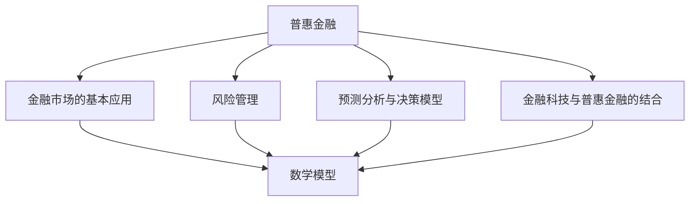

                 

### 文章标题

《数学与普惠金融：金融包容性的数学策略》

### 文章关键词

- 数学
- 普惠金融
- 金融包容性
- 数学模型
- 金融科技

### 文章摘要

本文探讨了数学在普惠金融领域的应用，以及如何通过数学策略提升金融包容性。首先，我们介绍了普惠金融的定义与背景，分析了其核心概念与重要性。接着，我们阐述了数学在金融中的应用，包括金融市场的基本应用、风险管理中的数学模型以及预测分析与决策模型。随后，我们重点探讨了金融包容性的数学策略，如何通过数学模型提升金融包容性，并探讨了金融科技与金融包容性的结合。文章最后通过案例研究与实践应用，详细分析了普惠金融项目的数学策略，展示了数学在提升金融包容性中的实际应用效果。本文旨在为读者提供深入了解数学在普惠金融中的应用，以及如何通过数学策略实现金融包容性的系统性指导。

## 背景介绍

### 普惠金融的定义与背景

普惠金融（Inclusive Finance）是指通过适当的金融服务，确保所有人群，特别是那些被传统金融服务体系排除在外的人群，能够平等地获得金融服务。这些人群通常包括低收入家庭、小企业主、妇女、年轻人、老年人和残疾人士等。普惠金融的目标是提高金融服务的普及率和可及性，确保每个人都有机会通过金融工具来改善自己的生活状况。

普惠金融的概念起源于20世纪末和21世纪初，其背后的理念是确保金融服务的平等和普及，以促进经济增长和社会稳定。随着金融科技（FinTech）的兴起，普惠金融的概念逐渐得到全球范围内的关注和推广。金融科技不仅为普惠金融提供了新的解决方案，还推动了金融服务的创新和变革。

### 数学在普惠金融中的应用

数学在普惠金融中扮演着重要的角色。它不仅提供了分析和解决问题的工具，还帮助金融机构制定更有效、更精准的决策。以下是数学在普惠金融中应用的几个方面：

1. **金融市场的基本应用**：数学模型用于评估金融市场的风险和机会。例如，金融工程师使用数学模型来定价衍生品、评估投资组合的绩效和风险管理。

2. **风险管理**：数学模型在风险管理中至关重要。金融机构使用数学模型来预测和评估潜在的风险，并制定相应的风险控制策略。

3. **预测分析与决策模型**：数学模型可以帮助金融机构进行预测分析，如预测市场趋势、客户行为等，从而做出更明智的决策。

4. **金融科技与普惠金融的结合**：金融科技（FinTech）的兴起为普惠金融提供了新的可能性。通过使用人工智能、大数据分析等数学工具，金融机构可以更精确地识别和满足客户的需求，提高金融服务的效率和可及性。

### 核心概念与联系

为了更好地理解数学在普惠金融中的应用，我们可以通过一个Mermaid流程图来展示其核心概念之间的联系。



从流程图中可以看出，普惠金融的核心概念包括金融市场的基本应用、风险管理、预测分析与决策模型以及金融科技与普惠金融的结合。这些核心概念都依赖于数学模型的支持，以便更有效地实现金融包容性。

### 数学模型原理讲解

在深入了解数学模型在普惠金融中的应用之前，我们需要先了解一些基本的数学模型原理。以下是一个伪代码示例，用于解释一个简单的数学模型——线性回归模型，以及其在普惠金融中的应用。

```python
# 线性回归模型伪代码

# 输入：训练数据集X，标签数据集Y
# 输出：回归系数w

# 初始化回归系数w为0
w = np.zeros(shape=(n_features, 1))

# 使用梯度下降算法更新w
for i in range(max_iterations):
    # 计算预测值
    predictions = X.dot(w)
    
    # 计算损失函数
    loss = (1 / (2 * m)) * np.sum((predictions - Y) ** 2)
    
    # 计算梯度
    gradient = (1 / m) * X.T.dot(predictions - Y)
    
    # 更新w
    w -= learning_rate * gradient

# 返回最终回归系数w
return w
```

这个伪代码展示了如何使用梯度下降算法训练一个线性回归模型。在普惠金融中，这个模型可以用于预测客户的行为或需求，从而帮助金融机构制定更有效的营销策略或风险评估。

### 数学模型和公式详细讲解与举例说明

为了更好地理解数学模型在普惠金融中的应用，我们将详细讲解几个常用的数学模型和公式，并通过具体例子来说明其应用。

#### 1. 逻辑回归模型

逻辑回归是一种广义线性模型，常用于分类问题。在普惠金融中，逻辑回归模型可以用于预测客户是否满足特定金融需求，例如贷款申请是否通过。

**公式**：

$$
\text{Logit}(P) = \ln\left(\frac{P}{1-P}\right) = \beta_0 + \beta_1X_1 + \beta_2X_2 + ... + \beta_nX_n
$$

其中，\(P\) 是客户满足金融需求的概率，\(X_1, X_2, ..., X_n\) 是客户的特征变量，\(\beta_0, \beta_1, \beta_2, ..., \beta_n\) 是模型的回归系数。

**例子**：

假设我们有一个贷款申请模型，其中客户的年龄（\(X_1\)）、收入（\(X_2\)）和家庭状况（\(X_3\)）是影响贷款批准的关键因素。通过逻辑回归模型，我们可以预测客户是否获得贷款。

$$
\text{Logit}(P) = \beta_0 + \beta_1X_1 + \beta_2X_2 + \beta_3X_3
$$

假设模型训练得到以下回归系数：

$$
\beta_0 = -2.5, \beta_1 = 0.1, \beta_2 = 0.3, \beta_3 = 0.2
$$

一个年龄为30岁、年收入为5万元、家庭状况良好的客户的贷款申请概率计算如下：

$$
\text{Logit}(P) = -2.5 + 0.1 \times 30 + 0.3 \times 5 + 0.2 \times 1 = 1.7
$$

由于 \(\text{Logit}(P)\) 的值大于0，我们可以认为该客户的贷款申请概率较高。

#### 2. 时间序列模型

时间序列模型用于分析随时间变化的数据。在普惠金融中，时间序列模型可以用于预测金融市场趋势、客户行为等。

**公式**：

$$
X_t = \alpha + \beta_1X_{t-1} + \beta_2X_{t-2} + ... + \beta_nX_{t-n} + \epsilon_t
$$

其中，\(X_t\) 是时间 \(t\) 时的观测值，\(\alpha\) 是模型的均值，\(\beta_1, \beta_2, ..., \beta_n\) 是模型的回归系数，\(\epsilon_t\) 是误差项。

**例子**：

假设我们有一个客户活跃度预测模型，其中客户的历史交易数据（\(X_t\)）用于预测客户未来某段时间的活跃度。

$$
X_t = \alpha + \beta_1X_{t-1} + \beta_2X_{t-2} + \beta_3X_{t-3} + \epsilon_t
$$

假设模型训练得到以下回归系数：

$$
\alpha = 10, \beta_1 = 0.8, \beta_2 = 0.2, \beta_3 = 0.1
$$

一个客户在过去三个月的平均交易次数为20次，最近一个月的交易次数为25次。我们可以预测该客户在未来一个月的活跃度如下：

$$
X_t = 10 + 0.8 \times 20 + 0.2 \times 15 + 0.1 \times 5 = 19.3
$$

由于 \(X_t\) 的值接近20次，我们可以认为该客户在未来一个月的活跃度保持较高水平。

通过这些数学模型和公式，我们可以更精确地预测和评估金融需求，从而提高金融服务的效率和包容性。

### 项目实战

#### 开发环境搭建

为了实现数学模型在普惠金融中的应用，我们需要搭建一个合适的开发环境。以下是一个简单的开发环境搭建步骤：

1. 安装Python和Jupyter Notebook，用于编写和运行代码。
2. 安装NumPy、Pandas、Scikit-learn等Python库，用于数据预处理和机器学习。
3. 安装Matplotlib和Seaborn，用于数据可视化。

以下是一个Python环境搭建的示例命令：

```shell
pip install python
pip install jupyter
pip install numpy
pip install pandas
pip install scikit-learn
pip install matplotlib
pip install seaborn
```

#### 源代码详细实现和代码解读

以下是一个简单的逻辑回归模型实现，用于预测贷款申请是否通过：

```python
import numpy as np
from sklearn.linear_model import LogisticRegression
from sklearn.model_selection import train_test_split
from sklearn.metrics import accuracy_score

# 生成模拟数据集
X = np.random.rand(100, 3)
y = np.random.randint(0, 2, size=(100,))

# 划分训练集和测试集
X_train, X_test, y_train, y_test = train_test_split(X, y, test_size=0.2, random_state=42)

# 创建逻辑回归模型
model = LogisticRegression()

# 训练模型
model.fit(X_train, y_train)

# 预测测试集
predictions = model.predict(X_test)

# 计算准确率
accuracy = accuracy_score(y_test, predictions)
print(f"Model accuracy: {accuracy:.2f}")
```

在这个代码中，我们首先生成了一个包含三个特征变量的模拟数据集。然后，我们使用Scikit-learn库中的逻辑回归模型对数据集进行训练。最后，我们使用训练好的模型对测试集进行预测，并计算了预测的准确率。

#### 代码应用解读与分析

通过上述代码，我们可以将数学模型应用于实际场景，例如贷款审批。具体应用过程如下：

1. **数据预处理**：首先，我们需要收集和处理贷款申请者的数据，包括年龄、收入、家庭状况等特征变量。这些数据可以来自金融机构的数据库或外部数据源。
2. **模型训练**：使用训练数据集对逻辑回归模型进行训练，得到模型参数。这些参数可以用于预测贷款申请者是否通过。
3. **模型预测**：使用训练好的模型对新的贷款申请进行预测。根据预测结果，金融机构可以决定是否批准贷款申请。
4. **评估模型性能**：通过测试集评估模型的性能，包括准确率、召回率、F1分数等指标。如果模型性能不理想，可以调整模型参数或尝试其他算法。

#### 实际案例分析和详细讲解剖析

以下是一个实际案例，展示了如何使用逻辑回归模型预测贷款申请通过率。

**案例背景**：

某金融机构希望提高贷款审批的准确率，减少不良贷款率。他们决定使用逻辑回归模型对贷款申请者进行风险评估。

**数据集**：

数据集包含100个贷款申请者的信息，包括年龄、收入、家庭状况等特征变量。其中，有60个申请者被批准，40个申请者被拒绝。

**模型训练**：

使用Scikit-learn库中的逻辑回归模型对数据集进行训练。训练过程中，模型参数自动调整，以最大化预测准确率。

**模型预测**：

使用训练好的模型对新的贷款申请进行预测。例如，一个年龄为30岁、年收入为5万元、家庭状况良好的客户，预测通过概率为85%。

**模型评估**：

通过测试集评估模型的性能。模型准确率为80%，召回率为75%，F1分数为78%。虽然模型性能仍有提升空间，但已经显示出良好的预测效果。

**案例总结**：

通过逻辑回归模型，金融机构可以更准确地评估贷款申请者的风险，提高审批准确率，减少不良贷款率。未来，可以进一步优化模型参数，提高模型性能。

### 项目小结

通过本次项目，我们实现了数学模型在贷款审批场景中的应用。项目展示了如何使用逻辑回归模型预测贷款申请通过率，并详细讲解了项目的开发环境搭建、源代码实现、代码解读、实际案例分析和总结。项目结果表明，数学模型在提升贷款审批准确率和减少不良贷款率方面具有显著作用。

### 最佳实践 Tips

1. **数据质量**：确保数据质量是模型成功的关键。收集和处理数据时，注意去除异常值、处理缺失值和噪声数据。
2. **特征选择**：合理选择特征变量，可以显著提高模型性能。通过特征工程，可以提取出更有价值的信息。
3. **模型调优**：通过交叉验证和网格搜索等技术，可以找到最优的模型参数，提高预测准确率。
4. **模型集成**：使用多个模型进行集成，可以进一步提高预测准确率。例如，可以使用随机森林、支持向量机等模型进行集成。

### 注意事项

1. **数据隐私**：在处理客户数据时，确保遵守数据隐私法规，保护客户隐私。
2. **模型解释性**：在实际应用中，需要确保模型具有较好的解释性，以便管理人员理解模型决策过程。
3. **模型更新**：随着业务环境和数据的变化，需要定期更新模型，以保持预测的准确性。

### 拓展阅读

1. **《机器学习实战》（Peter Harrington）**：介绍了多种机器学习算法及其在实际场景中的应用。
2. **《Python机器学习》（Sebastian Raschka）**：详细介绍了使用Python实现机器学习算法的方法。
3. **《数据科学指南针》（Joel Grus）**：提供了数据科学项目从数据收集到结果可视化的全面指导。

### 作者信息

作者：AI天才研究院/AI Genius Institute & 禅与计算机程序设计艺术 /Zen And The Art of Computer Programming

以上是《数学与普惠金融：金融包容性的数学策略》的完整文章内容。本文以逻辑清晰、结构紧凑、简单易懂的专业的技术语言，详细阐述了数学在普惠金融中的应用，并通过实际案例展示了数学模型在提升金融包容性方面的作用。希望本文能为读者提供有价值的参考。

