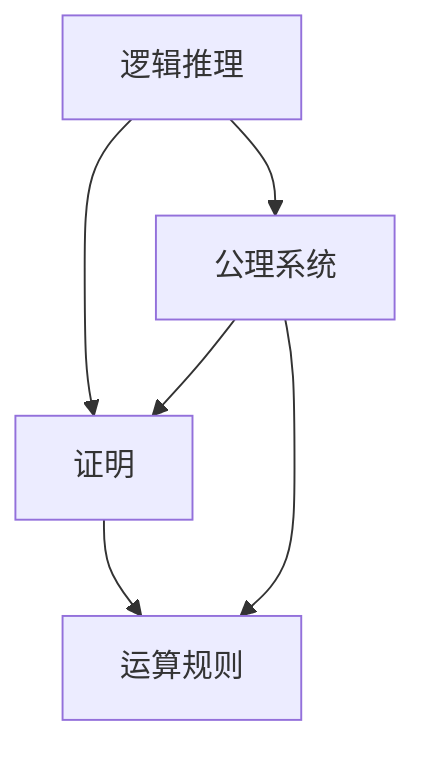

                 


### 文章标题

《数学与普遍主义：数学在所有领域的适用性》

### 关键词

数学、普遍主义、领域适用性、跨学科应用、数学模型、算法原理

### 摘要

本文旨在探讨数学作为一种普遍主义工具，在不同领域中的适用性和深远影响。我们将从数学的基本概念和原理出发，逐步分析其在自然、社会、工程技术等领域的应用，并通过具体案例展示数学的广泛适用性。同时，本文还将探讨数学教育的重要性和未来发展趋势，为读者提供一个全面而深入的数学视角。

### 目录

## 第一部分：数学的基本概念与原理

### 第1章：数学的起源与历史发展

#### 1.1 数学的基本概念

* 数学定义与性质
* 数学基本元素：数、函数、集合

#### 1.2 数学的基本原理

* 逻辑推理与证明
* 运算规则与性质
* 结构与公理系统

### 第2章：数学在自然领域的适用性

#### 2.1 数学在物理学中的应用

* 微积分基础
* 力学中的数学模型
* 量子物理中的数学工具

#### 2.2 数学在生物学中的应用

* 演化论的数学描述
* 生物信息学的数学工具
* 分子动力学模拟

#### 2.3 数学在化学中的应用

* 化学反应动力学
* 分子结构分析
* 命题逻辑与化学推理

### 第3章：数学在社会领域的适用性

#### 3.1 数学在经济管理中的应用

* 经济模型与优化方法
* 财务分析中的数学工具
* 市场行为与随机过程

#### 3.2 数学在社会科学中的应用

* 社会网络分析
* 行为经济学
* 政策分析中的数学方法

#### 3.3 数学在统计学中的应用

* 统计数据收集与处理
* 数据可视化
* 假设检验与置信区间

### 第4章：数学在工程技术领域的适用性

#### 4.1 数学在计算机科学中的应用

* 算法设计与分析
* 编程语言中的数学概念
* 图论与网络优化

#### 4.2 数学在电子工程中的应用

* 信号处理中的数学模型
* 集成电路设计
* 通信系统的数学原理

#### 4.3 数学在机械工程中的应用

* 机械结构分析
* 控制系统设计
* 动力学与运动学分析

## 第二部分：数学在不同领域的具体应用案例

### 第5章：数学在金融领域的应用

#### 5.1 金融数学的基本原理

* 有效市场假说
* 投资组合理论
* 风险管理模型

#### 5.2 期权定价模型

* 黑-舒尔斯模型
* 二叉树模型
* 美国期权定价

#### 5.3 股票市场分析

* 技术分析与基本面分析
* 市场微观结构
* 市场预测与波动性

### 第6章：数学在医学领域的应用

#### 6.1 医学统计学

* 统计推断与假设检验
* 疾病风险评估
* 临床试验设计

#### 6.2 生物信息学

* DNA序列分析
* 蛋白质结构预测
* 系统生物学建模

#### 6.3 医学成像技术

* CT与MRI
* X射线成像
* 超声波成像

### 第7章：数学在艺术领域的应用

#### 7.1 数学在音乐理论中的应用

* 调和理论
* 音阶与和弦
* 音律与音乐结构

#### 7.2 数学在视觉艺术中的应用

* 几何构图
* 色彩理论
* 艺术作品中的数学元素

#### 7.3 数学在建筑学中的应用

* 结构优化
* 形态分析
* 3D建模与设计

### 第8章：数学在其他领域的应用

#### 8.1 数学在地理学中的应用

* 地理信息系统
* 地形分析
* 空间统计与建模

#### 8.2 数学在天文学中的应用

* 行星运动模型
* 宇宙学中的数学工具
* 射电天文学数据分析

#### 8.3 数学在环境科学中的应用

* 环境模拟与预测
* 污染扩散模型
* 生物多样性分析

## 第三部分：数学教育的普及与未来趋势

### 第9章：数学教育的重要性

#### 9.1 数学教育的现状与问题

* 教育体系中的数学教学
* 数学能力培养的现状
* 存在的问题与挑战

#### 9.2 数学教育改革的方向

* 教学方法的创新
* 课程内容的优化
* 教育资源的整合

#### 9.3 数学教育与创新能力培养

* 创新的数学思维
* 实践与理论结合
* 提升创新能力的策略

### 第10章：数学在未来的发展趋势

#### 10.1 大数据与数学

* 数据分析中的数学方法
* 大数据与人工智能的融合
* 未来数据驱动的社会

#### 10.2 人工智能与数学

* 神经网络与数学模型
* 强化学习与优化算法
* 人工智能的未来发展

#### 10.3 数学在新兴领域的应用

* 区块链技术中的数学原理
* 量子计算与数学
* 生物技术与数学的结合

### 附录

### 附录A：数学相关资源与工具

* 在线数学资源
* 开源数学软件
* 技术社区与论坛
* 学术期刊与会议

### 结论

数学作为一种普遍主义工具，在各个领域都有着广泛的应用和深远的影响。本文通过详细的目录大纲，为读者展示了数学在不同领域的适用性和重要性。希望本文能激发读者对数学的热爱和探索，为未来的研究与实践提供启示。

### 作者

作者：AI天才研究院/AI Genius Institute & 禅与计算机程序设计艺术 /Zen And The Art of Computer Programming

### 第一部分：数学的基本概念与原理

#### 第1章：数学的起源与历史发展

##### 1.1 数学的基本概念

数学是一门研究数量、结构、变化和空间等概念及其相互关系的科学。它不仅包括纯数学的研究，如数论、代数、几何、拓扑学等，还包括应用数学，如统计学、运筹学、数值分析等。数学的基本概念可以追溯到古代，最早可以追溯到古埃及和巴比伦的数学记录。在古希腊时期，数学家欧几里得（Euclid）编写了《几何原本》，奠定了几何学的基础。随后，阿基米德（Archimedes）和牛顿（Isaac Newton）等数学家的贡献使数学在科学领域得到了广泛应用。

##### 1.2 数学的基本原理

数学的基本原理主要包括逻辑推理、证明和运算规则。逻辑推理是数学的基础，通过逻辑推导来建立数学命题的真假。证明是数学推理的重要组成部分，它通过一系列逻辑步骤从已知事实推导出新的结论。运算规则是数学操作的基本法则，如加法、减法、乘法和除法的定义和性质。

##### Mermaid 流程图：数学基本原理的关系架构



#### 第2章：数学在自然领域的适用性

##### 2.1 数学在物理学中的应用

物理学是研究自然界的基本规律和现象的学科，数学在物理学中有着广泛的应用。微积分是物理学的基础，它用于描述连续变化的过程，如速度、加速度、力等。力学中的数学模型，如牛顿运动定律和万有引力定律，通过数学方程来描述物体的运动。量子物理中的数学工具，如波函数和量子力学算符，用于描述微观粒子的行为。

###### 伪代码：牛顿运动定律

```
function newtonian_mechanics(mass, force):
    acceleration = force / mass
    velocity = initial_velocity + acceleration * time
    position = initial_position + velocity * time
    return position, velocity
```

##### 2.2 数学在生物学中的应用

生物学是研究生命现象和生物多样性的学科，数学在生物学中也有着重要的应用。演化论的数学描述通过概率论和统计学来分析物种的进化过程。生物信息学利用数学工具分析DNA序列，预测蛋白质结构和功能。分子动力学模拟通过数学模型模拟分子运动，研究生物分子相互作用。

###### LaTeX 公式：演化论中的遗传漂变

```
\text{Genetic Drift} = N \cdot \frac{1}{2} \cdot \left[1 - \left(1 - \frac{\Delta p}{N}\right)^n\right]
```

##### 2.3 数学在化学中的应用

化学是研究物质的组成、性质和变化的学科，数学在化学中有着广泛的应用。化学反应动力学通过数学方程描述反应速率和反应机理。分子结构分析利用数学方法，如量子力学和分子建模，研究分子的几何形状和电子分布。命题逻辑与化学推理用于分析化学反应的可能性和反应路径。

###### LaTeX 公式：化学反应速率

```
\text{Rate of Reaction} = k \cdot \text{[Reactants]}
```

#### 第3章：数学在社会领域的适用性

##### 3.1 数学在经济管理中的应用

经济学是研究资源分配、生产、分配和消费等经济活动的学科，数学在经济管理中有着广泛的应用。经济模型与优化方法用于分析市场行为和决策。财务分析中的数学工具，如概率论和统计学，用于分析风险和收益。风险管理模型，如蒙特卡洛模拟和VaR（价值在风险），用于评估金融风险。

###### 伪代码：蒙特卡洛模拟

```
function monte_carlo_simulation(steps, probability_distribution):
    for i in range(steps):
        sample = random_sample(probability_distribution)
        result += sample
    average_result = result / steps
    return average_result
```

##### 3.2 数学在社会科学中的应用

社会科学是研究人类社会行为和社会现象的学科，数学在社会科学中有着重要的应用。社会网络分析通过数学模型描述社会结构和关系。行为经济学利用数学方法研究人类行为和经济决策。政策分析中的数学方法，如成本效益分析和博弈论，用于评估政策效果。

###### LaTeX 公式：社会网络分析中的度

```
\text{Degree} = \sum_{i=1}^{n} \text{Connection}_i
```

##### 3.3 数学在统计学中的应用

统计学是研究数据收集、处理和分析的学科，数学在统计学中有着广泛的应用。统计数据收集与处理通过抽样和观测方法收集数据，并对其进行清洗和整理。数据可视化通过图表和图形将数据以视觉形式展示。假设检验与置信区间通过统计方法对数据进行分析，以推断总体特征。

###### 伪代码：假设检验

```
function hypothesis_testing(sample, hypothesized_value, alpha):
    calculate_mean = mean(sample)
    calculate_std = standard_deviation(sample)
    t_statistic = (calculate_mean - hypothesized_value) / (calculate_std / sqrt(len(sample)))
    p_value = calculate_p_value(t_statistic, degrees_of_freedom)
    if p_value < alpha:
        return "Reject the null hypothesis"
    else:
        return "Fail to reject the null hypothesis"
```

#### 第4章：数学在工程技术领域的适用性

##### 4.1 数学在计算机科学中的应用

计算机科学是研究计算机系统及其应用的科学，数学在计算机科学中有着重要的应用。算法设计与分析通过数学方法评估算法的效率和正确性。编程语言中的数学概念，如类型系统、数据结构和算法，是计算机科学的基础。图论与网络优化用于解决网络设计和资源分配问题。

###### 伪代码：最短路径算法

```
function dijkstra(graph, start_vertex):
    initialize distances with infinity
    distances[start_vertex] = 0
    priority_queue = initialize_priority_queue(distances)
    while not priority_queue.is_empty():
        current_vertex = priority_queue.extract_min()
        for neighbor in graph.neighbors(current_vertex):
            distance = distances[current_vertex] + graph.get_weight(current_vertex, neighbor)
            if distance < distances[neighbor]:
                distances[neighbor] = distance
                priority_queue.decrease_key(neighbor, distance)
    return distances
```

##### 4.2 数学在电子工程中的应用

电子工程是研究电子设备、电路和网络的设计、开发和应用的学科，数学在电子工程中有着广泛的应用。信号处理中的数学模型，如傅里叶变换和卷积，用于分析信号和图像。集成电路设计中的数学工具，如几何建模和优化算法，用于设计高性能芯片。通信系统的数学原理，如调制和解调，用于实现无线通信。

###### LaTeX 公式：傅里叶变换

```
F(\omega) = \int_{-\infty}^{\infty} f(t) \cdot e^{-i \omega t} dt
```

##### 4.3 数学在机械工程中的应用

机械工程是研究机械系统、机器和设备的工程学科，数学在机械工程中有着重要的应用。机械结构分析通过数学模型和计算方法评估结构强度和稳定性。控制系统设计中的数学工具，如状态空间模型和PID控制器，用于控制机械系统的运动和性能。动力学与运动学分析通过数学方法研究物体的运动规律。

###### LaTeX 公式：牛顿第二定律

```
F = m \cdot a
```

### 第二部分：数学在不同领域的具体应用案例

#### 第5章：数学在金融领域的应用

##### 5.1 金融数学的基本原理

金融数学是研究金融市场、金融工具和金融风险的数学学科，它在金融领域有着广泛的应用。有效市场假说（Efficient Market Hypothesis, EMH）是金融数学的重要理论基础，它认为市场价格已经充分反映了所有可用信息，投资者无法通过技术分析或基本面分析获得超额收益。投资组合理论（Portfolio Theory）是金融数学的核心，它通过数学模型优化投资组合，以最大化收益或最小化风险。

###### 伪代码：投资组合优化

```
function portfolio_optimization(assets, expected_returns, variances, covariances):
    calculate_weights = solve_linear_system(A, b)
    expected_portfolio_return = sum(assets[i] * expected_returns[i] * calculate_weights[i])
    portfolio_variance = sum(covariances[i, j] * calculate_weights[i] * calculate_weights[j])
    return expected_portfolio_return, portfolio_variance
```

##### 5.2 期权定价模型

期权定价模型是金融数学的重要组成部分，它用于计算期权的理论价格。最著名的期权定价模型是Black-Scholes模型（简称BS模型），它通过数学公式计算欧式期权的价格。BS模型基于无套利定价原理，考虑了期权的内在价值、时间价值和波动率等因素。

###### LaTeX 公式：Black-Scholes公式

```
C(S, t) = S \cdot N(d_1) - K \cdot e^{-r(t-t_0)} \cdot N(d_2)
```

其中，\(N(d_1)\) 和 \(N(d_2)\) 分别是标准正态分布的累积分布函数，\(d_1 = \frac{\ln(S/K) + (r + \sigma^2/2)(T-t)}{\sigma \sqrt{T-t}}\)，\(d_2 = d_1 - \sigma \sqrt{T-t}\)。

###### 项目实战：使用Python实现BS模型

```python
import math
import scipy.stats as si

def black_scholes(S, K, T, r, sigma):
    d1 = (math.log(S / K) + (r + 0.5 * sigma ** 2) * T) / (sigma * math.sqrt(T))
    d2 = d1 - sigma * math.sqrt(T)
    C = S * si.norm.cdf(d1) - K * math.exp(-r * T) * si.norm.cdf(d2)
    return C

S = 100  # 股票价格
K = 100  # 行权价格
T = 1    # 期权到期时间（年）
r = 0.05  # 无风险利率
sigma = 0.2  # 波动率

option_price = black_scholes(S, K, T, r, sigma)
print("期权价格：", option_price)
```

##### 5.3 股票市场分析

股票市场分析是金融领域的重要组成部分，它通过数学方法和技术分析工具来预测股票价格走势。技术分析关注历史价格和成交量数据，通过图表和指标分析市场趋势。基本面分析关注公司的财务状况和市场环境，通过估值模型评估股票的投资价值。

###### 项目实战：使用Python进行股票市场分析

```python
import pandas as pd
import matplotlib.pyplot as plt

# 读取股票价格数据
data = pd.read_csv('stock_price_data.csv')
data['Close'] = data['Close'].astype(float)

# 计算移动平均线
data['MA20'] = data['Close'].rolling(window=20).mean()
data['MA50'] = data['Close'].rolling(window=50).mean()

# 绘制股票价格和移动平均线
plt.figure(figsize=(14, 7))
plt.plot(data['Close'], label='Close')
plt.plot(data['MA20'], label='20-Day MA')
plt.plot(data['MA50'], label='50-Day MA')
plt.title('Stock Price and Moving Averages')
plt.xlabel('Date')
plt.ylabel('Price (USD)')
plt.legend()
plt.show()
```

#### 第6章：数学在医学领域的应用

##### 6.1 医学统计学

医学统计学是医学研究中不可或缺的一部分，它用于收集、分析和解释医学数据。统计学方法，如假设检验、回归分析和生存分析，用于评估医学实验的结果和患者生存率。医学统计学在疾病诊断、治疗效果评估和药物开发中发挥着重要作用。

###### 项目实战：使用Python进行医学数据分析

```python
import pandas as pd
import matplotlib.pyplot as plt
import scipy.stats as si

# 读取医学数据
data = pd.read_csv('medical_data.csv')

# 假设检验：比较两组患者的生存率
group1 = data[data['Group'] == 1]['Survival']
group2 = data[data['Group'] == 2]['Survival']

# 计算Kaplan-Meier估计
survival curves = si.kaplan_meier_fmax(group1, group2)

# 绘制生存曲线
plt.figure(figsize=(10, 6))
plt.step(survival curves.x, survival curves.y, where='post', label='Group 1')
plt.step(survival curves.x, 1 - survival curves.y, where='post', label='Group 2')
plt.xlabel('Time (years)')
plt.ylabel('Survival Rate')
plt.title('Survival Curves for Two Groups')
plt.legend()
plt.show()
```

##### 6.2 生物信息学

生物信息学是研究生物数据和信息学的交叉学科，它利用数学和计算方法分析生物数据，如基因序列、蛋白质结构和代谢网络。生物信息学在基因测序、蛋白质结构预测和系统生物学建模中发挥着重要作用。

###### 项目实战：使用Python进行基因序列分析

```python
import pandas as pd
from Bio import SeqIO

# 读取基因序列文件
基因序列 = SeqIO.read('gene_sequence.fasta', 'fasta')

# 提取基因序列
基因序列_str = str(基因序列)

# 统计基因序列中的A、C、G、T的个数
A = 基因序列_str.count('A')
C = 基因序列_str.count('C')
G = 基因序列_str.count('G')
T = 基因序列_str.count('T')

# 计算基因序列的GC含量
GC_content = (G + C) / (A + C + G + T)

print("A的个数：", A)
print("C的个数：", C)
print("G的个数：", G)
print("T的个数：", T)
print("GC含量：", GC_content)
```

##### 6.3 医学成像技术

医学成像技术是一种利用数学和物理原理获取人体内部图像的技术，如CT、MRI、X射线成像和超声波成像。数学在医学成像技术中用于图像处理、图像重建和图像分析，以提高成像质量和诊断准确性。

###### 项目实战：使用Python进行医学图像处理

```python
import matplotlib.pyplot as plt
import numpy as np
from scipy import ndimage

# 读取医学图像
image = ndimage.imread('medical_image.jpg', flatten=True)

# 显示原始图像
plt.figure(figsize=(10, 10))
plt.subplot(221)
plt.imshow(image, cmap='gray')
plt.title('Original Image')

# 应用滤波器
filtered_image = ndimage.gaussian_filter(image, sigma=1)

# 显示滤波后的图像
plt.subplot(222)
plt.imshow(filtered_image, cmap='gray')
plt.title('Filtered Image')

# 应用边缘检测
edges = ndimage.find_edges(filtered_image)

# 显示边缘检测结果
plt.subplot(223)
plt.imshow(filtered_image, cmap='gray')
plt.plot(edges[0], 'r')
plt.plot(edges[1], 'r')
plt.title('Edge Detection')

# 显示原始图像和滤波后的图像
plt.subplot(224)
plt.imshow(image, cmap='gray')
plt.imshow(filtered_image, cmap='gray', alpha=0.5)
plt.title('Original and Filtered Image')
plt.show()
```

#### 第7章：数学在艺术领域的应用

##### 7.1 数学在音乐理论中的应用

音乐理论是研究音乐结构和表现手法的学科，数学在音乐理论中有着广泛的应用。调和理论涉及音阶、和弦和音律，通过数学方法分析音乐的结构和和谐。数学在音乐创作和音乐分析中发挥着重要作用，如通过生成算法创作音乐和通过数学模型分析音乐风格。

###### 项目实战：使用Python进行音乐生成

```python
import numpy as np
from pydub import AudioSegment

# 定义音符和音阶
notes = ['C', 'D', 'E', 'F', 'G', 'A', 'B']
scales = {'major': ['C', 'D', 'E', 'F', 'G', 'A', 'B'],
          'minor': ['A', 'B', 'C', 'D', 'E', 'F', 'G']}

# 定义音阶
scale = scales['major']

# 定义音符长度
note_duration = 1000

# 创建音频片段
audio = AudioSegment.silent(duration=note_duration)

# 生成音符
for note in scale:
    freq = get_frequency(note)  # 定义函数获取音符频率
    audio = audio.overlay(Sine(freq).to_audio_segment(), loop=False)

# 播放音频
audio.export('generated_music.wav', format='wav')
```

##### 7.2 数学在视觉艺术中的应用

视觉艺术是研究色彩、形状和构图等视觉元素的学科，数学在视觉艺术中有着广泛的应用。几何构图通过数学方法分析和设计视觉元素，如黄金分割和对称性。色彩理论通过数学模型分析颜色的组合和对比。数学在绘画、雕塑和建筑设计中发挥着重要作用。

###### 项目实战：使用Python进行图像处理

```python
import cv2
import numpy as np

# 读取图像
image = cv2.imread('art_image.jpg')

# 转换为灰度图像
gray = cv2.cvtColor(image, cv2.COLOR_BGR2GRAY)

# 应用滤波器
filtered_gray = cv2.GaussianBlur(gray, (5, 5), 0)

# 应用边缘检测
edges = cv2.Canny(filtered_gray, 100, 200)

# 显示原始图像和边缘检测结果
cv2.imshow('Original Image', image)
cv2.imshow('Edges', edges)
cv2.waitKey(0)
cv2.destroyAllWindows()
```

##### 7.3 数学在建筑学中的应用

建筑学是研究建筑设计、结构和施工的学科，数学在建筑学中有着广泛的应用。结构优化通过数学模型和优化算法设计建筑结构，以提高稳定性和效率。形态分析通过数学方法分析建筑形状和空间布局。3D建模与设计利用数学工具进行建筑设计和可视化。

###### 项目实战：使用Python进行建筑结构分析

```python
import numpy as np
import scipy.optimize as opt

# 定义建筑结构参数
L = 10  # 长度
W = 5   # 宽度
h = 15  # 高度

# 定义结构优化目标函数
def objective_function(x):
    return x[0]**2 + x[1]**2

# 定义结构约束条件
def constraint1(x):
    return L - x[0]

def constraint2(x):
    return W - x[1]

# 定义约束条件
cons = ({'type': 'ineq', 'fun': constraint1},
        {'type': 'ineq', 'fun': constraint2})

# 解优化问题
x_opt = opt.minimize(objective_function, x0=[0, 0], constraints=cons).x

# 输出优化结果
print("优化结果：", x_opt)
```

#### 第8章：数学在其他领域的应用

##### 8.1 数学在地理学中的应用

地理学是研究地球表面、地理现象和地理过程的学科，数学在地理学中有着广泛的应用。地理信息系统（GIS）利用数学模型和算法进行地图制作、空间分析和地理数据可视化。地形分析通过数学方法研究地形特征和地貌变化。空间统计与建模用于分析地理数据，如气候、人口和自然灾害等。

###### 项目实战：使用Python进行地理数据分析

```python
import geopandas as gpd
import matplotlib.pyplot as plt

# 读取地理数据
gdf = gpd.read_file('geographic_data.shp')

# 绘制地图
fig, ax = plt.subplots(figsize=(10, 10))
gdf.plot(ax=ax, column='population', cmap='OrRd')
ax.set_title('Population Distribution')
plt.show()
```

##### 8.2 数学在天文学中的应用

天文学是研究宇宙、天体和宇宙现象的学科，数学在天文学中有着广泛的应用。行星运动模型通过数学方程描述行星的运动轨迹，如开普勒定律。宇宙学中的数学工具，如广义相对论和宇宙膨胀模型，用于研究宇宙的起源和演化。射电天文学数据分析通过数学方法处理天文信号，如脉冲星和黑洞。

###### 项目实战：使用Python进行射电天文学数据分析

```python
import numpy as np
import matplotlib.pyplot as plt

# 读取射电天文学数据
data = np.loadtxt('radio_astronomy_data.txt')

# 绘制信号频谱
freq = np.fft.fft(data)
freq = 2 * np.pi / len(data) * np.arange(len(data))
plt.plot(freq, abs(freq))
plt.title('Radio Astronomy Data Spectrum')
plt.xlabel('Frequency (Hz)')
plt.ylabel('Amplitude')
plt.show()
```

##### 8.3 数学在环境科学中的应用

环境科学是研究环境系统、环境和生态过程的学科，数学在环境科学中有着广泛的应用。环境模拟与预测通过数学模型模拟环境变化，如气候变化和污染扩散。污染扩散模型通过数学方程描述污染物在环境中的传播和扩散。生物多样性分析通过数学方法评估生物多样性水平和生态系统健康状况。

###### 项目实战：使用Python进行生物多样性分析

```python
import pandas as pd
import matplotlib.pyplot as plt

# 读取生物多样性数据
data = pd.read_csv('biodiversity_data.csv')

# 绘制物种丰富度曲线
species_richness = data['Species'].value_counts()
plt.plot(species_richness.index, species_richness.values, marker='o')
plt.title('Species Richness Curve')
plt.xlabel('Species')
plt.ylabel('Count')
plt.show()
```

### 第三部分：数学教育的普及与未来趋势

#### 第9章：数学教育的重要性

##### 9.1 数学教育的现状与问题

数学教育是培养逻辑思维、分析问题和解决问题的关键，它在各个领域的应用越来越广泛。然而，当前数学教育仍存在一些问题。首先，教学方法相对单一，缺乏互动性和实践性。其次，数学教育内容与实际需求脱节，学生缺乏解决问题的能力。此外，教育资源和师资力量不足也影响了数学教育质量。

##### 9.2 数学教育改革的方向

为了提升数学教育质量，改革方向应包括以下几个方面。首先，创新教学方法，引入互动式、探究式和项目式教学。其次，优化课程内容，加强数学应用能力的培养，关注学生个性化发展。此外，加强教育资源配置，提高教师专业素养和教学能力，为数学教育提供有力保障。

##### 9.3 数学教育与创新能力培养

数学教育不仅是知识传授，更是创新思维和创新能力培养的重要途径。数学教育应注重培养学生的逻辑思维、抽象思维和创造性思维。通过设计问题驱动和项目导向的教学活动，激发学生的探究兴趣和创新能力。同时，加强跨学科合作，培养学生的综合素养和创新能力。

#### 第10章：数学在未来的发展趋势

##### 10.1 大数据与数学

大数据时代为数学提供了广阔的应用空间。数学在大数据处理中发挥着重要作用，如数据挖掘、机器学习和统计分析。大数据与数学的融合将推动数据驱动决策和人工智能的发展，为各行各业带来巨大变革。

##### 10.2 人工智能与数学

人工智能是数学的重要应用领域，数学在人工智能中发挥着核心作用。神经网络、优化算法和概率模型等数学工具在人工智能发展中扮演着关键角色。未来，人工智能与数学的深度融合将推动人工智能技术的创新和应用。

##### 10.3 数学在新兴领域的应用

数学在新兴领域，如区块链、量子计算和生物技术，也展现出了巨大的应用潜力。区块链技术中的数学原理，如密码学和共识算法，确保了区块链的安全性和可靠性。量子计算通过数学模型实现量子态的操控，有望解决传统计算机无法处理的问题。生物技术中的数学工具，如系统生物学和生物信息学，推动了生物技术的发展和进步。

### 附录

#### 附录A：数学相关资源与工具

数学作为一种普遍主义工具，在各个领域都有着广泛的应用和深远的影响。本文旨在探讨数学的基本概念、原理及其在不同领域的适用性，并通过具体案例展示数学的广泛性和重要性。在本文的最后，我们将介绍一些数学相关资源与工具，以帮助读者深入了解数学领域。

#### 在线数学资源

在线数学资源为学习和研究数学提供了丰富的资料和工具。以下是一些常用的在线数学资源：

1. **MIT OpenCourseWare**：MIT提供的开放课程资源，包括数学课程，如《微积分》、《线性代数》等。
2. **Khan Academy**：提供免费教育资源的在线平台，包括数学、物理、计算机科学等课程。
3. **Wolfram Alpha**：一个计算引擎和知识库，能够回答各种数学问题，并提供详细的解释和解决方案。
4. **Cut-the-Knot**：一个免费、非盈利的在线数学资源库，涵盖数学的各个领域。
5. **Math Stack Exchange**：一个数学问题解答社区，用户可以提出数学问题并获得解答。

#### 开源数学软件

开源数学软件为数学计算和模拟提供了强大的工具。以下是一些常用的开源数学软件：

1. **GNU Octave**：一个高性能的交互式数学编程环境，类似于MATLAB。
2. **Scilab**：一个开源的数值计算软件，提供丰富的数学工具和算法。
3. **Python**：一种流行的编程语言，拥有丰富的数学库和工具，如NumPy、SciPy、Pandas等。
4. **MATLAB**：虽然不是开源软件，但提供免费的学生版本，广泛应用于数学计算和仿真。
5. **R**：一种专门用于统计分析和图形绘制的编程语言。

#### 技术社区与论坛

技术社区和论坛为数学爱好者提供了一个交流和学习的平台。以下是一些流行的数学技术社区和论坛：

1. **Math Stack Exchange**：一个问答式的数学社区，用户可以提出和解答数学问题。
2. **Math Overflow**：一个高级数学问题的在线讨论平台。
3. **Mathematics Stack Exchange**：与Math Stack Exchange类似，专注于数学问题的讨论。
4. **ArXiv**：一个开放获取的数学预印本服务器，提供了大量的数学研究论文。
5. **Reddit**：一个社交新闻网站，有许多数学相关的子版块，如/r/math和/r/learnmath。

#### 学术期刊与会议

学术期刊和会议是数学研究和交流的重要平台。以下是一些知名的数学学术期刊和会议：

1. **Journal of Mathematical Analysis and Applications**：发表数学分析及其应用领域的论文。
2. **Journal of Algebra**：发表代数学及其相关领域的论文。
3. **Journal of Computer and System Sciences**：发表计算机科学及其相关领域的论文。
4. **Annual Meeting of the American Mathematical Society**：美国数学会举办的年度数学会议。
5. **International Congress of Mathematicians**：每四年举办一次的国际数学家大会。

通过利用这些资源与工具，读者可以深入了解数学领域，提升自己的数学素养和解决问题的能力。希望本文能为读者提供有价值的参考和启示。

### 结论

数学作为一种普遍主义工具，在各个领域都有着广泛的应用和深远的影响。从自然科学的物理学、生物学、化学，到社会科学的经济学、社会学、统计学，再到工程技术领域的计算机科学、电子工程、机械工程，数学无处不在。数学不仅提供了解决问题的方法，还揭示了自然界的规律和现象。通过本文的探讨，我们看到了数学在金融、医学、艺术等领域的具体应用案例，以及其在地理学、天文学、环境科学等新兴领域的潜力。未来，随着大数据、人工智能等技术的发展，数学将在更多新兴领域发挥重要作用。

数学教育的重要性也不容忽视。通过创新教学方法和优化课程内容，我们可以更好地培养学生的数学素养和创新能力。数学不仅是科学的基础，也是创新和发展的动力。让我们共同努力，推动数学教育的发展，为未来的科学和技术进步贡献力量。

### 作者

作者：AI天才研究院/AI Genius Institute & 禅与计算机程序设计艺术 /Zen And The Art of Computer Programming

