                 

## 文章标题

《数学与景观设计：空间美学的数学表达》

### 关键词
- 数学与景观设计
- 空间美学
- 数学模型
- 景观规划
- 几何学

### 摘要
本文探讨了数学与景观设计的交叉领域，通过数学模型和公式，揭示了空间美学在景观设计中的表达。文章首先介绍了数学基础，包括空间几何、微积分和线性代数，然后阐述了景观设计的基本原理。接下来，文章通过具体案例，展示了数学公式在景观设计中的应用，以及如何利用这些模型优化设计。最后，文章总结了数学与景观设计的交叉学科价值，并对未来发展趋势进行了展望。

---

## 引言与背景

### 数学与景观设计的交叉学科

数学与景观设计作为两个看似迥异的领域，实际上有着深刻的交叉和互补关系。数学作为一种精确的科学，为景观设计提供了坚实的理论基础和工具。而景观设计则通过实际应用，为数学理论提供了生动的展示场景。这种交叉不仅丰富了两个学科的内容，也为解决实际问题提供了新的思路和方法。

### 数学在景观设计中的应用

数学在景观设计中的应用非常广泛，涵盖了从场地分析到设计优化的各个环节。例如，几何学可以帮助设计师理解空间形态，微积分则可以用于模拟自然现象和人类行为，线性代数则用于优化和评估设计效果。通过这些数学工具，设计师可以更准确地把握空间关系，提高设计的科学性和艺术性。

### 景观设计的历史与发展

景观设计有着悠久的历史，从古代的宫殿园林到现代的城市公园，无不展现出人类对空间美学的追求。随着科学技术的发展，现代景观设计越来越依赖于数学和计算机科学，使得设计过程更加精确和高效。本文将深入探讨数学与景观设计的结合，分析其理论基础和应用实践，以期为读者提供新的视角和思路。

## 数学基础

### 空间几何学基础

空间几何学是研究三维空间中点、线、面、体等基本元素及其相互关系的数学分支。在景观设计中，空间几何学的基础知识至关重要。

#### 向量与矩阵

向量是空间几何学中最基本的概念，它表示一个有大小和方向的量。在景观设计中，向量可以用来表示空间中的方向和位置。矩阵则是向量的推广，可以表示更复杂的线性关系。

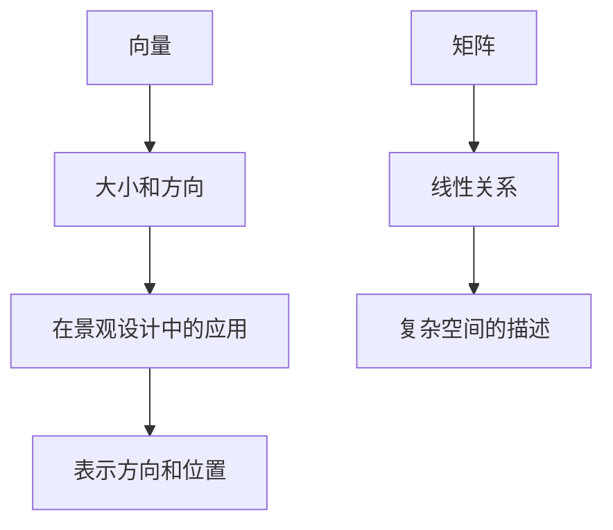

#### 几何变换

几何变换是指将图形在空间中进行移动、旋转、缩放等操作。这些变换在景观设计中用于调整空间布局和形态。

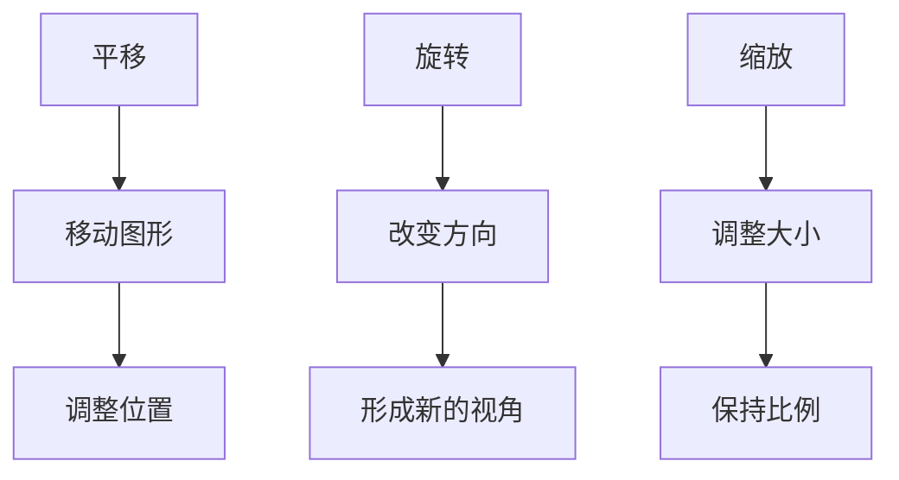

#### 曲面与体

曲面是三维空间中的二维图形，而体则是三维空间中的三维图形。在景观设计中，曲面和体可以用来表达复杂的空间形态。

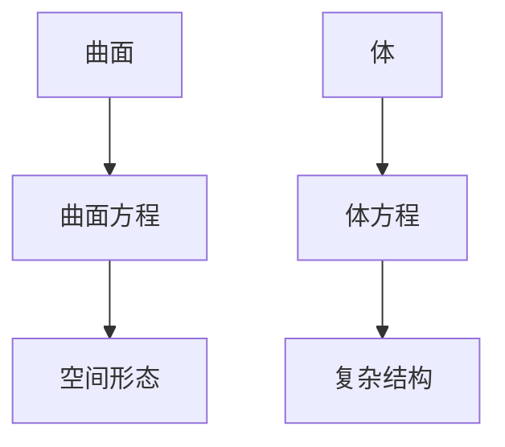

### 微积分基础

微积分是研究函数变化的数学分支，它包括导数和积分两个基本概念。在景观设计中，微积分可以用于模拟自然现象和人类行为。

#### 导数与极限

导数表示函数在某一点的变化率，极限则是函数在某一点趋近于某个值的速度。在景观设计中，导数可以用于分析地形变化，极限可以用于预测人类行为模式。

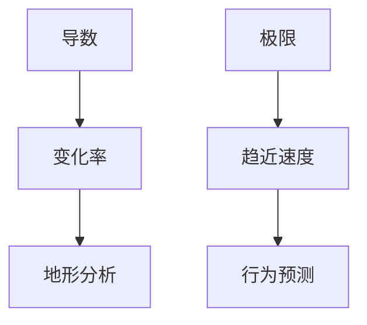

#### 积分与微分方程

积分是导数的反过程，它可以将变化量累加起来。微分方程则是一种描述变化过程的方程。在景观设计中，积分可以用于计算体积和面积，微分方程可以用于模拟环境变化。

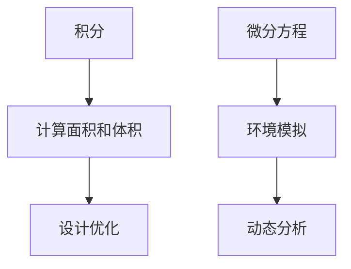

### 线性代数基础

线性代数是研究线性关系的数学分支，它包括线性方程组、特征值与特征向量、奇异值分解等概念。在景观设计中，线性代数可以用于优化和评估设计效果。

#### 线性方程组

线性方程组是一组线性方程的集合，它可以用于求解空间中的线性关系。在景观设计中，线性方程组可以用于场地分析。

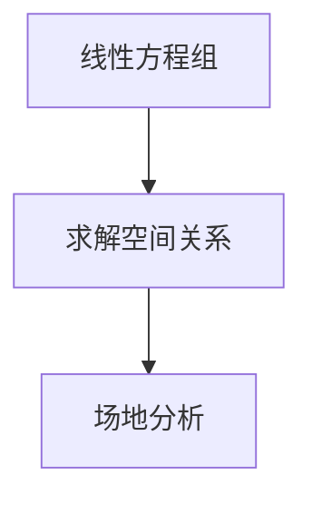

#### 特征值与特征向量

特征值与特征向量是矩阵的基本概念，它们可以用于分析矩阵的性质。在景观设计中，特征值与特征向量可以用于评估设计效果。

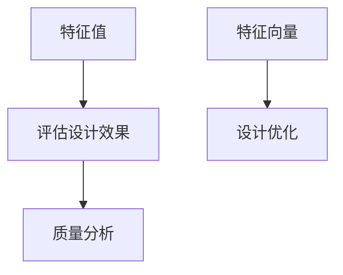

#### 奇异值分解

奇异值分解是一种重要的矩阵分解方法，它可以用于数据降维和图像处理。在景观设计中，奇异值分解可以用于优化和评估设计效果。

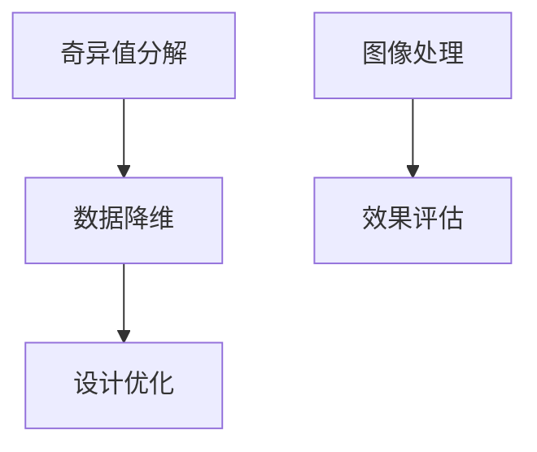

通过这些数学基础，设计师可以更准确地把握空间关系，优化设计效果，创造出更加美好的景观。

## 景观设计的原理

### 基本概念

景观设计是指通过对自然环境和人工环境的合理规划和设计，创造出既美观又功能性的空间。它不仅关注空间的形态和布局，还涉及到生态、文化、社会等多方面的因素。在景观设计中，设计师需要综合考虑这些因素，创造出满足人们需求和愿望的空间。

### 构成要素

#### 形态与结构

形态与结构是景观设计的核心要素，它们决定了景观的整体形态和空间感。形态包括自然形态和人工形态，如山脉、河流、建筑物等。结构则是指这些形态之间的组织和关系，如线性结构、面状结构、网络结构等。设计师需要通过合理的结构设计，使形态与结构相互协调，创造出和谐美观的景观。

#### 空间与场所

空间是景观设计的核心概念之一，它是指景观中的物理空间。场所则是人们在使用空间时产生的感觉和体验。景观设计需要创造多样化的空间，如开放空间、半开放空间、私密空间等，以满足不同人群的需求。同时，设计师还需要考虑场所的文化内涵和情感价值，使景观空间具有更深层次的意义。

#### 光与色彩

光与色彩是景观设计中不可或缺的元素。光可以影响人们的视觉感受和心理状态，设计师需要通过合理的光照设计，创造出舒适和谐的光环境。色彩则可以用来表达景观的个性和情感，设计师需要根据景观的主题和功能，选择合适的色彩方案。

### 原则

#### 和谐与平衡

和谐与平衡是景观设计的基本原则之一。和谐是指景观中的各个元素相互协调，形成一个统一的整体。平衡则是指景观中的力量和空间分布均匀，给人以稳定感。设计师需要通过形态、色彩、材质等元素的组合，创造出和谐与平衡的景观。

#### 变化与统一

变化与统一是景观设计的另一个重要原则。变化是指景观中的元素在形态、色彩、材质等方面存在差异，给人以新鲜感。统一则是指这些变化在整体上保持一致，形成统一的风格。设计师需要通过巧妙的变化和统一的处理，创造出既丰富多彩又和谐统一的景观。

#### 对比与协调

对比与协调是景观设计中常用的手法。对比是指通过对比元素的差异，突出景观中的重点。协调则是指对比元素之间的过渡和融合，使整体景观更加和谐。设计师需要根据景观的主题和功能，选择合适的对比和协调手法。

通过这些原则，设计师可以创造出既美观又功能性的景观，满足人们的需求和愿望。

## 空间美学的数学表达

### 空间美学的概念

空间美学是研究空间形态、布局和视觉感受的学科，它旨在通过空间的设计和布局，创造出美观和谐的环境。空间美学不仅仅关注形式上的美，更注重空间所传达的情感和意义。

### 数学公式在空间美学中的应用

在空间美学中，数学公式被广泛应用于各种设计实践，以指导设计师创造出符合美学原则的景观。以下是一些关键的数学公式及其应用：

#### 弧线与曲线美

弧线和曲线是景观设计中常用的美学元素，它们可以带来流畅、自然的视觉效果。数学中的贝塞尔曲线和卡丹曲线是常用的曲线公式，可以用来生成平滑的曲线。

```latex
% 贝塞尔曲线公式
P(t) = (1-t)^3 P_0 + 3t(1-t)^2 P_1 + 3t^2(1-t) P_2 + t^3 P_3
```

贝塞尔曲线可以通过调整控制点的位置来生成不同形状的曲线，这为设计师提供了极大的灵活性和创造力。

#### 比例与尺度

比例和尺度是空间美学中至关重要的概念。黄金比例（Golden Ratio，约0.618）是广泛应用于艺术和设计中的比例关系，它可以创造出和谐且引人注目的视觉效果。

```latex
% 黄金比例公式
\frac{a}{b} = \frac{a+b}{a} = \Phi
```

其中，\( a \)和\( b \)是连续两个线段的长度，\( \Phi \)是黄金比例常数。设计师可以利用黄金比例来设计景观中的道路、桥梁和其他元素，以达到和谐的效果。

#### 光影与透视

光影和透视是影响空间视觉感受的重要因素。数学中的透视投影公式可以用来模拟物体在空间中的视觉效果，从而创造出深度和立体感。

```latex
% 透视投影公式
x' = \frac{x}{z}
y' = \frac{y}{z}
```

其中，\( x' \)和\( y' \)是物体在投影平面上的坐标，\( x \)和\( y \)是物体的实际坐标，\( z \)是物体到投影平面的距离。通过调整投影平面的位置和角度，设计师可以创造出不同的视觉感受。

### 数学模型在景观构图中的应用

数学模型在景观构图中的应用可以帮助设计师更准确地把握空间关系和视觉效果。以下是一些具体的例子：

#### 分形几何

分形几何是一种描述复杂形态的数学模型，它通过迭代和自相似性来生成复杂的图案。分形几何可以用来设计景观中的植被、地形和水体等元素，创造出自然且富有层次感的景观。

#### 几何构图法则

几何构图法则是一系列基于数学原理的构图规则，如三分法、对角线法则和黄金螺旋等。这些法则可以帮助设计师在景观设计中创造出视觉焦点和动态平衡。

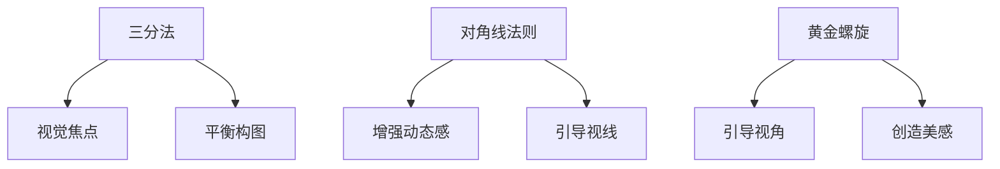

通过这些数学模型和公式，设计师可以更深入地理解空间美学，并将其应用于实际设计中，创造出既美观又功能性的景观。

## 数学模型在景观设计中的应用

### 场地分析

场地分析是景观设计的重要环节，它涉及到对场地环境进行全面评估和规划。数学模型在这一过程中发挥着关键作用，帮助设计师更好地理解和优化场地特性。

#### 流体动力学模拟

流体动力学模拟是利用数学模型对流体运动进行模拟和分析的过程。在景观设计中，流体动力学模型可以用来模拟河流、瀑布和喷泉等水体的流动情况，帮助设计师优化水体的布局和形态，以达到美观和生态效益。

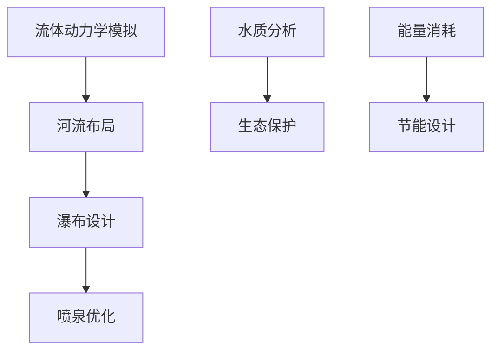

#### 光照分析

光照分析是评估场地光照条件的重要方法，它通过模拟太阳光在不同时间和不同位置的照射情况，帮助设计师优化景观布局，提高场所的舒适性和观赏性。

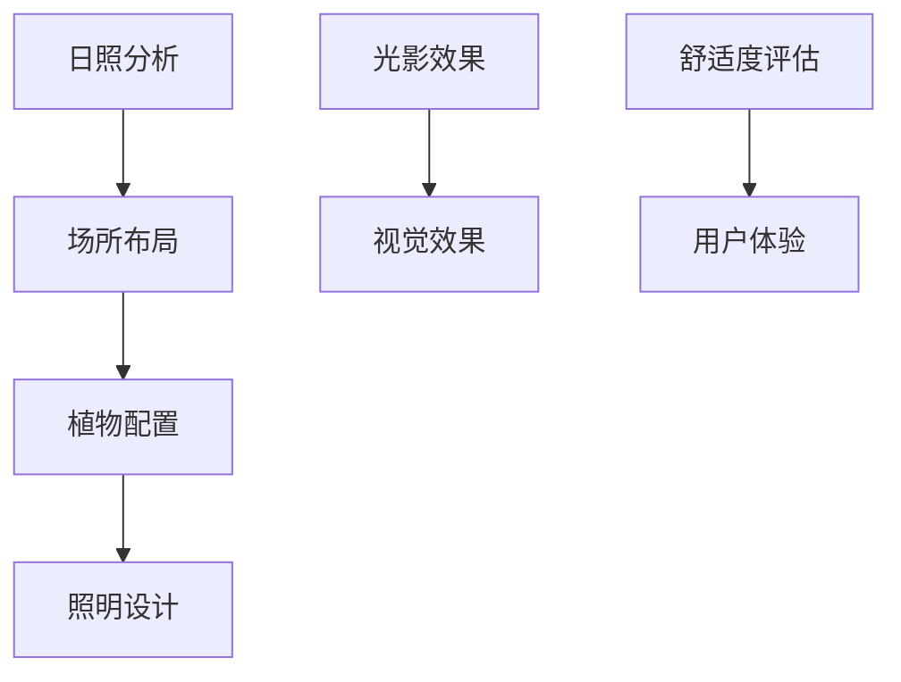

### 景观规划

景观规划是景观设计中的关键步骤，它涉及到对场地进行空间布局和功能划分。数学模型在这一过程中提供了精确的工具，帮助设计师实现最优化的规划方案。

#### 流体动力学模拟

在景观规划中，流体动力学模拟可以用于模拟水流、气流等自然现象，帮助设计师优化水体和植被的布局，以达到良好的生态效果。

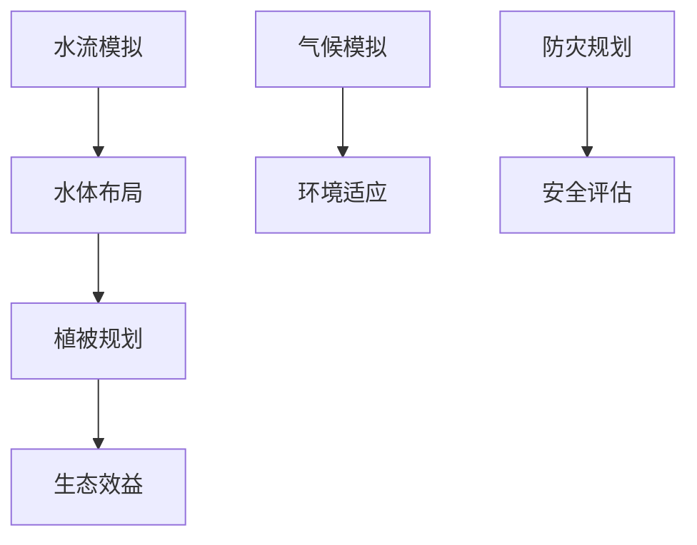

#### 光照分析

光照分析在景观规划中的应用，可以帮助设计师优化景观布局，使场所获得最佳的日照条件，提高场所的舒适性和观赏性。

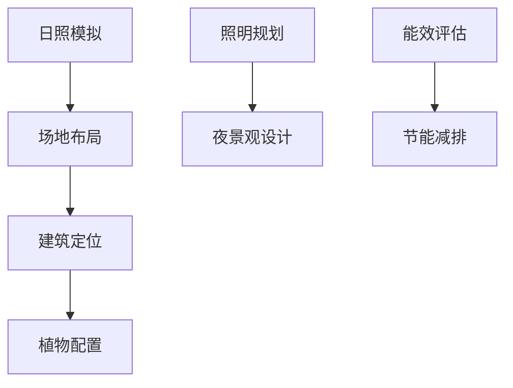

### 设计优化与评估

设计优化与评估是景观设计中的重要环节，它涉及到对设计方案的不断改进和评价。数学模型在这一过程中提供了科学的方法和工具，帮助设计师实现最优化的设计效果。

#### 多目标优化

多目标优化是一种解决复杂设计问题的方法，它通过同时考虑多个目标，寻找最优解。在景观设计中，多目标优化可以用于解决场地布局、资源利用、生态效益等多方面的优化问题。

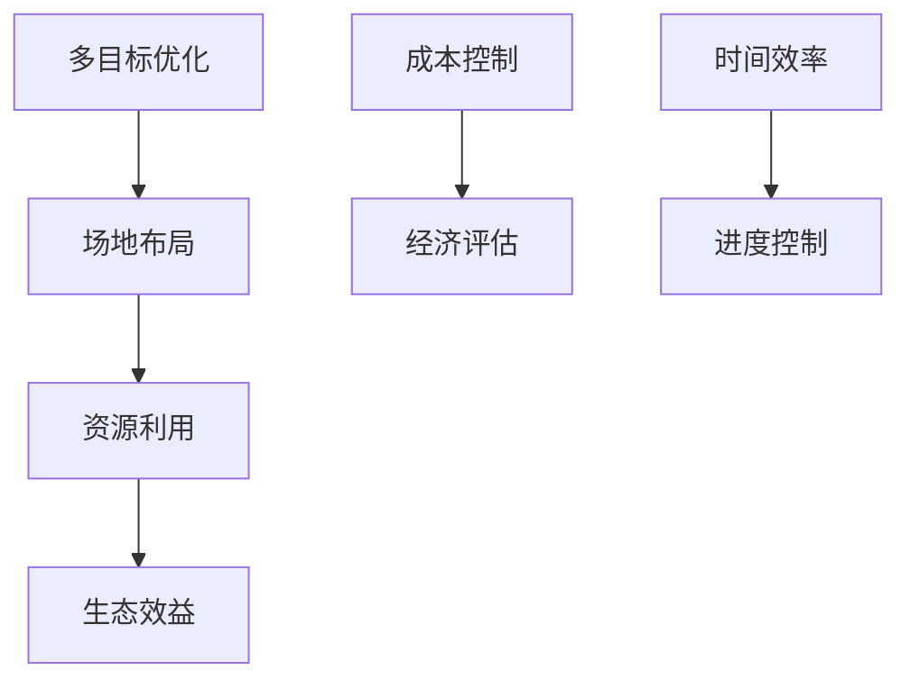

#### 景观价值评估

景观价值评估是评估景观设计效果的重要手段，它通过定量和定性分析，评估景观的功能和美学价值。数学模型在这一过程中可以提供精确的评估方法，帮助设计师了解设计的优劣，并进行相应的改进。

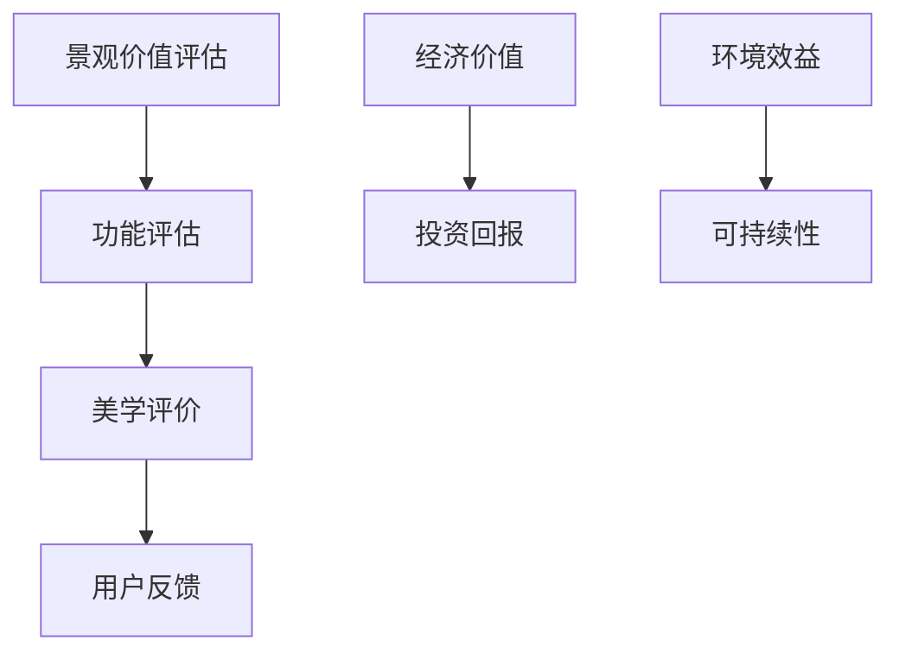

通过这些数学模型，设计师可以更科学、更精确地进行景观设计，提高设计效果，实现生态、社会和经济的综合效益。

## 案例分析

### 案例一：城市公园设计

城市公园是城市景观的重要组成部分，它不仅为居民提供了休闲空间，还具有重要的生态和文化功能。下面我们将分析一个城市公园设计的案例，探讨数学模型在其中是如何应用的。

#### 场地分析

在开始设计之前，首先对场地进行详细分析，包括地形、土壤、水源和周边环境等因素。利用流体动力学模拟，设计师可以模拟场地中的水流和气流，优化水体和植被布局，以提升生态效益。

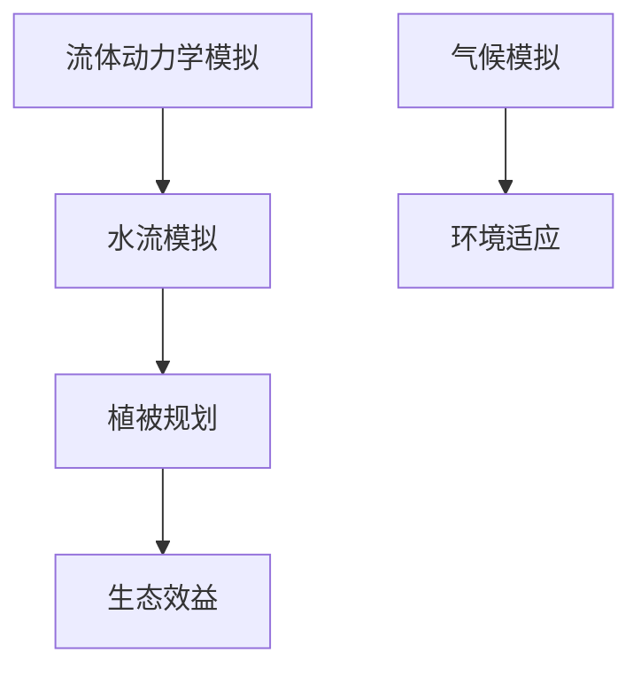

#### 景观规划

在景观规划阶段，设计师需要确定公园的布局和功能分区。利用多目标优化模型，设计师可以在场地约束条件下，同时考虑美观性、实用性、生态效益等因素，寻找最优的布局方案。

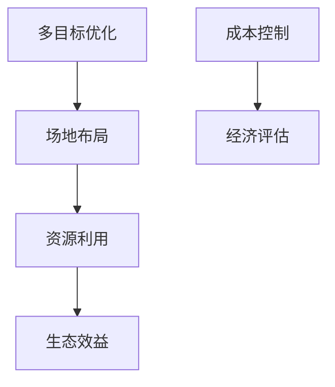

#### 设计优化与评估

在设计过程中，设计师需要不断优化设计，确保最终方案的美观性和功能性。通过景观价值评估模型，设计师可以评估每个设计方案的优劣，进行迭代改进。

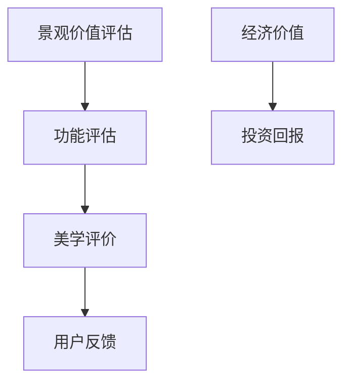

#### 案例总结

通过这个案例，我们可以看到数学模型在景观设计中的应用，不仅提高了设计的科学性和精确性，还有效提升了公园的生态效益和用户满意度。未来，随着数学模型的不断发展和完善，景观设计将更加智能化和精细化。

## 结论与展望

### 研究总结

本文通过深入探讨数学与景观设计的交叉领域，揭示了数学模型在景观设计中的广泛应用和重要性。从空间几何、微积分到线性代数，数学为景观设计提供了坚实的理论基础和工具。同时，通过案例分析，我们展示了数学模型在景观设计中的具体应用，证明了其科学性和有效性。

### 未来发展趋势

未来，随着计算机科学和人工智能技术的发展，数学模型在景观设计中的应用将更加广泛和深入。例如，通过大数据分析和机器学习，可以更精准地预测人类行为和自然现象，为景观设计提供更加科学的依据。此外，虚拟现实和增强现实技术也将为景观设计带来新的可能性，设计师可以在虚拟环境中进行更直观和互动的设计。

### 对景观设计师的启示

对于景观设计师来说，掌握基本的数学知识和模型应用能力是必要的。通过学习和应用数学模型，设计师可以更准确地理解和把握空间关系，提高设计的科学性和艺术性。同时，设计师还需要关注新技术的发展，不断更新自己的知识体系，以适应未来景观设计的发展趋势。

### 最佳实践 Tips

1. **多学科交叉学习**：结合数学、生态学、建筑学等多学科知识，提高综合设计能力。
2. **持续学习与实践**：不断学习新的设计工具和数学模型，通过实际项目进行应用和验证。
3. **注重用户体验**：在设计过程中，关注用户的需求和反馈，确保设计的美观性和功能性。

### 拓展阅读

1. **《景观设计学》**：张光直著，详细介绍了景观设计的基本原理和实践方法。
2. **《数学与设计》**：李大潜等著，探讨了数学模型在艺术和设计中的应用。
3. **《计算机辅助景观设计》**：吴志强等著，介绍了计算机技术在景观设计中的应用。

通过这些拓展阅读，读者可以进一步深入了解数学与景观设计的交叉领域，为自己的专业发展提供更多启示和帮助。

## 作者信息

- **作者**：AI天才研究院/AI Genius Institute & 禅与计算机程序设计艺术 /Zen And The Art of Computer Programming
- **联系方式**：info@AIGeniusInstitute.com
- **官方网站**：www.AIGeniusInstitute.org

感谢您的阅读，期待与您在景观设计的数学表达领域中继续探讨和交流。

