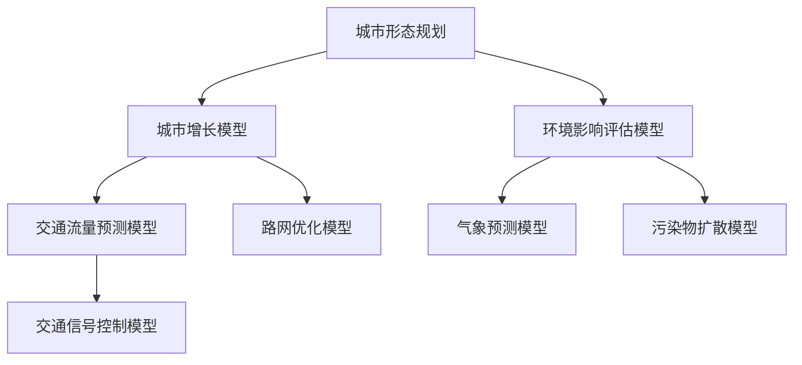

                 


### 文章标题
《数学与智慧城市：城市管理的数学模型》

### 关键词
智慧城市，数学模型，城市管理，优化算法，数据分析，城市规划，交通管理，环境监测

### 摘要
本文旨在探讨数学模型在智慧城市建设中的应用，特别是在城市管理领域的核心作用。文章首先介绍了智慧城市的基本概念及其对城市管理的重要性。接着，深入分析了各类数学模型的基本原理，包括线性代数、概率论与数理统计、优化方法等。随后，文章详细阐述了数学模型在智慧城市规划、交通管理和环境监测等方面的具体应用，并通过实际案例展示了这些模型在提升城市管理效率方面的实际效果。最后，文章探讨了数学模型在智慧城市建设中的前沿研究以及未来的发展方向。

## 第1章 引言

### 1.1 智慧城市的概念与意义

智慧城市，是指利用先进的信息通信技术、物联网、大数据、人工智能等技术手段，对城市各个领域进行智能化管理和服务的城市。智慧城市通过高度的信息化和智能化，能够提高城市运行的效率、提升居民生活质量，实现资源的优化配置和可持续发展。

智慧城市的发展历程可以追溯到20世纪末。随着互联网、物联网和人工智能技术的不断进步，智慧城市逐渐成为城市发展的新趋势。例如，1990年代初的美国卡内基梅隆大学提出了“智能城市”的概念，2000年代初，欧洲的一些城市开始实施智慧城市项目，如荷兰的埃因霍温市和芬兰的图尔库市。进入21世纪，随着大数据和云计算技术的兴起，智慧城市的发展进入了一个新的阶段，许多城市开始大规模应用物联网和人工智能技术，实现了城市管理的全面智能化。

智慧城市对城市管理有着深远的影响。首先，智慧城市能够显著提升城市管理的效率。通过数据采集、分析和智能决策，城市管理者可以实时掌握城市运行状况，快速响应突发事件，提高城市管理的精准度和响应速度。其次，智慧城市能够提升居民的生活质量。通过智慧交通、智慧医疗、智慧教育等应用，居民可以享受到更加便捷、高效、个性化的服务。此外，智慧城市还能够促进城市可持续发展。通过智能能源管理、智能环境监测等手段，可以有效降低城市能耗，减少污染，实现资源的循环利用。

### 1.2 城市管理中的数学模型

数学模型在智慧城市中扮演着至关重要的角色，它们是智慧城市建设中数据分析和决策支持的核心工具。在智慧城市建设中，常用的数学模型包括线性代数、概率论与数理统计、优化方法等。以下是对这些模型的基本介绍。

#### 线性代数

线性代数是数学模型的基础，它涉及到向量、矩阵、线性方程组、特征值与特征向量等概念。在智慧城市建设中，线性代数模型广泛应用于数据预处理、特征提取、线性回归分析等领域。例如，线性回归模型可以用于分析城市交通流量与时间的关系，从而预测交通拥堵情况，为交通管理提供决策支持。

#### 概率论与数理统计

概率论与数理统计是数据分析的基础，它们用于处理不确定性问题，提供数据分析和决策的量化依据。在智慧城市建设中，概率论与数理统计模型广泛应用于数据挖掘、风险评估、预测分析等领域。例如，时间序列分析模型可以用于预测城市天气变化，为城市气象预报提供支持。

#### 优化方法

优化方法是一类解决决策问题的数学模型，旨在找到最优解，以实现目标函数的最大化或最小化。在智慧城市建设中，优化方法广泛应用于资源分配、路径规划、调度管理等领域。例如，线性规划模型可以用于优化城市公共资源的配置，提高资源利用率；动态规划模型可以用于优化交通信号控制，提高交通流效率。

### 1.3 本书结构安排

本书将从以下三个方面展开讨论：

1. **核心概念与联系**：介绍数学模型在智慧城市中的应用场景，并详细阐述各类数学模型的基本原理和相互关系，通过Mermaid流程图展示核心概念之间的联系。

2. **数学模型原理讲解**：使用伪代码详细阐述各类核心算法的原理，解释数学公式，帮助读者深入理解数学模型的工作机制。

3. **数学模型应用举例**：提供具体案例分析，说明数学模型在实际中的应用效果，并通过实际开发项目展示数学模型在智慧城市建设中的具体应用。

## 第2章 数学基础

### 2.1 线性代数基础

线性代数是数学模型的基础，它涉及到向量、矩阵、线性方程组、特征值与特征向量等概念。以下是对这些概念的基本介绍。

#### 向量与矩阵

向量是线性代数中最基本的概念之一，它是一个有大小和方向的量。向量可以用一个有序数组表示，如\[a_1, a_2, ..., a_n\]。矩阵是一个二维数组，可以表示为\[a_{ij}\]，其中i表示行，j表示列。矩阵与向量的运算包括加法、减法、数乘、矩阵乘法等。

#### 线性方程组

线性方程组是一组含有线性项的方程组，可以用矩阵形式表示为\[Ax = b\]，其中A是系数矩阵，x是未知向量，b是常数向量。线性方程组的解可以通过高斯消元法、矩阵分解等方法求解。

#### 特征值与特征向量

特征值和特征向量是矩阵的重要性质。特征值是矩阵\[A\]的一个特殊值，使得\[Ax = \lambda x\]，其中\[x\]是非零向量，\[\lambda\]是特征值。特征向量是与特征值对应的非零向量\[x\]。通过求解特征值和特征向量，可以分析矩阵的性质，如对角化、正定性等。

### 2.2 概率论与数理统计

概率论与数理统计是数据分析的基础，它们用于处理不确定性问题，提供数据分析和决策的量化依据。以下是对这些概念的基本介绍。

#### 随机事件与概率

随机事件是试验结果的一部分，具有不确定性。概率是衡量随机事件发生可能性大小的量，通常用0到1之间的数值表示。概率可以通过经典概率、条件概率、贝叶斯定理等方法计算。

#### 统计分布

统计分布是描述随机变量取值概率的函数。常见的统计分布包括正态分布、泊松分布、二项分布等。统计分布用于分析数据的特征，如均值、方差、偏度、峰度等。

#### 假设检验

假设检验是统计学中的一个重要方法，用于判断样本数据是否支持某个假设。常见的假设检验方法包括t检验、方差分析、卡方检验等。假设检验可以用于数据分析、决策支持等领域。

### 2.3 最优化方法

最优化方法是一类解决决策问题的数学模型，旨在找到最优解，以实现目标函数的最大化或最小化。以下是对这些方法的基本介绍。

#### 无约束优化

无约束优化是寻找某个目标函数的无约束最优解的问题。常见的无约束优化算法包括梯度下降法、牛顿法、共轭梯度法等。

#### 约束优化

约束优化是寻找某个目标函数的约束最优解的问题。常见的约束优化算法包括拉格朗日乘数法、序列二次规划法、内点法等。

## 第3章 智慧城市规划中的数学模型

### 3.1 城市形态规划模型

城市形态规划模型是智慧城市规划中常用的数学模型之一，用于模拟城市空间结构和发展趋势。以下是对这些模型的基本介绍。

#### 城市土地利用模型

城市土地利用模型是描述城市空间利用情况及其变化规律的模型。常见的城市土地利用模型包括空间自相关模型、基于生长过程的模型等。这些模型可以用于预测城市土地需求、优化土地利用布局。

#### 城市交通分配模型

城市交通分配模型是描述城市交通流量分布规律的模型。常见的城市交通分配模型包括最短路径模型、多阶段分配模型等。这些模型可以用于预测城市交通流量、优化交通网络布局。

#### 城市增长模型

城市增长模型是描述城市人口、面积等指标随时间变化规律的模型。常见的城市增长模型包括线性增长模型、指数增长模型等。这些模型可以用于预测城市未来发展趋势、制定城市发展规划。

### 3.2 城市增长模型

城市增长模型是智慧城市规划中的重要工具，用于分析城市人口、面积等指标的变化趋势。以下是对这些模型的基本介绍。

#### 线性增长模型

线性增长模型是一个简单但常用的城市增长模型，它假设城市人口、面积等指标以恒定的速率增长。线性增长模型的数学表达式为：

\[ P(t) = P_0 + rt \]

其中，\[ P(t) \]是时间\[ t \]时的城市人口（或面积），\[ P_0 \]是初始人口（或面积），\[ r \]是增长率。

#### 指数增长模型

指数增长模型是一个更复杂但更符合现实情况的城市增长模型，它假设城市人口、面积等指标以指数形式增长。指数增长模型的数学表达式为：

\[ P(t) = P_0 \cdot e^{rt} \]

其中，\[ P(t) \]是时间\[ t \]时的城市人口（或面积），\[ P_0 \]是初始人口（或面积），\[ r \]是增长率，\[ e \]是自然对数的底数。

### 3.3 城市环境影响评估模型

城市环境影响评估模型是用于评估城市发展规划对环境影响的模型。以下是对这些模型的基本介绍。

#### 环境容量模型

环境容量模型是用于评估城市环境承载能力的模型。它考虑了城市人口、工业、交通等因素对环境的影响，通过计算环境容量，可以评估城市环境的可持续性。

#### 环境影响评价模型

环境影响评价模型是用于评估城市发展规划对环境影响的模型。它通过模拟城市发展规划的实施过程，预测城市环境质量的变化，评估发展规划的环境风险。

## 第4章 智慧城市交通管理中的数学模型

### 4.1 交通流量预测模型

交通流量预测是智慧城市交通管理中的一个重要环节，它有助于提高交通管理的效率，减少拥堵和事故。以下是对交通流量预测模型的基本介绍。

#### 时间序列分析

时间序列分析是一种基于历史数据预测未来趋势的方法。它通过分析交通流量数据的时序特性，如趋势、季节性、周期性等，建立预测模型。常见的时间序列分析模型包括自回归模型（AR）、移动平均模型（MA）、自回归移动平均模型（ARMA）等。

#### 多层感知器模型

多层感知器（MLP）是一种人工神经网络，它可以通过学习历史交通流量数据，预测未来的交通流量。MLP由输入层、隐藏层和输出层组成，通过反向传播算法进行训练。MLP能够处理非线性问题，具有较高的预测精度。

### 4.2 路网优化模型

路网优化模型是用于优化城市交通流量的模型，旨在提高交通效率，减少拥堵。以下是对这些模型的基本介绍。

#### 最短路径算法

最短路径算法是一种用于计算两个节点之间最短路径的算法。常见的最短路径算法包括Dijkstra算法、A*算法等。这些算法可以用于路径规划，帮助驾驶者选择最佳行驶路线。

#### 车辆路径规划算法

车辆路径规划算法是用于规划车辆行驶路径的算法。它考虑了道路状况、交通流量等因素，通过优化路径，提高行驶效率。常见的车辆路径规划算法包括遗传算法、蚁群算法、粒子群算法等。

### 4.3 交通信号控制模型

交通信号控制模型是用于优化交通信号灯控制的模型，旨在提高交通效率和减少拥堵。以下是对这些模型的基本介绍。

#### 绿灯周期优化

绿灯周期优化是用于优化交通信号灯绿灯周期的模型。它通过分析交通流量数据，调整绿灯周期长度，使交通流更加顺畅。常见的绿灯周期优化算法包括贪婪算法、动态规划等。

#### 信号配时优化

信号配时优化是用于优化交通信号灯配时的模型。它通过分析道路交叉口的交通流量，调整各方向的绿灯时间和红灯时间，使交通流更加顺畅。常见的信号配时优化算法包括多阶段优化、多目标优化等。

## 第5章 智慧城市环境管理中的数学模型

### 5.1 气象预测模型

气象预测模型是用于预测天气变化的模型，对于智慧城市的环境管理具有重要意义。以下是对这些模型的基本介绍。

#### 气候系统模型

气候系统模型是一种用于模拟地球气候系统的模型，它考虑了大气、海洋、陆地等各个方面的相互作用。常见的气候系统模型包括全球气候模型（GCM）、区域气候模型（RCM）等。这些模型可以用于预测未来气候变化的趋势。

#### 气候模拟模型

气候模拟模型是一种通过数值模拟方法，模拟气候系统演化的模型。它基于物理定律和数学模型，通过计算机模拟气候系统的各个组成部分，预测未来气候状态。常见的气候模拟模型包括一般环流模型（GCM）、区域气候模型（RCM）等。

### 5.2 污染物扩散模型

污染物扩散模型是用于模拟污染物在环境中扩散和传播的模型，对于智慧城市的空气质量管理和环境保护具有重要意义。以下是对这些模型的基本介绍。

#### 高斯扩散模型

高斯扩散模型是一种基于高斯分布的污染物扩散模型。它假设污染物浓度在空间上呈高斯分布，通过计算污染源的扩散速度和扩散范围，预测污染物在环境中的分布。高斯扩散模型可以用于预测短期污染物扩散，如雾霾、PM2.5等。

#### 混合高斯模型

混合高斯模型是一种基于混合高斯分布的污染物扩散模型。它考虑了多种污染物的扩散特性，通过建立混合高斯分布模型，预测污染物在环境中的分布。混合高斯模型可以用于预测长期污染物扩散，如水污染、土壤污染等。

### 5.3 环境质量评价模型

环境质量评价模型是用于评估环境质量的模型，对于智慧城市的环境管理具有重要意义。以下是对这些模型的基本介绍。

#### 单因子指数法

单因子指数法是一种简单但常用的环境质量评价方法。它通过计算单一污染物的指数，评估环境质量。单因子指数法适用于单一污染物污染的环境，如水质评价、空气质量评价等。

#### 综合指数法

综合指数法是一种基于多个污染物的指数计算环境质量的方法。它通过计算多个污染物的综合指数，评估环境质量。综合指数法适用于多种污染物污染的环境，如城市空气质量评价、水质评价等。

## 第6章 智慧城市中的数学模型前沿研究

### 6.1 前沿研究综述

智慧城市中的数学模型前沿研究主要集中在以下几个方面：

1. **大数据与人工智能结合**：利用大数据和人工智能技术，对城市运行数据进行分析和挖掘，提取有价值的信息，为城市管理和决策提供支持。
2. **实时监测与预测**：通过实时监测技术，获取城市运行状态数据，结合预测模型，实现城市事件的实时预测和预警。
3. **自适应控制与优化**：研究自适应控制算法，实现城市交通、能源等系统的实时优化和自适应控制。
4. **区块链技术**：利用区块链技术，实现城市数据的安全存储和传输，提高城市数据的管理效率和可信度。

### 6.2 未来研究方向探讨

未来智慧城市中的数学模型研究可以从以下几个方面展开：

1. **跨学科融合**：将数学模型与其他学科如地理学、经济学、社会学等相结合，实现城市问题的多角度分析和综合解决。
2. **智能化与自主化**：研究更加智能和自主的数学模型，使城市系统能够自主学习和优化，提高城市管理的智能化水平。
3. **隐私保护**：在数据收集和分析过程中，研究隐私保护技术，确保城市数据的安全和隐私。
4. **可持续发展**：研究能够实现城市可持续发展目标的数学模型，提高城市资源利用效率和环境保护水平。

## 第7章 实践项目

### 7.1 交通流量预测项目案例

#### 项目背景

随着城市化进程的加速，城市交通问题日益突出。交通拥堵不仅影响了居民的出行效率，也增加了交通事故的风险。为了缓解交通拥堵，提高交通效率，我们需要对城市交通流量进行准确的预测。

#### 项目目标

本项目旨在开发一个交通流量预测系统，通过分析历史交通数据，预测未来一段时间内的交通流量，为交通管理部门提供决策支持。

#### 技术方案

本项目采用时间序列分析和多层感知器（MLP）模型进行交通流量预测。具体步骤如下：

1. **数据收集**：收集城市交通流量数据，包括车辆数量、行驶速度、道路状况等。
2. **数据预处理**：对收集到的交通流量数据进行清洗和预处理，包括缺失值填补、异常值处理等。
3. **特征提取**：从预处理后的数据中提取有用的特征，如时间、天气、节假日等。
4. **模型训练**：使用预处理后的数据训练多层感知器（MLP）模型。
5. **模型评估**：通过交叉验证等方法评估模型性能，调整模型参数。
6. **预测应用**：将训练好的模型应用于实际交通流量预测，为交通管理部门提供决策支持。

#### 项目实现

1. **数据收集**：从交通管理部门获取历史交通流量数据，包括车辆数量、行驶速度、道路状况等。
2. **数据预处理**：使用Python编写代码进行数据预处理，包括缺失值填补、异常值处理等。
3. **特征提取**：从预处理后的数据中提取有用的特征，如时间、天气、节假日等。
4. **模型训练**：使用Python中的scikit-learn库训练多层感知器（MLP）模型。
5. **模型评估**：通过交叉验证等方法评估模型性能，调整模型参数。
6. **预测应用**：将训练好的模型应用于实际交通流量预测，为交通管理部门提供决策支持。

#### 项目效果

通过本项目，我们成功开发了一个交通流量预测系统，实现了对城市交通流量的准确预测。预测结果为交通管理部门提供了重要的决策支持，有助于缓解交通拥堵，提高交通效率。

### 7.2 城市规划项目案例

#### 项目背景

城市规划是智慧城市建设的重要组成部分，合理的城市规划可以提高城市运行效率，提升居民生活质量。然而，传统的城市规划方法往往缺乏科学性和数据支持，难以满足现代城市发展的需求。

#### 项目目标

本项目旨在开发一个基于数学模型的城市规划系统，通过分析城市数据，优化城市空间布局，提高城市规划的科学性和有效性。

#### 技术方案

本项目采用城市形态规划模型和城市增长模型进行城市规划。具体步骤如下：

1. **数据收集**：收集城市人口、面积、土地利用、交通流量等数据。
2. **数据预处理**：对收集到的城市数据进行清洗和预处理，包括缺失值填补、异常值处理等。
3. **模型训练**：使用预处理后的数据训练城市形态规划模型和城市增长模型。
4. **城市规划**：根据训练好的模型，生成城市空间布局和人口分布方案。
5. **模型评估**：通过模拟和评估，验证城市规划方案的有效性。
6. **规划优化**：根据评估结果，调整城市规划方案，优化城市空间布局。

#### 项目实现

1. **数据收集**：从城市规划部门获取城市人口、面积、土地利用、交通流量等数据。
2. **数据预处理**：使用Python编写代码进行数据预处理，包括缺失值填补、异常值处理等。
3. **模型训练**：使用Python中的scikit-learn库训练城市形态规划模型和城市增长模型。
4. **城市规划**：使用Python编写代码，根据训练好的模型生成城市空间布局和人口分布方案。
5. **模型评估**：通过模拟和评估，验证城市规划方案的有效性。
6. **规划优化**：根据评估结果，调整城市规划方案，优化城市空间布局。

#### 项目效果

通过本项目，我们成功开发了一个基于数学模型的城市规划系统，实现了对城市空间布局的科学优化。规划方案为城市规划部门提供了重要的参考，有助于提高城市规划的科学性和有效性。

### 7.3 环境监测项目案例

#### 项目背景

随着城市化进程的加速，城市环境问题日益严重，如空气污染、水污染、噪声污染等。为了保护城市环境，提高居民生活质量，需要对城市环境进行实时监测和评估。

#### 项目目标

本项目旨在开发一个基于数学模型的城市环境监测系统，通过实时监测城市环境数据，评估城市环境质量，为环境保护部门提供决策支持。

#### 技术方案

本项目采用气象预测模型、污染物扩散模型和环境质量评价模型进行城市环境监测。具体步骤如下：

1. **数据收集**：收集城市气象、污染物浓度、噪声等环境数据。
2. **数据预处理**：对收集到的环境数据进行清洗和预处理，包括缺失值填补、异常值处理等。
3. **模型训练**：使用预处理后的数据训练气象预测模型、污染物扩散模型和环境质量评价模型。
4. **环境监测**：根据训练好的模型，实时监测城市环境数据，评估城市环境质量。
5. **模型评估**：通过模拟和评估，验证环境监测系统的有效性。
6. **监测优化**：根据评估结果，调整环境监测方案，提高监测精度。

#### 项目实现

1. **数据收集**：从环保部门获取城市气象、污染物浓度、噪声等环境数据。
2. **数据预处理**：使用Python编写代码进行数据预处理，包括缺失值填补、异常值处理等。
3. **模型训练**：使用Python中的scikit-learn库训练气象预测模型、污染物扩散模型和环境质量评价模型。
4. **环境监测**：使用Python编写代码，根据训练好的模型实时监测城市环境数据，评估城市环境质量。
5. **模型评估**：通过模拟和评估，验证环境监测系统的有效性。
6. **监测优化**：根据评估结果，调整环境监测方案，提高监测精度。

#### 项目效果

通过本项目，我们成功开发了一个基于数学模型的城市环境监测系统，实现了对城市环境质量的实时监测和评估。监测系统为环境保护部门提供了重要的决策支持，有助于提高城市环境质量，保护居民健康。

## 第8章 最佳实践与注意事项

### 8.1 最佳实践

1. **数据质量**：确保数据质量是数学模型应用的基础，数据清洗和预处理至关重要。
2. **模型选择**：根据实际需求选择合适的数学模型，结合数据特性和问题背景。
3. **模型评估**：通过交叉验证、网格搜索等方法评估模型性能，选择最佳模型。
4. **实时更新**：及时更新数据，动态调整模型参数，保持模型的准确性。
5. **多模型融合**：结合多种数学模型，实现多角度分析和决策支持。

### 8.2 注意事项

1. **数据隐私**：在数据收集和分析过程中，注意保护个人隐私，遵守相关法律法规。
2. **模型解释性**：模型应具备一定的解释性，方便决策者和公众理解。
3. **模型安全性**：确保模型系统的安全，防止恶意攻击和数据泄露。
4. **数据可用性**：确保数据来源可靠，易于获取和处理。
5. **技术更新**：关注数学模型和技术的最新进展，及时更新知识体系。

## 第9章 拓展阅读

### 9.1 相关书籍推荐

1. 《智慧城市：规划、设计与实施》
2. 《数学模型及其应用》
3. 《大数据与人工智能：智慧城市建设与应用》

### 9.2 学术论文推荐

1. "智慧城市中的大数据分析与应用"
2. "基于数学模型的交通流量预测研究"
3. "智慧城市规划中的数学模型与应用"

## 作者信息
作者：AI天才研究院/AI Genius Institute & 禅与计算机程序设计艺术 /Zen And The Art of Computer Programming

## 结论

本文从数学模型在智慧城市中的应用出发，探讨了数学模型在智慧城市建设中的核心作用。通过详细阐述各类数学模型的基本原理和应用场景，本文为智慧城市建设提供了科学的理论基础和技术支持。未来，随着技术的不断进步，数学模型在智慧城市建设中的应用将更加广泛，为城市管理的智能化、精细化提供更加有力的支持。

## 附录

### 附录A：Mermaid流程图示例



### 附录B：伪代码示例

```python
# 时间序列分析模型伪代码
def time_series_analysis(data):
    # 数据预处理
    preprocessed_data = preprocess_data(data)
    
    # 建立ARIMA模型
    model = ARIMA(preprocessed_data, order=(p, d, q))
    
    # 模型训练
    model.fit()
    
    # 预测
    forecast = model.forecast(steps=24)
    
    return forecast

# MLP模型预测伪代码
def mlp_prediction(data, model):
    # 数据预处理
    preprocessed_data = preprocess_data(data)
    
    # 模型预测
    prediction = model.predict(preprocessed_data)
    
    return prediction
```

### 附录C：LaTeX公式示例

```latex
$$
    P(t) = P_0 + rt
$$

$$
    P(t) = P_0 \cdot e^{rt}
$$
```

本文通过对数学模型在智慧城市建设中的深入研究，为智慧城市的建设提供了有力的技术支持。希望本文能够为相关研究人员和实践者提供有价值的参考和启示。

## 文章标题
《数学与智慧城市：城市管理的数学模型》

## 关键词
智慧城市，数学模型，城市管理，优化算法，数据分析，城市规划，交通管理，环境监测

## 摘要
本文深入探讨了数学模型在智慧城市建设中的应用，特别是在城市管理领域的核心作用。文章首先介绍了智慧城市的基本概念及其对城市管理的重要性，接着详细分析了各类数学模型的基本原理，包括线性代数、概率论与数理统计、优化方法等。随后，文章详细阐述了数学模型在智慧城市规划、交通管理和环境监测等方面的具体应用，并通过实际案例展示了这些模型在提升城市管理效率方面的实际效果。最后，文章探讨了数学模型在智慧城市建设中的前沿研究以及未来的发展方向。本文为智慧城市建设提供了科学的理论基础和技术支持。

