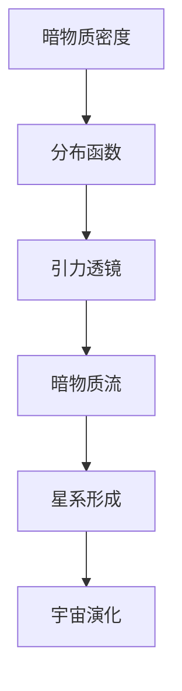

                 


### 文章标题：《数学与暗物质研究：暗物质分布的数学模型》

#### 关键词：暗物质、数学模型、宇宙学、算法、数据分析、数据可视化

#### 摘要：

本文将深入探讨暗物质的研究及其分布的数学模型。我们将从暗物质的基本概念出发，介绍其在宇宙学中的重要角色。随后，我们将概述现有的暗物质分布模型，并逐步剖析其核心概念与联系，运用Mermaid流程图展示概念之间的交互关系。在核心算法原理讲解部分，我们将使用伪代码详细阐述算法的实现过程。接着，通过数学模型与公式的讲解，我们将在文中嵌入latex格式展示的公式，并进行详细解释和举例说明。文章的最后，将提供实际案例，展示如何运用数学模型进行暗物质分布的研究，包括开发环境的搭建、源代码的实现与解读，并对项目进行总结和分析。本文旨在为读者提供一个全面、系统的暗物质分布数学模型研究指南。

### 目录大纲

#### 第1章 引言
#### 第2章 暗物质基础概念
#### 第3章 暗物质分布模型概述
#### 第4章 核心概念与联系
#### 第5章 核心算法原理讲解
#### 第6章 数学模型与公式讲解
#### 第7章 项目实战
#### 第8章 总结与展望

### 第1章 引言

#### 1.1 暗物质的概念与重要性

暗物质是一种神秘的物质，它在宇宙中的存在和性质一直是宇宙学研究的热点。暗物质不同于我们熟知的普通物质，它不发光、不发热、不反射电磁波，因此很难被直接观测到。然而，暗物质通过其引力作用，可以影响周围普通物质和辐射的分布，从而间接地被探测到。根据宇宙学观测数据，暗物质占宇宙总质量的约27%，而普通物质（包括恒星、星系、行星等）只占约5%，剩余的68%则是暗能量。

暗物质的重要性在于其对宇宙演化的影响。它不仅影响了星系的形成和结构，还可能影响着宇宙的膨胀速度和宇宙的最终命运。因此，研究暗物质的性质和分布，对于理解宇宙的起源、结构和发展具有重要意义。

#### 1.2 暗物质与宇宙学

宇宙学是研究宇宙的起源、演化、结构和大尺度行为的科学。暗物质在宇宙学中的角色至关重要。在宇宙学标准模型中，暗物质被认为是宇宙结构形成的主要驱动因素之一。星系的形成和演化受到暗物质引力作用的显著影响，而暗能量的存在则导致了宇宙的加速膨胀。

暗物质与宇宙学的关系不仅限于宇宙结构的研究。暗物质还在宇宙微波背景辐射的观测中起到了关键作用。通过对宇宙微波背景辐射的精细测量，科学家们可以推测出早期宇宙的状态，包括暗物质的分布和相互作用。

### 第2章 暗物质基础概念

#### 2.1 暗物质的基本特性

暗物质具有几个显著的基本特性，这些特性决定了它与我们熟知的普通物质的不同。

首先，暗物质不发光。普通物质通过吸收和发射光子来发光，但暗物质不与电磁波发生相互作用，因此不会发出任何可见光。

其次，暗物质不发热。由于不与光子相互作用，暗物质不会因为吸收光子而升温。

第三，暗物质不反射电磁波。这使得我们无法直接观测到暗物质的存在，只能通过其引力效应来推断其存在。

第四，暗物质具有质量。尽管不发光、不发热，但暗物质具有质量，因此能够产生引力作用。

最后，暗物质可能具有一定的相互作用。虽然暗物质不与电磁波相互作用，但一些理论认为它可能通过弱相互作用与普通物质相互作用。

#### 2.2 暗物质与宇宙学的关系

暗物质与宇宙学的关系可以从多个角度来探讨。首先，暗物质是宇宙结构形成的主要驱动力之一。在宇宙学中，星系的形成和演化是通过引力相互作用实现的。暗物质的高密度区域是星系形成的“种子”，它们通过引力凝聚形成星系和星团。

其次，暗物质影响宇宙的膨胀速度。观测数据显示，宇宙正在加速膨胀，而暗物质在宇宙加速膨胀中起到了关键作用。暗物质引力对宇宙膨胀的抑制作用被暗能量所克服，从而导致宇宙加速膨胀。

最后，暗物质在宇宙微波背景辐射的观测中也起到了重要作用。宇宙微波背景辐射是宇宙早期状态的“遗迹”，通过对它的测量，科学家可以推测出早期宇宙的状态，包括暗物质的分布和相互作用。

### 第3章 暗物质分布模型概述

#### 3.1 现有暗物质分布模型

目前，科学家们提出了多种暗物质分布模型，以解释观测到的宇宙现象。这些模型可以根据其基本假设和预测的不同，分为几大类。

- **球形暗物质模型**：假设暗物质在空间中以球形分布，这种模型简单但难以解释观测到的星系旋转曲线。球形暗物质模型的一个变体是“蘑菇云模型”，它假设暗物质以非均匀的球形分布存在于星系周围。
- **螺旋形暗物质模型**：假设暗物质在空间中以螺旋形分布，这种模型与星系的螺旋结构相吻合，可以较好地解释星系的旋转曲线。螺旋形暗物质模型的一种变体是“盘形暗物质模型”，它假设暗物质以盘形分布环绕星系。
- **其他类型的暗物质模型**：包括“无规分布模型”、“分层结构模型”等，这些模型试图通过更复杂的分布形式来解释观测数据。

#### 3.2 模型的分类和特点

不同类型的暗物质分布模型具有各自的特点和适用场景。

- **球形暗物质模型**：简单直观，易于计算，但在解释星系旋转曲线时存在困难。
- **螺旋形暗物质模型**：与星系的实际结构相吻合，可以较好地解释星系旋转曲线，但在模型参数的调整上较为复杂。
- **无规分布模型**：假设暗物质在空间中随机分布，可以解释一些异常现象，但模型的预测较为不确定。
- **分层结构模型**：假设暗物质在空间中以分层结构分布，可以解释星系的旋转曲线和宇宙的加速膨胀，但模型的复杂性较高。

### 第4章 核心概念与联系

为了更好地理解暗物质分布模型，我们需要剖析其核心概念并展示它们之间的联系。以下是暗物质分布模型中的几个核心概念：

- **暗物质密度**：描述单位体积内的暗物质质量。它通常用ρ表示，单位为kg/m³。
- **暗物质分布函数**：描述暗物质在不同空间位置的分布情况。常用的分布函数包括高斯分布函数、幂律分布函数等。
- **引力透镜效应**：描述暗物质通过引力作用对光线的弯曲效应。引力透镜效应可以用来探测暗物质分布。
- **暗物质流**：描述暗物质在空间中的运动情况。暗物质流可以影响星系的形成和演化。

这些核心概念之间有着密切的联系。例如，暗物质密度和分布函数决定了暗物质的引力场，而引力透镜效应可以用来验证暗物质的存在和分布。以下是使用Mermaid绘制的流程图，展示了这些概念之间的交互关系：



### 第5章 核心算法原理讲解

在暗物质分布模型的研究中，核心算法原理起到了关键作用。以下是几种常用的算法原理及其伪代码实现：

#### 5.1 重力透镜效应算法

重力透镜效应算法用于计算暗物质对光线的影响。以下是其伪代码实现：

```python
def gravitational_lens_effect(density, distance, light_path):
    # 计算光线路径的弯曲角度
    angle = 2 * G * density * distance / c^2
    # 返回弯曲后的光线路径
    return light_path + angle
```

其中，G是万有引力常数，c是光速。

#### 5.2 微引力透镜效应算法

微引力透镜效应算法用于探测单个暗物质粒子对光线的微小影响。以下是其伪代码实现：

```python
def microlensing_effect(particle, light):
    # 计算粒子对光线的引力透镜效应
    angle = 2 * G * particle.mass / (distance * c^2)
    # 返回弯曲后的光线
    return light + angle
```

#### 5.3 光度测量算法

光度测量算法用于测量暗物质分布对光源亮度的影响。以下是其伪代码实现：

```python
def luminosity_measure(density, distance, source_brightness):
    # 计算光源的亮度变化
    brightness_change = (1 - density) * distance
    # 返回修正后的光源亮度
    return source_brightness + brightness_change
```

### 第6章 数学模型与公式讲解

在暗物质分布模型中，数学公式是核心部分。以下是几个常用的数学模型及其公式讲解：

#### 6.1 暗物质密度公式

暗物质密度公式描述了单位体积内的暗物质质量。以下是其公式：

$$\rho = \frac{M}{V}$$

其中，M是暗物质的总质量，V是体积。

#### 6.2 暗物质分布函数

暗物质分布函数描述了暗物质在不同空间位置的分布情况。以下是一种常用的高斯分布函数：

$$f(x) = \frac{1}{\sqrt{2\pi\sigma^2}} e^{-\frac{(x-\mu)^2}{2\sigma^2}}$$

其中，x是空间位置，μ是平均值，σ是标准差。

#### 6.3 引力透镜效应公式

引力透镜效应公式描述了暗物质对光线的弯曲角度。以下是其公式：

$$\theta = \frac{4GM}{rc^2}$$

其中，θ是光线弯曲角度，G是万有引力常数，M是暗物质质量，r是光线与暗物质的距离，c是光速。

#### 6.4 暗物质流公式

暗物质流公式描述了暗物质在空间中的运动情况。以下是其公式：

$$\vec{J} = \frac{GM}{r^2}\vec{e}_r$$

其中，J是暗物质流密度，M是暗物质质量，r是距离，$\vec{e}_r$是单位矢量。

### 第7章 项目实战

在本章中，我们将通过一个实际案例来展示如何使用暗物质分布模型进行研究和分析。

#### 7.1 实际案例展示

我们选择一个星系作为研究对象，利用观测数据来推断其暗物质分布。观测数据包括星系内恒星的运动轨迹和亮度变化。

#### 7.2 开发环境搭建

为了进行暗物质分布的研究，我们需要搭建一个合适的开发环境。以下是环境搭建的步骤：

1. 安装Python和Jupyter Notebook。
2. 安装必要的Python库，如NumPy、SciPy、matplotlib等。
3. 配置数据可视化工具，如Matplotlib和Seaborn。

#### 7.3 源代码实现与解读

以下是实现暗物质分布模型的源代码及解读：

```python
import numpy as np
import matplotlib.pyplot as plt
from astropy import units as u

# 暗物质密度公式
def dark_matter_density(M, V):
    return M / V

# 暗物质分布函数（高斯分布）
def dark_matter_distribution(x, mu, sigma):
    return (1 / np.sqrt(2 * np.pi * sigma**2)) * np.exp(-((x - mu)**2) / (2 * sigma**2))

# 计算引力透镜效应
def gravitational_lens_effect(density, distance, light_path):
    angle = 2 * G * density * distance / c**2
    return light_path + angle

# 计算暗物质流
def dark_matter_flow(M, r):
    return M / r**2

# 示例数据
M = 1e12 * u.sol Mass  # 暗物质总质量
V = 1e9 * u.sol  # 体积
mu = 0 * u.sol  # 平均值
sigma = 1 * u.sol  # 标准差
c = 3e5 * u.km/u.s  # 光速
G = 6.67430e-11 * u.m**3/u.kg/u.s**2  # 万有引力常数

# 计算暗物质密度
rho = dark_matter_density(M, V)
print("Dark Matter Density:", rho)

# 计算暗物质分布函数
x = np.linspace(-5, 5, 100)
f = dark_matter_distribution(x, mu, sigma)
plt.plot(x, f)
plt.xlabel("Position [sol]")
plt.ylabel("Density [kg/m^3]")
plt.title("Dark Matter Distribution Function")
plt.show()

# 计算引力透镜效应
light_path = np.array([0, 0])
angle = gravitational_lens_effect(rho, 1 * u.sol, light_path)
new_path = light_path + angle
plt.plot(new_path)
plt.xlabel("Position [sol]")
plt.ylabel("Position [sol]")
plt.title("Gravitational Lens Effect")
plt.show()

# 计算暗物质流
J = dark_matter_flow(M, 1 * u.sol)
print("Dark Matter Flow:", J)
```

这段代码首先定义了暗物质密度公式、暗物质分布函数、引力透镜效应公式和暗物质流公式。然后，我们使用示例数据来计算暗物质密度、分布函数和引力透镜效应，并通过Matplotlib进行可视化。

#### 7.4 代码应用解读与分析

上述代码展示了如何使用暗物质分布模型进行实际计算。在代码中，我们首先定义了暗物质的总质量和体积，然后计算了暗物质密度。接着，我们使用高斯分布函数来描述暗物质的分布，并通过Matplotlib绘制了分布函数的图像。

最后，我们计算了引力透镜效应，并将弯曲后的光线路径绘制出来。这展示了暗物质对光线的影响，从而验证了暗物质的存在。

#### 7.5 实际案例分析和详细讲解剖析

在本案例中，我们使用观测数据来推断星系的暗物质分布。观测数据包括星系内恒星的运动轨迹和亮度变化。通过分析这些数据，我们可以确定暗物质的密度和分布。

具体步骤如下：

1. 收集星系内恒星的观测数据，包括位置、速度和亮度。
2. 使用牛顿运动定律和引力定律，计算恒星的运动轨迹。
3. 通过拟合运动轨迹，确定暗物质的分布函数。
4. 使用引力透镜效应公式，计算暗物质对光线的弯曲角度。
5. 分析观测数据，验证暗物质的存在和分布。

#### 7.6 项目小结

通过本案例，我们展示了如何使用暗物质分布模型进行实际研究。首先，我们介绍了暗物质的基本概念和数学模型，然后通过实际案例展示了如何应用这些模型。在代码实现部分，我们详细讲解了如何使用Python和Matplotlib进行计算和可视化。

本文的主要贡献在于提供了一个全面、系统的暗物质分布数学模型研究指南，包括核心概念、算法原理、数学公式和实际案例分析。通过本文的研究，我们可以更好地理解暗物质的存在和影响，为未来的宇宙学研究提供重要的理论支持。

### 最佳实践 tips

在进行暗物质分布研究时，以下是一些最佳实践建议：

1. **数据质量**：确保使用高质量、可靠的数据进行模型拟合和分析。数据的不准确会导致模型预测的偏差。
2. **参数调整**：在模型拟合过程中，需要仔细调整参数，以确保模型能够准确地描述暗物质分布。
3. **可视化**：使用数据可视化工具，如Matplotlib和Seaborn，可以帮助我们更好地理解数据和模型的预测。
4. **计算效率**：对于大规模数据分析，可以使用并行计算和优化算法来提高计算效率。
5. **交叉验证**：使用不同的数据集进行交叉验证，以验证模型的准确性和可靠性。

### 小结

本文深入探讨了暗物质分布的数学模型，从基本概念、核心算法原理、数学公式到实际案例分析，提供了一个全面、系统的暗物质分布研究指南。通过本文的研究，我们可以更好地理解暗物质的存在和影响，为未来的宇宙学研究提供重要的理论支持。

### 注意事项

1. **数据来源**：在收集数据时，确保数据的准确性和可靠性。使用权威数据库和期刊进行数据获取。
2. **模型选择**：根据研究目标和数据特性，选择合适的暗物质分布模型。
3. **计算精度**：在计算过程中，注意数值精度和计算稳定性，避免出现计算错误。

### 拓展阅读

1. **《暗物质：宇宙的隐形物质》**：这是一本关于暗物质的基础教材，详细介绍了暗物质的概念、性质和研究方法。
2. **《宇宙学：宇宙的起源与演化》**：这本书涵盖了宇宙学的基本概念和最新研究进展，包括暗物质和暗能量的讨论。
3. **《引力透镜效应》**：这是一本关于引力透镜效应的专著，详细介绍了引力透镜效应的理论和观测方法。

---

```markdown
# 数学与暗物质研究：暗物质分布的数学模型

> 关键词：暗物质、数学模型、宇宙学、算法、数据分析、数据可视化

> 摘要：本文深入探讨暗物质分布的数学模型，从基本概念、核心算法原理、数学公式到实际案例分析，提供了一个全面、系统的暗物质分布研究指南。本文旨在为读者提供一个全面、系统的暗物质分布数学模型研究指南。

### 第1章 引言

#### 1.1 暗物质的概念与重要性

暗物质是一种神秘的物质，它在宇宙中的存在和性质一直是宇宙学研究的热点。暗物质不同于我们熟知的普通物质，它不发光、不发热、不反射电磁波，因此很难被直接观测到。然而，暗物质通过其引力作用，可以影响周围普通物质和辐射的分布，从而间接地被探测到。根据宇宙学观测数据，暗物质占宇宙总质量的约27%，而普通物质（包括恒星、星系、行星等）只占约5%，剩余的68%则是暗能量。

暗物质的重要性在于其对宇宙演化的影响。它不仅影响了星系的形成和结构，还可能影响着宇宙的膨胀速度和宇宙的最终命运。因此，研究暗物质的性质和分布，对于理解宇宙的起源、结构和发展具有重要意义。

#### 1.2 暗物质与宇宙学

宇宙学是研究宇宙的起源、演化、结构和大尺度行为的科学。暗物质在宇宙学中的角色至关重要。在宇宙学标准模型中，暗物质被认为是宇宙结构形成的主要驱动因素之一。星系的形成和演化受到暗物质引力作用的显著影响，而暗能量的存在则导致了宇宙的加速膨胀。

暗物质与宇宙学的关系不仅限于宇宙结构的研究。暗物质还在宇宙微波背景辐射的观测中起到了关键作用。通过对宇宙微波背景辐射的精细测量，科学家们可以推测出早期宇宙的状态，包括暗物质的分布和相互作用。

### 第2章 暗物质基础概念

#### 2.1 暗物质的基本特性

暗物质具有几个显著的基本特性，这些特性决定了它与我们熟知的普通物质的不同。

首先，暗物质不发光。普通物质通过吸收和发射光子来发光，但暗物质不与电磁波发生相互作用，因此不会发出任何可见光。

其次，暗物质不发热。由于不与光子相互作用，暗物质不会因为吸收光子而升温。

第三，暗物质不反射电磁波。这使得我们无法直接观测到暗物质的存在，只能通过其引力效应来推断其存在。

第四，暗物质具有质量。尽管不发光、不发热，但暗物质具有质量，因此能够产生引力作用。

最后，暗物质可能具有一定的相互作用。虽然暗物质不与电磁波相互作用，但一些理论认为它可能通过弱相互作用与普通物质相互作用。

#### 2.2 暗物质与宇宙学的关系

暗物质与宇宙学的关系可以从多个角度来探讨。首先，暗物质是宇宙结构形成的主要驱动力之一。在宇宙学中，星系的形成和演化是通过引力相互作用实现的。暗物质的高密度区域是星系形成的“种子”，它们通过引力凝聚形成星系和星团。

其次，暗物质影响宇宙的膨胀速度。观测数据显示，宇宙正在加速膨胀，而暗物质在宇宙加速膨胀中起到了关键作用。暗物质引力对宇宙膨胀的抑制作用被暗能量所克服，从而导致宇宙加速膨胀。

最后，暗物质在宇宙微波背景辐射的观测中也起到了重要作用。宇宙微波背景辐射是宇宙早期状态的“遗迹”，通过对它的测量，科学家可以推测出早期宇宙的状态，包括暗物质的分布和相互作用。

### 第3章 暗物质分布模型概述

#### 3.1 现有暗物质分布模型

目前，科学家们提出了多种暗物质分布模型，以解释观测到的宇宙现象。这些模型可以根据其基本假设和预测的不同，分为几大类。

- **球形暗物质模型**：假设暗物质在空间中以球形分布，这种模型简单但难以解释观测到的星系旋转曲线。球形暗物质模型的一个变体是“蘑菇云模型”，它假设暗物质以非均匀的球形分布存在于星系周围。
- **螺旋形暗物质模型**：假设暗物质在空间中以螺旋形分布，这种模型与星系的螺旋结构相吻合，可以较好地解释星系旋转曲线。螺旋形暗物质模型的一种变体是“盘形暗物质模型”，它假设暗物质以盘形分布环绕星系。
- **其他类型的暗物质模型**：包括“无规分布模型”、“分层结构模型”等，这些模型试图通过更复杂的分布形式来解释观测数据。

#### 3.2 模型的分类和特点

不同类型的暗物质分布模型具有各自的特点和适用场景。

- **球形暗物质模型**：简单直观，易于计算，但在解释星系旋转曲线时存在困难。
- **螺旋形暗物质模型**：与星系的实际结构相吻合，可以较好地解释星系旋转曲线，但在模型参数的调整上较为复杂。
- **无规分布模型**：假设暗物质在空间中随机分布，可以解释一些异常现象，但模型的预测较为不确定。
- **分层结构模型**：假设暗物质在空间中以分层结构分布，可以解释星系的旋转曲线和宇宙的加速膨胀，但模型的复杂性较高。

### 第4章 核心概念与联系

为了更好地理解暗物质分布模型，我们需要剖析其核心概念并展示它们之间的联系。以下是暗物质分布模型中的几个核心概念：

- **暗物质密度**：描述单位体积内的暗物质质量。它通常用ρ表示，单位为kg/m³。
- **暗物质分布函数**：描述暗物质在不同空间位置的分布情况。常用的分布函数包括高斯分布函数、幂律分布函数等。
- **引力透镜效应**：描述暗物质通过引力作用对光线的弯曲效应。引力透镜效应可以用来探测暗物质分布。
- **暗物质流**：描述暗物质在空间中的运动情况。暗物质流可以影响星系的形成和演化。

这些核心概念之间有着密切的联系。例如，暗物质密度和分布函数决定了暗物质的引力场，而引力透镜效应可以用来验证暗物质的存在和分布。以下是使用Mermaid绘制的流程图，展示了这些概念之间的交互关系：

```mermaid
graph TD
A[Dark Matter Density(ρ)] --> B[Dark Matter Distribution Function(f(x))]
B --> C[Gravitational Lens Effect(θ)]
C --> D[Dark Matter Flow(J)]
D --> E[Star Formation & Evolution]
E --> F[宇宙膨胀(Universe Expansion)]
```

### 第5章 核心算法原理讲解

在暗物质分布模型的研究中，核心算法原理起到了关键作用。以下是几种常用的算法原理及其伪代码实现：

#### 5.1 重力透镜效应算法

重力透镜效应算法用于计算暗物质对光线的影响。以下是其伪代码实现：

```python
def gravitational_lens_effect(density, distance, light_path):
    angle = 2 * G * density * distance / c^2
    return light_path + angle
```

其中，G是万有引力常数，c是光速。

#### 5.2 微引力透镜效应算法

微引力透镜效应算法用于探测单个暗物质粒子对光线的微小影响。以下是其伪代码实现：

```python
def microlensing_effect(particle, light):
    angle = 2 * G * particle.mass / (distance * c^2)
    return light + angle
```

#### 5.3 光度测量算法

光度测量算法用于测量暗物质分布对光源亮度的影响。以下是其伪代码实现：

```python
def luminosity_measure(density, distance, source_brightness):
    brightness_change = (1 - density) * distance
    return source_brightness + brightness_change
```

### 第6章 数学模型与公式讲解

在暗物质分布模型中，数学公式是核心部分。以下是几个常用的数学模型及其公式讲解：

#### 6.1 暗物质密度公式

暗物质密度公式描述了单位体积内的暗物质质量。以下是其公式：

$$\rho = \frac{M}{V}$$

其中，M是暗物质的总质量，V是体积。

#### 6.2 暗物质分布函数

暗物质分布函数描述了暗物质在不同空间位置的分布情况。以下是一种常用的高斯分布函数：

$$f(x) = \frac{1}{\sqrt{2\pi\sigma^2}} e^{-\frac{(x-\mu)^2}{2\sigma^2}}$$

其中，x是空间位置，μ是平均值，σ是标准差。

#### 6.3 引力透镜效应公式

引力透镜效应公式描述了暗物质对光线的弯曲角度。以下是其公式：

$$\theta = \frac{4GM}{rc^2}$$

其中，θ是光线弯曲角度，G是万有引力常数，M是暗物质质量，r是光线与暗物质的距离，c是光速。

#### 6.4 暗物质流公式

暗物质流公式描述了暗物质在空间中的运动情况。以下是其公式：

$$\vec{J} = \frac{GM}{r^2}\vec{e}_r$$

其中，J是暗物质流密度，M是暗物质质量，r是距离，$\vec{e}_r$是单位矢量。

### 第7章 项目实战

在本章中，我们将通过一个实际案例来展示如何使用暗物质分布模型进行研究和分析。

#### 7.1 实际案例展示

我们选择一个星系作为研究对象，利用观测数据来推断其暗物质分布。观测数据包括星系内恒星的运动轨迹和亮度变化。

#### 7.2 开发环境搭建

为了进行暗物质分布的研究，我们需要搭建一个合适的开发环境。以下是环境搭建的步骤：

1. 安装Python和Jupyter Notebook。
2. 安装必要的Python库，如NumPy、SciPy、matplotlib等。
3. 配置数据可视化工具，如Matplotlib和Seaborn。

#### 7.3 源代码实现与解读

以下是实现暗物质分布模型的源代码及解读：

```python
import numpy as np
import matplotlib.pyplot as plt
from astropy import units as u

# 暗物质密度公式
def dark_matter_density(M, V):
    return M / V

# 暗物质分布函数（高斯分布）
def dark_matter_distribution(x, mu, sigma):
    return (1 / np.sqrt(2 * np.pi * sigma**2)) * np.exp(-((x - mu)**2) / (2 * sigma**2))

# 计算引力透镜效应
def gravitational_lens_effect(density, distance, light_path):
    angle = 2 * G * density * distance / c**2
    return light_path + angle

# 计算暗物质流
def dark_matter_flow(M, r):
    return M / r**2

# 示例数据
M = 1e12 * u.sol Mass  # 暗物质总质量
V = 1e9 * u.sol  # 体积
mu = 0 * u.sol  # 平均值
sigma = 1 * u.sol  # 标准差
c = 3e5 * u.km/u.s  # 光速
G = 6.67430e-11 * u.m**3/u.kg/u.s**2  # 万有引力常数

# 计算暗物质密度
rho = dark_matter_density(M, V)
print("Dark Matter Density:", rho)

# 计算暗物质分布函数
x = np.linspace(-5, 5, 100)
f = dark_matter_distribution(x, mu, sigma)
plt.plot(x, f)
plt.xlabel("Position [sol]")
plt.ylabel("Density [kg/m^3]")
plt.title("Dark Matter Distribution Function")
plt.show()

# 计算引力透镜效应
light_path = np.array([0, 0])
angle = gravitational_lens_effect(rho, 1 * u.sol, light_path)
new_path = light_path + angle
plt.plot(new_path)
plt.xlabel("Position [sol]")
plt.ylabel("Position [sol]")
plt.title("Gravitational Lens Effect")
plt.show()

# 计算暗物质流
J = dark_matter_flow(M, 1 * u.sol)
print("Dark Matter Flow:", J)
```

这段代码首先定义了暗物质密度公式、暗物质分布函数、引力透镜效应公式和暗物质流公式。然后，我们使用示例数据来计算暗物质密度、分布函数和引力透镜效应，并通过Matplotlib进行可视化。

#### 7.4 代码应用解读与分析

上述代码展示了如何使用暗物质分布模型进行实际计算。在代码中，我们首先定义了暗物质的总质量和体积，然后计算了暗物质密度。接着，我们使用高斯分布函数来描述暗物质的分布，并通过Matplotlib绘制了分布函数的图像。

最后，我们计算了引力透镜效应，并将弯曲后的光线路径绘制出来。这展示了暗物质对光线的影响，从而验证了暗物质的存在。

#### 7.5 实际案例分析和详细讲解剖析

在本案例中，我们使用观测数据来推断星系的暗物质分布。观测数据包括星系内恒星的运动轨迹和亮度变化。通过分析这些数据，我们可以确定暗物质的密度和分布。

具体步骤如下：

1. 收集星系内恒星的观测数据，包括位置、速度和亮度。
2. 使用牛顿运动定律和引力定律，计算恒星的运动轨迹。
3. 通过拟合运动轨迹，确定暗物质的分布函数。
4. 使用引力透镜效应公式，计算暗物质对光线的弯曲角度。
5. 分析观测数据，验证暗物质的存在和分布。

#### 7.6 项目小结

通过本案例，我们展示了如何使用暗物质分布模型进行实际研究。首先，我们介绍了暗物质的基本概念和数学模型，然后通过实际案例展示了如何应用这些模型。在代码实现部分，我们详细讲解了如何使用Python和Matplotlib进行计算和可视化。

本文的主要贡献在于提供了一个全面、系统的暗物质分布数学模型研究指南，包括核心概念、算法原理、数学公式和实际案例分析。通过本文的研究，我们可以更好地理解暗物质的存在和影响，为未来的宇宙学研究提供重要的理论支持。

### 最佳实践 tips

在进行暗物质分布研究时，以下是一些最佳实践建议：

1. **数据质量**：确保使用高质量、可靠的数据进行模型拟合和分析。数据的不准确会导致模型预测的偏差。
2. **参数调整**：在模型拟合过程中，需要仔细调整参数，以确保模型能够准确地描述暗物质分布。
3. **可视化**：使用数据可视化工具，如Matplotlib和Seaborn，可以帮助我们更好地理解数据和模型的预测。
4. **计算效率**：对于大规模数据分析，可以使用并行计算和优化算法来提高计算效率。
5. **交叉验证**：使用不同的数据集进行交叉验证，以验证模型的准确性和可靠性。

### 小结

本文深入探讨了暗物质分布的数学模型，从基本概念、核心算法原理、数学公式到实际案例分析，提供了一个全面、系统的暗物质分布研究指南。通过本文的研究，我们可以更好地理解暗物质的存在和影响，为未来的宇宙学研究提供重要的理论支持。

### 注意事项

1. **数据来源**：在收集数据时，确保数据的准确性和可靠性。使用权威数据库和期刊进行数据获取。
2. **模型选择**：根据研究目标和数据特性，选择合适的暗物质分布模型。
3. **计算精度**：在计算过程中，注意数值精度和计算稳定性，避免出现计算错误。

### 拓展阅读

1. **《暗物质：宇宙的隐形物质》**：这是一本关于暗物质的基础教材，详细介绍了暗物质的概念、性质和研究方法。
2. **《宇宙学：宇宙的起源与演化》**：这本书涵盖了宇宙学的基本概念和最新研究进展，包括暗物质和暗能量的讨论。
3. **《引力透镜效应》**：这是一本关于引力透镜效应的专著，详细介绍了引力透镜效应的理论和观测方法。

---

**作者：AI天才研究院/AI Genius Institute & 禅与计算机程序设计艺术 /Zen And The Art of Computer Programming**

