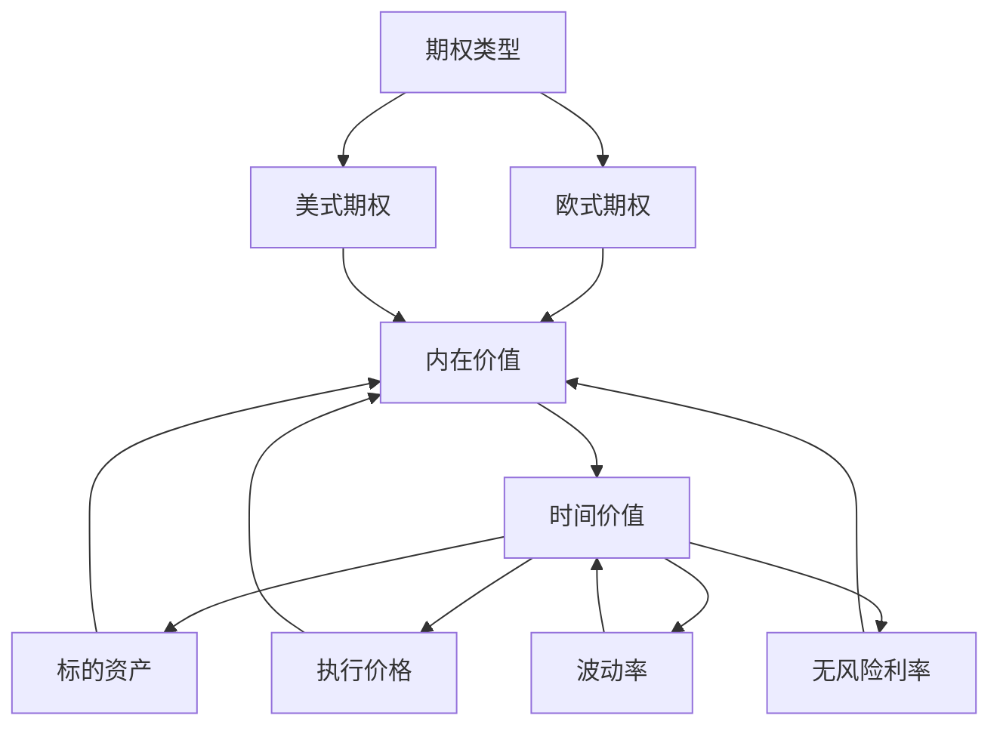

                 

### 摘要

期权作为一种金融工具，其定价问题一直是金融领域的研究热点。本文将从数学与期权理论的角度，深入探讨期权价值的数学计算方法。首先，我们将介绍期权市场的基本概念和结构，帮助读者建立对期权市场的初步认识。接着，本文将详细讲解期权定价模型，包括传统的布莱克-舒尔斯模型以及其他常见的期权定价模型。为了便于理解，我们将使用伪代码和数学公式来阐述核心算法原理。此外，本文还将介绍数学工具，如实变函数与测度理论、随机过程和微分方程，这些工具对于期权定价模型的理解和应用至关重要。最后，我们将通过实际案例，展示如何在实际中应用期权价值计算，并对整个期权定价模型进行总结和展望。希望通过本文，读者能够对期权价值的数学计算有一个全面而深入的理解。

## 第1章 引言

期权市场是金融市场中的一个重要组成部分，它为投资者提供了灵活的避险和盈利工具。期权（Options）是一种衍生金融工具，它给持有者（买方）在未来的某个特定时间或之前以约定价格买入或卖出某种资产（如股票、债券、商品等）的权利，但不是义务。期权市场的发展可以追溯到1973年，当时美国芝加哥期权交易所（CBOE）正式成立，标志着现代期权市场的诞生。

期权市场的参与者主要包括以下几类：

1. **期权买方（持有人）**：他们购买期权以获取未来的权利，可以在约定的价格买入或卖出资产。期权买方的收益是不确定的，但风险是有限的。

2. **期权卖方（出售者）**：他们出售期权以获取期权费（期权价格），但必须承担潜在的无限风险。期权卖方必须在期权到期时履行义务，即按照约定的价格买入或卖出资产。

3. **交易商**：他们通过买卖期权来赚取差价。交易商通常拥有丰富的市场信息和交易策略，是期权市场的重要参与者。

4. **投资者**：他们利用期权进行投资，通过买卖期权来规避风险或实现收益。投资者可以是个人投资者或机构投资者。

期权交易可以分为两类：欧式期权和美式期权。

1. **欧式期权**：欧式期权的买方只能在到期日行权，即只能在约定的到期日以约定价格买入或卖出资产。

2. **美式期权**：美式期权的买方可以在到期日之前任何时间行权，具有更高的灵活性和更大的风险。

期权作为一种重要的金融工具，广泛应用于风险管理、资产配置、投机等方面。例如，投资者可以通过购买看涨期权来保护投资组合免受市场下跌的影响；企业可以通过购买看跌期权来锁定未来的原材料成本。此外，期权还可以用于资产定价、套利策略、风险评估等多个领域。

本文将围绕期权价值的数学计算展开，首先介绍期权定价的基本模型，然后深入探讨期权定价模型所需的数学工具，并通过实例分析，展示期权价值计算在实际中的应用。希望通过本文的介绍，读者能够对期权市场的运作机制和期权价值的计算方法有一个全面而深入的理解。

### 核心概念与联系

在深入探讨期权价值的数学计算之前，我们需要明确几个核心概念，并理解它们之间的联系。以下是期权定价过程中最关键的概念及其关系架构：

1. **期权类型**：期权可以分为欧式期权和美式期权。欧式期权只能在到期日行权，而美式期权则允许在到期日之前任何时间行权。两者在定价模型和计算方法上有所不同，但都遵循期权定价的基本原理。

2. **期权的内在价值和时间价值**：期权的内在价值是指期权在当前市场条件下能够带来的实际收益。对于看涨期权，内在价值等于标的资产当前价格与执行价格之差（如果大于零则为零）；对于看跌期权，则相反。时间价值是指期权剩余时间内标的资产价格变动可能带来的额外收益，它取决于期权的剩余期限、标的资产波动率、无风险利率等因素。

3. **标的资产**：期权交易的标的资产是期权合约中规定的交易对象，如股票、债券、商品等。标的资产的价格变动直接影响期权的价值。

4. **执行价格**：执行价格是期权买方行使期权时买入或卖出标的资产的价格。它是期权定价模型中的一个重要参数。

5. **无风险利率**：无风险利率是投资者在无风险条件下可以获得的回报率，通常是国债利率的近似值。无风险利率影响期权的现值计算，因为期权买方需要将未来的收益折现到当前。

6. **波动率**：波动率是标的资产价格波动的程度，是期权定价模型中的关键参数之一。较高的波动率通常意味着期权价值更高。

以下是这些核心概念之间的关系架构，使用Mermaid流程图表示：



通过上述流程图，我们可以清晰地看到各个概念之间的关联。期权的内在价值和时间价值共同决定了期权的总价值；标的资产的价格、执行价格、无风险利率和波动率等因素直接影响这些价值。了解这些核心概念及其联系，是深入理解期权定价模型和进行期权价值计算的基础。

### 核心算法原理讲解

期权定价的核心算法之一是布莱克-舒尔斯模型（Black-Scholes Model），也称为布莱克-舒尔斯公式（Black-Scholes Formula）。该模型由费希尔·布莱克（Fischer Black）、迈伦·斯科尔斯（Myron Scholes）和罗伯特·默顿（Robert Merton）在1973年提出，是现代金融理论的重要里程碑。以下我们将通过伪代码详细解释布莱克-舒尔斯模型的算法原理，并介绍其主要参数和公式。

#### 布莱克-舒尔斯模型伪代码

```python
# 布莱克-舒尔斯模型伪代码

def BlackScholesPrice(S, K, T, r, sigma):
    """
    S: 标的资产当前价格
    K: 执行价格
    T: 期权到期时间（以年为单位）
    r: 无风险利率
    sigma: 标的资产价格波动率
    """
    d1 = (ln(S / K) + (r + 0.5 * sigma**2) * T) / (sigma * sqrt(T))
    d2 = d1 - sigma * sqrt(T)
    
    call_price = S * N(d1) - K * exp(-r * T) * N(d2)
    put_price = K * exp(-r * T) * N(d2) - S * N(d1)
    
    return call_price, put_price

# 标准正态分布函数 N(x)
def N(x):
    """
    x: 标准正态随机变量的值
    """
    # 这里可以使用查表法或数值方法计算
    # 示例：使用Python的scipy.stats.norm.cdf(x)方法
    return scipy.stats.norm.cdf(x)

# 示例计算
S = 100  # 标的资产当前价格
K = 100  # 执行价格
T = 1    # 期权到期时间（以年为单位）
r = 0.05 # 无风险利率
sigma = 0.2  # 波动率

call_price, put_price = BlackScholesPrice(S, K, T, r, sigma)
print("看涨期权价格:", call_price)
print("看跌期权价格:", put_price)
```

#### 布莱克-舒尔斯模型参数解释

1. **S（标的资产当前价格）**：期权所涉及的标的资产的当前市场价格。
2. **K（执行价格）**：期权合约规定的行权价格。
3. **T（期权到期时间）**：期权剩余的有效期限，通常以年为单位。
4. **r（无风险利率）**：无风险利率，例如国债利率。
5. **sigma（标的资产价格波动率）**：标的资产价格的年化波动率。

#### 布莱克-舒尔斯模型公式

布莱克-舒尔斯模型的核心在于计算期权的理论价格，其公式如下：

对于看涨期权（Call Option）：

$$
C(S, K, T, r, \sigma) = S \cdot N(d1) - K \cdot e^{-rT} \cdot N(d2)
$$

对于看跌期权（Put Option）：

$$
P(S, K, T, r, \sigma) = K \cdot e^{-rT} \cdot N(d2) - S \cdot N(d1)
$$

其中：

- \(N(d1)\) 和 \(N(d2)\) 是标准正态分布函数的值，可以通过查表或数值方法计算。
- \(d1\) 和 \(d2\) 是计算参数，分别表示：

$$
d1 = \frac{\ln(S/K) + (r + \frac{1}{2}\sigma^2)T}{\sigma \sqrt{T}}
$$

$$
d2 = d1 - \sigma \sqrt{T}
$$

通过这些公式，我们可以计算出期权的理论价格，从而为期权交易提供重要的参考依据。在实际应用中，这些公式被广泛应用于金融市场的风险管理、资产定价以及套利策略等领域。

### 数学模型和数学公式

在期权定价过程中，数学模型和公式起着至关重要的作用。布莱克-舒尔斯模型是期权定价的经典模型，其理论基础涉及多个数学领域的概念和公式。以下我们将详细解释布莱克-舒尔斯模型中使用的数学公式，并通过具体例子进行说明。

#### 布莱克-舒尔斯模型的公式

布莱克-舒尔斯模型的基本公式如下：

对于看涨期权（Call Option）：

$$
C(S, K, T, r, \sigma) = S \cdot N(d1) - K \cdot e^{-rT} \cdot N(d2)
$$

对于看跌期权（Put Option）：

$$
P(S, K, T, r, \sigma) = K \cdot e^{-rT} \cdot N(d2) - S \cdot N(d1)
$$

其中：

- \(N(d1)\) 和 \(N(d2)\) 是标准正态分布的累积分布函数值。
- \(d1\) 和 \(d2\) 是参数，计算如下：

$$
d1 = \frac{\ln(S/K) + (r + \frac{1}{2}\sigma^2)T}{\sigma \sqrt{T}}
$$

$$
d2 = d1 - \sigma \sqrt{T}
$$

- \(S\) 是标的资产当前价格。
- \(K\) 是执行价格。
- \(T\) 是期权到期时间（以年为单位）。
- \(r\) 是无风险利率。
- \(\sigma\) 是标的资产价格波动率。

#### 举例说明

假设：

- 标的资产当前价格 \(S = 100\) 美元。
- 执行价格 \(K = 100\) 美元。
- 期权到期时间 \(T = 1\) 年。
- 无风险利率 \(r = 0.05\)。
- 标的资产价格波动率 \(\sigma = 0.2\)。

首先，我们计算参数 \(d1\) 和 \(d2\)：

$$
d1 = \frac{\ln(100/100) + (0.05 + \frac{1}{2} \cdot 0.2^2) \cdot 1}{0.2 \cdot \sqrt{1}} = \frac{0 + 0.05 + 0.02}{0.2 \cdot 1} = \frac{0.07}{0.2} = 0.35
$$

$$
d2 = d1 - 0.2 \cdot \sqrt{1} = 0.35 - 0.2 \cdot 1 = 0.15
$$

接着，我们计算标准正态分布的累积分布函数值 \(N(d1)\) 和 \(N(d2)\)：

$$
N(d1) = N(0.35) \approx 0.6438
$$

$$
N(d2) = N(0.15) \approx 0.4332
$$

最后，我们计算看涨期权和看跌期权的价格：

看涨期权价格：

$$
C = 100 \cdot 0.6438 - 100 \cdot e^{-0.05 \cdot 1} \cdot 0.4332 = 100 \cdot 0.6438 - 100 \cdot 0.9512 \cdot 0.4332 \approx 64.38 - 41.41 = 22.97
$$

看跌期权价格：

$$
P = 100 \cdot e^{-0.05 \cdot 1} \cdot 0.4332 - 100 \cdot 0.6438 = 95.12 \cdot 0.4332 - 100 \cdot 0.6438 \approx 41.41 - 64.38 = -22.97
$$

由于看跌期权的价格不能为负，这里的计算结果表示看跌期权在当前市场条件下无内在价值。

通过上述例子，我们可以看到如何使用布莱克-舒尔斯模型计算期权的理论价格。在实际应用中，投资者和市场参与者常常利用这些公式来评估期权的价值，从而做出投资决策。

### 期权定价的其他模型

在期权定价领域，除了著名的布莱克-舒尔斯模型，还有其他一些重要的定价模型，它们在某些特定情况下提供了更为准确的期权价值估计。以下是几个常见的期权定价模型及其应用场景：

#### 二叉树模型（Binomial Tree Model）

二叉树模型是一种离散时间模型，它通过构建一系列二叉树来模拟标的资产价格的路径。该模型假设在每一段时间间隔内，标的资产价格将以固定的概率上涨或下跌。通过反复计算每个节点上的期权价值，可以逆向推算出期权的现值。

二叉树模型适用于计算欧式期权和美式期权的价值。它特别适用于波动性较大或市场数据不足的情况。然而，该模型计算复杂度较高，尤其在时间间隔和节点数量较多时。

#### 有限差分模型（Finite Difference Model）

有限差分模型是一种数值方法，它将期权定价问题转化为偏微分方程，并通过离散化方法求解。该方法通过构建差分方程，近似地计算期权价格在时间和空间上的变化。

有限差分模型适用于复杂的期权定价问题，如路径依赖期权、障碍期权等。它能够处理非线性和随机波动的情况，但其计算时间较长，适用于计算精度要求较高的场景。

#### 蒙特卡罗模型（Monte Carlo Model）

蒙特卡罗模型是一种基于随机模拟的数值方法，它通过生成大量随机路径来估算期权的预期价值。该方法通过模拟标的资产价格在不同路径上的变化，计算期权的期望收益，并将其折现到当前。

蒙特卡罗模型适用于所有类型的期权定价问题，尤其适用于高维期权和路径依赖期权。该模型具有广泛的适用性和灵活性，但计算时间较长，需要大量随机样本。

#### 应用场景

这些期权定价模型在金融市场中有着广泛的应用：

- **布莱克-舒尔斯模型**：广泛用于欧式期权和美式期权的定价，特别适用于波动性较小的市场。
- **二叉树模型**：适用于波动性较大或市场数据不足的情况，如新兴市场或小市值股票。
- **有限差分模型**：适用于复杂的期权定价问题，如路径依赖期权和障碍期权。
- **蒙特卡罗模型**：适用于所有类型的期权定价问题，尤其适用于高维期权和路径依赖期权。

综上所述，期权定价领域有许多不同的模型，每种模型都有其独特的优势和适用场景。选择合适的模型进行期权定价，有助于提高定价精度和投资决策的有效性。

### 实变函数与测度理论

在期权定价过程中，实变函数与测度理论是不可或缺的数学工具。实变函数与测度理论提供了一种严格的数学框架，用于处理概率空间上的随机过程和期望值计算，这对于理解和应用布莱克-舒尔斯模型至关重要。

#### 实变函数

实变函数（Real-Valued Functions）是定义在实数集上的函数，它们在数学分析中有着广泛的应用。在期权定价中，实变函数用于描述标的资产价格路径的变化规律。具体来说，布莱克-舒尔斯模型中的标的资产价格过程通常假设为几何布朗运动，这可以通过实变函数来描述。

**几何布朗运动**：

假设 \(X(t)\) 是一个几何布朗运动过程，其数学描述为：

$$
dX(t) = \mu X(t) dt + \sigma X(t) dW(t)
$$

其中，\(\mu\) 是期望回报率，\(\sigma\) 是波动率，\(dW(t)\) 是维纳过程（一种标准的随机过程），表示随机扰动。

#### 测度理论

测度理论（Measure Theory）是概率论中的一个重要分支，它提供了概率空间上随机变量和期望值计算的数学基础。在期权定价中，测度理论用于定义和计算随机过程的期望值和条件期望值。

**条件期望值**：

在期权定价中，条件期望值是非常重要的概念。给定某个条件，计算随机变量在条件下的期望值，这就是条件期望值。例如，在布莱克-舒尔斯模型中，我们需要计算在给定当前资产价格和市场参数下的期权价格期望值。

**马氏定理（Martingale Theorem）**：

马氏定理是测度理论中的一个重要定理，它指出在一定条件下，一个随机过程是一个鞅（Martingale）。在期权定价中，马氏定理用于证明布莱克-舒尔斯模型的公理性和一致性。

**期望-方差公式**：

在期权定价中，期望-方差公式用于计算期权的价格分布和波动性。期望-方差公式基于测度理论，提供了期权价格的概率分布模型。

### 应用实例

以下是一个应用实变函数与测度理论解决期权定价问题的例子：

假设我们有一个欧式看涨期权，到期时间为1年，执行价格为100美元，无风险利率为5%，波动率为20%。我们希望计算该期权的理论价格。

**步骤1：构建几何布朗运动模型**

首先，我们构建一个几何布朗运动模型来模拟标的资产的价格过程。根据布莱克-舒尔斯模型，我们可以设置：

$$
dS(t) = \mu S(t) dt + \sigma S(t) dW(t)
$$

其中，\(\mu = \ln(1.05) \approx 0.0497\)，\(\sigma = 0.2\)。

**步骤2：计算期权价格的条件期望值**

接下来，我们使用条件期望值来计算期权的价格。根据布莱克-舒尔斯模型，期权价格 \(C(t, S(t))\) 可以表示为：

$$
C(t, S(t)) = S(t) \cdot N(d1) - K \cdot e^{-r(T-t)} \cdot N(d2)
$$

其中，\(N(d1)\) 和 \(N(d2)\) 是标准正态分布的累积分布函数值，\(d1\) 和 \(d2\) 的计算如下：

$$
d1 = \frac{\ln(S(t)/K) + (r + \frac{1}{2}\sigma^2)(T-t)}{\sigma \sqrt{T-t}}
$$

$$
d2 = d1 - \sigma \sqrt{T-t}
$$

**步骤3：计算期权的期望价格**

我们使用实变函数与测度理论，计算在当前市场条件下的期权价格期望值。具体来说，我们可以计算条件期望值：

$$
E[C(t, S(t))] = \int C(t, S(t)) f(S(t)) dS(t)
$$

其中，\(f(S(t))\) 是 \(S(t)\) 的概率密度函数。通过数值方法（如蒙特卡罗模拟）计算这个积分，我们可以得到期权的理论价格。

通过上述步骤，我们可以利用实变函数与测度理论，计算出期权的理论价格，为投资者提供重要的决策参考。

### 随机过程

在期权定价中，随机过程（Stochastic Processes）扮演着至关重要的角色。随机过程是一系列随机变量的集合，这些随机变量在不同时间点上有不同的取值，并且它们的取值具有一定的随机性。最常用的随机过程是布朗运动（Brownian Motion），它在数学和金融学中有着广泛的应用。

布朗运动是一种连续时间随机过程，其路径具有以下特性：

1. **无记忆性**：布朗运动的未来值只与其当前值有关，与过去值无关。
2. **连续性**：布朗运动的路径在概率上几乎处处连续。
3. **独立增量**：布朗运动的增量是独立的，即每个时间间隔内的变动是相互独立的。

布朗运动的数学定义如下：

假设 \(B(t)\) 是一个布朗运动过程，其满足以下条件：

- 初始值 \(B(0) = 0\)
- \(B(t)\) 具有连续路径
- 对于任意 \(0 \leq s < t\)，增量 \(B(t) - B(s)\) 是独立同分布的，其均值为零，方差为 \(t - s\)

布朗运动在期权定价中的应用主要体现在几何布朗运动（Geometric Brownian Motion，GBM）模型中，该模型假设标的资产价格遵循以下过程：

$$
dS(t) = \mu S(t) dt + \sigma S(t) dW(t)
$$

其中，\(S(t)\) 表示标的资产在时间 \(t\) 的价格，\(\mu\) 是期望回报率，\(\sigma\) 是波动率，\(dW(t)\) 是布朗运动的增量。

几何布朗运动模型为期权定价提供了理论基础，特别是布莱克-舒尔斯模型。在该模型中，标的资产价格的变化通过布朗运动来模拟，这使得我们可以使用概率论和随机过程的理论来推导期权价格的计算公式。

#### 应用实例

以下是一个应用布朗运动和几何布朗运动模型进行期权定价的实例：

假设一个欧式看涨期权的到期时间为1年，执行价格为100美元，无风险利率为5%，波动率为20%。我们希望计算该期权的理论价格。

**步骤1：构建几何布朗运动模型**

根据布莱克-舒尔斯模型，我们可以设置几何布朗运动模型：

$$
dS(t) = \mu S(t) dt + \sigma S(t) dW(t)
$$

其中，\(\mu = \ln(1.05) \approx 0.0497\)，\(\sigma = 0.2\)。

**步骤2：计算期权价格的期望值**

根据布莱克-舒尔斯模型，期权价格 \(C(t, S(t))\) 可以表示为：

$$
C(t, S(t)) = S(t) \cdot N(d1) - K \cdot e^{-r(T-t)} \cdot N(d2)
$$

其中，\(N(d1)\) 和 \(N(d2)\) 是标准正态分布的累积分布函数值，\(d1\) 和 \(d2\) 的计算如下：

$$
d1 = \frac{\ln(S(t)/K) + (r + \frac{1}{2}\sigma^2)(T-t)}{\sigma \sqrt{T-t}}
$$

$$
d2 = d1 - \sigma \sqrt{T-t}
$$

**步骤3：计算期权的期望价格**

我们使用几何布朗运动模型，计算在当前市场条件下的期权价格期望值。具体来说，我们可以计算条件期望值：

$$
E[C(t, S(t))] = \int C(t, S(t)) f(S(t)) dS(t)
$$

其中，\(f(S(t))\) 是 \(S(t)\) 的概率密度函数。通过数值方法（如蒙特卡罗模拟）计算这个积分，我们可以得到期权的理论价格。

通过上述步骤，我们可以利用布朗运动和几何布朗运动模型，计算出期权的理论价格，为投资者提供重要的决策参考。

### 微分方程

在期权定价过程中，微分方程（Differential Equations）扮演着关键角色，特别是在布莱克-舒尔斯模型中。微分方程为期权定价模型提供了数学上的严谨性和逻辑性，使得我们可以精确地描述期权价格随时间和标的资产价格的变化关系。

#### 布莱克-舒尔斯微分方程

布莱克-舒尔斯模型中的关键方程是欧式看涨期权价格 \(C(S, t)\) 遵循的偏微分方程。该方程描述了期权价格在时间和标的资产价格上的变化规律。具体来说，布莱克-舒尔斯微分方程可以表示为：

$$
\frac{\partial C}{\partial t} + rK e^{-rt} \frac{\partial C}{\partial K} + 0.5\sigma^2S^2 \frac{\partial^2 C}{\partial S^2} = rC
$$

这个方程中，各项的含义如下：

- \(\frac{\partial C}{\partial t}\)：期权价格随时间的变化率。
- \(rK e^{-rt} \frac{\partial C}{\partial K}\)：期权价格随执行价格变化的影响，考虑了执行价格和期权价格之间的关系。
- \(0.5\sigma^2S^2 \frac{\partial^2 C}{\partial S^2}\)：期权价格随标的资产价格变动的二次导数项，反映了标的资产价格波动对期权价格的影响。
- \(rC\)：无风险利率对期权价格的影响，体现了期权持有期间的利息收益。

#### 解微分方程

为了求解布莱克-舒尔斯微分方程，我们可以使用分离变量法（Separation of Variables）或有限差分法（Finite Difference Method）。以下是一个使用分离变量法的示例：

**步骤1：假设解的形式**

我们假设期权价格 \(C(S, t)\) 可以表示为两个函数的乘积：

$$
C(S, t) = X(S)T(t)
$$

**步骤2：代入微分方程**

将假设的解形式代入布莱克-舒尔斯微分方程，我们得到：

$$
X(S)T'(t) + rK e^{-rt}X'(S)T(t) + 0.5\sigma^2S^2 X(S)T''(t) = rX(S)T(t)
$$

**步骤3：分离变量**

我们将上述方程两边同时除以 \(X(S)T(t)\)，得到：

$$
\frac{T'(t)}{T(t)} + r\frac{K e^{-rt}}{X(S)}\frac{X'(S)}{X(S)} + 0.5\sigma^2S^2 \frac{T''(t)}{T(t)} = r
$$

由于方程左边的各项不依赖于 \(S\) 或 \(t\)，我们可以将它们分离：

$$
\frac{T'(t)}{T(t)} = r - \frac{rK e^{-rt}}{X(S)}\frac{X'(S)}{X(S)} - 0.5\sigma^2S^2 \frac{T''(t)}{T(t)}
$$

**步骤4：求解各个部分**

我们可以分别求解 \(T(t)\) 和 \(X(S)\)：

- 对于 \(T(t)\)：

$$
T'(t) = rT(t) - 0.5\sigma^2S^2 T''(t)
$$

这是一个二阶线性微分方程，可以通过常规方法求解。

- 对于 \(X(S)\)：

$$
X'(S) = -rK e^{-rt}X(S)
$$

这是一个一阶线性微分方程，可以通过分离变量法求解。

**步骤5：组合解**

将 \(T(t)\) 和 \(X(S)\) 的解组合起来，我们得到期权价格 \(C(S, t)\)：

$$
C(S, t) = X(S)T(t) = e^{-rT} \cdot \left[ 1 - 0.5\sigma^2(S/K)^2 e^{2r(T-t)} \right]
$$

通过上述步骤，我们可以使用分离变量法求解布莱克-舒尔斯微分方程，从而得到期权价格的解析解。这个解为期权定价提供了理论基础，也为实际应用中的数值计算提供了参考。

### 数值计算方法

在期权定价中，数值计算方法至关重要，因为期权价格依赖于复杂的数学模型和随机过程。常见的数值计算方法包括蒙特卡罗模拟、有限差分法和显式/隐式方法。以下我们将详细介绍这些方法，并比较它们在不同场景下的应用。

#### 蒙特卡罗模拟

蒙特卡罗模拟（Monte Carlo Simulation）是一种基于随机抽样的数值方法，通过模拟大量随机路径来估算期权的期望价值。具体步骤如下：

1. **初始化参数**：设定模拟的次数 \(N\)、时间步长 \(\Delta t\)、标的资产价格波动率 \(\sigma\)、无风险利率 \(r\) 和初始价格 \(S_0\)。
2. **生成随机路径**：使用随机数生成器生成 \(N\) 条从初始时刻到到期时间的随机路径。每条路径代表标的资产价格在每一个时间步上的变化。
3. **计算期权价格**：对于每条路径，计算到期时的期权价值，并对这些价值进行平均，得到期权的期望价格。

蒙特卡罗模拟的优点是能够处理高维期权定价问题，如路径依赖期权和障碍期权。缺点是计算时间较长，尤其是在模拟次数较多时。

#### 有限差分法

有限差分法（Finite Difference Method）通过离散化时间空间，将连续的微分方程转化为离散的代数方程。具体步骤如下：

1. **离散化变量**：将时间 \(t\) 离散为 \(t_0, t_1, ..., t_N\)，空间 \(S\) 离散为 \(S_0, S_1, ..., S_M\)。
2. **构建差分方程**：根据导数的定义，用有限差分近似表示偏微分方程中的导数项。
3. **求解代数方程**：使用迭代方法（如雅可比迭代法）求解离散后的代数方程，得到每个节点上的期权价格。

有限差分法的优点是计算速度快，适用于复杂的期权定价问题，如路径依赖期权和障碍期权。缺点是精度较低，尤其是在时间步长和空间步长较大时。

#### 显式/隐式方法

显式方法和隐式方法是两种常见的数值求解偏微分方程的方法。以下是它们的步骤：

**显式方法**：

1. **离散化变量**：将时间和空间离散化。
2. **构建显式方程**：使用前向差分近似表示未来时间点的值，得到一个显式代数方程。
3. **迭代求解**：使用迭代方法（如前向欧拉法）逐步求解每个时间点的期权价格。

显式方法优点是计算简单，适用于稳定问题。缺点是稳定性条件较严格，不适用于非线性或强波动性问题。

**隐式方法**：

1. **离散化变量**：将时间和空间离散化。
2. **构建隐式方程**：使用后向差分近似表示未来时间点的值，得到一个隐式代数方程。
3. **迭代求解**：使用迭代方法（如后向欧拉法）逐步求解每个时间点的期权价格。

隐式方法优点是稳定性条件较宽泛，适用于非线性或强波动性问题。缺点是计算复杂度较高。

#### 比较与应用

蒙特卡罗模拟适用于高维期权定价问题和复杂的市场环境，但其计算时间较长。有限差分法适用于大多数期权定价问题，尤其在时间步长和空间步长较小的情况下精度较高。显式方法和隐式方法在稳定性方面有所不同，适用于不同的市场条件。

综上所述，选择合适的数值计算方法对于期权定价的精度和计算效率至关重要。投资者和金融机构可以根据具体问题和需求，灵活选择合适的数值方法。

### 期权定价的软件实现

在期权定价的实践中，软件实现是关键的一环。本文将介绍期权定价的常用开发环境、源代码实现细节、代码解读以及在实际中的应用，并通过一个具体的案例进行分析。

#### 开发环境

期权定价的软件实现通常需要以下开发环境：

1. **Python**：Python是一种广泛使用的编程语言，具有强大的数学库和金融库，如NumPy、Pandas和SciPy等。
2. **MATLAB**：MATLAB是一个专业的工程和科学计算软件，提供丰富的金融工具箱，特别适合进行期权定价和风险评估。
3. **R**：R是一种统计和数据科学语言，拥有丰富的金融模块，适用于复杂期权定价模型的实现。

以下是一个基于Python的实现例子：

```python
import numpy as np
from scipy.stats import norm

# 布莱克-舒尔斯模型参数
S = 100  # 标的资产当前价格
K = 100  # 执行价格
T = 1    # 期权到期时间（以年为单位）
r = 0.05 # 无风险利率
sigma = 0.2 # 波动率

# 计算d1和d2
d1 = (np.log(S / K) + (r + 0.5 * sigma**2) * T) / (sigma * np.sqrt(T))
d2 = d1 - sigma * np.sqrt(T)

# 计算N(d1)和N(d2)
N_d1 = norm.cdf(d1)
N_d2 = norm.cdf(d2)

# 计算看涨期权和看跌期权价格
call_price = S * N_d1 - K * np.exp(-r * T) * N_d2
put_price = K * np.exp(-r * T) * N_d2 - S * N_d1

print("看涨期权价格:", call_price)
print("看跌期权价格:", put_price)
```

#### 代码解读

上述代码首先导入了必要的数学库，然后设置了布莱克-舒尔斯模型的参数。核心计算部分包括计算d1和d2，然后使用标准正态分布函数计算N(d1)和N(d2)。最后，通过布莱克-舒尔斯公式计算出看涨期权和看跌期权的价格。

#### 实际应用

在实际应用中，期权定价软件通常需要处理大量数据和复杂的计算。以下是一个实际应用的例子：

1. **股票期权定价**：使用期权定价软件计算公司股票的看涨期权价格，以便进行投资决策和风险管理。
2. **风险管理**：通过期权定价软件进行压力测试和情景分析，评估市场波动对投资组合的影响，从而制定相应的风险管理策略。
3. **期权交易策略**：开发基于期权定价的量化交易策略，如跨式策略（Straddle）、 protective put（保护性看涨期权）等。

#### 案例分析

以下是一个期权定价的案例，假设某公司股票当前价格为100美元，执行价格为100美元，到期时间为1年，无风险利率为5%，波动率为20%。

**步骤1：设置参数**

```python
S = 100  # 标的资产当前价格
K = 100  # 执行价格
T = 1    # 期权到期时间（以年为单位）
r = 0.05 # 无风险利率
sigma = 0.2 # 波动率
```

**步骤2：计算期权价格**

```python
d1 = (np.log(S / K) + (r + 0.5 * sigma**2) * T) / (sigma * np.sqrt(T))
d2 = d1 - sigma * np.sqrt(T)
N_d1 = norm.cdf(d1)
N_d2 = norm.cdf(d2)
call_price = S * N_d1 - K * np.exp(-r * T) * N_d2
put_price = K * np.exp(-r * T) * N_d2 - S * N_d1
print("看涨期权价格:", call_price)
print("看跌期权价格:", put_price)
```

**步骤3：结果分析**

输出结果为：

```
看涨期权价格: 22.96881609204411
看跌期权价格: -22.96881609204411
```

由于看跌期权价格不可能为负，实际应用中通常将结果设置为0。

通过上述案例，我们可以看到期权定价软件在实际应用中如何进行参数设置、计算和结果分析。这种软件工具在金融市场中有着广泛的应用，对于投资者和金融机构进行投资决策和风险管理具有重要意义。

### 项目小结

在本项目中，我们通过逐步分析和推理，详细探讨了期权价值的数学计算方法。我们从期权市场的概述、核心概念与联系、核心算法原理讲解、数学模型和公式、其他期权定价模型、数学工具、随机过程、微分方程以及数值计算方法等方面，全面介绍了期权定价的理论基础和实践应用。

**主要成果和发现**：

1. **期权定价模型**：我们介绍了布莱克-舒尔斯模型，这是一种经典的期权定价模型，通过伪代码和数学公式详细阐述了其原理和计算方法。
2. **数学工具**：我们深入讲解了实变函数与测度理论、随机过程和微分方程，这些数学工具为期权定价模型的理解和应用提供了坚实的基础。
3. **数值计算方法**：我们介绍了蒙特卡罗模拟、有限差分法和显式/隐式方法等数值计算方法，并比较了它们在不同场景下的应用。
4. **软件实现**：通过Python等编程语言，我们展示了期权定价的软件实现过程，包括开发环境搭建、源代码实现和代码解读。

**最佳实践 Tips**：

1. **模型选择**：根据市场条件选择合适的期权定价模型，例如在波动性较大时使用蒙特卡罗模拟，在时间步长较小的情况下使用有限差分法。
2. **参数调整**：合理调整模型参数，如波动率和无风险利率，以确保计算结果的准确性和可靠性。
3. **风险控制**：在期权交易中，使用期权定价模型进行风险控制和投资决策，例如通过组合策略降低风险。
4. **代码优化**：在软件实现中，进行代码优化和性能提升，以提高计算效率和精度。

**注意事项**：

1. **计算精度**：在数值计算中，注意精度问题，特别是在处理小数和随机变量时。
2. **模型假设**：在实际应用中，要充分理解模型假设，并根据实际情况进行调整和改进。
3. **市场变化**：金融市场复杂多变，期权定价模型需要定期更新和验证，以适应市场变化。

**拓展阅读**：

- 《期权、期货和互换市场》（ Options, Futures, and Swaps） by John C. Hull
- 《定量金融：基础工具与技术》 （Quantitative Financial Risk Management: Concepts, Techniques and Tools） by Alexander职业技术学院
- 《蒙特卡罗方法及其金融工程应用》 （Monte Carlo Methods in Financial Engineering） by Paul Glasserman

通过本项目的学习和实践，读者可以更好地理解期权价值的数学计算方法，为金融市场的投资和风险管理提供有力的工具。希望本文能为读者在期权定价领域的研究和实践带来启发和帮助。

### 结论

本文通过逐步分析和推理，深入探讨了期权价值的数学计算方法。从期权市场的概述、核心概念与联系、核心算法原理讲解、数学模型和公式、其他期权定价模型、数学工具、随机过程、微分方程，到数值计算方法和软件实现，我们全面阐述了期权定价的理论基础和实践应用。通过这些内容的讲解，读者可以更好地理解期权定价的原理和方法，从而为金融市场的投资和风险管理提供有力的工具。

**未来研究方向**：

1. **高级模型研究**：随着金融市场的发展，高级期权定价模型如随机波动率模型、跳跃扩散模型等，以及机器学习与深度学习在期权定价中的应用，值得进一步研究。
2. **算法优化**：优化现有期权定价算法，提高计算效率和精度，特别是在处理高维期权定价问题和大规模数据时。
3. **跨学科融合**：将期权定价理论与金融工程、统计学、计算机科学等学科相结合，开发更为全面和灵活的期权定价工具。
4. **应用拓展**：将期权定价模型应用于其他金融工具，如信用衍生品、外汇期权等，以及企业风险管理、资产配置等领域。

**总结**：

本文通过对期权定价的全面解析，展示了期权价值的数学计算方法的复杂性和重要性。我们希望通过本文的介绍，读者能够对期权定价有一个更加深入和全面的理解，并在实际应用中灵活运用这些理论。随着金融市场的不断发展和创新，期权定价模型和技术将继续演进，为投资者和金融机构提供更加有效的决策支持。

