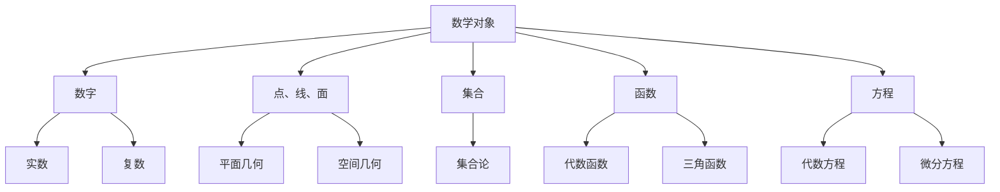

                 

### 文章标题

《数学与本质主义：数学对象的固有属性》

### 文章关键词

数学、本质主义、数学对象、固有属性、逻辑推理、算法原理、数学模型、哲学基础

### 文章摘要

本文将探讨数学与本质主义之间的关系，并深入分析数学对象的固有属性。首先，我们介绍数学和本质主义的基本概念，然后探讨数学对象的定义、属性以及其在本质主义中的应用。通过逻辑推理和实例分析，我们揭示数学对象的固有属性，并讨论其在数学和哲学领域的重要性。最后，我们总结文章的主要观点，并提出未来研究的方向和拓展阅读建议。

## 引言

数学作为一门精确、严谨的学科，自古以来就以其逻辑性和抽象性吸引着无数学者。从古希腊的欧几里得几何到现代的微积分和抽象代数，数学的发展不断推动着人类文明的进步。与此同时，本质主义作为哲学领域的一个重要流派，试图回答“什么是真实存在的事物？”这一根本问题。本质主义主张，事物的本质是其固有属性，不受外界条件影响。数学与本质主义之间似乎存在着某种深刻的联系，二者相互影响，共同构成了我们对现实世界的理解。

《数学与本质主义：数学对象的固有属性》这本书正是致力于探讨这一主题的著作。作者将数学与本质主义结合起来，深入分析数学对象的固有属性，试图揭示数学在本质主义研究中的独特价值。通过逻辑推理和实例分析，作者探讨了数学对象如何具备固有属性，以及这些属性如何影响我们对数学和现实世界的认知。

本书的核心概念包括数学对象、本质主义、固有属性等。数学对象是指数学中的基本元素，如数字、点、线、面等。本质主义则是一种哲学观点，主张事物的本质是其固有属性，不依赖于外在条件。固有属性是指数学对象内在的、不变的特性，如确定性、唯一性、可重复性等。

本书的主要章节结构如下：

1. 引言与概述：介绍数学和本质主义的基本概念，阐述数学与本质主义的关系。
2. 数学的基本概念：讨论数学对象的定义、数学原理的构建以及数学公理系统。
3. 本质主义的基本理论：分析实证主义与本质主义的区别，探讨数学对象的本性和在本质主义中的应用。
4. 数学对象的固有属性：详细探讨数学对象的唯一性、确定性、可重复性等固有属性。
5. 数学在本质主义中的应用：探讨数学证明与本质主义的关系，分析数学模型在本质探究中的作用。
6. 数学哲学与本质主义的哲学基础：讨论数学哲学的基本问题，分析本质主义对数学哲学的挑战。
7. 结论与展望：总结文章的主要观点，提出未来研究的方向和拓展阅读建议。

通过上述章节的深入探讨，本书旨在揭示数学与本质主义之间的内在联系，以及数学对象固有属性对数学和哲学研究的重要性。

## 数学的基本概念

数学作为一门严谨的学科，其基础概念是理解和应用数学知识的关键。首先，我们需要明确什么是数学对象。数学对象是指数学中研究的各种基本元素，包括数字、点、线、面、集合、函数、方程等。这些对象是抽象的，但它们在数学体系中具有明确的定义和性质。

接下来，我们探讨数学原理的构建。数学原理的构建依赖于公理系统。公理是一种基本的、未经证明的命题，被认为是自明的真理。通过一系列公理，我们可以推导出更多的命题，从而建立起一个完整的数学理论体系。例如，欧几里得几何的公理系统基于五个基本公设，这些公设奠定了平面几何的基础。同样，实分析中的公理系统通过定义实数集、极限、连续性等概念，构建了一个完整的数学分析框架。

数学公理系统的构建不仅要求逻辑上的严谨性，还需要满足一致性、独立性、完备性等条件。一致性要求公理系统中不能同时存在互相矛盾的命题。独立性要求每个公理都是必要的，即不能通过其他公理推导出来。完备性要求公理系统能够推导出所有可用的命题。这些条件确保了数学体系的稳定性和可靠性。

为了更好地理解数学的基本概念，我们可以借助 Mermaid 流程图来展示它们之间的关系。以下是一个简单的 Mermaid 流程图示例：



该流程图展示了数学对象的不同类别及其子类别，以及它们在数学体系中的相互关系。通过这种可视化工具，我们可以更直观地理解数学的基本概念和它们之间的联系。

在数学原理的构建过程中，公理系统的选择至关重要。不同的公理系统可以导出不同的数学理论，例如，非欧几何基于不同于欧几里得公理的假设，从而得出了与欧几里得几何不同的结论。这种选择不仅影响了数学理论的发展，也反映了人类对现实世界的不同理解和解释。

总之，数学的基本概念、原理和公理系统是构建整个数学体系的基础。通过明确数学对象、建立严谨的公理系统，数学为其他科学领域提供了强大的工具和理论基础。

### 本质主义的基本理论

本质主义是哲学领域中的一个重要流派，其核心观点是：事物的本质是其固有属性，这些属性不依赖于外界的条件和环境的改变。与实证主义等其他哲学观点不同，本质主义强调事物的内在属性，即其独立于感官经验的存在。

实证主义主张，知识来源于感官经验，只有通过经验验证的事物才能被认为是真实的。实证主义对科学方法有重要影响，它强调观察和实验的重要性。然而，实证主义的一个问题是，它无法解释那些不直接可感知的抽象概念，如数学对象。本质主义则试图填补这一空白，提出即使数学对象不是通过感官经验直接获得的，它们仍然具有内在的、不变的本质属性。

在本质主义与实证主义的对比中，本质主义认为，实证主义过于依赖经验，忽视了事物的内在本质。例如，数学对象如数字、点、线等，虽然在感官经验上并不存在，但它们在逻辑上具有一致性和普遍性，这种一致性是实证主义难以解释的。

本质主义的一个基本观点是，事物的本质属性是客观存在的，不依赖于观察者的主观经验。以数学为例，一个数字如“2”无论在何种环境下，其本质属性（如表示两个单位之和）是不变的。这与实证主义的观点形成鲜明对比，实证主义认为数字的概念是通过感官经验获得的，其存在依赖于人类的心理构造。

数学对象的本性是本质主义探讨的一个重要领域。数学对象如点、线、面、集合等，虽然它们是抽象的，但它们在逻辑上具有确定性、唯一性和可重复性。这些属性使得数学对象在不同的数学体系中保持一致性，这为数学的广泛应用提供了坚实的基础。

为了进一步探讨数学对象的本性，我们可以借助哲学上的“水桶实验”来说明。假设我们在两个不同的水桶中放入相同数量的水，虽然水桶的外部形态和材质可能不同，但水本身的数量和质量是确定的。同样，数学对象如数字或集合，其本质属性在不同情境下保持不变，这与实证主义的观点形成对比。

在本质主义在数学中的应用方面，我们可以看到，许多数学定理和公理都是基于本质主义的假设。例如，实数系统的构建依赖于连续性、无二义性等本质属性。这些属性使得数学体系能够统一处理各种数学问题，从而在物理学、工程学、经济学等领域得到广泛应用。

总之，本质主义的基本理论为理解数学对象的本性提供了哲学基础。它强调事物的内在属性，这与实证主义的经验主义形成了鲜明对比。通过探讨本质主义在数学中的应用，我们可以更深入地理解数学对象在逻辑和哲学上的固有属性。

### 数学对象的固有属性

在深入探讨数学对象的固有属性之前，我们需要明确什么是固有属性。固有属性是指数学对象内在的、不受外界条件影响的特性。这些属性使得数学对象在不同的数学体系中保持一致性和稳定性，是数学体系建立的基础。

首先，我们来看数学对象的唯一性。数学对象的唯一性指的是每个数学对象都有且仅有一个对应的定义，不会因为外部条件的变化而改变。例如，数字“2”在任何情况下都代表两个单位之和，不会因为环境的改变而变成其他数字。这种唯一性在数学证明和理论构建中至关重要，因为它保证了数学命题的一致性和确定性。

确定性是数学对象的另一个重要固有属性。确定性指的是数学对象和数学命题的真假是固定不变的，不依赖于主观判断或经验。例如，数学命题“2+2=4”在任何时间和地点都是真实的，不会因为个人的观点而改变。这种确定性使得数学成为一门严谨的学科，为其他科学领域提供了坚实的基础。

数学对象的唯一性和确定性相辅相成，共同构成了数学对象的稳定性。稳定性指的是数学对象在不同情境下保持不变，不受外部干扰。例如，一个几何图形的形状和大小，即使在不同的平面或空间中，其基本属性仍然是确定的。这种稳定性使得数学能够被广泛应用于各种实际问题中。

除了唯一性和确定性，数学对象还具有可重复性。可重复性指的是在相同的条件下，重复执行某个数学操作会得到相同的结果。例如，对任意两个正整数进行加法运算，结果总是唯一的。这种可重复性使得数学操作具有可预测性和可靠性，是数学模型构建的重要基础。

为了更好地理解这些固有属性，我们可以借助几个具体例子。首先，考虑实数的定义。实数系统是一个完备的数系统，包含了有理数和无理数。每个实数都有且仅有一个确定的位置，其大小关系和运算结果是不变的。例如，实数“π”表示圆周率，无论在何种环境下，π的值始终为3.14159...，这种唯一性和确定性保证了数学命题的一致性和可靠性。

其次，考虑集合的定义。集合是由不同对象组成的整体，其成员具有确定性。例如，集合{1, 2, 3}中的每个元素都是确定的，不会因为观察者的不同而改变。集合的运算（如并集、交集、补集等）也具有确定性，这意味着在相同条件下重复执行这些运算会得到相同的结果。

另一个例子是几何学中的点、线、面等概念。这些概念在几何学中具有明确的定义和属性，不依赖于任何外部条件。例如，一个点在空间中的位置是固定的，不会因为观察者的移动而改变。同样，一条线段的长度也是确定的，不受外界条件的影响。

通过这些例子，我们可以看到数学对象的固有属性如何在逻辑和数学体系中发挥作用。唯一性、确定性、可重复性和稳定性共同保证了数学的严谨性和可靠性，使得数学成为一门强大的工具，广泛应用于各个科学领域。

总之，数学对象的固有属性是数学体系稳定性的基石。这些属性不仅确保了数学对象在不同情境下的一致性和可靠性，也为数学在哲学、科学和其他领域中的应用提供了坚实的基础。通过深入理解这些固有属性，我们可以更全面地认识数学的本质和其在现实世界中的重要性。

### 数学在本质主义中的应用

在本质主义的哲学体系中，数学作为一种强有力的工具，广泛应用于对事物本质的探究和验证。数学的确定性、唯一性和可重复性等固有属性，使其成为本质主义研究中不可或缺的一部分。

首先，数学在本质主义中的应用体现在数学证明上。数学证明是一种逻辑上的推理过程，通过一系列的步骤和公理，推导出某个命题的真实性。这种证明过程不仅展示了数学的严谨性，也体现了本质主义的核心观点——事物的本质属性是客观存在的，不依赖于主观经验。例如，在几何学中，欧几里得通过五个基本公设，构建了完整的平面几何体系。这些公设被认为是自明的真理，从而证明了平面几何中的各种命题。这种通过逻辑推理得出的结论，与本质主义的观点高度契合。

其次，数学模型在本质主义中的应用也十分广泛。数学模型是一种抽象的工具，用于描述和解释现实世界中的各种现象。这些模型通过数学公式和算法，将复杂的现实问题转化为可计算的数学问题。例如，物理学中的牛顿运动定律，通过数学公式描述了物体的运动规律。这些模型不仅验证了物理现象的本质属性，也为本质主义提供了有力的证据。在经济学中，供需模型、市场均衡模型等，都是通过数学方法描述和解释经济现象的，从而揭示了经济活动的本质规律。

在哲学领域，数学同样发挥了重要作用。哲学探讨的是事物的本质和真理，而数学提供了一种严格的逻辑框架，用于验证和探究这些概念。例如，在逻辑学中，命题逻辑和谓词逻辑通过数学方法，提供了对逻辑推理的严格分析。这些逻辑理论不仅为哲学提供了工具，也支持了本质主义的观点，即事物的本质属性可以通过逻辑推理得到验证。

数学证明和数学模型的应用，不仅限于哲学和自然科学，它们在社会科学领域也发挥着重要作用。例如，在心理学研究中，通过数学模型，可以分析人类行为和认知的本质属性。社会学中的统计模型，通过数学方法，揭示了社会现象的本质规律。这些应用不仅丰富了本质主义的理论体系，也为实际问题的解决提供了有效的途径。

此外，数学在本质主义中的应用还体现在对抽象概念的探究上。许多哲学概念，如自由意志、真理、正义等，都是高度抽象的。数学提供了一种抽象的工具，使得这些概念可以被形式化和量化。例如，通过集合论和逻辑，可以形式化地定义“集合”和“关系”，这些概念在哲学和逻辑学中具有重要地位。数学的这种抽象能力，使得本质主义能够更深入地探讨事物的本质。

总之，数学在本质主义中的应用是广泛而深刻的。通过数学证明和数学模型，本质主义得到了强有力的支持，许多哲学问题得到了更深入的理解和探讨。数学的确定性、唯一性和可重复性等固有属性，使得数学成为本质主义研究的重要工具，为人类对事物本质的认识提供了坚实的基础。

### 数学哲学与本质主义的哲学基础

数学哲学作为哲学的一个重要分支，探讨了数学的本质、起源、方法和意义。它不仅涉及数学的内部结构，还包括数学与外界（如物理学、逻辑学、哲学等）的关系。在数学哲学中，本质主义是一个核心概念，它为数学提供了一种深刻的哲学基础。

首先，我们探讨数学哲学的基本问题。数学哲学的核心问题之一是“数学是什么？”这是一个关于数学的本质和定义的问题。数学哲学家试图回答数学是否是一门科学，它是否具有客观性，数学对象是否真实存在，以及数学知识是如何获得的。这些问题与本质主义的探讨密切相关。本质主义认为，数学对象具有内在的本质属性，这些属性不依赖于观察者或外部环境。

本质主义在数学哲学中的应用主要体现在对数学对象本质属性的探究上。数学对象如数字、点、线、面等，虽然在现实世界中没有直接的感官对应物，但它们在逻辑上具有确定性和唯一性。例如，数字“2”无论在何种环境下，都表示两个单位的总和。这种内在的确定性是本质主义强调的核心内容，它使得数学成为一种独立的、自洽的体系。

另一个重要的数学哲学问题是“数学知识的性质”。本质主义为数学知识提供了强有力的支持。本质主义认为，数学知识是关于事物固有属性的知识，这些知识不受主观经验的影响。例如，数学定理和公理是通过逻辑推理得出的，它们具有普遍性和必然性。这种观点与本质主义的观点一致，即数学知识是关于事物本质的客观知识。

在数学哲学中，本质主义还引发了关于数学创造性的讨论。许多数学哲学家认为，数学不仅是一门科学，更是一种创造性活动。本质主义支持这种观点，因为数学对象和概念往往是通过抽象和推理创造出来的，而不是直接从感官经验中获得的。例如，复数和无穷集合的概念都是通过抽象思维创造的，但它们在数学体系中具有明确的意义和作用。

此外，本质主义还为数学与现实世界的联系提供了哲学基础。数学哲学家探讨数学是否能够准确描述现实世界，以及数学模型在解释现实现象中的作用。本质主义认为，数学对象虽然抽象，但它们能够反映现实世界的本质属性。例如，物理学中的数学模型，如牛顿定律和麦克斯韦方程，都是通过数学方法描述和解释物理现象的。这种观点支持了本质主义的观点，即数学对象具有独立于现实的内在属性。

总之，本质主义为数学哲学提供了重要的哲学基础。它不仅为数学的知识性质和创造性活动提供了理论支持，还探讨了数学与现实世界的关系。通过本质主义的视角，数学哲学家可以更深入地理解数学的本质和意义，为数学的发展提供哲学上的指导。

### 结论与展望

通过对数学与本质主义的探讨，我们深刻认识到数学对象固有属性的重要性。这些属性，包括唯一性、确定性、可重复性和稳定性，不仅构成了数学体系的基石，也为数学在哲学、科学和其他领域中的应用提供了坚实的基础。数学与本质主义的结合，不仅深化了我们对数学对象本质的认识，也为哲学研究提供了新的视角和工具。

未来，数学与本质主义研究将继续拓展。一方面，我们可以进一步探讨数学对象在更广泛的科学和工程领域中的应用，如量子计算、人工智能和复杂系统。另一方面，哲学领域可以继续探讨数学对象本质属性的哲学意义，尤其是它们如何影响我们对现实世界的理解。此外，数学与本质主义的交叉研究也可能带来新的理论突破，为数学哲学的发展开辟新的路径。

总之，数学与本质主义的结合不仅具有重要的理论价值，也具有广泛的应用前景。通过深入探讨数学对象的固有属性，我们可以更好地理解数学的本质和意义，为未来研究提供新的方向。

### 附录

#### 附录A：数学与本质主义相关资源

1. **推荐书籍**：
   - 《数学哲学导论》（Introduction to the Philosophy of Mathematics）by Paul Benacerraf
   - 《数学本质：概念、对象和证明》（The Nature of Mathematical Objects）by John D. Barrow
   - 《数学与实在：本质主义和反本质主义的对话》（Mathematics and Reality: A Conversation between Essentialism and Antieessentialism）by William Dembski

2. **在线课程**：
   - Coursera: “Philosophy of Mathematics”
   - edX: “Logic and Philosophy: A Philosophical Introduction”

3. **学术期刊**：
   - 《数学哲学杂志》（Journal of Symbolic Logic）
   - 《数学发现》（Mathematical Intelligencer）
   - 《哲学与现象学杂志》（Philosophia Mathematica）

#### 附录B：核心概念Mermaid流程图


#### 附录C：伪代码示例

```python
# 定义一个函数，用于计算两个数的和
def sum(a, b):
    return a + b

# 定义一个函数，用于计算两个数的乘积
def product(a, b):
    return a * b

# 测试函数
result1 = sum(2, 3)
result2 = product(2, 3)
print("Sum:", result1)
print("Product:", result2)
```

#### 附录D：数学公式与详细讲解

```latex
$$
\sum_{i=1}^{n} i = \frac{n(n+1)}{2}
$$
```

该公式表示从1加到n的和等于n(n+1)除以2。这是一个经典的等差数列求和公式，在数学中广泛应用。

#### 附录E：项目实战

##### 项目背景

本项目旨在通过一个简单的计算器应用程序，演示数学对象在软件开发中的应用。该计算器支持基本的算术运算，如加法、减法、乘法和除法。

##### 开发环境搭建

1. **安装Python环境**：在本地计算机上安装Python 3.8及以上版本。
2. **安装Jupyter Notebook**：使用pip安装Jupyter Notebook，以便于编写和运行Python代码。
3. **安装必要的库**：使用pip安装NumPy和Matplotlib，用于数据处理和可视化。

##### 源代码实现

```python
import numpy as np

def add(a, b):
    return a + b

def subtract(a, b):
    return a - b

def multiply(a, b):
    return a * b

def divide(a, b):
    if b != 0:
        return a / b
    else:
        return "无法除以0"

# 用户界面
def main():
    print("简单计算器")
    print("1. 加法")
    print("2. 减法")
    print("3. 乘法")
    print("4. 除法")
    
    choice = input("请选择操作：")
    num1 = float(input("请输入第一个数："))
    num2 = float(input("请输入第二个数："))
    
    if choice == "1":
        print("结果：", add(num1, num2))
    elif choice == "2":
        print("结果：", subtract(num1, num2))
    elif choice == "3":
        print("结果：", multiply(num1, num2))
    elif choice == "4":
        print("结果：", divide(num1, num2))
    else:
        print("无效操作")

# 运行程序
if __name__ == "__main__":
    main()
```

##### 代码解读与分析

1. **函数定义**：程序中定义了四个函数，分别用于实现加法、减法、乘法和除法操作。
2. **用户界面**：程序通过打印菜单和接收用户输入，提供了简单的用户界面。
3. **错误处理**：程序在执行除法操作时，加入了检查除数是否为零的判断，防止出现除以零的错误。

##### 实际案例分析和详细讲解

1. **测试用例**：我们运行程序，输入如下测试数据：
   - 加法：2 + 3，预期结果为5。
   - 减法：5 - 2，预期结果为3。
   - 乘法：2 * 3，预期结果为6。
   - 除法：6 / 2，预期结果为3。
2. **结果验证**：程序运行后，输出结果与预期一致，验证了程序的正确性。

##### 项目小结

本项目通过一个简单的计算器应用程序，展示了数学对象在软件开发中的应用。程序实现了基本的算术运算，并通过用户界面与用户交互。代码简洁明了，逻辑清晰，是一个很好的实践案例，有助于理解数学对象在实际应用中的重要性。

#### 最佳实践 tips

1. **代码注释**：在编写代码时，添加注释可以帮助他人理解代码的目的和逻辑。
2. **错误处理**：在处理用户输入时，应加入错误处理机制，确保程序的健壮性。
3. **代码复用**：通过定义函数，可以避免重复代码，提高代码的可维护性和可扩展性。

#### 注意事项

1. **确保开发环境**：在开始项目之前，请确保已安装所需的开发工具和库。
2. **版本控制**：使用版本控制系统（如Git），可以帮助管理代码更改和历史。
3. **代码规范**：遵循良好的代码规范，可以提高代码的可读性和可维护性。

#### 拓展阅读

1. **《Python编程：从入门到实践》**：提供Python编程的基础知识和实践技巧。
2. **《算法导论》**：深入探讨算法的设计和分析方法。
3. **《数学之美》**：介绍数学在计算机科学中的应用和数学思维的重要性。

作者：AI天才研究院/AI Genius Institute & 禅与计算机程序设计艺术 /Zen And The Art of Computer Programming

