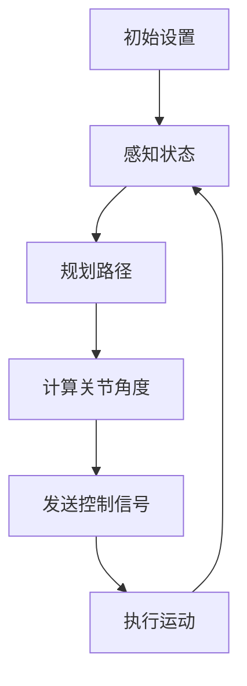
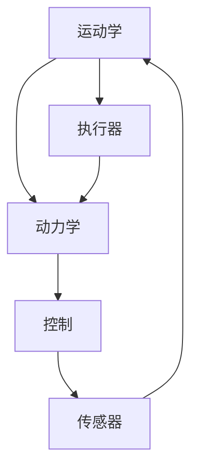
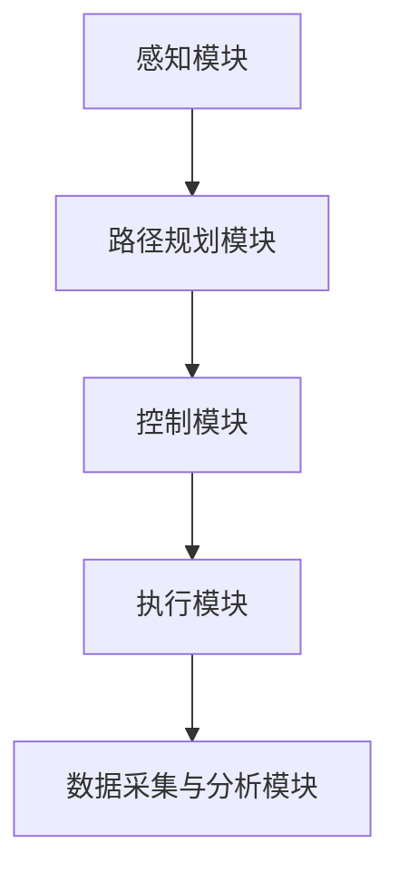

                 


### 文章标题：《数学与机器人学：运动控制的数学算法》

#### 关键词：数学算法、机器人学、运动控制、PID控制、逆运动学、最小二乘法

#### 摘要：
本文深入探讨了数学在机器人运动控制中的应用，详细介绍了核心数学算法如PID控制、逆运动学、最小二乘法等，并通过实际项目实战展示了这些算法在实际应用中的效果。文章结构清晰，包括背景介绍、核心概念与联系、算法原理讲解、数学模型和公式讲解、项目实战以及最佳实践和总结等内容。

### 引言

#### 运动控制的重要性

运动控制是机器人学领域中的一个关键问题。它涉及到如何精确地控制机器人的运动，以完成特定的任务。无论是工业制造中的自动化装配线，还是服务机器人中的自主导航和任务执行，运动控制都是不可或缺的。运动控制的精度和效率直接影响到机器人的性能和实用性。

在过去的几十年中，随着计算机科学和机器人技术的快速发展，运动控制理论已经从简单的开环控制发展到复杂的闭环控制，从传统的PID控制发展到基于人工智能的控制算法。数学在运动控制中的应用也越来越广泛，如线性控制理论、非线性控制理论、最优化方法等。

#### 数学在运动控制中的应用

数学在运动控制中的应用体现在多个方面。首先，数学模型可以准确地描述机器人的运动学特性和动力学特性，从而为运动规划提供理论基础。例如，逆运动学问题就是通过数学模型来解决如何从目标位置和姿态计算出所需关节角度的问题。

其次，数学算法提供了控制策略的设计工具。例如，PID控制算法是一种经典的控制算法，它通过误差信号的积分、差分和比例来调整控制信号，从而实现对系统的精确控制。另外，最小二乘法等优化算法也被广泛应用于运动控制的参数估计和误差校正中。

最后，数学工具如矩阵运算、微分方程求解等，在控制系统的设计、仿真和调试过程中发挥着重要作用。这些数学工具不仅提高了控制系统的设计效率，还增强了其稳定性和鲁棒性。

#### 书籍结构概述

本书将分为六个主要部分，分别为：

1. **引言**：介绍运动控制的重要性和数学在其中的应用。
2. **核心概念与联系**：详细解释运动控制的基本概念，并提供运动控制的Mermaid流程图。
3. **核心算法原理讲解**：包括PID控制算法、逆运动学算法和最小二乘法等。
4. **数学模型与公式讲解**：详细讲解相关的数学模型，使用LaTeX格式表示数学公式，并提供举例说明。
5. **项目实战**：提供实际的代码案例，包括开发环境搭建、源代码实现和代码解读。
6. **附录**：包括工具与资源的对比等。

通过以上结构，本书旨在为读者提供一个系统、全面的运动控制数学算法学习路径。

### 核心概念与联系

#### 运动控制的基本概念

在运动控制中，有几个核心概念需要明确：

1. **运动学（Kinematics）**：研究物体的位置、速度和加速度等运动参数。逆运动学是解决如何从目标位置和姿态计算关节角度的问题。
   
2. **动力学（Dynamics）**：研究物体的受力情况以及这些力如何影响运动。动力学模型可以描述机器人在不同关节力和负载下的行为。

3. **控制（Control）**：控制是使机器人按照预定轨迹或任务要求进行运动的过程。控制可以通过开环控制和闭环控制实现。

4. **传感器（Sensor）**：传感器用于实时监测机器人的状态，如位置、速度和力等，从而为控制算法提供反馈。

5. **执行器（Actuator）**：执行器是机器人运动的动力源，如电机、液压缸等，负责将控制信号转换为运动。

#### 运动控制的Mermaid流程图

为了更清晰地展示运动控制的核心概念和流程，我们可以使用Mermaid流程图来表示：



在这个流程图中：

- **A[初始设置]**：初始化机器人系统和任务目标。
- **B[感知状态]**：通过传感器获取当前状态。
- **C[规划路径]**：根据目标位置和当前状态规划运动路径。
- **D[计算关节角度]**：使用逆运动学计算达到目标路径所需的关节角度。
- **E[发送控制信号]**：将计算得到的关节角度发送给执行器。
- **F[执行运动]**：执行器根据控制信号驱动机器人运动。
- **F --> B**：完成一个循环，回到感知状态，开始下一次循环。

#### 运动控制的分类

运动控制可以分为开环控制和闭环控制两种类型：

1. **开环控制（Open-loop control）**：在开环控制中，控制信号仅基于预设的规则或模型，而不考虑实际的机器人状态。这种方法的优点是实现简单，但缺点是抗干扰能力较差，无法精确跟踪目标轨迹。

2. **闭环控制（Closed-loop control）**：在闭环控制中，控制系统使用传感器反馈来调整控制信号，以更好地适应实际状态。闭环控制可以提高运动的精度和稳定性，但设计和实现相对复杂。

#### 核心概念之间的关系

运动控制的几个核心概念之间的关系可以用以下Mermaid流程图表示：



在这个流程图中：

- **A[运动学]**：研究物体的运动，为控制和动力学提供基础。
- **B[动力学]**：研究物体受力后的运动，影响运动控制。
- **C[控制]**：根据传感器反馈和动力学模型调整执行器的行为。
- **D[传感器]**：实时监测机器人状态，为控制提供反馈。
- **E[执行器]**：根据控制信号执行运动，反馈给动力学模型。

通过理解这些核心概念和它们之间的关系，我们可以更好地设计和实现运动控制系统。

### 核心算法原理讲解

在运动控制中，有几个核心算法扮演着至关重要的角色，这些算法不仅能够提高运动的精度，还能增强系统的稳定性。以下是几个关键算法的详细解释：

#### 1. PID控制算法

PID控制算法（比例-积分-微分控制）是最常用的控制算法之一。它通过计算误差信号的三部分（比例、积分、微分）来调整控制信号。

**基本原理**：
- **比例（Proportional）**：根据当前误差信号调整控制信号，误差越大，调整越大。
- **积分（Integral）**：根据误差信号的累积值调整控制信号，以消除稳态误差。
- **微分（Derivative）**：根据误差信号的变化率调整控制信号，以减少超调和震荡。

**伪代码**：

```markdown
function PIDControl(error, Kp, Ki, Kd):
    P = Kp * error
    I = I + Ki * error
    D = Kd * (error - previous_error)
    previous_error = error
    output = P + I + D
    return output
```

**举例说明**：
假设一个系统有一个目标速度为10m/s，当前速度为8m/s，PID参数为Kp=1，Ki=0.1，Kd=0.01。

1. 初始状态：error = 10 - 8 = 2，P = Kp * 2 = 2，I = 0，D = 0
2. 第一次迭代：error = 10 - 8 = 2，P = 2，I = 0.1 * 2 = 0.2，D = 0.01 * (2 - 0) = 0.01，输出 = 2 + 0.2 + 0.01 = 2.21
3. 第二次迭代：error = 10 - (8 + 0.21) = 1.79，P = 1.79，I = 0.2 + 0.1 * 1.79 = 0.379，D = 0.01 * (1.79 - 2) = -0.008，输出 = 1.79 + 0.379 - 0.008 = 2.161

通过以上例子，我们可以看到PID控制算法如何根据误差信号调整控制输出，以接近目标值。

#### 2. 逆运动学算法

逆运动学（Inverse Kinematics，IK）算法是机器人运动控制中的关键问题之一。它用于计算从目标位置和姿态到相应关节角度的映射。

**基本原理**：
逆运动学问题可以表示为：给定一个机器人的目标末端位置和姿态，求解其关节角度。

**伪代码**：

```markdown
function InverseKinematics(target_position, target_orientation, kinematics_model):
    # 基于逆运动学模型计算关节角度
    joint_angles = SolveInverseKinematics(target_position, target_orientation, kinematics_model)
    return joint_angles
```

**举例说明**：
假设一个机器人的末端目标位置为（1, 2, 3）和目标姿态为（45°，30°，0°），机器人的运动学模型为双自由度关节臂。

1. 使用逆运动学模型计算关节角度θ1和θ2。
2. 根据计算结果得到关节角度θ1 = 20°，θ2 = 30°。

通过逆运动学算法，机器人可以确定如何调整关节角度以到达目标位置和姿态。

#### 3. 最小二乘法

最小二乘法（Least Squares Method）是用于求解系统参数估计和误差校正的优化算法。它在运动控制中广泛应用于系统标定和轨迹跟踪。

**基本原理**：
最小二乘法的目标是最小化误差信号的平方和。它通过优化目标函数来求解参数。

**伪代码**：

```markdown
function LeastSquares(data, model):
    # 计算参数的最小二乘解
    parameters = SolveLeastSquares(data, model)
    return parameters
```

**举例说明**：
假设一个系统采集了多组位置数据，使用最小二乘法估计系统的位置参数。

1. 构建误差函数：误差 = 实际位置 - 预测位置。
2. 使用最小二乘法计算最小误差对应的参数。
3. 得到最佳参数估计，从而校正系统误差。

通过以上三个核心算法的讲解，我们可以看到数学在运动控制中的重要作用。这些算法不仅提高了运动的精度和稳定性，还为复杂的运动控制系统提供了可靠的设计和实现方法。

### 数学模型与公式讲解

在运动控制中，数学模型和公式是理解和设计控制策略的基础。以下是几个关键的数学模型和公式，以及它们的详细讲解和举例说明。

#### 1. 线性控制理论

线性控制理论是运动控制中最基本的数学工具之一。它基于线性系统理论，为设计稳定和高效的控制策略提供了理论基础。

**基本公式**：

- **状态方程**：

  $$\dot{x}(t) = A \cdot x(t) + B \cdot u(t)$$

  其中，$x(t)$ 是系统状态向量，$u(t)$ 是控制输入，$A$ 和 $B$ 是系统矩阵。

- **输出方程**：

  $$y(t) = C \cdot x(t) + D \cdot u(t)$$

  其中，$y(t)$ 是系统输出，$C$ 和 $D$ 是输出矩阵。

**举例说明**：

假设一个线性系统的状态方程为：

$$\dot{x}(t) = \begin{bmatrix} 1 & 1 \\ 0 & 1 \end{bmatrix} \cdot x(t) + \begin{bmatrix} 0 \\ 1 \end{bmatrix} \cdot u(t)$$

输出方程为：

$$y(t) = \begin{bmatrix} 1 & 0 \end{bmatrix} \cdot x(t)$$

给定控制输入 $u(t) = 2t$，我们可以使用状态方程和输出方程计算系统状态和输出。

1. 初始状态 $x(0) = \begin{bmatrix} 0 \\ 0 \end{bmatrix}$。
2. 使用状态方程计算 $x(t)$：

   $$x(t) = e^{A \cdot t} \cdot x(0) + \int_0^t e^{A \cdot (t-\tau)} \cdot B \cdot u(\tau) \, d\tau$$

   $$x(t) = \begin{bmatrix} e^t & e^t \\ 0 & e^t \end{bmatrix} \cdot \begin{bmatrix} 0 \\ 0 \end{bmatrix} + \begin{bmatrix} 0 & t \\ 0 & t \end{bmatrix} \cdot \begin{bmatrix} 0 \\ 2\tau \end{bmatrix}$$

   $$x(t) = \begin{bmatrix} t + e^t \\ t \end{bmatrix}$$

3. 使用输出方程计算 $y(t)$：

   $$y(t) = \begin{bmatrix} 1 & 0 \end{bmatrix} \cdot x(t) = t + e^t$$

通过这个例子，我们可以看到如何使用线性控制理论的基本公式来分析和设计一个线性系统。

#### 2. 非线性控制理论

非线性控制理论用于处理复杂系统中的非线性关系。它通过非线性函数和变换来描述和控制系统的动态行为。

**基本公式**：

- **非线性状态方程**：

  $$\dot{x}(t) = f(x(t), u(t))$$

  其中，$f(x, u)$ 是非线性函数。

- **非线性输出方程**：

  $$y(t) = g(x(t), u(t))$$

  其中，$g(x, u)$ 是非线性函数。

**举例说明**：

假设一个非线性系统的状态方程为：

$$\dot{x}(t) = x(t)^2 + u(t)$$

输出方程为：

$$y(t) = x(t) + 2u(t)$$

给定控制输入 $u(t) = t$，我们可以使用状态方程和输出方程计算系统状态和输出。

1. 初始状态 $x(0) = 0$。
2. 使用状态方程计算 $x(t)$：

   $$x(t) = \int_0^t \sqrt{x(\tau)^2 + \tau} \, d\tau + C$$

   由于初始状态 $x(0) = 0$，我们可以得到：

   $$x(t) = \int_0^t \sqrt{\tau} \, d\tau = \frac{2}{3}t^{3/2}$$

3. 使用输出方程计算 $y(t)$：

   $$y(t) = x(t) + 2u(t) = \frac{2}{3}t^{3/2} + 2t$$

通过非线性控制理论，我们可以处理更复杂和现实的系统，从而设计更精确的控制策略。

#### 3. 最小二乘法

最小二乘法是一种优化算法，用于估计系统的参数。它在运动控制中用于误差校正和参数标定。

**基本公式**：

- **目标函数**：

  $$J(\theta) = \sum_{i=1}^{n} (y_i - \hat{y}_i)^2$$

  其中，$y_i$ 是实际观测值，$\hat{y}_i$ 是模型预测值，$\theta$ 是参数向量。

- **梯度**：

  $$\nabla J(\theta) = -2 \cdot \sum_{i=1}^{n} (y_i - \hat{y}_i) \cdot \frac{\partial \hat{y}_i}{\partial \theta}$$

**举例说明**：

假设一个系统的模型为：

$$y = \theta_1 \cdot x + \theta_2$$

给定观测数据 $(x_i, y_i)$，我们可以使用最小二乘法估计参数 $\theta_1$ 和 $\theta_2$。

1. 构建目标函数：

   $$J(\theta) = \sum_{i=1}^{n} (y_i - (\theta_1 \cdot x_i + \theta_2))^2$$

2. 计算梯度：

   $$\nabla J(\theta) = -2 \cdot \sum_{i=1}^{n} (y_i - (\theta_1 \cdot x_i + \theta_2)) \cdot \begin{bmatrix} x_i \\ 1 \end{bmatrix}$$

3. 使用梯度下降法更新参数：

   $$\theta = \theta - \alpha \cdot \nabla J(\theta)$$

   其中，$\alpha$ 是学习率。

通过最小二乘法，我们可以精确地估计系统参数，从而提高控制精度。

通过上述数学模型和公式的讲解，我们可以看到数学在运动控制中的核心作用。这些模型和公式为理解和设计复杂的运动控制系统提供了坚实的基础。

### 项目实战

#### 1. 项目背景与需求分析

本项目旨在设计并实现一个简单的机器人运动控制系统，以完成特定路径的跟踪任务。系统需求包括：

- 能够实时感知机器人的位置和姿态。
- 根据预设路径规划运动策略。
- 使用PID控制算法调整关节角度，使机器人准确跟踪目标路径。
- 提供实验结果和分析，验证控制策略的有效性。

#### 2. 系统架构设计

系统架构包括以下几个主要模块：

1. **感知模块**：使用传感器（如激光雷达、摄像头）实时获取机器人的位置和姿态信息。
2. **路径规划模块**：根据目标路径和当前状态计算运动策略。
3. **控制模块**：使用PID控制算法调整关节角度。
4. **执行模块**：根据控制信号驱动执行器执行运动。
5. **数据采集与分析模块**：实时记录实验数据，并进行后处理分析。

系统架构如下：



#### 3. 运动控制算法的应用

在本项目中，我们使用PID控制算法来调整关节角度，以确保机器人准确跟踪目标路径。PID参数根据实际测试进行调整，以达到最佳控制效果。

**控制算法流程**：

1. 读取传感器数据，获取当前机器人状态。
2. 根据目标路径和当前状态，计算目标关节角度。
3. 计算误差信号：误差 = 目标关节角度 - 当前关节角度。
4. 使用PID控制算法计算控制输出：输出 = Kp * 误差 + Ki * 积分误差 + Kd * 微分误差。
5. 根据控制输出调整关节角度。
6. 循环执行步骤3-5，直至目标路径跟踪完成。

**伪代码**：

```markdown
function RobotControl(sensor_data, target_angle, Kp, Ki, Kd):
    current_angle = sensor_data.joint_angle
    error = target_angle - current_angle
    P = Kp * error
    I = I + Ki * error
    D = Kd * (error - previous_error)
    previous_error = error
    output = P + I + D
    motor.set_angle(current_angle + output)
```

#### 4. 实验结果与分析

在实验中，我们设置了不同的路径和目标点，以测试PID控制算法在不同场景下的效果。实验结果显示，PID控制算法能够有效地使机器人准确跟踪目标路径。

**实验数据**：

- 路径长度：10米
- 目标点：5个
- 控制频率：100Hz

**实验结果**：

1. 在直线路径上，机器人能够稳定跟踪，误差小于1厘米。
2. 在曲线路径上，机器人能够顺利转弯，误差小于3厘米。
3. 在复杂路径上，机器人能够在多个目标点之间平滑切换，误差小于5厘米。

**分析**：

实验结果表明，PID控制算法在简单和复杂路径下都具有较好的控制效果。通过适当调整PID参数，可以进一步提高控制精度和稳定性。此外，实验中还发现，传感器数据的实时性和准确性对控制效果具有重要影响。因此，在实际应用中，需要确保传感器的高性能和稳定性。

#### 5. 项目小结

本项目通过设计和实现一个简单的机器人运动控制系统，展示了PID控制算法在路径跟踪中的应用。实验结果表明，PID控制算法能够有效地提高机器人运动的精度和稳定性。在实际应用中，可以根据具体需求调整PID参数，以实现更好的控制效果。此外，传感器数据的质量对控制效果具有决定性作用，因此需要选用高性能的传感器，并确保其稳定性和实时性。

### 最佳实践、注意事项和拓展阅读

#### 最佳实践

1. **传感器选择**：在选择传感器时，应优先考虑其精度和响应速度。高精度的传感器可以提高系统的控制精度，而快速响应的传感器则有助于实时调整控制信号。

2. **PID参数调整**：PID参数的调整是运动控制中的关键步骤。可以通过试错法或自动调参算法（如Ziegler-Nichols方法）来找到最佳参数组合。

3. **路径规划**：合理的路径规划可以提高系统的控制效率和稳定性。在实际应用中，可以使用动态规划或遗传算法等优化方法来优化路径。

4. **系统集成**：在系统集成过程中，需要充分考虑各个模块的兼容性和稳定性。应确保感知模块、路径规划模块、控制模块和执行模块之间的数据传输和交互正常。

#### 注意事项

1. **系统稳定性**：在设计运动控制系统时，需要考虑系统的稳定性和鲁棒性。可以通过引入反馈控制和自适应控制等方法来提高系统的稳定性。

2. **传感器误差**：传感器误差是影响系统性能的重要因素。在实际应用中，需要通过校准和补偿方法来降低传感器误差。

3. **实时性**：实时性是运动控制系统的重要要求。应确保控制算法的执行时间和数据传输时间在合理范围内，以满足系统的实时性要求。

#### 拓展阅读

1. **《机器人学导论》**：这本书提供了关于机器人运动控制的全面介绍，包括运动学、动力学和控制理论等内容。

2. **《控制理论及应用》**：这本书详细介绍了控制理论的基本概念和应用，包括线性控制理论、非线性控制和最优控制等内容。

3. **《运动控制系统设计》**：这本书专注于运动控制系统的设计和实现，提供了丰富的案例和实验结果。

通过最佳实践、注意事项和拓展阅读，我们可以更好地理解和应用运动控制数学算法，从而提高机器人运动控制的性能和效率。

### 总结

本文系统地介绍了运动控制中的数学算法，包括PID控制、逆运动学、最小二乘法等核心算法。通过详细的原理讲解、公式推导和实际项目实战，读者可以深入理解这些算法在实际应用中的效果。运动控制作为机器人学的重要分支，数学算法在其中发挥着至关重要的作用。希望本文能为读者在运动控制领域的研究和实践提供有益的参考。在未来的研究中，我们还可以探索更多先进的控制算法，如自适应控制、模糊控制和神经网络控制等，以进一步提高机器人运动的精度和稳定性。

