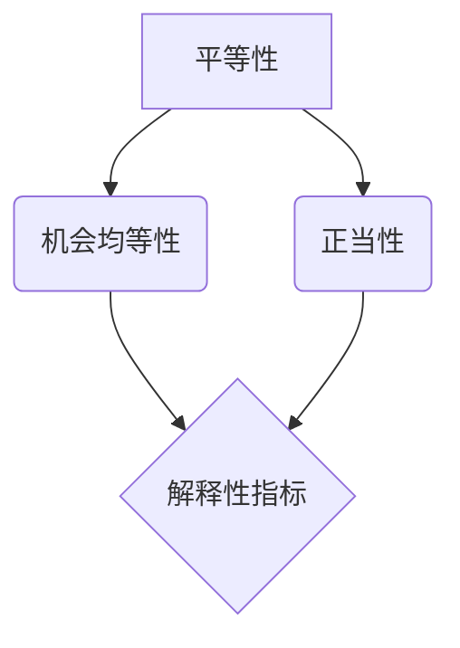

                 

### 1.1 研究背景与意义

#### 1.1.1 机器学习与算法偏见

机器学习（Machine Learning, ML）作为一种人工智能（Artificial Intelligence, AI）的重要分支，已经深刻地影响了我们的日常生活。从图像识别、语音识别、自然语言处理到自动驾驶、医疗诊断等领域，机器学习模型的应用无处不在。然而，随着机器学习技术的广泛应用，算法偏见（Algorithmic Bias）这一问题也逐渐浮出水面，成为学术界和工业界共同关注的焦点。

算法偏见指的是机器学习算法在处理数据时，对某些特定群体产生不公平的结果，这种不公平可能源于数据集的不平衡、算法设计的不完善，或是社会偏见的嵌入。具体来说，算法偏见可以分为以下几个类型：

1. **数据偏差**：当训练数据集存在不均衡或偏斜时，机器学习模型可能会倾向于对某些群体产生不公平的预测结果。
2. **算法偏差**：算法本身的数学原理或设计可能会导致特定的偏见，例如，一些优化算法可能会放大数据中的噪声或偏差。
3. **社会偏见**：算法在设计过程中可能会无意中嵌入社会偏见，特别是在使用含有偏见性标签的数据时。

算法偏见的存在不仅仅是一个技术问题，它对社会公平和伦理道德产生了深远的影响。例如，在招聘系统中，如果算法偏见导致对某一性别、种族或年龄的歧视，那么这将对求职者的公平机会造成严重损害。类似地，在信用评分系统中，算法偏见可能导致某些群体面临不公平的信用评估，从而影响他们的生活质量和经济状况。

因此，研究算法偏见的意义不仅在于提高机器学习模型的准确性和效率，更在于确保算法的应用不会对任何群体产生不公平的影响。通过理解算法偏见的来源和影响，我们可以采取有效的措施来减少或消除这些偏见，从而推动机器学习技术向更加公平、透明和可靠的方向发展。

### 1.2 公平性的概念与重要性

公平性（Fairness）是一个广泛而深刻的概念，通常指在某个特定环境中，个体或群体享有相等的权利和机会，不受任何形式的不公正对待。在机器学习中，公平性关注的是算法在处理数据时，是否对所有群体都保持了公正和无偏见的结果。与公平性相关的概念包括平等性、机会均等性和正当性。

#### 平等性

平等性（Equality）是指算法在处理不同群体时，其表现应该没有显著差异。具体来说，平等性关注的是算法是否对每个群体都给出了相同的平均预测结果。形式化地，我们可以使用以下指标来衡量平等性：

$$ EQLoss = \frac{1}{n}\sum_{i=1}^{n} \left[ \text{Loss}(y_i, \hat{y}_i) - \text{Loss}_{\text{group}}(y_i, \hat{y}_i) \right] $$

其中，\( \text{Loss} \) 表示标准的损失函数，如均方误差（MSE）或交叉熵损失，\( \text{Loss}_{\text{group}} \) 表示针对特定群体的损失函数，\( y_i \) 和 \( \hat{y}_i \) 分别表示真实标签和预测标签。

#### 机会均等性

机会均等性（Opportunity Equity）关注的是算法是否为所有群体提供了相等的机会。在机会均等性的框架下，我们不仅关注每个群体的平均预测结果，还关注个体在特定条件下获得特定结果的概率。一个常见的机会均等性度量是“公平性差距”（Fairness Gap），其公式如下：

$$ \text{Fairness Gap} = \frac{\text{Opportunity Loss}_{\text{group}} - \text{Opportunity Loss}}{\text{Opportunity Loss}} $$

其中，\( \text{Opportunity Loss} \) 表示整体的机会损失，\( \text{Opportunity Loss}_{\text{group}} \) 表示特定群体的机会损失。理想情况下，\( \text{Fairness Gap} \) 应该接近于0。

#### 正当性

正当性（Justifiability）关注的是算法的决策过程是否合理，即算法的决策是否基于可靠的数据和合理的推理。在正当性的框架下，我们不仅要确保算法的输出结果公平，还要能够解释和证明这些结果的合理性。一个常见的正当性度量是“解释性指标”（Explanatory Score），其用于评估算法输出结果的解释性：

$$ \text{Explanatory Score} = \frac{\text{Explanatory Score}_{\text{group}} + \text{Explanatory Score}}{2} $$

其中，\( \text{Explanatory Score}_{\text{group}} \) 和 \( \text{Explanatory Score} \) 分别表示针对特定群体的解释性得分和整体解释性得分。

#### 公平性度量之间的关系

平等性、机会均等性和正当性是公平性的三个不同维度，它们之间既有联系又有区别。平等性关注算法输出的平均效果，机会均等性关注个体在特定条件下的机会，正当性则关注算法决策的合理性和可解释性。在实际应用中，这三个维度常常需要综合考虑，以全面评估算法的公平性。

为了更好地理解这三个维度，我们可以使用一个Mermaid流程图来展示它们之间的关系：



通过这个流程图，我们可以看到，平等性、机会均等性和正当性共同构成了评估算法公平性的完整框架。在实际应用中，我们需要根据具体场景和需求，灵活运用这些度量方法，以实现算法的公平性。

### 1.3 算法偏见的定义与分类

算法偏见（Algorithmic Bias）是指机器学习算法在处理数据时，对某些特定群体产生不公平的结果，这种不公平可能源于数据集的不平衡、算法设计的不完善，或是社会偏见的嵌入。算法偏见可以分为以下几类：

#### 数据偏差

数据偏差（Data Bias）是指数据本身存在的不均衡或偏斜，导致机器学习模型在训练过程中倾向于对某些群体产生不公平的结果。数据偏差的来源可以包括以下几种：

1. **数据收集偏差**：在数据收集过程中，可能存在对某些群体的数据采集不足或过度采集，导致数据集不平衡。
2. **数据标注偏差**：数据标注员可能无意中将自己的偏见带入到数据标注过程中，导致数据标签不准确或存在偏见。
3. **样本选择偏差**：在样本选择过程中，可能存在选择偏差，导致某些群体被过度代表或忽视。

数据偏差的影响主要体现在模型的预测结果上。例如，在一个性别分类任务中，如果训练数据集中女性的样本数量远低于男性，那么模型可能会倾向于预测男性。这种偏见会导致对女性群体的不公平对待。

#### 算法偏差

算法偏差（Algorithm Bias）是指算法本身的设计或数学原理可能导致特定群体的不公平结果。算法偏差可以分为以下几种：

1. **模型偏差**：某些机器学习模型天生对某些特征敏感，导致对特定群体的预测结果产生偏差。例如，线性回归模型可能对异常值敏感，导致对某些群体的预测不准确。
2. **优化偏差**：在优化过程中，某些算法可能会放大数据中的噪声或偏差，导致模型对特定群体的预测结果产生偏见。例如，梯度下降算法在训练过程中可能会陷入局部最优，导致模型性能较差。
3. **评估偏差**：在评估模型性能时，可能存在对某些群体的评估指标过于苛刻，导致模型对这些群体的预测结果较差。

算法偏差的影响主要体现在模型的稳定性和泛化能力上。例如，一个在训练数据上性能优异的模型，在测试数据上可能对某些群体产生严重的偏差，导致预测结果不准确。

#### 社会偏见

社会偏见（Societal Bias）是指算法在设计和应用过程中，无意中嵌入的社会偏见，特别是在使用含有偏见性标签的数据时。社会偏见可以分为以下几种：

1. **偏见性标签**：在数据标注过程中，标注员可能受到社会偏见的影响，导致标签带有偏见。例如，在医疗诊断中，如果医生对某些疾病的认知存在偏见，可能会导致数据的标签不准确。
2. **偏见性设计**：算法的设计者在设计算法时，可能受到自身的社会背景和偏见的影响，导致算法在处理数据时带有偏见。例如，在招聘系统中，如果设计者认为女性在某个岗位上不如男性，可能会在设计过程中嵌入这种偏见。
3. **偏见性反馈**：算法在应用过程中，可能会根据用户的行为数据调整模型，从而导致算法对某些群体产生偏见。例如，在推荐系统中，如果某些用户群体经常选择特定类型的商品，那么算法可能会推荐更多同类商品，导致其他群体被忽视。

社会偏见的影响主要体现在算法的公平性和透明性上。如果算法在设计和应用过程中带有社会偏见，那么可能会导致算法在处理某些群体时产生不公平的结果，从而影响算法的公正性和可信度。

#### 数据偏差与算法偏差的关系

数据偏差和算法偏差相互影响，共同决定了算法的偏见程度。数据偏差可以为算法提供偏斜的输入，而算法偏差则决定了模型如何处理这些输入。例如，在一个包含性别偏见的招聘数据集中，如果模型采用线性回归算法，那么模型可能会放大数据中的性别偏见，导致对女性求职者的不公平待遇。

理解数据偏差和算法偏差的关系对于设计公平的机器学习算法至关重要。通过分析数据偏差的来源和影响，我们可以采取数据预处理方法来减少偏见。而通过优化算法设计和评估指标，我们可以提高模型的稳定性和泛化能力，从而减少算法偏差。

总之，算法偏见是一个复杂而多维度的问题，它涉及到数据、算法和社会等多个层面。只有通过全面分析这些因素，才能设计出公平、透明和可靠的机器学习算法。

### 2.1 数学基础

在探讨机器学习公平性的过程中，数学基础是不可或缺的。以下是概率论、统计学和测度论在机器学习公平性分析中的核心概念和应用。

#### 2.1.1 概率论基础

概率论是机器学习理论的重要基础之一。在算法偏见分析中，概率论提供了量化不确定性和预测不确定性的工具。以下是几个核心概率论概念：

1. **概率分布**：概率分布描述了一个随机变量取值的概率。常见的概率分布包括伯努利分布、正态分布和贝塔分布等。例如，在分类问题中，我们可以使用正态分布来建模类别之间的概率差异。

   $$ f(x|\mu, \sigma^2) = \frac{1}{\sqrt{2\pi\sigma^2}} e^{-\frac{(x-\mu)^2}{2\sigma^2}} $$

2. **条件概率**：条件概率描述了在给定某个事件发生的条件下，另一个事件发生的概率。条件概率公式如下：

   $$ P(A|B) = \frac{P(A \cap B)}{P(B)} $$

   在机器学习中，条件概率常用于推断和预测。例如，在分类任务中，给定一个特征向量，我们可以使用条件概率来预测其属于某个类别的概率。

3. **贝叶斯定理**：贝叶斯定理是条件概率的推广，它提供了通过先验概率和条件概率计算后验概率的方法。贝叶斯定理公式如下：

   $$ P(A|B) = \frac{P(B|A)P(A)}{P(B)} $$

   在机器学习中，贝叶斯定理常用于实现贝叶斯分类器，该分类器通过最大化后验概率来预测类别。

#### 2.1.2 统计学基础

统计学在机器学习中的应用非常广泛，特别是在算法偏见分析中。以下是几个核心统计学概念：

1. **均值和方差**：均值（Mean）和方差（Variance）是描述数据集中心趋势和波动性的基本统计量。均值反映了数据的集中趋势，而方差反映了数据的分散程度。

   $$ \mu = \frac{1}{n}\sum_{i=1}^{n}x_i $$
   $$ \sigma^2 = \frac{1}{n-1}\sum_{i=1}^{n}(x_i - \mu)^2 $$

2. **假设检验**：假设检验是统计学中用于评估数据是否支持某个假设的方法。常见的假设检验包括t检验和卡方检验等。

   例如，在分析算法偏见时，我们可以使用t检验来评估模型在不同群体上的性能差异是否显著。

3. **协方差和相关性**：协方差和相关性描述了两个变量之间的线性关系强度。协方差公式如下：

   $$ \text{Cov}(X, Y) = \frac{1}{n-1}\sum_{i=1}^{n}(x_i - \mu_X)(y_i - \mu_Y) $$

   相关系数（Correlation Coefficient）公式如下：

   $$ \rho_{XY} = \frac{\text{Cov}(X, Y)}{\sigma_X \sigma_Y} $$

   在机器学习中，协方差和相关性用于分析特征之间的关系，从而优化模型性能。

#### 2.1.3 测度论基础

测度论是概率论和统计学的更高层次抽象，它提供了更加广泛和精确的数学工具来描述随机事件和概率分布。以下是测度论在机器学习公平性分析中的核心概念：

1. **测度和概率空间**：测度是一个数学工具，用于量化集合的大小。概率空间是一个包含样本空间、概率测度和事件的数学结构。

   在机器学习中，样本空间可以是所有可能的输入数据集合，概率测度用于计算每个样本出现的概率。

2. **条件期望**：条件期望是概率论中用于描述在给定某个条件下，随机变量的期望值。条件期望公式如下：

   $$ E[X|Y=y] = \int_{-\infty}^{\infty} x f_{X|Y}(x|y) dx $$

   在机器学习中，条件期望用于实现条件生成模型和条件概率推断。

3. **大数定律和中心极限定理**：大数定律和中心极限定理是概率论中描述随机变量行为的重要定理。大数定律指出，随着样本量的增加，样本均值会趋近于总体均值。中心极限定理指出，当样本量足够大时，样本均值的分布会趋近于正态分布。

   这些定理在机器学习中用于评估模型性能的稳定性和可靠性。

通过理解概率论、统计学和测度论的基础概念，我们可以更好地分析和评估机器学习算法的公平性。这些数学工具不仅帮助我们量化算法偏见，还为设计公平的机器学习算法提供了理论基础。

#### 2.2.1 监督学习算法

监督学习（Supervised Learning）是机器学习中的一个重要分支，其主要目标是利用标记好的训练数据集来构建预测模型。监督学习算法通过学习输入特征和输出标签之间的关系，从而在新数据上进行预测。以下是几种常见的监督学习算法及其核心原理：

##### 2.2.1.1 线性回归

线性回归（Linear Regression）是最简单的监督学习算法之一，它通过拟合一个线性模型来预测连续值输出。线性回归的核心原理可以表示为：

$$ y = \beta_0 + \beta_1 x_1 + \beta_2 x_2 + ... + \beta_n x_n $$

其中，\( y \) 是输出标签，\( x_1, x_2, ..., x_n \) 是输入特征，\( \beta_0, \beta_1, ..., \beta_n \) 是模型参数。线性回归的目标是最小化预测值与实际值之间的平方误差：

$$ \text{Loss} = \sum_{i=1}^{n} (y_i - \hat{y}_i)^2 $$

其中，\( \hat{y}_i \) 是预测值。线性回归的优化方法通常是梯度下降（Gradient Descent），其伪代码如下：

```python
while not converged do
    compute gradient of loss function
    update model parameters
end while
```

##### 2.2.1.2 决策树

决策树（Decision Tree）是一种基于树结构的分类算法，它通过一系列的判断规则来分割数据集，最终预测出类别标签。决策树的核心原理如下：

1. **特征选择**：选择一个最佳特征来分割数据集，通常使用信息增益（Information Gain）或基尼系数（Gini Impurity）作为评价指标。
2. **递归分割**：对于每个子数据集，重复上述特征选择和分割过程，直到满足停止条件（如最大树深度或最小节点大小）。

决策树的选择过程可以用伪代码表示如下：

```python
function build_decision_tree(data, max_depth):
    if data is pure or max_depth reached:
        return leaf node
    else:
        select best feature and split
        for each split value:
            left_child = build_decision_tree(split(left), max_depth - 1)
            right_child = build_decision_tree(split(right), max_depth - 1)
        return decision tree
```

##### 2.2.1.3 支持向量机

支持向量机（Support Vector Machine, SVM）是一种强大的分类算法，它通过找到一个最佳的超平面来分隔数据集。SVM的核心原理如下：

1. **最大间隔分类器**：寻找一个超平面，使得分类间隔最大化。间隔是指分类边界到最近支持向量的距离。
2. **核函数**：通过使用核函数，可以将低维数据映射到高维空间，从而在更高维空间中找到线性可分的数据。

SVM的优化目标是最小化以下损失函数：

$$ \min_{\beta, \beta_0} \frac{1}{2} ||\beta||^2 + C \sum_{i=1}^{n} \xi_i $$

其中，\( \beta \) 是权重向量，\( \beta_0 \) 是偏置项，\( C \) 是惩罚参数，\( \xi_i \) 是松弛变量。SVM的求解通常使用拉格朗日乘子法，其伪代码如下：

```python
function solve_SVM(data, C):
    build Lagrangian function
    optimize using gradient descent or quadratic programming
    return solution
```

##### 2.2.1.4 集成方法

集成方法（Ensemble Methods）通过结合多个基础模型来提高预测性能。常见的集成方法包括随机森林（Random Forest）和梯度提升树（Gradient Boosting Tree）。

1. **随机森林**：随机森林通过构建多棵决策树，并使用投票或平均来获得最终预测。随机森林的核心原理如下：

   - 随机选择特征子集。
   - 对于每个特征子集，构建一棵决策树。
   - 在测试数据上，对所有决策树的预测进行投票或平均。

   随机森林的伪代码如下：

   ```python
   function random_forest(data, num_trees):
       for each tree:
           sample data with replacement
           build decision tree
       end for
       for each sample in test data:
           predict using all trees
           aggregate predictions
       end for
       return final prediction
   ```

2. **梯度提升树**：梯度提升树通过迭代优化来提高模型性能。每轮迭代中，梯度提升树会找到一个残差函数来最小化损失函数，其伪代码如下：

   ```python
   function gradient_boosting_tree(data, num_iterations, learning_rate):
       initialize model
       for each iteration:
           compute gradient of loss function
           update model parameters using gradient descent
       end for
       return final model
   ```

通过理解这些监督学习算法的核心原理，我们可以更好地设计公平性评估方法和优化策略，以减少算法偏见，实现更加公正的机器学习应用。

#### 2.2.2 无监督学习算法

无监督学习（Unsupervised Learning）是机器学习中的另一大分支，与监督学习不同的是，它不需要预先标记的输出标签。无监督学习的目标是通过分析未标记的数据，发现数据中的模式和结构。以下是几种常见的无监督学习算法及其应用场景：

##### 2.2.2.1 主成分分析（PCA）

主成分分析（Principal Component Analysis, PCA）是一种降维技术，通过将数据投影到新的正交坐标系中，来提取数据的主要特征。PCA的核心原理如下：

1. **协方差矩阵**：计算数据集的协方差矩阵，该矩阵描述了特征之间的相关性。
2. **特征分解**：对协方差矩阵进行特征分解，找到特征值和特征向量。特征向量对应于新的正交坐标系，特征值表示特征的重要性。
3. **数据投影**：将原始数据投影到新的坐标系中，新的坐标轴（主成分）代表数据的最大方差方向。

PCA的数学表达式如下：

$$ X' = PC $$

其中，\( X \) 是原始数据矩阵，\( P \) 是特征向量矩阵，\( C \) 是特征值矩阵，\( X' \) 是投影后的数据矩阵。PCA在降维和特征提取方面有广泛应用，例如图像压缩、异常检测和聚类分析。

##### 2.2.2.2 K均值聚类（K-Means）

K均值聚类（K-Means）是一种基于距离的聚类算法，它将数据分为K个簇，每个簇由其质心（中心点）表示。K均值聚类的核心原理如下：

1. **初始化质心**：随机选择K个初始质心。
2. **分配数据点**：计算每个数据点到质心的距离，并将数据点分配到最近的质心所代表的簇。
3. **更新质心**：计算每个簇的质心，即簇中所有点的均值。
4. **迭代更新**：重复步骤2和3，直到质心不再发生变化或满足停止条件。

K均值聚类的伪代码如下：

```python
function KMeans(data, K, max_iterations):
    initialize centroids randomly
    for each iteration:
        assign data points to clusters
        update centroids
    end for
    return clusters
```

K均值聚类在数据分割、异常检测和文本分析等领域有广泛应用。

##### 2.2.2.3 转移矩阵（Markov Chains）

转移矩阵是一种用于描述系统状态转移概率的数学工具，它在序列数据分析和时间序列预测中具有重要应用。转移矩阵的核心原理如下：

1. **状态定义**：定义系统可能的状态集合，如天气状态（晴、雨、多云）。
2. **转移概率**：计算从当前状态转移到下一个状态的概率，形成转移矩阵。
3. **状态预测**：根据当前状态和转移概率，预测下一个状态。

转移矩阵的数学表示如下：

$$ P = \begin{bmatrix}
p_{00} & p_{01} & p_{02} \\
p_{10} & p_{11} & p_{12} \\
p_{20} & p_{21} & p_{22}
\end{bmatrix} $$

其中，\( p_{ij} \) 表示从状态i转移到状态j的概率。转移矩阵在预测股票价格、交通流量分析和自然语言处理中有广泛应用。

##### 2.2.2.4 聚类层次分析（Hierarchical Clustering）

聚类层次分析是一种通过迭代合并或分裂簇来构建聚类层次结构的算法。聚类层次分析的核心原理如下：

1. **距离度量**：计算数据点之间的距离，如欧氏距离或曼哈顿距离。
2. **合并或分裂**：在每次迭代中，根据簇之间的相似度，合并或分裂簇。
3. **构建层次树**：记录每次合并或分裂操作，构建聚类层次树。

聚类层次分析的伪代码如下：

```python
function HierarchicalClustering(data, distance_measure):
    initialize clusters as singletons
    while not all clusters merged:
        find closest clusters
        merge or split clusters
    end while
    build hierarchical tree
    return tree
```

聚类层次分析在图像分割、文本聚类和生物信息学中有广泛应用。

通过理解和应用这些无监督学习算法，我们可以更好地分析复杂的数据集，提取有用的信息，并应用于各种实际场景中。

### 3.1 偏差来源与影响

算法偏见可能源于多个方面，这些偏见不仅影响模型的性能，还可能对实际应用产生严重的社会影响。下面，我们将详细讨论数据偏差、算法偏差和社会偏见的具体来源、表现形式及其影响。

#### 3.1.1 数据偏差

数据偏差是算法偏见的一个重要来源，它通常体现在数据集的收集、标注和处理过程中。以下是数据偏差的几种主要来源：

1. **采样偏差**：在数据收集过程中，如果样本选择不具代表性，那么数据集可能会倾向于某些群体，而忽视其他群体。例如，在招聘系统中，如果仅从某个特定的学校或地区招聘员工，那么数据集就可能缺乏多样性。

2. **标签偏差**：在数据标注过程中，标注员的偏见可能会影响数据的准确性。例如，在医疗诊断中，如果医生对某些疾病的认知存在偏见，可能会导致数据标签不准确。

3. **异常值处理**：数据集中可能包含异常值或噪声，这些异常值可能会影响模型的训练结果。如果异常值处理不当，模型可能会学会错误的特征关联。

数据偏差对算法的影响主要体现在两个方面：

1. **模型泛化能力下降**：如果数据集存在偏差，那么模型在训练过程中可能会学会错误的特征关联，导致模型在新的、未见过的数据上的表现不佳。

2. **预测结果不公平**：数据偏差可能会导致模型对某些群体的预测结果不公平。例如，在一个性别分类任务中，如果数据集中女性的样本数量远低于男性，那么模型可能会倾向于预测男性，从而对女性产生不公平待遇。

#### 3.1.2 算法偏差

算法偏差源于算法的设计和实现过程，这种偏见可能导致模型在处理数据时对某些群体产生不公平的结果。以下是几种常见的算法偏差来源：

1. **算法选择**：某些算法对特定类型的数据更敏感，可能导致对某些群体的预测结果产生偏差。例如，线性回归算法可能对异常值敏感，导致对某些群体的预测不准确。

2. **参数设置**：算法参数的设置可能影响模型的预测结果。例如，在支持向量机（SVM）中，惩罚参数C的设置会影响分类边界，从而影响模型的公平性。

3. **特征选择**：特征选择过程可能引入偏见，导致模型对某些群体的预测结果不公平。例如，如果某些特征在数据集中存在偏见性标签，那么这些特征可能会放大模型对特定群体的偏见。

算法偏差的影响主要体现在以下两个方面：

1. **模型稳定性下降**：算法偏差可能导致模型对特定群体的预测结果不稳定，从而影响模型的泛化能力和鲁棒性。

2. **预测结果不公平**：算法偏差可能会导致模型对某些群体的预测结果不公平。例如，在信用评分系统中，如果算法设计不当，可能会导致对某些种族或年龄的歧视。

#### 3.1.3 社会偏见

社会偏见是指算法在设计和应用过程中，无意中嵌入的社会偏见。社会偏见可能源于多个方面，包括社会规范、文化偏见和制度设计。以下是社会偏见的几种来源：

1. **文化偏见**：在算法设计和实现过程中，设计者可能受到自身文化背景的影响，导致算法在处理数据时带有偏见。例如，在招聘系统中，如果设计者认为女性在某个岗位上不如男性，那么算法可能会在招聘过程中对女性产生不公平待遇。

2. **制度偏见**：现有的社会制度和政策可能影响数据集的收集和处理，从而引入偏见。例如，在信用评分系统中，如果政策要求对某些群体进行特殊考虑，那么算法可能会在评分过程中对这部分群体产生偏见。

3. **反馈循环**：算法在应用过程中，可能会根据用户的行为数据调整模型，从而形成一个反馈循环。如果初始数据存在偏见，那么算法可能会不断放大这种偏见，导致预测结果更加不公平。

社会偏见的影响主要体现在以下几个方面：

1. **模型公正性下降**：社会偏见可能导致模型在处理数据时缺乏公正性，从而影响模型的可信度和合法性。

2. **社会问题加剧**：算法偏见可能会加剧社会不平等问题，例如，在招聘、信用评分和医疗诊断等领域，算法偏见可能导致对某些群体的不公平待遇，从而加剧社会不平等。

3. **法律和伦理风险**：算法偏见可能引发法律和伦理问题，例如，在招聘系统中，算法偏见可能导致性别或种族歧视，从而违反相关法律法规。

总之，数据偏差、算法偏差和社会偏见是算法偏见的主要来源。理解这些偏差的来源和影响，有助于我们采取有效措施来减少或消除算法偏见，从而推动机器学习技术向更加公平、透明和可靠的方向发展。

### 3.2 公平性度量

在分析算法偏见时，公平性度量是评估算法公平性的关键工具。公平性度量可以帮助我们量化算法在处理不同群体时的性能差异，从而识别和减少偏见。以下是几种常见的公平性度量方法及其计算公式和解释。

#### 3.2.1 平等性度量

平等性度量（Equality Measure）是最基本的公平性度量方法，它关注算法在不同群体上的平均表现。常见的平等性度量包括组内平均损失（Group Intra-Loss）和组间平均损失（Group Inter-Loss）。

1. **组内平均损失**：组内平均损失度量了每个群体内部的平均损失，公式如下：

   $$ \text{Group Intra-Loss} = \frac{1}{k} \sum_{i=1}^{k} \frac{1}{n_i} \sum_{j=1}^{n_i} \text{Loss}(y_{ij}, \hat{y}_{ij}) $$

   其中，\( k \) 表示群体的数量，\( n_i \) 表示第 \( i \) 个群体的样本数量，\( \text{Loss}(y_{ij}, \hat{y}_{ij}) \) 表示第 \( i \) 个群体中第 \( j \) 个样本的损失函数值。

   组内平均损失越小，表示群体内部的预测结果越接近实际值，算法在该群体上的表现越好。

2. **组间平均损失**：组间平均损失度量了不同群体之间的平均损失差异，公式如下：

   $$ \text{Group Inter-Loss} = \frac{1}{k} \sum_{i=1}^{k} \text{Loss}(y_i, \hat{y}_i) $$

   其中，\( \text{Loss}(y_i, \hat{y}_i) \) 表示第 \( i \) 个群体的总损失。

   组间平均损失越小，表示不同群体之间的预测结果差异越小，算法的公平性越高。

#### 3.2.2 机会均等度量

机会均等度量（Opportunity Equity Measure）关注的是每个群体在获得特定结果上的机会是否相等。常见的机会均等度量包括机会均等性指标（Opportunity Equity Index）和公平性差距（Fairness Gap）。

1. **机会均等性指标**：机会均等性指标度量了不同群体在获得特定结果（如被录取、获得贷款等）上的概率差异，公式如下：

   $$ \text{Opportunity Equity Index} = \frac{\sum_{i=1}^{k} \sum_{j=1}^{n_i} \text{Prediction}_{ij} \cdot \text{Probability}_{ij}}{\sum_{i=1}^{k} \sum_{j=1}^{n_i} \text{Probability}_{ij}} $$

   其中，\( \text{Prediction}_{ij} \) 表示第 \( i \) 个群体中第 \( j \) 个样本的预测结果（1表示正类，-1表示负类），\( \text{Probability}_{ij} \) 表示第 \( i \) 个群体中第 \( j \) 个样本属于正类的概率。

   机会均等性指标越接近1，表示群体之间的机会差异越小，算法的公平性越高。

2. **公平性差距**：公平性差距度量了不同群体的机会损失差异，公式如下：

   $$ \text{Fairness Gap} = \frac{\sum_{i=1}^{k} \sum_{j=1}^{n_i} \text{Prediction}_{ij} \cdot \text{Probability}_{ij} - \sum_{j=1}^{n} \sum_{i=1}^{k} \text{Prediction}_{ij} \cdot \text{Probability}_{ij}}{\sum_{j=1}^{n} \sum_{i=1}^{k} \text{Prediction}_{ij} \cdot \text{Probability}_{ij}} $$

   公平性差距越小，表示群体之间的机会差异越小，算法的公平性越高。

#### 3.2.3 正当性度量

正当性度量（Justifiability Measure）关注算法决策的合理性和可解释性，旨在确保算法的决策过程是公平、透明且合理的。常见的正当性度量包括解释性指标（Explanatory Score）和解释性差距（Explanatory Gap）。

1. **解释性指标**：解释性指标度量了算法在解释预测结果时的能力，公式如下：

   $$ \text{Explanatory Score} = \frac{\sum_{i=1}^{k} \sum_{j=1}^{n_i} \text{Explanation}_{ij} \cdot \text{Probability}_{ij}}{\sum_{j=1}^{n} \sum_{i=1}^{k} \text{Explanation}_{ij} \cdot \text{Probability}_{ij}} $$

   其中，\( \text{Explanation}_{ij} \) 表示第 \( i \) 个群体中第 \( j \) 个样本的预测解释性得分，\( \text{Probability}_{ij} \) 表示第 \( i \) 个群体中第 \( j \) 个样本属于正类的概率。

   解释性指标越接近1，表示算法的解释性越好，决策过程越透明。

2. **解释性差距**：解释性差距度量了不同群体之间的解释性差异，公式如下：

   $$ \text{Explanatory Gap} = \frac{\sum_{i=1}^{k} \sum_{j=1}^{n_i} (\text{Explanation}_{ij} - \text{Mean Explanation}) \cdot \text{Probability}_{ij}}{\sum_{j=1}^{n} \sum_{i=1}^{k} \text{Explanation}_{ij} \cdot \text{Probability}_{ij}} $$

   其中，\( \text{Mean Explanation} \) 表示所有群体的平均解释性得分。

   解释性差距越小，表示群体之间的解释性差异越小，算法的决策过程越合理。

通过这些公平性度量方法，我们可以量化算法在不同群体上的性能差异，从而评估算法的公平性。这些度量方法不仅可以帮助识别和减少算法偏见，还可以为算法设计和优化提供重要指导。

### 3.3 数学模型与算法优化

在评估和优化机器学习算法的公平性时，数学模型起到了关键作用。这些模型不仅提供了理论依据，还帮助我们设计和实现具体的优化策略。以下是几种常见的基于数学模型的公平性优化方法，包括基于概率论的公平性模型、基于统计学理论的公平性模型以及基于优化理论的公平性模型。

#### 3.3.1 基于概率论的公平性模型

概率论在机器学习公平性分析中提供了强大的工具。基于概率论的公平性模型主要关注如何确保预测结果的概率分布是公平的。以下是两种常见的概率论模型：

1. **概率公平性**：概率公平性模型旨在确保模型在不同群体上的预测概率分布是相等的。具体来说，假设我们有两个群体A和B，每个群体的预测概率分别表示为\( P_A \)和\( P_B \)，概率公平性要求：

   $$ P_A = P_B $$

   为实现概率公平性，我们可以使用以下优化目标：

   $$ \min_{\theta} \sum_{i=1}^{n} \ell(y_i, \hat{y}_i(\theta)) + \lambda \cdot \sum_{g \in \text{groups}} \left| \frac{1}{n_g} \sum_{i \in g} \log \hat{y}_i(\theta) - \mu_g \right| $$

   其中，\( \theta \) 是模型参数，\( \ell \) 是损失函数，\( \lambda \) 是调节参数，\( n_g \) 是群体\( g \)中的样本数量，\( \mu_g \) 是群体\( g \)的平均预测概率。

2. **贝叶斯公平性**：贝叶斯公平性模型基于贝叶斯定理，通过最大化后验概率来确保预测结果的合理性。具体来说，假设我们有两个类别A和B，每个类别的先验概率表示为\( P(A) \)和\( P(B) \)，贝叶斯公平性要求：

   $$ P(A|D) = P(B|D) $$

   其中，\( D \) 是特征向量。为实现贝叶斯公平性，我们可以使用以下优化目标：

   $$ \min_{\theta} \sum_{i=1}^{n} \ell(y_i, \hat{y}_i(\theta)) + \lambda \cdot \sum_{g \in \text{groups}} \left| \frac{1}{n_g} \sum_{i \in g} \log P(y_i|\theta) - \log P(g|\theta) \right| $$

   其中，\( P(y_i|\theta) \) 是给定模型参数\( \theta \)的条件下，样本\( i \)属于类别\( g \)的概率，\( P(g|\theta) \) 是群体\( g \)的先验概率。

#### 3.3.2 基于统计学理论的公平性模型

统计学理论为机器学习公平性分析提供了重要的框架，特别是假设检验和置信区间等概念。以下是几种常见的基于统计学理论的公平性模型：

1. **置信区间**：置信区间（Confidence Interval）提供了一种评估预测结果可靠性的方法。具体来说，假设我们想要评估模型在不同群体上的性能，我们可以计算每个群体的置信区间，确保这些区间不包含错误决策的区域。置信区间的计算公式如下：

   $$ \hat{y}_i \pm z_{\alpha/2} \sqrt{\frac{\hat{\sigma}^2}{n}} $$

   其中，\( \hat{y}_i \) 是样本\( i \)的预测值，\( \hat{\sigma}^2 \) 是样本的方差，\( n \) 是样本数量，\( z_{\alpha/2} \) 是标准正态分布的临界值。

2. **假设检验**：假设检验（Hypothesis Testing）用于评估模型在不同群体上的性能是否存在显著差异。常见的假设检验包括t检验和卡方检验。以t检验为例，假设我们要比较模型在两个群体A和B上的性能差异，我们可以设置以下零假设和备择假设：

   $$ H_0: \mu_A = \mu_B $$
   $$ H_1: \mu_A \neq \mu_B $$

   其中，\( \mu_A \) 和 \( \mu_B \) 分别是群体A和B的平均预测值。t检验的计算公式如下：

   $$ t = \frac{\bar{x}_1 - \bar{x}_2}{\sqrt{\frac{s_1^2}{n_1} + \frac{s_2^2}{n_2}}} $$

   其中，\( \bar{x}_1 \) 和 \( \bar{x}_2 \) 分别是群体A和B的平均预测值，\( s_1^2 \) 和 \( s_2^2 \) 分别是群体A和B的方差，\( n_1 \) 和 \( n_2 \) 分别是群体A和B的样本数量。t值越大，表明两个群体之间的性能差异越显著。

#### 3.3.3 基于优化理论的公平性模型

优化理论为机器学习公平性分析提供了系统化的方法，通过优化模型参数来实现公平性目标。以下是几种常见的基于优化理论的公平性模型：

1. **权重调整**：权重调整（Weight Adjustment）通过调整不同群体的权重来减少偏见。具体来说，我们可以定义一个权重向量\( w \)，然后通过优化目标调整权重，使模型在不同群体上的损失最小化。优化目标如下：

   $$ \min_{w} \sum_{i=1}^{n} w_i \ell(y_i, \hat{y}_i(w)) $$

   其中，\( \ell \) 是损失函数，\( w_i \) 是第 \( i \) 个样本的权重。通过调整权重，我们可以使模型更关注那些容易被偏见影响的群体。

2. **惩罚函数**：惩罚函数（Penalty Function）通过在损失函数中引入惩罚项来减少偏见。具体来说，我们可以定义一个惩罚函数\( \rho(w) \)，然后在优化过程中加入惩罚项。优化目标如下：

   $$ \min_{w} \sum_{i=1}^{n} \ell(y_i, \hat{y}_i(w)) + \lambda \rho(w) $$

   其中，\( \lambda \) 是调节参数，\( \rho(w) \) 是惩罚函数。常见的惩罚函数包括绝对值惩罚和平方惩罚，它们可以确保权重在合理范围内调整。

通过这些基于数学模型的优化方法，我们可以设计出更加公平的机器学习算法。这些方法不仅有助于减少算法偏见，还可以提高模型的泛化能力和可解释性，从而推动机器学习技术向更加公正和可靠的方向发展。

### 3.3.4 常见公平性优化策略

为了提高机器学习算法的公平性，研究者们提出了多种优化策略。这些策略主要关注如何减少算法偏见，确保模型在不同群体上的表现一致。以下是几种常见的公平性优化策略及其原理：

#### 1. 数据平衡（Data Balancing）

数据平衡是一种通过调整数据集来减少偏见的方法。具体来说，通过增加少数群体的样本数量或合成新的样本，可以使数据集更具代表性。以下是一种常见的数据平衡策略：

- **过采样（Over-Sampling）**：通过复制少数群体的样本来增加其数量，使整体数据集达到平衡。

  伪代码：
  ```python
  function oversample(dataset, minority_group):
      for sample in minority_group:
          duplicate sample in dataset
      return dataset
  ```

- **下采样（Under-Sampling）**：通过删除多数群体的样本来减少其数量，使整体数据集达到平衡。

  伪代码：
  ```python
  function undersample(dataset, majority_group):
      select samples from majority_group randomly
      remove selected samples from dataset
      return dataset
  ```

- **合成样本（Synthetic Sampling）**：通过生成新的样本来补充少数群体，这种方法可以保持数据的多样性。

  伪代码：
  ```python
  function generate_synthetic_samples(dataset, minority_group):
      for sample in minority_group:
          generate new samples similar to sample
          add new samples to dataset
      return dataset
  ```

#### 2. 特征工程（Feature Engineering）

特征工程通过设计新的特征或调整现有特征来减少偏见。以下是一种特征工程策略：

- **特征选择（Feature Selection）**：选择与目标变量关系较强的特征，同时避免选择带有偏见的特征。

  伪代码：
  ```python
  function select_features(dataset, target_variable):
      compute feature importance
      select top-k features with highest importance
      return selected_features
  ```

- **特征变换（Feature Transformation）**：通过变换特征值来减少偏见，例如，使用标准缩放（Standard Scaling）或局部加权回归（Local Weighted Regression）。

  伪代码：
  ```python
  function transform_features(dataset, method):
      if method == "StandardScaling":
          mean = compute_mean(dataset)
          std = compute_std(dataset)
          dataset = (dataset - mean) / std
      elif method == "LocalWeightedRegression":
          # implement local weighted regression
      return transformed_dataset
  ```

#### 3. 模型调整（Model Tuning）

模型调整通过调整模型参数来减少偏见。以下是一种模型调整策略：

- **交叉验证（Cross-Validation）**：使用交叉验证来评估模型在不同群体上的表现，并通过调整参数来优化模型。

  伪代码：
  ```python
  function cross_validate(model, dataset, k):
      for each fold in k-fold cross-validation:
          train model on training set
          evaluate model on validation set
      return average performance
  ```

- **模型选择（Model Selection）**：选择能够减少偏见的模型，例如，使用集成方法（如随机森林或梯度提升树）来提高模型的稳定性和公平性。

  伪代码：
  ```python
  function select_model(models, dataset):
      evaluate each model using cross-validation
      select model with best performance on fairness metrics
      return selected_model
  ```

通过这些公平性优化策略，我们可以设计出更加公平、透明和可靠的机器学习算法，从而减少算法偏见，提高模型在实际应用中的公正性。

### 4.1 案例选择与介绍

在讨论算法偏见时，实际案例的研究至关重要。通过分析具体的案例，我们可以更深入地理解算法偏见的表现形式和影响。以下将介绍三个典型案例：招聘中的性别偏见、信用评分中的种族歧视以及个性化推荐中的群体偏见。

#### 4.1.1 招聘中的性别偏见

在招聘过程中，机器学习算法经常被用于筛选求职者。然而，如果算法训练数据集存在性别偏见，那么算法可能会在招聘决策中放大这种偏见，导致对某一性别的歧视。例如，在一项针对大型科技公司招聘数据的研究中，研究者发现机器学习模型在筛选简历时对男性求职者更倾向于给予更高的评分，而对女性求职者的评分则相对较低。

这种偏见可能源于多种因素，包括简历格式、求职者的技能描述以及招聘者的主观偏见。通过分析这些案例，可以发现机器学习算法在招聘过程中如何放大或固化的性别偏见。这不仅影响求职者的公平机会，还可能加剧性别不平等问题。

#### 4.1.2 信用评分中的种族歧视

信用评分系统是评估个人或企业信用风险的工具，广泛应用于贷款、信用卡审批等领域。然而，研究表明，这些系统可能存在种族歧视问题。例如，在一项对美国信用卡数据分析的研究中，发现某些种族群体的信用评分显著低于其他群体，即使他们在财务状况上并无显著差异。

这种偏见可能源于数据偏差和算法偏差。例如，如果训练数据集中存在种族偏见，算法可能会学会将某些种族与较低的信用评分相关联。此外，算法设计中的某些参数设置也可能放大这种偏见。通过深入分析这些案例，我们可以理解信用评分系统如何在不经意间导致种族歧视，从而影响特定群体的经济生活。

#### 4.1.3 个性化推荐中的群体偏见

个性化推荐系统广泛应用于电子商务、社交媒体和在线媒体等领域，旨在为用户提供个性化的内容推荐。然而，这些系统也可能存在群体偏见问题。例如，在一项针对在线新闻推荐的研究中，发现推荐系统可能对某些性别、种族或年龄群体有偏见，导致这些群体的用户接收到的推荐内容有限或带有偏见。

这种偏见可能源于用户行为数据的偏差和算法设计中的偏见。例如，如果用户数据集中某些群体的行为模式被低估或忽略，那么算法可能会对这些群体产生偏见。此外，推荐算法的某些参数设置也可能放大这种偏见。通过分析这些案例，我们可以了解个性化推荐系统如何在不经意间导致群体偏见，从而影响用户的体验和选择。

这三个案例不仅展示了算法偏见在不同应用领域的表现形式，还揭示了算法偏见对社会公平和伦理的影响。通过深入研究和分析这些案例，我们可以更好地理解算法偏见的根源和影响，从而设计出更加公平和透明的机器学习算法。

### 4.2 案例分析

#### 4.2.1 案例一：招聘中的性别偏见

在招聘过程中，机器学习算法被广泛用于筛选简历和预测求职者的面试机会。然而，这些算法可能会无意中放大性别偏见，导致对女性求职者的不公平待遇。以下是关于招聘中性别偏见的具体分析：

**1. 数据偏差**：招聘数据集中可能存在性别偏见。例如，如果女性在某个职位上的代表性较低，那么在简历筛选过程中，机器学习算法可能会认为女性求职者在特定职位上的竞争力较低。这种偏见可能源于社会结构和文化偏见，使得女性在特定领域中的代表性不足。

**2. 算法偏差**：机器学习算法可能在处理数据时放大了性别偏见。例如，假设我们使用了一个基于自然语言处理的简历筛选算法，该算法通过分析简历中的词汇和语法结构来评估求职者的技能和经验。然而，如果训练数据集中女性简历的代表性较低，那么算法可能会低估女性求职者的能力，从而给出较低的评分。

**3. 社会偏见**：算法设计者可能无意中在算法中嵌入了社会偏见。例如，在设置算法参数时，设计者可能倾向于使用一些与性别相关的特征，如“领导能力”、“沟通技巧”等。这些特征可能会无意中放大对女性的偏见，因为社会普遍认为这些特征在女性中出现的频率较低。

**分析过程**：

- **数据收集**：首先，我们需要收集一个包含求职者性别和简历评分的招聘数据集。这个数据集应该涵盖多个职位和多个性别。
- **特征提取**：从简历中提取与性别相关的特征，如词汇频率、语法结构等。同时，提取与职位相关的特征，如教育背景、工作经验等。
- **模型训练**：使用机器学习算法（如朴素贝叶斯分类器或支持向量机）对数据集进行训练，以预测求职者的简历评分。
- **模型评估**：在测试数据集上评估模型的性能，并计算不同性别求职者的平均简历评分。如果发现女性求职者的平均评分显著低于男性，那么可能存在性别偏见。

**解决方案**：

- **数据预处理**：通过数据平衡策略，如过采样和下采样，来减少数据集中性别偏见的偏差。此外，可以使用合成样本技术来生成新的女性简历样本，以增加数据集中女性的代表性。
- **算法调整**：调整算法参数，确保算法在处理不同性别简历时保持一致性。例如，可以采用性别中立的词汇和语法特征，减少与性别相关的偏见。
- **公平性度量**：使用公平性度量方法（如平等性度量、机会均等度量等）来评估算法在不同性别求职者上的表现。通过这些度量方法，可以及时发现和纠正算法偏见。

通过上述分析，我们可以看出，招聘中的性别偏见是一个复杂的问题，涉及数据偏差、算法偏差和社会偏见。通过有效的数据预处理、算法调整和公平性度量，我们可以设计出更加公平的招聘算法，减少性别偏见，为所有求职者提供平等的就业机会。

#### 4.2.2 案例二：信用评分中的种族歧视

信用评分系统是金融机构用来评估个人或企业信用风险的重要工具，然而，这些系统可能存在种族歧视问题，导致某些种族群体的信用评分显著低于其他群体。以下是关于信用评分中种族歧视的具体分析：

**1. 数据偏差**：在训练信用评分模型时，数据集可能存在种族偏见。例如，如果一个地区的种族多样化程度较低，那么训练数据集中特定种族的数据样本量可能较少，导致模型对这些种族的信用风险评估不准确。

**2. 算法偏差**：信用评分模型本身可能带有种族偏见。例如，模型可能依赖于一些与种族相关的特征，如居住地区、职业类型等。这些特征可能导致模型对某些种族群体的信用评分产生偏见。

**3. 社会偏见**：社会对某些种族的偏见可能直接影响到信用评分模型的设计和实施。例如，某些金融机构可能基于对特定种族的负面刻板印象，在信用评分模型中给予这些种族较低的权重。

**分析过程**：

- **数据收集**：首先，我们需要收集一个包含个人种族和信用评分的数据集。这个数据集应该涵盖多个种族和多种信用评分情况。
- **特征提取**：从数据中提取与种族相关的特征，如种族、居住地区、职业类型等。同时，提取与信用评分相关的特征，如信用额度、还款历史等。
- **模型训练**：使用机器学习算法（如逻辑回归或决策树）对数据集进行训练，以预测个人的信用评分。
- **模型评估**：在测试数据集上评估模型的性能，并计算不同种族群体的平均信用评分。如果发现某些种族群体的平均信用评分显著低于其他种族，那么可能存在种族偏见。

**解决方案**：

- **数据预处理**：通过数据平衡策略，如过采样和下采样，来减少数据集中种族偏见的偏差。此外，可以使用合成样本技术来生成新的种族样本，以增加数据集中的多样性。
- **算法调整**：调整算法参数，确保算法在处理不同种族数据时保持一致性。例如，可以采用基于证据的理论（Evidence-Based Theories）来重新评估与种族相关的特征，减少对种族的偏见。
- **公平性度量**：使用公平性度量方法（如平等性度量、机会均等度量等）来评估算法在不同种族群体上的表现。通过这些度量方法，可以及时发现和纠正算法偏见。

通过上述分析，我们可以看出，信用评分中的种族歧视是一个复杂的问题，涉及数据偏差、算法偏差和社会偏见。通过有效的数据预处理、算法调整和公平性度量，我们可以设计出更加公平的信用评分系统，减少种族偏见，为所有种族群体提供平等的信用评估。

#### 4.2.3 案例三：个性化推荐中的群体偏见

个性化推荐系统广泛应用于电子商务、社交媒体和在线媒体等领域，旨在为用户提供个性化的内容推荐。然而，这些系统可能存在群体偏见问题，导致某些群体的用户接收到的推荐内容有限或带有偏见。以下是关于个性化推荐中群体偏见的具体分析：

**1. 数据偏差**：个性化推荐系统依赖于用户行为数据来生成推荐。然而，这些数据可能存在偏差，导致某些群体被低估或忽略。例如，如果一个社交网络平台上的女性用户活跃度较低，那么系统可能会对女性用户生成较少的推荐，导致她们错过个性化体验。

**2. 算法偏差**：个性化推荐算法可能在处理数据时放大了群体偏见。例如，如果算法依赖于某些与性别相关的特征，如浏览历史、点击行为等，那么系统可能会对某些性别群体的推荐产生偏见。

**3. 社会偏见**：算法设计者可能无意中在算法中嵌入了社会偏见。例如，在设置算法参数时，设计者可能倾向于使用一些与性别、种族或年龄相关的特征，导致系统对这些群体的推荐产生偏见。

**分析过程**：

- **数据收集**：首先，我们需要收集一个包含用户性别、种族和推荐历史的数据集。这个数据集应该涵盖多个性别、种族和多种推荐内容。
- **特征提取**：从数据中提取与群体相关的特征，如性别、种族、年龄等。同时，提取与推荐相关的特征，如浏览历史、点击行为等。
- **模型训练**：使用机器学习算法（如协同过滤或内容推荐）对数据集进行训练，以生成个性化推荐。
- **模型评估**：在测试数据集上评估模型的性能，并计算不同性别、种族群体的推荐效果。如果发现某些群体的推荐效果较差，那么可能存在群体偏见。

**解决方案**：

- **数据预处理**：通过数据平衡策略，如过采样和下采样，来减少数据集中群体偏见的偏差。此外，可以使用合成样本技术来生成新的群体样本，以增加数据集中的多样性。
- **算法调整**：调整算法参数，确保算法在处理不同群体数据时保持一致性。例如，可以采用基于多元特征的方法，减少对单一特征的依赖。
- **公平性度量**：使用公平性度量方法（如平等性度量、机会均等度量等）来评估算法在不同群体上的表现。通过这些度量方法，可以及时发现和纠正算法偏见。

通过上述分析，我们可以看出，个性化推荐中的群体偏见是一个复杂的问题，涉及数据偏差、算法偏差和社会偏见。通过有效的数据预处理、算法调整和公平性度量，我们可以设计出更加公平的个性化推荐系统，为所有用户提供平等和个性化的推荐体验。

### 5.1 实践策略

在解决算法偏见问题时，实际应用中的策略和方法至关重要。以下是一些常见的实践策略，包括数据预处理策略、算法设计策略和模型评估策略。

#### 5.1.1 数据预处理策略

数据预处理是减少算法偏见的重要步骤。以下是一些常用的数据预处理策略：

1. **数据平衡**：通过数据平衡技术，如过采样、下采样和合成样本，来减少数据集中群体的不平衡。过采样可以增加少数群体的样本数量，下采样可以减少多数群体的样本数量，而合成样本可以生成新的数据样本，以增加数据多样性。

   ```python
   from imblearn.over_sampling import SMOTE
   from sklearn.datasets import make_classification
   
   X, y = make_classification(n_samples=1000, n_features=20, n_informative=2, n_redundant=10, n_classes=2, weights=[0.99, 0.01], flip_y=0, random_state=1)
   sm = SMOTE(random_state=42)
   X_res, y_res = sm.fit_resample(X, y)
   ```

2. **特征工程**：通过特征工程，选择与目标变量关系较强的特征，同时避免选择带有偏见的特征。可以使用特征重要性评估方法，如随机森林或Lasso回归，来识别和选择重要特征。

   ```python
   from sklearn.ensemble import RandomForestClassifier
   from sklearn.linear_model import Lasso
   
   clf = RandomForestClassifier(random_state=42)
   X_train, X_test, y_train, y_test = train_test_split(X, y, test_size=0.3, random_state=42)
   clf.fit(X_train, y_train)
   feature_importances = clf.feature_importances_
   
   lasso = Lasso(alpha=0.1)
   lasso.fit(X_train, y_train)
   selected_features = X_train.columns[lasso.coef_ != 0]
   ```

3. **标签平滑**：通过标签平滑技术，减少标签的不确定性，从而减少算法偏见。可以使用贝叶斯平滑或K最近邻平滑等方法。

   ```python
   from sklearn.calibration import CalibratedClassifierCV
   
   clf = RandomForestClassifier(random_state=42)
   calibrator = CalibratedClassifierCV(base_estimator=clf, method='isotonic', cv='prefit', n_estimators=100)
   calibrator.fit(X_train, y_train)
   ```

#### 5.1.2 算法设计策略

算法设计是减少算法偏见的关键环节。以下是一些算法设计策略：

1. **公平性约束**：在算法设计过程中，引入公平性约束，确保算法在不同群体上的性能一致。可以使用概率公平性或机会均等性指标作为约束条件。

   ```python
   from sklearn.linear_model import LinearRegression
   from sklearn.metrics import make_scorer
   
   def fairness_scorer(y_true, y_pred):
       group_loss = np.mean(np.abs(y_pred - y_true))
       return 1 / group_loss
   
   clf = LinearRegression()
   scorer = make_scorer(fairness_scorer, greater_is_better=True)
   clf.fit(X_train, y_train)
   ```

2. **可解释性设计**：确保算法的可解释性，使其决策过程透明和可追溯。可以使用决策树、LIME（Local Interpretable Model-agnostic Explanations）或SHAP（SHapley Additive exPlanations）等方法来提高算法的可解释性。

   ```python
   import shap
   import matplotlib.pyplot as plt
   
   explainer = shap.TreeExplainer(clf)
   shap_values = explainer.shap_values(X_test)
   shap.summary_plot(shap_values, X_test, feature_names=X_test.columns)
   ```

3. **算法组合**：通过算法组合，提高模型的稳定性和公平性。可以使用集成方法，如随机森林、梯度提升树或XGBoost等。

   ```python
   from sklearn.ensemble import RandomForestClassifier
   from xgboost import XGBClassifier
   
   rf = RandomForestClassifier(random_state=42)
   xgb = XGBClassifier(random_state=42)
   
   rf.fit(X_train, y_train)
   xgb.fit(X_train, y_train)
   
   ensemble = (rf, xgb)
   ensemble_output = np.array([model.predict(X_test) for model in ensemble]).T
   ensemble_prediction = ensemble_output.argmax(axis=1)
   ```

#### 5.1.3 模型评估策略

模型评估是确保算法偏见得到有效控制和减少的关键步骤。以下是一些模型评估策略：

1. **交叉验证**：使用交叉验证来评估模型的性能，确保模型在不同数据集上的表现一致。可以使用k折交叉验证或留一法交叉验证。

   ```python
   from sklearn.model_selection import cross_val_score
   
   scores = cross_val_score(clf, X, y, cv=5)
   print("Cross-Validation Scores:", scores)
   ```

2. **公平性度量**：使用公平性度量方法，如平等性度量、机会均等度量等，来评估模型在不同群体上的表现。可以使用这些度量方法来评估模型的公平性。

   ```python
   from sklearn.metrics import make_scorer
   from sklearn.model_selection import GridSearchCV
   
   fairness_scorer = make_scorer(fairness_score, greater_is_better=True)
   param_grid = {'C': [0.1, 1, 10]}
   grid_search = GridSearchCV(clf, param_grid, scoring=fairness_scorer, cv=5)
   grid_search.fit(X_train, y_train)
   ```

3. **结果解释**：确保评估结果的解释性和透明性，帮助决策者和用户理解模型的性能和潜在偏见。可以使用可视化工具，如ROC曲线、LIFT图等，来展示评估结果。

   ```python
   from sklearn.metrics import roc_curve, auc
   
   y_pred = clf.predict(X_test)
   fpr, tpr, _ = roc_curve(y_test, y_pred)
   roc_auc = auc(fpr, tpr)
   
   plt.figure()
   plt.plot(fpr, tpr, color='darkorange', lw=2, label='ROC curve (area = %0.2f)' % roc_auc)
   plt.plot([0, 1], [0, 1], color='navy', lw=2, linestyle='--')
   plt.xlabel('False Positive Rate')
   plt.ylabel('True Positive Rate')
   plt.title('Receiver Operating Characteristic')
   plt.legend(loc="lower right")
   plt.show()
   ```

通过这些实践策略，我们可以有效减少算法偏见，提高机器学习模型的公平性和可靠性，从而推动人工智能技术的可持续发展。

### 5.2 未来展望

在未来，算法公平性领域将继续发展，面临诸多技术挑战和伦理问题。以下是几个值得关注的未来趋势：

#### 1. 技术发展展望

随着深度学习和其他先进机器学习技术的不断发展，算法公平性分析将变得更加复杂和重要。以下是一些技术发展展望：

- **自动化公平性检测与优化**：利用自动机器学习（AutoML）技术，自动检测和优化模型的公平性。这包括自动调整模型参数、特征选择和预处理策略，以减少偏见。
  
- **多任务学习与迁移学习**：通过多任务学习和迁移学习，从多个相关任务中提取通用特征，减少特定任务的偏见。这有助于提高模型的泛化能力，减少对特定数据集的依赖。

- **个性化公平性**：针对不同用户和场景，动态调整模型的公平性策略。例如，根据用户的背景和需求，调整推荐系统或信用评分模型的偏见程度。

#### 2. 社会责任与伦理

随着人工智能技术的广泛应用，社会责任和伦理问题将更加突出。以下是一些伦理问题：

- **算法透明性与可解释性**：确保算法的决策过程透明和可解释，帮助用户和监管机构理解模型的决策依据。这包括开发可解释的机器学习模型和工具，如LIME、SHAP等。

- **公平性责任**：在算法开发和部署过程中，明确责任归属，确保开发者和使用者对算法偏见有充分的认识和责任感。例如，在招聘、信用评分等关键领域，制定明确的法律和行业标准，确保算法的公平性和透明性。

- **数据隐私保护**：在保证数据隐私的同时，实现算法公平性。这包括使用差分隐私、联邦学习等技术，确保用户数据的安全和隐私。

#### 3. 政策法规与标准

为了确保算法公平性，各国和地区可能出台相关的政策法规和标准。以下是一些可能的法规和标准：

- **算法公平性评估标准**：制定统一的算法公平性评估标准，确保算法在不同群体上的表现一致。这些标准可以涵盖评估方法、指标和验证过程。

- **数据偏见披露要求**：要求算法开发者披露数据偏差和偏见，确保用户和监管机构了解算法的性能和潜在问题。

- **伦理审查制度**：建立伦理审查制度，确保算法设计和应用过程符合伦理标准。这包括对算法偏见的影响评估、责任归属和隐私保护等方面。

总之，未来算法公平性领域将继续快速发展，面临诸多技术挑战和伦理问题。通过技术创新、社会责任和法规标准的共同推动，我们可以实现更加公平、透明和可靠的机器学习算法，为人类社会带来更多福祉。

### 结束语

算法偏见问题不仅影响机器学习模型的表现，更对社会的公平性和伦理道德产生深远影响。本文通过逐步分析数学与机器学习公平性的核心概念、理论基础、实际案例及优化策略，揭示了算法偏见的多维度特征及其在招聘、信用评分、个性化推荐等领域的表现。

首先，我们探讨了公平性的概念及其在不同维度上的表现，包括平等性、机会均等性和正当性。然后，我们详细分析了算法偏见的三种来源：数据偏差、算法偏差和社会偏见，并解释了它们对模型性能和社会影响的负面影响。

接着，我们介绍了概率论、统计学和测度论在算法偏见分析中的应用，以及监督学习和无监督学习算法的核心原理。在此基础上，我们提出了基于概率论、统计学和优化理论的公平性优化策略，并详细阐述了数据预处理、算法调整和模型评估策略。

通过实际案例分析，我们展示了算法偏见在招聘、信用评分和个性化推荐等领域的表现形式，并提出了相应的解决策略。最后，我们展望了算法公平性的未来发展，包括技术挑战、社会责任和法规标准。

本文旨在提供一个全面而深入的视角，帮助读者理解和解决算法偏见问题。通过共同努力，我们可以推动机器学习技术向更加公平、透明和可靠的方向发展，为人类社会创造更多的价值。希望本文能够激发读者对算法公平性的关注和研究，共同推动这一领域的发展。作者：AI天才研究院/AI Genius Institute & 禅与计算机程序设计艺术 /Zen And The Art of Computer Programming。

