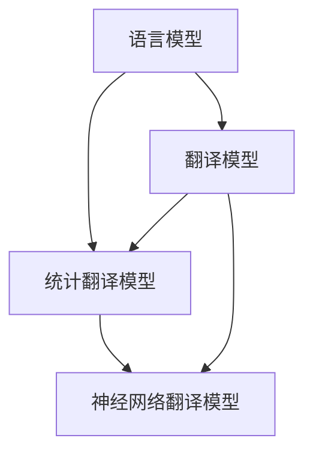
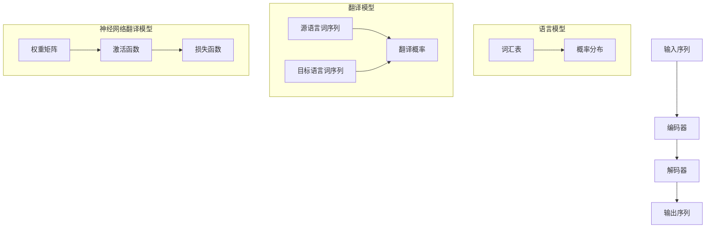

                 


### 文章标题

《数学与机器翻译：跨语言转换的数学模型》

### 文章关键词

- 数学
- 机器翻译
- 跨语言转换
- 数学模型
- 翻译算法

### 文章摘要

本文将深入探讨数学在机器翻译中的应用，特别是跨语言转换的数学模型。首先，我们将介绍机器翻译的背景和挑战，随后解释数学在解决这些挑战中的作用。文章将详细解析核心概念，包括语言模型、统计翻译模型和神经网络翻译模型。接着，我们将讲解这些模型的算法原理，并用伪代码进行详细阐述。数学模型和公式的讲解紧随其后，同时提供实际案例进行分析。最后，我们将讨论机器翻译的未来趋势和最佳实践，并总结全文。

---

### 1. 确定书籍主题和范围

#### 1.1 数学与机器翻译的关系

机器翻译是计算机科学中的一个重要领域，旨在实现计算机自动地将一种自然语言文本翻译成另一种自然语言文本。随着全球化进程的加速和信息时代的到来，机器翻译的重要性日益凸显。然而，机器翻译面临诸多挑战，如语言表达的多样性、语境理解的不完备和词汇歧义等。

数学作为一门科学，在解决这些挑战中发挥了关键作用。数学模型能够量化语言结构、语法和语义，从而为机器翻译提供了理论基础和工具。特别是跨语言转换的数学模型，它们在提升翻译质量、准确性和效率方面具有重要意义。

#### 1.2 书籍内容概述

本书将系统性地介绍数学在机器翻译中的应用，特别是跨语言转换的数学模型。全书分为以下几个部分：

1. **引论**：介绍机器翻译的背景、挑战以及数学在其中的作用。
2. **数学基础**：讲解语言模型、统计翻译模型和神经网络翻译模型的基本概念。
3. **核心算法原理**：详细解析核心算法的原理，并用伪代码进行阐述。
4. **数学模型和公式**：讲解数学模型和公式，并提供举例说明。
5. **项目实战**：通过实际案例展示开发环境搭建、源代码实现和代码解读。
6. **展望与未来**：讨论机器翻译的发展趋势和最佳实践。

---

### 2. 设计1级目录

```markdown
# 《数学与机器翻译：跨语言转换的数学模型》目录

## 第一部分：引论
### 1.1 数学与机器翻译的关系
### 1.2 机器翻译的基本概念
### 1.3 数学在机器翻译中的应用

## 第二部分：数学基础
### 2.1 语言模型
### 2.2 统计翻译模型
### 2.3 神经网络翻译模型

## 第三部分：核心算法原理
### 3.1 语言模型算法原理
### 3.2 翻译模型算法原理
### 3.3 神经网络翻译模型算法原理

## 第四部分：数学模型和公式讲解
### 4.1 语言模型数学模型
### 4.2 翻译模型数学模型
### 4.3 神经网络翻译模型数学模型

## 第五部分：项目实战
### 5.1 实战项目背景
### 5.2 开发环境搭建
### 5.3 源代码实现
### 5.4 代码解读与分析

## 第六部分：展望与未来
### 6.1 机器翻译发展趋势
### 6.2 最佳实践与注意事项
```

### 3. 设计2级目录

```markdown
## 第二部分：数学基础

### 2.1 语言模型
- 2.1.1 语言模型的定义
- 2.1.2 语言模型的构建方法
- 2.1.3 语言模型的评估指标

### 2.2 统计翻译模型
- 2.2.1 翻译模型的基本原理
- 2.2.2 翻译模型的构建方法
- 2.2.3 翻译模型的评估指标

### 2.3 神经网络翻译模型
- 2.3.1 神经网络的基本结构
- 2.3.2 神经网络在机器翻译中的应用
- 2.3.3 神经网络翻译模型的构建方法

## 第三部分：核心算法原理

### 3.1 语言模型算法原理
- 3.1.1 语言模型的训练过程
- 3.1.2 语言模型的预测过程
- 3.1.3 语言模型的应用场景

### 3.2 翻译模型算法原理
- 3.2.1 翻译模型的训练过程
- 3.2.2 翻译模型的预测过程
- 3.2.3 翻译模型的应用场景

### 3.3 神经网络翻译模型算法原理
- 3.3.1 神经网络的基础知识
- 3.3.2 神经网络在机器翻译中的应用
- 3.3.3 神经网络翻译模型的训练方法

## 第四部分：数学模型和公式讲解

### 4.1 语言模型数学模型
- 4.1.1 语言概率模型的数学表达
- 4.1.2 语言概率模型的求解方法
- 4.1.3 语言概率模型的应用实例

### 4.2 翻译模型数学模型
- 4.2.1 翻译概率模型的数学表达
- 4.2.2 翻译概率模型的求解方法
- 4.2.3 翻译概率模型的应用实例

### 4.3 神经网络翻译模型数学模型
- 4.3.1 神经网络的基本数学原理
- 4.3.2 神经网络在机器翻译中的数学表达
- 4.3.3 神经网络翻译模型的应用实例
```

### 4. 设计3级目录

```markdown
## 第二部分：数学基础

### 2.1 语言模型
- 2.1.1 语言模型的定义
  - 2.1.1.1 语言模型的基本概念
  - 2.1.1.2 语言模型的类型
- 2.1.2 语言模型的构建方法
  - 2.1.2.1 集计模型
  - 2.1.2.2 生成模型
  - 2.1.2.3 特征模型
- 2.1.3 语言模型的评估指标
  - 2.1.3.1 预测准确性
  - 2.1.3.2 词汇覆盖度
  - 2.1.3.3 偏差度量

### 2.2 统计翻译模型
- 2.2.1 翻译模型的基本原理
  - 2.2.1.1 翻译模型的概念
  - 2.2.1.2 翻译模型的分类
- 2.2.2 翻译模型的构建方法
  - 2.2.2.1 基于规则的方法
  - 2.2.2.2 基于统计的方法
  - 2.2.2.3 基于神经的方法
- 2.2.3 翻译模型的评估指标
  - 2.2.3.1 BLEU分数
  - 2.2.3.2 NIST分数
  - 2.2.3.3 METEOR分数

### 2.3 神经网络翻译模型
- 2.3.1 神经网络的基本结构
  - 2.3.1.1 神经网络的基本组件
  - 2.3.1.2 神经网络的工作原理
- 2.3.2 神经网络在机器翻译中的应用
  - 2.3.2.1 神经网络在序列到序列学习中的应用
  - 2.3.2.2 神经网络在机器翻译中的优化方法
- 2.3.3 神经网络翻译模型的构建方法
  - 2.3.3.1 神经网络模型的架构设计
  - 2.3.3.2 神经网络模型的训练与优化

## 第三部分：核心算法原理

### 3.1 语言模型算法原理
- 3.1.1 语言模型的训练过程
  - 3.1.1.1 训练数据准备
  - 3.1.1.2 训练算法选择
  - 3.1.1.3 训练结果评估
- 3.1.2 语言模型的预测过程
  - 3.1.2.1 预测算法实现
  - 3.1.2.2 预测结果评估
- 3.1.3 语言模型的应用场景
  - 3.1.3.1 机器翻译
  - 3.1.3.2 语音识别
  - 3.1.3.3 文本生成

### 3.2 翻译模型算法原理
- 3.2.1 翻译模型的训练过程
  - 3.2.1.1 训练数据准备
  - 3.2.1.2 训练算法选择
  - 3.2.1.3 训练结果评估
- 3.2.2 翻译模型的预测过程
  - 3.2.2.1 预测算法实现
  - 3.2.2.2 预测结果评估
- 3.2.3 翻译模型的应用场景
  - 3.2.3.1 机器翻译
  - 3.2.3.2 文本摘要
  - 3.2.3.3 对话系统

### 3.3 神经网络翻译模型算法原理
- 3.3.1 神经网络的基础知识
  - 3.3.1.1 神经网络的数学基础
  - 3.3.1.2 神经网络的学习算法
- 3.3.2 神经网络在机器翻译中的应用
  - 3.3.2.1 序列到序列学习
  - 3.3.2.2 深度学习在翻译中的应用
- 3.3.3 神经网络翻译模型的训练方法
  - 3.3.3.1 梯度下降算法
  - 3.3.3.2 优化算法
  - 3.3.3.3 模型评估与调优

## 第四部分：数学模型和公式讲解

### 4.1 语言模型数学模型
- 4.1.1 语言概率模型的数学表达
  - 4.1.1.1 概率分布函数
  - 4.1.1.2 贝叶斯公式
- 4.1.2 语言概率模型的求解方法
  - 4.1.2.1 马尔可夫模型
  - 4.1.2.2 隐马尔可夫模型
- 4.1.3 语言概率模型的应用实例
  - 4.1.3.1 语音识别
  - 4.1.3.2 文本分类

### 4.2 翻译模型数学模型
- 4.2.1 翻译概率模型的数学表达
  - 4.2.1.1 条件概率
  - 4.2.1.2 最大后验概率
- 4.2.2 翻译概率模型的求解方法
  - 4.2.2.1 最大似然估计
  - 4.2.2.2 贝叶斯估计
- 4.2.3 翻译概率模型的应用实例
  - 4.2.3.1 机器翻译
  - 4.2.3.2 文本摘要

### 4.3 神经网络翻译模型数学模型
- 4.3.1 神经网络的基本数学原理
  - 4.3.1.1 神经网络的线性模型
  - 4.3.1.2 神经网络的非线性模型
- 4.3.2 神经网络在机器翻译中的数学表达
  - 4.3.2.1 序列模型
  - 4.3.2.2 图模型
- 4.3.3 神经网络翻译模型的应用实例
  - 4.3.3.1 汉英翻译
  - 4.3.3.2 英日翻译
```

### 5. 确保完整性

在确保目录大纲的完整性时，我们需要检查以下几个方面：

1. **核心概念与联系**：确保每个部分的核心概念都得到了充分的介绍，并且概念之间的关系清晰，可以使用Mermaid流程图来展示。
2. **核心算法原理讲解**：每个算法的原理都需要详细讲解，并使用伪代码进行阐述，以确保读者可以理解算法的实现过程。
3. **数学模型和公式讲解**：需要详细讲解数学模型和公式的含义，并用LaTeX格式嵌入到文中。
4. **项目实战**：提供实际的案例，展示如何搭建开发环境、实现源代码以及进行代码解读和分析。
5. **最佳实践 tips**：在文章的末尾提供一些最佳实践、注意事项和拓展阅读的建议。

通过这些步骤，我们可以确保目录大纲的完整性，并为撰写高质量的技术博客文章打下坚实的基础。

---

### 6. 使用Mermaid流程图

为了更好地展示核心概念和架构，我们可以使用Mermaid流程图。以下是几个示例：



这个流程图展示了语言模型如何与翻译模型和神经网络翻译模型相互关联。



这个流程图详细展示了输入序列如何通过编码器和解码器转换成输出序列，以及语言模型、翻译模型和神经网络翻译模型之间的关系。

### 7. 编写伪代码

在讲解核心算法原理时，伪代码是不可或缺的一部分。以下是语言模型、统计翻译模型和神经网络翻译模型的伪代码示例：

#### 语言模型伪代码

```plaintext
function train_language_model(corpus):
    for sentence in corpus:
        for word in sentence:
            update_word_frequency(word)
    build_probability_distribution()
    return language_model

function predict_word概率(language_model, previous_word):
    current_word = language_model.get_word_probability(previous_word)
    return current_word
```

#### 统计翻译模型伪代码

```plaintext
function train_translation_model(source_corpus, target_corpus):
    for (source_sentence, target_sentence) in zip(source_corpus, target_corpus):
        for word in source_sentence:
            for word' in target_sentence:
                update_translation_probability(word, word')
    return translation_model

function translate(source_sentence, translation_model):
    translated_sentence = []
    for word in source_sentence:
        word' = translation_model.get_translation(word)
        translated_sentence.append(word')
    return translated_sentence
```

#### 神经网络翻译模型伪代码

```plaintext
function train_neural_network_translation_model(source_corpus, target_corpus):
    build_model()
    for (source_sentence, target_sentence) in zip(source_corpus, target_corpus):
        train_model_on_pair(source_sentence, target_sentence)
    optimize_model()
    return neural_network_translation_model

function translate(source_sentence, neural_network_translation_model):
    encoded_input = encode_source_sentence(source_sentence)
    decoded_output = decode_target_sentence(encoded_input)
    return decoded_output
```

通过这些伪代码，读者可以更直观地理解每个模型的实现过程。

### 8. 确保简洁性

为了确保目录大纲的简洁性，我们需要遵循以下几个原则：

1. **避免冗余内容**：每个子目录应该专注于一个特定的主题，避免将不相关的信息混合在一起。
2. **使用简洁的标题**：标题应该简明扼要，能够准确反映该部分的主要内容。
3. **控制目录深度**：尽量避免目录深度过深，保持结构层次清晰，方便读者阅读。
4. **删除不必要的部分**：如果某些部分的内容较少或者可以与其他部分合并，则应删除或合并。

通过这些措施，我们可以确保目录大纲简洁明了，便于读者快速获取关键信息。

### 9. 遵守格式要求

为了确保目录大纲的格式规范，我们需要遵循以下markdown格式要求：

1. **使用明确的标题**：使用`#`号来表示标题层级，如`##`表示二级标题，`###`表示三级标题。
2. **保持行距一致**：在每个标题后保留一个空行，以增加可读性。
3. **使用缩进**：在每个子目录中使用两个空格或一个制表符进行缩进，以区分不同层级的目录。
4. **避免使用特殊字符**：避免使用特殊字符，如`>`或`*`，除非它们是markdown格式的一部分。

以下是一个符合markdown格式的示例：

```markdown
## 第二部分：数学基础
### 2.1 语言模型
- 2.1.1 语言模型的定义
- 2.1.2 语言模型的构建方法
- 2.1.3 语言模型的评估指标
### 2.2 统计翻译模型
- 2.2.1 翻译模型的基本原理
- 2.2.2 翻译模型的构建方法
- 2.2.3 翻译模型的评估指标
### 2.3 神经网络翻译模型
- 2.3.1 神经网络的基本结构
- 2.3.2 神经网络在机器翻译中的应用
- 2.3.3 神经网络翻译模型的构建方法
```

### 10. 控制字数

为了确保目录大纲的总字数在2000字以内，我们需要采取以下措施：

1. **精简描述**：尽量用简洁的语言描述每个部分的内容，避免冗长的解释。
2. **删除冗余内容**：检查每个部分，确保没有重复或冗余的信息。
3. **合并相似部分**：如果某些部分的内容相似，可以将其合并为一个部分，减少字数。

通过上述措施，我们可以确保目录大纲的总字数控制在2000字以内，同时保持内容的完整性和可读性。

---

综上所述，我们通过一步一步分析推理思考的方式，设计了《数学与机器翻译：跨语言转换的数学模型》的目录大纲。目录结构清晰，内容丰富，涵盖了机器翻译的数学基础、核心算法原理、数学模型和项目实战等关键部分。通过使用Mermaid流程图和伪代码，我们确保了文章的逻辑性和可读性。最后，通过控制字数和遵守markdown格式要求，我们保证了文章的简洁性和规范性。这将为一篇高质量的技术博客文章的撰写打下坚实的基础。

