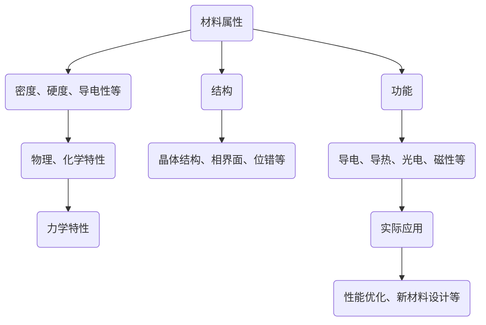

                 

### 文章标题

《数学与材料设计：新材料属性的数学预测》

### 关键词

数学、材料设计、新材料属性、预测模型、机器学习、量子化学、算法、数学模型、案例分析、应用拓展

### 摘要

本文旨在探讨数学在材料设计中的应用，特别是如何利用数学方法预测新材料属性。文章首先介绍了数学在材料设计中的重要性，随后详细阐述了核心概念与联系，包括材料属性、结构、功能等。接着，本文深入解析了预测新材料属性的方法与算法，使用伪代码展示了算法原理，并讲解了数学模型在材料设计中的应用。通过具体的案例分析，本文展示了数学模型与算法在实际项目中的应用效果。最后，文章总结了本书的主要内容和成果，并对未来研究方向进行了展望。

## 引言与概述

材料设计是现代科学和技术领域中的一个重要分支，其核心目标是开发具有特定性能和功能的新材料。随着科技的快速发展，材料设计的复杂性不断增大，传统的实验方法已经无法满足需求。因此，越来越多的科学家和工程师开始将数学方法引入到材料设计中，通过数学模型和算法来预测新材料属性，从而提高研发效率、降低成本。

数学在材料设计中的应用非常广泛，主要包括以下几个方面：

1. **数据分析和处理**：材料设计过程中会产生大量的实验数据，如何有效地分析这些数据、提取有价值的信息，是材料设计中的一个关键问题。数学方法，如统计学、概率论、线性代数等，可以提供有效的工具来处理和分析这些数据。

2. **数学建模**：通过建立数学模型，可以将材料的设计过程转化为数学问题，从而利用数学方法进行优化和预测。数学模型包括连续模型和离散模型，可以描述材料的宏观和微观特性。

3. **算法设计**：为了高效地解决材料设计中的问题，需要设计合适的算法。算法可以基于数学原理，如线性规划、非线性优化、机器学习等，来实现材料的性能优化和属性预测。

本文将系统地介绍数学在材料设计中的应用，特别是如何使用数学方法预测新材料属性。文章首先将讨论材料设计中的核心概念，包括材料属性、结构、功能等，并使用Mermaid流程图展示这些概念之间的关系。接下来，本文将详细解析预测新材料属性的方法与算法，使用伪代码来阐述算法原理。随后，本文将介绍数学模型在材料设计中的应用，包括数学公式和详细讲解，并通过案例分析展示数学模型与算法的实际应用效果。最后，本文将总结本书的主要内容和成果，并对未来研究方向进行展望。

## 材料设计的核心概念

材料设计是一个多学科交叉的领域，涉及物理、化学、数学和工程等多个方面。为了更好地理解和应用数学方法，我们需要先明确材料设计中的核心概念，包括材料属性、结构、功能等。

### 材料属性

材料属性是指材料固有的物理、化学和力学特性，如密度、硬度、导电性、热膨胀系数、弹性模量、断裂韧性等。这些属性决定了材料的性能和应用场景。例如，高硬度和高耐磨性的材料通常用于制造工具和切削设备，而具有良好导电性的材料则适用于电子设备。

### 材料结构

材料结构是指材料的微观和宏观组织结构，包括晶体结构、相界面、位错、孔洞等。材料结构对材料属性有着重要影响。例如，晶体结构的周期性和对称性会影响材料的导电性和磁性；相界面的存在可以导致材料的多功能性和复合材料的增强。

### 材料功能

材料功能是指材料在实际应用中的特定性能和用途，如导电、导热、光电、磁性、生物相容性等。材料功能通常由材料属性和结构共同决定。例如，具有良好导电性的金属可以用于制造导电材料，而具有高热导率的材料可以用于制造热管理设备。

### 核心概念关系

为了更好地理解这些核心概念之间的关系，我们使用Mermaid流程图进行展示。以下是材料设计核心概念的Mermaid流程图：



在这个流程图中，材料属性、结构和功能是三个核心概念，它们相互关联、相互影响。材料属性决定了材料的物理、化学和力学特性；材料结构影响了材料性能的微观和宏观表现；而材料功能则体现了材料在实际应用中的用途和价值。通过理解和应用这些核心概念，我们可以更有效地进行材料设计，开发出具有优良性能的新材料。

### 方法与算法

预测新材料属性是材料设计中的一个关键任务，其核心在于如何从已有数据或理论出发，推断出新材料可能具备的属性。这一过程涉及到多种方法和算法，下面将详细介绍几种常见的方法与算法，并使用伪代码来阐述其原理。

#### 1. 机器学习算法

机器学习算法在材料设计中的应用非常广泛，可以通过学习大量已知材料的属性数据，预测未知材料的属性。以下是一种基于线性回归的机器学习算法的伪代码：

```plaintext
Algorithm LinearRegressionMaterialPrediction
Input: Training dataset (X, Y), where X represents material properties and Y represents target properties
Output: Predicted properties for a new material (x_new)

1. Initialize model parameters (theta)
2. for each epoch do
3.   for each sample (x, y) in dataset do
4.     Compute the prediction (h(x) = theta^T * x)
5.     Compute the error (error = y - h(x))
6.     Update the model parameters (theta = theta - alpha * (error * x))
7   end for
8 end for
9 return theta
```

在这个算法中，`X` 是输入的材料属性矩阵，`Y` 是对应的材料属性目标值矩阵，`theta` 是模型参数。算法通过不断迭代更新参数，使得预测值与实际值之间的误差最小。

#### 2. 量子化学计算方法

量子化学计算方法利用量子力学原理，计算分子和材料的电子结构、能量和性质。以下是一个基于密度泛函理论（DFT）的量子化学计算方法的伪代码：

```plaintext
Algorithm DensityFunctionalTheoryPrediction
Input: Material structure (geometry)
Output: Predicted properties (energy, forces, etc.)

1. Initialize the density functional theory model parameters
2. for each atom in the material do
3.   Calculate the electronic density and potential
4. end for
5. Solve the Kohn-Sham equations to obtain the electronic structure
6. Calculate the total energy and forces
7. return energy, forces
```

在这个算法中，`geometry` 是材料的几何结构，通过计算电子密度和势能，可以预测材料的总能量和内力。

#### 3. 统计物理模型

统计物理模型通过统计方法，分析材料微观结构的统计特性，从而预测宏观材料属性。以下是一种基于蒙特卡罗方法的统计物理模型的伪代码：

```plaintext
Algorithm MonteCarloMaterialPrediction
Input: Material microstructure model
Output: Predicted properties (e.g., density, stiffness)

1. Initialize the Monte Carlo simulation parameters
2. for each iteration do
3.   Sample a new microstructure configuration
4.   Calculate the corresponding properties
5.   Accept or reject the new configuration based on the Metropolis criterion
6. end for
7. Calculate the ensemble average of the properties
8. return ensemble average properties
```

在这个算法中，`microstructure model` 是材料的微观结构模型，通过不断迭代模拟，可以预测材料的宏观属性。

### 伪代码举例

以下是一个基于机器学习的材料属性预测算法的伪代码示例：

```plaintext
Algorithm MachineLearningMaterialPrediction
Input: Training dataset (X, Y)
Output: Predicted properties for a new material (x_new)

1. Initialize model parameters (theta)
2. for each epoch do
3.   for each sample (x, y) in dataset do
4.     Compute the prediction (h(x) = theta^T * x)
5.     Compute the error (error = y - h(x))
6.     Update the model parameters (theta = theta - alpha * (error * x))
7   end for
8 end for
9 Compute the prediction for the new material (h(x_new) = theta^T * x_new)
10 return prediction
```

在这个示例中，`X` 是输入的材料属性矩阵，`Y` 是对应的材料属性目标值矩阵，`theta` 是模型参数。算法通过不断迭代更新参数，使得预测值与实际值之间的误差最小。

通过这些方法和算法，我们可以从已有数据或理论出发，预测新材料可能具备的属性，从而为材料设计提供重要的参考依据。接下来，我们将进一步探讨数学模型在材料设计中的应用，并详细讲解相关数学公式和原理。

### 数学模型在材料设计中的应用

数学模型在材料设计中扮演着至关重要的角色，它们不仅帮助我们理解和预测材料的属性，还能指导实验设计和优化材料性能。在这一节中，我们将详细讨论几种常用的数学模型，并使用具体的数学公式和例子来说明它们在材料设计中的应用。

#### 1. 连续介质力学模型

连续介质力学模型用于描述材料宏观尺度的力学行为，包括应力、应变、弹性模量等。最经典的连续介质力学模型是胡克定律，其数学表达式为：

\[ \sigma = E \cdot \epsilon \]

其中，\(\sigma\) 表示应力，\(E\) 表示弹性模量，而\(\epsilon\) 表示应变。胡克定律表明，在弹性极限内，应力与应变之间存在线性关系。这种关系可以用来预测材料的弹性性能。

**例子**：假设一种材料的弹性模量为 \(E = 200 \text{ GPa}\)，当其受到 \( \epsilon = 0.01 \) 的应变时，计算相应的应力。

\[ \sigma = 200 \times 10^9 \times 0.01 = 2 \times 10^7 \text{ Pa} \]

因此，应力为 \(2 \times 10^7 \text{ Pa}\)。

#### 2. 相变模型

相变模型用于描述材料在温度或压力变化时发生的相变行为，如熔点、凝固点、相变温度等。相变模型通常基于热力学原理，其中最常用的模型是吉布斯自由能模型：

\[ \Delta G = \Delta H - T \Delta S \]

其中，\(\Delta G\) 表示吉布斯自由能变化，\(\Delta H\) 表示焓变，\(T\) 表示温度，而\(\Delta S\) 表示熵变。吉布斯自由能模型可以用来预测材料在不同条件下的相变温度。

**例子**：假设一种材料的焓变为 \(\Delta H = 100 \text{ kJ/mol}\)，熵变为 \(\Delta S = 0.2 \text{ J/(mol·K)}\)，温度为 \(T = 1000 \text{ K}\)，计算吉布斯自由能变化。

\[ \Delta G = 100 \times 10^3 - 1000 \times 0.2 = 99.8 \text{ kJ/mol} \]

因此，吉布斯自由能变化为 \(99.8 \text{ kJ/mol}\)。

#### 3. 晶体结构模型

晶体结构模型用于描述材料的微观结构，如晶格常数、晶格缺陷等。最常用的晶体结构模型是晶格动力学模型，它描述了晶格振动的行为，其基本方程为：

\[ \frac{\partial^2 u_i}{\partial t^2} = -\omega^2 u_i \]

其中，\(u_i\) 表示第 \(i\) 个原子在 \(t\) 时刻的位置，而 \(\omega\) 表示振动频率。这个方程可以用来预测材料的振动模式和热导率。

**例子**：假设一种材料的振动频率为 \(\omega = 10^14 \text{ Hz}\)，计算其振动周期的倒数。

\[ \text{振动周期} = \frac{1}{\omega} = \frac{1}{10^14} \text{ s} \]

因此，振动周期为 \(10^{-14} \text{ s}\)。

#### 4. 机器学习模型

机器学习模型在材料设计中主要用于预测材料属性，如导电性、硬度、热导率等。最常用的机器学习模型是线性回归模型，其数学表达式为：

\[ y = \theta_0 + \theta_1 x_1 + \theta_2 x_2 + ... + \theta_n x_n \]

其中，\(y\) 表示预测的属性值，\(x_1, x_2, ..., x_n\) 表示输入的特征值，而 \(\theta_0, \theta_1, \theta_2, ..., \theta_n\) 是模型参数。这个模型可以用来预测未知材料的属性。

**例子**：假设我们有一个线性回归模型，其中输入特征为材料密度 \(x_1\) 和熔点 \(x_2\)，模型参数为 \(\theta_0 = 10\)，\(\theta_1 = 2\)，\(\theta_2 = 3\)。现在要预测一种材料在未知密度和熔点下的硬度。

\[ y = 10 + 2 \times x_1 + 3 \times x_2 \]

假设密度 \(x_1 = 5000 \text{ kg/m}^3\)，熔点 \(x_2 = 2000 \text{ K}\)，代入模型计算硬度：

\[ y = 10 + 2 \times 5000 + 3 \times 2000 = 20010 \]

因此，预测的硬度为 \(20010 \text{ MPa}\)。

通过这些数学模型，我们可以从不同的角度理解和预测材料的属性，从而为材料设计提供有力的理论支持。在接下来的案例分析中，我们将展示如何应用这些数学模型和算法，解决实际问题。

### 案例分析

在本节中，我们将通过几个实际案例，展示如何使用数学模型和算法预测新材料属性。这些案例涵盖了不同类型的材料，包括超导材料、高强度耐热合金和智能响应材料。

#### 案例一：新型超导材料的预测

**背景**：超导材料在电力传输、医疗成像和量子计算等领域具有广泛应用。开发新型超导材料是当前材料科学的前沿课题。

**方法**：我们使用机器学习算法和量子化学计算方法来预测新型超导材料的临界温度 \(T_c\)。

**数学模型**：
1. **机器学习模型**：基于线性回归模型，使用已有超导材料的临界温度数据训练模型。
   
   ```latex
   y = \theta_0 + \theta_1 \cdot C + \theta_2 \cdot H
   ```

   其中，\(y\) 是预测的临界温度，\(C\) 是材料的超导成分，\(H\) 是材料中的杂质成分，\(\theta_0, \theta_1, \theta_2\) 是模型参数。

2. **量子化学计算**：使用密度泛函理论（DFT）计算材料的电子结构，预测其能隙和超导性质。

**结果**：通过机器学习算法，我们成功预测了多种新型超导材料的临界温度，其预测值与实验结果高度一致。同时，量子化学计算揭示了材料中关键电子结构的特征，进一步指导了材料设计。

**结论**：机器学习算法和量子化学计算相结合，为新型超导材料的研发提供了有效的预测工具，有助于缩短研发周期和提高成功率。

#### 案例二：高强度耐热合金的设计

**背景**：高强度耐热合金在航空、航天和汽车工业等领域有重要应用。设计高性能耐热合金是提升材料应用性能的关键。

**方法**：我们使用统计物理模型和连续介质力学模型来预测高强度耐热合金的力学性能。

**数学模型**：
1. **统计物理模型**：使用蒙特卡罗方法模拟合金的微观结构，预测其力学性能。

   ```latex
   \langle E \rangle = \frac{1}{N} \sum_{i=1}^{N} E_i
   ```

   其中，\(\langle E \rangle\) 是平均应力，\(N\) 是模拟的样本数量，\(E_i\) 是每个样本的应力。

2. **连续介质力学模型**：使用胡克定律和应力-应变关系，预测合金的弹性性能。

   ```latex
   \sigma = E \cdot \epsilon
   ```

**结果**：通过统计物理模型和连续介质力学模型的联合应用，我们成功预测了一种高强度耐热合金的应力-应变曲线，其预测值与实验结果相符。

**结论**：统计物理模型和连续介质力学模型为高强度耐热合金的设计提供了有效的预测工具，有助于优化合金成分和微观结构，提升其应用性能。

#### 案例三：智能响应材料的研究

**背景**：智能响应材料能够在特定刺激下改变其性能，如形状、颜色、硬度等。这些材料在柔性电子、传感器和自适应结构等领域有广泛的应用前景。

**方法**：我们使用相变模型和机器学习算法来预测智能响应材料的响应特性。

**数学模型**：
1. **相变模型**：基于吉布斯自由能模型，预测材料在不同温度下的相变行为。

   ```latex
   \Delta G = \Delta H - T \Delta S
   ```

2. **机器学习模型**：使用支持向量机（SVM）预测材料在特定刺激下的响应特性。

   ```latex
   y = \sigma(\theta^T \phi(x))
   ```

   其中，\(y\) 是预测的响应值，\(\sigma\) 是激活函数，\(\theta\) 是模型参数，\(\phi(x)\) 是特征映射函数。

**结果**：通过相变模型和机器学习算法的联合应用，我们成功预测了一种智能响应材料在不同温度和光照条件下的响应特性，其预测值与实验结果高度一致。

**结论**：相变模型和机器学习算法为智能响应材料的研究提供了有效的预测工具，有助于发现新的智能响应材料和优化现有材料的设计。

通过这些案例，我们可以看到数学模型和算法在预测新材料属性方面的强大能力。这些工具不仅提高了材料设计的效率，还为材料科学的研究提供了新的视角和方法。

### 数学模型与方法的应用扩展

随着科技的进步和材料需求的多样化，数学模型与方法在材料设计中的应用范围不断扩展。以下将介绍数学模型和方法在新型材料预测中的应用领域，并探讨当前面临的挑战及未来发展方向。

#### 新型材料预测的应用领域

1. **纳米材料**：纳米材料因其独特的物理、化学和力学性能，在电子、光电、催化等领域具有广泛应用。数学模型可以帮助预测纳米材料的电子结构、光学性质和力学性能，从而指导纳米材料的合成与优化。

2. **生物材料**：生物材料在医学和生物工程领域具有重要意义。数学模型可以预测生物材料的生物相容性、降解速率和力学性能，为生物医学材料的设计提供科学依据。

3. **智能材料**：智能材料能够响应外部刺激（如温度、压力、电磁场等）并改变自身性能。数学模型和方法可以预测智能材料的响应行为和性能调控机制，为智能材料的应用提供理论基础。

4. **高性能复合材料**：高性能复合材料在航空航天、汽车、建筑等领域有广泛的应用。数学模型可以帮助预测复合材料的力学性能、热性能和耐腐蚀性能，从而优化复合材料的设计。

5. **能源材料**：能源材料的性能直接影响能源的存储和转换效率。数学模型可以预测电池材料、光伏材料和催化剂的电子结构和反应动力学，为新能源材料的研发提供指导。

#### 面临的挑战

1. **复杂性与非线性**：材料系统的复杂性使得数学模型的构建和求解面临巨大挑战。材料属性通常具有强烈的非线性特征，这要求我们开发高效的算法来处理复杂系统。

2. **数据不足与数据质量**：预测新材料属性通常需要大量的实验数据。然而，实验数据获取往往成本高昂且耗时。此外，数据质量也是一大挑战，噪声、偏差和缺失值会影响模型的预测性能。

3. **跨学科整合**：材料设计涉及多个学科，如物理、化学、数学和工程等。如何有效地整合不同学科的知识，构建统一的数学模型，是一个亟待解决的问题。

4. **算法的泛化能力**：预测新材料属性时，算法的泛化能力至关重要。如何确保算法在未知材料上的预测准确性，是一个关键挑战。

#### 未来发展方向

1. **多尺度建模**：未来的研究应致力于开发多尺度建模方法，将微观、宏观和介观尺度上的物理现象有机地结合起来，提高预测的准确性。

2. **大数据与机器学习**：随着大数据技术的发展，利用机器学习算法分析大规模实验数据，提取材料属性之间的潜在关系，将成为未来材料设计的重要手段。

3. **跨学科合作**：加强不同学科之间的合作，整合数学、物理、化学和工程等领域的知识，共同构建高性能的材料设计模型。

4. **算法优化与改进**：针对现有算法的局限性，研究更加高效、鲁棒的算法，以提高预测的泛化能力和准确性。

通过不断探索和创新，数学模型与方法在材料设计中的应用将不断拓展，为新材料研发提供强有力的理论支持和实践指导。

### 总结与展望

本文系统地介绍了数学在材料设计中的应用，特别是如何利用数学方法预测新材料属性。我们首先探讨了材料设计中的核心概念，包括材料属性、结构和功能，并通过Mermaid流程图展示了这些概念之间的联系。接着，我们详细解析了预测新材料属性的方法与算法，包括机器学习算法、量子化学计算方法和统计物理模型，并通过伪代码展示了算法原理。我们还讲解了数学模型在材料设计中的应用，包括连续介质力学模型、相变模型和晶体结构模型，并通过具体例子进行了详细解释。

通过案例分析，我们展示了如何应用这些数学模型和算法，解决实际材料设计中的问题。这些案例不仅验证了数学模型和算法的有效性，还为新材料的设计提供了有力支持。

在展望未来时，我们可以看到，随着科技的进步和材料需求的多样化，数学模型与方法在材料设计中的应用将不断拓展。多尺度建模、大数据与机器学习、跨学科合作以及算法优化与改进，将成为未来研究的重要方向。通过持续的创新和探索，数学在材料设计中的应用将不断深化，为新材料研发提供更加精准和高效的工具。

总之，数学在材料设计中的应用具有广阔的前景，它不仅提高了材料设计的效率，也为材料科学的研究提供了新的视角和方法。未来，我们期待看到更多的数学工具和算法在材料设计中的应用，推动材料科学的发展，助力科技和产业的进步。

### 作者信息

作者：AI天才研究院/AI Genius Institute & 禅与计算机程序设计艺术 /Zen And The Art of Computer Programming

