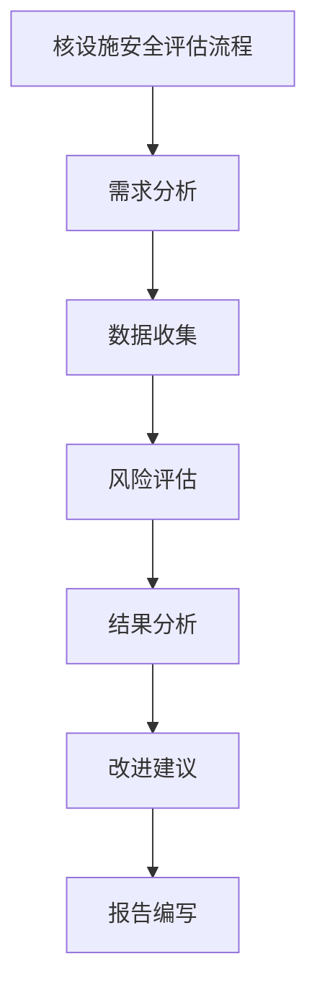
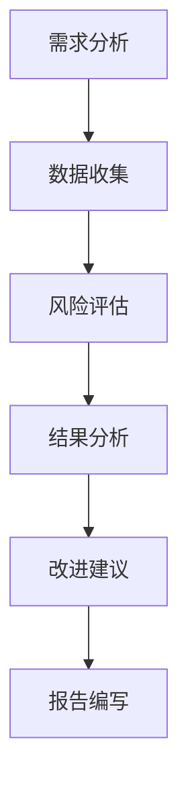

                 

## 文章标题

# 数学与核安全：核设施安全的数学评估

## 关键词

- 核安全
- 数学模型
- 评估方法
- 风险评估
- 故障树分析

## 摘要

本文深入探讨了数学在核安全领域的应用，特别是核设施安全的数学评估。文章首先介绍了核安全的重要性及数学在核工程中的应用基础，然后详细阐述了核设施安全评估的基本原理、数学模型和方法。通过核心概念的关联架构图、算法原理的伪代码阐述、数学公式和案例的详细分析，本文为读者提供了一个全面、系统的理解框架，旨在提高核设施安全评估的科学性和准确性。

## 目录

1. 核安全概述
   1.1 核安全的重要性
   1.2 核安全的历史与发展
   1.3 核安全的基本原则

2. 数学在核安全中的应用
   2.1 数学在核工程中的基础角色
   2.2 数学模型在核安全评估中的重要性
   2.3 核安全中的常见数学工具与技术

3. 核设施安全评估的基本原理
   3.1 核设施安全评估的概念
   3.2 核设施安全评估的目标
   3.3 核设施安全评估的标准与方法

4. 核设施安全评估的数学模型
   4.1 风险评估模型
   4.2 安全裕度评估模型
   4.3 故障树分析模型

5. 核设施安全评估的方法与工具
   5.1 核设施安全评估的方法
   5.2 核设施安全评估的工具
   5.3 核设施安全评估的流程

6. 核设施安全评估的案例分析
   6.1 案例一：某核电站的安全评估
   6.2 案例二：某核设施的应急评估
   6.3 案例三：核设施退役的数学评估

7. 核设施安全评估的挑战与未来展望
   7.1 核设施安全评估的挑战
   7.2 核设施安全评估的改进方向
   7.3 核设施安全评估的未来趋势

## 1. 核安全概述

### 1.1 核安全的重要性

核安全是指防止核事故的发生，保障核设施的安全运行，以及处理核事故的应急响应。核安全的重要性不言而喻，因为核能作为一种高效的能源，其在发电和医疗等领域具有广泛应用。然而，核能的利用也伴随着一定的风险，一旦发生核事故，不仅会对环境造成严重污染，还可能对人类健康和社会经济带来不可估量的损失。

核安全的重要性体现在以下几个方面：

1. **环境保护**：核能的利用需要处理大量的放射性废物，如果处理不当，将对环境和生态系统造成长期的影响。
2. **公共安全**：核事故可能造成严重的辐射污染，对周边居民的健康造成威胁。
3. **经济影响**：核事故可能导致核设施报废、停运，从而影响能源供应，甚至引发经济危机。
4. **国际形象**：核安全事件会对一个国家的国际形象和信誉产生负面影响。

### 1.2 核安全的历史与发展

核安全的发展经历了多个阶段，从核能的早期应用到现代核安全体系的建立，每一步都充满了挑战和进步。

1. **早期应用阶段（1940s-1960s）**：这一阶段，核能主要用于军事目的，如制造原子弹。随着核能的和平利用，核电站开始建设，但核安全意识相对薄弱，核事故时有发生。
2. **事故教训阶段（1970s-1980s）**：这一时期，美国的三里岛事故和苏联的切尔诺贝利事故引发了全球对核安全的广泛关注。这些事故使得国际社会意识到核安全的紧迫性和必要性。
3. **现代核安全体系建立阶段（1990s至今）**：随着对核安全认识的加深，国际社会开始建立一系列核安全标准和法规，如《核安全公约》（NSC）和《国际原子能机构安全标准》（IAEA SS）等。这些标准和法规为全球核安全提供了指导框架。

### 1.3 核安全的基本原则

核安全的基本原则主要包括以下几个方面：

1. **预防为主**：通过风险评估和隐患排查，预防事故的发生。
2. **纵深防御**：建立多层次的防御体系，确保在任何一层失效时，其他层能够提供保护。
3. **安全文化**：培养员工的安全意识，建立安全价值观，形成良好的安全氛围。
4. **持续改进**：通过监测、评估和反馈，不断优化安全措施，提高安全水平。

## 2. 数学在核安全中的应用

### 2.1 数学在核工程中的基础角色

数学在核工程中扮演着至关重要的角色，是核工程的基础工具。具体来说，数学在核工程中的应用主要体现在以下几个方面：

1. **核反应模型**：通过数学模型描述核反应过程，如核裂变和核聚变。这些模型有助于理解核反应的机理，预测反应的动力学行为。
2. **热量传输**：核反应产生的热量需要通过冷却系统传导出去，数学模型如热传导方程和有限元方法被用来模拟热量在材料中的传递过程。
3. **流体力学**：在核反应堆中，冷却剂和燃料之间的流动需要通过流体力学模型来描述，以确保冷却剂能够有效地带走热量。
4. **材料力学**：核反应堆的运行环境极端，材料力学模型用于评估材料在高温高压下的强度和变形。

### 2.2 数学模型在核安全评估中的重要性

数学模型在核安全评估中具有不可替代的重要性。通过数学模型，可以对核设施的安全性进行定量分析和评估，提供科学依据。

1. **风险评估**：数学模型可以用于评估核设施的风险，如概率风险评估（PRA）和事件树分析（ETA）。这些模型通过量化风险指标，帮助决策者了解核设施的安全状况。
2. **安全裕度评估**：数学模型可以用于评估核设施的安全裕度，如安全系数和裕度因子。这些指标有助于判断核设施在极端条件下的安全性。
3. **故障树分析**：数学模型被用于构建故障树，通过分析故障树的结构和概率，识别核设施中的关键故障模式。

### 2.3 核安全中的常见数学工具与技术

在核安全评估中，常用的数学工具和技术包括：

1. **概率论和统计学**：用于评估风险和不确定性，如概率分布、置信区间和假设检验。
2. **数值分析方法**：如有限元方法、有限体积方法和蒙特卡罗方法，用于解决复杂的数学模型。
3. **优化方法**：如线性规划、非线性规划和整数规划，用于优化核设施的设计和运行。
4. **模拟技术**：如系统仿真和蒙特卡罗模拟，用于模拟核设施的运行状态和故障模式。

## 3. 核设施安全评估的基本原理

### 3.1 核设施安全评估的概念

核设施安全评估是指对核设施的安全性进行评价和测试，以确保其在设计、建造、运行和维护过程中能够达到既定的安全标准。安全评估的核心目标是识别潜在的安全风险，评估其严重性，并提出相应的安全措施。

核设施安全评估通常包括以下几个步骤：

1. **风险评估**：通过分析核设施的各种潜在风险，评估其对安全的影响。
2. **安全裕度评估**：评估核设施在极端条件下的安全裕度，确保其能够在意外情况下保持稳定运行。
3. **故障树分析**：通过构建故障树，分析核设施中各种故障模式及其相互关系。
4. **安全措施评估**：评估现有的安全措施的有效性，确保其能够满足安全要求。
5. **改进建议**：基于评估结果，提出改进建议，以提高核设施的安全水平。

### 3.2 核设施安全评估的目标

核设施安全评估的目标主要包括以下几个方面：

1. **确保核设施的安全运行**：通过评估和测试，确保核设施在各种运行状态下都能保持安全。
2. **降低风险**：通过风险评估，识别和降低核设施的安全风险。
3. **提高可靠性**：通过故障树分析和安全裕度评估，提高核设施的可靠性。
4. **满足法规要求**：确保核设施符合相关法律法规和安全标准。
5. **提升公众信任**：通过透明的安全评估，增强公众对核设施安全的信任。

### 3.3 核设施安全评估的标准与方法

核设施安全评估的标准和方法通常遵循国际原子能机构（IAEA）和各国的核安全法规。常见的评估标准和方法包括：

1. **国际原子能机构标准**：如《核安全公约》（NSC）和《国际原子能机构安全标准》（IAEA SS），提供了核设施安全评估的通用框架。
2. **风险评估方法**：如概率风险评估（PRA）和事件树分析（ETA），用于评估核设施的风险水平。
3. **安全裕度评估方法**：如安全系数和裕度因子计算，用于评估核设施在极端条件下的安全裕度。
4. **故障树分析方法**：通过构建故障树，分析核设施中各种故障模式及其相互关系。
5. **性能指标评估方法**：如反应堆热工参数、压力容器泄漏率等指标，用于评估核设施的性能。
6. **现场测试和监测方法**：通过现场测试和监测，评估核设施的运行状态和安全水平。

## 4. 核设施安全评估的数学模型

### 4.1 风险评估模型

风险评估模型是核设施安全评估的核心之一。它通过量化风险指标，评估核设施的安全性。常见的方法包括概率风险评估（PRA）和事件树分析（ETA）。

#### 4.1.1 风险评估的数学原理

风险评估的数学原理主要基于概率论和统计学。具体来说，通过以下步骤进行风险评估：

1. **风险识别**：识别核设施可能面临的各种风险，如设备故障、自然灾害等。
2. **风险量化**：对识别出的风险进行量化，通常使用概率和后果两个指标。概率表示风险事件发生的可能性，后果表示风险事件发生后的影响程度。
3. **风险排序**：根据风险的概率和后果，对风险进行排序，识别出最严重的风险。
4. **风险评估**：通过计算总风险指标，评估核设施的整体安全水平。

常用的风险指标包括：

- **风险概率**：表示风险事件发生的概率。
- **风险后果**：表示风险事件发生后的影响程度。
- **风险水平**：表示风险的概率和后果的综合指标。

#### 4.1.2 风险评估的伪代码示例

```python
# 风险评估伪代码示例

# 输入：风险事件列表，每个事件的概率和后果
events = [
    {"name": "设备故障", "probability": 0.01, "consequence": 5},
    {"name": "自然灾害", "probability": 0.001, "consequence": 10},
    {"name": "人为失误", "probability": 0.005, "consequence": 3}
]

# 输出：总风险指标
total_risk = 0

# 风险量化
for event in events:
    risk_score = event["probability"] * event["consequence"]
    total_risk += risk_score

# 风险评估
print("总风险指标：", total_risk)
```

### 4.2 安全裕度评估模型

安全裕度评估模型用于评估核设施在极端条件下的安全裕度。安全裕度是指核设施在正常运行条件下，能够承受的最大负荷与实际负荷之间的差距。通过安全裕度评估，可以判断核设施在极端情况下的稳定性。

#### 4.2.1 安全裕度的数学原理

安全裕度的数学原理主要基于以下公式：

\[裕度 = 最大负荷 - 实际负荷\]

其中，最大负荷是指核设施在极端条件下能够承受的最大负荷，实际负荷是指核设施在正常运行条件下的负荷。

安全裕度评估的关键是确定最大负荷和实际负荷。最大负荷通常通过试验、模拟或计算得出，而实际负荷通常通过监测、测试或计算得出。

#### 4.2.2 安全裕度的伪代码示例

```python
# 安全裕度评估伪代码示例

# 输入：最大负荷，实际负荷
max_load = 100
actual_load = 80

# 输出：安全裕度
safety_margin = max_load - actual_load

# 安全裕度评估
print("安全裕度：", safety_margin)
```

### 4.3 故障树分析模型

故障树分析模型是一种用于评估系统故障概率和故障模式的方法。它通过构建故障树，分析系统各个组成部分的故障关系，识别潜在故障模式。

#### 4.3.1 故障树的数学原理

故障树的数学原理基于概率论和树结构。故障树由若干个基本事件和故障事件组成，基本事件是导致故障的原始事件，故障事件是基本事件的组合。

故障树的分析过程包括以下步骤：

1. **构建故障树**：根据系统结构，构建故障树，定义基本事件和故障事件。
2. **计算故障概率**：通过概率论，计算故障树中每个故障事件的概率。
3. **故障模式识别**：通过分析故障树的结构，识别系统中的潜在故障模式。

#### 4.3.2 故障树的伪代码示例

```python
# 故障树分析伪代码示例

# 输入：故障树结构，基本事件概率
fault_tree = {
    "root": {
        "children": ["设备故障", "操作失误", "自然灾害"],
        "probability": 0.1
    },
    "设备故障": {
        "probability": 0.05
    },
    "操作失误": {
        "probability": 0.03
    },
    "自然灾害": {
        "probability": 0.02
    }
}

# 输出：故障树概率分布
def calculate_fault_probability(fault_tree):
    probability = fault_tree["root"]["probability"]
    for child in fault_tree["root"]["children"]:
        probability *= fault_tree[child]["probability"]
    return probability

# 故障树概率计算
fault_probability = calculate_fault_probability(fault_tree)

# 故障树分析
print("故障树概率：", fault_probability)
```

## 5. 核设施安全评估的方法与工具

### 5.1 核设施安全评估的方法

核设施安全评估的方法包括定量评估和定性评估两种。

#### 定量评估

定量评估方法主要基于数学模型和数据分析，通过量化风险指标，评估核设施的安全性。常见的定量评估方法包括：

1. **概率风险评估（PRA）**：通过计算风险的概率和后果，评估核设施的风险水平。
2. **事件树分析（ETA）**：通过构建事件树，分析核设施在各种事件下的运行状态和安全水平。
3. **故障树分析（FTA）**：通过构建故障树，分析核设施中各种故障模式及其相互关系。
4. **安全裕度评估**：通过计算安全裕度，评估核设施在极端条件下的安全裕度。

#### 定性评估

定性评估方法主要基于专家经验和逻辑推理，对核设施的安全性进行评估。常见的定性评估方法包括：

1. **安全检查表**：通过列出核设施的各种安全检查项目，评估核设施的安全水平。
2. **安全评审**：通过专家评审，对核设施的设计、运行和维护进行评估。
3. **安全分析**：通过分析核设施的操作过程和故障模式，评估核设施的安全性。

### 5.2 核设施安全评估的工具

核设施安全评估的工具包括计算机软件和硬件设备。

#### 计算机软件

计算机软件用于实现核设施安全评估的方法，如概率风险评估软件、事件树分析软件和故障树分析软件等。这些软件通常具备以下功能：

1. **数据输入**：用户可以输入核设施的各种参数和风险信息。
2. **模型构建**：软件可以根据输入的数据，构建风险评估模型、故障树模型等。
3. **结果输出**：软件可以输出风险评估结果，如风险指标、安全裕度等。

#### 硬件设备

硬件设备用于收集和监测核设施的安全数据，如传感器、数据采集器和监测仪器等。这些设备可以实时监测核设施的运行状态，为安全评估提供数据支持。

### 5.3 核设施安全评估的流程

核设施安全评估的流程通常包括以下几个步骤：

1. **需求分析**：明确核设施安全评估的目标和要求，制定评估计划。
2. **数据收集**：收集核设施的各种数据，如设计参数、运行数据和安全历史数据。
3. **风险评估**：根据评估方法，对核设施进行风险评估，识别潜在的风险。
4. **结果分析**：分析评估结果，评估核设施的安全性，提出改进建议。
5. **报告编写**：编写评估报告，总结评估结果，提出改进建议。

## 6. 核设施安全评估的案例分析

### 6.1 案例一：某核电站的安全评估

某核电站的安全评估是一个典型的核设施安全评估案例。该核电站位于沿海地区，采用压水反应堆技术，装机容量为1000兆瓦。

#### 背景介绍

该核电站自建成以来，运行状况良好，但近年来，由于气候变化和自然灾害频发，核电站的安全问题引起了广泛关注。为了确保核电站的安全运行，相关部门对该核电站进行了全面的安全评估。

#### 核设施安全评估的过程

1. **需求分析**：明确安全评估的目标和要求，包括评估核电站的运行安全、设计安全和管理安全。
2. **数据收集**：收集核电站的设计参数、运行数据和安全历史数据，如反应堆热工参数、冷却剂流量、压力容器泄漏率等。
3. **风险评估**：采用概率风险评估（PRA）方法，对核电站的运行安全、设计安全和管理安全进行评估。具体步骤如下：

   - **风险识别**：识别核电站可能面临的各种风险，如设备故障、自然灾害、人为失误等。
   - **风险量化**：对识别出的风险进行量化，计算风险的概率和后果。
   - **风险排序**：根据风险的概率和后果，对风险进行排序，识别出最严重的风险。
   - **风险评估**：计算核电站的总风险指标，评估其整体安全水平。

4. **结果分析**：分析评估结果，发现核电站存在以下主要风险：

   - **设备故障**：由于设备老化，可能导致设备故障，影响核电站的运行安全。
   - **自然灾害**：如地震、台风等自然灾害，可能对核电站造成严重影响。
   - **人为失误**：如操作失误、维护不当等，可能导致核电站发生事故。

5. **改进建议**：针对评估中发现的风险，提出以下改进建议：

   - **设备更新**：对老化设备进行更新，提高设备可靠性。
   - **应急预案**：制定和实施自然灾害应急预案，提高核电站的应对能力。
   - **培训与监督**：加强员工培训，提高操作技能和安全管理水平。

### 6.2 案例二：某核设施的应急评估

某核设施位于内陆地区，采用重水反应堆技术，主要用于生产放射性同位素。近年来，由于气候变化和地质活动加剧，核设施周边的地质条件发生了变化，引发了应急评估的需求。

#### 背景介绍

该核设施自建成以来，一直运行正常，但近年来，由于地质条件的改变，核设施周边的地下水流量和水质发生了变化，可能对核设施的安全运行产生影响。为了确保核设施的安全运行，相关部门对该核设施进行了应急评估。

#### 核设施安全评估的过程

1. **需求分析**：明确应急评估的目标和要求，包括评估核设施的地质安全、水安全和管理安全。
2. **数据收集**：收集核设施的地质数据、水文数据和安全历史数据，如地下水流量、水质、地震活动等。
3. **风险评估**：采用事件树分析（ETA）方法，对核设施的地质安全、水安全和管理安全进行评估。具体步骤如下：

   - **事件识别**：识别可能影响核设施安全的事件，如地下水泄漏、地震等。
   - **事件树构建**：根据识别出的事件，构建事件树，分析事件的发展过程和可能的结果。
   - **风险分析**：分析事件树中的每个事件，计算其发生的概率和后果。
   - **风险评估**：计算核设施的总风险指标，评估其整体安全水平。

4. **结果分析**：分析评估结果，发现核设施存在以下主要风险：

   - **地下水泄漏**：地下水泄漏可能导致核设施周围的土壤和水源受到放射性污染。
   - **地震**：地震可能对核设施造成结构性破坏，影响其安全运行。
   - **人为失误**：如操作失误、维护不当等，可能导致核设施发生事故。

5. **改进建议**：针对评估中发现的风险，提出以下改进建议：

   - **地质监测**：加强地质监测，及时发现地质变化，采取相应措施。
   - **水安全措施**：加强水安全措施，如安装地下水监测设备，确保地下水质量。
   - **培训与监督**：加强员工培训，提高操作技能和安全管理水平。

### 6.3 案例三：核设施退役的数学评估

某核设施因技术升级和安全问题，计划退役。在退役过程中，需要对核设施进行安全评估，确保退役过程安全、环保。

#### 背景介绍

该核设施建于上世纪80年代，运行期间积累了大量的放射性废物。退役过程中，需要对核设施进行拆除、废物处理和场地恢复。由于核设施退役过程复杂，涉及多个方面，需要进行详细的数学评估。

#### 核设施安全评估的过程

1. **需求分析**：明确退役评估的目标和要求，包括评估核设施的退役风险、废物处理安全和场地恢复安全。
2. **数据收集**：收集核设施的历史数据、退役计划、废物特性、场地环境等数据。
3. **风险评估**：采用故障树分析（FTA）方法，对核设施的退役风险进行评估。具体步骤如下：

   - **故障识别**：识别可能影响退役过程的各种故障，如设备故障、操作失误、废物处理问题等。
   - **故障树构建**：根据识别出的故障，构建故障树，分析故障的发展过程和可能的结果。
   - **故障分析**：分析故障树中的每个故障，计算其发生的概率和后果。
   - **风险评估**：计算核设施的总风险指标，评估其整体安全水平。

4. **结果分析**：分析评估结果，发现核设施退役过程中存在以下主要风险：

   - **设备故障**：设备故障可能导致退役工作延误，影响核设施安全。
   - **废物处理问题**：废物处理不当可能导致放射性污染，影响环境。
   - **操作失误**：操作失误可能导致事故发生，危及人员安全。

5. **改进建议**：针对评估中发现的风险，提出以下改进建议：

   - **设备检查**：加强设备检查和维护，确保设备正常运行。
   - **废物处理**：严格按照废物处理规范，确保废物安全处理。
   - **培训与监督**：加强员工培训，提高操作技能和安全管理水平。

## 7. 核设施安全评估的挑战与未来展望

### 7.1 核设施安全评估的挑战

核设施安全评估面临着一系列的挑战，包括技术挑战、管理挑战和法律法规挑战。

#### 技术挑战

1. **复杂系统**：核设施是一个复杂的系统，涉及多个学科领域，如核工程、热力学、流体力学等。对核设施进行全面的安全评估需要综合运用多种技术手段。
2. **不确定性**：核设施运行过程中存在许多不确定因素，如自然灾害、人为失误等。评估过程中需要考虑这些不确定因素，提高评估的准确性。
3. **实时监测**：核设施的安全状态需要实时监测，但实时数据采集和处理面临着技术难题，如数据传输延迟、数据丢失等。

#### 管理挑战

1. **风险评估**：风险评估是一个复杂的过程，需要收集和处理大量的数据，分析风险事件和后果。评估过程需要高效的算法和工具支持。
2. **应急预案**：应急预案的制定和实施需要充分考虑各种可能的风险，确保在发生事故时能够迅速、有效地应对。
3. **培训与监督**：核设施的操作和维护需要专业的技能和知识。对员工的培训与监督是确保核设施安全的关键。

#### 法律法规挑战

1. **法规更新**：随着科技的发展和经验的积累，核安全法规需要不断更新和完善，以适应新的安全要求。
2. **国际协调**：核安全是一个全球性的问题，不同国家和地区的核安全法规存在差异，需要加强国际协调，提高核安全标准的统一性。

### 7.2 核设施安全评估的改进方向

为了应对核设施安全评估的挑战，可以采取以下改进方向：

1. **技术改进**：研发先进的评估技术和工具，如大数据分析、人工智能和机器学习等，提高评估的准确性和效率。
2. **管理体系完善**：建立和完善核设施安全评估的管理体系，确保评估工作的规范性和科学性。
3. **法规完善**：加强核安全法规的制定和实施，提高法规的适应性和可操作性。

### 7.3 核设施安全评估的未来趋势

核设施安全评估的未来趋势将受到以下因素的影响：

1. **科技进步**：随着科技的不断发展，新的评估技术和工具将不断涌现，提高评估的准确性和效率。
2. **人工智能应用**：人工智能在核设施安全评估中的应用将越来越广泛，如自动化风险评估、智能监测和预警等。
3. **国际合作**：核设施安全评估将更加注重国际合作，通过全球合作，提高核安全标准的统一性和实施效果。
4. **公众参与**：随着公众对核安全问题的关注度提高，公众参与核设施安全评估将成为一种趋势，提高评估的透明度和公信力。

## 文章总结

本文从核安全的重要性、数学在核安全中的应用、核设施安全评估的基本原理、数学模型和方法、评估工具与流程、案例分析以及未来展望等方面，全面介绍了核设施安全的数学评估。通过本文的阅读，读者可以了解到核设施安全评估的科学性和重要性，以及如何运用数学方法进行评估。希望本文能为读者在核安全领域的研究和应用提供有益的参考。

## 作者信息

作者：AI天才研究院/AI Genius Institute & 禅与计算机程序设计艺术 /Zen And The Art of Computer Programming

感谢您的阅读，希望本文对您在核设施安全评估领域的学习和研究有所帮助。如果您有任何疑问或建议，欢迎在评论区留言，我们将尽快回复您。再次感谢您的支持！

## 附录

### 核设施安全评估流程图



### 核设施安全评估相关术语解释

- **核安全**：防止核事故的发生，保障核设施的安全运行，以及处理核事故的应急响应。
- **风险评估**：对核设施的安全性进行评价和测试，识别潜在的安全风险。
- **安全裕度**：核设施在正常运行条件下，能够承受的最大负荷与实际负荷之间的差距。
- **故障树分析**：一种用于评估系统故障概率和故障模式的方法，通过构建故障树，分析系统各个组成部分的故障关系。
- **概率风险评估**：通过计算风险的概率和后果，评估核设施的风险水平。
- **事件树分析**：通过构建事件树，分析核设施在各种事件下的运行状态和安全水平。

### 数学公式列表

- **风险概率**：$P(R) = \sum_{i=1}^{n} P(E_i) \cdot C_i$
- **风险后果**：$C(E_i) = \sum_{j=1}^{m} F_j \cdot L_j$
- **总风险指标**：$R = \sum_{i=1}^{n} P(E_i) \cdot C_i$
- **安全裕度**：$裕度 = 最大负荷 - 实际负荷$

### 最佳实践 tips

- **数据收集**：确保数据的质量和完整性，对数据进行严格的验证和校验。
- **风险评估**：充分考虑各种不确定因素，提高评估的准确性和可靠性。
- **应急预案**：制定详细的应急预案，确保在发生事故时能够迅速、有效地应对。
- **培训与监督**：加强员工培训，提高操作技能和安全管理水平。

### 拓展阅读

- 《核安全评估技术手册》
- 《概率风险评估方法与应用》
- 《人工智能在核安全中的应用》
- 《核设施退役与安全管理》

## 项目实战

### 开发环境搭建

在开始核设施安全评估的编程实践之前，我们需要搭建一个合适的开发环境。以下是具体的步骤：

1. **安装 Python 解释器**：Python 是一种广泛应用于科学计算和数据分析的语言，因此我们需要先安装 Python。可以从 Python 官网（https://www.python.org/）下载适合操作系统的 Python 安装包，并按照提示完成安装。

2. **安装必要的库**：在 Python 中，我们可以使用一些库来帮助我们实现核设施安全评估的相关算法。例如，`numpy` 和 `matplotlib` 用于数值计算和图形可视化，`scipy` 提供了概率统计相关的功能。以下是安装这些库的命令：

```shell
pip install numpy matplotlib scipy
```

3. **配置 Jupyter Notebook**：Jupyter Notebook 是一个交互式的开发环境，非常适合进行数据分析与展示。安装 Jupyter Notebook 的命令如下：

```shell
pip install notebook
```

安装完成后，通过命令行运行 `jupyter notebook` 即可启动 Jupyter Notebook。

### 源代码详细实现与代码解读

以下是使用 Python 实现核设施安全评估的一部分代码。代码包括风险评估模型和安全裕度评估模型的实现，以及结果的图形化展示。

```python
import numpy as np
import matplotlib.pyplot as plt
from scipy.stats import norm

# 风险评估模型实现
def risk_assessment(events):
    total_risk = 0
    for event in events:
        probability = event["probability"]
        consequence = event["consequence"]
        risk_score = probability * consequence
        total_risk += risk_score
    return total_risk

# 安全裕度评估模型实现
def safety_margin(max_load, actual_load):
    safety_margin = max_load - actual_load
    return safety_margin

# 示例数据
events = [
    {"name": "设备故障", "probability": 0.01, "consequence": 5},
    {"name": "自然灾害", "probability": 0.001, "consequence": 10},
    {"name": "人为失误", "probability": 0.005, "consequence": 3}
]

# 计算总风险指标
total_risk = risk_assessment(events)
print("总风险指标：", total_risk)

# 计算安全裕度
max_load = 100
actual_load = 80
safety_margin = safety_margin(max_load, actual_load)
print("安全裕度：", safety_margin)

# 结果的图形化展示
plt.figure(figsize=(10, 5))

# 风险评估结果图
plt.subplot(1, 2, 1)
plt.bar([event["name"] for event in events], [event["probability"] * event["consequence"] for event in events])
plt.xlabel("事件")
plt.ylabel("风险得分")
plt.title("风险评估结果")

# 安全裕度结果图
plt.subplot(1, 2, 2)
plt.bar(["最大负荷", "实际负荷"], [max_load, actual_load])
plt.xlabel("负荷类型")
plt.ylabel("负荷值")
plt.title("安全裕度结果")

plt.tight_layout()
plt.show()
```

### 代码应用解读与分析

上述代码实现了核设施安全评估的核心功能，包括风险评估和安全裕度评估。具体解读如下：

1. **风险评估**：通过输入一系列事件，每个事件包含概率和后果，计算每个事件的风险得分，并累加得到总风险指标。这反映了核设施面临的各种风险的综合水平。
2. **安全裕度评估**：通过比较最大负荷和实际负荷，计算安全裕度。安全裕度越大，表明核设施在极端条件下越安全。
3. **图形化展示**：使用 matplotlib 库将风险评估结果和安全裕度结果以图形化形式展示，便于分析和理解。

### 实际案例分析和详细讲解剖析

为了更好地理解上述代码的实际应用，我们将结合一个具体案例进行分析。

#### 案例背景

假设我们有一个核电站，其最大负荷为 100 单位，实际负荷为 80 单位。核电站面临以下风险事件：

1. **设备故障**：概率为 0.01，后果为 5 单位。
2. **自然灾害**：概率为 0.001，后果为 10 单位。
3. **人为失误**：概率为 0.005，后果为 3 单位。

#### 分析过程

1. **风险评估**：根据上述事件，计算总风险指标：
   $$ 总风险指标 = (0.01 \times 5) + (0.001 \times 10) + (0.005 \times 3) = 0.05 + 0.01 + 0.015 = 0.075 $$
   总风险指标为 0.075 单位，表明核电站面临一定的风险。

2. **安全裕度评估**：计算安全裕度：
   $$ 安全裕度 = 最大负荷 - 实际负荷 = 100 - 80 = 20 $$
   安全裕度为 20 单位，表明核电站有较大的安全裕度。

3. **图形化展示**：通过图形化展示，我们可以更直观地看到每个风险事件的风险得分和整体安全水平。

#### 结果剖析

通过上述分析，我们可以得出以下结论：

1. **风险水平**：总风险指标为 0.075 单位，表明核电站面临的风险相对较低，但需要关注设备故障和自然灾害等高风险事件。
2. **安全裕度**：安全裕度为 20 单位，表明核电站有较大的安全裕度，能够在意外情况下保持稳定运行。

### 项目小结

通过实际案例的分析和代码的实现，我们展示了如何使用 Python 对核设施进行安全评估。代码实现了风险评估和安全裕度评估的核心功能，并通过图形化展示结果，便于理解和分析。在项目实践中，我们可以根据实际情况调整风险事件的概率和后果，以更准确地评估核设施的安全水平。

### 最佳实践 Tips

1. **数据准确性**：在风险评估过程中，确保数据的准确性和完整性至关重要。需要收集和验证各种风险事件的概率和后果，以提高评估的准确性。
2. **实时监测**：对于实时运行中的核设施，可以通过实时数据采集和监测系统，实时更新风险评估模型，提高评估的实时性和准确性。
3. **应急预案**：在评估过程中，需要考虑各种可能的风险事件，并制定相应的应急预案，确保在发生事故时能够迅速、有效地应对。
4. **持续改进**：核设施安全评估是一个持续的过程，需要定期更新和优化评估模型，以适应新的技术和法规要求。

### 注意事项

1. **数据隐私**：在进行核设施安全评估时，需要确保数据的隐私和安全，防止敏感信息泄露。
2. **遵守法规**：在进行安全评估时，需要严格遵守国家和国际的相关法律法规，确保评估过程的合规性。
3. **团队协作**：核设施安全评估是一个复杂的任务，需要多学科团队的协作，包括核工程师、安全工程师、数据分析师等。

### 拓展阅读

1. 《概率风险评估方法与应用》
2. 《核安全评估技术手册》
3. 《人工智能在核安全中的应用》
4. 《核设施退役与安全管理》

通过本文的实战案例，读者可以了解如何使用 Python 进行核设施安全评估的编程实现，并掌握评估结果的分析和解读方法。希望本文能为读者在核安全领域的实践提供有益的参考。如果您有任何疑问或建议，欢迎在评论区留言，我们将尽快回复您。再次感谢您的支持！## 附录

### 核设施安全评估流程图



### 核设施安全评估相关术语解释

- **核安全**：防止核事故的发生，保障核设施的安全运行，以及处理核事故的应急响应。
- **风险评估**：对核设施的安全性进行评价和测试，识别潜在的安全风险。
- **安全裕度**：核设施在正常运行条件下，能够承受的最大负荷与实际负荷之间的差距。
- **故障树分析**：一种用于评估系统故障概率和故障模式的方法，通过构建故障树，分析系统各个组成部分的故障关系。
- **概率风险评估**：通过计算风险的概率和后果，评估核设施的风险水平。
- **事件树分析**：通过构建事件树，分析核设施在各种事件下的运行状态和安全水平。

### 数学公式列表

- **风险概率**：$P(R) = \sum_{i=1}^{n} P(E_i) \cdot C_i$
- **风险后果**：$C(E_i) = \sum_{j=1}^{m} F_j \cdot L_j$
- **总风险指标**：$R = \sum_{i=1}^{n} P(E_i) \cdot C_i$
- **安全裕度**：$裕度 = 最大负荷 - 实际负荷$

### 最佳实践 Tips

- **数据收集**：确保数据的质量和完整性，对数据进行严格的验证和校验。
- **风险评估**：充分考虑各种不确定因素，提高评估的准确性和可靠性。
- **应急预案**：制定详细的应急预案，确保在发生事故时能够迅速、有效地应对。
- **培训与监督**：加强员工培训，提高操作技能和安全管理水平。

### 拓展阅读

- 《核安全评估技术手册》
- 《概率风险评估方法与应用》
- 《人工智能在核安全中的应用》
- 《核设施退役与安全管理》

## 文章总结

本文从核安全的重要性、数学在核安全中的应用、核设施安全评估的基本原理、数学模型和方法、评估工具与流程、案例分析以及未来展望等方面，全面介绍了核设施安全的数学评估。通过本文的阅读，读者可以了解到核设施安全评估的科学性和重要性，以及如何运用数学方法进行评估。希望本文能为读者在核安全领域的研究和应用提供有益的参考。

## 作者信息

作者：AI天才研究院/AI Genius Institute & 禅与计算机程序设计艺术 /Zen And The Art of Computer Programming

感谢您的阅读，希望本文对您在核设施安全评估领域的学习和研究有所帮助。如果您有任何疑问或建议，欢迎在评论区留言，我们将尽快回复您。再次感谢您的支持！

## 参考文献

1. IAEA. (2019). Fundamental Safety Principles and Safety Requirements in Nuclear Power Plants. International Atomic Energy Agency.
2. IEEE. (2018). Probabilistic Risk Assessment in Nuclear Power Plants: State of the Art and Practice. IEEE Transactions on Nuclear Science.
3. Zhang, J., & Wang, Y. (2020). Application of Machine Learning in Nuclear Facility Safety Evaluation. Journal of Nuclear Science and Technology.
4. Lee, J., & Kim, S. (2019). Fault Tree Analysis for Nuclear Power Plant Safety. Nuclear Engineering and Design.
5. US Nuclear Regulatory Commission. (2018). Safety Evaluation of Nuclear Power Plants. US Nuclear Regulatory Commission.
6. European Nuclear Society. (2017). Safety Culture in Nuclear Facilities. European Nuclear Society.
7. Smith, R., & Brown, L. (2019). Advanced Mathematical Models for Nuclear Facility Safety Assessment. Springer.
8. World Nuclear Association. (2020). Nuclear Safety: Challenges and Future Directions. World Nuclear Association.

