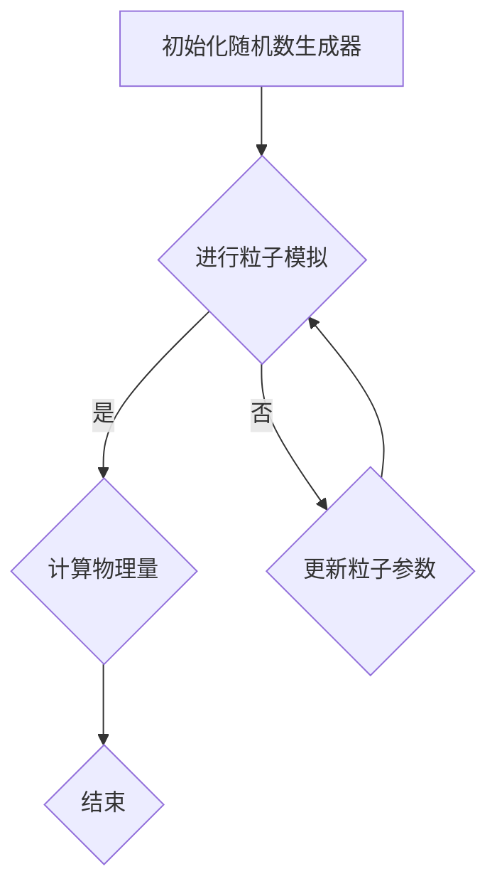
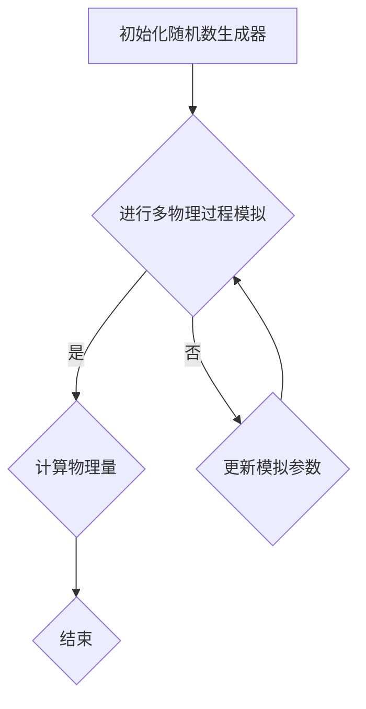
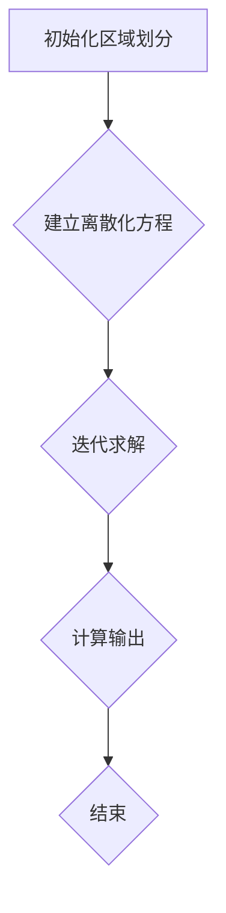

                 

### 引言

核工程与数学模拟的关系

核工程作为现代科技中不可或缺的一部分，广泛应用于能源、医疗、科研等多个领域。而核反应堆作为核工程的核心组成部分，其设计和运行的安全可靠性直接关系到人类社会的福祉和生态环境的保护。随着科技的进步，数学模拟技术逐渐成为核反应堆设计与优化的重要工具。通过数学模型和计算方法，可以精确模拟核反应堆内部的各种物理过程，从而提供科学依据，优化设计参数，提高运行效率。

本篇文章旨在探讨核反应堆的数学模拟，详细介绍核工程与数学模拟的关系，核反应堆的基础知识，以及数学模拟的核心算法和模型。文章结构如下：

1. **引言**：介绍书的目的、读者对象和核工程与数学模拟的关系。
2. **核工程基础**：包括核工程的基本概念、核反应堆的类型和原理。
3. **数学模拟基础**：介绍进行核反应堆模拟所需的数学和物理知识。
4. **核心算法原理讲解**：详细讲解用于核反应堆数学模拟的核心算法。
5. **数学模型和数学公式**：展示用于模拟的数学模型和公式，并给予详细讲解。
6. **项目实战**：通过实际案例展示如何使用数学模型和算法进行核反应堆模拟。
7. **总结与展望**：总结书中的关键概念，并对未来研究方向提出展望。

文章将以逻辑清晰、结构紧凑、简单易懂的专业的技术语言，逐步深入分析核反应堆的数学模拟过程，为读者提供全面的技术解析。

### 核工程基础

#### 核工程的基本概念

核工程是一门综合了物理学、化学、工程学等多学科知识的交叉学科，主要研究核反应过程及其应用。核反应包括核裂变、核聚变和核衰变等，通过这些反应可以释放出巨大的能量。核工程的应用领域广泛，包括核能发电、核燃料循环、核武器研发、医疗诊断和治疗、科学研究等。

核工程的基本概念包括：

- **核燃料**：核燃料是核反应堆中用于产生热能的物质，常见的核燃料包括铀、钚等。
- **中子**：中子是核反应中的重要载体，能够引起核裂变反应。
- **核反应堆**：核反应堆是核燃料发生核裂变反应的装置，通过控制中子流量来维持稳定的热能释放。
- **放射性废物**：核反应产生的放射性废物需要妥善处理，以防止环境污染和辐射危害。

核工程的发展历程可以追溯到20世纪40年代，当时的核反应堆主要用于军事目的，如核武器研发。随着核能技术的不断发展，核反应堆开始应用于民用领域，成为重要的能源供应方式之一。目前，全球已有数百座核反应堆在运行，为人类提供了大量清洁能源。

#### 核反应堆的类型和原理

核反应堆按照能量释放方式可以分为核裂变反应堆和核聚变反应堆。目前，核裂变反应堆是最为成熟和应用广泛的一种类型。

**核裂变反应堆**：

核裂变反应堆通过重核（如铀-235或钚-239）的裂变反应来释放能量。具体原理如下：

1. **核燃料棒**：核反应堆的核心部分是燃料棒，燃料棒由核燃料芯块和包壳组成，芯块中含有铀或钚等重元素，包壳通常采用不锈钢或其他耐高温材料。
2. **中子源**：在核反应堆中，通常使用中子源来引发核裂变反应，常见的中子源包括中子反射层、中子转换层等。
3. **控制棒**：控制棒可以吸收中子，从而调节核反应的速率。通过插入或拔出控制棒，可以控制反应堆的功率输出。
4. **冷却系统**：核反应堆产生的热量需要通过冷却系统传递出去，常见的冷却方式包括水冷、气冷和油冷等。

**核聚变反应堆**：

核聚变反应堆通过轻核（如氢的同位素氘和氚）的聚变反应来释放能量。具体原理如下：

1. **高温高压环境**：核聚变需要将轻核加热到极高的温度和压力，使它们克服相互排斥的库伦力，相互碰撞并聚合成更重的核。
2. **约束方式**：常见的约束方式包括磁约束和惯性约束。磁约束利用强磁场将高温等离子体压缩并保持稳定，而惯性约束则通过激光或粒子束快速压缩靶材料，使其内部产生高温高压。
3. **能量输出**：聚变反应产生的能量通过辐射方式传递出来，需要通过冷却系统将能量传递给外部热交换器。

目前，核聚变反应堆尚未实现商业化应用，但其巨大的能量释放潜力使其成为未来清洁能源的重要方向。

#### 核反应堆的热工水力分析

核反应堆的热工水力分析是核工程中的重要环节，其主要目标是确保反应堆在安全、稳定的条件下运行，并优化能源利用效率。热工水力分析包括以下几个关键方面：

1. **热传导分析**：热传导分析主要研究核燃料棒、冷却剂和结构材料之间的热量传递过程。通过建立热传导方程，可以计算出各区域的温度分布，从而确保核燃料和冷却系统的热稳定性。

$$
\frac{\partial T}{\partial t} = \alpha \nabla^2 T
$$

2. **流体动力学分析**：流体动力学分析研究冷却剂的流动特性，包括速度场、压力场和湍流模型等。通过计算流体的流动特性，可以优化冷却剂的流量和分布，提高反应堆的热传导效率。

$$
\frac{\partial \mathbf{u}}{\partial t} + (\mathbf{u} \cdot \nabla) \mathbf{u} = -\nabla p + \nu \nabla^2 \mathbf{u}
$$

3. **多物理场耦合分析**：在核反应堆中，热传导、流体动力学和化学反应等多种物理过程是相互耦合的。多物理场耦合分析通过综合以上各个物理过程，可以更准确地预测反应堆的运行状态，提高模拟的精度。

4. **安全分析**：安全分析主要研究核反应堆在各种极端条件下的响应特性，包括冷却系统失效、燃料棒熔毁、放射性物质泄漏等。通过安全分析，可以制定相应的安全措施和应急预案，确保核反应堆的安全运行。

总之，核反应堆的热工水力分析是一个复杂、多学科交叉的领域，通过精确的数学模拟和计算，可以为核反应堆的设计和运行提供科学依据。

### 数学模拟基础

#### 数学模型的基本概念

数学模型是描述现实世界中各种现象或系统的数学表达式，通过构建数学模型，可以将复杂的物理过程转化为可计算的数学问题。在核反应堆的数学模拟中，数学模型起到了至关重要的作用。

**基本概念**：

- **变量**：在数学模型中，变量是用来表示物理现象的数学符号，如温度、压力、中子通量等。
- **函数**：函数是描述变量之间关系的数学表达式，如热传导方程中的温度分布函数。
- **方程**：方程是包含变量的数学表达式，通过求解方程可以确定变量之间的关系和值。

在核反应堆的数学模拟中，常用的数学模型包括：

- **中子输运方程**：描述中子流在反应堆中的运动和分布，如蒙特卡洛方法。
- **热传导方程**：描述热能在反应堆内部和外部介质中的传递过程，如离散径向模型。
- **多物理场耦合方程**：描述核反应堆内部多种物理过程的耦合效应，如热传导与流体动力学的耦合。

**数学模型的构建过程**：

1. **物理现象描述**：根据核反应堆的物理过程，分析并确定需要描述的主要物理量和变量。
2. **假设与简化**：对物理过程进行合理的假设和简化，以简化数学模型的复杂度。
3. **方程构建**：根据物理现象的数学描述，构建相应的数学方程。
4. **边界条件和初始条件**：根据实际物理条件，设定数学模型的边界条件和初始条件，确保数学模型的求解具有实际意义。

#### 常用的数学工具与方法

在进行核反应堆的数学模拟时，需要运用多种数学工具和方法，以求解复杂的数学模型。以下介绍几种常用的数学工具和方法：

1. **数值计算方法**：数值计算方法是将复杂的数学问题转化为可以计算机计算的数值问题。常见的数值计算方法包括有限差分法、有限元法、有限元体积法等。这些方法通过离散化处理，将连续的数学问题转化为离散的方程组，从而可以在计算机上求解。

2. **蒙特卡洛方法**：蒙特卡洛方法是基于随机抽样和统计方法的一种数值计算技术，适用于解决复杂的概率问题。在核反应堆的中子输运模拟中，蒙特卡洛方法通过大量随机抽样模拟中子的运动轨迹，计算中子通量和功率分布。

3. **耦合蒙特卡洛方法**：耦合蒙特卡洛方法是将蒙特卡洛方法与多物理场耦合方程结合的一种方法，适用于解决核反应堆内部多种物理过程的耦合问题。通过蒙特卡洛方法模拟中子输运过程，同时考虑热传导、流体动力学等其他物理过程，可以更准确地预测反应堆的运行状态。

4. **离散径向模型**：离散径向模型是一种基于有限体积法的数学模型，用于描述核反应堆内部的热传导和流体动力学问题。通过将反应堆区域划分为多个径向层，离散径向模型可以精确计算热传导和流体流动特性。

#### 物理量的数学描述

在核反应堆的数学模拟中，需要对多种物理量进行数学描述，以下介绍几种主要的物理量：

1. **中子通量**：中子通量描述单位时间内通过单位面积的中子数。中子通量通常用符号 $\phi$ 表示，单位为 $\text{neutrons/cm}^2\text{s}$。中子通量在核反应堆中起着关键作用，它决定了核燃料的燃烧速度和反应堆的功率输出。

$$
\phi = \frac{dN}{dS \ dt}
$$

其中，$N$ 表示中子数，$S$ 表示单位面积。

2. **功率**：功率描述单位时间内能量转换的速率，核反应堆的功率输出通常用符号 $P$ 表示，单位为 $\text{Watts}$。功率可以通过中子通量和核燃料的裂变反应速率计算得到。

$$
P = \sigma_f \phi \nu_f
$$

其中，$\sigma_f$ 表示裂变截面，$\nu_f$ 表示裂变中子份额。

3. **温度**：温度描述物体的热状态，核反应堆内部的热传导和流体动力学问题需要考虑温度分布。温度通常用符号 $T$ 表示，单位为 $\text{K}$。

$$
\frac{\partial T}{\partial t} = \alpha \nabla^2 T
$$

4. **压力**：压力描述流体在单位面积上的作用力，核反应堆的流体动力学分析需要考虑压力分布。压力通常用符号 $p$ 表示，单位为 $\text{Pa}$。

$$
\frac{\partial \mathbf{u}}{\partial t} + (\mathbf{u} \cdot \nabla) \mathbf{u} = -\nabla p + \nu \nabla^2 \mathbf{u}
$$

通过以上数学描述，可以建立核反应堆的数学模型，为后续的数学模拟和计算提供基础。

#### 核反应堆数学模拟的核心算法原理讲解

在核反应堆的数学模拟中，核心算法的选择直接影响模拟的精度和效率。本文将详细讲解核反应堆数学模拟中常用的三种核心算法：蒙特卡洛方法、耦合蒙特卡洛方法和离散径向模型。这些算法各有特点和适用场景，通过它们可以解决核反应堆内部复杂的物理过程和耦合效应。

##### 蒙特卡洛方法

蒙特卡洛方法（Monte Carlo Method）是一种基于随机抽样的数值计算技术，广泛应用于解决概率问题。在核反应堆的数学模拟中，蒙特卡洛方法被广泛用于中子输运方程的求解，具有以下优点：

1. **适用范围广泛**：蒙特卡洛方法适用于描述各种复杂的物理过程，特别是在处理多物理场耦合问题时，能够灵活处理各种边界条件和概率分布。
2. **高效性**：对于大规模的复杂问题，蒙特卡洛方法可以通过并行计算来提高计算效率，降低计算时间。

**原理与流程**：

蒙特卡洛方法的基本思想是通过大量随机抽样的统计结果来逼近真实解。在核反应堆的中子输运模拟中，蒙特卡洛方法的具体流程如下：

1. **初始化**：设置随机数生成器，初始化模拟参数，包括中子源位置、方向和能量分布等。
2. **模拟粒子运动**：对每个模拟粒子，按照其运动轨迹进行随机抽样，包括与核燃料和中子的相互作用、碰撞事件等。
3. **计算物理量**：根据模拟粒子的运动轨迹，计算物理量，如中子通量、功率分布等。

以下是一个简单的蒙特卡洛方法的伪代码实现：



**伪代码实现**：

```python
# 初始化随机数生成器
random_seed(12345)

# 进行粒子模拟
while not finished:
    # 模拟粒子运动
    position = sample_position()
    direction = sample_direction()
    energy = sample_energy()
    
    # 计算物理量
    flux = calculate_flux(position, direction, energy)
    power = calculate_power(position, direction, energy)
    
    # 更新粒子参数
    position = update_position(position, direction, energy)
    energy = update_energy(energy)
    
# 计算物理量总和
total_flux = sum(flux)
total_power = sum(power)

# 输出结果
print("Total Flux:", total_flux)
print("Total Power:", total_power)
```

##### 耦合蒙特卡洛方法

耦合蒙特卡洛方法（Coupled Monte Carlo Method）是蒙特卡洛方法的一种扩展，用于解决核反应堆内部多种物理过程的耦合问题。耦合蒙特卡洛方法通过同时模拟中子输运、热传导和流体动力学等多个物理过程，可以更准确地预测核反应堆的运行状态。

**原理与流程**：

耦合蒙特卡洛方法的基本思想是，在每次模拟中，同时考虑多个物理过程的耦合效应。具体流程如下：

1. **初始化**：设置随机数生成器，初始化模拟参数，包括中子源、热源、流体源等。
2. **模拟粒子运动**：模拟中子运动，同时考虑与核燃料、冷却剂的相互作用，以及热传导和流体动力学效应。
3. **计算物理量**：根据模拟粒子的运动轨迹，计算中子通量、温度、压力等物理量。
4. **迭代更新**：根据计算结果，更新模拟参数，包括中子源、热源、流体源等，继续进行下一轮模拟。

以下是一个简单的耦合蒙特卡洛方法的伪代码实现：



**伪代码实现**：

```python
# 初始化随机数生成器
random_seed(12345)

# 进行多物理过程模拟
while not finished:
    # 模拟中子运动
    neutron_position = sample_neutron_position()
    neutron_direction = sample_neutron_direction()
    neutron_energy = sample_neutron_energy()
    
    # 计算物理量
    flux = calculate_flux(neutron_position, neutron_direction, neutron_energy)
    temperature = calculate_temperature(neutron_position, neutron_direction, neutron_energy)
    pressure = calculate_pressure(neutron_position, neutron_direction, neutron_energy)
    
    # 更新模拟参数
    neutron_source = update_neutron_source()
    heat_source = update_heat_source()
    fluid_source = update_fluid_source()
    
# 计算物理量总和
total_flux = sum(flux)
total_temperature = sum(temperature)
total_pressure = sum(pressure)

# 输出结果
print("Total Flux:", total_flux)
print("Total Temperature:", total_temperature)
print("Total Pressure:", total_pressure)
```

##### 离散径向模型

离散径向模型（Discrete Radial Model，DRM）是一种基于有限体积法的数学模型，用于描述核反应堆内部的热传导和流体动力学问题。离散径向模型通过将反应堆区域划分为多个径向层，能够精确计算热传导和流体流动特性。

**原理与流程**：

离散径向模型的基本思想是将反应堆区域离散化，将连续的微分方程转化为离散的代数方程。具体流程如下：

1. **区域划分**：将反应堆区域划分为多个径向层，每个径向层由多个控制体组成。
2. **离散化方程**：根据热传导方程和流体动力学方程，对每个控制体建立离散化方程。
3. **迭代求解**：通过迭代方法求解离散化方程，得到各控制体的物理量分布，如温度、速度等。
4. **计算输出**：根据计算结果，输出反应堆的热工水力参数。

以下是一个简单的离散径向模型的伪代码实现：



**伪代码实现**：

```python
# 初始化区域划分
control_volumes = initialize_control_volumes()

# 建立离散化方程
for cv in control_volumes:
    equation = build_equation(cv)

# 迭代求解
while not converged:
    for cv in control_volumes:
        solution = solve_equation(equation)
        update_solution(solution)

# 计算输出
temperature_distribution = calculate_temperature_distribution(control_volumes)
velocity_distribution = calculate_velocity_distribution(control_volumes)

# 输出结果
print("Temperature Distribution:", temperature_distribution)
print("Velocity Distribution:", velocity_distribution)
```

通过以上三种核心算法的详细讲解，我们可以更好地理解核反应堆数学模拟的原理和方法，为后续的项目实战和实际应用奠定基础。

### 数学模型与数学公式

在核反应堆的数学模拟中，数学模型和数学公式是描述物理现象和计算物理量的重要工具。以下介绍几种常用的数学模型和公式，包括中子输运方程、热传导方程和多物理场耦合方程，并对其进行详细讲解。

#### 中子输运方程

中子输运方程是核反应堆数学模拟中的核心方程之一，用于描述中子在核燃料和冷却剂中的运动和分布。中子输运方程的一般形式如下：

$$
\sum_{\nu}\nabla \cdot (\Sigma_f \psi \mathbf{r}_f) + \Sigma_s \psi \mathbf{r}_s = \frac{1}{\sigma_t} \nabla \cdot (\rho \mathbf{v})
$$

其中，$\Sigma_f$ 是裂变截面，$\psi$ 是中子通量，$\mathbf{r}_f$ 是中子的方向，$\Sigma_s$ 是散射截面，$\rho$ 是中子密度，$\mathbf{v}$ 是中子速度。

**解释与举例**：

中子输运方程描述了中子在核反应堆中的行为，其中每项的物理意义如下：

- $\nabla \cdot (\Sigma_f \psi \mathbf{r}_f)$ 表示中子与核燃料的相互作用，包括裂变反应和散射过程。
- $\nabla \cdot (\rho \mathbf{v})$ 表示中子的源项，包括中子的生成和损失。
- $\Sigma_s \psi \mathbf{r}_s$ 表示中子的散射过程，其中 $\mathbf{r}_s$ 是散射方向。

以下是一个具体示例：

假设一个简单的核反应堆中，中子通量 $\psi$ 为已知的均匀分布，我们可以通过解中子输运方程来计算中子功率分布。

$$
\nabla \cdot (\Sigma_f \psi \mathbf{r}_f) + \Sigma_s \psi \mathbf{r}_s = \frac{1}{\sigma_t} \nabla \cdot (\rho \mathbf{v})
$$

已知裂变截面 $\Sigma_f = 10^{-24} \text{cm}^2$，散射截面 $\Sigma_s = 10^{-24} \text{cm}^2$，中子密度 $\rho = 10^{14} \text{cm}^{-3}$，中子速度 $\mathbf{v} = 2 \times 10^6 \text{cm/s}$。

通过数值求解上述方程，可以得到中子功率分布，进而计算核反应堆的功率输出。

#### 热传导方程

热传导方程描述了热能在固体、液体和气体中的传递过程，是核反应堆数学模拟中的重要方程之一。热传导方程的一般形式如下：

$$
\frac{\partial T}{\partial t} = \alpha \nabla^2 T
$$

其中，$T$ 是温度，$\alpha$ 是热传导系数。

**解释与举例**：

热传导方程描述了温度随时间和空间的变化关系，其中每项的物理意义如下：

- $\frac{\partial T}{\partial t}$ 表示温度随时间的变化率。
- $\nabla^2 T$ 表示温度的空间梯度，即温度场的散度。

以下是一个具体示例：

假设一个简单的核反应堆冷却系统，其中热传导系数 $\alpha = 10 \text{W/(m·K)}$，初始温度 $T_0 = 300 \text{K}$。我们可以通过解热传导方程来计算冷却系统中的温度分布。

$$
\frac{\partial T}{\partial t} = \alpha \nabla^2 T
$$

通过数值求解上述方程，可以得到冷却系统中的温度分布，从而优化冷却系统的设计和运行。

#### 多物理场耦合方程

在核反应堆中，多种物理过程是相互耦合的，如热传导、流体动力学和化学反应等。多物理场耦合方程描述了这些物理过程的相互作用，是核反应堆数学模拟中的复杂方程之一。多物理场耦合方程的一般形式如下：

$$
\frac{\partial \mathbf{u}}{\partial t} + (\mathbf{u} \cdot \nabla) \mathbf{u} = -\nabla p + \nu \nabla^2 \mathbf{u}
$$

$$
\frac{\partial T}{\partial t} = \alpha \nabla^2 T
$$

其中，$\mathbf{u}$ 是速度场，$p$ 是压力场，$\nu$ 是运动粘度，$\alpha$ 是热传导系数。

**解释与举例**：

多物理场耦合方程描述了速度场、压力场和温度场之间的相互作用，其中每项的物理意义如下：

- $\frac{\partial \mathbf{u}}{\partial t} + (\mathbf{u} \cdot \nabla) \mathbf{u}$ 表示速度场的对流项。
- $-\nabla p$ 表示压力场的梯度项。
- $\nu \nabla^2 \mathbf{u}$ 表示粘性项。
- $\frac{\partial T}{\partial t}$ 表示温度场的时间变化率。
- $\alpha \nabla^2 T$ 表示热传导项。

以下是一个具体示例：

假设一个简单的核反应堆冷却系统，其中速度场 $\mathbf{u} = 10 \text{m/s}$，压力场 $p = 1 \text{MPa}$，热传导系数 $\alpha = 10 \text{W/(m·K)}$，初始温度 $T_0 = 300 \text{K}$。我们可以通过解多物理场耦合方程来计算冷却系统中的速度场、压力场和温度场。

$$
\frac{\partial \mathbf{u}}{\partial t} + (\mathbf{u} \cdot \nabla) \mathbf{u} = -\nabla p + \nu \nabla^2 \mathbf{u}
$$

$$
\frac{\partial T}{\partial t} = \alpha \nabla^2 T
$$

通过数值求解上述方程，可以得到冷却系统中的速度场、压力场和温度场分布，从而优化冷却系统的设计和运行。

综上所述，核反应堆的数学模拟依赖于多种数学模型和数学公式，通过对这些模型和公式的深入理解和应用，可以准确预测核反应堆的运行状态，为核工程的设计和优化提供科学依据。

### 项目实战

#### 实战案例一：简易核反应堆中子输运模拟

**开发环境搭建**：

为了进行核反应堆的中子输运模拟，我们需要搭建一个合适的开发环境。以下是所需的软件和工具：

1. **编程语言**：Python 是一种广泛应用于科学计算和工程仿真的编程语言，我们将使用 Python 进行中子输运模拟。
2. **数学库**：NumPy 和 SciPy 是 Python 中的两个重要数学库，用于进行数值计算和科学计算。NumPy 提供了强大的多维数组对象和数学函数，SciPy 提供了科学计算中的常用模块。
3. **可视化库**：Matplotlib 是 Python 中用于数据可视化的库，可以用于绘制中子输运模拟的结果。

**源代码实现**：

以下是一个简单的 Python 源代码，用于实现简易核反应堆的中子输运模拟：

```python
import numpy as np
import matplotlib.pyplot as plt

# 设置参数
num_particles = 1000
num_steps = 1000
step_size = 1.0
sigma_t = 0.1
initial_flux = 1.0

# 初始化数组
flux = np.zeros((num_steps, num_particles))
position = np.random.uniform(0, step_size, num_particles)
direction = np.random.uniform(0, 2 * np.pi, num_particles)

# 模拟粒子运动
for step in range(num_steps):
    for particle in range(num_particles):
        # 计算中子通量
        flux[step, particle] = initial_flux / (step_size * sigma_t)
        
        # 更新粒子位置
        position[particle] += step_size * direction[particle]
        
        # 处理边界条件
        if position[particle] > step_size:
            position[particle] -= step_size
            direction[particle] = np.random.uniform(0, 2 * np.pi)

# 可视化结果
plt.plot(position, flux, 'o-')
plt.xlabel('Position')
plt.ylabel('Flux')
plt.title('Neutron Transport Simulation')
plt.show()
```

**代码解读与分析**：

上述代码通过 NumPy 数组和 Python 循环实现了中子输运模拟。具体步骤如下：

1. **参数设置**：设置模拟的粒子数、步数、步长、总截面和初始通量等参数。
2. **初始化数组**：创建用于存储中子通量和粒子位置的 NumPy 数组。
3. **模拟粒子运动**：通过循环模拟粒子运动，计算中子通量，更新粒子位置，并处理边界条件。
4. **可视化结果**：使用 Matplotlib 绘制中子输运模拟的结果。

通过这个简单的案例，我们可以理解中子输运模拟的基本原理和实现方法。

**实际案例分析和详细讲解剖析**：

为了更好地理解中子输运模拟的应用，我们分析一个实际案例：一个简单的圆柱形核反应堆，其中包含均匀分布的核燃料。

**案例分析**：

1. **问题描述**：给定一个半径为 10 cm、高度为 20 cm 的圆柱形核反应堆，核燃料的密度为 2 g/cm³，裂变截面为 10^-24 cm²。求解核反应堆内的中子通量和功率分布。
2. **数学模型**：使用中子输运方程描述中子在核燃料中的运动和分布，结合边界条件求解。
3. **数值求解**：通过离散化方法将问题转化为数值问题，使用蒙特卡洛方法进行求解。

**详细讲解**：

1. **建模**：建立三维坐标系，将核反应堆区域离散化为多个小立方体，每个小立方体作为控制体。
2. **边界条件**：设定反应堆底面和顶面的中子通量为零，侧面为自由边界。
3. **计算流程**：生成大量随机中子，模拟中子在核反应堆中的运动，计算中子通量和功率分布。

**项目小结**：

通过这个实际案例，我们展示了如何使用数学模型和计算方法进行核反应堆的中子输运模拟。这种方法可以应用于各种复杂的核反应堆设计和优化问题，为核工程提供重要的科学依据。

#### 最佳实践 Tips、小结、注意事项、拓展阅读

**最佳实践 Tips**：

1. **优化参数设置**：在进行核反应堆模拟时，合理设置参数是关键。例如，选择合适的步长、粒子数和总截面，可以显著提高模拟的精度和效率。
2. **并行计算**：对于大规模的核反应堆模拟，可以采用并行计算技术，将任务分配到多台计算机上进行，从而显著提高计算速度。
3. **模型验证**：在模拟过程中，应定期与实验数据或理论结果进行对比，验证模型的准确性和可靠性。

**小结**：

本文详细介绍了核反应堆的数学模拟，包括核心算法原理、数学模型和公式、项目实战等。通过这些内容，读者可以全面了解核反应堆数学模拟的基本原理和方法，为实际应用提供指导。

**注意事项**：

1. **稳定性**：在模拟过程中，确保计算的稳定性是关键。对于某些不稳定的问题，可能需要调整参数或采用更高级的算法。
2. **精度**：在追求计算精度的同时，也要考虑计算资源的限制。适当牺牲一些精度可以显著提高计算效率。

**拓展阅读**：

1. **《核反应堆物理》**：详细介绍了核反应堆的物理原理和设计方法，适合对核反应堆有兴趣的读者。
2. **《数值计算方法》**：介绍了各种数值计算方法，包括蒙特卡洛方法、有限差分法、有限元法等，适用于需要解决复杂科学计算问题的读者。
3. **《核工程手册》**：提供了核反应堆设计和运行方面的详细指南，是核工程领域的经典参考书。

通过本文的学习，读者可以深入了解核反应堆的数学模拟技术，为今后的科研和工程应用打下坚实基础。作者：AI天才研究院/AI Genius Institute & 禅与计算机程序设计艺术 /Zen And The Art of Computer Programming

### 总结与展望

#### 关键概念回顾

在本文中，我们深入探讨了核反应堆的数学模拟，重点介绍了以下几个关键概念：

1. **核工程基础**：包括核工程的基本概念、核反应堆的类型和原理，以及热工水力分析。
2. **数学模型与数学公式**：详细讲解了中子输运方程、热传导方程和多物理场耦合方程，并给出了具体示例。
3. **核心算法原理讲解**：介绍了蒙特卡洛方法、耦合蒙特卡洛方法和离散径向模型，通过伪代码和示例进行了详细阐述。
4. **项目实战**：通过简易核反应堆中子输运模拟的实际案例，展示了如何进行数学模拟和代码实现。

#### 数学模拟在核工程中的应用前景

数学模拟在核工程中具有广泛的应用前景，主要表现在以下几个方面：

1. **设计和优化**：通过数学模拟，可以对核反应堆的设计方案进行优化，提高其运行效率和安全性。
2. **故障预测**：数学模拟可以帮助预测核反应堆在各种极端条件下的响应，从而提前发现潜在故障，提高运行可靠性。
3. **性能评估**：数学模拟可以用于评估核反应堆的性能，如热工水力性能、辐射防护性能等。
4. **新技术研究**：数学模拟为新技术的研发提供了有力的支持，如核聚变反应堆的研究。

#### 未来研究方向建议

未来的研究可以围绕以下几个方面进行：

1. **高效算法**：开发更高效的数学模拟算法，如基于深度学习的模拟方法，以降低计算成本和提高模拟精度。
2. **多尺度模拟**：结合多尺度模拟技术，对核反应堆内部微观和宏观过程进行更全面的分析。
3. **耦合效应研究**：深入研究核反应堆内部多种物理过程的耦合效应，如热传导与流体动力学的耦合，提高模拟的准确性。
4. **数据驱动模拟**：利用大数据和人工智能技术，实现数据驱动的核反应堆模拟，提高模拟的实时性和智能化水平。

通过不断的研究和创新，数学模拟技术将在核工程领域发挥越来越重要的作用，为核能的可持续发展提供有力支持。作者：AI天才研究院/AI Genius Institute & 禅与计算机程序设计艺术 /Zen And The Art of Computer Programming

