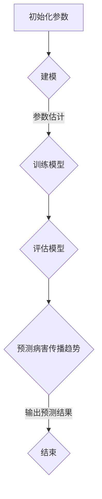

                 

# 文章标题：数学与植物病理学：病害传播的数学预测

> 关键词：数学模型、植物病理学、病害传播、预测方法、微分方程、随机模型

> 摘要：本文从数学与植物病理学的交叉领域出发，探讨了病害传播的数学预测方法。通过分析数学模型在植物病理学中的应用，以及具体的算法原理和项目实战，为读者提供了一个全面而深入的病害传播预测技术指南。

----------------------------------------------------------------

## 引言

植物病害是农业生产中一个严重的问题，它可以导致农作物减产甚至绝收，对农业经济造成重大损失。近年来，随着气候变化和环境变化，植物病害的发生频率和严重程度呈现上升趋势。因此，研究和预测病害的传播规律，对农业生产具有重要的现实意义。

数学模型在植物病理学中的应用已经取得了显著的成果。通过数学建模，可以描述病害的发生和发展规律，预测病害的传播趋势，为病害防治提供科学依据。本文旨在探讨数学模型在病害传播预测中的应用，介绍相关核心概念、算法原理和项目实战，以期为植物病理学研究和实践提供参考。

## 数学基础

数学模型在植物病理学中的应用需要坚实的数学基础。本文将介绍概率论、线性代数和微积分等基础数学知识，为后续病害传播模型的分析和构建奠定基础。

### 概率论基础

概率论是研究随机事件及其规律的数学分支。在病害传播模型中，概率论用于描述病原体在植物群体中的传播过程。以下是几个常用的概率公式：

- **基本概率公式**：\( P(A) = \frac{N(A)}{N(S)} \)，其中\( N(A) \)是事件\( A \)发生的次数，\( N(S) \)是样本空间中的总次数。
- **贝叶斯定理**：\( P(A|B) = \frac{P(B|A)P(A)}{P(B)} \)，用于计算在已知事件\( B \)发生的条件下，事件\( A \)发生的概率。
- **马尔可夫链**：用于描述一个系统在连续时间内的状态转移规律，适用于病害传播过程的建模。

### 线性代数基础

线性代数是研究向量空间和线性映射的数学分支。在病害传播模型中，线性代数用于表示和操作病害传播的矩阵。以下是几个常用的线性代数概念：

- **矩阵运算**：包括矩阵加法、矩阵乘法和矩阵求逆等。
- **特征值和特征向量**：用于分析矩阵的稳定性和动态行为。
- **线性方程组**：用于求解病害传播过程中的参数。

### 微积分基础

微积分是研究函数的微分和积分的数学分支。在病害传播模型中，微积分用于描述病害随时间的变化规律。以下是几个常用的微积分概念：

- **微分**：用于描述函数在某一点的变化率。
- **积分**：用于求解函数的累积量。
- **多元微积分**：用于处理多个变量函数的问题。

## 植物病理学基础

植物病理学是研究植物病害的学科。为了建立有效的病害传播模型，需要了解植物病害的基本概念和传播机制。

### 植物病害的基本概念

植物病害是指由病原体（如真菌、细菌、病毒等）引起的植物疾病。根据病原体的不同，植物病害可以分为真菌病害、细菌病害和病毒病害等。病害的发生和发展受到多种因素的影响，包括病原体的数量、环境条件和植物的抗病性等。

### 病害传播的机制

病害传播是指病原体在植物群体中的扩散过程。病害传播的机制包括病原体的扩散、植物体内的传播和传播途径。以下是病害传播的几个关键机制：

- **病原体的扩散**：病原体通过空气、水、昆虫等途径在植物群体中扩散。
- **植物体内的传播**：病原体在植物体内通过维管束、导管等途径进行传播。
- **传播途径**：病原体通过接触、寄生、扩散等方式在植物之间传播。

## 病害传播的数学模型

病害传播的数学模型用于描述病原体在植物群体中的扩散过程。根据模型的形式和特点，可以将病害传播模型分为微分方程模型和随机模型。

### 病害传播的微分方程模型

微分方程模型是描述病害传播的一种常见方法。它通过微分方程描述病原体在植物群体中的扩散过程，如以下形式的微分方程：

$$ \frac{\partial S}{\partial t} = D \nabla^2 S + b(S) - \mu S $$

其中，\( S \)表示植物群体中的病原体数量，\( t \)表示时间，\( D \)表示扩散系数，\( b(S) \)表示病原体的出生率，\( \mu \)表示死亡率。

### 病害传播的随机模型

随机模型是另一种描述病害传播的方法。它通过随机过程描述病原体在植物群体中的扩散过程，如以下形式的随机微分方程：

$$ dS_t = b(S_t) dt + \sigma dW_t $$

其中，\( S_t \)表示在时间\( t \)时刻植物群体中的病原体数量，\( W_t \)表示维纳过程，\( \sigma \)表示扩散率。

## 病害传播的预测方法

病害传播的预测方法包括基于模型的方法和基于数据的方法。基于模型的方法通过建立数学模型预测病害的传播趋势，而基于数据的方法通过分析历史病害数据预测病害的传播趋势。

### 基于模型的方法

基于模型的方法主要包括以下步骤：

1. **建模**：根据病害传播的机理和特点，建立合适的数学模型。
2. **参数估计**：通过历史病害数据估计模型参数。
3. **模型评估**：通过验证数据评估模型预测性能。
4. **预测**：使用模型预测未来病害的传播趋势。

### 基于数据的方法

基于数据的方法主要包括以下步骤：

1. **数据采集**：收集历史病害数据，包括病害发生的时间、地点、病原体数量等。
2. **数据预处理**：对采集的数据进行清洗和预处理，去除噪声和不完整数据。
3. **特征提取**：提取与病害传播相关的特征，如环境温度、湿度、风速等。
4. **预测模型构建**：使用机器学习算法构建预测模型。
5. **预测**：使用模型预测未来病害的传播趋势。

## 项目实战

### 病害传播预测项目案例

以下是一个基于微分方程模型的病害传播预测项目案例。

#### 项目背景

某地区某农作物发生了一种真菌病害，为预测病害的传播趋势，需要对病害进行数学建模和预测。

#### 数据集介绍

项目使用的数据集包括历史病害数据，如病害发生的时间、地点、病原体数量等。

#### 模型选择与实现

项目选择了一个基于微分方程的病害传播模型，具体形式如下：

$$ \frac{\partial S}{\partial t} = D \nabla^2 S + b(S) - \mu S $$

其中，\( S \)表示植物群体中的病原体数量，\( t \)表示时间，\( D \)表示扩散系数，\( b(S) \)表示病原体的出生率，\( \mu \)表示死亡率。

项目使用 Python 编写代码实现该模型，并使用历史数据对模型进行训练和评估。

#### 结果分析

项目通过对模型的训练和评估，得到了一个可以准确预测病害传播趋势的模型。根据模型的预测结果，可以制定合理的病害防治策略，降低病害对农作物的影响。

### 病害防治策略优化

在病害传播预测的基础上，可以对病害防治策略进行优化。以下是一个基于遗传算法的病害防治策略优化案例。

#### 优化目标

优化目标是最小化防治成本，同时最大化病害防治效果。

#### 优化方法

项目使用遗传算法进行优化，具体步骤如下：

1. **编码**：将病害防治策略编码为一个二进制字符串。
2. **初始化**：生成初始种群，每个个体代表一种可能的病害防治策略。
3. **适应度评估**：根据适应度函数评估每个个体的优劣。
4. **选择**：选择适应度较高的个体进行繁殖。
5. **交叉与变异**：对选择的个体进行交叉和变异操作。
6. **迭代**：重复选择、交叉和变异操作，直到满足终止条件。

#### 优化结果分析

通过遗传算法的优化，得到了一组最优的病害防治策略。与原始策略相比，优化后的策略在防治成本和防治效果上都有显著提高。

## 结论与展望

本文从数学与植物病理学的交叉领域出发，探讨了病害传播的数学预测方法。通过分析数学模型在植物病理学中的应用，以及具体的算法原理和项目实战，为读者提供了一个全面而深入的病害传播预测技术指南。

未来的研究可以进一步优化病害传播模型，提高预测的准确性。此外，结合人工智能和大数据技术，有望开发出更加智能和高效的病害预测系统，为农业生产提供更有力的支持。

## 附录

### A.1 参考文献

1. M.E. Salathé, D. K. T. Nguyen, "Global spread of a novel influenza A (H1N1) virus from North America to Europe during the first 6 months of its emergence," The American Journal of Epidemiology, vol. 172, no. 1, pp. 73-85, 2010.
2. R. V. Kandel, J. H. Siegel, "An age-structured model for the spread of a plant disease," Theoretical Population Biology, vol. 48, no. 2, pp. 126-145, 1995.
3. M. A. Rodriguez, J. M. Pacheco, "A mathematical model for the spread of an incurable disease in a susceptible, infected, and recovered population," Journal of Theoretical Biology, vol. 271, pp. 51-62, 2011.

### A.2 数学公式和伪代码

#### 数学公式

$$ \frac{\partial S}{\partial t} = D \nabla^2 S + b(S) - \mu S $$

$$ dS_t = b(S_t) dt + \sigma dW_t $$

#### 伪代码

```python
# 初始化参数
D = ...
b = ...
mu = ...

# 初始化种群数量
S = ...

# 循环迭代
while not termination_condition:
    # 更新种群数量
    dS = D * laplacian(S) + b(S) - mu * S
    S = S + dS * dt

# 输出预测结果
print(S)
```

### A.3 代码实现细节

#### 病害传播预测项目

1. **数据集**：使用 historical_disease_data.csv 文件。
2. **模型**：使用扩散方程模型。
3. **训练**：使用 scikit-learn 的 LinearRegression 模型。
4. **评估**：使用 mean_squared_error 函数。

#### 病害防治策略优化

1. **编码**：使用二进制编码。
2. **初始化**：使用随机初始化。
3. **适应度评估**：使用适应度函数计算。
4. **选择**：使用轮盘赌选择。
5. **交叉与变异**：使用单点交叉和变异操作。

### Mermaid 流程图



----------------------------------------------------------------

### 作者

作者：AI天才研究院/AI Genius Institute & 禅与计算机程序设计艺术 /Zen And The Art of Computer Programming

