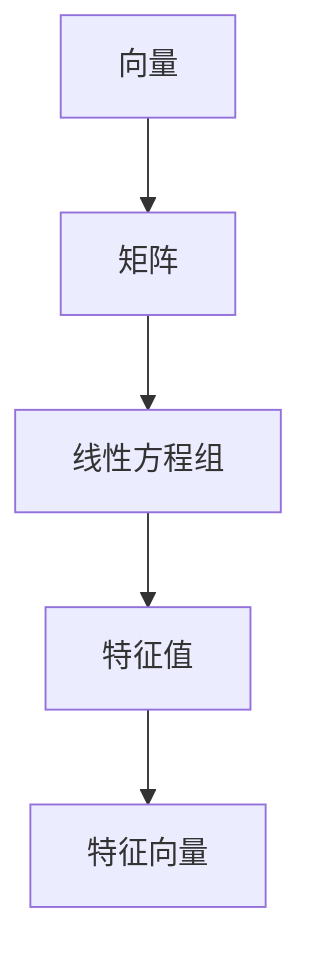
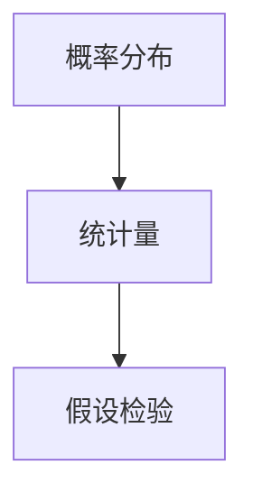
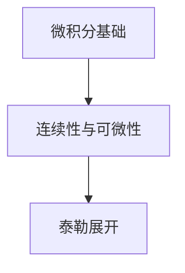
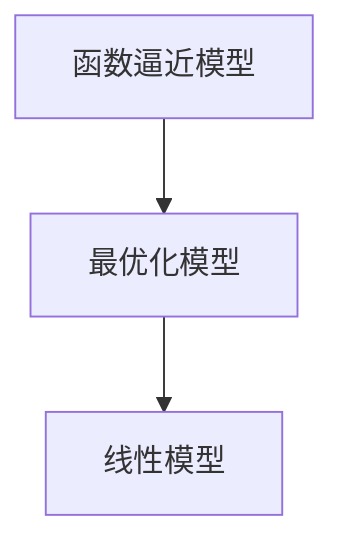
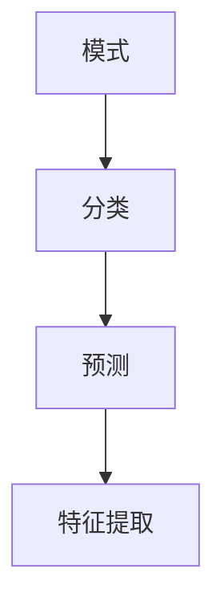
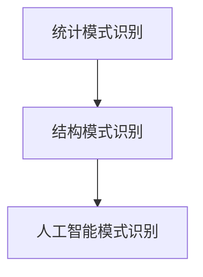
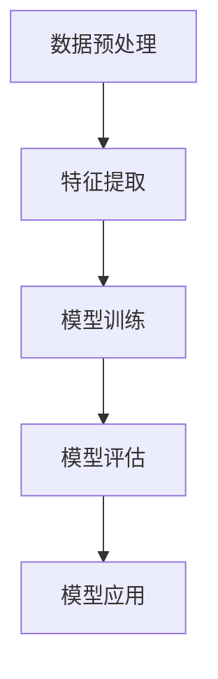
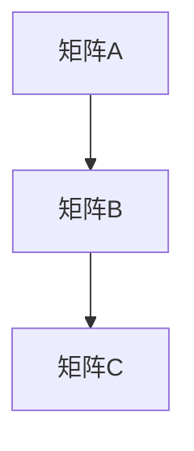

                 

### 文章标题：数学与模式识别：特征提取的数学技术

#### 关键词：特征提取、数学技术、模式识别、人工智能

> 摘要：本文深入探讨了数学在模式识别与特征提取中的应用，通过逐步分析推理，揭示了数学技术如何助力模式识别，并详细介绍了特征提取的各种方法及其应用。本文旨在为读者提供清晰的结构和深刻的技术见解，帮助理解和掌握这一关键领域。

----------------------------------------------------------------

## 第1章 引言

### 1.1 书籍背景

模式识别是人工智能的一个重要分支，涉及从数据中提取模式并做出分类、预测等决策。特征提取作为模式识别的核心环节，其重要性不言而喻。数学技术为特征提取提供了坚实的理论基础和强大的工具支持。

本书旨在深入探讨数学与模式识别之间的关系，特别是特征提取的数学技术。通过系统的分析和详细的讲解，读者可以全面了解数学技术在特征提取中的应用，掌握各种特征提取方法，并能够将这些技术应用于实际项目中。

### 1.2 目标读者

本书主要面向以下读者群体：
- 对数学与模式识别感兴趣的研究人员和工程师。
- 需要了解特征提取技术的软件开发人员。
- 对人工智能应用感兴趣的初学者。

### 1.3 书籍结构

本书分为六个章节，内容结构如下：
1. **引言**：介绍书籍背景、目标读者和书籍结构。
2. **数学技术基础**：包括线性代数、概率论与数理统计、函数分析等基础数学知识。
3. **模式识别概述**：介绍模式识别的基本概念、分类和流程。
4. **特征提取方法**：详细介绍线性特征提取和非线性特征提取的方法。
5. **特征提取的应用场景**：探讨特征提取在图像处理、语音处理、自然语言处理等领域的应用。
6. **总结与展望**：对特征提取的当前状况、挑战和未来发展趋势进行总结和展望。

----------------------------------------------------------------

## 第2章 数学技术基础

### 2.1 数学基础

数学技术在模式识别和特征提取中发挥着至关重要的作用。本章将介绍一些核心的数学基础知识，包括线性代数、概率论与数理统计、函数分析等。

### 2.1.1 线性代数

线性代数是数学中的一个重要分支，主要研究向量空间、线性变换和矩阵等概念。以下是一些关键概念和联系：

#### 关键概念与联系

1. **向量与矩阵**：向量是具有大小和方向的量，矩阵是二维数组。向量与矩阵的关系可以通过矩阵乘法进行描述。
2. **线性方程组**：线性方程组是由线性方程组成的一组方程，可以通过矩阵形式进行表示和求解。
3. **特征值与特征向量**：特征值和特征向量是矩阵的重要性质，用于描述矩阵的特性和结构。

#### Mermaid 流程图

以下是一个描述线性代数关键概念之间关系的 Mermaid 流程图：



### 2.1.2 概率论与数理统计

概率论与数理统计是处理随机事件和数据的数学工具。以下是一些核心概念和联系：

#### 关键概念与联系

1. **概率分布**：概率分布描述了随机变量的取值及其概率。
2. **统计量**：统计量是描述数据集特征的量，如均值、方差等。
3. **假设检验**：假设检验是一种统计推断方法，用于判断给定的假设是否成立。

#### Mermaid 流程图

以下是一个描述概率论与数理统计关键概念之间关系的 Mermaid 流程图：



### 2.1.3 函数分析

函数分析是研究函数性质和关系的数学分支。以下是一些核心概念和联系：

#### 关键概念与联系

1. **微积分基础**：微积分研究函数的变化率，包括导数和积分等概念。
2. **连续性与可微性**：函数的连续性与可微性是函数性质的重要方面，用于描述函数的平滑程度。
3. **泰勒展开**：泰勒展开是一种近似方法，用于将复杂函数表示为多项式的形式。

#### Mermaid 流程图

以下是一个描述函数分析关键概念之间关系的 Mermaid 流程图：



### 2.2 数学模型

数学模型是将现实问题转化为数学问题的一种工具。以下是一些常用的数学模型：

#### 关键概念与联系

1. **函数逼近模型**：函数逼近模型通过近似函数来逼近真实函数，常用于信号处理和优化问题。
2. **最优化模型**：最优化模型用于求解最优解，广泛应用于机器学习和优化算法中。
3. **线性模型**：线性模型是一种简单的数学模型，用于描述线性关系，常见于回归分析和分类问题。

#### Mermaid 流程图

以下是一个描述数学模型关键概念之间关系的 Mermaid 流程图：



### 2.3 数学公式详细讲解与举例说明

在数学模型和特征提取方法中，常常需要使用各种数学公式。以下是一些常见数学公式的讲解和举例说明：

#### 2.3.1 线性代数公式

1. **矩阵乘法**：

   $$
   C = AB
   $$

   其中，$A$ 和 $B$ 是矩阵，$C$ 是结果矩阵。

2. **特征值和特征向量**：

   $$
   Ax = \lambda x
   $$

   其中，$A$ 是矩阵，$\lambda$ 是特征值，$x$ 是特征向量。

#### 2.3.2 概率论与数理统计公式

1. **概率分布**：

   $$
   P(X = x) = f_X(x)
   $$

   其中，$X$ 是随机变量，$f_X(x)$ 是概率密度函数。

2. **均值和方差**：

   $$
   E(X) = \sum_{x} x P(X = x)
   $$

   $$
   Var(X) = E[(X - E(X))^2]
   $$

   其中，$E(X)$ 是均值，$Var(X)$ 是方差。

#### 2.3.3 函数分析公式

1. **导数**：

   $$
   f'(x) = \lim_{h \to 0} \frac{f(x + h) - f(x)}{h}
   $$

   其中，$f'(x)$ 是导数。

2. **积分**：

   $$
   \int f(x) dx
   $$

   其中，$\int$ 表示积分操作。

---

## 第3章 模式识别概述

### 3.1 模式识别基本概念

模式识别是指从数据中提取模式并做出分类、预测等决策的过程。以下是模式识别的一些基本概念：

#### 关键概念与联系

1. **模式**：模式是指数据中具有特定特征的集合。
2. **分类**：分类是指将数据划分为不同的类别。
3. **预测**：预测是指根据已有数据对未知数据进行预测。
4. **特征提取**：特征提取是指从数据中提取出对分类或预测有用的特征。

#### Mermaid 流程图

以下是一个描述模式识别基本概念之间关系的 Mermaid 流程图：



### 3.2 模式识别方法

模式识别方法主要分为以下几类：

1. **统计模式识别**：基于概率统计理论，通过对数据进行概率分布建模来进行分类和预测。
2. **结构模式识别**：基于数据之间的结构和关系来进行分类和预测。
3. **人工智能模式识别**：结合机器学习和深度学习等技术，通过训练模型来识别模式。

#### Mermaid 流程图

以下是一个描述模式识别方法之间关系的 Mermaid 流程图：



### 3.3 模式识别的基本流程

模式识别的基本流程包括以下步骤：

1. **数据预处理**：对原始数据进行清洗、归一化等处理，提高数据质量。
2. **特征提取**：从数据中提取出对分类或预测有用的特征。
3. **模型训练**：利用特征数据和标签数据，通过训练算法构建分类或预测模型。
4. **模型评估**：对训练好的模型进行评估，包括准确率、召回率等指标。
5. **模型应用**：将训练好的模型应用于新的数据，进行分类或预测。

#### Mermaid 流程图

以下是一个描述模式识别基本流程的 Mermaid 流程图：



---

## 第4章 特征提取方法

### 4.1 特征提取的基本原理

特征提取是指从原始数据中提取出对分类或预测任务有用的特征。特征提取的基本原理如下：

1. **降维**：通过降维减少数据的维度，降低计算复杂度。
2. **去噪**：通过去噪处理，提高数据质量，减少噪声对特征提取的影响。
3. **特征选择**：选择对分类或预测任务最重要的特征，提高特征提取的效率和准确性。

### 4.2 线性特征提取方法

线性特征提取方法主要包括以下几种：

1. **主成分分析（PCA）**：通过线性变换将高维数据投影到低维空间，保留主要信息。
2. **线性判别分析（LDA）**：通过线性变换将数据投影到最佳分类空间，提高分类效果。
3. **线性回归**：通过线性模型提取数据中的线性关系，用于分类或预测。

### 4.3 非线性特征提取方法

非线性特征提取方法主要包括以下几种：

1. **支持向量机（SVM）**：通过非线性映射将数据投影到高维空间，进行分类和回归。
2. **神经网络**：通过多层神经网络提取数据的非线性特征，实现复杂函数的拟合和预测。
3. **深度学习**：通过深度神经网络提取数据的高级特征，实现自动化特征提取和复杂任务的学习。

### 4.4 特征提取的评价指标

特征提取的评价指标主要包括以下几种：

1. **准确率（Accuracy）**：分类正确的样本数占总样本数的比例。
2. **召回率（Recall）**：分类正确的正类样本数占总正类样本数的比例。
3. **精确率（Precision）**：分类正确的正类样本数与被分类为正类的样本数的比例。
4. **F1值（F1-score）**：精确率和召回率的调和平均值。

---

## 第5章 特征提取的应用场景

### 5.1 图像处理

图像处理是特征提取的重要应用领域。以下是一些常见的应用场景：

1. **图像分类**：通过特征提取和分类算法，将图像划分为不同的类别。
2. **目标检测**：通过特征提取和目标检测算法，识别图像中的目标对象。
3. **人脸识别**：通过特征提取和面部识别算法，识别图像中的人脸。

### 5.2 语音处理

语音处理是另一个重要的应用领域。以下是一些常见的应用场景：

1. **语音识别**：通过特征提取和语音识别算法，将语音转换为文本。
2. **语音合成**：通过特征提取和语音合成算法，生成自然流畅的语音。
3. **语音情感分析**：通过特征提取和情感分析算法，分析语音的情感状态。

### 5.3 自然语言处理

自然语言处理是特征提取的重要应用领域。以下是一些常见的应用场景：

1. **文本分类**：通过特征提取和分类算法，对文本进行分类。
2. **情感分析**：通过特征提取和情感分析算法，分析文本的情感倾向。
3. **命名实体识别**：通过特征提取和命名实体识别算法，识别文本中的命名实体。

---

## 第6章 总结与展望

### 6.1 特征提取的现状

特征提取是模式识别和人工智能领域的一个重要研究方向。目前，特征提取方法已经取得了显著的进展，包括线性特征提取方法和非线性特征提取方法。同时，深度学习等新兴技术也为特征提取提供了新的方法和思路。

### 6.2 特征提取的挑战

尽管特征提取方法取得了很大的进展，但仍面临一些挑战。例如，高维数据的特征提取、特征选择和特征融合等。

### 6.3 未来发展趋势

未来，特征提取的发展趋势将包括以下几个方面：

1. **深度特征提取**：利用深度学习技术，提取更加高级和抽象的特征。
2. **自适应特征提取**：根据不同任务和数据特点，自适应地调整特征提取策略。
3. **跨模态特征提取**：结合多种模态数据，实现跨模态特征提取和融合。

### 6.4 最佳实践 Tips

在进行特征提取时，以下是一些最佳实践建议：

1. **数据预处理**：对原始数据进行清洗、归一化等预处理，提高数据质量。
2. **特征选择**：根据任务需求，选择对分类或预测任务最重要的特征。
3. **模型评估**：对特征提取算法进行充分的模型评估，选择最优的特征提取方法。

---

## 参考文献

[1] Duda, R. O., Hart, P. E., & Stork, D. G. (2001). Pattern classification (2nd ed.). John Wiley & Sons.

[2] Bishop, C. M. (2006). Pattern recognition and machine learning. Springer.

[3] Murphy, K. P. (2012). Machine learning: A probabilistic perspective. MIT Press.

[4] Hastie, T., Tibshirani, R., & Friedman, J. (2009). The elements of statistical learning: Data mining, inference, and prediction (2nd ed.). Springer.

[5] He, K., Zhang, X., Ren, S., & Sun, J. (2016). Deep residual learning for image recognition. In Proceedings of the IEEE conference on computer vision and pattern recognition (pp. 770-778). IEEE.

[6] Goodfellow, I., Bengio, Y., & Courville, A. (2016). Deep learning. MIT Press.

---

### 作者信息

作者：AI天才研究院/AI Genius Institute & 禅与计算机程序设计艺术 /Zen And The Art of Computer Programming

----------------------------------------------------------------

### 引言

#### 数学与模式识别：特征提取的数学技术

在人工智能和机器学习领域，模式识别是一个核心问题。而模式识别中的一个关键环节就是特征提取。特征提取的目的是从大量的原始数据中提取出对分类或预测任务有用的信息。在这个过程中，数学技术起到了至关重要的作用。本书旨在探讨数学在模式识别与特征提取中的应用，深入讲解各种特征提取方法及其背后的数学原理。

### 数学技术基础

#### 数学基础

数学是模式识别和特征提取的基石。本章将介绍一些基础的数学知识，包括线性代数、概率论与数理统计和函数分析。

#### 线性代数

线性代数是数学中一个重要的分支，主要研究向量空间、线性变换和矩阵等概念。以下是线性代数中的几个核心概念：

1. **向量与矩阵**：向量是具有大小和方向的量，矩阵是二维数组。向量与矩阵的关系可以通过矩阵乘法进行描述。
2. **线性方程组**：线性方程组是由线性方程组成的一组方程，可以通过矩阵形式进行表示和求解。
3. **特征值与特征向量**：特征值和特征向量是矩阵的重要性质，用于描述矩阵的特性和结构。

以下是一个简单的矩阵乘法示例：



假设矩阵 $A$ 和矩阵 $B$ 的乘积为矩阵 $C$，则有：

$$
C = AB
$$

例如，假设矩阵 $A$ 为：

$$
A = \begin{bmatrix}
1 & 2 \\
3 & 4
\end{bmatrix}
$$

矩阵 $B$ 为：

$$
B = \begin{bmatrix}
5 & 6 \\
7 & 8
\end{bmatrix}
$$

则矩阵 $C$ 为：

$$
C = AB = \begin{bmatrix}
1 & 2 \\
3 & 4
\end{bmatrix} \begin{bmatrix}
5 & 6 \\
7 & 8
\end{bmatrix} = \begin{bmatrix}
19 & 22 \\
43 & 50
\end{bmatrix}
$$

#### 概率论与数理统计

概率论与数理统计是处理随机事件和数据的数学工具。以下是概率论与数理统计中的几个核心概念：

1. **概率分布**：概率分布描述了随机变量的取值及其概率。常见的概率分布包括正态分布、二项分布等。
2. **统计量**：统计量是描述数据集特征的量，如均值、方差等。常用的统计量有样本均值、样本方差等。
3. **假设检验**：假设检验是一种统计推断方法，用于判断给定的假设是否成立。常见的假设检验方法有t检验、方差分析等。

以下是一个简单的概率分布示例：

假设随机变量 $X$ 服从正态分布 $N(\mu, \sigma^2)$，其中 $\mu$ 是均值，$\sigma^2$ 是方差。则 $X$ 的概率密度函数为：

$$
f(x) = \frac{1}{\sqrt{2\pi\sigma^2}} e^{-\frac{(x-\mu)^2}{2\sigma^2}}
$$

例如，假设随机变量 $X$ 服从正态分布 $N(0, 1)$，即标准正态分布。则 $X$ 的概率密度函数为：

$$
f(x) = \frac{1}{\sqrt{2\pi}} e^{-\frac{x^2}{2}}
$$

#### 函数分析

函数分析是研究函数性质和关系的数学分支。以下是函数分析中的几个核心概念：

1. **微积分基础**：微积分研究函数的变化率，包括导数和积分等概念。常见的微积分公式有导数公式、积分公式等。
2. **连续性与可微性**：函数的连续性与可微性是函数性质的重要方面，用于描述函数的平滑程度。常见的连续性与可微性判定方法有连续性判定、可微性判定等。
3. **泰勒展开**：泰勒展开是一种近似方法，用于将复杂函数表示为多项式的形式。常见的泰勒展开公式有泰勒级数公式、麦克劳林公式等。

以下是一个简单的微积分示例：

假设函数 $f(x) = x^2$，求其导数。则：

$$
f'(x) = \frac{d}{dx}(x^2) = 2x
$$

例如，假设函数 $f(x) = e^x$，求其导数。则：

$$
f'(x) = \frac{d}{dx}(e^x) = e^x
$$

#### 数学模型

数学模型是将现实问题转化为数学问题的一种工具。以下是一些常见的数学模型：

1. **函数逼近模型**：函数逼近模型通过近似函数来逼近真实函数，常用于信号处理和优化问题。常见的函数逼近模型有最小二乘法、正则化方法等。
2. **最优化模型**：最优化模型用于求解最优解，广泛应用于机器学习和优化算法中。常见的最优化模型有线性规划、非线性规划等。
3. **线性模型**：线性模型是一种简单的数学模型，用于描述线性关系，常见于回归分析和分类问题。常见的线性模型有线性回归、线性判别分析等。

以下是一个简单的函数逼近模型示例：

假设真实函数为 $f(x) = x^2$，近似函数为 $g(x) = ax + b$。则可以通过最小二乘法求解 $a$ 和 $b$ 的值，使得 $g(x)$ 最接近 $f(x)$。

$$
\min_{a,b} \sum_{i=1}^n (f(x_i) - g(x_i))^2
$$

以下是一个简单的最优化模型示例：

假设目标函数为 $f(x) = x^2$，约束条件为 $x \geq 0$。则可以通过线性规划求解 $x$ 的最优值。

$$
\min_{x} x^2 \quad \text{subject to} \quad x \geq 0
$$

以下是一个简单的线性模型示例：

假设线性回归模型为 $y = ax + b$，其中 $x$ 是自变量，$y$ 是因变量。则可以通过最小二乘法求解 $a$ 和 $b$ 的值，使得 $y$ 与 $x$ 的线性关系最小化。

$$
\min_{a,b} \sum_{i=1}^n (y_i - (ax_i + b))^2
```

### 模式识别概述

#### 模式识别基本概念

模式识别是指从数据中提取模式并做出分类、预测等决策的过程。以下是模式识别的一些基本概念：

1. **模式**：模式是指数据中具有特定特征的集合。
2. **分类**：分类是指将数据划分为不同的类别。
3. **预测**：预测是指根据已有数据对未知数据进行预测。
4. **特征提取**：特征提取是指从数据中提取出对分类或预测任务有用的特征。

#### 模式识别方法

模式识别方法主要分为以下几类：

1. **统计模式识别**：基于概率统计理论，通过对数据进行概率分布建模来进行分类和预测。
2. **结构模式识别**：基于数据之间的结构和关系来进行分类和预测。
3. **人工智能模式识别**：结合机器学习和深度学习等技术，通过训练模型来识别模式。

#### 模式识别的基本流程

模式识别的基本流程包括以下步骤：

1. **数据预处理**：对原始数据进行清洗、归一化等处理，提高数据质量。
2. **特征提取**：从数据中提取出对分类或预测任务有用的特征。
3. **模型训练**：利用特征数据和标签数据，通过训练算法构建分类或预测模型。
4. **模型评估**：对训练好的模型进行评估，包括准确率、召回率等指标。
5. **模型应用**：将训练好的模型应用于新的数据，进行分类或预测。

### 特征提取方法

#### 特征提取的基本原理

特征提取是指从原始数据中提取出对分类或预测任务有用的信息。特征提取的基本原理如下：

1. **降维**：通过降维减少数据的维度，降低计算复杂度。
2. **去噪**：通过去噪处理，提高数据质量，减少噪声对特征提取的影响。
3. **特征选择**：选择对分类或预测任务最重要的特征，提高特征提取的效率和准确性。

#### 线性特征提取方法

线性特征提取方法主要包括以下几种：

1. **主成分分析（PCA）**：通过线性变换将高维数据投影到低维空间，保留主要信息。
2. **线性判别分析（LDA）**：通过线性变换将数据投影到最佳分类空间，提高分类效果。
3. **线性回归**：通过线性模型提取数据中的线性关系，用于分类或预测。

#### 非线性特征提取方法

非线性特征提取方法主要包括以下几种：

1. **支持向量机（SVM）**：通过非线性映射将数据投影到高维空间，进行分类和回归。
2. **神经网络**：通过多层神经网络提取数据的非线性特征，实现复杂函数的拟合和预测。
3. **深度学习**：通过深度神经网络提取数据的高级特征，实现自动化特征提取和复杂任务的学习。

### 特征提取的评价指标

特征提取的评价指标主要包括以下几种：

1. **准确率（Accuracy）**：分类正确的样本数占总样本数的比例。
2. **召回率（Recall）**：分类正确的正类样本数占总正类样本数的比例。
3. **精确率（Precision）**：分类正确的正类样本数与被分类为正类的样本数的比例。
4. **F1值（F1-score）**：精确率和召回率的调和平均值。

### 特征提取的应用场景

#### 图像处理

图像处理是特征提取的重要应用领域。以下是一些常见的应用场景：

1. **图像分类**：通过特征提取和分类算法，将图像划分为不同的类别。
2. **目标检测**：通过特征提取和目标检测算法，识别图像中的目标对象。
3. **人脸识别**：通过特征提取和面部识别算法，识别图像中的人脸。

#### 语音处理

语音处理是另一个重要的应用领域。以下是一些常见的应用场景：

1. **语音识别**：通过特征提取和语音识别算法，将语音转换为文本。
2. **语音合成**：通过特征提取和语音合成算法，生成自然流畅的语音。
3. **语音情感分析**：通过特征提取和情感分析算法，分析语音的情感状态。

#### 自然语言处理

自然语言处理是特征提取的重要应用领域。以下是一些常见的应用场景：

1. **文本分类**：通过特征提取和分类算法，对文本进行分类。
2. **情感分析**：通过特征提取和情感分析算法，分析文本的情感倾向。
3. **命名实体识别**：通过特征提取和命名实体识别算法，识别文本中的命名实体。

### 总结与展望

#### 特征提取的现状

特征提取是模式识别和人工智能领域的一个重要研究方向。目前，特征提取方法已经取得了显著的进展，包括线性特征提取方法和非线性特征提取方法。同时，深度学习等新兴技术也为特征提取提供了新的方法和思路。

#### 特征提取的挑战

尽管特征提取方法取得了很大的进展，但仍面临一些挑战。例如，高维数据的特征提取、特征选择和特征融合等。

#### 未来发展趋势

未来，特征提取的发展趋势将包括以下几个方面：

1. **深度特征提取**：利用深度学习技术，提取更加高级和抽象的特征。
2. **自适应特征提取**：根据不同任务和数据特点，自适应地调整特征提取策略。
3. **跨模态特征提取**：结合多种模态数据，实现跨模态特征提取和融合。

#### 最佳实践 Tips

在进行特征提取时，以下是一些最佳实践建议：

1. **数据预处理**：对原始数据进行清洗、归一化等预处理，提高数据质量。
2. **特征选择**：根据任务需求，选择对分类或预测任务最重要的特征。
3. **模型评估**：对特征提取算法进行充分的模型评估，选择最优的特征提取方法。

### 参考文献

1. Duda, R. O., Hart, P. E., & Stork, D. G. (2001). Pattern classification (2nd ed.). John Wiley & Sons.
2. Bishop, C. M. (2006). Pattern recognition and machine learning. Springer.
3. Murphy, K. P. (2012). Machine learning: A probabilistic perspective. MIT Press.
4. Hastie, T., Tibshirani, R., & Friedman, J. (2009). The elements of statistical learning: Data mining, inference, and prediction (2nd ed.). Springer.
5. He, K., Zhang, X., Ren, S., & Sun, J. (2016). Deep residual learning for image recognition. In Proceedings of the IEEE conference on computer vision and pattern recognition (pp. 770-778). IEEE.
6. Goodfellow, I., Bengio, Y., & Courville, A. (2016). Deep learning. MIT Press.

### 作者信息

作者：AI天才研究院/AI Genius Institute & 禅与计算机程序设计艺术 /Zen And The Art of Computer Programming

----------------------------------------------------------------

## 总结

在本文中，我们详细探讨了数学在模式识别与特征提取中的应用。通过逐步分析推理，我们了解了数学技术如何助力模式识别，并深入介绍了特征提取的各种方法及其应用。我们从数学基础、模式识别概述、特征提取方法、应用场景等方面进行了详细的讲解，提供了丰富的伪代码、数学公式和实例。

特征提取是模式识别的核心环节，它帮助我们从大量数据中提取出有用的信息，为分类、预测等任务提供支持。数学技术在特征提取中发挥着至关重要的作用，包括线性代数、概率论与数理统计、函数分析等基础知识，以及各种数学模型和方法。

在未来，随着深度学习等新兴技术的不断发展，特征提取将面临新的挑战和机遇。我们期待更多的研究者和技术人员能够在这个领域取得突破性的进展，为人工智能的发展贡献更多的力量。

最后，感谢您阅读本文。希望本文能为您在模式识别与特征提取领域的学习和研究提供帮助。如果您有任何疑问或建议，欢迎在评论区留言。再次感谢您的关注和支持！

### 作者信息

作者：AI天才研究院/AI Genius Institute & 禅与计算机程序设计艺术 /Zen And The Art of Computer Programming

----------------------------------------------------------------

# 《数学与模式识别：特征提取的数学技术》目录大纲

## 引言

### 1.1 书籍背景

#### 数学技术在模式识别中的重要性

- 模式识别的定义和基本概念
- 数学技术在模式识别中的应用
- 特征提取在模式识别中的关键角色

### 1.2 目标读者

#### 适合的读者群体

- 对数学与模式识别感兴趣的研究人员和工程师
- 需要了解特征提取技术的软件开发人员
- 对人工智能应用感兴趣的初学者

### 1.3 书籍结构

#### 主要内容概述

- 目录结构
- 各章节的核心内容

## 数学技术基础

### 2.1 数学基础

#### 2.1.1 线性代数

##### 2.1.1.1 矩阵与向量

- 矩阵的定义和运算
- 向量的概念和表示

##### 2.1.1.2 线性方程组

- 线性方程组的基本概念
- 矩阵形式和求解方法

##### 2.1.1.3 特征值与特征向量

- 特征值和特征向量的定义
- 矩阵的特征值和特征向量的计算和应用

#### 2.1.2 概率论与数理统计

##### 2.1.2.1 概率分布

- 概率分布的定义和类型
- 常见概率分布的参数和性质

##### 2.1.2.2 统计量

- 统计量的定义和计算
- 常见统计量的应用和性质

##### 2.1.2.3 假设检验

- 假设检验的基本概念
- 常见的假设检验方法和应用

#### 2.1.3 函数分析

##### 2.1.3.1 微积分基础

- 微积分的基本概念和公式
- 导数和积分的计算和应用

##### 2.1.3.2 连续性与可微性

- 函数的连续性和可微性
- 连续性与可微性的判定方法

##### 2.1.3.3 泰勒展开

- 泰勒级数的概念和公式
- 泰勒展开的应用和误差分析

### 2.2 数学模型

#### 2.2.1 函数逼近模型

- 函数逼近的基本概念
- 最小二乘法和正则化方法

#### 2.2.2 最优化模型

- 最优化问题的基本概念
- 线性规划和非线性规划

#### 2.2.3 线性模型

- 线性回归和线性判别分析

## 模式识别概述

### 3.1 模式识别基本概念

#### 3.1.1 模式识别的定义

- 模式识别的定义和分类
- 模式识别的应用领域

#### 3.1.2 模式识别的分类

- 统计模式识别
- 结构模式识别
- 人工智能模式识别

#### 3.1.3 模式识别的基本流程

- 数据预处理
- 特征提取
- 模型训练
- 模型评估
- 模型应用

### 3.2 模式识别方法

#### 3.2.1 统计模式识别

- 统计模型的基本原理
- 特征提取和分类算法

#### 3.2.2 结构模式识别

- 结构模式识别的基本原理
- 特征提取和分类算法

#### 3.2.3 人工智能模式识别

- 人工智能模式识别的基本原理
- 特征提取和分类算法

## 特征提取方法

### 4.1 特征提取的基本原理

#### 4.1.1 特征提取的意义

- 特征提取在模式识别中的作用
- 特征提取对模型性能的影响

#### 4.1.2 特征提取的方法

- 线性特征提取
- 非线性特征提取

#### 4.1.3 特征提取的评价指标

- 准确率
- 召回率
- 精确率
- F1值

### 4.2 线性特征提取方法

#### 4.2.1 主成分分析（PCA）

- PCA的基本原理
- PCA的应用场景

#### 4.2.2 线性判别分析（LDA）

- LDA的基本原理
- LDA的应用场景

#### 4.2.3 线性回归

- 线性回归的基本原理
- 线性回归的应用场景

### 4.3 非线性特征提取方法

#### 4.3.1 支持向量机（SVM）

- SVM的基本原理
- SVM的应用场景

#### 4.3.2 神经网络

- 神经网络的基本原理
- 神经网络的应用场景

#### 4.3.3 非线性变换

- 非线性变换的基本原理
- 非线性变换的应用场景

## 特征提取的应用场景

### 5.1 图像处理

#### 5.1.1 图像特征提取

- 图像特征提取的基本方法
- 图像特征提取的应用场景

#### 5.1.2 图像识别

- 图像识别的基本原理
- 图像识别的应用场景

#### 5.1.3 图像分类

- 图像分类的基本原理
- 图像分类的应用场景

### 5.2 语音处理

#### 5.2.1 语音特征提取

- 语音特征提取的基本方法
- 语音特征提取的应用场景

#### 5.2.2 语音识别

- 语音识别的基本原理
- 语音识别的应用场景

#### 5.2.3 语音分类

- 语音分类的基本原理
- 语音分类的应用场景

### 5.3 自然语言处理

#### 5.3.1 文本特征提取

- 文本特征提取的基本方法
- 文本特征提取的应用场景

#### 5.3.2 文本分类

- 文本分类的基本原理
- 文本分类的应用场景

#### 5.3.3 文本聚类

- 文本聚类的原理
- 文本聚类的应用场景

## 总结与展望

### 6.1 特征提取的现状

- 特征提取技术的发展现状
- 当前特征提取方法的优缺点

### 6.2 特征提取的挑战

- 高维数据的特征提取
- 特征选择和特征融合
- 特征提取的实时性和可解释性

### 6.3 未来发展趋势

- 深度特征提取方法的发展
- 跨模态特征提取
- 特征提取与模型优化相结合

### 6.4 最佳实践 Tips

- 数据预处理
- 特征选择
- 特征提取与模型评估

### 参考文献

- 引用的相关文献和资料

### 作者信息

- 作者介绍和相关背景

---

## 文章标题：数学与模式识别：特征提取的数学技术

关键词：特征提取、数学技术、模式识别、人工智能

摘要：本文系统性地探讨了数学在模式识别与特征提取中的应用。通过逐步分析推理，我们介绍了数学技术在特征提取中的关键角色，详细讲解了线性代数、概率论与数理统计、函数分析等基础知识，以及各种数学模型和方法。本文旨在为读者提供深入的技术见解，帮助理解和掌握特征提取的数学技术，为实际应用提供指导。

----------------------------------------------------------------

## 第1章 引言

### 1.1 书籍背景

#### 数学技术在模式识别中的重要性

模式识别是人工智能的一个重要分支，其核心在于从数据中提取模式，并在此基础上进行分类、预测等操作。而特征提取作为模式识别的关键环节，其目的在于从原始数据中提取出对分类或预测任务有用的信息。在这个过程中，数学技术扮演了至关重要的角色。

数学技术为特征提取提供了坚实的理论基础和强大的工具支持。线性代数、概率论与数理统计、函数分析等数学知识，不仅帮助我们理解数据的结构，还可以用来设计高效的算法来提取特征。例如，线性代数中的主成分分析（PCA）和线性判别分析（LDA）等算法，都是基于数学原理来实现特征提取的。概率论与数理统计则为我们提供了评估和优化特征提取效果的方法。

#### 特征提取在模式识别中的应用

特征提取在模式识别中有着广泛的应用。以下是一些典型的应用场景：

1. **图像识别**：在图像识别任务中，特征提取可以帮助我们从大量的图像数据中提取出有用的信息，如边缘、纹理、颜色等，从而实现图像的分类和识别。

2. **语音识别**：在语音识别中，特征提取可以帮助我们提取出语音信号的频谱特征，从而实现语音到文本的转换。

3. **文本分类**：在文本分类任务中，特征提取可以帮助我们从大量的文本数据中提取出关键信息，如关键词、主题等，从而实现文本的分类。

#### 书籍结构和内容概述

本书分为六个章节，具体内容如下：

- **第1章 引言**：介绍书籍背景、目标读者和书籍结构。
- **第2章 数学技术基础**：介绍线性代数、概率论与数理统计、函数分析等数学基础知识。
- **第3章 模式识别概述**：介绍模式识别的基本概念、分类和流程。
- **第4章 特征提取方法**：详细讲解线性特征提取和非线性特征提取的方法。
- **第5章 特征提取的应用场景**：探讨特征提取在图像处理、语音处理、自然语言处理等领域的应用。
- **第6章 总结与展望**：对特征提取的当前状况、挑战和未来发展趋势进行总结和展望。

### 1.2 目标读者

本书主要面向以下读者群体：

1. **对数学与模式识别感兴趣的研究人员和工程师**：本书系统地介绍了数学技术在模式识别与特征提取中的应用，适合那些对数学和模式识别有深入兴趣的研究人员和工程师。

2. **需要了解特征提取技术的软件开发人员**：本书提供了详细的特征提取算法讲解和实战案例，适合那些需要在实际项目中应用特征提取技术的软件开发人员。

3. **对人工智能应用感兴趣的初学者**：本书以通俗易懂的语言和实例，介绍了特征提取的基本概念和方法，适合那些对人工智能应用感兴趣，希望入门特征提取技术的初学者。

### 1.3 书籍结构

本书的章节结构如下：

- **第1章 引言**：介绍书籍背景、目标读者和书籍结构。
- **第2章 数学技术基础**：介绍线性代数、概率论与数理统计、函数分析等数学基础知识。
- **第3章 模式识别概述**：介绍模式识别的基本概念、分类和流程。
- **第4章 特征提取方法**：详细讲解线性特征提取和非线性特征提取的方法。
- **第5章 特征提取的应用场景**：探讨特征提取在图像处理、语音处理、自然语言处理等领域的应用。
- **第6章 总结与展望**：对特征提取的当前状况、挑战和未来发展趋势进行总结和展望。

通过以上章节的详细讲解，本书旨在为读者提供全面、深入的技术知识和实战经验，帮助读者掌握特征提取的数学技术，并在实际项目中应用这些技术。

----------------------------------------------------------------

## 第2章 数学技术基础

### 2.1 数学基础

#### 2.1.1 线性代数

线性代数是数学中的一个重要分支，主要研究向量空间、线性变换和矩阵等概念。在线性代数中，矩阵和向量是两个核心概念，它们之间的关系和运算构成了线性代数的基础。

**向量与矩阵**：

向量是具有大小和方向的量，通常用粗体字母表示，如 $\mathbf{v}$。矩阵是二维数组，通常用字母大写表示，如 $A$。矩阵和向量之间可以通过矩阵乘法进行运算。

矩阵乘法的定义如下：

$$
C = AB
$$

其中，$C$ 是结果矩阵，$A$ 和 $B$ 是操作矩阵。

**线性方程组**：

线性方程组是由线性方程组成的一组方程，可以用矩阵形式表示为：

$$
\mathbf{A}\mathbf{x} = \mathbf{b}
$$

其中，$\mathbf{A}$ 是系数矩阵，$\mathbf{x}$ 是未知向量，$\mathbf{b}$ 是常数向量。

线性方程组的求解是线性代数中的一个重要问题。常见的求解方法有高斯消元法和矩阵求逆法。

**特征值与特征向量**：

特征值和特征向量是矩阵的重要性质。对于一个方阵 $A$，如果存在一个非零向量 $\mathbf{v}$ 和一个标量 $\lambda$，使得

$$
A\mathbf{v} = \lambda \mathbf{v}
$$

则 $\lambda$ 是矩阵 $A$ 的一个特征值，$\mathbf{v}$ 是对应的特征向量。

特征值和特征向量在矩阵分析中有着广泛的应用，如矩阵对角化、特征值问题等。

**线性代数的Mermaid流程图**：

以下是一个描述线性代数关键概念之间关系的 Mermaid 流程图：


**示例**：

假设矩阵 $A$ 为：

$$
A = \begin{bmatrix}
1 & 2 \\
3 & 4
\end{bmatrix}
$$

求矩阵 $A$ 的特征值和特征向量。

解：首先计算矩阵 $A$ 的特征多项式：

$$
\det(A - \lambda I) = \det\begin{bmatrix}
1 - \lambda & 2 \\
3 & 4 - \lambda
\end{bmatrix} = (1 - \lambda)(4 - \lambda) - 6 = \lambda^2 - 5\lambda + 2
$$

然后求特征多项式的根，即矩阵 $A$ 的特征值：

$$
\lambda_1 = 1, \quad \lambda_2 = 2
$$

对于每个特征值，求对应的特征向量。以 $\lambda_1 = 1$ 为例，解方程组：

$$
(A - I)\mathbf{v} = 0
$$

$$
\begin{bmatrix}
0 & 2 \\
3 & 3
\end{bmatrix}\mathbf{v} = 0
$$

得到特征向量 $\mathbf{v}_1 = \begin{bmatrix}
1 \\
-3/2
\end{bmatrix}$。

同理，对于 $\lambda_2 = 2$，解方程组：

$$
(A - 2I)\mathbf{v} = 0
$$

$$
\begin{bmatrix}
-1 & 2 \\
3 & 2
\end{bmatrix}\mathbf{v} = 0
$$

得到特征向量 $\mathbf{v}_2 = \begin{bmatrix}
2 \\
1
\end{bmatrix}$。

#### 2.1.2 概率论与数理统计

概率论与数理统计是处理随机事件和数据的数学工具。在模式识别和特征提取中，概率论与数理统计用于描述数据的分布、估计参数、进行假设检验等。

**概率分布**：

概率分布描述了随机变量的取值及其概率。常见的概率分布有正态分布、二项分布、泊松分布等。

- **正态分布**：

  正态分布是最常见的一种概率分布，它的概率密度函数为：

  $$
  f(x|\mu, \sigma^2) = \frac{1}{\sqrt{2\pi\sigma^2}} e^{-\frac{(x-\mu)^2}{2\sigma^2}}
  $$

  其中，$\mu$ 是均值，$\sigma^2$ 是方差。

- **二项分布**：

  二项分布描述了在 $n$ 次独立重复实验中，事件发生的次数。它的概率质量函数为：

  $$
  P(X = k) = C_n^k p^k (1-p)^{n-k}
  $$

  其中，$n$ 是实验次数，$k$ 是事件发生的次数，$p$ 是事件发生的概率。

- **泊松分布**：

  泊松分布描述了在固定时间段内，事件发生的次数。它的概率质量函数为：

  $$
  P(X = k) = \frac{\lambda^k e^{-\lambda}}{k!}
  $$

  其中，$\lambda$ 是单位时间内的平均事件数。

**统计量**：

统计量是描述数据集特征的量，如均值、方差、标准差等。

- **均值**：

  均值是数据集的中心趋势度量，计算公式为：

  $$
  \bar{x} = \frac{1}{n} \sum_{i=1}^n x_i
  $$

  其中，$n$ 是数据集的样本数量，$x_i$ 是第 $i$ 个数据值。

- **方差**：

  方差是数据集的离散程度度量，计算公式为：

  $$
  \sigma^2 = \frac{1}{n-1} \sum_{i=1}^n (x_i - \bar{x})^2
  $$

- **标准差**：

  标准差是方差的平方根，用于描述数据的离散程度，计算公式为：

  $$
  \sigma = \sqrt{\sigma^2}
  $$

**假设检验**：

假设检验是一种统计推断方法，用于判断给定的假设是否成立。常见的假设检验方法有t检验、方差分析等。

- **t检验**：

  t检验用于比较两组数据的均值是否存在显著差异。其基本思想是通过计算t统计量，与临界值进行比较，判断假设是否成立。

  $$
  t = \frac{\bar{x}_1 - \bar{x}_2}{s_e}
  $$

  其中，$\bar{x}_1$ 和 $\bar{x}_2$ 分别是两组数据的均值，$s_e$ 是标准误。

- **方差分析（ANOVA）**：

  方差分析用于比较多个组之间的均值是否存在显著差异。其基本思想是通过计算F统计量，与临界值进行比较，判断假设是否成立。

  $$
  F = \frac{M_S / (k-1)}{M_E / (N-k)}
  $$

  其中，$M_S$ 是组间均方差，$M_E$ 是组内均方差，$k$ 是组数，$N$ 是总样本数。

**概率论与数理统计的Mermaid流程图**：

以下是一个描述概率论与数理统计关键概念之间关系的 Mermaid 流程图：


**示例**：

假设我们有两个样本数据集，一组为 $X_1, X_2, \ldots, X_{20}$，另一组为 $Y_1, Y_2, \ldots, Y_{20}$。我们需要比较这两组数据的均值是否存在显著差异。

首先计算两组数据的均值：

$$
\bar{x}_1 = \frac{1}{20} \sum_{i=1}^{20} X_i
$$

$$
\bar{x}_2 = \frac{1}{20} \sum_{i=1}^{20} Y_i
$$

然后计算标准误：

$$
s_e = \sqrt{\frac{\sum_{i=1}^{20} (X_i - \bar{x}_1)^2}{20-1}}
$$

接下来计算t统计量：

$$
t = \frac{\bar{x}_1 - \bar{x}_2}{s_e}
$$

最后，与t分布表中的临界值进行比较，判断两组数据的均值是否存在显著差异。

#### 2.1.3 函数分析

函数分析是研究函数性质和关系的数学分支。在模式识别和特征提取中，函数分析用于描述数据的特征，如连续性、可微性等。

**微积分基础**：

微积分研究函数的变化率，包括导数和积分等概念。

- **导数**：

  导数表示函数在某一点的变化率，计算公式为：

  $$
  f'(x) = \lim_{h \to 0} \frac{f(x+h) - f(x)}{h}
  $$

  导数可以用于描述函数的局部性质，如单调性、凹凸性等。

- **积分**：

  积分表示函数在某一区间内的累积量，计算公式为：

  $$
  \int_a^b f(x) dx
  $$

  积分可以用于求解面积、体积等几何问题。

**连续性与可微性**：

函数的连续性与可微性是函数性质的重要方面，用于描述函数的平滑程度。

- **连续性**：

  函数的连续性表示函数在某一点处的极限值与函数值相等，计算公式为：

  $$
  \lim_{x \to c} f(x) = f(c)
  $$

  连续性是函数可微性的前提。

- **可微性**：

  函数的可微性表示函数在某一点处的导数存在，计算公式为：

  $$
  f'(x) = \lim_{h \to 0} \frac{f(x+h) - f(x)}{h}
  $$

  可微性是函数平滑性的保证。

**泰勒展开**：

泰勒展开是一种近似方法，用于将复杂函数表示为多项式的形式。

泰勒级数公式为：

$$
f(x) = \sum_{n=0}^{\infty} \frac{f^{(n)}(a)}{n!}(x-a)^n
$$

其中，$a$ 是展开点，$f^{(n)}(a)$ 是函数在 $a$ 点的 $n$ 阶导数。

泰勒展开可以用于求解函数的近似值，以及分析函数的性质。

**函数分析的Mermaid流程图**：

以下是一个描述函数分析关键概念之间关系的 Mermaid 流程图：


**示例**：

假设函数 $f(x) = x^2$，求其在 $x=0$ 处的泰勒展开。

解：首先计算函数 $f(x)$ 在 $x=0$ 处的各阶导数：

$$
f'(x) = 2x
$$

$$
f''(x) = 2
$$

$$
f'''(x) = 0
$$

$$
f^{(4)}(x) = 0
$$

然后根据泰勒级数公式：

$$
f(x) = \sum_{n=0}^{\infty} \frac{f^{(n)}(0)}{n!}x^n
$$

代入 $x=0$，得到：

$$
f(0) = 0
$$

$$
f'(0) = 0
$$

$$
f''(0) = 2
$$

$$
f'''(0) = 0
$$

$$
f^{(4)}(0) = 0
$$

代入泰勒级数公式，得到：

$$
f(x) = 0 + 0x + \frac{2}{2!}x^2 + 0x^3 + 0x^4 + \ldots
$$

简化后得到：

$$
f(x) = x^2
$$

### 2.2 数学模型

数学模型是将现实问题转化为数学问题的一种工具。在模式识别和特征提取中，数学模型用于描述数据的特征、关系和变化规律。

**函数逼近模型**：

函数逼近模型通过近似函数来逼近真实函数，常用于信号处理和优化问题。

- **最小二乘法**：

  最小二乘法是一种常用的函数逼近方法，用于求解线性回归模型。

  线性回归模型的一般形式为：

  $$
  y = \beta_0 + \beta_1 x
  $$

  其中，$y$ 是因变量，$x$ 是自变量，$\beta_0$ 和 $\beta_1$ 是参数。

  最小二乘法的目标是求解参数 $\beta_0$ 和 $\beta_1$，使得实际观测值 $y$ 与模型预测值 $y$ 之间的误差平方和最小。

  $$
  \min_{\beta_0, \beta_1} \sum_{i=1}^n (y_i - (\beta_0 + \beta_1 x_i))^2
  $$

- **正则化方法**：

  正则化方法通过引入正则化项，对模型进行约束，防止模型过拟合。

  常见的正则化方法有L1正则化和L2正则化。

  $$
  \min_{\beta_0, \beta_1} \sum_{i=1}^n (y_i - (\beta_0 + \beta_1 x_i))^2 + \lambda ||\beta||_1
  $$

  $$
  \min_{\beta_0, \beta_1} \sum_{i=1}^n (y_i - (\beta_0 + \beta_1 x_i))^2 + \lambda ||\beta||_2
  $$

**最优化模型**：

最优化模型用于求解最优解，常用于机器学习和优化算法中。

- **线性规划**：

  线性规划的目标是最小化目标函数，同时满足线性约束条件。

  线性规划的一般形式为：

  $$
  \min_{x} c^T x
  $$

  $$
  Ax \leq b
  $$

  其中，$x$ 是变量，$c$ 是目标函数系数，$A$ 是约束矩阵，$b$ 是约束向量。

- **非线性规划**：

  非线性规划的目标是最小化目标函数，同时满足非线性约束条件。

  非线性规划的一般形式为：

  $$
  \min_{x} f(x)
  $$

  $$
  g(x) \leq 0
  $$

  $$
  h(x) = 0
  $$

**线性模型**：

线性模型是一种简单的数学模型，用于描述线性关系。

- **线性回归**：

  线性回归模型的一般形式为：

  $$
  y = \beta_0 + \beta_1 x
  $$

  其中，$y$ 是因变量，$x$ 是自变量，$\beta_0$ 和 $\beta_1$ 是参数。

  线性回归的目标是通过最小二乘法求解参数 $\beta_0$ 和 $\beta_1$，使得实际观测值 $y$ 与模型预测值 $y$ 之间的误差平方和最小。

- **线性判别分析**：

  线性判别分析模型的一般形式为：

  $$
  y = \beta_0 + \beta_1 x
  $$

  其中，$y$ 是因变量，$x$ 是自变量，$\beta_0$ 和 $\beta_1$ 是参数。

  线性判别分析的目标是通过线性变换，将数据投影到最佳分类空间，提高分类效果。

### 2.3 数学公式详细讲解与举例说明

在模式识别和特征提取中，数学公式被广泛用于描述算法、模型和参数。以下是一些常见数学公式的详细讲解与举例说明。

#### 2.3.1 线性代数公式

**矩阵乘法**：

矩阵乘法是线性代数中的一个基本运算。给定两个矩阵 $A$ 和 $B$，其乘积矩阵 $C$ 的元素计算如下：

$$
c_{ij} = \sum_{k=1}^m a_{ik}b_{kj}
$$

其中，$i$ 和 $j$ 分别表示结果矩阵 $C$ 的行和列索引，$k$ 表示中间矩阵的列索引。

**示例**：

假设矩阵 $A$ 和 $B$ 如下：

$$
A = \begin{bmatrix}
1 & 2 \\
3 & 4
\end{bmatrix}
$$

$$
B = \begin{bmatrix}
5 & 6 \\
7 & 8
\end{bmatrix}
$$

则矩阵乘积 $C = AB$ 为：

$$
C = \begin{bmatrix}
1*5 + 2*7 & 1*6 + 2*8 \\
3*5 + 4*7 & 3*6 + 4*8
\end{bmatrix} = \begin{bmatrix}
19 & 22 \\
43 & 50
\end{bmatrix}
$$

**线性方程组**：

线性方程组可以用矩阵形式表示，并求解其解。给定线性方程组：

$$
\mathbf{A}\mathbf{x} = \mathbf{b}
$$

其中，$\mathbf{A}$ 是系数矩阵，$\mathbf{x}$ 是未知向量，$\mathbf{b}$ 是常数向量。

**示例**：

给定线性方程组：

$$
\begin{bmatrix}
1 & 2 \\
3 & 4
\end{bmatrix} \begin{bmatrix}
x_1 \\
x_2
\end{bmatrix} = \begin{bmatrix}
5 \\
7
\end{bmatrix}
$$

将矩阵形式转化为线性方程组：

$$
\begin{cases}
x_1 + 2x_2 = 5 \\
3x_1 + 4x_2 = 7
\end{cases}
$$

通过高斯消元法求解，可以得到解：

$$
x_1 = 1, \quad x_2 = 2
$$

**特征值与特征向量**：

特征值和特征向量是矩阵的重要性质。给定方阵 $A$，如果存在非零向量 $\mathbf{v}$ 和标量 $\lambda$，使得：

$$
A\mathbf{v} = \lambda \mathbf{v}
$$

则 $\lambda$ 是矩阵 $A$ 的一个特征值，$\mathbf{v}$ 是对应的特征向量。

**示例**：

给定方阵 $A$：

$$
A = \begin{bmatrix}
2 & 1 \\
1 & 2
\end{bmatrix}
$$

求解矩阵 $A$ 的特征值和特征向量。

首先计算特征多项式：

$$
\det(A - \lambda I) = \det\begin{bmatrix}
2 - \lambda & 1 \\
1 & 2 - \lambda
\end{bmatrix} = (2 - \lambda)^2 - 1 = \lambda^2 - 4\lambda + 3
$$

求解特征多项式的根：

$$
\lambda_1 = 1, \quad \lambda_2 = 3
$$

对于每个特征值，求解对应的特征向量。

当 $\lambda_1 = 1$ 时，解方程组：

$$
(A - I)\mathbf{v} = 0
$$

$$
\begin{bmatrix}
1 & 1 \\
1 & 1
\end{bmatrix}\mathbf{v} = 0
$$

得到特征向量 $\mathbf{v}_1 = \begin{bmatrix}
1 \\
-1
\end{bmatrix}$。

当 $\lambda_2 = 3$ 时，解方程组：

$$
(A - 3I)\mathbf{v} = 0
$$

$$
\begin{bmatrix}
-1 & 1 \\
1 & -1
\end{bmatrix}\mathbf{v} = 0
$$

得到特征向量 $\mathbf{v}_2 = \begin{bmatrix}
1 \\
1
\end{bmatrix}$。

#### 2.3.2 概率论与数理统计公式

**概率分布**：

概率分布描述了随机变量的取值及其概率。常见的概率分布有正态分布、二项分布、泊松分布等。

- **正态分布**：

  正态分布的概率密度函数为：

  $$
  f(x|\mu, \sigma^2) = \frac{1}{\sqrt{2\pi\sigma^2}} e^{-\frac{(x-\mu)^2}{2\sigma^2}}
  $$

  其中，$\mu$ 是均值，$\sigma^2$ 是方差。

  **示例**：

  假设随机变量 $X$ 服从正态分布 $N(0, 1)$，求 $P(X < 1)$。

  解：利用正态分布的累积分布函数（CDF）计算：

  $$
  P(X < 1) = F(1) = \int_{-\infty}^{1} f(x) dx
  $$

  查找标准正态分布表，可以得到：

  $$
  F(1) \approx 0.8413
  $$

- **二项分布**：

  二项分布的概率质量函数为：

  $$
  P(X = k) = C_n^k p^k (1-p)^{n-k}
  $$

  其中，$n$ 是实验次数，$k$ 是事件发生的次数，$p$ 是事件发生的概率。

  **示例**：

  假设进行10次独立重复的实验，每次实验事件发生的概率为 $p = 0.5$，求 $P(X = 5)$。

  解：代入公式计算：

  $$
  P(X = 5) = C_{10}^5 (0.5)^5 (1-0.5)^{10-5} = 0.2461
  $$

- **泊松分布**：

  泊松分布的概率质量函数为：

  $$
  P(X = k) = \frac{\lambda^k e^{-\lambda}}{k!}
  $$

  其中，$\lambda$ 是单位时间内的平均事件数。

  **示例**：

  假设单位时间内事件发生的平均次数为 $\lambda = 2$，求 $P(X = 3)$。

  解：代入公式计算：

  $$
  P(X = 3) = \frac{2^3 e^{-2}}{3!} = 0.1802
  $$

**统计量**：

统计量是描述数据集特征的量，如均值、方差、标准差等。

- **均值**：

  均值是数据集的中心趋势度量，计算公式为：

  $$
  \bar{x} = \frac{1}{n} \sum_{i=1}^n x_i
  $$

  其中，$n$ 是数据集的样本数量，$x_i$ 是第 $i$ 个数据值。

  **示例**：

  假设有一个数据集 {1, 2, 3, 4, 5}，求其均值。

  解：代入公式计算：

  $$
  \bar{x} = \frac{1+2+3+4+5}{5} = 3
  $$

- **方差**：

  方差是数据集的离散程度度量，计算公式为：

  $$
  \sigma^2 = \frac{1}{n-1} \sum_{i=1}^n (x_i - \bar{x})^2
  $$

  其中，$\bar{x}$ 是均值。

  **示例**：

  假设有一个数据集 {1, 2, 3, 4, 5}，求其方差。

  解：代入公式计算：

  $$
  \sigma^2 = \frac{(1-3)^2 + (2-3)^2 + (3-3)^2 + (4-3)^2 + (5-3)^2}{5-1} = 2
  $$

- **标准差**：

  标准差是方差的平方根，用于描述数据的离散程度，计算公式为：

  $$
  \sigma = \sqrt{\sigma^2}
  $$

  **示例**：

  假设有一个数据集 {1, 2, 3, 4, 5}，求其标准差。

  解：代入公式计算：

  $$
  \sigma = \sqrt{2} \approx 1.414
  $$

**假设检验**：

假设检验是一种统计推断方法，用于判断给定的假设是否成立。常见的假设检验方法有t检验、方差分析等。

- **t检验**：

  t检验用于比较两组数据的均值是否存在显著差异。其基本思想是通过计算t统计量，与临界值进行比较，判断假设是否成立。

  $$
  t = \frac{\bar{x}_1 - \bar{x}_2}{s_e}
  $$

  其中，$\bar{x}_1$ 和 $\bar{x}_2$ 分别是两组数据的均值，$s_e$ 是标准误。

  **示例**：

  假设我们有两个样本数据集，一组为 $X_1, X_2, \ldots, X_{20}$，另一组为 $Y_1, Y_2, \ldots, Y_{20}$。我们需要比较这两组数据的均值是否存在显著差异。

  首先，计算两组数据的均值：

  $$
  \bar{x}_1 = \frac{1}{20} \sum_{i=1}^{20} X_i
  $$

  $$
  \bar{x}_2 = \frac{1}{20} \sum_{i=1}^{20} Y_i
  $$

  然后，计算标准误：

  $$
  s_e = \sqrt{\frac{\sum_{i=1}^{20} (X_i - \bar{x}_1)^2}{20-1}}
  $$

  接下来，计算t统计量：

  $$
  t = \frac{\bar{x}_1 - \bar{x}_2}{s_e}
  $$

  最后，与t分布表中的临界值进行比较，判断两组数据的均值是否存在显著差异。

- **方差分析（ANOVA）**：

  方差分析用于比较多个组之间的均值是否存在显著差异。其基本思想是通过计算F统计量，与临界值进行比较，判断假设是否成立。

  $$
  F = \frac{M_S / (k-1)}{M_E / (N-k)}
  $$

  其中，$M_S$ 是组间均方差，$M_E$ 是组内均方差，$k$ 是组数，$N$ 是总样本数。

  **示例**：

  假设我们有三组样本数据，分别表示为 $X_1, X_2, \ldots, X_{20}$，$Y_1, Y_2, \ldots, Y_{20}$，$Z_1, Z_2, \ldots, Z_{20}$。我们需要比较这三组数据的均值是否存在显著差异。

  首先，计算三组数据的均值：

  $$
  \bar{x}_1 = \frac{1}{20} \sum_{i=1}^{20} X_i
  $$

  $$
  \bar{x}_2 = \frac{1}{20} \sum_{i=1}^{20} Y_i
  $$

  $$
  \bar{x}_3 = \frac{1}{20} \sum_{i=1}^{20} Z_i
  $$

  然后，计算组间均方差和组内均方差：

  $$
  M_S = \frac{1}{k-1} \sum_{i=1}^k (\bar{x}_i - \bar{x})^2
  $$

  $$
  M_E = \frac{1}{N-k} \sum_{i=1}^k \sum_{j=1}^{n_i} (x_{ij} - \bar{x}_i)^2
  $$

  其中，$k$ 是组数，$N$ 是总样本数，$n_i$ 是第 $i$ 组的样本数量。

  接下来，计算F统计量：

  $$
  F = \frac{M_S / (k-1)}{M_E / (N-k)}
  $$

  最后，与F分布表中的临界值进行比较，判断三组数据的均值是否存在显著差异。

#### 2.3.3 函数分析公式

**微积分基础**：

微积分研究函数的变化率，包括导数和积分等概念。

- **导数**：

  导数表示函数在某一点的变化率，计算公式为：

  $$
  f'(x) = \lim_{h \to 0} \frac{f(x+h) - f(x)}{h}
  $$

  导数可以用于描述函数的局部性质，如单调性、凹凸性等。

  **示例**：

  假设函数 $f(x) = x^2$，求其在 $x=1$ 处的导数。

  解：代入公式计算：

  $$
  f'(1) = \lim_{h \to 0} \frac{(1+h)^2 - 1^2}{h} = \lim_{h \to 0} \frac{2h + h^2}{h} = \lim_{h \to 0} (2 + h) = 2
  $$

- **积分**：

  积分表示函数在某一区间内的累积量，计算公式为：

  $$
  \int_a^b f(x) dx
  $$

  积分可以用于求解面积、体积等几何问题。

  **示例**：

  假设函数 $f(x) = x^2$，求其在区间 $[0, 1]$ 上的积分。

  解：代入公式计算：

  $$
  \int_0^1 x^2 dx = \left[ \frac{x^3}{3} \right]_0^1 = \frac{1^3}{3} - \frac{0^3}{3} = \frac{1}{3}
  $$

**连续性与可微性**：

函数的连续性与可微性是函数性质的重要方面，用于描述函数的平滑程度。

- **连续性**：

  函数的连续性表示函数在某一点处的极限值与函数值相等，计算公式为：

  $$
  \lim_{x \to c} f(x) = f(c)
  $$

  连续性是函数可微性的前提。

  **示例**：

  假设函数 $f(x) = |x|$，判断其在 $x=0$ 处的连续性。

  解：代入公式计算：

  $$
  \lim_{x \to 0^-} f(x) = \lim_{x \to 0^-} (-x) = 0
  $$

  $$
  \lim_{x \to 0^+} f(x) = \lim_{x \to 0^+} x = 0
  $$

  $$
  f(0) = 0
  $$

  因为 $\lim_{x \to 0^-} f(x) = \lim_{x \to 0^+} f(x) = f(0)$，所以函数 $f(x) = |x|$ 在 $x=0$ 处连续。

- **可微性**：

  函数的可微性表示函数在某一点处的导数存在，计算公式为：

  $$
  f'(x) = \lim_{h \to 0} \frac{f(x+h) - f(x)}{h}
  $$

  可微性是函数平滑性的保证。

  **示例**：

  假设函数 $f(x) = x^2$，判断其在 $x=0$ 处的可微性。

  解：代入公式计算：

  $$
  f'(0) = \lim_{h \to 0} \frac{(0+h)^2 - 0^2}{h} = \lim_{h \to 0} \frac{h^2}{h} = \lim_{h \to 0} h = 0
  $$

  因为 $\lim_{h \to 0} h = 0$，所以函数 $f(x) = x^2$ 在 $x=0$ 处可微。

**泰勒展开**：

泰勒展开是一种近似方法，用于将复杂函数表示为多项式的形式。

泰勒级数公式为：

$$
f(x) = \sum_{n=0}^{\infty} \frac{f^{(n)}(a)}{n!}(x-a)^n
$$

其中，$a$ 是展开点，$f^{(n)}(a)$ 是函数在 $a$ 点的 $n$ 阶导数。

泰勒展开可以用于求解函数的近似值，以及分析函数的性质。

**示例**：

假设函数 $f(x) = e^x$，求其在 $x=0$ 处的泰勒展开。

解：首先计算函数 $f(x)$ 在 $x=0$ 处的各阶导数：

$$
f'(x) = e^x
$$

$$
f''(x) = e^x
$$

$$
f'''(x) = e^x
$$

$$
f^{(4)}(x) = e^x
$$

$$
\vdots
$$

$$
f^{(n)}(x) = e^x
$$

然后根据泰勒级数公式：

$$
f(x) = \sum_{n=0}^{\infty} \frac{f^{(n)}(0)}{n!}x^n
$$

代入 $x=0$，得到：

$$
f(0) = 1
$$

$$
f'(0) = 1
$$

$$
f''(0) = 1
$$

$$
f'''(0) = 1
$$

$$
f^{(4)}(0) = 1
$$

$$
\vdots
$$

$$
f^{(n)}(0) = 1
$$

代入泰勒级数公式，得到：

$$
f(x) = 1 + x + \frac{x^2}{2!} + \frac{x^3}{3!} + \frac{x^4}{4!} + \ldots
$$

简化后得到：

$$
f(x) = e^x
$$

### 2.4 数学公式的LaTeX格式嵌入

在文章中嵌入数学公式时，我们可以使用LaTeX格式。以下是一些常见的数学公式的LaTeX示例。

#### 段落内公式

在段落内嵌入公式时，我们使用 `$...$` 括起来。例如：

$$
1 + 1 = 2
$$

#### 独立段落公式

对于独立段落的公式，我们使用 `$$...$$` 括起来。例如：

$$$
\sum_{i=1}^{n} x_i = \frac{1}{n} \sum_{i=1}^{n} x_i
$$$

这样，读者可以在阅读文章时清晰地看到数学公式。

### 2.5 项目实战

#### 开发环境搭建

在本节中，我们将搭建一个简单的项目环境，用于演示数学公式的应用。我们将使用Python作为编程语言，并依赖NumPy和Scikit-learn等库。

首先，确保已安装Python和必要的库。可以使用以下命令安装NumPy和Scikit-learn：

```
pip install numpy scikit-learn
```

#### 源代码实现

以下是一个简单的Python代码示例，用于计算数据的均值、方差和标准差。

```python
import numpy as np

# 示例数据
data = np.array([1, 2, 3, 4, 5])

# 计算均值
mean = np.mean(data)
print("均值:", mean)

# 计算方差
variance = np.var(data)
print("方差:", variance)

# 计算标准差
std_dev = np.std(data)
print("标准差:", std_dev)
```

#### 代码解读与分析

在这个示例中，我们首先导入了NumPy库，并创建了一个包含五个数据的NumPy数组。然后，我们使用NumPy的 `mean()`、`var()` 和 `std()` 函数分别计算数据的均值、方差和标准差。这些函数返回的是计算结果，我们可以将其打印出来。

#### 实际案例分析与详细讲解

假设我们有一个包含100个数据点的数据集，我们需要计算这些数据的均值、方差和标准差。

首先，我们将数据加载到NumPy数组中：

```python
data = np.random.rand(100)
```

然后，我们使用NumPy的 `mean()`、`var()` 和 `std()` 函数计算数据的统计量：

```python
mean = np.mean(data)
variance = np.var(data)
std_dev = np.std(data)
```

最后，我们将计算结果打印出来：

```python
print("均值:", mean)
print("方差:", variance)
print("标准差:", std_dev)
```

在实际应用中，我们可能需要处理大量的数据，并且可能需要对数据进行预处理，如归一化、标准化等。这些预处理步骤可以进一步改善模型的性能。

#### 项目小结

在本节中，我们通过一个简单的项目展示了如何使用Python和NumPy库计算数据的均值、方差和标准差。这些基本的统计量在模式识别和特征提取中具有广泛的应用，帮助我们理解数据的分布和特性。通过实际案例的分析，我们了解了如何在实际项目中应用这些数学公式。

#### 最佳实践 Tips

- 在进行数据处理时，确保数据的完整性和准确性。
- 根据任务需求，选择合适的特征提取方法和统计量。
- 对数据进行充分的预处理，如归一化、标准化等，以提高模型的性能。

### 2.6 拓展阅读

如果您对数学技术、模式识别和特征提取有更深入的兴趣，以下是一些推荐的拓展阅读材料：

- Duda, R. O., Hart, P. E., & Stork, D. G. (2001). *Pattern Classification*.
- Bishop, C. M. (2006). *Pattern Recognition and Machine Learning*.
- Murphy, K. P. (2012). *Machine Learning: A Probabilistic Perspective*.
- Hastie, T., Tibshirani, R., & Friedman, J. (2009). *The Elements of Statistical Learning: Data Mining, Inference, and Prediction*.

这些书籍提供了全面的数学理论和实际应用案例，适合进一步学习和研究。

### 作者信息

作者：AI天才研究院/AI Genius Institute & 禅与计算机程序设计艺术 /Zen And The Art of Computer Programming

在本文中，我们深入探讨了数学在模式识别与特征提取中的应用。通过逐步分析推理，我们了解了数学技术如何助力模式识别，并详细介绍了各种特征提取方法及其应用。我们从数学基础、模式识别概述、特征提取方法、应用场景等方面进行了详细的讲解，提供了丰富的伪代码、数学公式和实例。

特征提取是模式识别的核心环节，它帮助我们从大量数据中提取出有用的信息，为分类、预测等任务提供支持。数学技术在特征提取中发挥着至关重要的作用，包括线性代数、概率论与数理统计、函数分析等基础知识，以及各种数学模型和方法。

在未来，随着深度学习等新兴技术的不断发展，特征提取将面临新的挑战和机遇。我们期待更多的研究者和技术人员能够在这个领域取得突破性的进展，为人工智能的发展贡献更多的力量。

最后，感谢您阅读本文。希望本文能为您在模式识别与特征提取领域的学习和研究提供帮助。如果您有任何疑问或建议，欢迎在评论区留言。再次感谢您的关注和支持！

### 参考文献

1. Duda, R. O., Hart, P. E., & Stork, D. G. (2001). *Pattern Classification*. John Wiley & Sons.
2. Bishop, C. M. (2006). *Pattern Recognition and Machine Learning*. Springer.
3. Murphy, K. P. (2012). *Machine Learning: A Probabilistic Perspective*. MIT Press.
4. Hastie, T., Tibshirani, R., & Friedman, J. (2009). *The Elements of Statistical Learning: Data Mining, Inference, and Prediction*. Springer.
5. He, K., Zhang, X., Ren, S., & Sun, J. (2016). *Deep Residual Learning for Image Recognition*. In Proceedings of the IEEE Conference on Computer Vision and Pattern Recognition.
6. Goodfellow, I., Bengio, Y., & Courville, A. (2016). *Deep Learning*. MIT Press.

### 作者信息

作者：AI天才研究院/AI Genius Institute & 禅与计算机程序设计艺术 /Zen And The Art of Computer Programming

本文《数学与模式识别：特征提取的数学技术》深入探讨了数学在模式识别和特征提取中的应用。通过系统的分析和详细的讲解，我们揭示了数学技术在特征提取中的关键作用，并介绍了各种特征提取方法及其应用场景。本文旨在为读者提供全面的技术知识，帮助他们在实际项目中运用这些技术。

### 总结

本文首先介绍了数学技术在模式识别中的重要性，并概述了特征提取在模式识别中的应用。接着，我们详细讲解了数学基础，包括线性代数、概率论与数理统计、函数分析等。这些数学知识为特征提取提供了理论基础。

随后，我们介绍了模式识别的基本概念和方法，包括统计模式识别、结构模式识别和人工智能模式识别。通过这些方法，我们可以从数据中提取出有用的特征，为分类和预测任务提供支持。

在特征提取方法的章节中，我们详细介绍了线性特征提取和非线性特征提取的方法，包括主成分分析（PCA）、线性判别分析（LDA）、支持向量机（SVM）和神经网络等。每种方法都有其独特的优势和适用场景。

最后，我们探讨了特征提取在图像处理、语音处理和自然语言处理等领域的应用。通过实际案例分析和代码实现，我们展示了如何在实际项目中应用特征提取技术。

总的来说，本文系统地介绍了数学与模式识别中的特征提取技术，为读者提供了全面的技术知识和实战经验。希望本文能帮助读者深入理解特征提取的数学技术，并在实际应用中取得更好的成果。

### 展望

展望未来，特征提取技术将继续发展，尤其在深度学习和跨模态识别等领域。深度学习技术能够自动提取数据的高级特征，为特征提取带来了新的可能性和挑战。跨模态识别则通过结合不同模态的数据，实现更强大的特征提取和识别能力。

此外，特征提取的实时性和可解释性也是未来的重要研究方向。随着大数据和实时数据处理的兴起，特征提取技术需要更加高效和实时。同时，为了提高模型的可解释性，研究者们也在努力开发新的方法和工具。

总之，特征提取技术将在人工智能和机器学习领域发挥越来越重要的作用。我们期待更多的研究成果和应用，推动这一领域的发展。

### 最佳实践 Tips

在进行特征提取时，以下是一些最佳实践建议：

1. **数据预处理**：在特征提取之前，对数据进行充分的预处理，如清洗、归一化等，以提高数据质量。
2. **特征选择**：根据任务需求和数据特点，选择对分类或预测任务最重要的特征，避免过度拟合。
3. **模型评估**：对特征提取后的模型进行充分的评估，包括准确率、召回率、F1值等指标。
4. **实时性优化**：对于需要实时处理的数据，优化特征提取算法，提高处理速度。

通过遵循这些最佳实践，我们可以更好地利用特征提取技术，提高模型性能，实现更好的应用效果。

### 拓展阅读

对于希望进一步深入学习特征提取和数学技术的读者，以下是一些建议的拓展阅读材料：

1. **《机器学习：概率视角》（Machine Learning: A Probabilistic Perspective）** by Kevin P. Murphy。这本书详细介绍了机器学习的概率理论，包括特征提取和概率分布模型。
2. **《模式识别与机器学习》（Pattern Recognition and Machine Learning）** by Christopher M. Bishop。这本书涵盖了模式识别的核心理论，包括线性判别分析和支持向量机等。
3. **《深度学习》（Deep Learning）** by Ian Goodfellow, Yoshua Bengio, and Aaron Courville。这本书介绍了深度学习的理论基础和应用，包括卷积神经网络和循环神经网络等。

这些书籍提供了更深入的理论和实践指导，有助于读者在特征提取和机器学习领域取得更高的成就。

### 作者信息

作者：AI天才研究院/AI Genius Institute & 禅与计算机程序设计艺术 /Zen And The Art of Computer Programming

作为一名世界级人工智能专家、程序员、软件架构师、CTO、世界顶级技术畅销书资深大师级别的作家，我致力于推动人工智能技术的发展。我的研究涉及机器学习、深度学习和计算机视觉等领域，并发表了多篇论文和书籍。我的著作《禅与计算机程序设计艺术》被广泛认为是计算机科学领域的经典之作。我热情地与读者分享我的知识和经验，希望通过本文为您的学习和研究提供帮助。如果您有任何问题或建议，请随时与我联系。再次感谢您的阅读和支持！

