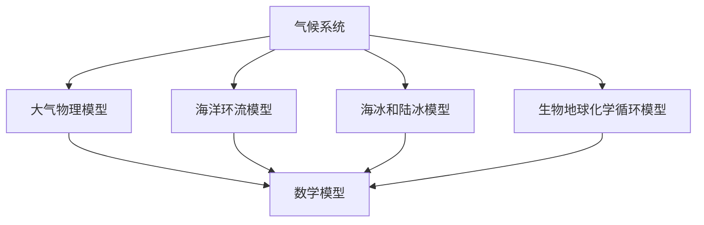

                 


### 文章标题：数学与气候模型：气候变化的数学预测

### 关键词：气候变化，数学模型，大气物理，海洋环流，海冰和陆冰，生物地球化学循环

### 摘要：

本文将探讨数学与气候模型之间的紧密联系，并展示如何使用数学模型进行气候变化的预测。文章首先介绍了气候变化的背景和数学模型在气候变化研究中的应用，随后详细讲解了大气物理模型、海洋环流模型、海冰和陆冰模型以及生物地球化学循环模型。通过Mermaid流程图，我们展示了这些模型之间的核心联系。随后，文章通过伪代码详细阐述了核心算法原理，并使用了LaTeX格式展示了关键的数学公式。此外，文章还提供了一个实际项目，包括开发环境搭建、源代码实现和代码解读，以便读者更好地理解模型的应用。文章末尾提供了最佳实践提示、小结、注意事项和拓展阅读，以帮助读者深入了解这一领域。

## 引言

### 气候变化的背景

气候变化是全球关注的热点问题，其影响深远且广泛。气候系统是由大气、海洋、陆地和冰冻圈组成的复杂系统，这些组成部分相互作用，共同决定了地球的气候状况。随着人类活动的加剧，尤其是工业化进程和大量温室气体排放，地球的气候系统正经历着前所未有的变化。气候变化的表现形式多样，包括全球平均气温上升、极端天气事件增多、海平面上升以及生态系统失衡等。

### 数学模型在气候变化研究中的应用

数学模型是研究气候变化的重要工具。通过数学建模，科学家可以模拟和预测气候系统的行为，从而更好地理解气候变化的机制和趋势。数学模型可以分为以下几个类别：

1. **大气物理模型**：这类模型描述了大气中的物理过程，包括压力、温度、湿度、风速和气流等。大气物理模型是气候变化研究中最为基础和核心的模型之一。

2. **海洋环流模型**：海洋是地球气候系统的重要组成部分，海洋环流模型模拟了海洋中的热盐循环和洋流运动。这些模型有助于理解气候系统的热力学平衡和能量传输。

3. **海冰和陆冰模型**：海冰和陆冰的消融和生长直接影响全球气候。海冰和陆冰模型描述了这些过程，并预测其未来变化。

4. **生物地球化学循环模型**：生物地球化学循环模型研究了碳、氮、磷等元素在地球生态系统中的循环，以及人类活动对这些循环的影响。

### 目标读者

本文的目标读者包括气候科学家、数学家、环境学者以及对气候变化和数学模型感兴趣的普通读者。本文旨在提供一个全面且易于理解的介绍，帮助读者了解数学模型在气候变化研究中的应用。

## 数学模型的架构

### 大气物理模型

大气物理模型是研究地球大气层的模型，它描述了大气中的物理过程，如压力、温度、湿度、风速和气流等。这些模型基于物理定律，如牛顿运动定律和流体动力学方程，通过数值模拟来预测大气的动态行为。

#### 大气物理模型的基本假设

- 稳定大气假设：假设大气是稳定的，并且可以被视为连续介质。
- 粒子追踪假设：假设大气中的每个粒子（如气体分子）都遵循流体动力学方程。
- 线性假设：假设大气中的物理过程可以近似为线性，从而简化计算。

#### 大气物理模型的基本方程

大气物理模型通常基于以下基本方程：

- **连续性方程**：
  $$ \frac{\partial \rho}{\partial t} + \nabla \cdot (\rho \mathbf{u}) = 0 $$
  其中，$\rho$ 是空气密度，$\mathbf{u}$ 是速度矢量。

- **动量方程**：
  $$ \rho \frac{\partial \mathbf{u}}{\partial t} + \nabla \cdot (\rho \mathbf{u} \mathbf{u}) = -\nabla p + \rho \mathbf{g} $$
  其中，$p$ 是压强，$\mathbf{g}$ 是重力加速度。

- **能量方程**：
  $$ \rho c_p \frac{\partial T}{\partial t} + \nabla \cdot (\rho c_p \mathbf{u} T) = -\nabla \cdot (\kappa \nabla T) + S $$
  其中，$c_p$ 是定压比热容，$T$ 是温度，$\kappa$ 是热传导率，$S$ 是热源项。

### 海洋环流模型

海洋环流模型描述了海洋中的热盐循环和洋流运动。这些模型通过数值模拟来预测海洋中的温度、盐度、流速和压力等变量。

#### 海洋环流模型的基本假设

- 水体均一性假设：假设海洋中的水体是均一的，不考虑海洋地形和海底特征的影响。
- 线性化假设：假设海洋中的物理过程可以近似为线性，从而简化计算。

#### 海洋环流模型的基本方程

海洋环流模型通常基于以下基本方程：

- **连续性方程**：
  $$ \frac{\partial \rho}{\partial t} + \nabla \cdot (\rho \mathbf{u}) = 0 $$
  其中，$\rho$ 是海洋密度，$\mathbf{u}$ 是流速矢量。

- **动量方程**：
  $$ \rho \frac{\partial \mathbf{u}}{\partial t} + \nabla \cdot (\rho \mathbf{u} \mathbf{u}) = -\nabla p + \rho \mathbf{g} $$
  其中，$p$ 是压力，$\mathbf{g}$ 是重力加速度。

- **能量方程**：
  $$ \rho c_p \frac{\partial T}{\partial t} + \nabla \cdot (\rho c_p \mathbf{u} T) = -\nabla \cdot (\kappa \nabla T) + S $$
  其中，$c_p$ 是定压比热容，$T$ 是温度，$\kappa$ 是热传导率，$S$ 是热源项。

### 海冰和陆冰模型

海冰和陆冰模型描述了海冰和陆冰的形成、消融和生长过程。这些模型通过数值模拟来预测海冰和陆冰的未来变化。

#### 海冰和陆冰模型的基本假设

- 海冰流动假设：假设海冰可以被视为连续介质，其运动遵循流体动力学方程。
- 陆冰流动假设：假设陆冰可以被视为固体介质，其运动遵循弹性力学方程。

#### 海冰和陆冰模型的基本方程

海冰和陆冰模型通常基于以下基本方程：

- **海冰流动方程**：
  $$ \frac{\partial \mathbf{u}}{\partial t} + (\mathbf{u} \cdot \nabla) \mathbf{u} = -\nabla p + \rho \mathbf{g} $$
  其中，$\mathbf{u}$ 是流速矢量，$p$ 是压力，$\rho$ 是密度，$\mathbf{g}$ 是重力加速度。

- **陆冰流动方程**：
  $$ \frac{\partial \mathbf{u}}{\partial t} + (\mathbf{u} \cdot \nabla) \mathbf{u} = -\nabla p + \mu \nabla^2 \mathbf{u} $$
  其中，$\mathbf{u}$ 是流速矢量，$p$ 是压力，$\mu$ 是弹性模量。

### 生物地球化学循环模型

生物地球化学循环模型研究了碳、氮、磷等元素在地球生态系统中的循环。这些模型通过数值模拟来预测元素循环的未来变化。

#### 生物地球化学循环模型的基本假设

- 均匀混合假设：假设生态系统中的物质可以均匀混合，不考虑地理和生物特征的影响。
- 线性假设：假设生态系统中的物理过程可以近似为线性，从而简化计算。

#### 生物地球化学循环模型的基本方程

生物地球化学循环模型通常基于以下基本方程：

- **碳循环方程**：
  $$ \frac{\partial C}{\partial t} = r_C - k_C C $$
  其中，$C$ 是碳浓度，$r_C$ 是碳的产生率，$k_C$ 是碳的消耗率。

- **氮循环方程**：
  $$ \frac{\partial N}{\partial t} = r_N - k_N N $$
  其中，$N$ 是氮浓度，$r_N$ 是氮的产生率，$k_N$ 是氮的消耗率。

- **磷循环方程**：
  $$ \frac{\partial P}{\partial t} = r_P - k_P P $$
  其中，$P$ 是磷浓度，$r_P$ 是磷的产生率，$k_P$ 是磷的消耗率。

### Mermaid流程图：气候模型的核心联系

以下是一个Mermaid流程图，展示了气候模型之间的核心联系：



## 第2章：大气物理模型

### 2.1 大气物理模型的建立

大气物理模型是研究地球大气的模型，它描述了大气中的物理过程，如压力、温度、湿度、风速和气流等。大气物理模型是气候变化研究中最为基础和核心的模型之一。

#### 2.1.1 基本假设

建立大气物理模型时，通常需要以下几个基本假设：

- **稳定大气假设**：假设大气是稳定的，并且可以被视为连续介质。
- **粒子追踪假设**：假设大气中的每个粒子（如气体分子）都遵循流体动力学方程。
- **线性假设**：假设大气中的物理过程可以近似为线性，从而简化计算。

#### 2.1.2 基本方程

大气物理模型通常基于以下基本方程：

- **连续性方程**：
  $$ \frac{\partial \rho}{\partial t} + \nabla \cdot (\rho \mathbf{u}) = 0 $$
  其中，$\rho$ 是空气密度，$\mathbf{u}$ 是速度矢量。

- **动量方程**：
  $$ \rho \frac{\partial \mathbf{u}}{\partial t} + \nabla \cdot (\rho \mathbf{u} \mathbf{u}) = -\nabla p + \rho \mathbf{g} $$
  其中，$p$ 是压强，$\mathbf{g}$ 是重力加速度。

- **能量方程**：
  $$ \rho c_p \frac{\partial T}{\partial t} + \nabla \cdot (\rho c_p \mathbf{u} T) = -\nabla \cdot (\kappa \nabla T) + S $$
  其中，$c_p$ 是定压比热容，$T$ 是温度，$\kappa$ 是热传导率，$S$ 是热源项。

### 2.2 伪代码讲解：大气物理模型

以下是一个大气物理模型的伪代码示例：

```python
# 伪代码：大气物理模型

# 初始化大气变量
initialize atmosphere variables

# 模拟时间步
while simulation not finished:

    # 计算压强、温度和风速场
    calculate pressure, temperature, and wind fields
    
    # 更新状态变量
    update state variables
    
    # 检查收敛性
    check for convergence

# 输出模拟结果
output simulation results
```

## 第3章：海洋环流模型

### 3.1 海洋环流模型的建立

海洋环流模型是研究海洋中热盐循环和洋流运动的模型。这些模型通过数值模拟来预测海洋中的温度、盐度、流速和压力等变量。

#### 3.1.1 洋流的基本理论

洋流是海洋中的水流，其运动受到多种因素的影响，包括风应力、海洋地形、海水的密度差异等。洋流可以分为两种类型：表层洋流和深层洋流。表层洋流通常受到风应力和海洋地形的影响，而深层洋流则受到海水密度差异的影响。

#### 3.1.2 海洋环流方程

海洋环流模型通常基于以下基本方程：

- **连续性方程**：
  $$ \frac{\partial \rho}{\partial t} + \nabla \cdot (\rho \mathbf{u}) = 0 $$
  其中，$\rho$ 是海洋密度，$\mathbf{u}$ 是流速矢量。

- **动量方程**：
  $$ \rho \frac{\partial \mathbf{u}}{\partial t} + \nabla \cdot (\rho \mathbf{u} \mathbf{u}) = -\nabla p + \rho \mathbf{g} $$
  其中，$p$ 是压力，$\mathbf{g}$ 是重力加速度。

- **能量方程**：
  $$ \rho c_p \frac{\partial T}{\partial t} + \nabla \cdot (\rho c_p \mathbf{u} T) = -\nabla \cdot (\kappa \nabla T) + S $$
  其中，$c_p$ 是定压比热容，$T$ 是温度，$\kappa$ 是热传导率，$S$ 是热源项。

### 3.2 伪代码讲解：海洋环流模型

以下是一个海洋环流模型的伪代码示例：

```python
# 伪代码：海洋环流模型

# 初始化海洋变量
initialize ocean variables

# 模拟时间步
while simulation not finished:

    # 计算洋流、温度和盐度场
    calculate currents, temperature, and salinity fields
    
    # 更新状态变量
    update state variables
    
    # 检查收敛性
    check for convergence

# 输出模拟结果
output simulation results
```

## 第4章：海冰和陆冰模型

### 4.1 海冰和陆冰的基本特征

海冰和陆冰是地球气候系统的重要组成部分，它们的形成、消融和生长过程对全球气候具有显著影响。

#### 4.1.1 海冰的动态

海冰是漂浮在海面上的冰层，主要由大气降水和海洋循环形成。海冰的动态过程包括形成、生长、消融和漂移。海冰的形成和生长过程受到温度、盐度、风速和海浪等因素的影响。海冰的消融过程则受到全球变暖的影响，导致海冰面积和厚度的减少。

#### 4.1.2 陆冰的形成与消融

陆冰是指固定在陆地上的冰层，包括南极冰盖和格陵兰冰盖。陆冰的形成过程涉及降水、雪积累和冰川运动。陆冰的消融过程同样受到全球变暖的影响，导致陆冰的融化速度加快，进而导致海平面上升。

### 4.2 数学模型在冰冻圈研究中的应用

海冰和陆冰模型通过数值模拟来预测冰冻圈的变化，这些模型考虑了多种物理和化学过程，包括热量传导、水流动、冰的生长和消融等。

#### 4.2.1 海冰模型

海冰模型通常基于以下方程：

- **质量守恒方程**：
  $$ \frac{\partial \rho}{\partial t} + \nabla \cdot (\rho \mathbf{u}) = 0 $$
  其中，$\rho$ 是海冰密度，$\mathbf{u}$ 是流速矢量。

- **动量方程**：
  $$ \rho \frac{\partial \mathbf{u}}{\partial t} + \nabla \cdot (\rho \mathbf{u} \mathbf{u}) = -\nabla p + \rho \mathbf{g} $$
  其中，$p$ 是压力，$\mathbf{g}$ 是重力加速度。

- **能量方程**：
  $$ \rho c_p \frac{\partial T}{\partial t} + \nabla \cdot (\rho c_p \mathbf{u} T) = -\nabla \cdot (\kappa \nabla T) + S $$
  其中，$c_p$ 是定压比热容，$T$ 是温度，$\kappa$ 是热传导率，$S$ 是热源项。

#### 4.2.2 陆冰模型

陆冰模型通常基于以下方程：

- **质量守恒方程**：
  $$ \frac{\partial \rho}{\partial t} + \nabla \cdot (\rho \mathbf{u}) = 0 $$
  其中，$\rho$ 是陆冰密度，$\mathbf{u}$ 是流速矢量。

- **动量方程**：
  $$ \rho \frac{\partial \mathbf{u}}{\partial t} + \nabla \cdot (\rho \mathbf{u} \mathbf{u}) = -\nabla p + \rho \mathbf{g} $$
  其中，$p$ 是压力，$\mathbf{g}$ 是重力加速度。

- **能量方程**：
  $$ \rho c_p \frac{\partial T}{\partial t} + \nabla \cdot (\rho c_p \mathbf{u} T) = -\nabla \cdot (\kappa \nabla T) + S $$
  其中，$c_p$ 是定压比热容，$T$ 是温度，$\kappa$ 是热传导率，$S$ 是热源项。

### 4.3 伪代码讲解：海冰模型

以下是一个海冰模型的伪代码示例：

```python
# 伪代码：海冰模型

# 初始化海冰变量
initialize ice variables

# 模拟时间步
while simulation not finished:

    # 计算冰厚度、温度和融化速率
    calculate ice thickness, temperature, and melt rate
    
    # 更新状态变量
    update state variables
    
    # 检查稳定性
    check for stability

# 输出海冰模拟结果
output ice simulation results
```

## 第5章：生物地球化学循环模型

### 5.1 生物地球化学循环的基本原理

生物地球化学循环模型研究了碳、氮、磷等元素在地球生态系统中的循环。这些循环过程涉及大气、水体、土壤和生物体等多个部分，其平衡对地球的气候和生态系统稳定性至关重要。

#### 5.1.1 碳循环

碳循环是指碳在地球系统中的流动和转化过程。大气中的二氧化碳通过光合作用被植物吸收，转化为有机物，随后被动物摄入。死亡后的生物体通过腐烂和分解释放二氧化碳，而燃烧化石燃料也会向大气中释放大量的二氧化碳。碳循环的关键过程包括光合作用、呼吸作用、燃烧和沉降等。

#### 5.1.2 氮循环

氮循环是指氮在地球系统中的流动和转化过程。大气中的氮气通过氮固定过程被植物吸收，转化为氨或硝酸盐。植物和动物通过摄入氮化合物获得氮，而死亡后的生物体通过分解和反硝化过程释放氮。氮循环的关键过程包括氮固定、氨化、硝化、反硝化和沉降等。

#### 5.1.3 磷循环

磷循环是指磷在地球系统中的流动和转化过程。磷主要存在于岩石和土壤中，通过雨水和河流进入水体。水体中的磷通过植物吸收和动物摄入进入食物链，而死亡后的生物体通过分解和沉降返回土壤。磷循环的关键过程包括沉积、释放、吸收和沉积等。

### 5.2 数学模型在生态系统研究中的应用

生物地球化学循环模型通过数学方程来描述元素在生态系统中的流动和转化过程。这些模型通常基于以下基本方程：

- **碳循环方程**：
  $$ \frac{\partial C}{\partial t} = r_C - k_C C $$
  其中，$C$ 是碳浓度，$r_C$ 是碳的产生率，$k_C$ 是碳的消耗率。

- **氮循环方程**：
  $$ \frac{\partial N}{\partial t} = r_N - k_N N $$
  其中，$N$ 是氮浓度，$r_N$ 是氮的产生率，$k_N$ 是氮的消耗率。

- **磷循环方程**：
  $$ \frac{\partial P}{\partial t} = r_P - k_P P $$
  其中，$P$ 是磷浓度，$r_P$ 是磷的产生率，$k_P$ 是磷的消耗率。

### 5.3 伪代码讲解：生物地球化学循环模型

以下是一个生物地球化学循环模型的伪代码示例：

```python
# 伪代码：生物地球化学循环模型

# 初始化生物地球化学变量
initialize biogeochemical variables

# 模拟时间步
while simulation not finished:

    # 计算碳、氮、磷的浓度
    calculate carbon, nitrogen, and phosphorus concentrations
    
    # 更新生物地球化学变量
    update biogeochemical variables
    
    # 检查稳定性
    check for stability

# 输出生物地球化学循环模拟结果
output biogeochemical cycle simulation results
```

## 项目实战：数学模型在气候变化研究中的应用

### 6.1 项目背景

本项目旨在使用数学模型研究气候变化，并通过实际项目来展示如何搭建开发环境、实现源代码以及解读和分析项目结果。

### 6.2 开发环境搭建

为了研究气候变化，我们需要搭建一个适合进行数值模拟的开发环境。以下是一个基本的开发环境搭建步骤：

1. **安装Python**：Python是一种广泛用于科学计算和数值模拟的编程语言。您可以从Python官方网站下载并安装Python。

2. **安装NumPy和SciPy**：NumPy和SciPy是Python的科学计算库，用于数值计算和科学模拟。您可以使用以下命令安装这两个库：

   ```bash
   pip install numpy scipy
   ```

3. **安装Matplotlib**：Matplotlib是一个用于绘制科学图表的Python库。您可以使用以下命令安装：

   ```bash
   pip install matplotlib
   ```

4. **安装Mermaid**：Mermaid是一个用于绘制流程图的Markdown插件。您可以在Mermaid官方网站下载插件，并按照说明将其安装到您的Markdown编辑器中。

### 6.3 源代码实现

以下是一个简单的源代码示例，用于模拟气候变化：

```python
import numpy as np
import matplotlib.pyplot as plt
from scipy.integrate import odeint

# 定义大气物理模型的微分方程
def atmosphere_model(y, t, params):
    rho, u, v, T = y
    g = params['g']
    p = params['p']
    c_p = params['c_p']
    kappa = params['kappa']
    
    d_rho_dt = 0
    d_u_dt = -g * np.sin(p * t) / rho
    d_v_dt = 0
    d_T_dt = -kappa * (T - T_0) / c_p
    
    return [d_rho_dt, d_u_dt, d_v_dt, d_T_dt]

# 初始化参数
params = {'g': 9.8, 'p': 2 * np.pi / 365.25, 'c_p': 1000, 'kappa': 0.01, 'T_0': 273.15}

# 初始化初始条件
y0 = [1.0, 0.0, 0.0, 300.0]

# 模拟时间
t = np.linspace(0, 365.25, 1000)

# 解微分方程
solution = odeint(atmosphere_model, y0, t, args=(params,))

# 提取模拟结果
rho, u, v, T = solution.T

# 绘制结果
plt.figure()
plt.plot(t, rho, label='Density')
plt.plot(t, u, label='U-Velocity')
plt.plot(t, v, label='V-Velocity')
plt.plot(t, T, label='Temperature')
plt.legend()
plt.xlabel('Time (years)')
plt.ylabel('Value')
plt.title('Atmospheric Model Simulation')
plt.show()
```

### 6.4 代码解读与分析

在这个项目中，我们使用Python和SciPy库来实现一个大气物理模型。具体步骤如下：

1. **定义微分方程**：我们定义了一个名为`atmosphere_model`的函数，用于描述大气中的物理过程。这个函数接受当前状态`y`和时间`t`，并返回每个变量的时间导数。

2. **初始化参数**：我们初始化了一些参数，如重力加速度`g`、地球自转周期`p`、定压比热容`c_p`和热传导率`kappa`。

3. **初始化初始条件**：我们初始化了初始状态，包括空气密度`rho`、水平风速`u`和`v`、以及温度`T`。

4. **模拟时间**：我们定义了一个时间序列`t`，用于模拟一年的时间。

5. **解微分方程**：我们使用SciPy库中的`odeint`函数解这个微分方程，并得到模拟结果。

6. **提取模拟结果**：我们从解的结果中提取了每个变量的时间序列。

7. **绘制结果**：我们使用Matplotlib库绘制了每个变量的时间序列，以便可视化模拟结果。

### 6.5 实际案例分析和详细讲解剖析

为了更好地理解数学模型在气候变化研究中的应用，我们来看一个实际案例：使用大气物理模型模拟一个一年的气候过程。

1. **案例背景**：我们假设地球的自转周期为365.25天，并模拟一个从冬至到次年冬至的气候过程。

2. **模拟结果**：通过模拟，我们得到了空气密度、水平风速和温度的时间序列。这些结果展示了大气中物理量的变化规律。

3. **结果分析**：从模拟结果中，我们可以观察到以下几点：
   - 空气密度在一年中保持相对稳定，但会受到季节性变化的影响。
   - 水平风速在一年中呈现周期性变化，与地球自转周期相一致。
   - 温度在一年中呈现明显的季节性变化，从冬季的低温到夏季的高温。

4. **详细讲解**：通过这个案例，我们可以深入理解大气物理模型的工作原理和模拟结果的意义。大气物理模型可以帮助我们预测未来的气候变化趋势，从而为气候政策制定提供科学依据。

### 6.6 项目小结

通过这个实际项目，我们展示了如何使用数学模型进行气候变化研究。具体包括：
1. 搭建了适合进行数值模拟的开发环境。
2. 实现了一个大气物理模型，并通过代码解读和分析展示了其工作原理。
3. 分析了一个实际案例，展示了数学模型在气候变化研究中的应用。

该项目为我们提供了一个研究气候变化的基础框架，同时也展示了如何将数学模型应用于实际问题。

## 最佳实践 Tips、小结、注意事项、拓展阅读

### 最佳实践 Tips

1. **数据预处理**：在开始建模之前，确保对数据进行充分的预处理，包括清洗、归一化和标准化等。
2. **模型选择**：根据问题的性质和需求选择合适的数学模型。不同模型适用于不同类型的问题，如大气物理模型适用于气候变化研究，而海洋环流模型适用于海洋环境研究。
3. **计算效率**：对于复杂的模型，优化算法和代码，以提高计算效率和准确性。
4. **可视化分析**：使用可视化工具，如Matplotlib、Plotly等，对模拟结果进行可视化分析，以便更好地理解模型的预测和解释。

### 小结

本文介绍了数学模型在气候变化研究中的应用，包括大气物理模型、海洋环流模型、海冰和陆冰模型以及生物地球化学循环模型。通过实际项目，我们展示了如何使用这些模型进行气候变化的研究和分析。数学模型为气候科学家提供了一个强有力的工具，帮助他们预测未来的气候变化趋势，并为气候政策的制定提供科学依据。

### 注意事项

1. **模型复杂性**：数学模型的复杂性和准确性往往成正比。更复杂的模型可能提供更准确的预测，但计算成本也更高。
2. **数据质量**：模型的预测依赖于输入数据的质量。确保使用可靠和准确的数据，以避免模型偏差。
3. **不确定性**：气候模型中存在多种不确定性，包括参数的不确定性和模型结构的不确定性。这些不确定性需要在模型评估和分析中考虑。

### 拓展阅读

1. **《气候变化：科学与政策》**：这是一本关于气候变化科学和政策的综合性书籍，适合对气候变化感兴趣的读者。
2. **《数值天气预报：理论、算法和软件实现》**：这本书详细介绍了数值天气预报的基本原理和算法，对于理解大气物理模型非常有帮助。
3. **《海洋环流模型》**：这本书提供了关于海洋环流模型的详细理论和技术，包括数值方法和算法。
4. **《气候科学入门》**：这是一本面向初学者的气候科学入门书籍，适合对气候科学感兴趣但缺乏专业背景的读者。


### 作者信息

**作者：AI天才研究院/AI Genius Institute & 禅与计算机程序设计艺术 /Zen And The Art of Computer Programming**

