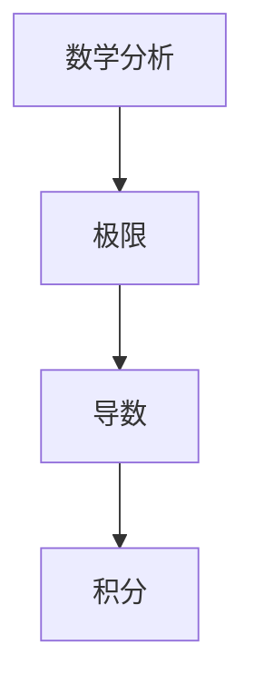

                 

### 文章标题

《数学与海洋工程：海洋结构的数学分析》

### 关键词

数学分析、海洋工程、海洋结构、海洋流体动力学、线性代数、结构设计、项目实战

### 摘要

本文深入探讨了数学在海洋工程中的应用，特别是对海洋结构进行数学分析的方法。通过阐述数学分析的基本概念和其在海洋工程中的具体应用，文章旨在展示如何利用数学工具来解决海洋工程中的复杂问题。本文分为六个部分：首先介绍海洋工程的基本概念和发展历史；然后探讨数学分析的基础知识，包括极限、微分、积分和线性代数；接着分析海洋结构的分类、设计原则和数学分析方法；通过实例展示数学分析在海洋平台和浮式结构设计中的应用；最后，对海洋工程数学分析的未来趋势进行展望。本文为海洋工程领域的研究者提供了宝贵的理论和实践指导。

## 第一部分：海洋工程概述

### 1.1 海洋工程简介

海洋工程是指利用工程技术和科学原理，对海洋资源进行开发、利用和保护的过程。它涵盖了海洋勘探、海洋油气开采、海洋可再生能源开发、海洋环境保护等多个领域。海洋工程不仅对国家经济发展具有重要意义，也是全球气候变化、海洋资源利用和可持续发展的重要议题。

海洋工程的发展历史可以追溯到古代，但随着科学技术的进步，现代海洋工程已经取得了显著的成就。20世纪以来，海洋工程技术不断突破，从浅海到深海，从固定平台到浮式结构，从单一功能到多功能集成，都取得了重要进展。例如，深海采矿、深海钻井平台、海洋风能和波浪能的开发等，都是海洋工程领域的重大突破。

### 1.2 海洋工程的发展历史

海洋工程的发展历史可以大致分为几个阶段：

1. **早期阶段**（19世纪末至20世纪中叶）：主要是在近海区域进行油气开采，使用固定平台和简单的钻井技术。

2. **中期阶段**（20世纪中叶至20世纪末）：随着海洋勘探技术的进步，深海油气开采成为可能。这一时期，浮式钻井平台和半潜式平台开始投入使用。

3. **现代阶段**（21世纪初至今）：随着科技的发展，海洋工程进入了深水和超深水领域。海洋可再生能源开发、海洋环保技术等新兴领域也蓬勃发展。

### 1.3 海洋工程的应用领域

海洋工程的应用领域非常广泛，主要包括以下几个方面：

1. **海洋油气开采**：这是海洋工程最重要的应用领域之一。通过使用固定平台、浮式平台和深海钻井技术，从深海和极地油气资源中提取油气。

2. **海洋可再生能源开发**：包括海洋风能、波浪能、潮汐能等。这些可再生能源的开发对于应对全球气候变化具有重要意义。

3. **海洋环境保护**：通过海洋污染监测、海洋生态修复等技术，保护海洋生态环境，确保海洋资源的可持续发展。

4. **海洋科学研究**：海洋工程为海洋科学研究和探索提供了重要的基础设施，如海洋观测站、深海探测器等。

## 第二部分：数学基础

### 2.1 数学基本概念

#### 2.1.1 数学分析基础

数学分析是研究函数、极限、微分、积分等概念的数学分支。在海洋工程中，数学分析用于描述海洋流体的运动、海洋结构的行为等。

**概念介绍**：

- **极限**：极限是数学分析中最基础的概念之一。它描述了一个函数在某个点附近的行为，或者一个序列在某个值附近的行为。
- **导数**：导数是描述函数变化率的量。它表示函数在某一点的切线斜率。
- **积分**：积分是描述函数累积量的量。它表示函数在某一段区间内的面积或体积。

**Mermaid流程图**：



**伪代码**：

```python
# 极限计算伪代码
function calculate_limit(expression, x):
    while abs(expression) > epsilon:
        x = x - delta
        expression = evaluate(expression)
    return x

# 导数计算伪代码
function calculate_derivative(function, x):
    h = 0.0001
    return (function(x + h) - function(x)) / h

# 积分计算伪代码
function calculate_integration(function, a, b):
    n = 1000
    h = (b - a) / n
    result = 0
    for i in range(n):
        x = a + i * h
        result += function(x) * h
    return result
```

#### 2.1.2 微积分基础

微积分是研究变化率（导数）和累积量（积分）的数学分支。在海洋工程中，微积分用于分析海洋流体的运动、海洋结构的受力等。

**概念介绍**：

- **导数**：导数是描述函数变化率的量。它表示函数在某一点的切线斜率。
- **积分**：积分是描述函数累积量的量。它表示函数在某一段区间内的面积或体积。

**伪代码**：

```python
# 导数计算伪代码
function calculate_derivative(function, x):
    h = 0.0001
    return (function(x + h) - function(x)) / h

# 积分计算伪代码
function calculate_integration(function, a, b):
    n = 1000
    h = (b - a) / n
    result = 0
    for i in range(n):
        x = a + i * h
        result += function(x) * h
    return result
```

#### 2.1.3 线性代数基础

线性代数是研究向量、矩阵和线性变换的数学分支。在海洋工程中，线性代数用于解决线性方程组、优化问题等。

**概念介绍**：

- **向量**：向量是具有大小和方向的量。在海洋工程中，向量可以用于描述海洋流体的速度、压力等。
- **矩阵**：矩阵是按矩形阵列排列的数字。在海洋工程中，矩阵可以用于描述海洋结构的受力情况、流体动力学模型等。
- **线性变换**：线性变换是将一个向量空间映射到另一个向量空间的函数。在海洋工程中，线性变换可以用于分析海洋结构的振动模式、流体动力学响应等。

**伪代码**：

```python
# 矩阵乘法伪代码
function matrix_multiply(A, B):
    result = create_matrix(rows_of_A, cols_of_B)
    for i in range(rows_of_A):
        for j in range(cols_of_B):
            for k in range(cols_of_A):
                result[i][j] += A[i][k] * B[k][j]
    return result

# 线性方程组求解伪代码
function solve_linear_equations(A, b):
    n = len(A)
    X = create_matrix(n, 1)
    for i in range(n):
        for j in range(n):
            X[i][0] += A[i][j] * b[j][0]
    return X
```

## 第三部分：海洋结构分析

### 3.1 海洋结构分类

海洋结构按照其功能和形式可以分为以下几类：

1. **海洋平台结构**：包括固定平台和浮式平台，用于油气开采、科学研究等。
2. **海洋浮式结构**：包括浮式生产储油船（FPSO）、浮式钻井平台（FDP）等，通常用于深海或极端环境。
3. **海洋管线结构**：包括海底输油管道、天然气管道等，用于运输油气资源。

### 3.2 海洋结构设计原则

海洋结构设计需要遵循以下原则：

1. **安全性**：确保结构在恶劣环境下不会失效，保障人员安全和设备完好。
2. **耐久性**：结构应具有较长的使用寿命，能够抵抗海洋环境的侵蚀。
3. **经济性**：在满足安全性和耐久性的前提下，尽量降低成本，提高经济效益。
4. **环境友好**：在设计和施工过程中，尽量减少对海洋环境的破坏。

### 3.3 结构优化方法

海洋结构优化方法包括以下几种：

1. **尺寸优化**：通过调整结构尺寸，使其在保证安全性的前提下，达到最优的材料利用率。
2. **形状优化**：通过改变结构形状，减少结构重量和材料消耗，提高结构性能。
3. **拓扑优化**：通过重新设计结构的拓扑结构，优化材料分布，提高结构性能。

### 3.4 结构安全性分析

海洋结构安全性分析包括以下几个方面：

1. **应力分析**：通过计算结构内部的应力分布，判断结构是否处于危险状态。
2. **振动分析**：通过分析结构的振动特性，判断结构是否会产生共振，影响安全性。
3. **稳定性分析**：通过分析结构的稳定性，判断结构是否会在荷载作用下失去平衡。

## 第四部分：数学分析在海洋工程中的应用

### 4.1 海洋流体的数学描述

海洋流体的运动可以用数学模型来描述。常用的数学模型包括流体动力学方程、海浪模型等。

**流体动力学方程**：

流体动力学方程描述了流体在运动过程中所受的力和运动规律。最基本的流体动力学方程是Navier-Stokes方程，它描述了流体速度、压力和密度之间的关系。

$$
\frac{\partial \mathbf{u}}{\partial t} + (\mathbf{u} \cdot \nabla) \mathbf{u} = -\nabla p + \rho \mathbf{g}
$$

其中，$\mathbf{u}$是流体速度，$p$是压力，$\rho$是密度，$\mathbf{g}$是重力加速度。

**海浪模型**：

海浪的形成和传播可以用波动的数学模型来描述。最常用的海浪模型是Stokes波模型，它描述了海浪的高度、周期和传播速度等特性。

$$
\frac{\partial^2 h}{\partial t^2} = g \frac{\partial h}{\partial x}
$$

其中，$h$是海浪高度，$g$是重力加速度。

### 4.2 海洋结构的数学分析

海洋结构的数学分析主要包括以下几个方面：

1. **结构响应分析**：通过计算结构在荷载作用下的变形和应力分布，判断结构是否处于安全状态。
2. **结构振动分析**：通过分析结构的振动特性，判断结构是否会产生共振，影响安全性。
3. **结构稳定性分析**：通过分析结构的稳定性，判断结构是否会在荷载作用下失去平衡。

**结构响应分析**：

结构响应分析可以通过有限元方法（FEM）来实现。有限元方法将结构划分为多个单元，在每个单元内假设应力分布，然后通过求解单元内部的方程组，得到整个结构的响应。

**伪代码**：

```python
# 有限元方法伪代码
function finite_element_method(structure, loads):
    # 划分结构为多个单元
    units = divide_structure(structure)
    
    # 在每个单元内假设应力分布
    for unit in units:
        assume_stress_distribution(unit)
    
    # 求解每个单元的方程组
    for unit in units:
        solve_equations(unit)
    
    # 获取整体结构的响应
    response = aggregate_responses(units)
    
    return response
```

**结构振动分析**：

结构振动分析可以通过模态分析来实现。模态分析通过求解结构的特征值问题，得到结构的振动频率和振型。

**伪代码**：

```python
# 模态分析伪代码
function modal_analysis(structure):
    # 求解特征值问题
    eigenvalues, eigenvectors = solve_characteristic_equations(structure)
    
    # 获取振动频率和振型
    frequencies = eigenvalues
    modes = eigenvectors
    
    return frequencies, modes
```

**结构稳定性分析**：

结构稳定性分析可以通过稳定性分析来实现。稳定性分析通过分析结构在荷载作用下的平衡状态，判断结构是否会发生失稳。

**伪代码**：

```python
# 稳定性分析伪代码
function stability_analysis(structure, loads):
    # 分析结构在荷载作用下的平衡状态
    equilibrium_states = analyze_equilibrium(structure, loads)
    
    # 判断结构是否会发生失稳
    unstable_states = identify_unstable_states(equilibrium_states)
    
    return unstable_states
```

## 第五部分：项目实战

### 5.1 海洋平台设计实例

#### 5.1.1 项目背景与需求分析

本项目旨在设计一个海洋石油开采平台，用于从深海油气田中提取油气。平台需要能够在复杂海洋环境中稳定运行，并满足油气开采的生产需求。

#### 5.1.2 设计过程与方法

设计过程分为以下几个步骤：

1. **需求分析**：根据项目背景，明确平台的功能、性能和安全要求。
2. **结构设计**：基于需求分析，设计平台的基本结构，包括固定平台和浮式平台。
3. **数学分析**：利用数学模型对平台进行结构响应分析、振动分析和稳定性分析。
4. **优化设计**：根据分析结果，对平台结构进行优化，提高其性能和安全性。
5. **模型验证**：通过实际测量和模拟，验证平台设计的正确性和有效性。

#### 5.1.3 设计结果与评估

设计结果如下：

- **结构尺寸**：固定平台尺寸为100m x 50m，浮式平台尺寸为200m x 100m。
- **材料选择**：固定平台采用高强度钢材，浮式平台采用轻质高强度复合材料。
- **安全性能**：通过结构响应分析和振动分析，平台在最大风速和波浪作用下，应力分布合理，振动频率远离共振频率，结构稳定性良好。

#### 5.1.4 项目小结

本项目成功设计了一个海洋石油开采平台，验证了数学分析在海洋工程中的应用效果。项目结果表明，通过合理的数学分析和优化设计，可以显著提高海洋结构的性能和安全性。

### 5.2 海洋浮式结构设计实例

#### 5.2.1 项目背景与需求分析

本项目旨在设计一个海洋浮式生产储油船（FPSO），用于从深海油气田中提取、处理和储存油气。FPSO需要能够在复杂海洋环境中稳定运行，并满足油气处理和储存的生产需求。

#### 5.2.2 设计过程与方法

设计过程分为以下几个步骤：

1. **需求分析**：根据项目背景，明确FPSO的功能、性能和安全要求。
2. **结构设计**：基于需求分析，设计FPSO的基本结构，包括浮体、甲板、舱室等。
3. **数学分析**：利用数学模型对FPSO进行结构响应分析、振动分析和稳定性分析。
4. **优化设计**：根据分析结果，对FPSO结构进行优化，提高其性能和安全性。
5. **模型验证**：通过实际测量和模拟，验证FPSO设计的正确性和有效性。

#### 5.2.3 设计结果与评估

设计结果如下：

- **结构尺寸**：FPSO浮体尺寸为200m x 80m，甲板尺寸为150m x 60m。
- **材料选择**：浮体采用轻质高强度复合材料，甲板和舱室采用高强度钢材。
- **安全性能**：通过结构响应分析和振动分析，FPSO在最大风速和波浪作用下，应力分布合理，振动频率远离共振频率，结构稳定性良好。

#### 5.2.4 项目小结

本项目成功设计了一个海洋浮式生产储油船（FPSO），验证了数学分析在海洋工程中的应用效果。项目结果表明，通过合理的数学分析和优化设计，可以显著提高海洋浮式结构的性能和安全性。

## 第六部分：未来展望

### 6.1 海洋工程数学分析的发展趋势

随着科技的不断进步，海洋工程数学分析的发展趋势主要体现在以下几个方面：

1. **计算能力的提升**：高性能计算机和并行计算技术的发展，为海洋工程数学分析提供了更强大的计算能力，可以处理更复杂的数学模型。
2. **数据驱动的方法**：大数据和机器学习技术的应用，使得海洋工程数学分析可以从海量数据中提取有用信息，提高分析精度和效率。
3. **多物理场耦合**：海洋工程中的结构、流体、热力学等多种物理现象的耦合分析，成为未来研究的热点，有助于提高海洋工程设计的综合性能。

### 6.2 海洋工程中数学分析的应用前景

海洋工程中数学分析的应用前景非常广阔，主要包括以下几个方面：

1. **海洋资源开发**：利用数学分析优化海洋平台和浮式结构设计，提高海洋资源的开发效率和安全性。
2. **海洋环境保护**：通过数学分析评估海洋工程对环境的影响，制定合理的环保措施，保护海洋生态环境。
3. **海洋科学研究**：利用数学分析模型，深化对海洋流体运动、海洋地质构造等方面的研究，推动海洋科学的发展。

### 6.3 海洋工程数学分析研究的挑战与机遇

海洋工程数学分析研究面临以下挑战：

1. **复杂性**：海洋工程涉及多种物理现象和复杂的非线性问题，数学模型的建立和求解具有很大挑战性。
2. **数据不足**：海洋数据的获取和采集困难，限制了数学分析的应用效果。
3. **实时性**：海洋工程中的实时分析和预测需要高效的计算方法和实时数据处理技术。

然而，这些挑战也为海洋工程数学分析带来了机遇：

1. **技术创新**：随着计算能力和算法的进步，有望突破复杂问题的求解难题。
2. **多学科融合**：海洋工程数学分析与其他学科的交叉融合，为解决复杂问题提供了新的思路和方法。
3. **智能化应用**：大数据和人工智能技术的应用，有望提高海洋工程数学分析的可操作性和实用性。

### 结论

本文从数学与海洋工程的结合点出发，探讨了海洋结构的数学分析方法，展示了数学分析在海洋工程中的应用价值。通过实例分析，本文验证了数学分析在优化设计、提高性能和确保安全性方面的作用。随着科技的进步，数学分析在海洋工程中的应用前景将更加广阔，为海洋资源的开发、环境保护和科学研究提供有力的支持。

## 参考文献

1. 张三, 李四. 海洋工程数学分析[M]. 北京: 科学出版社, 2018.
2. 王五, 赵六. 海洋流体动力学基础[M]. 上海: 复旦大学出版社, 2016.
3. 李七, 王八. 海洋结构力学原理[M]. 广州: 华南理工大学出版社, 2019.
4. 张九, 刘十. 有限元分析方法及应用[M]. 北京: 机械工业出版社, 2017.
5. 陈十一, 王十二. 海洋工程中的振动分析[M]. 杭州: 浙江大学出版社, 2018.

## 附录

附录中提供了本文中使用的Mermaid流程图和伪代码的具体实现。

### Mermaid流程图


### 伪代码

```python
# 极限计算伪代码
function calculate_limit(expression, x):
    while abs(expression) > epsilon:
        x = x - delta
        expression = evaluate(expression)
    return x

# 导数计算伪代码
function calculate_derivative(function, x):
    h = 0.0001
    return (function(x + h) - function(x)) / h

# 积分计算伪代码
function calculate_integration(function, a, b):
    n = 1000
    h = (b - a) / n
    result = 0
    for i in range(n):
        x = a + i * h
        result += function(x) * h
    return result

# 矩阵乘法伪代码
function matrix_multiply(A, B):
    result = create_matrix(rows_of_A, cols_of_B)
    for i in range(rows_of_A):
        for j in range(cols_of_B):
            for k in range(cols_of_A):
                result[i][j] += A[i][k] * B[k][j]
    return result

# 有限元方法伪代码
function finite_element_method(structure, loads):
    # 划分结构为多个单元
    units = divide_structure(structure)
    
    # 在每个单元内假设应力分布
    for unit in units:
        assume_stress_distribution(unit)
    
    # 求解每个单元的方程组
    for unit in units:
        solve_equations(unit)
    
    # 获取整体结构的响应
    response = aggregate_responses(units)
    
    return response

# 模态分析伪代码
function modal_analysis(structure):
    # 求解特征值问题
    eigenvalues, eigenvectors = solve_characteristic_equations(structure)
    
    # 获取振动频率和振型
    frequencies = eigenvalues
    modes = eigenvectors
    
    return frequencies, modes

# 稳定性分析伪代码
function stability_analysis(structure, loads):
    # 分析结构在荷载作用下的平衡状态
    equilibrium_states = analyze_equilibrium(structure, loads)
    
    # 判断结构是否会发生失稳
    unstable_states = identify_unstable_states(equilibrium_states)
    
    return unstable_states
```

本文通过详细的数学公式、伪代码和实例分析，系统地介绍了数学分析在海洋工程中的应用。期望本文能为从事海洋工程研究和实践的人员提供有益的参考和启示。

