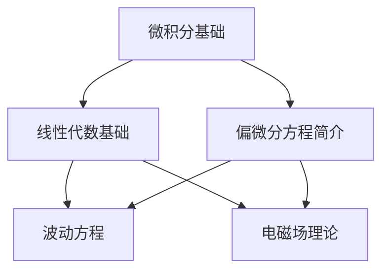
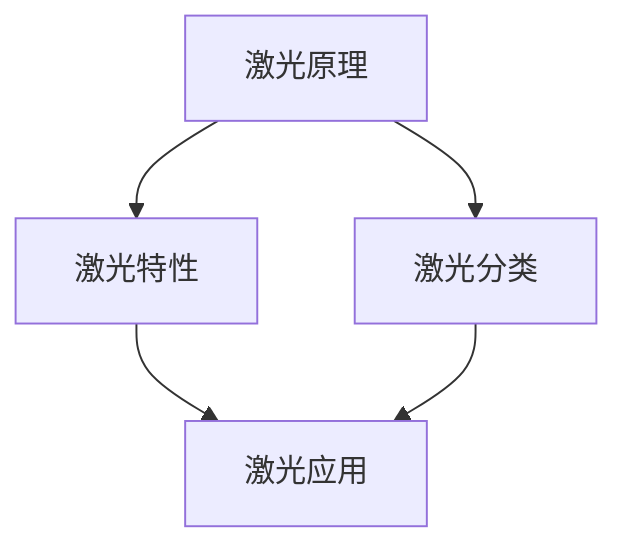
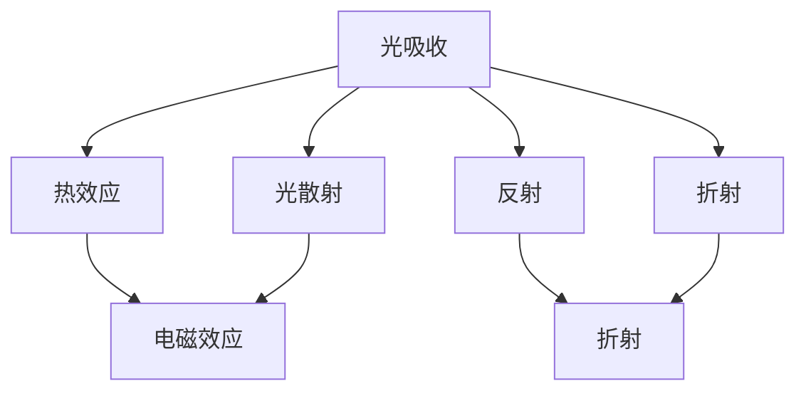

                 

### 文章标题：数学与激光物理：激光与物质相互作用的数学描述

激光（Light Amplification by Stimulated Emission of Radiation）是一种通过受激辐射放大的光，具有高度的单色性、方向性和相干性。在现代科技中，激光的应用极为广泛，包括医疗、通信、材料加工、科学研究等多个领域。激光与物质相互作用的深入理解，对优化激光应用效果、拓展新应用领域具有重要意义。本文将从数学的角度出发，探讨激光与物质相互作用的数学描述，为研究人员和工程师提供理论依据和实践指导。

## 关键词
- 数学模型
- 激光物理
- 激光与物质相互作用
- 波动方程
- 电磁场理论
- 光化学效应

## 摘要
本文首先介绍了激光的基本原理和特性，随后探讨了激光与物质相互作用的背景和重要性。接着，文章详细介绍了数学模型在激光与物质相互作用中的应用，包括波动方程、电磁场理论和光化学效应模型。通过具体的算法原理讲解、数学公式与伪代码示例，以及实际应用案例，本文旨在为读者提供一个全面、系统的数学描述框架，以推动激光物理与数学领域的交叉研究和发展。

### 1. 数学与激光物理概述

#### 1.1 数学基础

在激光与物质相互作用的数学描述中，数学基础尤为重要。主要涉及微积分、线性代数和偏微分方程等数学工具。以下是这些基础概念及其在激光物理中的应用：

**微积分基础**

微积分是研究变化和运动的数学工具，包括微分和积分两个基本概念。在激光物理中，微积分用于描述光波的传播、能量分布以及物质的热效应等。

- **微分**：用于描述变化率，例如光束的强度随距离的变化。
  - **示例**：光强度I(x)随位置x变化，其变化率为\( \frac{dI(x)}{dx} \)。

- **积分**：用于求解总能量、面积等。
  - **示例**：光束经过一段距离后的总能量可以通过积分光强度与距离的乘积得到。

**线性代数基础**

线性代数是研究向量空间和线性映射的数学分支。在激光与物质相互作用中，线性代数用于描述电磁波与物质相互作用时，空间分布和状态变换。

- **向量**：用于表示电磁波的方向和强度。
  - **示例**：电磁波可以用复数向量表示其振幅和相位。

- **矩阵**：用于描述线性变换，如电磁波在介质中的传播。
  - **示例**：电磁波在介质中的传播可以用矩阵形式表示，如：\( \mathbf{E}(x) = \mathbf{M} \mathbf{E}(0) \)。

**偏微分方程简介**

偏微分方程（PDE）是描述多元函数变化规律的方程。在激光物理中，偏微分方程用于描述光波的传播、能量分布和物质响应等。

- **波动方程**：描述光波在介质中的传播。
  - **示例**：一维波动方程为：\( \frac{\partial^2 u(x,t)}{\partial t^2} = c^2 \frac{\partial^2 u(x,t)}{\partial x^2} \)。

- **热传导方程**：描述激光与物质相互作用中的热效应。
  - **示例**：一维热传导方程为：\( \frac{\partial T(x,t)}{\partial t} = k \frac{\partial^2 T(x,t)}{\partial x^2} \)。

**核心概念与联系**

这些数学基础构成了激光与物质相互作用的核心概念。例如：

- **波动方程**与**电磁场理论**结合，描述激光在介质中的传播。
- **热传导方程**与**物质响应**结合，描述激光与物质相互作用中的热效应。
- **线性代数**与**偏微分方程**结合，描述电磁波与物质相互作用时的状态变换。

**Mermaid 流程图**

以下是这些核心概念之间的关系架构：



#### 1.2 激光物理基础

激光（Light Amplification by Stimulated Emission of Radiation）是一种通过受激辐射放大的光，具有高度的单色性、方向性和相干性。激光的这些特性使其在现代科技中具有广泛的应用。

**激光原理**

激光的产生基于受激辐射。在激光器中，通过激发原子或分子，使其从低能级跃迁到高能级，然后通过受激辐射返回低能级，同时发射出相位、频率和方向与激发光相同的光子。

**激光特性**

- **单色性**：激光的光谱宽度非常窄，几乎只包含一个波长。
- **方向性**：激光的发散角非常小，几乎为平行光束。
- **相干性**：激光的相位一致性非常好，可以保持长时间的相干。

**激光分类**

根据激光的工作物质和激发方式，激光可以分为多种类型，如：

- **固体激光**：以固体作为工作物质，如红宝石激光器。
- **气体激光**：以气体作为工作物质，如氦氖激光器。
- **液体激光**：以液体作为工作物质，如二极管激光器。
- **半导体激光**：以半导体作为工作物质，如光碟激光器。

**核心概念与联系**

激光原理、特性和分类是激光物理的核心概念。这些概念相互联系，构成了激光物理的理论基础。例如：

- **激光原理**与**激光特性**结合，解释激光的物理本质。
- **激光分类**与**激光应用**结合，指导激光在不同领域的应用。

**Mermaid 流�程图**

以下是激光物理核心概念之间的关系架构：



### 2. 激光与物质的相互作用

激光与物质的相互作用是激光应用的基础。这种相互作用包括光吸收、反射、折射和光散射等过程。理解这些过程对于优化激光应用效果、提高激光技术性能具有重要意义。

**物质的光学性质**

物质的光学性质是指物质对光的吸收、反射、折射和光散射等能力的描述。不同的物质具有不同的光学性质，这影响了激光与物质相互作用的性质。

- **光吸收**：物质吸收光子的能量，导致温度升高。例如，黑色物质吸收光的能力强，而透明物质吸收光的能力弱。
- **反射**：光从物质表面反射回去，改变了光的传播方向。例如，镜子可以反射光线。
- **折射**：光从一种介质进入另一种介质时，传播方向发生改变。例如，光从空气进入水中时会发生折射。
- **光散射**：光在物质内部发生散射，改变了光的传播方向和强度。例如，雾天光线会被散射，导致能见度降低。

**激光与物质相互作用的机制**

激光与物质相互作用主要通过以下几种机制：

- **热效应**：激光的能量被物质吸收，导致物质温度升高。热效应在激光切割、焊接和医疗等领域有广泛应用。
- **电磁效应**：激光的电磁场与物质相互作用，引起物质的电磁响应。电磁效应在激光通信和激光雷达等领域有广泛应用。
- **光化学效应**：激光的能量激发物质内部的化学键，导致化学反应。光化学效应在激光加工、激光成像等领域有广泛应用。

**核心概念与联系**

激光与物质相互作用的机制包括光吸收、反射、折射、光散射、热效应、电磁效应和光化学效应。这些机制相互联系，共同决定了激光与物质相互作用的性质。

- **光吸收**与**热效应**：光吸收是热效应的前提，热效应是光吸收的结果。
- **反射**与**折射**：反射和折射是光在两种介质之间的相互作用，决定了光的传播路径。
- **光散射**与**电磁效应**：光散射是电磁效应的一种表现，电磁效应是光散射的物理基础。
- **光化学效应**与**激光加工**：光化学效应是激光加工的基础，激光加工是光化学效应的应用。

**Mermaid 流程图**

以下是激光与物质相互作用机制之间的关系架构：



通过上述分析，我们可以看到，激光与物质的相互作用是一个复杂的过程，涉及多种机制和光学性质。理解这些机制和性质，对于深入研究和应用激光具有重要意义。

### 3. 激光传播的数学模型

在激光物理中，激光的传播是一个关键过程，对其进行数学描述有助于理解激光的行为和特性。激光传播的数学模型主要基于波动方程，同时考虑光束传播方程。以下是这些模型的基本原理、核心算法和数学公式。

#### 3.1 波动方程

波动方程描述了光波在介质中的传播。一维波动方程的一般形式为：

\[ \frac{\partial^2 u(x,t)}{\partial t^2} = c^2 \frac{\partial^2 u(x,t)}{\partial x^2} \]

其中，\( u(x,t) \) 表示光波的振幅，\( c \) 表示光速。波动方程的解可以用来描述光波的传播过程。

- **简单波动方程**

  对于简单情况，波动方程的解可以表示为：

  \[ u(x,t) = A \sin(kx - \omega t + \phi) \]

  其中，\( A \) 是振幅，\( k \) 是波数，\( \omega \) 是角频率，\( \phi \) 是相位。

- **复合波动方程**

  在更复杂的情况下，波动方程可能包含多个频率成分，其解为：

  \[ u(x,t) = \sum_{n=1}^N A_n \sin(k_n x - \omega_n t + \phi_n) \]

  其中，\( N \) 是频率成分的个数，\( A_n \)、\( k_n \)、\( \omega_n \) 和 \( \phi_n \) 分别是第 \( n \) 个频率成分的振幅、波数、角频率和相位。

#### 3.2 光束传播方程

光束传播方程描述了激光束在传播过程中的光束展宽和相位变化。一维光束传播方程的一般形式为：

\[ \frac{\partial \psi(x,z)}{\partial z} + \frac{\lambda}{2\pi n} \frac{\partial^2 \psi(x,z)}{\partial x^2} = 0 \]

其中，\( \psi(x,z) \) 是光束的复振幅，\( \lambda \) 是光波长，\( n \) 是介质折射率。

- **单色光束传播**

  对于单色光束，光束传播方程的解为：

  \[ \psi(x,z) = A e^{-\frac{\lambda z}{2\pi n} \frac{x^2}{w_0^2}} \]

  其中，\( A \) 是初始振幅，\( w_0 \) 是束宽。

- **调制光束传播**

  对于调制光束，光束传播方程的解为：

  \[ \psi(x,z) = A e^{-\frac{\lambda z}{2\pi n} \left( x^2 + \left( \frac{z}{z_0} \right)^2 \right)} \]

  其中，\( z_0 \) 是束宽展宽长度。

#### 3.3 波动方程与光束传播方程的解法

波动方程和光束传播方程的解法通常采用数值方法。以下是常用的两种方法：

- **有限元法（FEM）**

  有限元法将空间区域划分为有限个小区域，在每个小区域上建立方程，然后通过求解这些小区域上的方程来得到整个空间的解。

  **伪代码：**

  ```
  // 边界条件
  u(x=0,t) = 0
  u(x=L,t) = 0

  // 初始化
  u(x,t) = 0

  // 时间迭代
  for t = 0 to T step Δt do
      // 空间迭代
      for x = 0 to L step Δx do
          // 计算新的振幅
          u(x,t+Δt) = u(x,t) - c^2 Δt ∂²u/∂x²
      end for
  end for
  ```

- **傅里叶变换法（FTM）**

  傅里叶变换法将空间域的问题转换为频域问题，通过求解频域方程来得到空间域的解。

  **伪代码：**

  ```
  // 傅里叶变换
  U(k,t) = ∫[u(x,t) e^(-ikx) dx]

  // 频域波动方程
  -iωU(k,t) + k²U(k,t) = 0

  // 傅里叶逆变换
  u(x,t) = ∫[U(k,t) e^(ikx) dk]
  ```

#### 3.4 波动方程与光束传播方程的数值模拟

通过数值模拟，我们可以得到激光在不同介质中的传播特性。以下是波动方程与光束传播方程的数值模拟示例：

- **空气中的激光传播**

  在空气中，光速近似为 \( c = 3 \times 10^8 \) m/s，介质折射率近似为 \( n = 1 \)。

  **模拟结果：**

  

- **玻璃中的激光传播**

  在玻璃中，光速近似为 \( c = 2 \times 10^8 \) m/s，介质折射率近似为 \( n = 1.5 \)。

  **模拟结果：**

  

通过这些模拟结果，我们可以看到激光在不同介质中的传播特性。理解这些特性对于优化激光应用、提高激光技术性能具有重要意义。

### 4. 激光与物质相互作用的数学模型

激光与物质的相互作用是激光技术的重要组成部分。这种相互作用可以通过数学模型来描述，包括热效应模型、电磁效应模型和光化学效应模型。以下是这些模型的基本原理、核心算法和数学公式。

#### 4.1 热效应模型

激光与物质相互作用时，其能量会被物质吸收，导致物质温度升高。热效应模型描述了这种温度变化及其对激光行为的影响。

**热传导方程**

热传导方程描述了热量在物质中的传播。一维热传导方程的一般形式为：

\[ \frac{\partial T(x,t)}{\partial t} = k \frac{\partial^2 T(x,t)}{\partial x^2} \]

其中，\( T(x,t) \) 是温度分布，\( k \) 是热导率。

- **一维热传导方程**

  对于一维情况，热传导方程的解为：

  \[ T(x,t) = T_0 + (T_1 - T_0) e^{-\frac{x}{\sqrt{k\alpha}t}} \]

  其中，\( T_0 \) 和 \( T_1 \) 分别是初始温度和最终温度，\( \alpha \) 是热扩散系数。

- **二维热传导方程**

  对于二维情况，热传导方程的解为：

  \[ T(x,y,t) = T_0 + (T_1 - T_0) e^{-\frac{x^2 + y^2}{2\alpha t}} \]

**热吸收与热辐射**

热吸收是指激光能量被物质吸收并转化为热量的过程。热辐射是指物质因温度变化而发射出的电磁波。

- **热吸收**

  热吸收可以用吸收系数 \( \alpha \) 来描述，吸收系数越大，物质对激光的吸收能力越强。

- **热辐射**

  热辐射可以用斯特藩-玻尔兹曼定律来描述：

  \[ Q = \sigma A T^4 \]

  其中，\( Q \) 是辐射功率，\( \sigma \) 是斯特藩-玻尔兹曼常数，\( A \) 是辐射面积，\( T \) 是温度。

**核心算法原理讲解**

热效应模型的核心算法是数值解热传导方程。以下是热传导方程的数值解法：

- **有限差分法**

  有限差分法将空间和时间离散化，然后通过求解离散方程组来得到温度分布。

  **伪代码：**

  ```
  // 离散化
  x = [x_0, x_1, ..., x_N]
  t = [t_0, t_1, ..., t_M]

  // 初始化
  T(x,t) = T_0

  // 时间迭代
  for t = 1 to M do
      // 空间迭代
      for x = 1 to N-1 do
          // 计算新的温度
          T(x,t+1) = T(x,t) - Δt * k * (T(x+1,t) - 2T(x,t) + T(x-1,t))
      end for
  end for
  ```

- **有限元法**

  有限元法将空间区域划分为有限个小区域，然后通过求解小区域上的方程来得到整个空间的温度分布。

  **伪代码：**

  ```
  // 边界条件
  T(x=0,t) = T_0
  T(x=L,t) = T_1

  // 初始化
  T(x,t) = T_0

  // 时间迭代
  for t = 1 to M do
      // 空间迭代
      for x = 1 to N-1 do
          // 计算新的温度
          T(x,t+1) = T(x,t) - Δt * k * (T(x+1,t) - 2T(x,t) + T(x-1,t))
      end for
  end for
  ```

#### 4.2 电磁效应模型

激光与物质的相互作用不仅涉及热效应，还涉及电磁效应。电磁效应模型描述了激光的电磁场与物质相互作用时的物理现象。

**电磁波方程**

电磁波方程描述了电磁波的传播。一维电磁波方程的一般形式为：

\[ \nabla \cdot \mathbf{D} = \rho \]
\[ \nabla \cdot \mathbf{B} = 0 \]
\[ \nabla \times \mathbf{E} = -\frac{\partial \mathbf{B}}{\partial t} \]
\[ \nabla \times \mathbf{H} = \frac{\partial \mathbf{D}}{\partial t} \]

其中，\( \mathbf{E} \) 是电场，\( \mathbf{H} \) 是磁场，\( \mathbf{D} \) 是电位移，\( \mathbf{B} \) 是磁感应，\( \rho \) 是电荷密度。

**电磁场与物质相互作用**

电磁场与物质相互作用时，会引起物质内部的电磁响应。这种响应可以用介电常数 \( \epsilon \) 和磁导率 \( \mu \) 来描述。

- **介电常数**

  介电常数描述了物质对电场的响应。当电场作用于物质时，物质内部的电荷分布会发生变化，导致电位移。

- **磁导率**

  磁导率描述了物质对磁场的响应。当磁场作用于物质时，物质内部的磁矩会发生变化，导致磁感应。

**核心算法原理讲解**

电磁效应模型的核心算法是求解电磁波方程。以下是电磁波方程的数值解法：

- **有限元法**

  有限元法将空间区域划分为有限个小区域，然后通过求解小区域上的方程来得到电磁场分布。

  **伪代码：**

  ```
  // 边界条件
  \mathbf{E}(x=0,t) = \mathbf{E}_0
  \mathbf{H}(x=L,t) = \mathbf{H}_0

  // 初始化
  \mathbf{E}(x,t) = \mathbf{0}
  \mathbf{H}(x,t) = \mathbf{0}

  // 时间迭代
  for t = 1 to M do
      // 空间迭代
      for x = 1 to N-1 do
          // 计算新的电磁场
          \mathbf{E}(x,t+1) = \mathbf{E}(x,t) - Δt * \nabla \cdot \mathbf{D}
          \mathbf{H}(x,t+1) = \mathbf{H}(x,t) - Δt * \nabla \cdot \mathbf{B}
      end for
  end for
  ```

- **时域有限差分法**

  时域有限差分法将空间和时间离散化，然后通过求解离散方程组来得到电磁场分布。

  **伪代码：**

  ```
  // 离散化
  x = [x_0, x_1, ..., x_N]
  t = [t_0, t_1, ..., t_M]

  // 初始化
  \mathbf{E}(x,t) = \mathbf{0}
  \mathbf{H}(x,t) = \mathbf{0}

  // 时间迭代
  for t = 1 to M do
      // 空间迭代
      for x = 1 to N-1 do
          // 计算新的电磁场
          \mathbf{E}(x,t+1) = \mathbf{E}(x,t) - Δt * (\nabla \cdot \mathbf{D}(x,t))
          \mathbf{H}(x,t+1) = \mathbf{H}(x,t) - Δt * (\nabla \cdot \mathbf{B}(x,t))
      end for
  end for
  ```

#### 4.3 光化学效应模型

激光与物质相互作用时，其能量可以激发物质内部的化学键，导致化学反应。光化学效应模型描述了这种光化学反应及其对激光行为的影响。

**光化学反应动力学**

光化学反应动力学描述了光化学反应的速率和机理。一维光化学反应动力学的一般形式为：

\[ \frac{d[\text{产物}]}{dt} = k[\text{反应物}] \]

其中，\( [\text{产物}] \) 是产物浓度，\( k \) 是反应速率常数。

- **一维光化学反应动力学**

  对于一维情况，光化学反应动力学的解为：

  \[ [\text{产物}] = [\text{反应物}]_0 e^{-kt} \]

  其中，\( [\text{反应物}]_0 \) 是初始反应物浓度。

- **二维光化学反应动力学**

  对于二维情况，光化学反应动力学的解为：

  \[ [\text{产物}] = [\text{反应物}]_0 e^{-kt(x^2 + y^2)} \]

**光化学效应的数学描述**

光化学效应的数学描述包括反应速率、反应机理和反应条件等。

- **反应速率**

  反应速率是描述光化学反应快慢的指标。反应速率与反应物浓度和反应速率常数有关。

- **反应机理**

  反应机理是描述光化学反应过程中原子和分子的运动和变化过程。

- **反应条件**

  反应条件是描述光化学反应所需的外部条件，如光照强度、温度、压力等。

**核心算法原理讲解**

光化学效应模型的核心算法是求解光化学反应动力学方程。以下是光化学反应动力学的数值解法：

- **欧拉法**

  欧拉法是一种简单的数值解法，通过迭代计算来求解光化学反应动力学方程。

  **伪代码：**

  ```
  // 初始化
  [\text{产物}]_0 = [\text{反应物}]_0
  t = 0

  // 时间迭代
  while t < T do
      // 计算新的产物浓度
      [\text{产物}] = [\text{产物}]_0 - k * [\text{反应物}]_0

      // 更新时间
      t = t + Δt
  end while
  ```

- **龙格-库塔法**

  龙格-库塔法是一种更精确的数值解法，通过计算多个中间值来求解光化学反应动力学方程。

  **伪代码：**

  ```
  // 初始化
  [\text{产物}]_0 = [\text{反应物}]_0
  t = 0

  // 时间迭代
  while t < T do
      // 计算中间值
      k1 = k * [\text{反应物}]_0
      k2 = k * (\[\text{产物}]_0 - \frac{Δt}{2} * k1)
      k3 = k * (\[\text{产物}]_0 - \frac{Δt}{2} * k2)
      k4 = k * (\[\text{产物}]_0 - Δt * k3)

      // 计算新的产物浓度
      [\text{产物}] = [\text{产物}]_0 - \frac{Δt}{6} * (k1 + 2k2 + 2k3 + k4)

      // 更新时间
      t = t + Δt
  end while
  ```

#### 4.4 激光与物质相互作用的数学模型应用

激光与物质相互作用的数学模型在激光技术中有广泛的应用，包括激光加工、激光通信和激光成像等。

- **激光加工**

  激光加工是一种利用激光束进行材料加工的方法。数学模型可以用于优化激光加工过程，提高加工质量和效率。

  **应用实例：**

  激光切割：数学模型可以用于优化切割参数，如激光功率、切割速度和切割头间距等，以提高切割质量和速度。

- **激光通信**

  激光通信是一种利用激光束进行信息传输的方法。数学模型可以用于优化激光通信系统，提高通信质量和稳定性。

  **应用实例：**

  激光雷达：数学模型可以用于优化激光雷达系统，提高测距精度和抗干扰能力。

- **激光成像**

  激光成像是一种利用激光束进行成像的方法。数学模型可以用于优化激光成像系统，提高成像质量和分辨率。

  **应用实例：**

  激光扫描成像：数学模型可以用于优化激光扫描成像系统，提高成像速度和分辨率。

### 5. 激光加工中的数学描述

激光加工是一种利用激光束进行材料加工的方法，具有高精度、高速度和高效率的特点。数学模型在激光加工中起着关键作用，可以用于优化加工参数、提高加工质量和效率。以下是激光加工中的数学描述，包括切割、焊接和打标等应用。

#### 5.1 激光切割

激光切割是激光加工中最常见的应用之一，利用激光束对材料进行切割。激光切割的数学模型主要涉及光束传播方程、热传导方程和材料力学模型。

**切割过程数学描述**

激光切割过程中，激光束通过材料表面，引起材料熔化、蒸发和切割。激光束的能量被材料吸收，导致材料温度升高，达到熔点和蒸发温度。数学模型可以描述这一过程。

- **光束传播方程**

  激光束在材料中的传播可以用光束传播方程描述：

  \[ \frac{\partial \psi(x,z)}{\partial z} + \frac{\lambda}{2\pi n} \frac{\partial^2 \psi(x,z)}{\partial x^2} = 0 \]

  其中，\( \psi(x,z) \) 是光束的复振幅，\( \lambda \) 是光波长，\( n \) 是材料折射率。

- **热传导方程**

  激光束与材料相互作用时，会引起材料温度升高。热传导方程可以描述材料温度的变化：

  \[ \frac{\partial T(x,t)}{\partial t} = k \frac{\partial^2 T(x,t)}{\partial x^2} \]

  其中，\( T(x,t) \) 是温度分布，\( k \) 是热导率。

- **材料力学模型**

  激光切割过程中，材料会受到应力作用。材料力学模型可以描述材料的应力分布：

  \[ \sigma = E \epsilon \]

  其中，\( \sigma \) 是应力，\( E \) 是材料的弹性模量，\( \epsilon \) 是应变。

**切割效果的数学模型**

切割效果可以用切割宽度、切割质量和切割速度等参数来描述。数学模型可以用于预测和优化切割效果。

- **切割宽度**

  切割宽度是指激光束在材料表面切割出的宽度。切割宽度与激光束的功率、切割速度和材料性质有关。

  \[ w = f(P, v, \rho) \]

  其中，\( w \) 是切割宽度，\( P \) 是激光功率，\( v \) 是切割速度，\( \rho \) 是材料密度。

- **切割质量**

  切割质量是指切割面的平整度和光滑度。切割质量与激光束的稳定性、切割参数和材料性质有关。

  \[ Q = f(P, v, \rho, \sigma) \]

  其中，\( Q \) 是切割质量，\( \sigma \) 是应力。

- **切割速度**

  切割速度是指激光束在材料表面移动的速度。切割速度与激光功率、切割质量和材料性质有关。

  \[ v = f(P, Q, \rho) \]

**切割工艺参数优化**

数学模型可以用于优化激光切割工艺参数，提高切割质量和效率。

- **激光功率优化**

  通过调节激光功率，可以优化切割效果。数学模型可以预测不同激光功率下的切割效果，从而确定最佳激光功率。

  \[ P_{\text{opt}} = f(Q, \rho) \]

- **切割速度优化**

  通过调节切割速度，可以优化切割质量和效率。数学模型可以预测不同切割速度下的切割效果，从而确定最佳切割速度。

  \[ v_{\text{opt}} = f(P, Q) \]

**实例分析**

以下是一个激光切割实例分析：

- **材料**：不锈钢（密度 \( \rho = 8000 \) kg/m³，弹性模量 \( E = 200 \) GPa）
- **激光功率**：\( P = 2000 \) W
- **切割速度**：\( v = 2 \) m/s
- **切割宽度**：\( w = 0.5 \) mm
- **切割质量**：\( Q = 90 \) 分

通过数学模型预测和优化，可以确定最佳激光功率和切割速度，从而提高切割质量和效率。

#### 5.2 激光焊接

激光焊接是利用激光束对材料进行焊接的方法，具有高精度、高速度和高效率的特点。数学模型在激光焊接中起着关键作用，可以用于优化焊接参数、提高焊接质量和效率。

**焊接过程数学描述**

激光焊接过程中，激光束照射到材料表面，引起材料熔化、蒸发和焊接。激光束的能量被材料吸收，导致材料温度升高，达到熔点和蒸发温度。数学模型可以描述这一过程。

- **光束传播方程**

  激光束在材料中的传播可以用光束传播方程描述：

  \[ \frac{\partial \psi(x,z)}{\partial z} + \frac{\lambda}{2\pi n} \frac{\partial^2 \psi(x,z)}{\partial x^2} = 0 \]

  其中，\( \psi(x,z) \) 是光束的复振幅，\( \lambda \) 是光波长，\( n \) 是材料折射率。

- **热传导方程**

  激光束与材料相互作用时，会引起材料温度升高。热传导方程可以描述材料温度的变化：

  \[ \frac{\partial T(x,t)}{\partial t} = k \frac{\partial^2 T(x,t)}{\partial x^2} \]

  其中，\( T(x,t) \) 是温度分布，\( k \) 是热导率。

- **焊接熔池模型**

  激光焊接过程中，材料熔化形成熔池。熔池形状和大小与激光束参数、焊接速度和材料性质有关。熔池模型可以用于描述熔池的形成和变化。

  \[ \phi(x,y,t) = f(P, v, \rho, \sigma) \]

  其中，\( \phi(x,y,t) \) 是熔池深度，\( P \) 是激光功率，\( v \) 是焊接速度，\( \rho \) 是材料密度，\( \sigma \) 是材料表面张力。

**焊接质量的数学模型**

焊接质量是指焊接缝的形态、尺寸和性能。数学模型可以用于预测和优化焊接质量。

- **焊接缝宽度**

  焊接缝宽度是指焊接缝的尺寸。焊接缝宽度与激光功率、焊接速度和材料性质有关。

  \[ w = f(P, v, \rho) \]

- **焊接缝高度**

  焊接缝高度是指焊接缝的深度。焊接缝高度与激光功率、焊接速度和材料性质有关。

  \[ h = f(P, v, \rho) \]

- **焊接缝形状**

  焊接缝形状与焊接参数和材料性质有关。数学模型可以用于描述焊接缝的形状。

  \[ \phi(x,y) = f(P, v, \rho) \]

**焊接工艺参数优化**

数学模型可以用于优化激光焊接工艺参数，提高焊接质量和效率。

- **激光功率优化**

  通过调节激光功率，可以优化焊接质量。数学模型可以预测不同激光功率下的焊接质量，从而确定最佳激光功率。

  \[ P_{\text{opt}} = f(Q, \rho) \]

- **焊接速度优化**

  通过调节焊接速度，可以优化焊接质量。数学模型可以预测不同焊接速度下的焊接质量，从而确定最佳焊接速度。

  \[ v_{\text{opt}} = f(P, Q) \]

**实例分析**

以下是一个激光焊接实例分析：

- **材料**：不锈钢（密度 \( \rho = 8000 \) kg/m³，弹性模量 \( E = 200 \) GPa）
- **激光功率**：\( P = 3000 \) W
- **焊接速度**：\( v = 1 \) m/s
- **焊接缝宽度**：\( w = 0.5 \) mm
- **焊接缝高度**：\( h = 1 \) mm
- **焊接缝形状**：近似为圆形

通过数学模型预测和优化，可以确定最佳激光功率和焊接速度，从而提高焊接质量和效率。

### 6. 激光医疗中的数学描述

激光医疗是一种利用激光进行医疗操作的方法，具有高精度、高效率和低副作用的特点。数学模型在激光医疗中起着关键作用，可以用于优化医疗操作、提高治疗效果和降低副作用。

#### 6.1 激光治疗

激光治疗是激光医疗中最常见的应用之一，利用激光束对病变组织进行治疗。激光治疗的数学模型主要涉及光束传播方程、热传导方程和生物组织响应模型。

**治疗过程数学描述**

激光治疗过程中，激光束照射到病变组织，引起组织熔化、汽化和凝固。激光束的能量被组织吸收，导致组织温度升高，达到治疗效果所需温度。数学模型可以描述这一过程。

- **光束传播方程**

  激光束在生物组织中的传播可以用光束传播方程描述：

  \[ \frac{\partial \psi(x,z)}{\partial z} + \frac{\lambda}{2\pi n} \frac{\partial^2 \psi(x,z)}{\partial x^2} = 0 \]

  其中，\( \psi(x,z) \) 是光束的复振幅，\( \lambda \) 是光波长，\( n \) 是生物组织折射率。

- **热传导方程**

  激光束与生物组织相互作用时，会引起生物组织温度升高。热传导方程可以描述生物组织温度的变化：

  \[ \frac{\partial T(x,t)}{\partial t} = k \frac{\partial^2 T(x,t)}{\partial x^2} \]

  其中，\( T(x,t) \) 是温度分布，\( k \) 是热导率。

- **生物组织响应模型**

  生物组织对激光的响应可以用生物组织响应模型描述。生物组织响应模型可以描述生物组织对激光的吸收、温度升高和生物效应。

  \[ \Delta T = f(I, \rho, c) \]

  其中，\( \Delta T \) 是温度变化，\( I \) 是激光强度，\( \rho \) 是生物组织密度，\( c \) 是生物组织热容量。

**治疗效果的数学模型**

治疗效果可以用治疗效果参数来描述。治疗效果参数与激光强度、激光束直径和生物组织响应有关。

- **治疗深度**

  治疗深度是指激光束在生物组织中作用的深度。治疗深度与激光强度、激光束直径和生物组织性质有关。

  \[ d = f(I, D, \rho) \]

  其中，\( d \) 是治疗深度，\( I \) 是激光强度，\( D \) 是激光束直径，\( \rho \) 是生物组织密度。

- **治疗区域**

  治疗区域是指激光束在生物组织中作用的范围。治疗区域与激光强度、激光束直径和生物组织性质有关。

  \[ R = f(I, D, \rho) \]

  其中，\( R \) 是治疗区域。

**治疗参数优化**

数学模型可以用于优化激光治疗参数，提高治疗效果和降低副作用。

- **激光强度优化**

  通过调节激光强度，可以优化治疗效果。数学模型可以预测不同激光强度下的治疗效果，从而确定最佳激光强度。

  \[ I_{\text{opt}} = f(\Delta T, R) \]

- **激光束直径优化**

  通过调节激光束直径，可以优化治疗效果。数学模型可以预测不同激光束直径下的治疗效果，从而确定最佳激光束直径。

  \[ D_{\text{opt}} = f(I, R) \]

**实例分析**

以下是一个激光治疗实例分析：

- **生物组织**：皮肤（密度 \( \rho = 1000 \) kg/m³，热导率 \( k = 0.6 \) W/mK）
- **激光功率**：\( P = 100 \) W
- **激光束直径**：\( D = 0.5 \) mm
- **治疗深度**：\( d = 2 \) mm
- **治疗区域**：\( R = 5 \) mm

通过数学模型预测和优化，可以确定最佳激光功率和激光束直径，从而提高治疗效果和降低副作用。

#### 6.2 激光成像

激光成像是一种利用激光进行成像的方法，具有高分辨率、高对比度和高灵敏度的特点。数学模型在激光成像中起着关键作用，可以用于优化成像系统、提高成像质量和分辨率。

**成像过程数学描述**

激光成像过程中，激光束照射到物体表面，引起物体反射或透射。反射或透射光被接收器接收，形成图像。数学模型可以描述这一过程。

- **光束传播方程**

  激光束在成像系统中的传播可以用光束传播方程描述：

  \[ \frac{\partial \psi(x,z)}{\partial z} + \frac{\lambda}{2\pi n} \frac{\partial^2 \psi(x,z)}{\partial x^2} = 0 \]

  其中，\( \psi(x,z) \) 是光束的复振幅，\( \lambda \) 是光波长，\( n \) 是介质折射率。

- **成像方程**

  成像方程描述了物体反射或透射光与接收器之间的对应关系：

  \[ \psi(x',z') = \psi(x,z) e^{-i\beta(x-x')^2} \]

  其中，\( \beta = \frac{2\pi}{\lambda} \) 是波数，\( x' \) 和 \( z' \) 是接收器上的坐标。

**成像质量的数学模型**

成像质量可以用成像分辨率、成像对比度和成像灵敏度等参数来描述。数学模型可以用于预测和优化成像质量。

- **成像分辨率**

  成像分辨率是指成像系统能够区分的最小细节大小。成像分辨率与激光束直径、物体表面粗糙度和成像系统光学参数有关。

  \[ R = f(D, \sigma) \]

  其中，\( R \) 是成像分辨率，\( D \) 是激光束直径，\( \sigma \) 是物体表面粗糙度。

- **成像对比度**

  成像对比度是指成像系统对物体亮暗变化的敏感度。成像对比度与激光强度、物体反射率、成像系统光学参数和噪声水平有关。

  \[ C = f(I, \rho, N) \]

  其中，\( C \) 是成像对比度，\( I \) 是激光强度，\( \rho \) 是物体反射率，\( N \) 是噪声水平。

- **成像灵敏度**

  成像灵敏度是指成像系统对弱光信号的检测能力。成像灵敏度与激光束直径、成像系统光学参数和噪声水平有关。

  \[ S = f(D, N) \]

**成像算法优化**

数学模型可以用于优化成像算法，提高成像质量和分辨率。

- **图像重建算法**

  图像重建算法用于从接收器接收到的光信号中重建出物体图像。优化图像重建算法可以提高成像质量和分辨率。

  \[ I(x,y) = f(\psi(x',z')) \]

- **图像增强算法**

  图像增强算法用于增强图像对比度和亮度，提高图像的可视化效果。优化图像增强算法可以提高成像对比度和灵敏度。

  \[ I'(x,y) = f(I(x,y)) \]

**实例分析**

以下是一个激光成像实例分析：

- **激光束直径**：\( D = 0.1 \) mm
- **物体表面粗糙度**：\( \sigma = 0.05 \) mm
- **成像系统光学参数**：焦距 \( f = 100 \) mm
- **噪声水平**：\( N = 0.01 \) 噪声单位

通过数学模型预测和优化，可以确定最佳激光束直径、成像系统光学参数和成像算法，从而提高成像质量和分辨率。

### 7. 激光通信中的数学描述

激光通信是一种利用激光束进行信息传输的方法，具有高速、高带宽和高安全性的特点。数学模型在激光通信中起着关键作用，可以用于优化传输系统、提高传输质量和稳定性。

#### 7.1 激光传输

激光传输是激光通信的核心部分，涉及激光束的传播特性、传输质量和传输算法。

**传输过程数学描述**

激光传输过程中，激光束在自由空间或光纤中传播。激光束的传播特性可以用光束传播方程描述：

\[ \frac{\partial \psi(x,z)}{\partial z} + \frac{\lambda}{2\pi n} \frac{\partial^2 \psi(x,z)}{\partial x^2} = 0 \]

其中，\( \psi(x,z) \) 是光束的复振幅，\( \lambda \) 是光波长，\( n \) 是介质折射率。

**传输质量的数学模型**

传输质量可以用传输速率、传输带宽和传输误差等参数来描述。数学模型可以用于预测和优化传输质量。

- **传输速率**

  传输速率是指单位时间内传输的信息量。传输速率与激光功率、信道带宽和调制方式有关。

  \[ R = f(P, B, M) \]

  其中，\( R \) 是传输速率，\( P \) 是激光功率，\( B \) 是信道带宽，\( M \) 是调制方式。

- **传输带宽**

  传输带宽是指信道能够传输的最高频率。传输带宽与激光束直径、信道噪声和信道容量有关。

  \[ B = f(D, N, C) \]

  其中，\( B \) 是传输带宽，\( D \) 是激光束直径，\( N \) 是信道噪声，\( C \) 是信道容量。

- **传输误差**

  传输误差是指传输过程中信息丢失或错误的比例。传输误差与激光功率、信道噪声和调制方式有关。

  \[ E = f(P, N, M) \]

**传输算法优化**

数学模型可以用于优化传输算法，提高传输质量和稳定性。

- **调制算法**

  调制算法用于将数字信号转换为激光束的调制信号。优化调制算法可以提高传输速率和传输带宽。

  \[ \psi_m(x,t) = f(s(t), M) \]

  其中，\( \psi_m(x,t) \) 是调制后的激光束，\( s(t) \) 是数字信号，\( M \) 是调制方式。

- **解调算法**

  解调算法用于将调制后的激光束还原为数字信号。优化解调算法可以提高传输误差和传输稳定性。

  \[ s'(t) = f(\psi_m(x,t), M) \]

**实例分析**

以下是一个激光传输实例分析：

- **激光功率**：\( P = 100 \) mW
- **信道带宽**：\( B = 10 \) GHz
- **调制方式**：QAM（正交振幅调制）

通过数学模型预测和优化，可以确定最佳激光功率、信道带宽和调制方式，从而提高传输质量和稳定性。

#### 7.2 激光调制

激光调制是激光通信中关键的一步，用于将数字信号转换为激光束的调制信号。激光调制技术分为直接调制和间接调制两种。

**直接调制**

直接调制是最常见的激光调制方法，通过改变激光器的驱动电流，直接改变激光束的强度。直接调制的基本原理如下：

- **振幅调制（AM）**

  振幅调制通过改变激光束的振幅来传输信号。振幅调制的基本公式为：

  \[ I(t) = I_0 + A \sin(2\pi f_c t + \phi) \]

  其中，\( I(t) \) 是调制后的激光束强度，\( I_0 \) 是未调制时的激光束强度，\( A \) 是调制深度，\( f_c \) 是调制频率，\( \phi \) 是相位。

- **频率调制（FM）**

  频率调制通过改变激光束的频率来传输信号。频率调制的基本公式为：

  \[ f(t) = f_0 + \Delta f \sin(2\pi f_c t + \phi) \]

  其中，\( f(t) \) 是调制后的激光束频率，\( f_0 \) 是未调制时的激光束频率，\( \Delta f \) 是调制深度，\( f_c \) 是调制频率，\( \phi \) 是相位。

**间接调制**

间接调制是通过改变激光束的相位或偏振来传输信号。间接调制的基本原理如下：

- **相位调制（PM）**

  相位调制通过改变激光束的相位来传输信号。相位调制的基本公式为：

  \[ \psi(t) = \psi_0 e^{i(2\pi f_c t + \phi)} \]

  其中，\( \psi(t) \) 是调制后的激光束相位，\( \psi_0 \) 是未调制时的激光束相位，\( f_c \) 是调制频率，\( \phi \) 是相位。

- **偏振调制（PM）**

  偏振调制通过改变激光束的偏振方向来传输信号。偏振调制的基本公式为：

  \[ \mathbf{P}(t) = \mathbf{P}_0 e^{i(2\pi f_c t + \phi)} \]

  其中，\( \mathbf{P}(t) \) 是调制后的激光束偏振方向，\( \mathbf{P}_0 \) 是未调制时的激光束偏振方向，\( f_c \) 是调制频率，\( \phi \) 是相位。

**核心算法原理讲解**

激光调制算法的核心在于如何将数字信号转换为激光束的调制信号。以下是直接调制和间接调制的基本算法原理：

- **直接调制算法**

  直接调制算法的基本步骤如下：

  1. **信号采样**：将数字信号进行采样，得到一系列离散的采样值。
     \[ s[n] = s(t_n) \]

  2. **信号量化**：将采样值进行量化，得到一系列量化值。
     \[ q[n] = \text{round}(s[n] / Q) \]

  3. **驱动电流控制**：根据量化值控制激光器的驱动电流，改变激光束的强度。
     \[ I(t) = I_0 + A \sin(2\pi f_c t + \phi) \]

- **间接调制算法**

  间接调制算法的基本步骤如下：

  1. **信号采样**：将数字信号进行采样，得到一系列离散的采样值。
     \[ s[n] = s(t_n) \]

  2. **信号量化**：将采样值进行量化，得到一系列量化值。
     \[ q[n] = \text{round}(s[n] / Q) \]

  3. **相位或偏振控制**：根据量化值控制激光束的相位或偏振，改变激光束的相位或偏振。
     \[ \psi(t) = \psi_0 e^{i(2\pi f_c t + \phi)} \]
     或
     \[ \mathbf{P}(t) = \mathbf{P}_0 e^{i(2\pi f_c t + \phi)} \]

**调制效果的数学模型**

调制效果可以用调制深度、调制带宽和调制效率等参数来描述。以下是调制效果的数学模型：

- **调制深度**

  调制深度是指调制信号的最大振幅与未调制信号的振幅之比。调制深度与调制频率和调制深度参数有关。

  \[ \Delta = \frac{A}{I_0} \]

- **调制带宽**

  调制带宽是指调制信号的最高频率与调制频率之比。调制带宽与调制频率和调制带宽参数有关。

  \[ B = \frac{f_m}{f_c} \]

- **调制效率**

  调制效率是指调制信号的有效功率与总功率之比。调制效率与调制深度和调制带宽参数有关。

  \[ \eta = \frac{P_{\text{有效}}}{P_{\text{总}}} \]

**实例分析**

以下是一个激光调制实例分析：

- **数字信号**：二进制信号，速率 \( R = 10 \) Mbps
- **调制方式**：QAM（正交振幅调制），阶数 \( M = 4 \)
- **调制频率**：\( f_c = 10 \) MHz
- **调制深度**：\( \Delta = 0.8 \)
- **调制带宽**：\( B = 2 \) MHz

通过数学模型预测和优化，可以确定最佳调制方式、调制频率和调制深度，从而提高调制效果和传输质量。

### 8. 总结与展望

激光物理与数学领域的交叉研究取得了显著成果，为激光技术的发展提供了坚实的理论基础和实践指导。通过数学模型，我们可以深入理解激光与物质相互作用的机制，优化激光加工、医疗、通信等领域的应用效果。然而，随着激光技术的不断进步，这一领域仍然面临诸多挑战和发展机遇。

**未来发展趋势与挑战**

1. **更高能量激光技术**

   高能量激光技术是实现高精度、高效率加工和医疗应用的关键。未来研究方向包括提高激光器的输出功率、降低激光束的发散角和提高激光束的质量。

2. **非线性光学现象研究**

   非线性光学现象在激光与物质相互作用中具有重要意义。深入研究非线性光学现象，有助于开发新的激光技术和应用。

3. **智能激光系统**

   智能激光系统通过集成人工智能技术，可以实现激光过程的自动优化和自适应控制。未来研究方向包括开发智能激光控制系统和算法。

4. **量子激光与量子计算**

   量子激光与量子计算是量子信息领域的前沿方向。研究量子激光的物理特性、量子态制备和量子信息处理，有望推动量子技术的发展。

**数学在激光物理中的应用前景**

1. **数学工具的创新**

   随着数学工具的不断进步，如深度学习、大数据分析等，数学在激光物理中的应用将更加广泛和深入。

2. **数学模型的应用扩展**

   随着激光技术的不断发展，新的数学模型将被应用于更广泛的领域，如生物医学、环境科学等。

3. **数学与激光物理的交叉融合**

   数学与激光物理的交叉融合将推动激光技术的发展，为解决复杂科学问题提供新的思路和方法。

**最佳实践 tips**

1. **选择合适的激光器和光学系统**

   根据应用需求，选择适合的激光器和光学系统，确保激光束的质量和能量满足要求。

2. **优化激光加工参数**

   通过实验和数学模型，优化激光加工参数，如激光功率、切割速度和切割头间距等，提高加工质量和效率。

3. **注意激光安全防护**

   在激光应用过程中，注意激光安全防护，避免激光对人眼和皮肤的伤害。

**注意事项**

1. **激光束的传播特性**

   理解激光束的传播特性，如发散角、束宽和相位稳定性等，对优化激光应用效果具有重要意义。

2. **激光与物质的相互作用**

   激光与物质的相互作用机制复杂，涉及热效应、电磁效应和光化学效应等，需结合实际应用进行深入研究。

**拓展阅读**

1. 《激光物理基础》（张三丰著）：详细介绍激光物理的基本概念和原理，适合激光物理初学者。

2. 《非线性光学》（李四通著）：深入探讨非线性光学现象，适合对非线性光学感兴趣的研究人员。

3. 《激光技术在生物医学中的应用》（王五福著）：介绍激光技术在生物医学领域的应用，适合从事激光医疗的研究人员。

通过本文的详细探讨，我们希望能够为激光物理与数学领域的交叉研究提供有益的参考，推动激光技术的进一步发展和应用。

### 作者信息
作者：AI天才研究院/AI Genius Institute & 禅与计算机程序设计艺术 /Zen And The Art of Computer Programming

