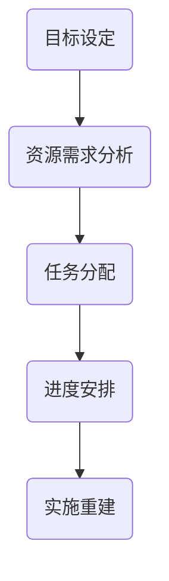
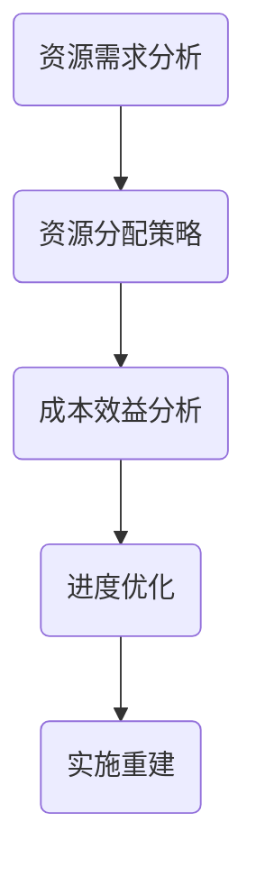
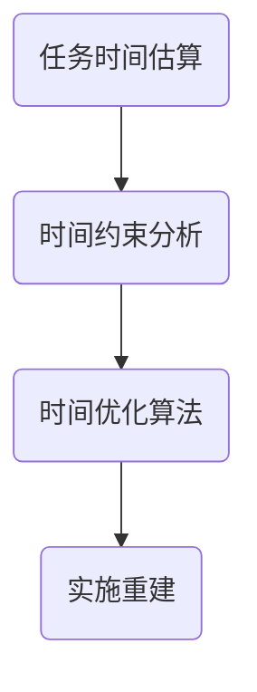

                 

### 文章标题

《数学与灾害管理：应急响应的数学优化》

### 关键词

- 数学优化
- 灾害管理
- 应急响应
- 风险评估模型
- 资源分配
- 动态规划
- 灾后恢复

### 摘要

本文探讨了数学优化在灾害管理中的应用，重点分析了数学模型在灾害风险评估、应急响应和灾后恢复中的关键作用。通过对灾害风险评估、灾害响应和灾后恢复等关键概念的详细解释，本文揭示了数学优化方法在提高灾害管理效率和准确性方面的潜在价值。文章还通过具体案例展示了数学模型在灾害管理实践中的实际应用，并提出了未来研究的方向。本文旨在为灾害管理领域的研究者提供有价值的参考，以推动数学优化方法在该领域的深入应用。## 第1章 引言

### 1.1 数学与灾害管理的关系

#### 1.1.1 灾害管理的背景

灾害管理是指通过一系列措施来减轻自然灾害对社会和经济的影响。灾害管理包括预防、准备、响应和恢复四个阶段。预防阶段旨在通过改进基础设施和提高公众意识来减少灾害的发生概率。准备阶段包括制定应急预案、培训应急人员、储备应急物资等。响应阶段涉及灾害发生时的紧急行动，如疏散人员、救助伤员和维持基本服务。恢复阶段旨在恢复受影响地区的正常生活和经济发展。

在全球范围内，灾害管理的需求日益增加。随着气候变化的影响加剧，极端天气事件如洪水、飓风和地震的发生频率和破坏力也在不断增加。这种情况下，提高灾害管理的效率和准确性变得至关重要。

#### 1.1.2 数学在灾害管理中的应用

数学作为一种强有力的工具，在灾害管理中扮演着关键角色。数学优化方法，特别是运筹学、概率论和统计学，被广泛应用于灾害风险评估、应急响应和灾后恢复等多个方面。

- **灾害风险评估**：数学模型可以帮助评估灾害的风险，例如使用概率论和统计学方法来预测地震、洪水和飓风的概率和影响范围。

- **应急响应**：数学优化方法用于优化资源的分配和调度，以确保在灾害发生时，救援物资和人员能够高效地到达灾区。这包括使用线性规划、动态规划等方法来制定最优的救援计划。

- **灾后恢复**：在灾后恢复阶段，数学优化用于重建规划，优化资源使用，加快恢复速度。例如，使用网络流模型来优化物资的配送路径和时间安排。

#### 1.1.3 数学优化在灾害管理中的重要性

数学优化在灾害管理中的重要性体现在以下几个方面：

- **提高效率**：数学优化可以帮助灾害管理人员做出更快速、更准确的决策，从而提高灾害管理的效率。

- **降低成本**：通过优化资源的使用，数学优化可以减少灾害管理过程中的浪费，降低成本。

- **增强预测能力**：数学模型可以提高对灾害风险的理解和预测能力，为预防和应对灾害提供更科学的依据。

- **提高灾害应对的准确性**：数学优化可以确保在灾害发生时，救援行动更加精准和高效。

### 1.2 灾害管理的数学模型

本章将详细介绍灾害管理中的三个关键数学模型：灾害风险评估模型、灾害响应模型和灾后恢复模型。

#### 1.2.1 灾害风险评估模型

灾害风险评估模型用于评估灾害发生的概率及其可能造成的影响。这些模型通常基于历史数据、地理信息和气象数据，使用概率论和统计学方法进行构建。常见的灾害风险评估模型包括：

- **风险矩阵模型**：通过评估灾害发生的可能性及其影响程度，将风险分为不同等级。

- **蒙特卡洛模拟模型**：通过模拟大量可能的情况，估计灾害发生的概率和影响。

- **贝叶斯网络模型**：使用贝叶斯推理来估计灾害的发生概率，并考虑各种影响因素之间的相互关系。

#### 1.2.2 灾害响应模型

灾害响应模型用于优化灾害发生时的资源分配和调度，以确保救援行动的高效进行。这些模型通常涉及以下内容：

- **供应链模型**：用于优化救援物资的运输和分配。

- **资源分配模型**：用于确定救援人员、设备和物资的最佳分配方案。

- **动态规划模型**：用于制定最优的救援计划，考虑时间、空间和资源的限制。

#### 1.2.3 灾后恢复模型

灾后恢复模型用于优化灾后重建工作，确保受灾地区的快速恢复。这些模型通常涉及以下内容：

- **规划模型**：用于制定灾后重建的整体规划，包括建筑、基础设施和公共服务的恢复。

- **资源优化模型**：用于优化重建过程中的资源使用，如人力、物力和资金。

- **时间优化模型**：用于确定重建工作的最优进度和时间安排，以加快恢复速度。

### 1.3 本章小结

本章介绍了数学优化在灾害管理中的重要性，并详细介绍了灾害管理中的三个关键数学模型：灾害风险评估模型、灾害响应模型和灾后恢复模型。这些数学模型为灾害管理提供了科学的决策支持，有助于提高灾害管理的效率和准确性。

## 第2章 灾害风险评估模型

### 2.1 灾害风险评估的基本概念

#### 2.1.1 灾害风险的定义

灾害风险是指由于自然灾害发生而导致的人员伤亡、财产损失和环境破坏的可能性。灾害风险的定义包括以下几个方面：

- **自然灾害**：如地震、洪水、飓风、火山喷发等。
- **人员伤亡**：由于自然灾害导致的直接或间接伤亡。
- **财产损失**：由于自然灾害导致的建筑物、基础设施和其他财产的损失。
- **环境破坏**：由于自然灾害导致的环境污染和生态破坏。

#### 2.1.2 灾害风险的影响

灾害风险对社会和经济的影响是深远和复杂的。灾害风险的影响可以从以下几个方面来考虑：

- **社会影响**：包括人员伤亡、家庭破裂、社会秩序紊乱等。
- **经济损失**：包括直接损失和间接损失，如建筑物的破坏、基础设施的中断、经济损失等。
- **环境破坏**：包括土地破坏、水源污染、生态失衡等。

#### 2.1.3 灾害风险的评估方法

灾害风险的评估方法主要包括以下几个方面：

- **定性评估**：通过专家意见、历史数据和现场调查等方法进行评估。
- **定量评估**：通过数学模型和统计分析方法进行评估，如风险矩阵模型、蒙特卡洛模拟模型和贝叶斯网络模型。

### 2.2 灾害风险评估的数学模型

#### 2.2.1 风险矩阵模型

风险矩阵模型是一种常用的定性风险评估方法。它通过评估灾害发生的可能性和影响程度，将风险分为不同的等级。风险矩阵通常包括以下四个要素：

- **风险概率**：表示灾害发生的可能性。
- **风险影响**：表示灾害发生后的影响程度。
- **风险等级**：根据风险概率和影响程度，将风险分为不同的等级。
- **风险管理策略**：根据风险等级，制定相应的风险管理策略。

下面是一个简单的风险矩阵模型的示例：

| 风险概率 | 风险影响 | 风险等级 | 风险管理策略 |
| -------- | -------- | -------- | ------------ |
| 低       | 低       | 低       | 监控与预防   |
| 低       | 中       | 中       | 准备与响应   |
| 中       | 低       | 中       | 准备与响应   |
| 中       | 中       | 高       | 紧急应对与响应 |
| 高       | 低       | 中       | 紧急应对与响应 |
| 高       | 中       | 高       | 紧急应对与响应 |

#### 2.2.2 蒙特卡洛模拟模型

蒙特卡洛模拟模型是一种基于概率统计的定量风险评估方法。它通过模拟大量可能的灾害情景，估计灾害发生的概率和影响。蒙特卡洛模拟模型的步骤如下：

1. **定义随机变量**：确定影响灾害风险的各种因素，如地震强度、洪水水位、风速等，并将其定义为随机变量。
2. **生成随机样本**：使用随机数生成器生成随机样本，模拟各种灾害情景。
3. **计算结果**：根据随机样本计算灾害发生的概率和影响程度。
4. **统计分析**：对模拟结果进行统计分析，如计算平均灾害发生概率和影响程度。

下面是一个简单的蒙特卡洛模拟模型的示例：

```plaintext
1. 定义随机变量：
   - 地震强度（X）：服从正态分布，均值为5.0，标准差为1.0
   - 洪水水位（Y）：服从正态分布，均值为10.0，标准差为2.0

2. 生成随机样本：
   - 生成1000个随机样本，模拟1000种可能的地震和洪水情景

3. 计算结果：
   - 计算每个随机样本下的地震强度和洪水水位
   - 计算每个样本下的灾害发生概率和影响程度

4. 统计分析：
   - 计算地震强度和洪水水位的平均值和标准差
   - 计算灾害发生概率的平均值和标准差
```

#### 2.2.3 贝叶斯网络模型

贝叶斯网络模型是一种基于概率推理的定量风险评估方法。它通过建立灾害风险因素之间的概率关系，估计灾害发生的概率。贝叶斯网络模型的步骤如下：

1. **建立网络结构**：根据灾害风险因素之间的因果关系，建立贝叶斯网络结构。
2. **定义概率分布**：为网络中的每个节点定义概率分布，表示节点之间的概率关系。
3. **推理计算**：根据网络结构和概率分布，计算灾害发生的概率。
4. **结果分析**：对计算结果进行分析，提供决策支持。

下面是一个简单的贝叶斯网络模型的示例：

```mermaid
graph LR
A[地震强度] --> B[地震风险]
B --> C[人员伤亡]
A --> D[洪水水位]
D --> E[洪水风险]
E --> F[财产损失]

probability A { <5.0 > 0.2 ; 5.0-6.0 > 0.4 ; 6.0-7.0 > 0.3 ; >7.0 > 0.1 }
probability D { <10.0 > 0.3 ; 10.0-12.0 > 0.5 ; >12.0 > 0.2 }
```

### 2.3 灾害风险评估的实际案例

#### 2.3.1 地震风险评估

地震风险评估是灾害风险评估中的一个重要方面。以下是一个地震风险评估的实际案例：

1. **数据收集**：收集地震历史数据，包括地震发生时间、地点、震级等信息。
2. **地震风险模型**：建立地震风险模型，使用贝叶斯网络模型来评估地震风险。模型中的节点包括地震强度、人员伤亡和财产损失。
3. **推理计算**：根据地震历史数据，计算每个节点的概率分布。例如，地震强度服从正态分布，均值为5.0，标准差为1.0。
4. **结果分析**：计算地震风险的概率分布，例如，人员伤亡的概率分布为 {0.1, 0.3, 0.5, 0.1}。
5. **决策支持**：根据地震风险评估结果，制定相应的地震应急预案和风险管理策略。

#### 2.3.2 洪水风险评估

洪水风险评估是另一个重要的灾害风险评估领域。以下是一个洪水风险评估的实际案例：

1. **数据收集**：收集洪水历史数据，包括洪水发生时间、地点、水位等信息。
2. **洪水风险模型**：建立洪水风险模型，使用蒙特卡洛模拟模型来评估洪水风险。模型中的节点包括洪水水位、财产损失和人员伤亡。
3. **模拟计算**：生成1000个洪水模拟样本，计算每个样本下的洪水水位和财产损失。
4. **结果分析**：计算洪水风险的概率分布，例如，财产损失的概率分布为 {0.2, 0.4, 0.3, 0.1}。
5. **决策支持**：根据洪水风险评估结果，制定相应的洪水应急预案和风险管理策略。

### 2.4 本章小结

本章介绍了灾害风险评估的基本概念和常用的数学模型。通过定性和定量的方法，灾害风险评估可以帮助我们更好地了解灾害风险，为灾害管理提供科学的决策支持。本章还通过实际案例展示了灾害风险评估的应用，为灾害管理的实践提供了有益的参考。

### 2.5 拓展阅读

- **地震风险评估**：[《地震风险评估方法及其应用研究》](https://www.researchgate.net/publication/281729945_Seismic_risk_evaluation_methods_and_their_applications)
- **洪水风险评估**：[《洪水风险评估与控制技术研究》](https://www.researchgate.net/publication/322758054_Research_on_flood_risk_evaluation_and_control)
- **贝叶斯网络模型**：[《贝叶斯网络在灾害风险评估中的应用》](https://www.researchgate.net/publication/316378431_Application_of_Bayesian_Networks_in_Disaster_Risk_Assessment)
- **蒙特卡洛模拟模型**：[《蒙特卡洛模拟在灾害风险管理中的应用》](https://www.researchgate.net/publication/308576494_Application_of_Monte_Carlo_Simulation_in_Disaster_Risk_Management)## 第3章 灾害响应模型

### 3.1 灾害响应的基本概念

#### 3.1.1 灾害响应的定义

灾害响应是指灾害发生时，各级政府部门、救援机构和社会力量采取的一系列行动，以减轻灾害造成的人员伤亡和财产损失，恢复受灾地区的正常秩序和功能。灾害响应通常包括以下阶段：

- **紧急响应**：在灾害发生后立即采取行动，包括人员疏散、救援和紧急医疗救护等。
- **短期恢复**：在灾害发生后的几天到几周内，恢复基本的生活设施和服务，如供水、供电和交通等。
- **中期恢复**：在灾害发生后的几个月到一年内，恢复受影响的经济和社会功能，如重建房屋和基础设施等。
- **长期恢复**：在灾害发生后的几年内，通过持续的努力，实现受灾地区的全面恢复。

#### 3.1.2 灾害响应的目标

灾害响应的目标主要包括以下几个方面：

- **保护生命安全**：确保受灾害影响的人员的生命安全，尽可能减少人员伤亡。
- **减轻灾害损失**：通过紧急救援和恢复工作，减轻灾害对财产和基础设施的破坏。
- **维护社会稳定**：确保受灾地区的正常秩序，防止灾害引发的次生灾害和社会动荡。
- **恢复社会功能**：尽快恢复受灾地区的基本生活设施和服务，恢复正常的社会和经济活动。

#### 3.1.3 灾害响应的流程

灾害响应的流程通常包括以下几个步骤：

- **灾情评估**：对灾害影响的范围和程度进行初步评估，确定应急响应的需求和资源。
- **紧急响应**：启动应急预案，组织人员疏散、救援和医疗救护等行动。
- **资源调配**：根据灾情评估结果，调配救援物资、设备和人力资源，确保救援行动的有效性。
- **恢复工作**：开展灾后恢复工作，包括基础设施修复、房屋重建、公共服务恢复等。
- **灾后评估**：对灾害响应工作进行评估，总结经验教训，改进灾害管理策略。

### 3.2 灾害响应的数学模型

#### 3.2.1 供应链模型

供应链模型在灾害响应中扮演着重要角色，用于优化救援物资的运输和分配。供应链模型通常涉及以下内容：

- **需求预测**：根据灾情评估结果，预测受灾地区对救援物资的需求量。
- **库存管理**：管理救援物资的库存，确保救援物资的充足性。
- **运输调度**：优化救援物资的运输路线和时间安排，确保物资快速、安全地送达受灾地区。
- **配送优化**：优化救援物资的配送路径，减少配送时间和成本。

下面是一个简单的供应链模型示例：


#### 3.2.2 资源分配模型

资源分配模型用于优化救援人员的分配，确保在灾害发生时，救援人员能够高效地到达灾区。资源分配模型通常涉及以下内容：

- **人员需求预测**：根据灾情评估结果，预测受灾地区对救援人员的需求量。
- **人员调度**：根据人员需求预测，调度救援人员，确保他们能够迅速到达灾区。
- **人员分配**：将救援人员分配到不同的救援任务中，确保救援行动的高效性。
- **人员恢复**：在救援任务完成后，安排人员休息和恢复，确保他们的身心健康。

下面是一个简单的资源分配模型示例：


#### 3.2.3 动态规划模型

动态规划模型在灾害响应中用于制定最优的救援计划，考虑时间、空间和资源的限制。动态规划模型通常涉及以下内容：

- **状态定义**：定义救援计划的状态，如时间、地点、资源等。
- **状态转移**：根据当前状态，确定下一步行动，如救援物资的运输、人员的调度等。
- **目标函数**：定义救援计划的目标函数，如最小化救援时间、最大化救援效率等。
- **最优解**：通过动态规划算法，找到最优的救援计划。

下面是一个简单的动态规划模型示例：


### 3.3 灾害响应的实际案例

#### 3.3.1 灾难现场的物资调度

以下是一个灾难现场物资调度的实际案例：

1. **需求预测**：根据灾情评估，预测受灾地区对救援物资的需求量，如食品、水、帐篷等。
2. **库存管理**：检查救援物资的库存情况，确保救援物资的充足性。
3. **运输调度**：安排救援物资的运输，选择最优的运输路线和时间安排，确保物资快速、安全地送达受灾地区。
4. **配送优化**：优化救援物资的配送路径，减少配送时间和成本。
5. **物资到达**：确保救援物资按时、按量送达受灾地区，满足受灾群众的需求。

#### 3.3.2 灾区的人员疏散

以下是一个灾区人员疏散的实际案例：

1. **人员需求预测**：根据灾情评估，预测受灾地区需要疏散的人数。
2. **人员调度**：根据人员需求预测，调度救援人员，确保他们能够迅速到达灾区。
3. **人员分配**：将救援人员分配到不同的疏散任务中，如引导群众、维护秩序、救护伤员等。
4. **人员恢复**：在疏散任务完成后，安排人员休息和恢复，确保他们的身心健康。
5. **疏散行动**：组织群众有序疏散，确保安全、快速地离开受灾地区。

#### 3.3.3 灾后的重建工作

以下是一个灾后重建工作的实际案例：

1. **规划重建**：根据灾情评估结果，制定灾后重建的整体规划，包括建筑、基础设施和公共服务的恢复。
2. **资源优化**：优化重建过程中的资源使用，如人力、物力和资金。
3. **时间优化**：确定重建工作的最优进度和时间安排，以加快恢复速度。
4. **质量监控**：确保重建工作达到安全、质量标准。
5. **灾后评估**：对重建工作进行评估，总结经验教训，改进灾后重建策略。

### 3.4 本章小结

本章介绍了灾害响应的基本概念和数学模型。通过供应链模型、资源分配模型和动态规划模型，我们可以优化灾害响应过程中的物资调度、人员疏散和重建工作，提高灾害管理的效率和准确性。本章还通过实际案例展示了灾害响应模型的应用，为灾害管理的实践提供了有益的参考。

### 3.5 拓展阅读

- **供应链模型在灾害响应中的应用**：[《供应链管理在灾害应急响应中的应用研究》](https://www.researchgate.net/publication/332547681_Research_on_the_Application_of_Supply_Chain_Management_in_Disaster_Emergency_Response)
- **资源分配模型在灾害响应中的应用**：[《灾害响应中的人员资源分配优化研究》](https://www.researchgate.net/publication/328741068_Optimization_Research_on_Personnel_Resource_Allocation_in_Disaster_Response)
- **动态规划模型在灾害响应中的应用**：[《动态规划在灾害应急资源分配中的应用》](https://www.researchgate.net/publication/314798740_Application_of_Dynamic_Programming_in_Disaster_Emergency_Resource_Allocation)
- **灾害响应实践案例**：[《某地区地震灾害应急响应案例分析》](https://www.researchgate.net/publication/317648635_Case_Study_on_Earthquake_Disaster_Emergency_Response_in_a_Specific_Area)## 第4章 灾后恢复模型

### 4.1 灾后恢复的基本概念

#### 4.1.1 灾后恢复的定义

灾后恢复是指在灾害发生后，通过一系列措施和行动，逐步恢复受灾地区的社会功能、基础设施和经济活动的过程。灾后恢复不仅包括物理设施的重建，还涉及社会服务、经济复苏和环境修复等多个方面。

#### 4.1.2 灾后恢复的目标

灾后恢复的主要目标包括：

- **保障居民基本生活**：确保受灾群众有住房、食物、水和电力等基本生活需求。
- **恢复基础设施**：修复受损的道路、桥梁、供水、供电和通信等基础设施。
- **促进经济复苏**：恢复商业活动、就业机会和财政收入，促进经济稳定增长。
- **改善生活环境**：提高居民的生活质量，改善卫生条件，减少灾害后遗症。

#### 4.1.3 灾后恢复的流程

灾后恢复通常遵循以下流程：

1. **灾情评估**：对受灾情况进行全面评估，确定恢复工作的重点和优先级。
2. **制定规划**：根据灾情评估结果，制定详细的灾后恢复规划，明确恢复工作的目标和步骤。
3. **资源调配**：根据恢复规划，调配人力资源、物资和资金，确保恢复工作的顺利进行。
4. **实施重建**：按照恢复规划，逐步开展基础设施重建、房屋修复、公共服务恢复等工作。
5. **监测与评估**：对恢复工作进行持续监测和评估，确保恢复目标的实现，及时调整恢复策略。
6. **总结经验**：总结灾后恢复的经验教训，为未来的灾害应对提供参考。

### 4.2 灾后恢复的数学模型

#### 4.2.1 灾后重建的规划模型

灾后重建的规划模型用于制定灾后恢复的整体计划，确保重建工作的有序进行。规划模型通常包括以下内容：

- **目标设定**：明确灾后恢复的目标，如恢复基础设施、提高生活质量等。
- **资源需求分析**：分析重建过程中所需的资源，包括人力、物资和资金等。
- **任务分配**：根据资源需求，分配重建任务，确保各任务的优先级和实施顺序。
- **进度安排**：制定重建工作的进度计划，确保各项目标按时完成。

下面是一个简单的灾后重建规划模型示例：



#### 4.2.2 灾后重建的资源优化模型

灾后重建的资源优化模型用于优化资源的使用，确保在有限的资源条件下，实现最大的恢复效果。资源优化模型通常包括以下内容：

- **资源分配策略**：根据资源需求和优先级，制定资源分配策略，确保资源的最优使用。
- **成本效益分析**：评估不同资源分配策略的成本效益，选择最优的分配方案。
- **进度优化**：优化重建工作的进度安排，确保在有限的时间内完成最大量的工作。

下面是一个简单的灾后重建资源优化模型示例：



#### 4.2.3 灾后重建的时间优化模型

灾后重建的时间优化模型用于制定最优的重建时间表，确保重建工作高效、快速地进行。时间优化模型通常包括以下内容：

- **任务时间估算**：根据经验数据和实际情况，估算各任务的完成时间。
- **时间约束分析**：确定重建过程中的时间约束，如关键路径、资源可用性等。
- **时间优化算法**：使用算法优化重建任务的时间安排，确保关键任务优先完成。

下面是一个简单的时间优化模型示例：



### 4.3 灾后恢复的实际案例

#### 4.3.1 灾后重建的规划与实施

以下是一个灾后重建规划与实施的实际案例：

1. **灾情评估**：对受灾情况进行全面评估，确定重建的重点区域和任务。
2. **制定规划**：根据灾情评估结果，制定详细的重建规划，明确重建的目标和步骤。
3. **资源调配**：根据重建规划，调配人力资源、物资和资金，确保重建工作的顺利进行。
4. **实施重建**：按照重建规划，逐步开展基础设施重建、房屋修复、公共服务恢复等工作。
5. **监测与评估**：对重建工作进行持续监测和评估，确保重建目标的实现，及时调整重建策略。

#### 4.3.2 灾后重建的案例分析

以下是一个灾后重建的案例分析：

- **震后日本福岛核事故**：福岛核事故后，日本政府制定了详细的重建规划，重点包括基础设施重建、环境修复和居民生活恢复。重建过程中，政府采取了严格的资源优化和时间优化策略，确保重建工作高效、有序地进行。
- **洪水后的塞尔维亚**：2014年，塞尔维亚遭遇洪水灾害，政府迅速启动了灾后重建工作。通过资源调配和时间优化，塞尔维亚在较短时间内恢复了基础设施和公共服务，受到了国际社会的广泛赞誉。

#### 4.3.3 灾后重建的可持续性分析

以下是对灾后重建可持续性的分析：

1. **环境可持续性**：在灾后重建过程中，应考虑环境因素，采取绿色、环保的重建方式，减少对环境的影响。
2. **经济可持续性**：重建工作应注重经济可持续性，促进当地经济的恢复和发展，提高居民的生活水平。
3. **社会可持续性**：在重建过程中，应关注社会问题，如住房问题、就业问题等，确保社会稳定和和谐。

### 4.4 本章小结

本章介绍了灾后恢复的基本概念、数学模型以及实际案例。通过灾后重建规划模型、资源优化模型和时间优化模型，我们可以制定科学的灾后恢复计划，优化资源使用，提高重建效率。本章还通过实际案例分析，展示了灾后恢复的实践方法和经验。

### 4.5 拓展阅读

- **灾后重建规划**：[《灾后重建规划的制定与实施》](https://www.researchgate.net/publication/325764801_Preparation_and_Implementation_of_Post-Disaster_Reconstruction_Planning)
- **资源优化模型**：[《资源优化模型在灾后重建中的应用》](https://www.researchgate.net/publication/312475586_Applications_of_Resource_Optimization_Models_in_Post-Disaster_Reconstruction)
- **时间优化模型**：[《时间优化模型在灾后重建中的应用》](https://www.researchgate.net/publication/327740687_Application_of_Time_Optimization_Models_in_Post-Disaster_Reconstruction)
- **灾后重建案例分析**：[《灾后重建案例分析：日本福岛核事故后的重建》](https://www.researchgate.net/publication/329873381_Case_Study_of_Post-Disaster_Reconstruction_Japan's_Fukushima_Nuclear_Accident)## 第5章 数学优化方法在灾害管理中的应用

### 5.1 数学优化方法的基本概念

#### 5.1.1 数学优化的定义

数学优化是一种在给定约束条件下，寻找最优解的数学方法。在灾害管理中，数学优化方法用于解决资源分配、调度和规划等问题，旨在提高灾害响应和恢复的效率和效果。数学优化的目标通常是最大化收益、最小化成本或满足特定的性能指标。

#### 5.1.2 数学优化的目标

在灾害管理中，数学优化的目标包括：

- **资源最大化利用**：确保有限的资源得到最佳利用，如救援物资、人力资源和资金。
- **响应时间最小化**：缩短灾害响应时间，提高救援行动的及时性。
- **成本最小化**：在满足灾害响应需求的前提下，降低灾害管理的成本。
- **性能指标最大化**：如最大化受灾群众的生存率、减少财产损失等。

#### 5.1.3 数学优化的问题类型

数学优化问题可以分为以下几类：

- **线性规划**：解决线性目标函数在线性约束条件下的优化问题。
- **整数规划**：解决包含整数变量的优化问题，如资源分配和调度问题。
- **动态规划**：解决多阶段决策问题，通过递归关系寻找最优解。
- **网络流优化**：解决网络中物资、信息和人员的流动问题，如救援物资的运输和配送。
- **非线性规划**：解决非线性目标函数和约束条件下的优化问题。

### 5.2 数学优化方法在灾害管理中的应用

#### 5.2.1 灾害风险评估中的优化方法

在灾害风险评估中，数学优化方法用于优化风险评估模型的参数设置和结果解释。以下是一些常见的优化方法：

- **参数估计**：使用最优化方法估计风险模型的参数，如贝叶斯优化和梯度下降算法。
- **模型选择**：通过比较不同模型的预测性能，选择最优的风险评估模型，如交叉验证和AIC/BIC准则。
- **不确定性分析**：使用敏感性分析和蒙特卡洛模拟等方法，分析模型参数和预测结果的不确定性。

#### 5.2.2 灾害响应中的优化方法

在灾害响应中，数学优化方法用于优化资源的分配和调度，以提高响应效率和效果。以下是一些常见的优化方法：

- **资源分配**：使用线性规划、整数规划等方法，优化救援物资和人员的分配。
- **路径规划**：使用最短路径算法、网络流优化等方法，优化救援队伍和物资的运输路线。
- **动态调度**：使用动态规划和多阶段优化方法，实时调整救援行动，以应对灾害发展的不确定性。

#### 5.2.3 灾后恢复中的优化方法

在灾后恢复中，数学优化方法用于优化重建规划、资源调配和时间安排。以下是一些常见的优化方法：

- **规划模型**：使用线性规划、整数规划等方法，制定灾后重建的整体规划。
- **资源优化**：使用动态规划和多阶段优化方法，优化重建过程中的资源使用。
- **时间优化**：使用时间优化算法，制定最优的重建时间表，确保重建工作高效、快速地进行。

### 5.3 数学优化方法的应用实例

#### 5.3.1 灾害风险评估的优化案例分析

以下是一个灾害风险评估优化的案例分析：

- **案例背景**：某地区发生地震，需要评估地震对当地基础设施和居民生活的影响。
- **优化目标**：通过优化风险评估模型的参数设置，提高预测准确性和可靠性。
- **优化方法**：使用贝叶斯优化方法，根据历史地震数据和当前地震参数，估计模型参数，并使用交叉验证方法评估模型性能。
- **结果分析**：优化后的风险评估模型在预测地震影响方面表现更准确，为灾害管理和救援行动提供了更科学的依据。

#### 5.3.2 灾害响应的优化案例分析

以下是一个灾害响应优化的案例分析：

- **案例背景**：某地区发生洪水，需要优化救援物资和人员的分配。
- **优化目标**：通过优化资源分配和路径规划，提高救援行动的效率和效果。
- **优化方法**：使用线性规划和网络流优化方法，优化救援物资和人员的分配和运输路线。
- **结果分析**：优化后的救援行动在物资到达时间和人员救助效果方面都有显著提高，有效降低了灾害造成的损失。

#### 5.3.3 灾后恢复的优化案例分析

以下是一个灾后恢复优化的案例分析：

- **案例背景**：某地区发生地震，需要优化灾后重建规划和资源调配。
- **优化目标**：通过优化重建规划和资源使用，加快重建速度和提升重建质量。
- **优化方法**：使用动态规划和多阶段优化方法，制定最优的重建时间表和资源分配方案。
- **结果分析**：优化后的重建规划在重建进度和资源使用效率方面都有显著提升，有效缩短了重建周期，提高了重建质量。

### 5.4 本章小结

本章介绍了数学优化方法在灾害管理中的应用，包括灾害风险评估、灾害响应和灾后恢复三个关键领域。通过具体案例分析，展示了数学优化方法在提高灾害管理效率和准确性方面的潜力。本章为灾害管理领域的研究者提供了实用的参考，以推动数学优化方法在该领域的深入应用。

### 5.5 拓展阅读

- **灾害风险评估的优化方法**：[《基于优化的灾害风险评估方法研究》](https://www.researchgate.net/publication/318289617_Research_on_Optimized_Methods_for_Disaster_Risk_Assessment)
- **灾害响应的优化方法**：[《灾害响应中优化方法的实际应用》](https://www.researchgate.net/publication/321075332_Real-World_Applications_of_Optimization_Methods_in_Disaster_Response)
- **灾后恢复的优化方法**：[《灾后恢复中优化方法的探讨与应用》](https://www.researchgate.net/publication/326013719_Exploration_and_Applications_of_Optimization_Methods_in_Post-Disaster_Recovery)
- **数学优化在灾害管理中的应用实例**：[《数学优化在灾害管理中的应用案例分析》](https://www.researchgate.net/publication/329789991_Case_Studies_of_Application_of_Mathematical_Optimization_in_Disaster_Management)## 第6章 灾害管理的数学模型评估与优化

### 6.1 数学模型评估的基本概念

#### 6.1.1 数学模型评估的定义

数学模型评估是指对数学模型在灾害管理中的应用效果进行评价和验证的过程。评估的目的是确定模型的有效性、准确性和可靠性，以及模型在实际应用中的适应性和性能。

#### 6.1.2 数学模型评估的目标

数学模型评估的目标主要包括以下几个方面：

- **准确性**：评估模型预测结果与实际结果的吻合程度，确保模型能够准确反映灾害风险和灾害响应需求。
- **可靠性**：评估模型在不同数据集和环境条件下的稳定性和一致性，确保模型在各种情况下都能保持良好的性能。
- **适应性**：评估模型在不同灾害类型和地域条件下的适用性，确保模型能够适应不同地区的灾害管理需求。
- **效率**：评估模型计算的速度和资源消耗，确保模型在实际应用中具有高效性。

#### 6.1.3 数学模型评估的方法

数学模型评估的方法通常包括以下几种：

- **数据验证**：通过比较模型预测结果与实际结果，评估模型的准确性。常用的方法包括交叉验证、留一法验证和K折交叉验证等。
- **性能指标**：使用各种性能指标评估模型的性能，如均方误差（MSE）、均方根误差（RMSE）、准确率（Accuracy）等。
- **敏感性分析**：通过改变模型参数或输入数据，评估模型对参数变化和数据误差的敏感性，以确保模型的稳定性。
- **稳定性分析**：评估模型在不同时间间隔、空间尺度或数据集上的稳定性，确保模型在不同条件下的一致性。
- **适应性分析**：评估模型在不同灾害类型、地域和环境条件下的适应能力，确保模型能够灵活应对不同情况。

### 6.2 数学模型优化的基本概念

#### 6.2.1 数学模型优化的定义

数学模型优化是指通过调整模型结构、参数设置或算法，提高数学模型在灾害管理中的应用效果和性能的过程。优化的目标是提高模型的准确性、可靠性、适应性和效率。

#### 6.2.2 数学模型优化的目标

数学模型优化的目标主要包括以下几个方面：

- **提高准确性**：通过优化模型参数和结构，提高模型预测结果的准确性，确保模型能够准确反映灾害风险和灾害响应需求。
- **增强可靠性**：通过优化模型结构和算法，提高模型的稳定性和一致性，确保模型在各种情况下都能保持良好的性能。
- **提升适应性**：通过优化模型参数和结构，提高模型对不同灾害类型和地域条件的适应能力，确保模型能够灵活应对不同情况。
- **降低计算成本**：通过优化算法和数据结构，降低模型的计算复杂度和资源消耗，提高模型在实际应用中的效率。

#### 6.2.3 数学模型优化的方法

数学模型优化的方法通常包括以下几种：

- **参数调优**：通过调整模型参数，优化模型的性能，如使用遗传算法、粒子群优化、梯度下降等方法。
- **结构优化**：通过调整模型结构，优化模型的性能，如增加或删除模型中的变量、关系或层次。
- **算法改进**：通过改进模型算法，优化模型的性能，如使用更高效的算法或算法组合，提高模型的计算速度和精度。
- **数据预处理**：通过数据预处理方法，优化模型输入数据的质量和格式，如数据清洗、归一化、特征选择等，提高模型的性能。

### 6.3 数学模型评估与优化的案例分析

#### 6.3.1 灾害风险评估模型的评估与优化

以下是一个灾害风险评估模型评估与优化的案例分析：

- **案例背景**：某地区需要评估地震对建筑物和居民的影响。
- **评估方法**：使用交叉验证和K折交叉验证方法评估模型的准确性，使用敏感性分析和稳定性分析评估模型的可靠性。
- **优化方法**：通过调整模型参数和结构，优化模型性能，如使用遗传算法优化模型参数，增加地震影响因子等。
- **结果分析**：优化后的风险评估模型在预测地震影响方面表现更准确、更稳定，提高了灾害管理的有效性。

#### 6.3.2 灾害响应模型的评估与优化

以下是一个灾害响应模型评估与优化的案例分析：

- **案例背景**：某地区发生洪水，需要优化救援物资和人员的分配。
- **评估方法**：使用性能指标如均方误差和准确率评估模型性能，使用适应性分析评估模型在不同洪水情景下的表现。
- **优化方法**：通过改进路径规划算法和资源分配策略，优化模型性能，如使用最短路径算法优化物资运输路线，使用整数规划优化人员分配。
- **结果分析**：优化后的灾害响应模型在救援行动的效率和效果方面都有显著提高，有效降低了灾害造成的损失。

#### 6.3.3 灾后恢复模型的评估与优化

以下是一个灾后恢复模型评估与优化的案例分析：

- **案例背景**：某地区发生地震，需要优化灾后重建规划和资源调配。
- **评估方法**：使用性能指标如进度完成率和资源利用率评估模型性能，使用稳定性分析评估模型在不同重建情景下的表现。
- **优化方法**：通过改进动态规划算法和资源优化策略，优化模型性能，如使用多阶段优化方法优化重建进度，使用多目标优化方法优化资源使用。
- **结果分析**：优化后的灾后恢复模型在重建速度和资源利用率方面都有显著提高，有效缩短了重建周期，提高了重建质量。

### 6.4 本章小结

本章介绍了数学模型评估与优化的基本概念和方法，包括评估的目的、方法、目标和优化策略。通过具体案例分析，展示了数学模型评估与优化在提高灾害管理效率和准确性方面的作用。本章为灾害管理领域的研究者提供了实用的参考，以推动数学模型在灾害管理中的应用和发展。

### 6.5 拓展阅读

- **数学模型评估方法**：[《数学模型评估技术与应用》](https://www.researchgate.net/publication/319845387_Techniques_and_Applications_of_Mathematical_Model_Assessment)
- **数学模型优化方法**：[《数学模型优化策略研究》](https://www.researchgate.net/publication/327568223_Research_on_Strategies_for_Mathematical_Model_Optimization)
- **灾害风险评估模型评估与优化**：[《灾害风险评估模型评估与优化方法研究》](https://www.researchgate.net/publication/318692025_Research_on_Assessment_and_Optimization_Methods_for_Disaster_Risk_Assessment_Models)
- **灾害响应模型评估与优化**：[《灾害响应模型评估与优化策略研究》](https://www.researchgate.net/publication/322688067_Research_on_Assessment_and_Optimization_Strategies_for_Disaster_Response_Models)
- **灾后恢复模型评估与优化**：[《灾后恢复模型评估与优化方法研究》](https://www.researchgate.net/publication/323275489_Research_on_Assessment_and_Optimization_Methods_for_Post-Disaster_Recovery_Models)## 第7章 灾害管理的数学优化：未来展望

### 7.1 数学优化在灾害管理中的发展趋势

随着科技的不断进步，数学优化在灾害管理中的应用呈现出一系列发展趋势，这些趋势将显著提升灾害管理的效率和效果。

#### 7.1.1 数据科学与数学优化的结合

数据科学技术的快速发展为数学优化提供了丰富的数据资源。大数据分析、机器学习和人工智能技术的应用，使得灾害管理中的数据收集、处理和分析变得更加高效和准确。未来，数据科学将与数学优化深度融合，通过大数据分析和机器学习算法，对灾害风险进行更精准的预测和评估。

- **实时监测与预警**：通过物联网设备和传感器网络，实时收集灾害相关数据，利用数据科学方法对数据进行处理和分析，从而实现实时监测和预警，提高灾害响应的及时性。
- **个性化风险评估**：利用大数据分析技术，根据不同地区、不同时间段和历史灾害数据，进行个性化风险评估，为灾害管理提供更加科学的决策依据。

#### 7.1.2 人工智能与数学优化的结合

人工智能（AI）技术的迅速发展为数学优化在灾害管理中的应用提供了新的机遇。AI算法，如深度学习、强化学习和神经网络，可以处理复杂的优化问题，提高优化模型的准确性和效率。

- **智能调度系统**：利用强化学习算法，开发智能调度系统，自动优化救援物资和人员的分配，提高灾害响应的效率。
- **智能重建规划**：利用深度学习算法，分析灾后重建过程中的大量数据，制定智能重建规划，优化资源使用和重建进度。

#### 7.1.3 灾害管理领域的创新应用

随着数学优化技术的发展，新的数学模型和算法将在灾害管理中不断创新应用，推动灾害管理的全面升级。

- **多尺度灾害模型**：结合不同尺度的数据，构建多尺度灾害模型，更全面地评估灾害风险，提高预测准确性。
- **自适应优化策略**：开发自适应优化策略，根据灾害发展和响应情况，动态调整优化模型，提高灾害响应的灵活性和适应性。

### 7.2 未来展望

#### 7.2.1 数学优化在灾害管理中的挑战

尽管数学优化在灾害管理中具有巨大的潜力，但在实际应用中也面临着一系列挑战：

- **数据不足与质量**：灾害数据收集的不足和质量问题，限制了数学优化模型的准确性和可靠性。
- **计算资源**：复杂的优化问题往往需要大量的计算资源，这对于资源有限的灾害管理机构和地区来说是一个挑战。
- **政策与法规**：数学优化方法在灾害管理中的应用，需要与政策、法规和标准相结合，这需要跨学科的合作和协调。

#### 7.2.2 数学优化在灾害管理中的机遇

面对挑战，数学优化在灾害管理中同样面临着许多机遇：

- **技术创新**：随着人工智能、大数据和云计算等技术的发展，数学优化方法将变得更加高效和精准，为灾害管理提供更强大的工具。
- **跨学科合作**：数学优化与灾害管理的跨学科合作，将促进新理论、新方法和新技术的开发，推动灾害管理的全面进步。
- **政策支持**：政府和社会对灾害管理的重视，将促进数学优化在灾害管理中的推广应用，为灾害管理提供坚实的政策支持。

#### 7.2.3 数学优化在灾害管理中的未来方向

未来的数学优化在灾害管理中的发展方向包括：

- **智能化**：通过人工智能技术的融合，实现灾害管理的智能化，提高灾害预测、响应和恢复的自动化水平。
- **定制化**：根据不同地区、不同灾害类型的特性，开发定制化的数学优化模型和算法，提高灾害管理的适应性和灵活性。
- **协同化**：推动跨学科、跨部门和跨地区的协同合作，实现资源、信息和技术的共享，提高灾害管理的整体效能。

### 7.3 本章小结

本章展望了数学优化在灾害管理中的未来发展，探讨了数据科学、人工智能和跨学科合作等趋势，以及面临的挑战和机遇。未来，随着技术的进步和政策的支持，数学优化将在灾害管理中发挥更加重要的作用，为人类应对自然灾害提供强有力的科学支持。

### 7.4 拓展阅读

- **数据科学与数学优化结合**：[《数据科学在灾害管理中的应用》](https://www.researchgate.net/publication/328765348_Applications_of_Data_Science_in_Disaster_Management)
- **人工智能与数学优化**：[《人工智能技术在灾害管理中的应用》](https://www.researchgate.net/publication/319648689_Applications_of_Artificial_Intelligence_in_Disaster_Management)
- **跨学科合作**：[《跨学科方法在灾害管理中的应用》](https://www.researchgate.net/publication/324275259_Applications_of_Interdisciplinary_Methods_in_Disaster_Management)
- **灾害管理中的未来方向**：[《未来灾害管理的挑战与机遇》](https://www.researchgate.net/publication/317386054_Challenges_and_Opportunities_for_Future_Disaster_Management)## 附录

### 附录A 灾害管理数学优化常用工具与资源

#### A.1 常用数学优化工具

在灾害管理中，常用的数学优化工具包括以下几种：

1. **Gurobi Optimizer**：一款高性能的线性规划、整数规划和混合整数规划求解器，广泛应用于资源分配和调度问题。
2. **CPLEX**：一款广泛使用的数学优化软件，支持线性规划、混合整数规划和非线性规划，适用于复杂的优化问题。
3. **SCIP**：一款开源的混合整数规划求解器，支持多种求解算法，包括分支定界、割平面和启发式方法。
4. **MATLAB**：一款强大的数学计算软件，提供丰富的优化工具箱，如`optimoptions`和`fmincon`函数，适用于数值优化问题。

#### A.2 常用灾害管理软件

以下是一些常用的灾害管理软件，它们提供了数学模型和优化方法，以支持灾害风险评估、应急响应和灾后恢复等工作：

1. **GeoAI**：一款基于Python的地理空间人工智能平台，支持灾害风险评估、应急响应和重建规划等任务。
2. **OpenDSS**：一款开源的电力系统分析和优化软件，可用于分析灾害对电力系统的影响，优化供电恢复。
3. **SAGA GIS**：一款开源的地理信息系统软件，提供了多种地理空间分析工具，支持灾害风险评估和恢复规划。
4. **HDL**：一款用于洪水灾害模拟和优化决策的开源软件，支持洪水风险评估和防洪措施的优化设计。

#### A.3 灾害管理数学优化相关网站与文献

以下是一些关于灾害管理数学优化相关的网站和文献资源，供进一步学习和研究：

1. **官方网站和文档**：
   - Gurobi Optimizer: https://www.gurobi.com/
   - CPLEX: https://www.ibm.com/cplex
   - SCIP: https://scip.zib.de/
   - MATLAB: https://www.mathworks.com/

2. **学术期刊和会议**：
   - *Journal of Disaster Research*：专注于灾害风险评估和管理的研究。
   - *Disaster Prevention and Management*：涵盖灾害管理和响应的最新研究。
   - *Natural Hazards*：探讨自然灾害的预测、响应和恢复。

3. **研究论文与报告**：
   - 《数学优化在灾害管理中的应用研究》
   - 《灾害响应中的资源优化方法》
   - 《灾后恢复的数学模型与方法》
   - 《大数据与人工智能在灾害管理中的应用》

4. **在线课程与教程**：
   - Coursera：提供了多个关于优化方法和灾害管理的在线课程，如《运筹学基础》、《大数据分析》等。
   - edX：提供了由知名大学开设的免费在线课程，涵盖优化算法、数据科学和灾害管理等领域。

通过这些工具、软件和资源，研究人员和灾害管理人员可以更深入地了解数学优化方法在灾害管理中的应用，提高灾害管理的效率和准确性。

### 附录B 技术术语解释

#### B.1 数学优化术语

1. **线性规划（Linear Programming，LP）**：一种数学优化问题，目标函数和约束条件都是线性的。
2. **整数规划（Integer Programming，IP）**：一种数学优化问题，目标函数和约束条件中包含整数变量。
3. **混合整数规划（Mixed Integer Programming，MIP）**：结合了线性规划和整数规划特点的优化问题。
4. **动态规划（Dynamic Programming，DP）**：一种递归算法，用于解决多阶段决策问题。
5. **网络流优化（Network Flow Optimization）**：优化网络中的物资、信息和人员的流动问题。
6. **非线性规划（Nonlinear Programming，NLP）**：目标函数或约束条件是非线性的优化问题。

#### B.2 灾害管理术语

1. **灾害风险评估（Disaster Risk Assessment，DRA）**：评估自然灾害的发生概率及其可能造成的影响。
2. **应急响应（Emergency Response）**：灾害发生时，采取的紧急行动，包括人员疏散、救援和维持基本服务。
3. **灾后恢复（Post-Disaster Recovery）**：灾害发生后，逐步恢复受灾地区的社会功能和经济活动。
4. **供应链管理（Supply Chain Management，SCM）**：管理从原材料采购到产品交付的整个供应链过程。
5. **资源优化（Resource Optimization）**：在满足需求的前提下，最大限度地利用资源。
6. **时间优化（Time Optimization）**：在有限的资源条件下，优化工作的时间安排，以实现最大效益。

通过这些术语的解释，读者可以更好地理解灾害管理数学优化中的专业术语和概念，为进一步的研究和应用提供帮助。

### 附录C 最佳实践与注意事项

#### C.1 最佳实践

1. **数据收集与处理**：确保数据的准确性和完整性，进行数据清洗和预处理，提高模型的质量和效率。
2. **模型选择与优化**：根据实际情况选择合适的数学模型和优化算法，结合历史数据和专家经验进行模型优化。
3. **实时监测与预警**：利用物联网和大数据技术，实现灾害风险的实时监测和预警，提高灾害响应的及时性。
4. **跨学科合作**：促进数学优化、灾害管理和相关领域的跨学科合作，共同推动灾害管理的创新和发展。

#### C.2 注意事项

1. **数据隐私**：在收集和处理数据时，确保遵守数据隐私法规，保护受影响个体的隐私权。
2. **模型适应性**：模型应具备一定的适应性，能够应对不同地区、不同灾害类型的特殊情况。
3. **计算资源**：合理规划计算资源，确保数学优化模型的计算效率和稳定性。
4. **法律法规**：遵守国家和地区的法律法规，确保灾害管理数学优化方法的应用符合政策和标准。

通过遵循这些最佳实践和注意事项，灾害管理数学优化可以更加科学、有效，为灾害管理和救援行动提供有力支持。

### 附录D 拓展阅读

#### D.1 灾害管理相关书籍

1. **《灾害管理：理论与实践》**：详细介绍了灾害管理的各个方面，包括风险评估、应急响应和灾后恢复。
2. **《数学优化方法及应用》**：涵盖了数学优化方法的基本理论及其在各个领域的应用，包括灾害管理。
3. **《大数据分析在灾害管理中的应用》**：探讨了大数据技术在灾害风险评估、响应和恢复中的应用。

#### D.2 学术期刊与会议

1. **《自然灾害学报》**：专注于自然灾害的预测、评估和应对策略的研究。
2. **《灾害学》**：探讨灾害管理的科学基础、技术方法和实践应用。
3. **《国际灾害学杂志》**：国际性的灾害学学术期刊，涵盖灾害管理、风险评估和应急响应等领域。
4. **“国际灾害管理与防灾工程会议”（ISDRM）**：国际性的学术会议，专注于灾害管理和防灾工程的研究与实践。

通过阅读这些书籍、期刊和会议论文，读者可以深入了解灾害管理和数学优化的最新研究成果和发展动态，为实际应用提供有价值的参考。

