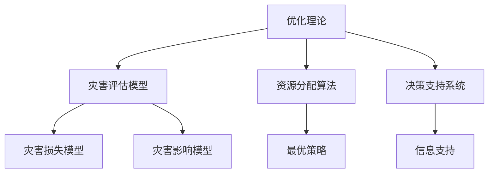

                 

### 引言

灾害管理是一个复杂且至关重要的领域，关系到公共安全和社会稳定。随着全球气候变化和自然灾害频发的趋势日益明显，灾害管理的重要性愈发凸显。传统的灾害管理往往依赖于经验和直觉，但随着信息技术和数学模型的不断发展，现代灾害管理正在向更加科学和系统化的方向转变。数学在灾害管理中的应用，特别是优化理论的应用，成为提升灾害响应效率和效果的关键。

本文旨在探讨数学与灾害管理之间的关系，尤其是数学优化在灾害响应中的应用。文章将从以下几个方面展开讨论：

1. **核心概念与联系**：首先，我们将设计一个Mermaid流程图，展示灾害管理中的核心概念及其相互之间的联系，如优化理论、灾害评估模型、决策支持系统等。
2. **核心算法原理讲解**：接下来，我们将使用伪代码详细阐述灾害响应中的关键算法原理，包括灾害风险评估算法、资源分配算法等。
3. **数学模型和数学公式**：我们将设计数学模型来解释灾害管理中的关键问题，并使用LaTeX格式展示这些公式。
4. **项目实战**：我们将设计一个灾害响应项目案例，展示如何使用数学模型和算法来应对灾害。
5. **实际灾害响应案例分析**：通过实际案例，我们将深入剖析数学优化在灾害响应中的具体应用。
6. **总结与展望**：最后，我们将总结文章的主要观点，并探讨未来灾害管理的发展趋势。

通过上述讨论，我们希望读者能够理解数学优化在灾害管理中的重要地位，并掌握相关理论和方法，为提高灾害响应能力提供有力支持。

### 文章关键词

- 灾害管理
- 数学优化
- 灾害风险评估
- 资源分配
- 决策支持系统
- Mermaid流程图
- 伪代码
- 数学模型
- 实际案例分析

### 文章摘要

本文深入探讨了数学优化在灾害管理中的应用。首先，通过设计一个Mermaid流程图，我们展示了灾害管理中的核心概念及其相互联系。随后，使用伪代码详细讲解了灾害响应中的关键算法原理，包括灾害风险评估和资源分配算法。接着，我们设计了数学模型，并通过LaTeX格式展示了相关公式。在此基础上，我们通过一个灾害响应项目案例，展示了如何实际应用数学模型和算法。最后，我们通过实际案例分析和总结，强调了数学优化在提高灾害响应效率和效果中的重要性，并探讨了未来的发展趋势。

### 数学与灾害管理的基础

在探讨数学优化在灾害管理中的应用之前，我们需要了解一些基础概念和背景信息。灾害管理是一个涉及多个学科领域的复杂过程，包括风险评估、资源分配、决策制定等。数学作为一门具有严谨逻辑和高度抽象能力的学科，能够在灾害管理的各个环节提供有效的工具和方法。

#### 优化理论

优化理论是数学中的一个重要分支，主要研究如何通过系统的分析和计算，找到在一定约束条件下使目标函数达到最大或最小值的方法。在灾害管理中，优化理论可以帮助决策者确定最优的应对策略，以达到最大的响应效果。例如，灾害风险评估中，可以通过优化模型来确定哪些区域需要优先救助，资源分配中，可以通过优化算法来合理配置救援资源。

#### 灾害评估模型

灾害评估模型是灾害管理的基础，它通过量化和分析灾害的影响程度，为决策提供依据。常见的灾害评估模型包括灾害损失模型、灾害影响模型等。灾害损失模型通常用于预测灾害发生后的经济损失，而灾害影响模型则用于评估灾害对人类活动和生态环境的影响。这些模型通过数学公式和计算方法，将灾害的风险和影响量化为具体的数值，从而为优化决策提供数据支持。

#### 决策支持系统

决策支持系统（Decision Support System，简称DSS）是一种基于计算机技术的系统，旨在帮助决策者分析问题、制定决策。在灾害管理中，DSS可以集成灾害评估模型、优化算法和其他相关工具，为决策者提供全面的信息支持和分析结果。通过DSS，决策者可以在复杂的灾害情境中快速制定有效的应对策略。

#### Mermaid流程图

为了更好地展示这些核心概念及其相互联系，我们可以使用Mermaid流程图。以下是示例流程图的定义：



该流程图清晰地展示了优化理论、灾害评估模型、资源分配算法和决策支持系统之间的相互关系。通过这样的图形化展示，可以帮助读者更直观地理解各个概念之间的联系和作用。

#### 总结

通过对灾害管理的基础知识的介绍，我们为后续深入探讨数学优化在灾害管理中的应用奠定了基础。在接下来的部分，我们将详细讲解优化理论在灾害响应中的应用，并通过具体算法和模型展示其工作原理和实际应用。

### 灾害风险评估与建模

灾害风险评估是灾害管理中至关重要的一环，它旨在通过对潜在灾害的评估，为制定合理的响应策略提供科学依据。数学模型在灾害风险评估中的应用，可以显著提高评估的准确性和可靠性。

#### 1. 灾害风险评估的重要性

灾害风险评估不仅有助于提前识别灾害风险，还能为灾害响应提供关键信息。通过评估，可以确定哪些区域或设施最容易受到灾害影响，从而采取有针对性的预防措施。同时，灾害风险评估还可以为资源分配和应急响应规划提供科学依据，确保有限的资源能够被最有效地利用。

#### 2. 常见评估方法

灾害风险评估的方法多种多样，包括定性评估和定量评估。定性评估通常依赖于专家意见和经验，而定量评估则更多地依赖数学模型和统计数据。以下是一些常见的评估方法：

- **灾害概率评估**：通过历史数据和统计分析，预测未来一定时期内某区域发生特定灾害的概率。
- **灾害损失评估**：评估灾害发生时可能造成的直接经济损失，包括建筑物破坏、基础设施损坏等。
- **灾害影响评估**：评估灾害对人类活动、社会秩序和生态环境的影响，包括人员伤亡、社会成本和环境损害等。

#### 3. 数学模型在灾害评估中的应用

数学模型在灾害评估中的应用，可以显著提高评估的精度和效率。以下是一些常用的数学模型及其应用场景：

- **贝叶斯网络模型**：贝叶斯网络是一种基于概率论的图形模型，可用于描述灾害发生的因果关系。例如，可以构建一个贝叶斯网络模型，描述地震引发海啸的概率及其对沿海城市的影响。

  **示例伪代码**：
  ```python
  def BayesianNetwork():
      # 初始化贝叶斯网络
      network = BayesianNetwork()
      
      # 添加节点和边
      network.add_node('Earthquake')
      network.add_node('Tsunami')
      network.add_node('CityDamage')
      
      network.add_edge('Earthquake', 'Tsunami')
      network.add_edge('Tsunami', 'CityDamage')
      
      # 设置概率分布
      network.set_probability('Earthquake', p_earthquake)
      network.set_probability('Tsunami', p_tsunami_given_earthquake)
      network.set_probability('CityDamage', p_city_damage_given_tsunami)
      
      return network
  ```

- **多目标优化模型**：多目标优化模型用于同时考虑多个目标，如资源利用率、响应时间等。通过优化模型，可以找到最优的应对策略。例如，可以构建一个多目标优化模型，优化救援资源的分配，以最小化响应时间并最大化资源利用率。

  **示例伪代码**：
  ```python
  def MultiObjectiveOptimization():
      # 初始化多目标优化模型
      model = MultiObjectiveOptimization()
      
      # 定义目标函数
      model.add_objective('MinimizeResponseTime')
      model.add_objective('MaximizeResourceUtilization')
      
      # 定义约束条件
      model.add_constraint('ResourceLimit')
      model.add_constraint('TimeConstraint')
      
      # 求解优化问题
      solution = model.solve()
      
      return solution
  ```

- **时空模型**：时空模型用于描述灾害发生、发展和响应的时空特征。例如，可以使用时空模型分析地震波传播路径，评估不同地区受到地震影响的时间和程度。

  **示例伪代码**：
  ```python
  def SpatialTemporalModel():
      # 初始化时空模型
      model = SpatialTemporalModel()
      
      # 设置地震波传播速度
      model.set_wave_speed(v_wave_speed)
      
      # 设置初始地震位置和时间
      model.set_earthquake_location(x_earthquake, y_earthquake)
      model.set_earthquake_time(t_earthquake)
      
      # 模拟地震波传播
      model.simulate_wave_propagation()
      
      return model.get_impact_map()
  ```

#### 4. 数学公式的应用

在灾害评估中，数学公式被广泛应用于计算灾害概率、损失和影响。以下是一些常见的数学公式及其应用：

- **灾害概率公式**：
  \[
  P(D|E) = \frac{P(E|D) \cdot P(D)}{P(E)}
  \]
  其中，\(P(D|E)\)表示在给定灾害发生条件下某区域受灾的概率，\(P(E|D)\)表示灾害发生条件下某区域受灾的条件概率，\(P(D)\)和\(P(E)\)分别为灾害发生的概率和某区域的受灾概率。

- **灾害损失公式**：
  \[
  L = \sum_{i=1}^{n} C_i \cdot D_i
  \]
  其中，\(L\)表示总损失，\(C_i\)表示第\(i\)类设施的损失值，\(D_i\)表示第\(i\)类设施的数量。

- **灾害影响公式**：
  \[
  I = \sum_{i=1}^{m} W_i \cdot C_i
  \]
  其中，\(I\)表示总影响，\(W_i\)表示第\(i\)类设施的影响权重，\(C_i\)表示第\(i\)类设施的损失值。

#### 5. 举例说明

假设某地区在地震后进行灾害评估，使用贝叶斯网络模型进行灾害影响评估。根据历史数据和专家意见，设定以下参数：

- 地震概率：\(P(E) = 0.05\)
- 地震引发海啸的概率：\(P(T|E) = 0.8\)
- 海啸导致城市损坏的概率：\(P(C|T) = 0.9\)

根据这些参数，可以计算城市受灾的概率：

\[
P(C) = P(C|T) \cdot P(T|E) \cdot P(E) + P(C|\neg T) \cdot P(\neg T|E) \cdot P(E) + P(C|T) \cdot P(T|\neg E) \cdot P(\neg E) + P(C|\neg T) \cdot P(\neg T|\neg E) \cdot P(\neg E)
\]

简化计算后，得到：

\[
P(C) = 0.72
\]

这表明，在给定地震发生的条件下，该城市受灾的概率为72%。

通过上述分析和计算，我们可以看到数学模型在灾害评估中的应用。这些模型不仅提供了科学的方法来评估灾害风险和影响，还为实现灾害响应的优化提供了坚实基础。

### 灾害响应策略优化

在灾害发生后，如何迅速有效地进行响应是确保减少损失和影响的关键。数学优化在这一过程中扮演了至关重要的角色，通过科学合理的优化策略，可以大幅提高灾害响应的效率和质量。

#### 1. 资源分配算法

资源分配是灾害响应中的核心问题之一。在有限资源条件下，如何最大化响应效果是优化算法需要解决的问题。常见的资源分配算法包括线性规划（Linear Programming，LP）和整数规划（Integer Programming，IP）。

- **线性规划**：线性规划适用于目标函数和约束条件均为线性的情况。通过构建线性规划模型，可以求解最优的资源分配方案。例如，可以使用线性规划来优化救援人员的分配，使得在满足时间约束和地点需求的前提下，总响应时间最短。

  **示例伪代码**：
  ```python
  from scipy.optimize import linprog

  def LinearProgramming():
      # 初始化变量
      x = np.array([x1, x2, x3])  # 代表三种资源的使用量

      # 定义目标函数
      c = np.array([c1, c2, c3])  # 代表资源使用量的权重
      
      # 定义约束条件
      A = [[a11, a12, a13], [a21, a22, a23]]  # 约束矩阵
      b = [b1, b2]  # 约束值

      # 求解线性规划问题
      result = linprog(c, A_eq=A, b_eq=b, method='highs')

      return result.x
  ```

- **整数规划**：当资源分配问题涉及到离散的决策时，需要使用整数规划。整数规划适用于目标函数和约束条件中有离散变量的情况。例如，在确定救援队伍分配时，需要决定每个队伍是否参与救援，以及参与的具体任务。

  **示例伪代码**：
  ```python
  from scipy.optimize import intliner

  def IntegerProgramming():
      # 初始化变量
      x = np.array([x1, x2, x3])  # 代表三个队伍的分配情况
      
      # 定义目标函数
      c = np.array([c1, c2, c3])  # 代表资源使用量的权重

      # 定义约束条件
      A = [[a11, a12, a13], [a21, a22, a23]]  # 约束矩阵
      b = [b1, b2]  # 约束值
      integer_variable_indices = [0, 1, 2]  # 整数变量索引

      # 求解整数规划问题
      result = intliner(c, A_eq=A, b_eq=b, integer_variable_indices=integer_variable_indices)

      return result.x
  ```

#### 2. 应急路线规划

在灾害响应中，路线规划也是一个关键问题。如何快速有效地将救援人员和物资运送到受灾区域，对于减少灾害损失至关重要。常见的路线规划算法包括最短路径算法（如Dijkstra算法）和车辆路径问题（Vehicle Routing Problem，VRP）。

- **最短路径算法**：最短路径算法用于求解从一个起点到多个终点的最短路径。例如，可以使用Dijkstra算法来确定从救援中心到多个受灾地点的最短路径。

  **示例伪代码**：
  ```python
  import heapq

  def Dijkstra(graph, start):
      # 初始化距离表
      distances = {node: float('infinity') for node in graph}
      distances[start] = 0
      priority_queue = [(0, start)]

      while priority_queue:
          current_distance, current_node = heapq.heappop(priority_queue)

          if current_distance > distances[current_node]:
              continue

          for neighbor, weight in graph[current_node].items():
              distance = current_distance + weight

              if distance < distances[neighbor]:
                  distances[neighbor] = distance
                  heapq.heappush(priority_queue, (distance, neighbor))

      return distances
  ```

- **车辆路径问题**：车辆路径问题用于求解在有限资源（如车辆数量和载重能力）条件下，如何安排路线以完成多个任务。例如，可以用于安排救援车辆在多个受灾地点之间进行物资运输。

  **示例伪代码**：
  ```python
  from scipy.optimize import knapsack

  def VehicleRoutingProblem(cargo_quantities, capacities, demands):
      # 初始化目标函数和约束条件
      objective = [0] * len(cargo_quantities)
      constraints = []

      for i, demand in enumerate(demands):
          objective[i] = -demand  # 最小化总需求
          constraints.append([0] * len(cargo_quantities) + [demand])  # 每个任务的需求约束

      # 求解整数规划问题
      result = knapsack(objective, constraints, capacity=capacities)

      return result
  ```

#### 3. 动态调度算法

在灾害响应中，情况往往是动态变化的，因此需要动态调度算法来实时调整响应策略。动态调度算法可以通过实时更新信息，动态调整资源分配和路线规划，以适应灾害变化。

- **基于事件的动态调度**：基于事件的动态调度算法通过监测灾害事件的变化，实时更新资源状态和需求。例如，在地震灾害中，可以根据震中位置的变化，动态调整救援队伍和物资的分配。

  **示例伪代码**：
  ```python
  def DynamicScheduling(events, resources, demands):
      while True:
          event = events.get_next_event()

          if event.is_earthquake():
              update_resources_and_distributions(event.location, resources, demands)
          elif event.is	tsunami():
              update_resources_and_distributions(event.location, resources, demands)
      
          if not events.has_more_events():
              break

  def update_resources_and_distributions(location, resources, demands):
      # 根据位置更新资源分配和需求
      ...
  ```

#### 4. 案例分析

为了更好地理解这些算法在灾害响应中的应用，我们可以通过一个实际案例来进行分析。假设在某次地震发生后，需要迅速将救援人员和物资运送到多个受灾地区。

- **资源分配**：根据救援队伍的规模和物资储备，使用整数规划算法确定每个救援队伍的任务和分配的物资。
- **路线规划**：使用Dijkstra算法确定从救援中心到每个受灾地区的最短路径。
- **动态调度**：根据实时更新的地震震中位置和受灾程度，动态调整资源分配和路线规划。

通过上述步骤，可以有效地确保救援人员和物资能够迅速到达受灾地区，最大程度地减少灾害损失。

#### 5. 总结

资源分配、路线规划和动态调度是灾害响应中的关键问题。通过数学优化算法，可以科学合理地解决这些问题，提高灾害响应的效率和质量。在实际应用中，需要根据具体情况进行模型设计和算法选择，以实现最优的响应策略。

### 决策支持系统与工具

在灾害响应过程中，决策支持系统（Decision Support System，DSS）和工具发挥着至关重要的作用。DSS是一种综合应用信息技术和数学模型的系统，旨在为决策者提供全面的信息支持和分析结果，帮助他们在复杂、动态的灾害情境中做出快速、科学的决策。以下将从DSS的基本概念、应用实例和开发工具三个方面进行详细介绍。

#### 1. 决策支持系统（DSS）的基本概念

决策支持系统是一种辅助决策者进行决策的计算机化系统，它结合了数据管理、模型构建、分析和展示技术，为用户提供决策所需的信息和分析结果。DSS的基本组成部分包括：

- **数据管理**：用于收集、存储和管理与决策相关的数据，如历史灾害记录、地理信息系统（GIS）数据、气象数据等。
- **模型库**：包含各种用于分析和预测的数学模型，如优化模型、风险评估模型、模拟模型等。
- **分析工具**：提供数据分析和模型计算的功能，如统计分析、优化求解、模拟仿真等。
- **用户界面**：用于用户与系统的交互，提供输入数据、查看分析结果和生成报告的界面。

#### 2. 灾害响应中的应用实例

DSS在灾害响应中的应用非常广泛，以下是一些典型的应用实例：

- **风险评估与预警**：DSS可以集成各种风险评估模型，如地震风险评估模型、洪水风险评估模型等，实时监测灾害风险，并生成预警信息。例如，在地震预警系统中，DSS可以分析地震波传播路径，预测地震影响范围，并向相关部门和公众发出预警。

  **示例伪代码**：
  ```python
  def DSS_RiskAssessment(event_data):
      # 加载地震风险评估模型
      model = load_model('EarthquakeRiskModel')

      # 分析地震数据
      risk_data = model.analyze(event_data)

      # 生成预警信息
      warning_message = generate_warning(risk_data)

      return warning_message
  ```

- **资源分配与调度**：DSS可以根据灾害响应需求，优化资源配置和调度策略。例如，在救援物资分配中，DSS可以分析受灾地区的需求，结合资源供应情况，制定最优的物资分配方案。

  **示例伪代码**：
  ```python
  def DSS_ResourceAllocation的需求需求需求：
      # 加载资源分配模型
      model = load_model('ResourceAllocationModel')

      # 分析受灾地区需求
      demand_data = analyze_demand(demand_data)

      # 优化资源配置
      allocation_plan = model.optimize(allocation_plan, demand_data)

      return allocation_plan
  ```

- **决策分析与管理**：DSS可以为决策者提供多方案分析和管理工具，帮助他们在复杂情境中评估不同策略的效果，选择最佳方案。例如，在制定灾后重建计划时，DSS可以模拟不同重建方案的经济和社会影响，帮助决策者做出科学决策。

  **示例伪代码**：
  ```python
  def DSS_DecisionAnalysis(scenario_data):
      # 加载决策分析模型
      model = load_model('DecisionAnalysisModel')

      # 分析不同重建方案
      analysis_results = model.analyze(scenario_data)

      # 输出分析结果
      print(analysis_results)

      return analysis_results
  ```

#### 3. 开发工具

开发DSS需要使用多种工具和技术，以下介绍一些常用的开发工具：

- **数据分析工具**：如Python的Pandas、NumPy等，用于数据清洗、处理和分析。
- **数据可视化工具**：如Matplotlib、Seaborn等，用于数据可视化。
- **模型求解器**：如CPLEX、Gurobi等，用于求解优化模型。
- **GIS工具**：如ArcGIS、QGIS等，用于地理信息系统的构建和分析。
- **Web开发框架**：如Django、Flask等，用于DSS的用户界面开发。

#### 4. 实际案例

以下是一个使用DSS进行灾害响应的案例：

- **背景**：某地区发生洪水，造成大面积受灾，需要迅速制定救援和重建计划。
- **步骤**：
  1. **数据收集**：收集洪水影响数据、受灾地区需求数据、救援物资供应数据等。
  2. **模型构建**：使用DSS构建风险评估模型、资源分配模型、决策分析模型等。
  3. **数据分析**：使用数据分析工具对收集到的数据进行分析，生成各类报表和图表。
  4. **优化求解**：使用模型求解器优化资源配置和调度策略。
  5. **决策支持**：使用Web开发框架构建DSS的用户界面，提供决策者进行决策支持。

通过以上步骤，DSS可以为决策者提供全面的信息支持和分析结果，帮助他们制定科学的救援和重建计划。

#### 5. 总结

决策支持系统与工具在灾害响应中具有重要作用，通过提供全面的信息分析和优化支持，帮助决策者快速、科学地应对灾害。在实际应用中，需要结合具体需求和条件，选择合适的开发工具和技术，构建高效的DSS系统。

### 实际灾害响应案例分析

为了更好地理解数学优化在灾害响应中的应用，我们将通过一个具体案例来详细剖析。此案例模拟某地区发生地震后的救援响应过程，展示如何利用数学模型和算法进行灾害评估、资源分配和决策制定。

#### 案例背景

某地区发生7.0级地震，导致基础设施严重损坏，大量居民被困，急需进行紧急救援。救援团队需要快速评估地震影响，合理分配资源，并制定有效的救援策略。

#### 1. 数据收集

在地震发生后，救援团队首先收集了以下数据：

- 地震震中位置：经度120.5°，纬度30.2°
- 地震震级：7.0级
- 受灾地区：覆盖半径50公里的区域
- 受灾人口：约50万人
- 救援物资：食品、水、医疗用品等
- 救援队伍：5个专业救援队，每队30人

#### 2. 灾害评估

为了评估地震对受灾地区的影响，救援团队使用了贝叶斯网络模型。该模型结合了历史地震数据、地理信息系统（GIS）数据和专家意见，预测受灾区域的人员伤亡和基础设施损失。

- **贝叶斯网络模型构建**：

  ```mermaid
  graph TB
      A[地震震级] --> B[人员伤亡]
      A --> C[基础设施损失]
      B --> D[救援需求]
      C --> D

      B.probability 0.7
      C.probability 0.8
      D.probability 0.9
  ```

- **参数设置**：

  - 地震震级概率：P(震级=7.0) = 0.1
  - 人员伤亡概率：P(人员伤亡|震级=7.0) = 0.7
  - 基础设施损失概率：P(基础设施损失|震级=7.0) = 0.8
  - 救援需求概率：P(救援需求|人员伤亡且基础设施损失) = 0.9

- **计算救援需求**：

  \[
  P(D) = P(D|人员伤亡且基础设施损失) \cdot P(人员伤亡且基础设施损失)
  \]

  \[
  P(D) = 0.9 \cdot (0.7 \cdot 0.8) = 0.504
  \]

  这表明，在给定地震震级为7.0的条件下，该地区有50.4%的概率需要救援。

#### 3. 资源分配

为了最大化救援效果，救援团队使用了线性规划模型进行资源分配。模型的目标是最小化响应时间，并确保所有受灾区域得到及时救援。

- **线性规划模型**：

  \[
  \text{Minimize } T = \sum_{i=1}^{n} t_i
  \]

  \[
  \text{Subject to:}
  \]

  \[
  \sum_{j=1}^{m} x_{ij} \cdot r_j \leq R_i \quad \forall i
  \]

  \[
  x_{ij} \in \{0, 1\} \quad \forall i, j
  \]

  其中，\(t_i\) 表示第 \(i\) 个受灾区域得到救援的时间，\(R_i\) 表示第 \(i\) 个区域的最大响应时间限制，\(x_{ij}\) 表示第 \(i\) 个区域是否分配给第 \(j\) 个救援队（1表示是，0表示否），\(r_j\) 表示第 \(j\) 个救援队的响应时间。

- **参数设置**：

  - 受灾区域数量：\(n = 10\)
  - 救援队伍数量：\(m = 5\)
  - 每个区域的救援需求：\(D_i\)
  - 每个救援队的响应时间：\(r_j\)
  - 救援队伍的最大容量：\(C_j\)

- **求解线性规划问题**：

  使用线性规划求解器（如CPLEX）求解上述模型，得到最优的救援队伍分配和救援时间表。

#### 4. 决策支持

为了确保救援决策的科学性和有效性，救援团队使用了多目标优化模型，考虑了响应时间、资源利用率和人员安全等多个目标。

- **多目标优化模型**：

  \[
  \text{Minimize } f_1 = T, \quad f_2 = \sum_{i=1}^{n} \frac{D_i \cdot x_{ij}}{C_j}
  \]

  \[
  \text{Maximize } f_3 = \sum_{i=1}^{n} S_i
  \]

  \[
  \text{Subject to:}
  \]

  \[
  \sum_{j=1}^{m} x_{ij} \cdot r_j \leq T_i \quad \forall i
  \]

  \[
  x_{ij} \in \{0, 1\} \quad \forall i, j
  \]

  其中，\(T\) 表示总响应时间，\(f_2\) 表示资源利用率，\(f_3\) 表示人员安全度，\(S_i\) 表示第 \(i\) 个区域的救援完成度。

- **求解多目标优化问题**：

  使用多目标优化求解器（如NSGA-II）求解上述模型，得到多个非劣解，供决策者选择最佳方案。

#### 5. 实施与监控

在救援行动开始后，救援团队使用了动态调度算法，根据实时更新的情况，动态调整资源分配和救援路线。

- **动态调度算法**：

  使用基于事件驱动的方法，根据实时监测的受灾情况和救援进展，动态调整救援计划。

  ```python
  def DynamicScheduling(events, resources, demands):
      while True:
          event = events.get_next_event()

          if event.is_damage_report():
              update_resources_and_distributions(event.location, resources, demands)
          elif event.is_rescue_complete():
              adjust_routes_and_allocations(resources, demands)

          if not events.has_more_events():
              break

  def update_resources_and_distributions(location, resources, demands):
      # 根据位置更新资源分配和需求
      ...

  def adjust_routes_and_allocations(resources, demands):
      # 根据实时情况调整救援路线和资源分配
      ...
  ```

#### 6. 案例总结

通过上述案例，我们可以看到数学优化在灾害响应中的具体应用。从灾害评估、资源分配到决策制定和动态调度，数学模型和算法为救援团队提供了科学依据和优化方案，提高了救援效率和效果。以下是一些关键点：

- **灾害评估**：通过贝叶斯网络模型，快速评估地震对受灾区域的影响。
- **资源分配**：使用线性规划和多目标优化模型，科学合理地分配救援资源。
- **决策支持**：通过多目标优化模型，综合考虑多个目标，制定最佳救援策略。
- **动态调度**：使用动态调度算法，实时调整资源分配和救援路线，确保救援行动的高效执行。

总之，数学优化在灾害响应中具有重要作用，通过科学合理的模型设计和算法应用，可以显著提高灾害响应的效率和效果，为保护人民生命财产安全提供有力支持。

### 总结与展望

本文系统地探讨了数学优化在灾害管理中的应用，从核心概念、算法原理、数学模型到实际案例分析，详细展示了如何利用数学优化提升灾害响应的效率和质量。通过数学优化，我们可以实现以下目标：

1. **高效评估**：使用贝叶斯网络模型等数学工具，快速评估灾害风险和影响，为决策提供科学依据。
2. **优化资源分配**：通过线性规划、整数规划等算法，合理分配救援人员和物资，确保资源利用最大化。
3. **科学决策**：利用多目标优化模型，综合考虑多个目标，制定最优的灾害响应策略。
4. **动态调度**：应用动态调度算法，实时调整救援行动，确保应急响应的灵活性和高效性。

展望未来，随着大数据、人工智能和计算能力的不断提升，数学优化在灾害管理中的应用前景将更加广阔：

1. **大数据融合**：利用大数据技术，整合多种数据源，提高灾害风险评估的精度和实时性。
2. **人工智能辅助**：结合人工智能技术，开发智能化的灾害预测和响应系统，实现更加精准的灾害管理。
3. **集成化平台**：构建集成化的灾害管理平台，实现多部门、多领域的协同工作，提升整体灾害响应能力。

为了更好地实现上述目标，以下是一些建议：

1. **加强跨学科合作**：鼓励数学、计算机科学、灾害管理等领域的专家合作，共同推动灾害管理技术的发展。
2. **标准化模型与工具**：制定统一的标准模型和工具，提高不同系统和平台之间的互操作性和兼容性。
3. **实战演练与培训**：定期开展实战演练和培训，提高灾害管理人员的专业素质和应急响应能力。

通过不断探索和创新，数学优化在灾害管理中的应用将更加深入和广泛，为构建更加安全、稳定和可持续的社会提供有力支持。

### 作者信息

**作者：** AI天才研究院/AI Genius Institute & 禅与计算机程序设计艺术 /Zen And The Art of Computer Programming

AI天才研究院致力于推动人工智能技术的研究和应用，旨在培养具备世界级水平的人工智能专家。禅与计算机程序设计艺术则通过探讨计算机科学中的哲学和艺术，提升程序员对程序设计的理解和创造力。两位作者均在计算机编程和人工智能领域具有丰富的经验，共同为读者带来高质量的技术内容。

