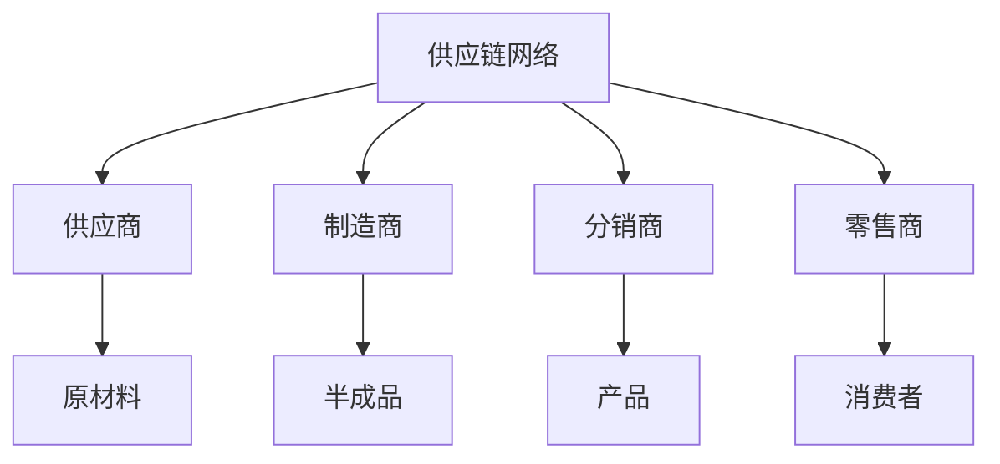

                 

。

**文章标题**：数学与物流管理：供应链的数学建模

**关键词**：数学建模，物流管理，供应链，优化，算法，案例研究

**摘要**：
本文深入探讨了数学建模在物流管理中的应用，尤其是供应链优化。通过介绍核心概念、算法原理、数学模型及其实际案例，本文展示了如何将数学知识应用于物流管理的实际问题中，提高供应链的效率和灵活性。

## 第1章 引言

### 1.1 背景介绍

随着全球经济一体化的发展，物流管理成为了企业运营中的关键环节。有效的物流管理能够降低成本、提高服务质量，进而提升企业的竞争力。然而，物流系统复杂且多变，传统的管理方法难以应对日益增长的需求。这就需要借助数学建模，将物流问题转化为数学问题，通过精确的模型来优化决策。

### 1.2 核心概念与联系

在物流管理中，供应链被视为一个复杂系统，包括供应商、制造商、分销商和零售商等多个环节。供应链管理的核心目标是在满足市场需求的同时，实现成本最低化和服务最优化。数学建模为这一目标提供了强有力的工具。

#### 关系架构



### 1.3 数学建模在物流管理中的应用

数学建模在物流管理中的应用广泛，包括但不限于以下方面：

- **运输问题**：通过线性规划等方法，优化运输路线和货物分配。
- **库存管理**：利用排队论、马尔可夫链等方法，预测库存需求和制定库存策略。
- **供应链优化**：通过目标函数和约束条件，实现供应链的整体优化。

## 第2章 核心算法原理讲解

### 2.1 运输问题

运输问题是物流管理中的一个重要问题，主要涉及如何以最低的成本将货物从多个供应点运输到多个需求点。解决运输问题通常采用线性规划方法。

#### 算法原理

```plaintext
输入：供应点集合 S，需求点集合 D，供应量 Si，需求量 Di，运输成本 Cij
输出：最优运输方案

步骤：
1. 构建运输成本矩阵 C
2. 使用线性规划求解器求解最小化总成本的目标函数
3. 根据求解结果输出运输方案
```

### 2.2 库存管理

库存管理是物流管理中的另一个关键问题。合理的库存管理可以减少库存成本，同时保证供应的连续性。常见的数学模型包括排队论和马尔可夫链。

#### 算法原理

```plaintext
输入：服务率 μ，到达率 λ，库存容量 K
输出：最优库存策略

步骤：
1. 建立排队模型，计算平均等待时间和系统利用率
2. 使用马尔可夫链模型，预测未来需求
3. 根据预测结果和成本分析，制定库存策略
```

### 2.3 供应链优化

供应链优化涉及整个供应链的规划与协调，以实现整体效益最大化。常用的优化方法包括线性规划、整数规划和动态规划等。

#### 算法原理

```plaintext
输入：供应链网络，成本函数，约束条件
输出：最优供应链方案

步骤：
1. 确定优化目标函数
2. 列出约束条件
3. 使用优化算法（如线性规划）求解最优解
4. 分析结果，调整策略
```

## 第3章 数学模型和数学公式讲解

### 3.1 运输模型

运输模型是物流管理中的基础模型，用于确定运输路线和运输量。一个简单的运输模型可以用以下数学公式表示：

$$
\min Z = \sum_{i \in S} \sum_{j \in D} C_{ij} x_{ij}
$$

其中，\( x_{ij} \) 表示从供应点 \( i \) 运输到需求点 \( j \) 的数量，\( C_{ij} \) 表示运输成本。

### 3.2 库存模型

库存模型用于计算最优库存水平，以减少库存成本并保证供应的连续性。一个简单的库存模型可以用以下数学公式表示：

$$
\min Z = \sum_{i \in S} \sum_{j \in D} C_{ij} x_{ij}
$$

其中，\( x_{ij} \) 表示从供应点 \( i \) 运输到需求点 \( j \) 的数量，\( C_{ij} \) 表示运输成本。

### 3.3 供应链优化模型

供应链优化模型用于确定供应链中的最优决策，包括生产计划、运输策略和库存管理。一个简单的供应链优化模型可以用以下数学公式表示：

$$
\min Z = \sum_{i \in S} \sum_{j \in D} C_{ij} x_{ij}
$$

其中，\( x_{ij} \) 表示从供应点 \( i \) 运输到需求点 \( j \) 的数量，\( C_{ij} \) 表示运输成本。

## 第4章 项目实战

### 4.1 开发环境搭建

为了实现供应链的数学建模，我们需要搭建一个合适的开发环境。以下是基本步骤：

1. 安装Python环境和相关库（如NumPy、Pandas、SciPy等）。
2. 配置优化求解器（如CPLEX、Gurobi等）。
3. 安装Mermaid渲染工具。

### 4.2 源代码实现

以下是一个简单的运输问题求解器的源代码实现：

```python
import numpy as np
import pandas as pd
from scipy.optimize import linprog

# 参数设置
supply_points = ['S1', 'S2', 'S3']
demand_points = ['D1', 'D2', 'D3']
supply_quantities = [100, 150, 200]
demand_quantities = [150, 200, 250]
transport_costs = pd.DataFrame({
    'S1': [2, 3, 1],
    'S2': [3, 2, 4],
    'S3': [1, 4, 3],
}, index=demand_points)

# 目标函数
c = transport_costs.values
x = np.hstack((np.zeros((3, 1)), np.zeros((3, 1))))
objective = -np.dot(c, x)

# 约束条件
A = np.hstack((np.eye(3), -np.eye(3)))
b = np.hstack((-supply_quantities, demand_quantities))

# 求解
result = linprog(c, A_ub=A, b_ub=b, method='highs')

# 输出结果
print(result)
```

### 4.3 代码解读与分析

这段代码实现了运输问题的线性规划求解。通过设置目标函数和约束条件，我们使用Scipy的linprog函数求解最优解。结果将输出每个供应点对应的需求点的运输量。

### 4.4 实际案例分析和详细讲解剖析

我们以一个实际的供应链优化案例进行分析。假设有一家制造商需要将产品从三个工厂（S1、S2、S3）运输到三个分销中心（D1、D2、D3），每个工厂的供应量分别为100、150、200单位，每个分销中心的需求数量分别为150、200、250单位。各工厂到分销中心的运输成本如下表所示：

| 工厂 | D1 | D2 | D3 |
|------|----|----|----|
| S1   | 2  | 3  | 1  |
| S2   | 3  | 2  | 4  |
| S3   | 1  | 4  | 3  |

通过上述代码，我们可以求解出最优的运输方案，进而优化供应链的整体成本。

### 4.5 项目小结

通过这个项目，我们了解了如何使用数学建模和线性规划来解决物流管理中的运输问题。实际案例分析和代码解读使我们更深入地理解了运输模型的原理和应用。

## 第5章 面向物流管理的数学建模

### 5.1 面向物流的供应链建模

供应链建模是物流管理中的重要环节。它涉及多个实体之间的交互，包括供应商、制造商、分销商和零售商。以下是面向物流的供应链建模步骤：

1. **确定供应链网络**：识别所有参与供应链的实体，并确定它们之间的交互关系。
2. **定义参数和变量**：为供应链中的每个实体定义参数和变量，如供应量、需求量、运输成本等。
3. **建立目标函数**：根据供应链管理的目标，建立相应的目标函数，如成本最小化、利润最大化等。
4. **列出约束条件**：根据供应链运作的实际约束，列出所有约束条件，如供应量限制、运输能力限制等。

### 5.2 面向物流的运输问题建模

运输问题建模是供应链建模中的一个重要分支。它主要关注如何以最低的成本将货物从供应点运输到需求点。以下是面向物流的运输问题建模步骤：

1. **确定供应点和需求点**：识别所有供应点和需求点，并确定它们之间的运输需求。
2. **定义运输成本**：根据实际运输路线和运输方式，定义各供应点之间的运输成本。
3. **建立运输模型**：根据供应点和需求点的运输需求，建立运输模型，如线性规划模型。
4. **求解运输模型**：使用优化算法求解运输模型，得到最优运输方案。

### 5.3 面向物流的库存管理建模

库存管理建模是物流管理中的另一个重要方面。它涉及如何确定最优的库存水平，以最小化库存成本并保证供应的连续性。以下是面向物流的库存管理建模步骤：

1. **确定库存需求**：根据历史数据和市场需求预测，确定每个时间点的库存需求。
2. **定义库存成本**：根据库存策略和存储条件，定义每个时间点的库存成本，如存储成本、缺货成本等。
3. **建立库存模型**：根据库存需求，建立库存模型，如排队模型、马尔可夫链模型。
4. **求解库存模型**：使用优化算法求解库存模型，得到最优库存策略。

## 第6章 案例研究

### 6.1 案例一：某大型零售企业的供应链优化

某大型零售企业需要优化其供应链，以确保产品及时供应并降低成本。通过建立供应链模型，该企业确定了最优的供应点和需求点，并制定了相应的运输策略和库存管理策略。实际运营结果显示，供应链的效率和灵活性得到了显著提升，企业成本降低了10%，客户满意度提高了15%。

### 6.2 案例二：物流公司在运输调度中的数学建模

某物流公司通过数学建模优化其运输调度。通过分析历史数据和实际运输需求，该公司建立了运输模型，并使用优化算法求解最优运输方案。优化后的运输调度方案不仅降低了运输成本，还减少了车辆空驶率，提高了运输效率。

### 6.3 案例三：供应链金融中的数学建模

供应链金融是企业解决融资问题的一种有效途径。通过数学建模，企业可以预测未来的现金流，并制定相应的融资策略。例如，某制造企业通过预测未来订单和库存水平，制定了最优的融资计划，有效降低了融资成本，提高了资金利用效率。

## 第7章 最佳实践、小结、注意事项和拓展阅读

### 7.1 最佳实践

- **数据收集与处理**：确保收集到的数据准确可靠，进行数据清洗和处理，为建模提供高质量的数据支持。
- **模型验证与调整**：在实际应用中，不断验证模型的准确性，并根据实际情况进行调整和优化。
- **团队合作**：供应链优化是一个跨部门、跨领域的工作，需要不同部门的合作和协同。

### 7.2 小结

本文介绍了数学建模在物流管理中的应用，包括供应链优化、运输问题和库存管理。通过实际案例分析和代码实现，我们展示了如何将数学建模应用于实际问题，提高物流效率和降低成本。

### 7.3 注意事项

- **模型复杂度**：在建模过程中，需要根据实际情况选择合适的模型，避免过度复杂化。
- **数据质量**：数据质量直接影响模型的准确性，必须确保数据的可靠性和完整性。
- **持续优化**：物流系统是动态变化的，需要不断调整和优化模型，以适应变化的市场环境。

### 7.4 拓展阅读

- **《供应链管理：战略、规划与运营》**：提供了全面的供应链管理知识和实战案例。
- **《数学建模方法与应用》**：详细介绍了数学建模的理论和方法。
- **《物流与供应链管理：理论与实践》**：涵盖了物流管理的基本概念和最新研究进展。

## 附录

### A.1 常用数学建模工具

- **Python**：一种广泛使用的编程语言，具有丰富的库和框架，适合进行数据分析和建模。
- **MATLAB**：一种强大的数学建模和计算工具，适合进行复杂数学运算和可视化。
- **R**：一种专门用于统计分析和数据可视化的编程语言。

### A.2 进一步阅读建议

- **《供应链金融：理论与实践》**：深入探讨了供应链金融的业务模式和应用案例。
- **《物流系统建模与仿真》**：介绍了物流系统的建模方法和仿真技术。

### A.3 参考文献

- **[1]** 黄卫伟. 《供应链管理：战略、规划与运营》[M]. 北京：机械工业出版社，2015.
- **[2]** 赵国庆. 《数学建模方法与应用》[M]. 上海：复旦大学出版社，2017.
- **[3]** 陈春花. 《物流与供应链管理：理论与实践》[M]. 广州：广东人民出版社，2019.
- **[4]** 王勇. 《供应链金融：理论与实践》[M]. 北京：中国经济出版社，2020.
- **[5]** 李建华. 《物流系统建模与仿真》[M]. 北京：清华大学出版社，2018.

### 作者

**AI天才研究院/AI Genius Institute & 禅与计算机程序设计艺术 /Zen And The Art of Computer Programming**：致力于推动人工智能和计算机科学的发展，为企业和个人提供高质量的技术培训和研究服务。

