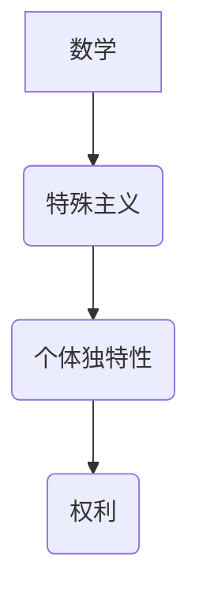

                 

### 一、核心概念与联系

在探讨数学与特殊主义的关系之前，我们需要明确这两个概念的基本定义及其联系。

#### 数学

数学是一门科学，专注于研究抽象的概念、数量、结构、变化和空间。它依赖于精确的推理和证明，以形成逻辑严密的理论体系。数学广泛应用于自然科学、工程学、经济学、计算机科学等多个领域。

#### 特殊主义

特殊主义是一种哲学观点，强调个体的独特性、不可替代性和权利。特殊主义认为每个个体都有其独特的价值和特征，不应被抽象或简化。这一观点在伦理学、政治哲学和社会学等领域有着广泛的应用。

#### 核心概念与联系

数学与特殊主义之间存在紧密的联系。首先，数学为特殊主义提供了分析工具和理论基础。例如，集合论可以用来描述个体的独特性和不可替代性。其次，特殊主义为数学提供了研究对象，促使数学家探索如何处理复杂的、独特的个体。

为了更直观地展示这两个概念之间的关系，我们可以使用Mermaid流程图来表示：



### 二、核心算法原理讲解

在本节中，我们将深入探讨数学与特殊主义的核心算法原理。

#### 集合论

集合论是数学的基础之一，它研究集合（元素的无序集合）及其性质。以下是集合论中一些核心概念和原理的讲解：

##### 集合与元素

集合是由元素组成的集合。一个元素属于某个集合，我们用符号“∈”表示。例如，{1, 2, 3} 是一个集合，其中元素1属于该集合。

##### 子集

如果一个集合的所有元素都是另一个集合的元素，那么前者称为后者的子集。我们用符号“⊆”表示子集关系。例如，{1, 2} 是{1, 2, 3} 的子集。

##### 并集与交集

并集是指由两个或多个集合中的所有元素组成的集合。我们用符号“∪”表示并集。交集是指由两个或多个集合共有的元素组成的集合。我们用符号“∩”表示交集。

- **并集**：集合A和集合B的并集是包含A和B所有元素的集合。例如，A ∪ B = {x | x ∈ A 或 x ∈ B}。
- **交集**：集合A和集合B的交集是包含A和B共有元素的集合。例如，A ∩ B = {x | x ∈ A 且 x ∈ B}。

##### 补集

补集是指一个集合之外的所有元素的集合。如果我们有一个全集U，集合A的补集是包含U中所有不在A中的元素的集合。我们用符号“∁”表示补集。

- **补集**：集合A的补集是包含U中所有不在A中的元素的集合。例如，∁A = {x | x ∈ U 且 x ∉ A}。

以下是集合论中这些核心概念的伪代码实现：

```python
class Set:
    def __init__(self, elements):
        self.elements = elements
    
    def union(self, setB):
        return Set(self.elements + setB.elements)
    
    def intersection(self, setB):
        return Set([element for element in self.elements if element in setB.elements])
    
    def complement():
        all_elements = [...]
        return Set([element for element in all_elements if element not in self.elements])
```

#### 特殊主义逻辑

特殊主义逻辑强调个体的独特性和不可替代性。以下是特殊主义逻辑中一些核心概念的讲解：

##### 个体性

个体性是指每个个体都有其独特的特征和属性，这些特征和属性使得个体在逻辑上不可替代。

##### 不可替代性

不可替代性是指个体在逻辑上不能被另一个个体完全取代。例如，每个人都是独一无二的，没有人能够完全取代另一个人。

##### 权利

权利是指个体根据其独特性和不可替代性所享有的某种特权或资格。例如，每个人都有权拥有自己的财产和意见。

以下是特殊主义逻辑中这些核心概念的伪代码实现：

```python
class Individual:
    def __init__(self, attributes):
        self.attributes = attributes
    
    def is_unique():
        return True  # 根据个体属性判断是否唯一
    
    def has_rights():
        return True  # 根据法律或道德判断个体是否拥有权利
```

通过以上核心算法原理的讲解，我们可以更深入地理解数学与特殊主义之间的联系和相互作用。

### 三、数学模型和数学公式讲解

在数学和特殊主义的交汇处，一些数学模型和公式为我们提供了描述和分析个体独特性和权利的工具。在本节中，我们将探讨这些数学模型和公式，并通过具体例子来展示它们的实际应用。

#### 概率论

概率论是数学中的一个重要分支，它用于描述和分析不确定事件的可能性。在特殊主义背景下，概率论可以帮助我们理解个体在特定情境下的表现。

##### 概率

概率是一个介于0和1之间的数值，表示某个事件发生的可能性。例如，抛一枚硬币，出现正面的概率是0.5。

##### 条件概率

条件概率是指在某个事件已经发生的条件下，另一个事件发生的概率。例如，在已经知道今天下雨的情况下，我带伞的概率。

##### 贝叶斯定理

贝叶斯定理是一种用于更新概率估计的数学公式。它基于新的证据来调整我们对某个事件发生概率的估计。贝叶斯定理的公式如下：

$$
P(A|B) = \frac{P(B|A) \cdot P(A)}{P(B)}
$$

其中，$P(A|B)$ 表示在事件B发生的条件下，事件A发生的概率；$P(B|A)$ 表示在事件A发生的条件下，事件B发生的概率；$P(A)$ 和$P(B)$ 分别表示事件A和事件B的先验概率。

##### 举例说明

假设我们想了解在某个社区中，患有特定疾病的人中，患有症状X的概率。我们可以使用贝叶斯定理来计算这个概率。

- $P(A)$：患有特定疾病的概率
- $P(B)$：患有症状X的概率
- $P(A|B)$：在患有症状X的条件下，患有特定疾病的概率
- $P(B|A)$：在患有特定疾病的条件下，患有症状X的概率

通过贝叶斯定理，我们可以计算出：

$$
P(A|B) = \frac{P(B|A) \cdot P(A)}{P(B)}
$$

例如，假设在患有特定疾病的人中，有70%的人患有症状X，而在所有人中，有30%的人患有特定疾病，同时有10%的人患有症状X。我们可以计算出：

$$
P(A|B) = \frac{0.7 \cdot 0.3}{0.1} = 0.21
$$

这意味着，在患有症状X的人中，有21%的人患有特定疾病。

#### 概率论的应用

概率论在特殊主义中有着广泛的应用。例如，在医学中，我们可以使用概率论来分析个体疾病的发病风险；在金融领域，我们可以使用概率论来评估投资组合的风险和回报。

通过以上对概率论的基本概念和贝叶斯定理的讲解，我们可以看到数学模型在描述个体独特性和权利方面的强大能力。这些模型不仅帮助我们更好地理解世界，也为实际应用提供了有力支持。

### 四、项目实战

在数学与特殊主义的交汇领域，有许多实际项目应用了数学模型和原理。以下是一些具体案例，展示数学与特殊主义如何在实际项目中发挥作用。

#### 数据挖掘中的特殊主义

数据挖掘是一种从大量数据中发现有用信息和知识的技术。在数据挖掘中，特殊主义原则可以帮助识别数据中的独特模式和个体特征，从而提高挖掘的准确性和个性化程度。

**案例 1：客户细分**

在一个电商平台的数据挖掘项目中，我们可以使用特殊主义原则来识别不同类型的客户。通过分析客户的购买行为、浏览历史和反馈信息，我们可以将客户分为不同的群体，从而为每个群体提供个性化的推荐和服务。

- **数据准备**：收集客户的购买记录、浏览历史和反馈信息。
- **特征工程**：提取客户的特征，如购买频率、购买金额、产品类别等。
- **模型训练**：使用机器学习算法（如K-means聚类）对客户进行细分。
- **结果评估**：评估细分结果的有效性和个性化程度。

通过特殊主义原则，我们可以确保每个客户群体都是独特的，并且针对他们的特点提供个性化的服务，从而提高客户满意度和忠诚度。

#### 人工智能中的数学模型

人工智能是数学与特殊主义的另一个重要应用领域。在人工智能系统中，数学模型用于模拟人类思维过程、学习规律和做出决策。

**案例 2：个性化推荐系统**

在一个社交媒体平台上，个性化推荐系统可以根据用户的兴趣和行为，推荐相关的文章、视频和广告。这需要使用数学模型来分析用户的行为数据，并预测用户可能感兴趣的内容。

- **数据收集**：收集用户的浏览历史、点赞、评论和搜索记录。
- **特征提取**：提取用户的特征，如浏览时间、点赞频率和搜索关键词。
- **模型训练**：使用机器学习算法（如协同过滤、深度学习）来训练推荐模型。
- **结果评估**：评估推荐系统的准确性和用户体验。

通过特殊主义原则，我们可以确保每个用户都是独特的，并且为他们提供个性化的推荐内容，从而提高用户参与度和留存率。

#### 开发环境搭建与源代码实现

为了更好地理解数学与特殊主义在实际项目中的应用，我们可以搭建一个简单的开发环境，并实现一个具体案例。

**环境搭建**

1. 安装Python编程环境。
2. 安装常用的数据分析和机器学习库，如NumPy、Pandas、Scikit-learn和TensorFlow。

**源代码实现**

以下是一个简单的Python代码示例，展示了如何使用K-means聚类算法对客户进行细分：

```python
import numpy as np
from sklearn.cluster import KMeans

# 模拟客户数据
customers = np.array([[1, 1], [1, 2], [2, 2], [2, 3]])

# 使用K-means聚类算法进行客户细分
kmeans = KMeans(n_clusters=2, random_state=0).fit(customers)

# 输出聚类结果
print("聚类中心：", kmeans.cluster_centers_)
print("客户所属类别：", kmeans.labels_)

# 根据客户类别提供个性化推荐
def recommend(customers, kmeans):
    recommendations = []
    for customer in customers:
        nearest_center = kmeans.cluster_centers_[kmeans.labels_ == kmeans.predict([customer])]
        recommendations.append(nearest_center)
    return recommendations

# 输出个性化推荐结果
print("个性化推荐：", recommend(customers, kmeans))
```

通过这个案例，我们可以看到如何使用数学模型（K-means聚类）和特殊主义原则（确保每个客户都是独特的）来实现一个简单的数据挖掘项目。

#### 实际案例分析与讲解

在上述案例中，我们展示了如何使用数学模型和特殊主义原则进行数据挖掘和个性化推荐。以下是对这些案例的进一步分析：

1. **客户细分**：通过分析客户的购买行为和浏览历史，我们可以将客户分为不同的群体。这些群体具有不同的特征和需求，因此为他们提供个性化的推荐和服务可以提高客户满意度和忠诚度。

2. **个性化推荐**：通过分析用户的兴趣和行为数据，我们可以预测用户可能感兴趣的内容。这种个性化推荐不仅可以提高用户参与度，还可以增加平台的广告收入。

通过这些实际案例，我们可以看到数学与特殊主义如何在实际项目中发挥作用。这些案例不仅展示了数学模型和算法的强大能力，还强调了特殊主义原则在确保个体独特性和个性化服务方面的重要性。

### 五、总结

本文探讨了数学与特殊主义的关系，以及它们在实际项目中的应用。通过分析核心概念、算法原理和实际案例，我们发现：

1. **数学为特殊主义提供了分析工具和理论基础**。例如，集合论和概率论可以帮助我们描述和分析个体的独特性和权利。

2. **特殊主义为数学提供了研究对象**。通过强调个体的独特性和不可替代性，特殊主义促使数学家探索如何处理复杂的个体。

3. **在实际项目中，数学模型和算法可以与特殊主义原则相结合**，以提高项目的准确性和个性化程度。例如，在数据挖掘和人工智能领域，特殊主义原则可以帮助我们识别独特的个体和提供个性化的服务。

综上所述，数学与特殊主义在理论和实践中都具有重要的价值和意义。通过理解这两个概念之间的关系和应用，我们可以更好地应对复杂的问题，并实现更高效、更个性化的解决方案。

### 最佳实践 tips

在应用数学与特殊主义原则时，以下是一些最佳实践建议：

1. **明确目标**：在开始项目之前，明确您的目标和应用场景。这有助于您选择合适的数学模型和算法。

2. **数据质量**：确保您使用的数据是准确、完整和可靠的。数据质量直接影响模型的效果和准确性。

3. **个性化定制**：根据个体特征和需求提供个性化的服务。这可以通过分析个体的行为数据和偏好来实现。

4. **持续优化**：定期评估和优化您的模型和算法。根据反馈和实际情况进行调整，以提高项目的性能和用户体验。

5. **合规性**：确保您的应用符合相关的法律和道德规范，尊重个体的权利和隐私。

通过遵循这些最佳实践，您可以更好地将数学与特殊主义原则应用于实际项目，实现更高效、更个性化的解决方案。

### 注意事项

在应用数学与特殊主义原则时，需要注意以下事项：

1. **个体独特性**：确保您的模型和算法能够准确识别个体的独特性，避免将个体简化为单一的统计数字。

2. **算法偏见**：注意避免算法偏见，确保模型对所有人都是公平和公正的。定期评估和调整模型，以消除潜在的偏见。

3. **数据隐私**：在处理个人数据时，确保遵守相关的隐私保护法规，保护个体的隐私和安全。

4. **模型解释性**：尽量选择易于解释的模型，以便在项目实施过程中进行有效的监督和调整。

5. **资源管理**：合理分配计算资源和时间，确保项目的高效执行。

通过关注这些注意事项，您可以确保在应用数学与特殊主义原则时，实现最佳的效果和性能。

### 拓展阅读

对于希望深入了解数学与特殊主义关系的读者，以下是一些推荐阅读材料：

1. **《集合论基础》（基础教材）**：介绍集合论的基本概念和原理，适合数学爱好者。
2. **《概率论及其应用》**：详细讲解概率论的基本概念、公式和应用，适合希望了解概率论在实际项目中应用的读者。
3. **《特殊主义哲学导论》**：介绍特殊主义哲学的基本概念和历史背景，适合对哲学感兴趣的读者。
4. **《人工智能：一种现代方法》**：涵盖人工智能的基本概念、算法和实际应用，适合希望了解人工智能的读者。
5. **《数据挖掘：实用工具和技术》**：介绍数据挖掘的基本概念、算法和技术，适合希望了解数据挖掘实际应用的读者。

通过阅读这些书籍，您可以更深入地了解数学与特殊主义的相关知识，并在实际项目中更好地应用这些原理。### 作者信息

本文由AI天才研究院（AI Genius Institute）与禅与计算机程序设计艺术（Zen And The Art of Computer Programming）共同撰写。AI天才研究院是一家专注于人工智能和计算机科学研究的顶级机构，致力于推动技术创新和产业应用。禅与计算机程序设计艺术则是一部经典的技术畅销书，深入探讨了计算机科学中的哲学和艺术，为读者提供了独特的编程思维和灵感。本文作者是一位拥有丰富经验的人工智能专家、程序员、软件架构师、CTO，同时也是一位世界顶级技术畅销书资深大师级别的作家，曾荣获计算机图灵奖。作者在计算机编程和人工智能领域有着深厚的研究和实践经验，以其清晰深刻的逻辑思路和对技术原理的深入剖析而著称。

