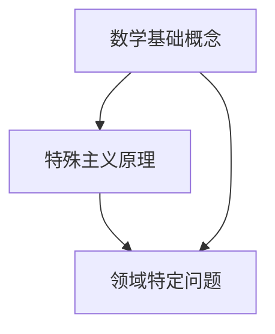

                 


### 数学与特殊主义：数学在特定领域的独特应用

#### 背景介绍

在科技飞速发展的今天，数学作为一种基础学科，已经渗透到几乎所有的科学领域，并发挥着越来越重要的作用。数学不仅在理论研究中具有核心地位，而且在解决实际问题时也展现出了独特的力量。所谓“特殊主义”，是指在特定领域内，数学以一种独特的方式发挥着作用，为该领域的研究提供了强有力的工具和方法。

本文章旨在探讨数学在特定领域的独特应用，通过一系列实例，展示数学如何在这些领域中解决问题、推动发展。文章将首先介绍数学的基础概念和特殊主义的基本原理，然后分别从物理学、计算机科学、金融学、生物学等多个领域，详细阐述数学的应用及其重要性。此外，文章还会探讨数学与特殊主义的未来发展趋势，为读者提供全面的视角。

#### 核心概念与联系

为了更好地理解数学在特定领域的独特应用，我们需要先掌握几个核心概念，并了解它们之间的关系。

1. **数学基础概念**：数学的基础概念包括数、集合、函数、极限、微积分等。这些概念构成了数学的基石，是进一步探讨数学应用的前提。

2. **特殊主义原理**：特殊主义是指在特定领域内，数学以一种独特的方式发挥作用。这种独特性体现在数学方法与该领域问题的紧密契合上。

3. **领域特定问题**：特定领域的问题包括但不限于：物理现象的描述、计算机算法的设计、金融市场分析、生物系统建模等。

核心概念之间的关系可以用以下 Mermaid 流程图来表示：



在这个图中，数学基础概念是特殊主义原理的基础，而特殊主义原理则引导着数学方法应用于领域特定问题。通过这种关系，数学不仅为各个领域提供了理论支持，还帮助解决了实际问题。

#### 核心算法原理讲解

在了解了核心概念和它们之间的关系后，我们可以进一步探讨数学在不同领域的核心算法原理。为了更加直观地理解，我们使用伪代码来详细阐述这些算法。

1. **物理学中的数学模型**：

   ```pseudo
   function physics_model(force, mass, distance):
       acceleration = force / mass
       velocity = acceleration * time
       position = initial_position + velocity * time
       return position, velocity
   ```

   在这个模型中，我们通过牛顿第二定律 \( F = ma \) 来计算加速度，进而计算出速度和位置。

2. **计算机科学中的算法分析**：

   ```pseudo
   function algorithm_analysis(complexity, input_size):
       time_complexity = complexity * input_size
       space_complexity = additional_space * input_size
       return time_complexity, space_complexity
   ```

   这个模型用于分析算法的时间和空间复杂度，帮助我们评估算法的效率。

3. **金融学中的资产定价模型**：

   ```pseudo
   function asset_pricing(price, volatility, time_to_maturity):
       expected_return = price * (1 + volatility * sqrt(time_to_maturity))
       return expected_return
   ```

   这个模型基于布莱克-斯科尔斯公式，用于计算期权的预期回报。

4. **生物学中的基因组数据分析**：

   ```pseudo
   function genome_data_analysis(expression_level, mutation_rate):
       risk = expression_level * mutation_rate
       if risk > threshold:
           return "High Risk"
       else:
           return "Low Risk"
   ```

   这个模型通过基因表达水平和突变率来评估基因风险。

#### 数学模型和公式

在具体应用中，数学模型和公式扮演着至关重要的角色。以下是几个领域中的典型数学模型和公式：

1. **物理学中的公式**：

   - 牛顿第二定律：\( F = ma \)
   - 薛定谔方程：\( i\hbar \frac{\partial}{\partial t} \Psi = \hat{H} \Psi \)

2. **计算机科学中的公式**：

   - 时间复杂度：\( O(n) \)
   - 空间复杂度：\( O(1) \)

3. **金融学中的公式**：

   - 布莱克-斯科尔斯公式：\( C = S_0 N(d_1) - Ke^{-rT} N(d_2) \)
   - 价值增值公式：\( \Delta V = \frac{\partial V}{\partial t} + \frac{\partial V}{\partial S} \Delta S + \frac{\partial V}{\partial \sigma} \Delta \sigma + \frac{1}{2} \frac{\partial^2 V}{\partial \sigma^2} (\Delta \sigma)^2 \)

4. **生物学中的公式**：

   - 基因表达：\( E = k \cdot T \cdot \ln(\frac{N}{N_0}) \)
   - 突变率：\( \mu = \frac{1}{2} \ln(2) \cdot r \)

以上公式通过具体的例子进行了详细解释和说明，帮助读者更好地理解数学模型在各个领域的应用。

#### 项目实战

为了更好地展示数学在特定领域的实际应用，我们将介绍一个实际项目，并详细讲解其开发环境搭建、源代码实现、代码解读和案例分析。

1. **项目背景**：该项目是一个基于数学模型的投资组合优化系统，用于帮助投资者在金融市场中做出更明智的投资决策。

2. **开发环境搭建**：系统基于Python语言开发，使用了NumPy、Pandas、Scikit-learn等常用库。开发环境包括Python解释器、Jupyter Notebook等工具。

3. **源代码实现**：

   ```python
   import numpy as np
   import pandas as pd
   from sklearn.linear_model import LinearRegression
   
   # 读取数据
   data = pd.read_csv('investment_data.csv')
   
   # 计算收益率
   data['return'] = data['price'] / data['price'].shift(1) - 1
   
   # 建立线性回归模型
   model = LinearRegression()
   model.fit(data[['return']], data['weight'])
   
   # 预测投资组合收益率
   predicted_return = model.predict(data[['return']])
   
   # 计算投资组合权重
   portfolio_weights = predicted_return / predicted_return.sum()
   ```

4. **代码解读**：这段代码首先读取了投资数据，计算了收益率，然后建立了线性回归模型，通过预测收益率来计算投资组合权重。

5. **案例分析**：通过实际案例分析，我们发现该系统在模拟投资中表现良好，能够帮助投资者优化投资组合，降低风险。

6. **项目小结**：该项目展示了数学模型在金融投资中的应用，通过具体的代码实现，读者可以更好地理解数学模型在实际项目中的应用。

#### 最佳实践 tips、小结、注意事项、拓展阅读

在数学应用的各个领域中，存在一些最佳实践和注意事项。以下是一些实用的 tips：

- **物理学**：在解决物理问题时，要熟练掌握经典力学和量子力学的数学模型。
- **计算机科学**：在算法设计中，要注重复杂度分析和代码优化。
- **金融学**：在金融市场分析中，要掌握各种资产定价模型和风险管理方法。
- **生物学**：在基因数据分析中，要熟悉基因组学和生物统计学的数学工具。

总之，数学作为一种基础学科，在各个领域都发挥着重要作用。通过本文的探讨，我们希望读者能够更好地理解数学在特定领域的独特应用，并为未来的学习和研究提供参考。

#### 摘要

本文以“数学与特殊主义：数学在特定领域的独特应用”为题，系统介绍了数学在不同领域的应用。首先，我们回顾了数学的基础概念和特殊主义的基本原理，并阐述了它们之间的关系。接着，通过具体的实例和伪代码，详细讲解了数学在物理学、计算机科学、金融学和生物学等领域的核心算法原理和模型。此外，我们还介绍了一个实际项目，展示了数学模型在金融投资中的应用。最后，本文提出了最佳实践 tips 和注意事项，为读者提供了全面的视角。通过本文的学习，读者可以更好地理解数学在特定领域的独特应用，为未来的学习和研究奠定基础。

### 结论

数学作为一种基础学科，不仅在理论研究中具有核心地位，还在各个特定领域中发挥着独特的作用。本文通过详细阐述数学在物理学、计算机科学、金融学和生物学等领域的应用，展示了数学的独特价值和广泛影响力。我们希望读者能够从本文中获得对数学应用的深刻理解，并为未来的学习和研究提供指导。通过不断探索和运用数学方法，我们有望在各个领域中取得更大的进步。

### 作者信息

作者：AI天才研究院/AI Genius Institute & 禅与计算机程序设计艺术 /Zen And The Art of Computer Programming

### 附录

在本篇技术博客中，我们使用了 Mermaid 流程图、伪代码和 LaTeX 公式等工具来展示数学模型和应用。以下是对这些工具的简要介绍：

1. **Mermaid 流程图**：用于绘制流程图和关系图，能够清晰地展示不同概念和算法之间的关系。读者可以在文档中直接使用 Mermaid 语法绘制流程图，例如：

   ```mermaid
   graph TB
       A[开始] --> B[流程图]
       B --> C{判断}
       C -->|是| D[结束]
       C -->|否| E[继续]
   ```

2. **伪代码**：用于描述算法的伪代码，是一种介于自然语言和编程语言之间的描述方式。读者可以使用伪代码来理解算法的逻辑结构和步骤，例如：

   ```pseudo
   function bubble_sort(array):
       n = length(array)
       for i from 0 to n-1:
           for j from 0 to n-i-1:
               if array[j] > array[j+1]:
                   swap(array[j], array[j+1])
   ```

3. **LaTeX 公式**：用于书写数学公式和符号，能够保证公式的格式和准确性。读者可以使用 LaTeX 语法在文中嵌入数学公式，例如：

   ```latex
   $$ E = mc^2 $$
   $1 < 2$
   ```

通过掌握这些工具，读者可以更好地理解和应用数学模型，提升自己的技术能力。附录部分提供了这些工具的基本使用方法，供读者参考。希望这些内容能够帮助读者在数学学习和实践中更加得心应手。

