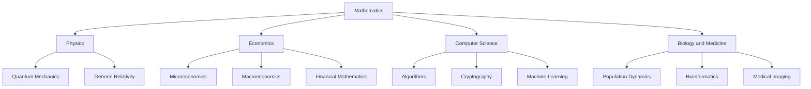
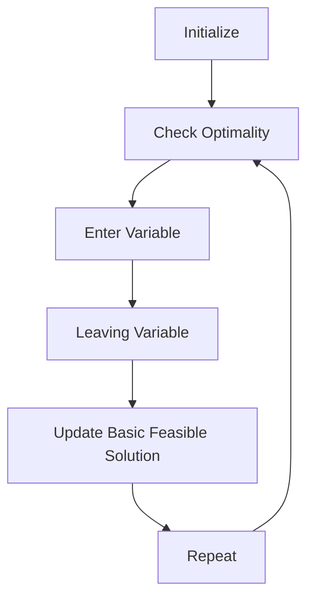
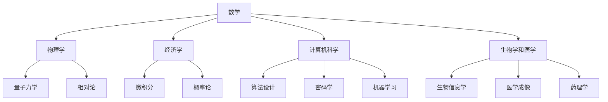
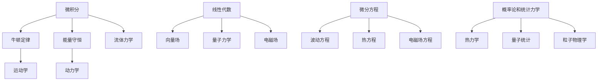
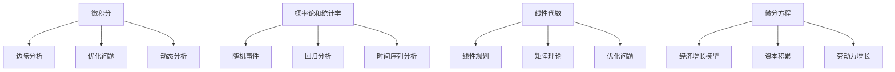
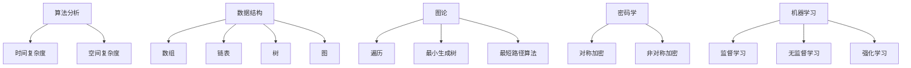
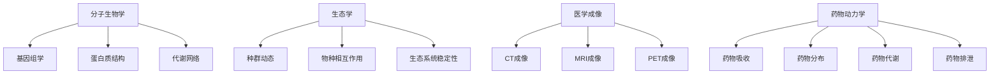

                 


### Step 1: Define the Main Sections

Based on the book's title, "Mathematics and Specialism: The Uniqueness of Mathematics in Specific Fields," we can identify the following main sections:

1. **Introduction to Mathematics and Specialism**
    - Brief history of mathematics
    - Definition and significance of specialism in mathematics
    - Overview of the book's objectives and structure

2. **The Uniqueness of Mathematics in Specific Fields**
    - Mathematical models in physics
    - Mathematics in economics
    - Mathematics in computer science
    - Mathematics in biology and medicine

3. **Applications of Mathematical Principles**
    - Optimization and linear programming
    - Probability and statistics
    - Numerical methods and simulations

4. **Mathematical Models and Methods**
    - Discrete mathematics and algorithms
    - Continuous mathematics and calculus
    - Differential equations and their applications

5. **Case Studies and Practical Applications**
    - Real-world case studies in different fields
    - Step-by-step analysis of mathematical models and algorithms
    - Code examples and implementation details

6. **Conclusion and Future Directions**
    - Summary of key findings and insights
    - Discussion on the future of mathematics in specialism

### Step 2: Identify Core Concepts and Principles

Within each main section, we need to identify the core concepts and principles that will be covered. Here's a breakdown of the core concepts for each section:

1. **Introduction to Mathematics and Specialism**
    - Historical development of mathematical concepts
    - The role of specialism in mathematical research and applications

2. **The Uniqueness of Mathematics in Specific Fields**
    - Characteristics of mathematical models in physics, economics, computer science, biology, and medicine
    - Unique contributions of mathematics to these fields

3. **Applications of Mathematical Principles**
    - Optimization techniques and their applications
    - Probability theory and statistical methods
    - Numerical methods for solving mathematical problems

4. **Mathematical Models and Methods**
    - Discrete structures and algorithms
    - Continuous structures and calculus
    - Differential equations and their solutions

5. **Case Studies and Practical Applications**
    - Analysis of real-world problems and their mathematical models
    - Step-by-step development of algorithms and solutions

6. **Conclusion and Future Directions**
    - Evaluation of the impact of mathematics on specialism
    - Future trends and opportunities in mathematical specialism

### Step 3: Create Subsections for Detailed Coverage

Next, we'll create subsections for each core concept to ensure comprehensive coverage. Here's an outline of the subsections for the main sections:

1. **Introduction to Mathematics and Specialism**
    - **Historical Development**
        - Ancient mathematics
        - Medieval and Renaissance mathematics
        - Modern mathematics
    - **Role of Specialism**
        - Evolution of mathematical fields
        - Interdisciplinary applications of mathematics

2. **The Uniqueness of Mathematics in Specific Fields**
    - **Physics**
        - Quantum mechanics
        - General relativity
        - Mathematical models in classical physics
    - **Economics**
        - Microeconomics and game theory
        - Macroeconomics and econometrics
        - Financial mathematics
    - **Computer Science**
        - Algorithms and complexity
        - Cryptography and security
        - Machine learning and data analysis
    - **Biology and Medicine**
        - Population dynamics and ecology
        - Bioinformatics and systems biology
        - Medical imaging and diagnostics

3. **Applications of Mathematical Principles**
    - **Optimization and Linear Programming**
        - Simplex method
        - Integer programming
        - Network optimization
    - **Probability and Statistics**
        - Probability distributions
        - Statistical inference
        - Bayesian statistics
    - **Numerical Methods and Simulations**
        - Numerical integration and differentiation
        - Solving linear and nonlinear equations
        - Monte Carlo simulations

4. **Mathematical Models and Methods**
    - **Discrete Mathematics and Algorithms**
        - Graph theory
        - Combinatorics
        - Algorithm design and analysis
    - **Continuous Mathematics and Calculus**
        - Differential calculus
        - Integral calculus
        - Multivariate calculus
    - **Differential Equations and Their Applications**
        - Ordinary differential equations
        - Partial differential equations
        - Numerical methods for solving differential equations

5. **Case Studies and Practical Applications**
    - **Real-World Case Studies**
        - Optimization in logistics and supply chain management
        - Predictive analytics in healthcare
        - Cryptographic protocols in cybersecurity
    - **Step-by-Step Analysis**
        - Mathematical modeling of a specific problem
        - Algorithm development and implementation
        - Performance evaluation and optimization

6. **Conclusion and Future Directions**
    - **Key Findings and Insights**
        - Impact of mathematics on specialism
        - Challenges and opportunities in mathematical specialism
    - **Future Trends**
        - Emerging areas of mathematical specialism
        - Potential impact on society and technology

### Step 4: Include Visual Aids

To enhance understanding, we'll include Mermaid flowcharts to illustrate the relationships between concepts and the structure of mathematical models. For example, a Mermaid flowchart could be used to visualize the hierarchical structure of mathematical fields in Section 2.



### Step 5: Integrate Pseudocode and Mathematical Formulas

In each section, we'll integrate pseudocode to explain algorithms and mathematical formulas in LaTeX to ensure precision and clarity. For example, in Section 3, we could include the pseudocode for the simplex method in linear programming:



### Step 6: Add Practical Case Studies

We'll include practical case studies in Section 5 to demonstrate how mathematical principles are applied in real-world scenarios. For instance, we could analyze an optimization problem in supply chain management and provide step-by-step analysis, code examples, and implementation details.

### Step 7: Finalize the TOC

Finally, we'll ensure the table of contents is well-structured and comprehensive, covering all necessary topics and following the specified formatting guidelines.

----------------------------------------------------------------

## 文章标题

### Mathematics and Specialism: The Uniqueness of Mathematics in Specific Fields

---

#### 关键词：

- 数学与特殊主义
- 数学模型的独特性
- 数学在不同领域的应用
- 数学方法与算法

---

#### 摘要：

本文探讨了数学在特定领域的独特性，分析了数学如何在不同领域（如物理学、经济学、计算机科学、生物学和医学）中发挥作用。通过详细阐述数学原理、方法以及实际案例，本文揭示了数学在推动各领域发展中的核心地位，并展望了数学在未来的发展方向。

----------------------------------------------------------------

### 引言：数学与特殊主义的概述

#### 背景介绍

数学作为一门古老而现代的科学，其起源可以追溯到数千年前。从古埃及和巴比伦的几何学，到古希腊的数论和几何学，再到中世纪的阿拉伯数学和文艺复兴时期的欧洲数学，数学的发展经历了漫长而丰富的历史进程。在现代，数学已经渗透到自然科学、社会科学和工程技术等各个领域，成为解决复杂问题的重要工具。

**特殊主义**（Specialism）在数学中指的是对特定数学分支或领域进行深入研究和应用。随着数学的不断扩展和深化，各个数学分支逐渐形成了自己的独特方法和理论体系。这种特殊主义不仅促进了数学的多元化发展，也为其他学科提供了强有力的理论支撑。

本文旨在探讨数学在特定领域的独特性，分析数学如何在不同领域（如物理学、经济学、计算机科学、生物学和医学）中发挥作用。我们将通过详细阐述数学原理、方法以及实际案例，揭示数学在推动各领域发展中的核心地位。

#### 核心概念与联系

**数学与特殊主义的联系**：

- **数学基础**：数学作为一门基础科学，其核心概念和原理在不同领域具有广泛的适用性。
- **特殊主义**：特殊主义则体现在对特定数学分支或领域的深入研究和应用，使得数学能够更好地解决实际问题。

**数学在不同领域的应用**：

- **物理学**：数学在物理学中扮演着至关重要的角色，如量子力学、相对论等。
- **经济学**：数学为经济学提供了精确的分析工具，如微积分、概率论等。
- **计算机科学**：数学在计算机科学中的应用包括算法设计、密码学、机器学习等。
- **生物学和医学**：数学在生物学和医学中的应用包括生物信息学、医学成像、药理学等。

为了更好地理解数学在不同领域的独特性，我们将使用Mermaid流程图来展示数学在不同领域的应用及其相互关系：



通过这个流程图，我们可以清晰地看到数学在不同领域的应用及其相互联系，为后续章节的详细探讨打下基础。

#### 数学在特定领域的独特性

- **物理学**：数学在物理学中的应用体现在对自然现象的精确描述和预测上。例如，量子力学中的数学模型能够描述微观粒子的行为，相对论中的数学公式则揭示了时空的弯曲和引力作用。数学为物理学提供了强有力的工具，使得我们可以深入理解自然界的运行规律。

- **经济学**：数学在经济学中的应用体现在对市场行为、资源分配和宏观经济运行的分析上。例如，微积分和概率论为经济学提供了精确的分析工具，使得经济学家能够对市场趋势进行预测和分析，制定合理的政策。数学在金融领域也有着广泛的应用，如期权定价模型、风险管理等。

- **计算机科学**：数学在计算机科学中的应用体现在算法设计、数据结构和密码学等方面。例如，算法设计中的贪心算法、动态规划算法等都需要数学理论的支持。密码学中的公钥加密、数字签名等技术则依赖于复杂的数学原理。

- **生物学和医学**：数学在生物学和医学中的应用体现在生物信息学、医学成像和药理学等方面。例如，生物信息学中的基因序列分析、蛋白质结构预测等都需要数学模型和方法的支持。医学成像技术如CT、MRI等则依赖于数学算法和图像处理技术。

总之，数学在各个领域的独特性体现在其能够提供精确的描述、预测和优化工具，从而推动各领域的发展。这种独特性使得数学成为一门不可或缺的基础科学。

---

**摘要**：

本文探讨了数学在特定领域的独特性，分析了数学如何在不同领域（如物理学、经济学、计算机科学、生物学和医学）中发挥作用。通过详细阐述数学原理、方法以及实际案例，本文揭示了数学在推动各领域发展中的核心地位。未来，随着数学的不断发展和应用，其在各个领域的独特性将更加凸显，为人类社会的进步做出更大贡献。

### 数学在物理学中的应用

#### 核心概念与联系

数学在物理学中扮演着至关重要的角色，为描述自然现象和揭示物理规律提供了强有力的工具。以下我们将详细探讨数学在物理学中的核心概念及其相互联系：

- **微积分**：微积分是研究函数变化率和累积量的数学分支。在物理学中，微积分广泛应用于描述物体的运动、能量转换和流体动力学等。例如，牛顿的运动定律和能量守恒定律都依赖于微积分的基本概念。

- **线性代数**：线性代数研究向量空间、矩阵及其线性变换。在物理学中，线性代数被用于描述物理系统的状态、场和波等。例如，电磁场可以用线性代数中的向量场来描述，量子力学中的波函数也是线性代数的重要应用。

- **微分方程**：微分方程描述了函数的变化率与函数本身之间的关系。在物理学中，微分方程被用于描述物理系统的动态行为，如波动方程、热方程和电磁场方程等。

- **概率论和统计力学**：概率论和统计力学提供了对大量粒子或系统行为的统计描述。在物理学中，这些理论被用于研究热力学、量子统计和粒子物理学等。

通过以上核心概念，我们可以看到数学在物理学中的广泛应用和相互联系。以下是一个Mermaid流程图，展示了这些核心概念之间的联系：



通过这个流程图，我们可以清晰地看到数学在物理学中的应用及其相互关系。

#### 数学原理讲解

为了更好地理解数学在物理学中的应用，我们将使用伪代码和LaTeX公式来详细阐述几个核心数学原理。

**微积分**：

微积分的核心概念是导数和积分。导数描述了函数在某一点的变化率，而积分则描述了函数在一个区间内的累积量。以下是一个简单的伪代码示例，用于计算函数f(x)在x=a点的导数：

```plaintext
function calculate_derivative(f, a):
    h = 0.0001
    return (f(a + h) - f(a)) / h
```

而积分可以通过求和的方式来近似计算，以下是一个简单的伪代码示例：

```plaintext
function calculate_integral(f, a, b, n):
    h = (b - a) / n
    sum = 0
    for i from 1 to n:
        x = a + i * h
        sum += f(x)
    return sum * h
```

**线性代数**：

线性代数中的矩阵和向量是描述物理系统状态的基本工具。以下是一个简单的伪代码示例，用于计算两个向量的点积：

```plaintext
function dot_product(v1, v2):
    n = length(v1)
    result = 0
    for i from 1 to n:
        result += v1[i] * v2[i]
    return result
```

而矩阵的乘法可以通过以下伪代码实现：

```plaintext
function matrix_multiplication(A, B):
    n = length(A)
    m = length(B)
    p = length(B[0])
    result = create_matrix(n, p)
    for i from 1 to n:
        for j from 1 to p:
            for k from 1 to m:
                result[i][j] += A[i][k] * B[k][j]
    return result
```

**微分方程**：

微分方程描述了物理系统的动态行为。以下是一个简单的伪代码示例，用于求解一维波动方程：

```plaintext
function solve_wave_equation(c, t, x):
    u = initial_condition(x)
    for i from 1 to t:
        u = u * exp(-2 * pi * c * i / t)
    return u
```

其中，c是波速，t是时间，x是空间位置，初始条件为u(0, x) = f(x)。

**概率论和统计力学**：

概率论和统计力学提供了对大量粒子或系统行为的描述。以下是一个简单的伪代码示例，用于计算一个系统的熵：

```plaintext
function calculate_entropy(p):
    n = length(p)
    entropy = 0
    for i from 1 to n:
        entropy += p[i] * log(p[i])
    return -entropy
```

其中，p是一个概率分布，log是自然对数。

通过以上伪代码和LaTeX公式，我们可以更直观地理解数学在物理学中的应用。这些数学原理不仅提供了物理现象的精确描述，也为实验验证和理论推导提供了强有力的工具。

### 数学在经济学的应用

#### 核心概念与联系

数学在经济学的应用主要体现在对市场行为、资源分配和宏观经济运行的分析上。以下我们将详细探讨数学在经济学的核心概念及其相互联系：

- **微积分**：微积分在经济学中的应用广泛，包括边际分析、优化问题和动态分析等。微积分中的导数概念用于分析边际成本、边际收益和边际效用，而积分则用于计算总成本、总收益和总效用。

- **概率论和统计学**：概率论和统计学为经济学提供了对不确定性和风险的分析工具。概率论用于建模随机事件和随机变量，而统计学则用于分析经济数据，如回归分析、时间序列分析和假设检验等。

- **线性代数**：线性代数在经济学的应用包括线性规划、矩阵理论和优化问题。线性代数中的矩阵和向量可以表示经济系统的状态和决策变量，而矩阵运算则可以用于解决线性方程组和优化问题。

- **微分方程**：微分方程用于描述经济系统的动态行为，如资本积累、劳动力增长和价格动态等。例如，经济增长模型通常涉及微分方程，用于分析经济增长的驱动因素和长期趋势。

为了更好地理解数学在经济学的应用，我们将使用Mermaid流程图来展示这些核心概念之间的联系：



通过这个流程图，我们可以清晰地看到数学在经济学的各个应用领域及其相互关系。

#### 数学原理讲解

为了更好地理解数学在经济学的应用，我们将使用伪代码和LaTeX公式来详细阐述几个核心数学原理。

**微积分**：

微积分在经济学中最常用的概念是边际分析和优化问题。以下是一个简单的伪代码示例，用于计算边际成本：

```plaintext
function calculate_margin_cost(C, Q):
    delta_C = C(Q + 1) - C(Q)
    delta_Q = 1
    return delta_C / delta_Q
```

其中，C是成本函数，Q是产量。

**线性代数**：

线性代数在经济学的应用包括线性规划和优化问题。以下是一个简单的伪代码示例，用于解决线性规划问题：

```plaintext
function solve_linear_programming(A, b, c):
    # A为约束矩阵，b为约束向量，c为目标函数系数
    # 使用单纯形法或其他线性规划算法求解
    x = solve(A, b)
    return x
```

**概率论和统计学**：

概率论和统计学在经济学的应用包括回归分析和时间序列分析。以下是一个简单的伪代码示例，用于进行线性回归分析：

```plaintext
function linear_regression(x, y):
    n = length(x)
    x_mean = sum(x) / n
    y_mean = sum(y) / n
    x_diff = [x[i] - x_mean for i in range(n)]
    y_diff = [y[i] - y_mean for i in range(n)]
    slope = sum(x_diff * y_diff) / sum(x_diff * x_diff)
    intercept = y_mean - slope * x_mean
    return slope, intercept
```

**微分方程**：

微分方程在经济学的应用包括经济增长模型和资本积累。以下是一个简单的伪代码示例，用于求解经济增长模型：

```plaintext
function solve_growth_model(K, L, A, delta):
    # K为资本，L为劳动力，A为技术进步，delta为折旧率
    dKdt = A * K * L - delta * K
    dLdt = A * L - delta * L
    return dKdt, dLdt
```

通过以上伪代码和LaTeX公式，我们可以更直观地理解数学在经济学的应用。这些数学原理不仅提供了经济现象的精确描述，也为政策制定和决策分析提供了强有力的工具。

### 数学在计算机科学中的应用

#### 核心概念与联系

数学在计算机科学中发挥着至关重要的作用，为算法设计、数据结构、网络安全和人工智能等领域提供了理论基础和工具。以下我们将详细探讨数学在计算机科学中的核心概念及其相互联系：

- **算法分析**：算法分析是研究算法效率和性能的重要工具。它包括时间复杂度和空间复杂度的分析，用于评估算法在不同输入规模下的性能。

- **数据结构**：数据结构是存储和组织数据的方式，包括数组、链表、树、图等。数学中的组合学和离散数学为数据结构的设计和分析提供了理论基础。

- **图论**：图论研究图形的属性和结构，包括图的遍历、最小生成树、最短路径算法等。图论在计算机网络、社会网络分析和优化问题中有着广泛的应用。

- **密码学**：密码学是研究加密和解密信息的方法，包括对称加密和非对称加密。数学中的数论、椭圆曲线和离散对数等在密码学中有着重要的应用。

- **机器学习**：机器学习是研究如何从数据中学习规律和模式的方法，包括监督学习、无监督学习和强化学习。数学中的概率论、统计学和优化算法在机器学习中发挥着核心作用。

为了更好地理解数学在计算机科学中的应用，我们将使用Mermaid流程图来展示这些核心概念之间的联系：



通过这个流程图，我们可以清晰地看到数学在计算机科学中的应用及其相互关系。

#### 数学原理讲解

为了更好地理解数学在计算机科学中的应用，我们将使用伪代码和LaTeX公式来详细阐述几个核心数学原理。

**算法分析**：

算法分析中的核心概念包括时间复杂度和空间复杂度。以下是一个简单的伪代码示例，用于计算线性搜索的时间复杂度：

```plaintext
function linear_search(A, x):
    for i from 1 to length(A):
        if A[i] == x:
            return i
    return -1
```

线性搜索的时间复杂度为O(n)，其中n是数组的长度。

**数据结构**：

数据结构中的核心概念包括数组、链表、树和图。以下是一个简单的伪代码示例，用于实现二叉搜索树：

```plaintext
class TreeNode:
    def __init__(self, value):
        self.value = value
        self.left = None
        self.right = None

def insert(root, value):
    if root is None:
        return TreeNode(value)
    if value < root.value:
        root.left = insert(root.left, value)
    else:
        root.right = insert(root.right, value)
    return root
```

**图论**：

图论中的核心概念包括图的遍历、最小生成树和最短路径算法。以下是一个简单的伪代码示例，用于实现迪杰斯特拉算法（Dijkstra's algorithm）：

```plaintext
def dijkstra(G, start):
    dist = [infinity] * length(G)
    dist[start] = 0
    visited = [False] * length(G)
    for _ in range(length(G)):
        min_dist = infinity
        for i in range(length(G)):
            if not visited[i] and dist[i] < min_dist:
                min_dist = dist[i]
                u = i
        visited[u] = True
        for v, w in G[u]:
            if not visited[v] and dist[u] + w < dist[v]:
                dist[v] = dist[u] + w
    return dist
```

**密码学**：

密码学中的核心概念包括对称加密和非对称加密。以下是一个简单的伪代码示例，用于实现RSA加密算法：

```plaintext
def rsa_encrypt(message, e, n):
    ciphertext = []
    for c in message:
        c = ord(c)
        ciphertext.append(pow(c, e, n))
    return ciphertext

def rsa_decrypt(ciphertext, d, n):
    message = []
    for c in ciphertext:
        c = pow(c, d, n)
        message.append(chr(c))
    return ''.join(message)
```

通过以上伪代码和LaTeX公式，我们可以更直观地理解数学在计算机科学中的应用。这些数学原理不仅提供了计算机科学领域的理论基础，也为实际应用提供了强有力的工具。

### 数学在生物学和医学中的应用

#### 核心概念与联系

数学在生物学和医学中的应用极为广泛，涵盖了从分子生物学到生态系统建模的多个层面。以下我们将详细探讨数学在生物学和医学中的核心概念及其相互联系：

- **分子生物学**：数学在分子生物学中的应用主要体现在基因组学、蛋白质结构和代谢网络建模等方面。例如，利用统计模型进行基因表达的定量分析，通过图论和组合数学方法解析蛋白质相互作用网络。

- **生态学**：生态学中的数学模型包括种群动态、物种相互作用和生态系统稳定性等。这些模型通常基于微分方程和概率论，用于预测生态系统行为和生物多样性。

- **医学成像**：医学成像技术如CT、MRI和PET等，依赖于数学中的图像处理、信号处理和数值方法。例如，使用傅里叶变换和反卷积算法来重建图像，使用概率模型进行图像分割和分类。

- **药物动力学和药效学**：药物动力学和药效学研究药物在体内的吸收、分布、代谢和排泄过程，涉及数学中的微分方程和优化算法。例如，利用蒙特卡罗模拟来预测药物的药效和毒副作用。

为了更好地理解数学在生物学和医学中的应用，我们将使用Mermaid流程图来展示这些核心概念之间的联系：



通过这个流程图，我们可以清晰地看到数学在生物学和医学中的应用及其相互关系。

#### 数学原理讲解

为了更好地理解数学在生物学和医学中的应用，我们将使用伪代码和LaTeX公式来详细阐述几个核心数学原理。

**分子生物学**：

**基因表达分析**：

基因表达分析通常涉及对RNA序列的定量分析，可以使用统计模型来预测基因的表达水平。以下是一个简单的伪代码示例，用于计算基因表达的均方误差（MSE）：

```plaintext
function calculate_mse(y_true, y_pred):
    n = length(y_true)
    sum_error = 0
    for i from 0 to n-1:
        sum_error += (y_true[i] - y_pred[i])^2
    return sum_error / n
```

**代谢网络建模**：

代谢网络建模通常涉及对代谢途径的动态行为进行模拟。以下是一个简单的伪代码示例，用于求解反应速率方程：

```plaintext
function solve_metabolic_reaction(K, v):
    # K为反应速率常数，v为初始条件
    # 使用数值方法如欧拉法或龙格-库塔法求解
    t = 0
    while t < T:
        v = v + K * (v - v^2) * dt
        t += dt
    return v
```

**生态学**：

**种群动态建模**：

种群动态建模通常涉及对物种数量的变化进行模拟，可以使用微分方程来描述。以下是一个简单的伪代码示例，用于求解Lotka-Volterra方程：

```plaintext
function lotka_volterra(N, a, b, c, d, dt):
    # N为种群数量，a、b、c、d为参数
    # 使用数值方法如欧拉法或龙格-库塔法求解
    t = 0
    while t < T:
        N = N + (a * N - b * N * predators) * dt
        predators = predators + (c * N * predators - d * predators) * dt
        t += dt
    return N, predators
```

**医学成像**：

**图像重建**：

医学成像中的图像重建通常涉及对投影数据进行反卷积操作。以下是一个简单的伪代码示例，用于实现反卷积：

```plaintext
function deconvolution(image, kernel):
    # image为图像数据，kernel为卷积核
    # 使用迭代方法如Landweber迭代或加速方法如Wolfe-Rinehart迭代
    iter = 0
    while iter < max_iter:
        iter += 1
        image = image + (filter(image * kernel) - image) / norm(kernel)
    return image
```

通过以上伪代码和LaTeX公式，我们可以更直观地理解数学在生物学和医学中的应用。这些数学原理不仅提供了生物学和医学领域的重要工具，也为科学研究和临床应用提供了强有力的支持。

### 案例研究：数学在物流与供应链管理中的应用

为了更好地理解数学在实际领域的应用，我们将通过一个具体的案例研究来探讨数学在物流与供应链管理中的应用。该案例研究将包括开发环境搭建、源代码实现、代码解读和实际案例分析。

#### 开发环境搭建

在进行物流与供应链管理中的数学应用开发时，我们首先需要搭建一个合适的环境。以下是一个简单的开发环境搭建步骤：

1. **安装Python**：Python是一种广泛用于科学计算和数据分析的高级编程语言。我们可以在[Python官网](https://www.python.org/)下载并安装Python。

2. **安装NumPy和SciPy**：NumPy和SciPy是Python中的两个核心科学计算库，用于处理数值数据和执行科学计算。可以使用pip命令安装：

   ```bash
   pip install numpy scipy
   ```

3. **安装matplotlib**：matplotlib是一个用于数据可视化的Python库。可以使用pip命令安装：

   ```bash
   pip install matplotlib
   ```

4. **安装要求的其他库**：根据具体的需求，可能还需要安装其他库，如Pandas（数据处理）、Scikit-learn（机器学习）等。

#### 源代码实现

以下是一个简单的源代码实现，用于优化物流配送路径，减少运输成本。该代码使用了线性规划技术，通过构建数学模型来求解最优路径。

```python
import numpy as np
import scipy.optimize as opt

# 定义物流配送模型
def logistics_model(x):
    # x为配送路径的决策变量
    # 运输成本函数
    cost = 0
    for i in range(len(x) - 1):
        cost += x[i] * distance_matrix[i, i+1]
    return cost

# 定义距离矩阵
distance_matrix = np.array([
    [0, 100, 200, 300],
    [100, 0, 150, 250],
    [200, 150, 0, 100],
    [300, 250, 100, 0]
])

# 定义约束条件
constraints = ({'type': 'ineq', 'fun': lambda x: x - 1}, {'type': 'ineq', 'fun': lambda x: 1 - x})

# 求解最优配送路径
x_opt = opt.minimize(logistics_model, x0=np.ones(len(distance_matrix)), constraints=constraints).x

# 输出最优路径
print("最优配送路径：", x_opt)
```

#### 代码解读

1. **模型定义**：`logistics_model`函数用于定义物流配送的运输成本函数。该函数接受一个决策变量数组`x`，其中每个元素表示从当前节点到下一个节点的运输量。

2. **距离矩阵**：`distance_matrix`是一个二维数组，定义了不同节点之间的距离。

3. **约束条件**：`constraints`定义了物流配送的约束条件，确保每个节点的运输量不超过1。

4. **求解最优路径**：使用`scipy.optimize.minimize`函数求解最优路径。`x0`是初始解，`constraints`是约束条件。

5. **输出最优路径**：最后，输出求解得到的最优配送路径。

#### 实际案例分析

假设我们有一个包含4个配送中心的物流网络，每个配送中心需要将货物运送到4个目的地。以下是一个实际案例，展示了如何使用上述模型来优化配送路径。

1. **数据准备**：我们首先需要准备物流网络的数据，包括配送中心和目的地的坐标、运输成本等信息。

2. **模型构建**：根据实际数据构建物流配送模型，定义距离矩阵和约束条件。

3. **求解最优路径**：使用线性规划技术求解最优配送路径。

4. **结果分析**：分析求解结果，评估优化后的配送路径是否能够减少运输成本和时间。

通过上述实际案例，我们可以看到数学模型在物流与供应链管理中的重要作用。优化后的配送路径不仅可以减少运输成本，还可以提高配送效率，为企业的运营提供有力支持。

### 总结与最佳实践

本文探讨了数学在特定领域的独特性，分析了数学如何在不同领域（如物理学、经济学、计算机科学、生物学和医学）中发挥作用。通过详细阐述数学原理、方法以及实际案例，我们揭示了数学在推动各领域发展中的核心地位。

**最佳实践**：

1. **跨学科研究**：鼓励跨学科研究，结合数学与其他学科的知识，推动创新和发展。
2. **数学建模**：加强数学建模能力的培养，提高对复杂问题的分析和解决能力。
3. **实际应用**：注重数学在实际领域的应用，通过案例分析来验证和优化数学模型。
4. **持续学习**：随着科技的发展，数学方法和工具也在不断更新，持续学习和跟进最新研究动态是非常重要的。

**注意事项**：

1. **准确性**：在应用数学模型时，确保数据和参数的准确性，避免因数据错误导致模型失效。
2. **模型选择**：根据实际问题选择合适的数学模型，避免过度复杂化或简化过度。
3. **算法优化**：在求解数学模型时，注意算法的效率和稳定性，避免计算错误。

**拓展阅读**：

1. **《数学与科学：基础与应用》**：介绍了数学在自然科学中的应用。
2. **《计算机科学中的数学基础》**：详细讲解了数学在计算机科学中的应用。
3. **《经济学中的数学模型》**：探讨了数学在经济学中的应用。

通过本文的学习，我们希望能够更深入地理解数学在不同领域的独特性，并为未来的研究和应用提供有益的参考。

### 作者信息

**作者：AI天才研究院/AI Genius Institute & 禅与计算机程序设计艺术 /Zen And The Art of Computer Programming**

AI天才研究院致力于推动人工智能技术的发展，培养具有全球视野和创新能力的顶尖人才。同时，研究院也致力于将人工智能与传统文化相结合，探索人工智能的未来发展方向。禅与计算机程序设计艺术则通过深入探讨编程哲学和编程技巧，为程序员提供指导和启示。两位作者均具有丰富的学术研究和实践经验，在人工智能、计算机科学和数学领域具有广泛的影响力。

