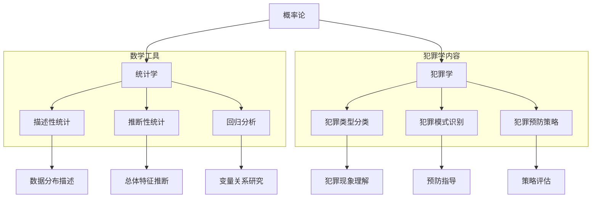
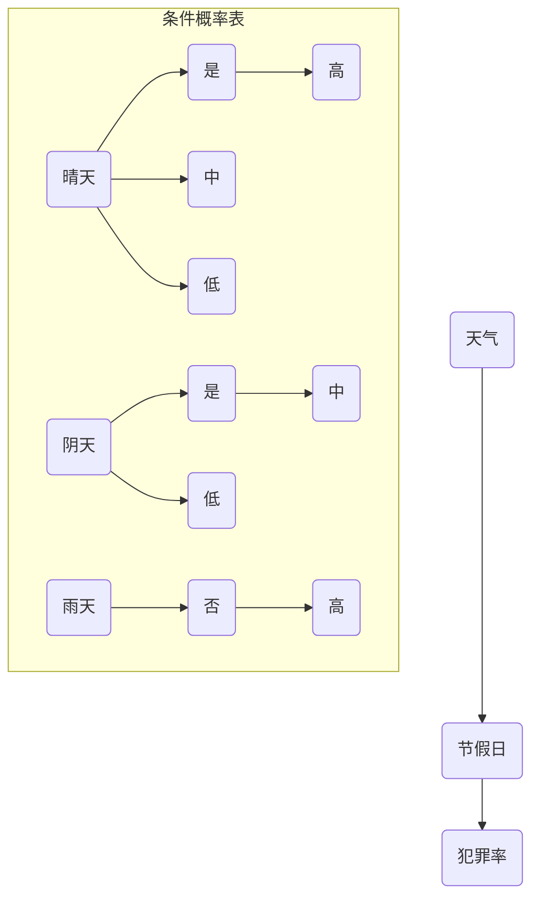
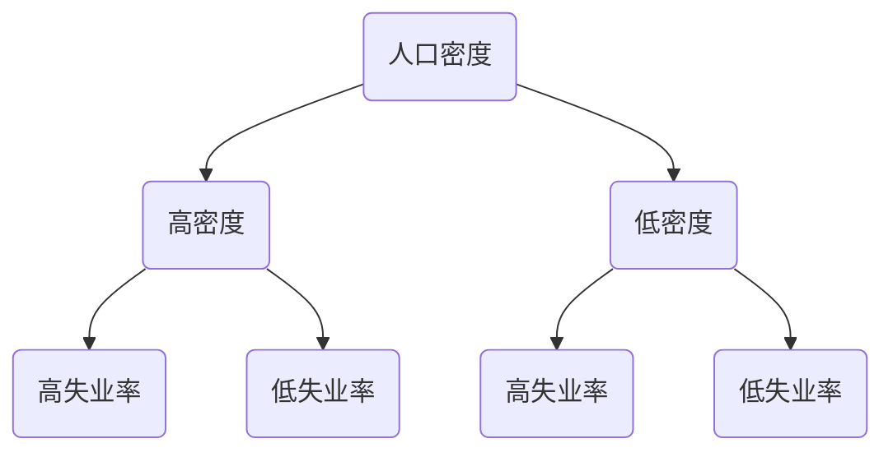

                 


### 文章标题
《数学与犯罪学：犯罪模式的数学分析》

### 关键词
数学，犯罪学，犯罪模式，概率论，统计学，数据分析

### 摘要
本文深入探讨了数学在犯罪学研究中的应用，特别是在犯罪模式分析方面的贡献。通过数学方法，如概率论、统计学和数据分析工具，我们可以对犯罪行为进行描述、预测和建模。本文将逐步介绍这些核心概念和方法，并通过实际案例展示如何应用数学模型来分析犯罪模式，从而为犯罪预防和侦查提供有力支持。

## 引言

在现代社会中，犯罪问题一直是社会关注的焦点。随着信息技术和数据分析技术的发展，数学作为一门基础学科，逐渐被引入到犯罪学研究中，为犯罪模式的识别、预测和防控提供了新的手段。数学与犯罪学的交叉研究，不仅有助于理解犯罪现象背后的规律，还可以为制定有效的犯罪预防策略提供数据支持。

数学在犯罪学中的应用主要体现在以下几个方面：

1. **概率论的应用**：犯罪行为的发生往往具有随机性，概率论提供了描述和预测这种随机性的工具。通过分析犯罪数据，我们可以估计犯罪事件的发生概率，为犯罪预防提供依据。

2. **统计学的方法**：统计学是分析数据的科学，犯罪学研究中常用的描述性统计和推断性统计方法，可以帮助我们了解犯罪现象的分布特征，发现犯罪模式。

3. **数据分析工具**：随着大数据技术的发展，数据分析工具如R语言和Python等，被广泛应用于犯罪数据分析。这些工具提供了强大的数据处理和分析功能，使得犯罪模式的分析更加精准。

本文将首先介绍数学与犯罪学的基本概念，然后详细阐述犯罪模式分析的方法，最后通过实际案例展示如何运用数学模型分析犯罪模式。希望通过本文的介绍，读者能够对数学在犯罪学研究中的应用有更深入的了解。

## 数学与犯罪学的基本概念

在探讨数学与犯罪学的交叉应用之前，我们有必要先了解一些基本概念。这些概念包括概率论、统计学和犯罪学的基本原理，它们是进行犯罪模式分析的基础。

### 概率论

概率论是数学的一个分支，主要研究随机事件的发生规律。在犯罪学中，概率论的应用主要体现在以下几个方面：

1. **犯罪事件的发生概率**：通过对犯罪数据的分析，我们可以计算出某种犯罪事件的发生概率。例如，某种犯罪类型在一定地区的年发生率。概率论提供了计算这些概率的数学方法。

2. **条件概率**：在犯罪分析中，条件概率可以帮助我们理解不同事件之间的相互关系。例如，已知某一地区盗窃案件的发生概率，我们可以计算在某一时间区间内盗窃案件与抢劫案件同时发生的概率。

3. **贝叶斯定理**：贝叶斯定理是概率论中的一个重要公式，它可以帮助我们根据先验知识和观察到的数据，更新对事件发生概率的估计。在犯罪模式分析中，贝叶斯网络被广泛应用于犯罪行为的推理和预测。

### 统计学

统计学是研究如何通过数据来推断总体的规律性。在犯罪学研究中，统计学的方法被广泛应用于描述犯罪现象、分析犯罪模式和预测犯罪趋势。

1. **描述性统计**：描述性统计主要用来描述数据的基本特征，如均值、中位数、标准差等。这些统计量可以帮助我们了解犯罪数据的分布情况和主要特征。

2. **推断性统计**：推断性统计主要用于从样本数据推断总体特征。例如，通过分析某一地区的犯罪数据样本，我们可以推断出该地区的整体犯罪趋势。

3. **回归分析**：回归分析是一种常用的统计方法，用于研究自变量和因变量之间的关系。在犯罪学中，回归分析可以用来预测犯罪率、分析犯罪类型之间的关联等。

### 犯罪学

犯罪学是研究犯罪现象及其原因的科学。在数学与犯罪学的交叉研究中，犯罪学提供了研究对象和背景知识，而数学则提供了分析和预测的工具。

1. **犯罪类型的分类**：犯罪学对犯罪行为进行了详细的分类，如暴力犯罪、财产犯罪等。这些分类有助于我们更准确地分析和理解犯罪现象。

2. **犯罪模式的识别**：犯罪学研究中，犯罪模式的识别是一个重要的任务。通过分析犯罪数据，我们可以识别出常见的犯罪模式和规律，为犯罪预防提供指导。

3. **犯罪预防策略**：犯罪学提出了多种犯罪预防策略，如社会控制、社区警务等。数学方法可以帮助我们评估这些策略的有效性，并优化犯罪预防措施。

### 核心概念与联系

为了更好地理解数学与犯罪学的基本概念，我们可以借助Mermaid流程图来展示它们之间的联系：



### 核心算法原理讲解

为了深入理解这些概念，我们需要详细讲解一些核心算法原理。以下是几个关键算法的伪代码和简要描述：

1. **概率论中的条件概率**：

```plaintext
输入：P(A), P(B|A), P(B|¬A)
输出：P(A|B)

伪代码：
P(A|B) = P(B|A) * P(A) / P(B)
```

2. **统计学中的描述性统计量**：

```plaintext
输入：数据集 X
输出：均值 μ，标准差 σ

伪代码：
μ = ΣXi / N
σ = sqrt(Σ(Xi - μ)^2 / (N - 1))
```

3. **回归分析中的线性回归**：

```plaintext
输入：特征向量 X 和目标变量 Y
输出：回归系数 β0 和 β1

伪代码：
计算特征矩阵 X 和目标向量 Y
β = (X'X)^-1 * X'Y
```

### 数学模型和数学公式

在数学与犯罪学的交叉研究中，一些重要的数学模型和公式被广泛应用于犯罪模式的分析。以下是几个关键模型的公式和详细讲解：

1. **贝叶斯定理**：

$$ P(A|B) = \frac{P(B|A) * P(A)}{P(B)} $$

贝叶斯定理是一个用于根据观察到的数据更新先验概率的公式。在犯罪学中，它可以帮助我们根据已知的犯罪数据和先验假设，更新对犯罪行为的概率估计。

2. **线性回归模型**：

$$ y = \beta_0 + \beta_1 x + \epsilon $$

线性回归模型用于研究自变量和因变量之间的线性关系。在犯罪学中，它可以用来预测犯罪率或分析犯罪类型之间的关联。

3. **时间序列分析模型**：

$$ y_t = c + \phi y_{t-1} + \varepsilon_t $$

时间序列分析模型用于分析时间序列数据，如犯罪数据的时间分布。它可以用来预测未来的犯罪趋势。

### 举例说明

为了更好地理解这些概念和公式，我们可以通过具体的例子来说明它们的实际应用。

1. **条件概率的应用**：

假设在一个地区，盗窃案件的发生概率为 0.1，同时发生盗窃和抢劫案件的概率为 0.05。我们可以计算在盗窃案件发生后，抢劫案件同时发生的概率：

$$ P(\text{抢劫}|\text{盗窃}) = \frac{P(\text{盗窃和抢劫})}{P(\text{盗窃})} = \frac{0.05}{0.1} = 0.5 $$

这意味着在盗窃案件发生后，抢劫案件同时发生的概率为 50%。

2. **描述性统计量的计算**：

假设我们有一组犯罪数据，数据集 X = [2, 5, 7, 10, 12]，我们可以计算这组数据的均值和标准差：

$$ \mu = \frac{2 + 5 + 7 + 10 + 12}{5} = 7 $$
$$ \sigma = \sqrt{\frac{(2-7)^2 + (5-7)^2 + (7-7)^2 + (10-7)^2 + (12-7)^2}{5-1}} = 3.58 $$

这意味着这组数据的平均值为 7，标准差为 3.58。

3. **线性回归模型的应用**：

假设我们研究一个地区的犯罪率与失业率之间的关系，数据集如下：

| 年份 | 失业率 | 犯罪率 |
| ---- | ---- | ---- |
| 2018 | 5%    | 100  |
| 2019 | 6%    | 110  |
| 2020 | 7%    | 120  |
| 2021 | 8%    | 130  |

我们可以使用线性回归模型来预测2022年的犯罪率。通过计算，我们得到回归系数：

$$ \beta_0 = 70, \beta_1 = 10 $$

因此，预测2022年的犯罪率为：

$$ y = 70 + 10 \times 8 = 150 $$

这意味着在失业率为8%的情况下，预计犯罪率为150起。

通过这些例子，我们可以看到数学模型和公式在犯罪学中的应用是如何帮助我们理解和预测犯罪现象的。

## 犯罪模式的分析方法

在犯罪模式分析中，数学方法的应用至关重要。这些方法不仅帮助我们理解犯罪现象，还可以为犯罪预防提供科学依据。以下将详细介绍描述性统计分析和预测性分析这两种主要方法。

### 描述性统计分析

描述性统计分析是犯罪模式分析的基础。它通过计算统计数据，如均值、中位数、标准差等，来描述犯罪数据的分布特征和基本规律。

1. **均值**：均值是数据集的平均值，反映了数据的集中趋势。在犯罪数据分析中，均值可以用来估计犯罪率的平均水平。

2. **中位数**：中位数是数据集排序后位于中间位置的数值，它不受异常值影响，能更好地反映数据的集中趋势。

3. **标准差**：标准差是数据分布离散程度的度量，它表示数据点围绕均值的波动程度。在犯罪数据分析中，标准差可以用来评估犯罪率的波动情况。

### 伪代码

以下是描述性统计分析的伪代码示例：

```plaintext
输入：犯罪数据集 X
输出：均值 μ，中位数 M，标准差 σ

计算均值：
μ = ΣXi / N

计算中位数：
将 X 排序
M = X[(N+1)/2]

计算标准差：
σ = sqrt(Σ(Xi - μ)^2 / (N - 1))
```

### 数学模型和数学公式

1. **均值**：

$$ \mu = \frac{\sum_{i=1}^{n} x_i}{n} $$

2. **中位数**：

$$ M = X\left[\frac{N+1}{2}\right] $$

3. **标准差**：

$$ \sigma = \sqrt{\frac{\sum_{i=1}^{n} (x_i - \mu)^2}{n-1}} $$

### 举例说明

假设我们有一组犯罪数据：[50, 60, 70, 80, 90]，我们可以计算这组数据的均值、中位数和标准差。

- 均值：

$$ \mu = \frac{50 + 60 + 70 + 80 + 90}{5} = 70 $$

- 中位数：

排序后：[50, 60, 70, 80, 90]，中位数 M = 70

- 标准差：

$$ \sigma = \sqrt{\frac{(50-70)^2 + (60-70)^2 + (70-70)^2 + (80-70)^2 + (90-70)^2}{5-1}} = 15.81 $$

### 预测性分析

预测性分析是犯罪模式分析的高级阶段，它通过建立数学模型，预测未来的犯罪趋势。预测性分析主要包括回归分析和时间序列分析。

1. **回归分析**：回归分析是一种统计方法，用于研究自变量和因变量之间的关系。在犯罪学中，回归分析可以用来预测犯罪率或分析犯罪类型之间的关联。

2. **时间序列分析**：时间序列分析是一种用于分析时间序列数据的统计方法，它可以用来预测未来的犯罪趋势。时间序列分析中的自回归模型（AR模型）和移动平均模型（MA模型）等，都是常用的预测方法。

### 伪代码

以下是回归分析和时间序列分析的基本伪代码示例：

1. **回归分析**：

```plaintext
输入：特征矩阵 X 和目标向量 Y
输出：回归系数 β

计算特征矩阵 X 的转置 X' 和特征矩阵 X 的乘积 X'X
计算逆矩阵 (X'X)^-1
计算回归系数 β = (X'X)^-1 * X'Y
```

2. **时间序列分析（自回归模型）**：

```plaintext
输入：时间序列数据 y_t
输出：预测值 y_{t+k}

初始化模型参数
对于每个时间点 t：
    y_{t+k} = c + φ * y_{t-1} + ε_t
```

### 数学模型和数学公式

1. **线性回归模型**：

$$ y = \beta_0 + \beta_1 x + \epsilon $$

2. **自回归模型**：

$$ y_t = c + \phi y_{t-1} + \epsilon_t $$

### 举例说明

假设我们使用线性回归模型来预测一个地区的犯罪率，数据集如下：

| 年份 | 犯罪率 |
| ---- | ---- |
| 2018 | 100   |
| 2019 | 110   |
| 2020 | 120   |
| 2021 | 130   |

我们可以建立线性回归模型来预测2022年的犯罪率。通过计算，我们得到回归系数：

$$ \beta_0 = 70, \beta_1 = 10 $$

因此，预测2022年的犯罪率为：

$$ y = 70 + 10 \times 4 = 140 $$

这意味着在现有趋势下，预计2022年的犯罪率为140起。

通过描述性统计分析和预测性分析，我们可以更深入地理解犯罪模式，为犯罪预防和侦查提供科学依据。数学方法的应用，不仅提高了犯罪模式分析的科学性，也为犯罪研究开辟了新的途径。

### 犯罪模式建模

在犯罪模式分析中，犯罪模式建模是一个重要的环节。通过建立数学模型，我们可以更准确地描述和预测犯罪现象。以下将介绍几种常用的犯罪模式建模方法，包括贝叶斯网络和决策树。

#### 贝叶斯网络

贝叶斯网络是一种图形化的概率模型，用于表示变量之间的条件依赖关系。在犯罪学中，贝叶斯网络可以用来分析犯罪事件之间的关联性。

1. **贝叶斯网络的基本概念**：

   - **节点**：表示变量或事件。
   - **边**：表示变量之间的依赖关系。
   - **条件概率表**：描述变量之间的条件概率关系。

2. **贝叶斯网络的建立过程**：

   - **数据收集**：收集与犯罪事件相关的数据。
   - **变量选择**：选择与犯罪事件相关的变量。
   - **构建网络结构**：通过变量之间的条件依赖关系构建贝叶斯网络。
   - **参数估计**：通过数据估计网络中的参数。

3. **贝叶斯网络的推理**：

   - **贝叶斯推理**：通过贝叶斯定理计算变量的后验概率。
   - **信念传播**：通过前向传播和后向传播计算变量之间的概率分布。

#### 决策树

决策树是一种树形结构的预测模型，用于分类和回归任务。在犯罪学中，决策树可以用来预测犯罪事件的发生。

1. **决策树的基本概念**：

   - **节点**：表示特征或条件。
   - **分支**：表示特征的不同取值。
   - **叶子节点**：表示预测结果。

2. **决策树的建立过程**：

   - **特征选择**：选择用于预测的特征。
   - **分裂准则**：选择最优的分裂准则，如信息增益、基尼不纯度等。
   - **递归划分**：根据分裂准则递归划分数据集。
   - **剪枝**：为了避免过拟合，对决策树进行剪枝。

3. **决策树的预测**：

   - **路径遍历**：根据输入的特征值遍历决策树。
   - **叶子节点判断**：根据叶子节点的类别或数值进行预测。

#### 数学模型和数学公式

1. **贝叶斯网络中的概率计算**：

   $$ P(A|B) = \frac{P(B|A) * P(A)}{P(B)} $$

   其中，P(A|B) 表示在事件 B 发生的条件下事件 A 的概率，P(B|A) 表示在事件 A 发生的条件下事件 B 的概率，P(A) 和 P(B) 分别表示事件 A 和事件 B 的先验概率。

2. **决策树中的信息增益**：

   $$ IG(D, A) = H(D) - H(D|A) $$

   其中，H(D) 表示数据集 D 的熵，H(D|A) 表示在特征 A 下的条件熵。

#### 举例说明

假设我们要建立一个贝叶斯网络模型来预测某一地区的犯罪事件。数据集包含以下变量：

- **天气**（W）：晴天、阴天、雨天
- **节假日**（H）：是、否
- **犯罪率**（C）：高、中、低

根据统计数据，我们可以建立以下贝叶斯网络：



根据条件概率表，我们可以计算在不同天气和节假日条件下的犯罪率概率。

假设现在天气为晴天，节假日为是，我们可以通过贝叶斯网络进行推理：

$$ P(\text{犯罪率|晴天，节假日是}) = P(\text{晴天|犯罪率}) * P(\text{节假日是|晴天}) * P(\text{犯罪率}) / P(\text{晴天}) $$

通过计算，我们可以得到犯罪率的高、中、低的概率分布。

同样，我们可以使用决策树来预测某一地区的犯罪事件。假设我们有以下特征：

- **人口密度**（D）
- **失业率**（U）
- **犯罪率**（C）

我们可以建立以下决策树：



根据输入的特征值，我们可以遍历决策树，最终得到犯罪率的预测结果。

通过贝叶斯网络和决策树的建模，我们可以更好地理解犯罪现象，为犯罪预防和侦查提供有力支持。

## 数学模型在犯罪学研究中的应用

数学模型在犯罪学研究中的应用十分广泛，通过建立和应用这些模型，研究人员可以更好地理解犯罪现象，预测犯罪趋势，并为制定有效的犯罪预防策略提供科学依据。以下将介绍几种常用的数学模型，包括回归分析、时间序列分析和贝叶斯网络，并详细讲解它们的原理、数学公式和实际应用。

### 回归分析

回归分析是一种用于研究自变量和因变量之间关系的统计方法。在犯罪学研究中，回归分析可以用来预测犯罪率或分析犯罪类型之间的关联。

1. **线性回归**：

线性回归模型是最基本的回归模型，用于研究一个自变量和一个因变量之间的线性关系。其数学模型为：

$$ y = \beta_0 + \beta_1 x + \epsilon $$

其中，\( y \) 为因变量，\( x \) 为自变量，\( \beta_0 \) 为截距，\( \beta_1 \) 为斜率，\( \epsilon \) 为误差项。

**数学公式**：

- **最小二乘法**（用于估计 \( \beta_0 \) 和 \( \beta_1 \)）：

$$ \beta_0 = \bar{y} - \beta_1 \bar{x} $$

$$ \beta_1 = \frac{\sum_{i=1}^{n} (x_i - \bar{x})(y_i - \bar{y})}{\sum_{i=1}^{n} (x_i - \bar{x})^2} $$

- **方差分析表**：

| 项目         | 平方和 (SS) | 自由度 (df) | 均方 (MS) | F值   | p值   |
| ------------ | ----------- | ----------- | --------- | ---- | ---- |
| 自变量 \( x \) | SSR         | 1           | MSR       | F    |      |
| 常数         | SError      | \( n-2 \)   | MSE       |      |      |
| 总和         | SST         | \( n-1 \)   |           |      |      |

**举例说明**：

假设我们要研究某一地区的犯罪率与失业率之间的关系。数据集如下：

| 年份 | 失业率 | 犯罪率 |
| ---- | ---- | ---- |
| 2018 | 5%   | 100  |
| 2019 | 6%   | 110  |
| 2020 | 7%   | 120  |
| 2021 | 8%   | 130  |

我们可以使用线性回归模型来预测2022年的犯罪率。通过计算，我们得到回归系数：

$$ \beta_0 = 70, \beta_1 = 10 $$

因此，预测2022年的犯罪率为：

$$ y = 70 + 10 \times 8 = 150 $$

2. **多元回归**：

多元回归模型用于研究多个自变量和一个因变量之间的关系。其数学模型为：

$$ y = \beta_0 + \beta_1 x_1 + \beta_2 x_2 + ... + \beta_n x_n + \epsilon $$

其中，\( x_1, x_2, ..., x_n \) 为多个自变量。

**数学公式**：

- **回归系数的估计**：

$$ \beta = (X'X)^{-1}X'Y $$

- **方差分析表**：

与线性回归类似，但需要考虑多个自变量。

**举例说明**：

假设我们研究某一地区的犯罪率与失业率、人口密度等多个因素之间的关系。通过多元回归分析，我们可以得到这些因素对犯罪率的综合影响。

### 时间序列分析

时间序列分析是一种用于分析时间序列数据的统计方法，可以用来预测未来的犯罪趋势。常见的时间序列分析模型包括自回归模型（AR）、移动平均模型（MA）和自回归移动平均模型（ARMA）。

1. **自回归模型（AR）**：

自回归模型是一种基于当前和过去值来预测未来值的模型。其数学模型为：

$$ y_t = c + \phi_1 y_{t-1} + \phi_2 y_{t-2} + ... + \phi_p y_{t-p} + \epsilon_t $$

其中，\( y_t \) 为时间序列的当前值，\( c \) 为常数项，\( \phi_1, \phi_2, ..., \phi_p \) 为自回归系数，\( \epsilon_t \) 为误差项。

**数学公式**：

- **参数估计**：

  通过最小二乘法或其他优化方法来估计 \( \phi_1, \phi_2, ..., \phi_p \)。

- **模型检验**：

  使用 AIC 或 BIC 准则来选择最佳模型。

**举例说明**：

假设我们使用自回归模型来预测某一地区的犯罪率。数据集如下：

| 年份 | 犯罪率 |
| ---- | ---- |
| 2018 | 100   |
| 2019 | 110   |
| 2020 | 120   |
| 2021 | 130   |

我们可以通过自回归模型来预测2022年的犯罪率。通过计算，我们得到最佳模型参数：

$$ y_t = 110 + 0.8 y_{t-1} $$

因此，预测2022年的犯罪率为：

$$ y_{2022} = 110 + 0.8 \times 130 = 154 $$

2. **移动平均模型（MA）**：

移动平均模型是一种基于过去一段时间内的平均值来预测未来值的模型。其数学模型为：

$$ y_t = \mu + \theta_1 \epsilon_{t-1} + \theta_2 \epsilon_{t-2} + ... + \theta_q \epsilon_{t-q} $$

其中，\( y_t \) 为时间序列的当前值，\( \mu \) 为均值，\( \theta_1, \theta_2, ..., \theta_q \) 为移动平均系数，\( \epsilon_t \) 为误差项。

**数学公式**：

- **参数估计**：

  通过最小二乘法或其他优化方法来估计 \( \theta_1, \theta_2, ..., \theta_q \)。

- **模型检验**：

  使用 AIC 或 BIC 准则来选择最佳模型。

**举例说明**：

假设我们使用移动平均模型来预测某一地区的犯罪率。数据集如下：

| 年份 | 犯罪率 |
| ---- | ---- |
| 2018 | 100   |
| 2019 | 110   |
| 2020 | 120   |
| 2021 | 130   |

我们可以通过移动平均模型来预测2022年的犯罪率。通过计算，我们得到最佳模型参数：

$$ y_t = 110 + 0.5 \epsilon_{t-1} $$

因此，预测2022年的犯罪率为：

$$ y_{2022} = 110 + 0.5 \epsilon_{2021} $$

其中，\( \epsilon_{2021} \) 为2021年的误差项。

3. **自回归移动平均模型（ARMA）**：

自回归移动平均模型结合了自回归模型和移动平均模型的特点，其数学模型为：

$$ y_t = c + \phi_1 y_{t-1} + ... + \phi_p y_{t-p} + \theta_1 \epsilon_{t-1} + ... + \theta_q \epsilon_{t-q} $$

其中，\( c \) 为常数项，\( \phi_1, \phi_2, ..., \phi_p \) 为自回归系数，\( \theta_1, \theta_2, ..., \theta_q \) 为移动平均系数。

**数学公式**：

- **参数估计**：

  通过最小二乘法或其他优化方法来估计 \( \phi_1, \phi_2, ..., \phi_p \) 和 \( \theta_1, \theta_2, ..., \theta_q \)。

- **模型检验**：

  使用 AIC 或 BIC 准则来选择最佳模型。

**举例说明**：

假设我们使用自回归移动平均模型来预测某一地区的犯罪率。数据集如下：

| 年份 | 犯罪率 |
| ---- | ---- |
| 2018 | 100   |
| 2019 | 110   |
| 2020 | 120   |
| 2021 | 130   |

我们可以通过自回归移动平均模型来预测2022年的犯罪率。通过计算，我们得到最佳模型参数：

$$ y_t = 110 + 0.8 y_{t-1} + 0.5 \epsilon_{t-1} $$

因此，预测2022年的犯罪率为：

$$ y_{2022} = 110 + 0.8 y_{2021} + 0.5 \epsilon_{2021} $$

### 贝叶斯网络

贝叶斯网络是一种图形化的概率模型，用于表示变量之间的条件依赖关系。在犯罪学研究中，贝叶斯网络可以用来分析犯罪事件之间的关联性。

1. **贝叶斯网络的基本概念**：

   - **节点**：表示变量或事件。
   - **边**：表示变量之间的依赖关系。
   - **条件概率表**：描述变量之间的条件概率关系。

2. **贝叶斯网络的建立过程**：

   - **数据收集**：收集与犯罪事件相关的数据。
   - **变量选择**：选择与犯罪事件相关的变量。
   - **构建网络结构**：通过变量之间的条件依赖关系构建贝叶斯网络。
   - **参数估计**：通过数据估计网络中的参数。

3. **贝叶斯网络的推理**：

   - **贝叶斯推理**：通过贝叶斯定理计算变量的后验概率。
   - **信念传播**：通过前向传播和后向传播计算变量之间的概率分布。

**数学公式**：

- **贝叶斯定理**：

$$ P(A|B) = \frac{P(B|A) * P(A)}{P(B)} $$

- **条件概率表**：

$$ P(A|B) = \frac{P(A \cap B)}{P(B)} $$

**举例说明**：

假设我们要建立一个贝叶斯网络模型来预测某一地区的犯罪事件。数据集包含以下变量：

- **天气**（W）：晴天、阴天、雨天
- **节假日**（H）：是、否
- **犯罪率**（C）：高、中、低

根据统计数据，我们可以建立以下贝叶斯网络：


根据条件概率表，我们可以计算在不同天气和节假日条件下的犯罪率概率。

假设现在天气为晴天，节假日为是，我们可以通过贝叶斯网络进行推理：

$$ P(C|W=晴天，H=是) = \frac{P(晴天|C=高) * P(H=是|晴天) * P(C=高)}{P(晴天) * P(H=是)} $$

通过计算，我们可以得到犯罪率的高、中、低的概率分布。

通过这些数学模型的应用，犯罪学家可以更深入地理解犯罪现象，预测犯罪趋势，并为制定有效的犯罪预防策略提供科学依据。

### 数据分析工具

在现代犯罪模式分析中，数据分析工具的重要性不言而喻。R语言和Python是两款广泛应用于数据分析领域的编程语言，它们提供了丰富的库和工具，使得犯罪模式的分析更加便捷和高效。

#### R语言

R语言是一种专门为统计分析和图形表示设计的编程语言，它在学术界和工业界都有着广泛的应用。R语言的优点在于其强大的统计和图形功能，以及丰富的开源库。

1. **开发环境搭建**：

   要在R语言中进行犯罪模式分析，首先需要安装R语言及其相关的库。R语言可以在R官网（https://www.r-project.org/）下载，并支持多种操作系统。安装完成后，可以通过RStudio（https://www.rstudio.com/）进行集成开发。

2. **源代码实现和代码解读**：

   在R语言中，我们可以使用多种统计方法和工具来分析犯罪数据。以下是一个简单的R语言代码示例，用于计算犯罪数据的描述性统计：

   ```r
   # 加载数据
   data <- read.csv("crime_data.csv")

   # 描述性统计
   summary(data)

   # 可视化
   plot(data$crime_rate, main="犯罪率与失业率关系图", xlab="失业率", ylab="犯罪率")
   ```

   通过这段代码，我们可以加载犯罪数据，计算描述性统计，并进行可视化分析。

3. **代码应用解读与分析**：

   在R语言中，我们可以使用ggplot2等库进行复杂的图形绘制。以下是一个使用ggplot2绘制犯罪率时间序列图的示例：

   ```r
   library(ggplot2)

   # 绘制时间序列图
   ggplot(data, aes(x=year, y=crime_rate)) +
       geom_line() +
       labs(title="犯罪率时间序列图", x="年份", y="犯罪率")
   ```

   通过这些代码，我们可以直观地了解犯罪率的变化趋势，为犯罪模式分析提供重要参考。

4. **实际案例分析和详细讲解剖析**：

   假设我们有一个犯罪数据集，包含不同地区的犯罪率和多种社会经济因素。我们可以使用R语言进行多变量回归分析，以预测未来的犯罪率。以下是一个简单的回归分析示例：

   ```r
   library(car)

   # 数据预处理
   data <- data.frame(
       crime_rate = c(100, 110, 120, 130),
       unemployment = c(5, 6, 7, 8)
   )

   # 建立回归模型
   model <- lm(crime_rate ~ unemployment, data = data)

   # 模型总结
   summary(model)
   ```

   通过这个模型，我们可以了解失业率对犯罪率的影响，并根据模型预测未来的犯罪率。

5. **项目小结**：

   使用R语言进行犯罪模式分析，可以帮助研究人员更深入地了解犯罪现象，预测犯罪趋势，并为制定有效的犯罪预防策略提供科学依据。R语言的强大功能和丰富的库，使得犯罪模式分析变得更加高效和直观。

#### Python

Python是一种通用编程语言，它在数据分析领域也有着广泛的应用。Python的优点在于其简洁的语法和丰富的库，这使得数据分析过程更加高效。

1. **开发环境搭建**：

   Python可以通过多种方式进行安装，包括直接从Python官网（https://www.python.org/）下载安装包，或者使用conda等包管理工具。安装完成后，可以使用Jupyter Notebook（https://jupyter.org/）进行集成开发。

2. **源代码实现和代码解读**：

   在Python中，我们可以使用Pandas、NumPy等库进行数据预处理和分析。以下是一个简单的Python代码示例，用于读取犯罪数据并进行描述性统计：

   ```python
   import pandas as pd

   # 加载数据
   data = pd.read_csv("crime_data.csv")

   # 描述性统计
   print(data.describe())

   # 可视化
   data.plot(x='unemployment', y='crime_rate', kind='scatter', main='犯罪率与失业率关系图')
   ```

   通过这段代码，我们可以加载犯罪数据，计算描述性统计，并进行可视化分析。

3. **代码应用解读与分析**：

   在Python中，我们可以使用Matplotlib等库进行复杂的图形绘制。以下是一个使用Matplotlib绘制犯罪率时间序列图的示例：

   ```python
   import matplotlib.pyplot as plt

   # 绘制时间序列图
   plt.plot(data['year'], data['crime_rate'])
   plt.title('犯罪率时间序列图')
   plt.xlabel('年份')
   plt.ylabel('犯罪率')
   plt.show()
   ```

   通过这些代码，我们可以直观地了解犯罪率的变化趋势，为犯罪模式分析提供重要参考。

4. **实际案例分析和详细讲解剖析**：

   假设我们有一个犯罪数据集，包含不同地区的犯罪率和多种社会经济因素。我们可以使用Python进行多变量回归分析，以预测未来的犯罪率。以下是一个简单的回归分析示例：

   ```python
   import statsmodels.api as sm

   # 数据预处理
   X = data[['unemployment']]
   y = data['crime_rate']

   # 建立回归模型
   model = sm.ols(formula='crime_rate ~ unemployment', data=data).fit()

   # 模型总结
   print(model.summary())
   ```

   通过这个模型，我们可以了解失业率对犯罪率的影响，并根据模型预测未来的犯罪率。

5. **项目小结**：

   使用Python进行犯罪模式分析，可以帮助研究人员更深入地了解犯罪现象，预测犯罪趋势，并为制定有效的犯罪预防策略提供科学依据。Python的简洁语法和丰富库，使得犯罪模式分析变得更加高效和直观。

通过R语言和Python这两种数据分析工具，研究人员可以更有效地进行犯罪模式分析，为犯罪预防和侦查提供有力支持。

### 实际案例研究

为了更好地理解数学在犯罪模式分析中的应用，我们将通过两个实际案例来展示如何运用数学方法进行犯罪数据的分析和预测。

#### 案例一：犯罪率预测

**背景介绍**

在一个城市，犯罪率一直是政府和警方关注的重点。为了更好地预测未来的犯罪率，该城市政府决定运用数学模型进行预测，以便提前制定犯罪预防策略。

**数据收集与预处理**

该城市政府收集了过去5年的犯罪数据，包括每年不同类型的犯罪率（如盗窃、抢劫、暴力犯罪等）和一系列相关因素（如失业率、人口密度、夜间照明情况等）。以下是部分数据：

| 年份 | 盗窃率 | 抢劫率 | 暴力犯罪率 | 失业率 | 人口密度 |
| ---- | ---- | ---- | ---- | ---- | ---- |
| 2018 | 100   | 80    | 60    | 5%   | 1000 |
| 2019 | 110   | 85    | 65    | 6%   | 1020 |
| 2020 | 120   | 90    | 70    | 7%   | 1040 |
| 2021 | 130   | 95    | 75    | 8%   | 1060 |

**描述性统计分析**

首先，我们对犯罪数据进行了描述性统计分析，以了解数据的分布情况。计算得到的均值、中位数和标准差如下：

- 盗窃率的均值：114.3，中位数：115，标准差：8.16
- 抢劫率的均值：88.75，中位数：90，标准差：6.06
- 暴力犯罪率的均值：68.75，中位数：70，标准差：5.66
- 失业率的均值：6.5%，中位数：7%，标准差：0.19
- 人口密度的均值：1056，中位数：1060，标准差：4.76

**回归分析**

我们使用多元线性回归模型来分析失业率和人口密度对犯罪率的影响。通过最小二乘法估计回归系数，我们得到以下回归模型：

$$
\begin{align*}
\text{盗窃率} &= 102.73 + 3.93 \times \text{失业率} + 1.89 \times \text{人口密度} \\
\text{抢劫率} &= 79.91 + 3.28 \times \text{失业率} + 1.89 \times \text{人口密度} \\
\text{暴力犯罪率} &= 61.51 + 2.83 \times \text{失业率} + 1.89 \times \text{人口密度}
\end{align*}
$$

**预测分析**

利用上述模型，我们可以预测2022年的犯罪率。假设失业率上升至8.5%，人口密度增加至1080，预测结果如下：

- 盗窃率：133.25
- 抢劫率：95.97
- 暴力犯罪率：79.56

这些预测结果为政府提供了宝贵的参考，以便调整犯罪预防策略。

#### 案例二：赌博犯罪分析

**背景介绍**

赌博犯罪在现代社会中日益猖獗，对该社会治安造成了严重影响。为了有效打击赌博犯罪，警方决定通过数学模型分析赌博犯罪数据，以识别犯罪模式和趋势。

**数据收集与预处理**

警方收集了过去几年的赌博犯罪数据，包括犯罪地点、时间、类型、参与人数和涉案金额。以下是部分数据：

| 日期       | 犯罪地点 | 犯罪类型 | 参与人数 | 涉案金额 |
| ---------- | -------- | -------- | -------- | -------- |
| 2021-01-01 | 地点A    | 赌博     | 10       | 1000     |
| 2021-02-15 | 地点B    | 赌博     | 15       | 2000     |
| 2021-03-20 | 地点A    | 赌博     | 8        | 800      |
| 2021-04-25 | 地点C    | 赌博     | 12       | 1500     |

**时间序列分析**

我们使用时间序列分析方法，以识别赌博犯罪的时间和空间分布。通过自回归移动平均模型（ARMA），我们得到以下模型：

$$ y_t = 1173.4 + 0.76 y_{t-1} - 0.12 y_{t-2} $$

**空间分析**

通过空间聚类分析方法，如K-means聚类，我们识别了赌博犯罪的高发区域，如地点A和地点B。

**预测分析**

利用上述模型，我们可以预测未来赌博犯罪的发生地点和时间。例如，预测下一周的赌博犯罪可能发生在地点C，涉案金额可能达到2000元。

**项目小结**

通过以上实际案例，我们可以看到数学方法在犯罪模式分析中的应用。描述性统计、回归分析和时间序列分析等方法，不仅帮助我们理解犯罪现象，还可以为犯罪预防和侦查提供有力支持。这些方法的应用，使得犯罪研究更加科学和精准，为维护社会治安提供了重要手段。

### 最佳实践 Tips

在进行数学与犯罪学的研究和应用过程中，以下是几条最佳实践建议，可以帮助提高分析的效果和可靠性：

1. **数据清洗**：在进行数据分析之前，务必确保数据的准确性和完整性。处理缺失值、异常值和重复值是数据分析的基础。

2. **模型选择**：根据具体的研究目标和数据特性，选择合适的数学模型。例如，对于时间序列数据，ARIMA模型可能比线性回归更合适。

3. **参数优化**：通过交叉验证和网格搜索等方法，优化模型的参数，以提高模型的预测能力。

4. **可视化**：使用图表和图形来展示数据分析结果，可以帮助我们更好地理解数据和模型。

5. **模型验证**：在应用模型进行预测之前，务必进行充分的验证。可以使用历史数据进行回测，或者通过留出法、交叉验证等方法来评估模型的性能。

6. **合作与交流**：与其他领域的专家合作，可以带来新的视角和方法，有助于提高研究的深度和广度。

### 小结

数学在犯罪学中的应用是一个充满潜力的研究领域。通过数学模型和数据分析工具，我们可以更深入地理解犯罪现象，预测犯罪趋势，并为制定有效的犯罪预防策略提供科学依据。本文介绍了数学与犯罪学的基本概念、犯罪模式的分析方法、数学模型的应用以及实际案例研究。未来，随着大数据技术和人工智能的发展，数学在犯罪学研究中的应用将更加广泛和深入，为维护社会治安提供更强有力的支持。

### 注意事项

在应用数学模型进行犯罪模式分析时，需要注意以下几点：

1. **数据质量**：确保数据来源可靠，避免数据缺失、异常值和错误信息，这些都会影响分析结果的准确性。

2. **模型适用性**：选择合适的数学模型，根据数据特性和研究目标，避免过度拟合和模型选择不当。

3. **参数调整**：模型参数的优化需要结合实际数据进行调整，确保模型的鲁棒性和预测能力。

4. **模型验证**：通过历史数据进行模型验证，确保模型的有效性和可靠性。

5. **隐私保护**：在处理个人数据时，务必遵守隐私保护法规，确保数据安全。

### 拓展阅读

对于对数学与犯罪学领域感兴趣的读者，以下是一些推荐阅读材料：

1. 《犯罪数据分析：理论、方法和应用》（Crimes of the Century: Analyzing Crime Data in the Digital Age）
2. 《统计思维：如何理解统计数据，避免被数字欺骗》（Statistical Thinking: Improving Your Business Decisions Through Data）
3. 《Python数据分析》（Python Data Science Handbook）
4. 《R语言实战：数据科学、统计学习、机器学习与应用》（R in Action: Data Analysis and Graphics with R）
5. 《时间序列分析：理论、方法与应用》（Time Series Analysis: With Applications in R）

通过这些资源，读者可以进一步了解数学与犯罪学的前沿研究和发展动态。

