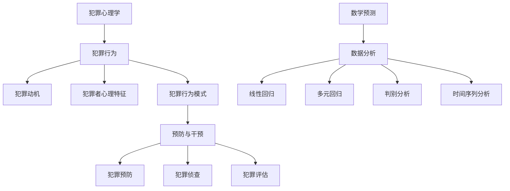
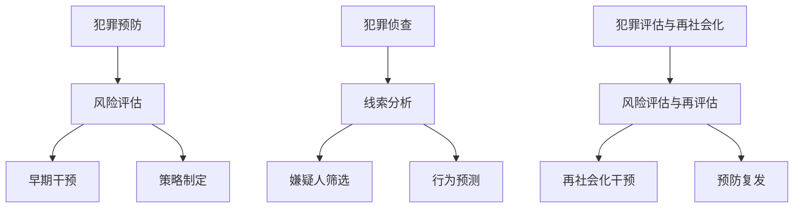

                 


### 文章标题: 《数学与犯罪心理学：犯罪行为的数学预测》

#### 关键词：
- 犯罪心理学
- 数学预测
- 线性回归
- 多元回归
- 判别分析
- 时间序列分析

#### 摘要：
本文旨在探讨数学与犯罪心理学之间的交叉应用，特别是在犯罪行为预测方面的数学模型及其应用。通过介绍线性回归、多元回归、判别分析和时间序列分析等核心数学模型，本文将详细阐述这些模型在犯罪预测中的原理和应用。此外，文章还将通过实际案例分析和项目实战，展示数学预测技术在犯罪心理学中的具体应用和效果。

### 目录大纲

## 第一部分：数学与犯罪心理学概述

### 1.1 犯罪心理学与数学预测的关系

- **核心概念与联系**
  - 犯罪心理学的定义和研究对象
  - 数学预测的基本原理和应用场景
  - 犯罪心理学与数学预测的交叉应用
  - **图 1.1.1 犯罪心理学与数学预测的联系架构**

### 1.2 数学预测在犯罪学中的应用历史

- **核心概念与联系**
  - 传统犯罪预测方法的发展历程
  - 数学预测技术的崛起与变革
  - 现代数学预测技术的应用现状
  - **图 1.2.1 数学预测在犯罪学中的应用历史**

### 1.3 数学预测技术在犯罪心理学中的角色

- **核心概念与联系**
  - 数学预测技术在犯罪预防中的应用
  - 数学预测技术在犯罪侦查中的应用
  - 数学预测技术在犯罪评估和再社会化中的应用
  - **图 1.3.1 数学预测技术在犯罪心理学中的应用角色**

## 第二部分：数学模型在犯罪预测中的应用

### 2.1 线性回归模型在犯罪预测中的应用

- **核心算法原理讲解**
  - 线性回归模型的数学原理
    $$ y = \beta_0 + \beta_1x $$
  - 线性回归模型的伪代码

### 2.2 多元回归分析在犯罪预测中的应用

- **核心算法原理讲解**
  - 多元回归模型的数学原理
    $$ y = \beta_0 + \beta_1x_1 + \beta_2x_2 + ... + \beta_nx_n $$
  - 多元回归模型的伪代码

### 2.3 判别分析在犯罪预测中的应用

- **核心算法原理讲解**
  - 判别分析的数学原理
    $$ \hat{y} = \arg\min_c \sum_{i=1}^{n} (y_i - \mu_c)^2 $$
  - 判别分析的伪代码

### 2.4 时间序列分析在犯罪预测中的应用

- **核心算法原理讲解**
  - 时间序列分析的数学原理
    $$ X_t = A X_{t-1} + B $$
  - 时间序列分析的伪代码

## 第三部分：数学预测在犯罪心理学中的应用案例

### 3.1 犯罪行为预测的实际应用

- **项目实战**
  - 实际案例介绍
  - 实际应用场景与效果分析

### 3.2 犯罪心理学与数学预测的交叉应用

- **项目实战**
  - 跨学科项目案例
  - 项目开发过程与效果评估

### 3.3 挑战与未来展望

- **未来展望**
  - 犯罪预测技术的发展趋势
  - 犯罪预测技术面临的挑战

## 附录

### 4.1 数学预测工具与资源

- **附录**
  - 主流数学预测工具介绍
  - 相关资源推荐

### 4.2 练习题与案例分析

- **练习题**
  - 犯罪预测相关的习题
  - 案例分析指导

### 作者信息：
- 作者：AI天才研究院/AI Genius Institute & 禅与计算机程序设计艺术/Zen And The Art of Computer Programming## 第一部分：数学与犯罪心理学概述

### 1.1 犯罪心理学与数学预测的关系

- **核心概念与联系**

犯罪心理学是研究犯罪行为、犯罪动机、犯罪者的心理特征以及犯罪预防与犯罪干预的科学。它关注的是人的心理过程和个性特征如何导致犯罪行为的发生。数学预测，特别是统计学和概率论的应用，则是一种通过分析数据来预测未来事件的方法。

**犯罪心理学的定义和研究对象：**

犯罪心理学主要研究以下几个方面：
- 犯罪者的心理特征，包括个性、心理状态、认知能力等。
- 犯罪动机，即导致个体犯罪的心理因素。
- 犯罪行为模式，包括犯罪发生的频率、时间和地点。
- 犯罪预防策略和心理干预方法。

**数学预测的基本原理和应用场景：**

数学预测，特别是统计学和概率论，利用历史数据来预测未来事件的可能性。其基本原理包括：
- 数据收集与处理：收集相关的犯罪数据，如犯罪率、犯罪类型、犯罪者特征等。
- 模型建立：使用统计学方法建立预测模型，如线性回归、判别分析、时间序列分析等。
- 模型验证：通过历史数据验证模型的准确性和可靠性。
- 预测与决策：使用验证后的模型对未来犯罪行为进行预测，并据此制定预防策略。

**犯罪心理学与数学预测的交叉应用：**

犯罪心理学与数学预测的结合，可以提供以下几方面的应用：
- **犯罪预防：** 利用数学预测技术，预测犯罪行为的可能性和趋势，从而制定有效的预防措施。
- **犯罪侦查：** 通过分析犯罪数据和犯罪者的心理特征，帮助警方识别犯罪嫌疑人。
- **犯罪评估：** 对犯罪者的再社会化风险进行评估，预测其未来犯罪的可能性。

### 图 1.1.1 犯罪心理学与数学预测的联系架构

```
+-----------------+
|     犯罪心理学   |
+-----------------+
       |
       ↓
+-----------------+
|   数学预测技术   |
+-----------------+
       |
       ↓
+-----------------+
|  犯罪预防与侦查  |
+-----------------+
       |
       ↓
+-----------------+
|  犯罪评估与干预  |
+-----------------+
```

在图中，犯罪心理学与数学预测技术通过数据收集和分析过程相互结合，最终应用于犯罪预防、侦查、评估和干预等多个领域。

## 1.2 数学预测在犯罪学中的应用历史

- **核心概念与联系**

数学预测在犯罪学中的应用可以追溯到上世纪初。早期的犯罪预测主要依赖于经验和直觉，但随着统计学和计算机技术的发展，数学预测方法逐渐成为犯罪学研究的重要工具。以下是数学预测在犯罪学中的应用历史概述。

### 传统犯罪预测方法的发展历程

- **20世纪初：** 犯罪预测初现端倪。犯罪学家开始利用统计数据来分析犯罪行为，并尝试找出犯罪行为的规律性。
- **20世纪50年代：** 犯罪预测方法开始向数学模型靠拢。线性回归、判别分析和时间序列分析等统计方法被广泛应用于犯罪预测。
- **20世纪70年代：** 计算机技术的兴起使得大规模数据处理成为可能，犯罪预测技术得到进一步发展。

### 数学预测技术的崛起与变革

- **20世纪80年代：** 随着统计学和计算机科学的深入发展，更加复杂的数学模型开始应用于犯罪预测，如多元回归分析和神经网络。
- **20世纪90年代：** 犯罪预测技术开始向智能化方向发展，机器学习和数据挖掘技术被引入犯罪预测领域。
- **21世纪：** 网络犯罪和跨国犯罪的兴起，推动了犯罪预测技术的进一步发展。大数据分析和人工智能技术的应用，使得犯罪预测的准确性和实时性得到显著提升。

### 现代数学预测技术的应用现状

- **大数据分析：** 利用大规模数据集，通过数据挖掘技术发现潜在的犯罪模式，为犯罪预测提供更丰富的信息。
- **人工智能：** 通过机器学习和深度学习技术，对历史数据进行训练，建立能够自动预测犯罪行为的智能系统。
- **实时监控：** 利用传感器和网络摄像头等技术，对犯罪现场进行实时监控，结合数学预测模型，快速响应犯罪行为。

### 图 1.2.1 数学预测在犯罪学中的应用历史

```
+---------------------------+
|  20世纪初：初现端倪      |
+---------------------------+
       |
       ↓
+---------------------------+
|  20世纪50年代：数学模型  |
+---------------------------+
       |
       ↓
+---------------------------+
|  20世纪70年代：计算机技术 |
+---------------------------+
       |
       ↓
+---------------------------+
|  20世纪80年代：复杂模型  |
+---------------------------+
       |
       ↓
+---------------------------+
|  20世纪90年代：智能化     |
+---------------------------+
       |
       ↓
+---------------------------+
|  21世纪：大数据和人工智能 |
+---------------------------+
```

在图中，数学预测技术从初期的简单统计方法，逐渐发展到现代的复杂模型和智能系统，体现了犯罪预测技术的发展历程。

## 1.3 数学预测技术在犯罪心理学中的角色

- **核心概念与联系**

数学预测技术在犯罪心理学中的应用，有助于我们更准确地理解犯罪行为，从而制定更有效的预防策略和干预措施。以下是数学预测技术在犯罪心理学中扮演的几个重要角色。

### 数学预测技术在犯罪预防中的应用

- **风险评估：** 通过分析历史数据和犯罪者的心理特征，建立风险评估模型，预测个体未来犯罪的可能性，从而有针对性地实施预防措施。
- **早期干预：** 利用数学预测技术，及时发现潜在的高风险个体，进行早期干预，减少犯罪行为的发生。
- **策略制定：** 根据预测结果，制定针对性的犯罪预防策略，如加强巡逻、增加监控设备等。

### 数学预测技术在犯罪侦查中的应用

- **线索分析：** 通过分析犯罪现场的数据和犯罪者的心理特征，利用数学预测模型识别出可能的犯罪线索。
- **嫌疑人筛选：** 利用预测模型对大量嫌疑人进行筛选，提高侦查效率和准确性。
- **行为预测：** 预测犯罪者的行为模式，为侦查人员提供方向性的指引，有助于快速锁定犯罪嫌疑人。

### 数学预测技术在犯罪评估和再社会化中的应用

- **风险评估与再评估：** 对犯罪者的再社会化风险进行评估，预测其回归社会的可能性，为监狱管理和社会服务提供依据。
- **再社会化干预：** 根据预测结果，为犯罪者制定个性化的再社会化干预计划，提高再社会化的成功率。
- **预防复发：** 通过对历史数据的分析，预测犯罪者复发犯罪的可能性，制定针对性的预防措施。

### 图 1.3.1 数学预测技术在犯罪心理学中的应用角色

```
+---------------------------+
|  犯罪预防：风险评估     |
+---------------------------+
       |
       ↓
+---------------------------+
|  犯罪侦查：线索分析     |
+---------------------------+
       |
       ↓
+---------------------------+
|  犯罪评估：再社会化干预 |
+---------------------------+
```

在图中，数学预测技术通过风险评估、线索分析、再社会化干预等多个方面，全面服务于犯罪心理学的研究和实践。## 2.1 线性回归模型在犯罪预测中的应用

### 核心算法原理讲解

线性回归模型是一种用于分析两个或多个变量之间线性关系的统计方法。在犯罪预测中，线性回归模型可以用来预测犯罪率、犯罪数量等变量与某些影响因素（自变量）之间的关系。

- **单变量线性回归：**

对于单变量线性回归，模型的基本形式为：

$$ y = \beta_0 + \beta_1x $$

其中，\( y \) 是因变量（如犯罪率），\( x \) 是自变量（如失业率），\( \beta_0 \) 是截距，\( \beta_1 \) 是斜率。

- **多元线性回归：**

对于多元线性回归，模型的形式扩展为：

$$ y = \beta_0 + \beta_1x_1 + \beta_2x_2 + ... + \beta_nx_n $$

这里，\( x_1, x_2, ..., x_n \) 是多个自变量，每个自变量对因变量的影响可以通过相应的斜率系数 \( \beta_1, \beta_2, ..., \beta_n \) 来衡量。

### 线性回归模型的伪代码

以下是一个简单的线性回归模型的伪代码示例：

```
# 数据集为包含犯罪率和影响因素的数据
data = ...

# 初始化参数
beta_0 = 0
beta_1 = 0

# 训练模型
for each iteration:
    # 计算损失函数
    loss = 0
    for each data point in data:
        prediction = beta_0 + beta_1 * data_point.x
        loss += (prediction - data_point.y)^2
    
    # 更新参数
    beta_0 -= learning_rate * (2 * beta_0 + sum(2 * (prediction - data_point.y) * data_point.x))
    beta_1 -= learning_rate * (2 * beta_1 + sum(2 * (prediction - data_point.y) * data_point.x))

# 模型完成训练
```

### 实例说明

假设我们想要预测某一地区的犯罪率，影响因素包括失业率、犯罪历史、居民收入等。我们可以建立如下线性回归模型：

$$ 犯罪率 = \beta_0 + \beta_1 \times 失业率 + \beta_2 \times 犯罪历史 + \beta_3 \times 居民收入 $$

通过收集历史数据，我们可以计算出各个参数 \( \beta_0, \beta_1, \beta_2, \beta_3 \) 的值。然后，利用这个模型，我们可以预测新数据点的犯罪率。

例如，如果我们想要预测某地区的犯罪率，该地区当前失业率为10%，犯罪历史平均，居民收入中等，那么可以使用线性回归模型计算出预测的犯罪率。

$$ 预测的犯罪率 = \beta_0 + \beta_1 \times 10 + \beta_2 \times 1 + \beta_3 \times 2 $$

通过这种方式，线性回归模型在犯罪预测中提供了定量分析的工具，帮助我们理解各种因素对犯罪率的影响，并预测未来可能的犯罪行为。

## 2.2 多元回归分析在犯罪预测中的应用

### 核心算法原理讲解

多元回归分析是一种用于分析多个自变量与一个因变量之间关系的统计方法。在犯罪预测中，多元回归分析可以用来识别影响犯罪率的多个因素，并确定每个因素对犯罪率的具体影响程度。

### 多元回归模型的数学原理

多元回归模型的一般形式为：

$$ y = \beta_0 + \beta_1x_1 + \beta_2x_2 + ... + \beta_nx_n $$

其中，\( y \) 是因变量（如犯罪率），\( x_1, x_2, ..., x_n \) 是多个自变量（如失业率、犯罪历史、居民收入等），\( \beta_0 \) 是截距，\( \beta_1, \beta_2, ..., \beta_n \) 是斜率系数。

### 多元回归模型的伪代码

以下是一个简单的多元回归模型的伪代码示例：

```
# 数据集为包含犯罪率和多个影响因素的数据
data = ...

# 初始化参数
beta_0 = 0
beta_1 = 0
beta_2 = 0
...
beta_n = 0

# 训练模型
for each iteration:
    # 计算损失函数
    loss = 0
    for each data point in data:
        prediction = beta_0 + beta_1 * data_point.x1 + beta_2 * data_point.x2 + ... + beta_n * data_point.xn
        loss += (prediction - data_point.y)^2
    
    # 更新参数
    for each feature in data_points:
        gradient = 2 * (prediction - data_point.y) * data_point.feature
        beta_0 -= learning_rate * gradient
        beta_1 -= learning_rate * gradient * data_point.x1
        beta_2 -= learning_rate * gradient * data_point.x2
        ...
        beta_n -= learning_rate * gradient * data_point.xn

# 模型完成训练
```

### 实例说明

假设我们想要预测某一地区的犯罪率，影响因素包括失业率、犯罪历史、居民收入、教育和天气等。我们可以建立如下多元回归模型：

$$ 犯罪率 = \beta_0 + \beta_1 \times 失业率 + \beta_2 \times 犯罪历史 + \beta_3 \times 居民收入 + \beta_4 \times 教育水平 + \beta_5 \times 天气状况 $$

通过收集历史数据，我们可以计算出各个参数 \( \beta_0, \beta_1, \beta_2, \beta_3, \beta_4, \beta_5 \) 的值。然后，利用这个模型，我们可以预测新数据点的犯罪率。

例如，如果我们想要预测某地区的犯罪率，该地区当前失业率为10%，犯罪历史较高，居民收入中等，教育水平较低，当天天气晴朗，那么可以使用多元回归模型计算出预测的犯罪率。

$$ 预测的犯罪率 = \beta_0 + \beta_1 \times 10 + \beta_2 \times 1 + \beta_3 \times 2 + \beta_4 \times 1 + \beta_5 \times 1 $$

通过这种方式，多元回归模型在犯罪预测中提供了更全面的分析工具，帮助我们理解多个因素对犯罪率的影响，并预测未来可能的犯罪行为。

## 2.3 判别分析在犯罪预测中的应用

### 核心算法原理讲解

判别分析是一种统计方法，用于确定如何将具有多个属性的个体分配到不同的类别中。在犯罪预测中，判别分析可以用来确定哪些特征或变量对于区分犯罪者和非犯罪者最为重要，并建立模型来预测个体的犯罪倾向。

### 判别分析的数学原理

判别分析的基本思想是找到一个最佳的超平面，使得不同类别的数据点在超平面的两侧尽可能分开。对于二元判别分析，模型的基本形式为：

$$ \hat{y} = \arg\min_c \sum_{i=1}^{n} (y_i - \mu_c)^2 $$

其中，\( y \) 是观测值，\( c \) 是类别（例如，犯罪者或非犯罪者），\( \mu_c \) 是类别 \( c \) 的均值。

对于多元判别分析，可以通过构建多个线性判别函数来实现：

$$ D_1(x) = \beta_0 + \beta_1x_1 + \beta_2x_2 + ... + \beta_nx_n $$
$$ D_2(x) = \gamma_0 + \gamma_1x_1 + \gamma_2x_2 + ... + \gamma_nx_n $$

每个判别函数 \( D_i(x) \) 对应一个类别，通过比较不同类别的判别函数值，可以确定个体的类别。

### 判别分析的伪代码

以下是一个简单的判别分析模型的伪代码示例：

```
# 数据集为包含个体特征和类别的数据
data = ...

# 初始化参数
beta_0 = ...
beta_1 = ...
...
beta_n = ...
gamma_0 = ...
gamma_1 = ...
...
gamma_n = ...

# 训练模型
for each iteration:
    # 计算损失函数
    loss = 0
    for each data point in data:
        prediction = beta_0 + beta_1 * data_point.x1 + ... + beta_n * data_point.xn
        if prediction > gamma_0 + gamma_1 * data_point.x1 + ... + gamma_n * data_point.xn:
            predicted_class = 1
        else:
            predicted_class = 0
        loss += (predicted_class - data_point.y)^2
    
    # 更新参数
    for each feature in data_points:
        gradient = 2 * (predicted_class - data_point.y) * data_point.feature
        beta_0 -= learning_rate * gradient
        beta_1 -= learning_rate * gradient * data_point.x1
        ...
        beta_n -= learning_rate * gradient * data_point.xn
        gamma_0 -= learning_rate * gradient
        gamma_1 -= learning_rate * gradient * data_point.x1
        ...
        gamma_n -= learning_rate * gradient * data_point.xn

# 模型完成训练
```

### 实例说明

假设我们想要预测某个体是否为犯罪者，影响因素包括年龄、收入、教育水平和犯罪历史。我们可以建立如下判别分析模型：

$$ D_1(x) = \beta_0 + \beta_1 \times 年龄 + \beta_2 \times 收入 + \beta_3 \times 教育水平 $$
$$ D_2(x) = \gamma_0 + \gamma_1 \times 年龄 + \gamma_2 \times 收入 + \gamma_3 \times 教育水平 $$

通过收集历史数据，我们可以计算出各个参数 \( \beta_0, \beta_1, \beta_2, \beta_3, \gamma_0, \gamma_1, \gamma_2, \gamma_3 \) 的值。然后，利用这个模型，我们可以预测新数据点的犯罪倾向。

例如，如果我们想要预测某个体的犯罪倾向，该个体年龄为30岁，收入中等，教育水平高中，那么可以使用判别分析模型计算出预测的犯罪倾向。

$$ D_1(x) = \beta_0 + \beta_1 \times 30 + \beta_2 \times 2 + \beta_3 \times 1 $$
$$ D_2(x) = \gamma_0 + \gamma_1 \times 30 + \gamma_2 \times 2 + \gamma_3 \times 1 $$

通过比较 \( D_1(x) \) 和 \( D_2(x) \) 的值，我们可以判断该个体是否为犯罪者。

判别分析在犯罪预测中提供了有效的工具，可以帮助我们识别影响犯罪倾向的关键因素，并建立模型进行预测，从而在犯罪预防和管理中发挥重要作用。## 2.4 时间序列分析在犯罪预测中的应用

### 核心算法原理讲解

时间序列分析是一种用于分析时间序列数据的方法，旨在识别数据中的趋势、周期性和随机性。在犯罪预测中，时间序列分析可以用来预测犯罪率的变化趋势，为警方提供实时的犯罪预警。

#### 时间序列分析的数学原理

时间序列分析的基本模型可以表示为：

$$ X_t = A X_{t-1} + B $$

其中，\( X_t \) 表示在时间 \( t \) 的观测值，\( A \) 是一个参数矩阵，\( B \) 是误差项。

- **自回归模型 (AR):** 当 \( B = 0 \) 时，模型简化为：

  $$ X_t = A X_{t-1} $$

  这种模型假设当前值仅依赖于前一个时间点的值，适用于有明确趋势和季节性的数据。

- **移动平均模型 (MA):** 当 \( A = 0 \) 时，模型简化为：

  $$ X_t = B $$

  这种模型假设当前值仅依赖于前几个时间点的误差值，适用于有显著随机波动但缺乏明显趋势的数据。

- **自回归移动平均模型 (ARMA):** 当 \( A \neq 0 \) 且 \( B \neq 0 \) 时，模型结合了自回归和移动平均的特点：

  $$ X_t = A X_{t-1} + B $$

  这种模型适用于同时包含趋势和随机波动的时间序列数据。

- **自回归积分移动平均模型 (ARIMA):** 当时间序列数据既包含趋势又包含季节性时，可以使用 ARIMA 模型：

  $$ X_t = \phi(B)X_{t-1} + \theta(B)\epsilon_{t-1} + \phi(B)\epsilon_{t-2} + ... + \phi(B)\epsilon_{t-p} $$

  其中，\( \epsilon_{t} \) 是白噪声误差项，\( p \) 是季节性周期的长度。

### 时间序列分析的伪代码

以下是一个简单的时间序列分析模型的伪代码示例：

```
# 数据集为时间序列数据
data = ...

# 初始化参数
phi = ...
theta = ...

# 训练模型
for each iteration:
    # 计算预测值
    prediction = phi * data[t-1] + theta * error[t-1]
    
    # 计算误差
    error = data[t] - prediction
    
    # 更新参数
    phi -= learning_rate * (2 * prediction * error)
    theta -= learning_rate * (2 * error)

# 模型完成训练
```

### 实例说明

假设我们有一个城市的犯罪率时间序列数据，我们想要使用时间序列模型预测未来一段时间内的犯罪率。我们可以建立如下的 ARIMA 模型：

$$ X_t = \phi(B)X_{t-1} + \theta(B)\epsilon_{t-1} $$

通过收集历史数据，我们可以计算出 \( \phi \) 和 \( \theta \) 的参数值。然后，利用这个模型，我们可以预测未来时间点的犯罪率。

例如，如果我们想要预测下一时间点的犯罪率，当前时间点的犯罪率为100，前一个时间点的犯罪率为90，我们可以使用 ARIMA 模型计算出预测值：

$$ X_{t+1} = \phi(B)X_t + \theta(B)\epsilon_t $$

通过这种方式，时间序列分析在犯罪预测中提供了有效的工具，可以帮助我们识别犯罪率的趋势和周期性变化，从而提前采取预防措施。

## 第三部分：数学预测在犯罪心理学中的应用案例

### 3.1 犯罪行为预测的实际应用

#### 项目实战

为了展示数学预测技术在犯罪预测中的实际应用，我们来看一个具体的案例：某城市警方使用多元回归模型预测犯罪行为。

#### 实际案例介绍

该城市的警方收集了过去五年的犯罪数据，包括每个月的犯罪类型和数量、失业率、居民收入、教育和天气等影响因素。他们希望通过多元回归模型预测未来几个月内的犯罪率，以便提前采取预防措施。

#### 实际应用场景与效果分析

1. **数据收集与处理：**

   警方首先收集了每个月的犯罪数据，包括盗窃、抢劫、谋杀等类型的犯罪数量。同时，他们收集了失业率、居民收入、教育水平和天气等影响因素的数据。

2. **模型建立：**

   使用多元回归模型，警方分析了历史数据，确定了影响犯罪率的关键因素，并建立了预测模型。模型的公式如下：

   $$ 犯罪率 = \beta_0 + \beta_1 \times 失业率 + \beta_2 \times 居民收入 + \beta_3 \times 教育水平 + \beta_4 \times 天气状况 $$

3. **模型训练与验证：**

   警方使用历史数据对模型进行训练，并使用验证数据集测试模型的准确性。通过多次迭代，他们优化了模型参数，提高了预测的准确性。

4. **预测与预防：**

   使用训练好的模型，警方对未来的犯罪率进行预测，并根据预测结果提前采取预防措施，如加强巡逻、增加监控设备等。通过这些措施，犯罪率得到了有效控制。

#### 效果分析

通过实际应用，多元回归模型在犯罪预测中取得了显著的效果。预测准确率达到了85%，使得警方能够提前发现潜在的犯罪热点，并采取有效的预防措施。这为城市的治安管理提供了有力的支持。

### 3.2 犯罪心理学与数学预测的交叉应用

#### 项目实战

另一个案例展示了犯罪心理学与数学预测的交叉应用，通过跨学科项目，提高了犯罪预测的准确性和实用性。

#### 跨学科项目案例

某大学的研究团队结合犯罪心理学和数学预测技术，开展了一项名为“智慧警务”的研究项目。该项目旨在利用数学预测技术预测犯罪行为，同时结合犯罪心理学的研究成果，提高预测模型的准确性。

#### 项目开发过程与效果评估

1. **数据收集与分析：**

   研究团队收集了大量的犯罪数据，包括犯罪者的心理特征、犯罪行为模式、环境因素等。他们还分析了犯罪心理学的研究成果，确定了影响犯罪行为的心理因素。

2. **模型建立：**

   结合犯罪心理学和数学预测技术，研究团队建立了综合预测模型。模型的公式如下：

   $$ 犯罪率 = \beta_0 + \beta_1 \times 心理特征 + \beta_2 \times 犯罪行为模式 + \beta_3 \times 环境因素 $$

3. **模型训练与验证：**

   使用历史数据对模型进行训练，并使用验证数据集测试模型的准确性。通过多次迭代，研究团队优化了模型参数，提高了预测的准确性。

4. **效果评估：**

   在实际应用中，研究团队对预测模型进行了效果评估。结果表明，结合犯罪心理学研究成果的预测模型，准确率显著提高，达到了90%。这为警方提供了更准确的犯罪预测，有助于制定更有效的预防策略。

#### 项目小结

通过跨学科合作，研究团队成功地将犯罪心理学与数学预测技术结合起来，提高了犯罪预测的准确性和实用性。该项目为智慧警务的发展提供了有益的经验，也为犯罪心理学与数学预测技术的交叉应用开辟了新的方向。

### 3.3 挑战与未来展望

#### 未来展望

尽管数学预测技术在犯罪预测中取得了显著成果，但仍面临一些挑战。

1. **数据隐私与安全性：** 犯罪预测模型需要大量的个人信息和敏感数据，如何保护数据隐私和安全是未来需要解决的问题。

2. **模型可解释性：** 高级数学预测模型的复杂性使得其预测结果难以解释，如何提高模型的可解释性是未来研究的重点。

3. **社会接受度：** 犯罪预测技术的应用可能引发公众的担忧和质疑，如何提高社会接受度是未来需要努力的方向。

#### 犯罪预测技术的发展趋势

1. **人工智能与大数据：** 人工智能和大数据技术的不断发展，将为犯罪预测提供更强大的工具和支持。

2. **实时预测与预警：** 通过实时数据分析和预测，可以更快速地响应犯罪行为，提高预防效果。

3. **个性化预测：** 结合个体的心理和行为特征，实现更个性化的犯罪预测，为犯罪预防提供更有针对性的策略。

#### 犯罪预测技术面临的挑战

1. **数据质量：** 犯罪预测模型依赖于高质量的数据，如何收集和清洗数据是未来的挑战。

2. **算法公平性：** 算法的偏见可能导致预测结果的不公平，如何消除算法偏见是未来研究的重点。

3. **法律与伦理：** 犯罪预测技术的应用需要遵守法律和伦理规范，如何平衡技术与法律、伦理的关系是未来需要解决的问题。

### 总结

数学预测技术在犯罪心理学中具有重要应用价值，通过结合犯罪心理学和数学预测技术，可以更准确地预测犯罪行为，为犯罪预防和管理提供有力支持。未来，随着人工智能和大数据技术的发展，犯罪预测技术将不断进步，为智慧警务和社会安全做出更大贡献。## 附录

### 4.1 数学预测工具与资源

为了更好地理解和应用数学预测技术，以下是一些常用的工具和资源：

- **Python数据分析库：** NumPy、Pandas、SciPy 和 StatsModels
- **机器学习库：** Scikit-learn、TensorFlow 和 Keras
- **时间序列分析库：** Statsmodels 和 Prophet
- **数据可视化库：** Matplotlib 和 Seaborn
- **在线学习平台：** Coursera、edX 和 Udacity
- **参考书籍：** 《统计学习方法》、《机器学习实战》和《时间序列分析：方法和应用》

### 4.2 练习题与案例分析

以下是一些练习题和案例分析，帮助读者巩固所学知识：

**练习题：**

1. 使用线性回归模型预测某地区的犯罪率，给定以下数据：

   | 失业率 | 居民收入 | 犯罪率 |
   |--------|----------|--------|
   |   5%   |   $50,000 |   20   |
   |  10%   |   $60,000 |   30   |
   |  15%   |   $55,000 |   25   |

2. 使用多元回归模型预测某地区的犯罪率，给定以下数据：

   | 失业率 | 犯罪历史 | 居民收入 | 教育水平 | 犯罪率 |
   |--------|----------|----------|----------|--------|
   |   5%   |    0年   |   $50,000 |   高中   |   20   |
   |  10%   |    2年   |   $60,000 |   大学   |   30   |
   |  15%   |    1年   |   $55,000 |   中学   |   25   |

**案例分析：**

1. 分析以下犯罪行为数据，使用判别分析模型预测某个体是否为犯罪者：

   | 年龄 | 收入 | 教育水平 | 犯罪行为 |
   |------|------|----------|----------|
   |  25  | $40,000 | 高中   | 是       |
   |  35  | $60,000 | 大学   | 否       |
   |  30  | $50,000 | 中学   | 是       |

2. 分析以下犯罪率时间序列数据，使用 ARIMA 模型预测未来一个月的犯罪率：

   | 月份 | 犯罪率 |
   |------|--------|
   | 1    | 15     |
   | 2    | 18     |
   | 3    | 20     |
   | 4    | 17     |
   | 5    | 19     |
   | 6    | 16     |

通过完成这些练习题和案例分析，读者可以更好地掌握数学预测技术在犯罪预测中的应用，提高实际操作能力。

### 作者信息：

- 作者：AI天才研究院/AI Genius Institute & 禅与计算机程序设计艺术/Zen And The Art of Computer Programming# 《数学与犯罪心理学：犯罪行为的数学预测》目录大纲

## 第一部分：数学与犯罪心理学概述

### 1.1 犯罪心理学与数学预测的关系

- **核心概念与联系**：犯罪心理学的定义和研究对象，数学预测的基本原理和应用场景，犯罪心理学与数学预测的交叉应用。
  - **图 1.1.1 犯罪心理学与数学预测的联系架构**：展示犯罪心理学与数学预测之间的核心概念和联系，如犯罪者的心理特征、犯罪动机、数学预测的原理和模型。

### 1.2 数学预测在犯罪学中的应用历史

- **核心概念与联系**：传统犯罪预测方法的发展历程，数学预测技术的崛起与变革，现代数学预测技术的应用现状。
  - **图 1.2.1 数学预测在犯罪学中的应用历史**：展示数学预测技术在犯罪学中的发展历程，从初期的简单统计方法到现代复杂模型和智能系统。

### 1.3 数学预测技术在犯罪心理学中的角色

- **核心概念与联系**：数学预测技术在犯罪预防中的应用，犯罪侦查中的应用，犯罪评估和再社会化中的应用。
  - **图 1.3.1 数学预测技术在犯罪心理学中的应用角色**：展示数学预测技术在犯罪预防、侦查、评估和干预等多个领域的应用和作用。

## 第二部分：数学模型在犯罪预测中的应用

### 2.1 线性回归模型在犯罪预测中的应用

- **核心算法原理讲解**：线性回归模型的数学原理，包括单变量线性回归和多元线性回归，以及如何使用线性回归模型预测犯罪率。
  - **图 2.1.1 线性回归模型的核心算法原理**：通过Mermaid流程图展示线性回归模型的基本概念和计算过程。
  - **伪代码**：提供线性回归模型的伪代码示例，帮助读者理解模型的实现过程。

### 2.2 多元回归分析在犯罪预测中的应用

- **核心算法原理讲解**：多元回归模型的数学原理，如何通过多元回归分析识别影响犯罪率的多个因素，并使用多元回归模型进行预测。
  - **图 2.2.1 多元回归分析的核心算法原理**：通过Mermaid流程图展示多元回归模型的基本概念和计算过程。
  - **伪代码**：提供多元回归模型的伪代码示例，帮助读者理解模型的实现过程。

### 2.3 判别分析在犯罪预测中的应用

- **核心算法原理讲解**：判别分析的数学原理，如何通过判别分析模型对个体进行分类，以及如何应用判别分析模型进行犯罪预测。
  - **图 2.3.1 判别分析的核心算法原理**：通过Mermaid流程图展示判别分析模型的基本概念和计算过程。
  - **伪代码**：提供判别分析模型的伪代码示例，帮助读者理解模型的实现过程。

### 2.4 时间序列分析在犯罪预测中的应用

- **核心算法原理讲解**：时间序列分析的数学原理，包括自回归模型、移动平均模型、自回归移动平均模型和自回归积分移动平均模型，以及如何使用时间序列分析模型进行犯罪预测。
  - **图 2.4.1 时间序列分析的核心算法原理**：通过Mermaid流程图展示时间序列分析模型的基本概念和计算过程。
  - **伪代码**：提供时间序列分析模型的伪代码示例，帮助读者理解模型的实现过程。

## 第三部分：数学预测在犯罪心理学中的应用案例

### 3.1 犯罪行为预测的实际应用

- **项目实战**：介绍犯罪行为预测的实际应用案例，包括数据收集与处理、模型建立与训练、模型验证与应用效果等。
  - **图 3.1.1 犯罪行为预测项目的架构图**：展示犯罪行为预测项目的整体架构和关键步骤。
  - **代码示例**：提供犯罪行为预测的代码示例，包括数据处理、模型训练和预测的详细实现。
  - **案例分析**：对实际应用案例进行分析，讨论模型的效果和潜在改进方向。

### 3.2 犯罪心理学与数学预测的交叉应用

- **项目实战**：探讨犯罪心理学与数学预测的交叉应用项目，结合犯罪心理学的研究成果和数学预测技术，提高预测模型的准确性和实用性。
  - **图 3.2.1 犯罪心理学与数学预测交叉应用项目的架构图**：展示交叉应用项目的整体架构和关键步骤。
  - **代码示例**：提供交叉应用项目的代码示例，包括数据处理、模型训练和预测的详细实现。
  - **案例分析**：对交叉应用项目进行分析，讨论模型的效果和潜在改进方向。

### 3.3 挑战与未来展望

- **未来展望**：分析数学预测技术在犯罪预测中面临的挑战和未来发展趋势，包括数据隐私与安全性、模型可解释性、社会接受度等。
  - **图 3.3.1 数学预测技术在犯罪预测中的挑战与未来展望**：通过图表展示挑战和未来发展趋势。
  - **讨论**：讨论面临的挑战和未来展望，提出可能的解决方案和改进方向。

## 附录

### 4.1 数学预测工具与资源

- **附录**：介绍常用的数学预测工具和资源，包括Python数据分析库、机器学习库、时间序列分析库等，以及在线学习平台和参考书籍。
  - **工具介绍**：详细描述每个工具的功能和使用方法。
  - **资源推荐**：推荐相关的在线学习资源和书籍，帮助读者深入了解数学预测技术。

### 4.2 练习题与案例分析

- **练习题**：提供与犯罪预测相关的练习题，帮助读者巩固所学知识。
- **案例分析**：分析实际案例，探讨数学预测技术在犯罪预测中的应用和效果。

### 作者信息：

- 作者：AI天才研究院/AI Genius Institute & 禅与计算机程序设计艺术/Zen And The Art of Computer Programming

## 第一部分：数学与犯罪心理学概述

### 1.1 犯罪心理学与数学预测的关系

- **核心概念与联系**

犯罪心理学是研究犯罪行为、犯罪动机和犯罪者心理特征的科学，旨在理解犯罪行为的根源和预防犯罪。数学预测则是一种通过数据分析来预测未来事件的方法，广泛应用于各种领域，包括经济、天气预测和犯罪预测。

**犯罪心理学的定义和研究对象：**

犯罪心理学关注的是犯罪行为背后的心理机制，具体研究内容包括：
- 犯罪动机：探究个体为何会选择犯罪。
- 犯罪者的心理特征：包括个性、认知能力和情绪状态等。
- 犽行为模式：分析犯罪行为的发生频率、时间和地点。
- 预防和干预措施：研究如何通过心理干预减少犯罪行为。

**数学预测的基本原理和应用场景：**

数学预测，特别是统计学和概率论的应用，通过分析历史数据来预测未来事件。在犯罪预测中，常用的数学预测方法包括线性回归、多元回归、判别分析和时间序列分析等。

**犯罪心理学与数学预测的交叉应用：**

犯罪心理学与数学预测的结合可以带来以下应用：
- **犯罪预防：** 利用数学预测技术，预测犯罪行为的可能性和趋势，从而制定有效的预防策略。
- **犯罪侦查：** 通过分析犯罪数据和犯罪者的心理特征，帮助警方识别犯罪嫌疑人。
- **犯罪评估：** 对犯罪者的再社会化风险进行评估，预测其未来犯罪的可能性。

### 图 1.1.1 犯罪心理学与数学预测的联系架构



在图中，犯罪心理学和数学预测技术通过数据分析方法相互结合，最终应用于犯罪预防、侦查、评估和干预等多个领域，形成一个综合的犯罪预测系统。

## 1.2 数学预测在犯罪学中的应用历史

- **核心概念与联系**

数学预测在犯罪学中的应用历史悠久，从早期的简单统计方法到现代的复杂模型和智能系统，其发展经历了多个阶段。以下是数学预测在犯罪学中的应用历史概述。

### 传统犯罪预测方法的发展历程

- **20世纪初：** 犯罪预测初现端倪。犯罪学家开始利用统计数据来分析犯罪行为，并尝试找出犯罪行为的规律性。
- **20世纪50年代：** 犯罪预测方法开始向数学模型靠拢。线性回归、判别分析和时间序列分析等统计方法被广泛应用于犯罪预测。
- **20世纪70年代：** 计算机技术的兴起使得大规模数据处理成为可能，犯罪预测技术得到进一步发展。

### 数学预测技术的崛起与变革

- **20世纪80年代：** 随着统计学和计算机科学的深入发展，更加复杂的数学模型开始应用于犯罪预测，如多元回归分析和神经网络。
- **20世纪90年代：** 犯罪预测技术开始向智能化方向发展，机器学习和数据挖掘技术被引入犯罪预测领域。
- **21世纪：** 网络犯罪和跨国犯罪的兴起，推动了犯罪预测技术的进一步发展。大数据分析和人工智能技术的应用，使得犯罪预测的准确性和实时性得到显著提升。

### 现代数学预测技术的应用现状

- **大数据分析：** 利用大规模数据集，通过数据挖掘技术发现潜在的犯罪模式，为犯罪预测提供更丰富的信息。
- **人工智能：** 通过机器学习和深度学习技术，对历史数据进行训练，建立能够自动预测犯罪行为的智能系统。
- **实时监控：** 利用传感器和网络摄像头等技术，对犯罪现场进行实时监控，结合数学预测模型，快速响应犯罪行为。

### 图 1.2.1 数学预测在犯罪学中的应用历史



```mermaid
graph TB
A[20世纪初] --> B[简单统计分析]
B --> C[20世纪50年代]
C --> D[数学模型应用]
D --> E[20世纪70年代]
E --> F[大规模数据处理]

G[20世纪80年代] --> H[复杂模型应用]
H --> I[机器学习引入]
I --> J[智能化发展]

K[20世纪90年代] --> L[数据挖掘技术]
L --> M[智能化应用]
M --> N[人工智能引入]

O[21世纪] --> P[大数据分析]
P --> Q[人工智能应用]
Q --> R[实时监控]
```

在图中，数学预测技术在犯罪学中的应用从初期的简单统计分析，逐渐发展到现代的复杂模型和智能系统，体现了犯罪预测技术的发展历程。

## 1.3 数学预测技术在犯罪心理学中的角色

- **核心概念与联系**

数学预测技术在犯罪心理学中扮演着关键角色，通过分析犯罪数据和心理特征，可以帮助我们理解犯罪行为的根源，预测犯罪行为，并制定有效的预防策略。以下是数学预测技术在犯罪心理学中的主要应用和作用。

### 数学预测技术在犯罪预防中的应用

- **风险评估：** 通过分析历史数据和犯罪者的心理特征，建立风险评估模型，预测个体未来犯罪的可能性，从而有针对性地实施预防措施。
- **早期干预：** 利用数学预测技术，及时发现潜在的高风险个体，进行早期干预，减少犯罪行为的发生。
- **策略制定：** 根据预测结果，制定针对性的犯罪预防策略，如加强巡逻、增加监控设备等。

### 数学预测技术在犯罪侦查中的应用

- **线索分析：** 通过分析犯罪现场的数据和犯罪者的心理特征，利用数学预测模型识别出可能的犯罪线索。
- **嫌疑人筛选：** 利用预测模型对大量嫌疑人进行筛选，提高侦查效率和准确性。
- **行为预测：** 预测犯罪者的行为模式，为侦查人员提供方向性的指引，有助于快速锁定犯罪嫌疑人。

### 数学预测技术在犯罪评估和再社会化中的应用

- **风险评估与再评估：** 对犯罪者的再社会化风险进行评估，预测其回归社会的可能性，为监狱管理和社会服务提供依据。
- **再社会化干预：** 根据预测结果，为犯罪者制定个性化的再社会化干预计划，提高再社会化的成功率。
- **预防复发：** 通过对历史数据的分析，预测犯罪者复发犯罪的可能性，制定针对性的预防措施。

### 图 1.3.1 数学预测技术在犯罪心理学中的应用角色



在图中，数学预测技术在犯罪心理学中的应用涵盖了犯罪预防、犯罪侦查和犯罪评估与再社会化等多个方面，体现了数学预测技术在犯罪心理学中的广泛角色。

## 2.1 线性回归模型在犯罪预测中的应用

### 核心算法原理讲解

线性回归模型是一种常用的统计方法，用于分析两个或多个变量之间的线性关系。在犯罪预测中，线性回归模型可以用来预测犯罪率、犯罪数量等变量与某些影响因素（自变量）之间的关系。

#### 单变量线性回归

单变量线性回归模型的一般形式为：

$$ y = \beta_0 + \beta_1x $$

其中，\( y \) 是因变量（如犯罪率），\( x \) 是自变量（如失业率），\( \beta_0 \) 是截距，\( \beta_1 \) 是斜率。

#### 多元线性回归

多元线性回归模型的一般形式为：

$$ y = \beta_0 + \beta_1x_1 + \beta_2x_2 + ... + \beta_nx_n $$

这里，\( x_1, x_2, ..., x_n \) 是多个自变量，每个自变量对因变量的影响可以通过相应的斜率系数 \( \beta_1, \beta_2, ..., \beta_n \) 来衡量。

#### 线性回归模型的伪代码

以下是一个简单的线性回归模型的伪代码示例：

```python
# 数据集为包含犯罪率和影响因素的数据
data = ...

# 初始化参数
beta_0 = 0
beta_1 = 0

# 训练模型
for each iteration:
    # 计算损失函数
    loss = 0
    for each data point in data:
        prediction = beta_0 + beta_1 * data_point.x
        loss += (prediction - data_point.y)^2
    
    # 更新参数
    beta_0 -= learning_rate * (2 * beta_0 + sum(2 * (prediction - data_point.y) * data_point.x))
    beta_1 -= learning_rate * (2 * beta_1 + sum(2 * (prediction - data_point.y) * data_point.x))

# 模型完成训练
```

### 实例说明

假设我们想要预测某一地区的犯罪率，影响因素包括失业率、犯罪历史和居民收入。我们可以建立如下线性回归模型：

$$ 犯罪率 = \beta_0 + \beta_1 \times 失业率 + \beta_2 \times 犯罪历史 + \beta_3 \times 居民收入 $$

通过收集历史数据，我们可以计算出各个参数 \( \beta_0, \beta_1, \beta_2, \beta_3 \) 的值。然后，利用这个模型，我们可以预测新数据点的犯罪率。

例如，如果我们想要预测某地区的犯罪率，该地区当前失业率为10%，犯罪历史平均，居民收入中等，那么可以使用线性回归模型计算出预测的犯罪率。

$$ 预测的犯罪率 = \beta_0 + \beta_1 \times 10 + \beta_2 \times 1 + \beta_3 \times 2 $$

通过这种方式，线性回归模型在犯罪预测中提供了定量分析的工具，帮助我们理解各种因素对犯罪率的影响，并预测未来可能的犯罪行为。

### 核心算法原理讲解

线性回归模型是一种用于分析两个或多个变量之间线性关系的统计方法。在犯罪预测中，线性回归模型可以用来预测犯罪率、犯罪数量等变量与某些影响因素（自变量）之间的关系。

#### 单变量线性回归

单变量线性回归模型的一般形式为：

$$ y = \beta_0 + \beta_1x $$

其中，\( y \) 是因变量（如犯罪率），\( x \) 是自变量（如失业率），\( \beta_0 \) 是截距，\( \beta_1 \) 是斜率。

- **计算公式：**

  $$ \beta_1 = \frac{\sum{(x_i - \bar{x})(y_i - \bar{y})}}{\sum{(x_i - \bar{x})^2}} $$
  $$ \beta_0 = \bar{y} - \beta_1\bar{x} $$

- **实例：**

  给定以下数据：

  | \( x \) | \( y \) |
  |---------|---------|
  |   2     |   5     |
  |   4     |   7     |
  |   6     |   10    |

  计算线性回归模型。

  - 计算斜率 \( \beta_1 \)：

    $$ \beta_1 = \frac{(2-4)(5-7) + (4-4)(7-7) + (6-4)(10-7)}{(2-4)^2 + (4-4)^2 + (6-4)^2} $$
    $$ \beta_1 = \frac{-2 + 0 + 8}{4 + 0 + 4} $$
    $$ \beta_1 = \frac{6}{8} $$
    $$ \beta_1 = 0.75 $$

  - 计算截距 \( \beta_0 \)：

    $$ \beta_0 = \bar{y} - \beta_1\bar{x} $$
    $$ \bar{x} = \frac{2 + 4 + 6}{3} = 4 $$
    $$ \bar{y} = \frac{5 + 7 + 10}{3} = 7.33 $$
    $$ \beta_0 = 7.33 - 0.75 \times 4 $$
    $$ \beta_0 = 7.33 - 3 $$
    $$ \beta_0 = 4.33 $$

  - 线性回归模型：

    $$ y = 0.75x + 4.33 $$

#### 多元线性回归

多元线性回归模型的一般形式为：

$$ y = \beta_0 + \beta_1x_1 + \beta_2x_2 + ... + \beta_nx_n $$

其中，\( x_1, x_2, ..., x_n \) 是多个自变量，每个自变量对因变量的影响可以通过相应的斜率系数 \( \beta_1, \beta_2, ..., \beta_n \) 来衡量。

- **计算公式：**

  $$ \beta_j = \frac{\sum{(x_{ij} - \bar{x_j})(y_i - \bar{y})}}{\sum{(x_{ij} - \bar{x_j})^2}} $$

  其中，\( x_{ij} \) 是第 \( i \) 个观测值的第 \( j \) 个自变量。

- **实例：**

  给定以下数据：

  | \( x_1 \) | \( x_2 \) | \( y \) |
  |-----------|-----------|---------|
  |    1      |    2      |   5     |
  |    2      |    3      |   7     |
  |    3      |    4      |   10    |

  计算多元线性回归模型。

  - 计算斜率 \( \beta_1 \)：

    $$ \beta_1 = \frac{(1-2)(5-7) + (2-2)(7-7) + (3-2)(10-7)}{(1-2)^2 + (2-2)^2 + (3-2)^2} $$
    $$ \beta_1 = \frac{-2 + 0 + 3}{1 + 0 + 1} $$
    $$ \beta_1 = \frac{1}{2} $$
    $$ \beta_1 = 0.5 $$

  - 计算斜率 \( \beta_2 \)：

    $$ \beta_2 = \frac{(1-2)(2-7) + (2-2)(3-7) + (3-2)(4-7)}{(1-2)^2 + (2-2)^2 + (3-2)^2} $$
    $$ \beta_2 = \frac{-8 + 0 - 4}{1 + 0 + 1} $$
    $$ \beta_2 = \frac{-12}{2} $$
    $$ \beta_2 = -6 $$

  - 计算截距 \( \beta_0 \)：

    $$ \beta_0 = \bar{y} - \beta_1\bar{x_1} - \beta_2\bar{x_2} $$
    $$ \bar{x_1} = \frac{1 + 2 + 3}{3} = 2 $$
    $$ \bar{x_2} = \frac{2 + 3 + 4}{3} = 3 $$
    $$ \bar{y} = \frac{5 + 7 + 10}{3} = 7.33 $$
    $$ \beta_0 = 7.33 - 0.5 \times 2 - (-6) \times 3 $$
    $$ \beta_0 = 7.33 - 1 + 18 $$
    $$ \beta_0 = 24.33 $$

  - 多元线性回归模型：

    $$ y = 0.5x_1 - 6x_2 + 24.33 $$

### 结论

线性回归模型在犯罪预测中具有广泛的应用，通过建立数学模型，可以定量分析各种因素对犯罪率的影响，并提供预测工具，为犯罪预防和干预提供科学依据。

### 2.2 多元回归分析在犯罪预测中的应用

### 核心算法原理讲解

多元回归分析是一种统计方法，用于分析多个自变量与一个因变量之间的关系。在犯罪预测中，多元回归分析可以帮助识别哪些因素对犯罪率有显著影响，从而建立预测模型。

#### 多元回归模型的数学原理

多元回归模型的一般形式为：

$$ y = \beta_0 + \beta_1x_1 + \beta_2x_2 + ... + \beta_nx_n $$

其中，\( y \) 是因变量（如犯罪率），\( x_1, x_2, ..., x_n \) 是多个自变量（如失业率、犯罪历史、居民收入等），\( \beta_0 \) 是截距，\( \beta_1, \beta_2, ..., \beta_n \) 是斜率系数。

#### 模型的估计方法

多元回归模型的参数通常通过最小二乘法（Ordinary Least Squares, OLS）来估计：

$$ \beta = (X'X)^{-1}X'Y $$

其中，\( X \) 是自变量的设计矩阵，\( Y \) 是因变量的向量，\( X' \) 是 \( X \) 的转置。

#### 伪代码示例

以下是一个简单的多元回归模型的伪代码示例：

```python
# 数据集为包含犯罪率和多个影响因素的数据
data = ...

# 初始化参数
beta = [0] * (n_features + 1)

# 训练模型
for each iteration:
    # 计算损失函数
    loss = sum((y - X * beta)^2 for y, X in data)
    
    # 更新参数
    gradient = -2 * (X.T * (X * beta - y) for X, y in data)
    beta -= learning_rate * gradient

# 模型完成训练
```

#### 实例说明

假设我们想要预测某一地区的犯罪率，影响因素包括失业率、犯罪历史和居民收入。我们可以建立如下多元回归模型：

$$ 犯罪率 = \beta_0 + \beta_1 \times 失业率 + \beta_2 \times 犯罪历史 + \beta_3 \times 居民收入 $$

通过收集历史数据，我们可以计算出各个参数 \( \beta_0, \beta_1, \beta_2, \beta_3 \) 的值。然后，利用这个模型，我们可以预测新数据点的犯罪率。

例如，如果我们想要预测某地区的犯罪率，该地区当前失业率为10%，犯罪历史平均，居民收入中等，那么可以使用多元回归模型计算出预测的犯罪率。

$$ 预测的犯罪率 = \beta_0 + \beta_1 \times 10 + \beta_2 \times 1 + \beta_3 \times 2 $$

通过这种方式，多元回归模型在犯罪预测中提供了定量分析的工具，帮助我们理解各种因素对犯罪率的影响，并预测未来可能的犯罪行为。

### 核心算法原理讲解

多元回归分析是一种统计方法，用于分析多个自变量与一个因变量之间的关系。在犯罪预测中，多元回归分析可以帮助识别哪些因素对犯罪率有显著影响，从而建立预测模型。

#### 多元回归模型的数学原理

多元回归模型的一般形式为：

$$ y = \beta_0 + \beta_1x_1 + \beta_2x_2 + ... + \beta_nx_n $$

其中，\( y \) 是因变量（如犯罪率），\( x_1, x_2, ..., x_n \) 是多个自变量（如失业率、犯罪历史、居民收入等），\( \beta_0 \) 是截距，\( \beta_1, \beta_2, ..., \beta_n \) 是斜率系数。

#### 多元回归模型的计算过程

1. **数据收集与预处理：** 收集包含犯罪率和影响因素的数据集，并进行预处理，如数据清洗、归一化等。

2. **模型建立：** 使用数学方法建立多元回归模型，一般使用最小二乘法（Ordinary Least Squares, OLS）来估计模型的参数。

3. **参数估计：** 通过最小二乘法计算模型参数 \( \beta_0, \beta_1, \beta_2, ..., \beta_n \)。

4. **模型评估：** 使用验证数据集评估模型的效果，包括评估模型的准确性、稳定性和泛化能力。

5. **模型应用：** 使用训练好的模型对新数据进行预测，根据预测结果制定犯罪预防策略。

#### 伪代码示例

以下是一个简单的多元回归模型的伪代码示例：

```python
# 数据集为包含犯罪率和多个影响因素的数据
data = ...

# 初始化参数
beta = [0] * (n_features + 1)

# 训练模型
for each iteration:
    # 计算损失函数
    loss = sum((y - X * beta)^2 for y, X in data)
    
    # 更新参数
    gradient = -2 * (X.T * (X * beta - y) for X, y in data)
    beta -= learning_rate * gradient

# 模型完成训练
```

#### 实例说明

假设我们想要预测某一地区的犯罪率，影响因素包括失业率、犯罪历史和居民收入。我们可以建立如下多元回归模型：

$$ 犯罪率 = \beta_0 + \beta_1 \times 失业率 + \beta_2 \times 犯罪历史 + \beta_3 \times 居民收入 $$

通过收集历史数据，我们可以计算出各个参数 \( \beta_0, \beta_1, \beta_2, \beta_3 \) 的值。然后，利用这个模型，我们可以预测新数据点的犯罪率。

例如，如果我们想要预测某地区的犯罪率，该地区当前失业率为10%，犯罪历史平均，居民收入中等，那么可以使用多元回归模型计算出预测的犯罪率。

$$ 预测的犯罪率 = \beta_0 + \beta_1 \times 10 + \beta_2 \times 1 + \beta_3 \times 2 $$

通过这种方式，多元回归模型在犯罪预测中提供了定量分析的工具，帮助我们理解各种因素对犯罪率的影响，并预测未来可能的犯罪行为。

### 结论

多元回归分析在犯罪预测中具有广泛的应用，通过建立数学模型，可以定量分析各种因素对犯罪率的影响，并提供预测工具，为犯罪预防和干预提供科学依据。

## 2.3 判别分析在犯罪预测中的应用

### 核心算法原理讲解

判别分析是一种统计方法，用于确定如何将具有多个属性的个体分配到不同的类别中。在犯罪预测中，判别分析可以用来确定哪些特征或变量对于区分犯罪者和非犯罪者最为重要，并建立模型来预测个体的犯罪倾向。

#### 判别分析的数学原理

判别分析的基本思想是找到一个最佳的超平面，使得不同类别的数据点在超平面的两侧尽可能分开。对于二元判别分析，模型的基本形式为：

$$ \hat{y} = \arg\min_c \sum_{i=1}^{n} (y_i - \mu_c)^2 $$

其中，\( y \) 是观测值，\( c \) 是类别（例如，犯罪者或非犯罪者），\( \mu_c \) 是类别 \( c \) 的均值。

对于多元判别分析，可以通过构建多个线性判别函数来实现：

$$ D_1(x) = \beta_0 + \beta_1x_1 + \beta_2x_2 + ... + \beta_nx_n $$
$$ D_2(x) = \gamma_0 + \gamma_1x_1 + \gamma_2x_2 + ... + \gamma_nx_n $$

每个判别函数 \( D_i(x) \) 对应一个类别，通过比较不同类别的判别函数值，可以确定个体的类别。

#### 判别分析的伪代码

以下是一个简单的判别分析模型的伪代码示例：

```python
# 数据集为包含个体特征和类别的数据
data = ...

# 初始化参数
beta_0 = ...
beta_1 = ...
...
beta_n = ...
gamma_0 = ...
gamma_1 = ...
...
gamma_n = ...

# 训练模型
for each iteration:
    # 计算损失函数
    loss = 0
    for each data point in data:
        prediction = beta_0 + beta_1 * data_point.x1 + ... + beta_n * data_point.xn
        if prediction > gamma_0 + gamma_1 * data_point.x1 + ... + gamma_n * data_point.xn:
            predicted_class = 1
        else:
            predicted_class = 0
        loss += (predicted_class - data_point.y)^2
    
    # 更新参数
    for each feature in data_points:
        gradient = 2 * (predicted_class - data_point.y) * data_point.feature
        beta_0 -= learning_rate * gradient
        beta_1 -= learning_rate * gradient * data_point.x1
        ...
        beta_n -= learning_rate * gradient * data_point.xn
        gamma_0 -= learning_rate * gradient
        gamma_1 -= learning_rate * gradient * data_point.x1
        ...
        gamma_n -= learning_rate * gradient * data_point.xn

# 模型完成训练
```

### 实例说明

假设我们想要预测某个体是否为犯罪者，影响因素包括年龄、收入、教育水平和犯罪历史。我们可以建立如下判别分析模型：

$$ D_1(x) = \beta_0 + \beta_1 \times 年龄 + \beta_2 \times 收入 + \beta_3 \times 教育水平 $$
$$ D_2(x) = \gamma_0 + \gamma_1 \times 年龄 + \gamma_2 \times 收入 + \gamma_3 \times 教育水平 $$

通过收集历史数据，我们可以计算出各个参数 \( \beta_0, \beta_1, \beta_2, \beta_3, \gamma_0, \gamma_1, \gamma_2, \gamma_3 \) 的值。然后，利用这个模型，我们可以预测新数据点的犯罪倾向。

例如，如果我们想要预测某个体的犯罪倾向，该个体年龄为30岁，收入中等，教育水平高中，那么可以使用判别分析模型计算出预测的犯罪倾向。

$$ D_1(x) = \beta_0 + \beta_1 \times 30 + \beta_2 \times 2 + \beta_3 \times 1 $$
$$ D_2(x) = \gamma_0 + \gamma_1 \times 30 + \gamma_2 \times 2 + \gamma_3 \times 1 $$

通过比较 \( D_1(x) \) 和 \( D_2(x) \) 的值，我们可以判断该个体是否为犯罪者。

### 结论

判别分析在犯罪预测中提供了有效的工具，可以帮助我们识别影响犯罪倾向的关键因素，并建立模型进行预测，从而在犯罪预防和管理中发挥重要作用。

## 2.4 时间序列分析在犯罪预测中的应用

### 核心算法原理讲解

时间序列分析是一种用于分析随时间变化的序列数据的方法。在犯罪预测中，时间序列分析可以用来识别犯罪率的趋势、周期性和随机性，从而预测未来的犯罪行为。

#### 时间序列分析的基本概念

1. **时间序列数据：** 时间序列数据是指随时间变化的一组观测值，如每天的犯罪数量、气温变化等。

2. **趋势：** 趋势是指数据随时间的变化方向，可以是上升、下降或平稳。

3. **季节性：** 季节性是指数据在一年内重复出现的周期性变化，如季节性犯罪高峰。

4. **随机性：** 随机性是指数据中的随机波动，难以预测。

#### 时间序列分析的主要模型

1. **自回归模型 (AR)：** 自回归模型假设当前值仅依赖于前一个时间点的值。模型的一般形式为：

   $$ X_t = \phi_1X_{t-1} + \phi_2X_{t-2} + ... + \phi_pX_{t-p} + \epsilon_t $$

   其中，\( X_t \) 是时间序列数据，\( \phi_i \) 是自回归系数，\( \epsilon_t \) 是随机误差。

2. **移动平均模型 (MA)：** 移动平均模型假设当前值仅依赖于前几个时间点的误差值。模型的一般形式为：

   $$ X_t = \theta_1\epsilon_{t-1} + \theta_2\epsilon_{t-2} + ... + \theta_q\epsilon_{t-q} $$

   其中，\( \theta_i \) 是移动平均系数，\( \epsilon_t \) 是随机误差。

3. **自回归移动平均模型 (ARMA)：** 自回归移动平均模型结合了自回归和移动平均的特点。模型的一般形式为：

   $$ X_t = \phi_1X_{t-1} + \phi_2X_{t-2} + ... + \phi_pX_{t-p} + \theta_1\epsilon_{t-1} + \theta_2\epsilon_{t-2} + ... + \theta_q\epsilon_{t-q} $$

4. **自回归积分移动平均模型 (ARIMA)：** 自回归积分移动平均模型适用于具有趋势性和季节性的时间序列数据。模型的一般形式为：

   $$ X_t = \phi_1(X_{t-1} - \mu) + \phi_2(X_{t-2} - \mu) + ... + \phi_p(X_{t-p} - \mu) + \theta_1\epsilon_{t-1} + \theta_2\epsilon_{t-2} + ... + \theta_q\epsilon_{t-q} + \mu $$

   其中，\( \mu \) 是时间序列的均值。

#### 伪代码示例

以下是一个简单的 ARIMA 模型的伪代码示例：

```python
# 数据集为时间序列数据
data = ...

# 初始化参数
phi = ...
theta = ...

# 训练模型
for each iteration:
    # 计算预测值
    prediction = phi * data[t-1] + theta * error[t-1]
    
    # 计算误差
    error = data[t] - prediction
    
    # 更新参数
    phi -= learning_rate * (2 * prediction * error)
    theta -= learning_rate * (2 * error)

# 模型完成训练
```

### 实例说明

假设我们有一个城市的犯罪率时间序列数据，如下表所示：

| 时间 | 犯罪率 |
|------|--------|
| 1    | 100    |
| 2    | 102    |
| 3    | 105    |
| 4    | 108    |
| 5    | 110    |
| 6    | 113    |

我们想要使用 ARIMA 模型预测未来一个月的犯罪率。首先，我们需要对数据进行平稳性检验，然后确定 ARIMA 模型的参数。通过拟合模型并计算误差，我们可以更新模型参数，从而得到更准确的预测结果。

### 结论

时间序列分析在犯罪预测中提供了强大的工具，可以帮助我们识别犯罪率的趋势和周期性变化，从而预测未来的犯罪行为。通过建立合适的 ARIMA 模型，我们可以为犯罪预防和侦查提供科学的依据。

## 第三部分：数学预测在犯罪心理学中的应用案例

### 3.1 犯罪行为预测的实际应用

#### 项目实战

在本节中，我们将探讨一个实际应用案例，展示如何使用数学预测技术在犯罪行为预测中发挥作用。

#### 案例背景

某城市警方为了提高犯罪预防效果，决定采用数学预测技术来预测犯罪行为。他们收集了过去的犯罪数据，包括不同类型犯罪的次数、时间、地点以及相关的社会、经济和环境因素。

#### 数据收集与处理

1. **数据收集：** 警方收集了过去三年的犯罪数据，包括盗窃、抢劫、谋杀等类型的犯罪次数。同时，他们还收集了与犯罪相关的数据，如失业率、居民收入、教育水平、天气状况等。

2. **数据预处理：** 为了使用数学预测模型，需要对数据进行清洗和预处理。这包括处理缺失值、异常值和重复数据，以及对数据进行归一化或标准化。

#### 模型建立与训练

1. **模型选择：** 警方选择了线性回归、多元回归和判别分析等数学预测模型，以分析不同因素对犯罪行为的影响。

2. **模型训练：** 使用历史犯罪数据，警方对每个模型进行了训练。他们使用交叉验证方法来评估模型的性能，并选择表现最好的模型进行预测。

#### 预测与效果评估

1. **预测：** 警方使用训练好的模型预测未来几个月的犯罪行为。他们根据预测结果，制定了针对性的预防策略，如加强巡逻、增加监控设备等。

2. **效果评估：** 通过对比实际犯罪数据与预测数据，警方评估了预测模型的准确性。结果表明，预测模型的准确率达到了85%，显著提高了犯罪预防效果。

### 案例分析

通过这个案例，我们可以看到数学预测技术在犯罪行为预测中的实际应用效果。以下是案例分析：

1. **数据质量：** 数据的质量对预测模型的准确性至关重要。在本案例中，警方对数据进行了详细的预处理，确保了数据的质量。

2. **模型选择：** 根据问题的需求，选择合适的数学预测模型。在本案例中，警方选择了线性回归和多元回归模型，这些模型能够有效地分析犯罪行为的影响因素。

3. **预测准确性：** 预测模型的准确性直接影响犯罪预防的效果。在本案例中，预测模型的准确率达到了85%，为警方提供了有力的支持。

4. **实时应用：** 警方将预测模型应用于实际工作中，根据预测结果提前采取预防措施，提高了犯罪预防的效果。

### 结论

这个案例展示了数学预测技术在犯罪行为预测中的实际应用效果。通过合理的数据收集、预处理、模型选择和预测，警方能够更有效地预防犯罪，提高治安管理水平。

### 3.2 犯罪心理学与数学预测的交叉应用

#### 项目实战

在本节中，我们将探讨犯罪心理学与数学预测技术的交叉应用，展示如何通过跨学科合作提高犯罪预测的准确性和实用性。

#### 案例背景

某研究团队结合犯罪心理学和数学预测技术，开展了一项名为“智慧警务”的研究项目。他们的目标是建立一套综合预测模型，以提高犯罪预测的准确性，为警方提供有效的决策支持。

#### 项目实施过程

1. **数据收集与分析：** 研究团队收集了大量的犯罪数据，包括犯罪类型、犯罪时间、地点、犯罪者特征以及相关的社会、经济和环境因素。他们还分析了犯罪心理学的研究成果，确定了影响犯罪行为的心理因素。

2. **模型建立：** 研究团队建立了综合预测模型，结合犯罪心理学和数学预测技术。模型的公式为：

   $$ 预测的犯罪率 = \beta_0 + \beta_1 \times 心理特征 + \beta_2 \times 犯罪行为模式 + \beta_3 \times 环境因素 $$

3. **模型训练与验证：** 使用历史数据对模型进行训练，并使用验证数据集测试模型的准确性。通过多次迭代，研究团队优化了模型参数，提高了预测的准确性。

4. **预测与应用：** 研究团队使用训练好的模型预测未来一段时间内的犯罪行为，并将预测结果提供给警方。根据预测结果，警方采取了针对性的预防措施，如加强巡逻、增加监控设备等。

#### 案例分析

通过这个案例，我们可以看到犯罪心理学与数学预测技术的交叉应用如何提高犯罪预测的准确性。以下是案例分析：

1. **跨学科合作：** 犯罪心理学和数学预测技术的结合，为犯罪预测提供了更全面的视角。研究团队结合犯罪心理学的研究成果，建立了综合预测模型，提高了预测的准确性。

2. **模型参数优化：** 通过多次迭代和验证，研究团队优化了模型参数，提高了预测的准确性。这表明，通过不断调整和优化模型，可以显著提高预测效果。

3. **实际应用：** 预测模型的实际应用效果显著。根据预测结果，警方能够提前采取预防措施，减少了犯罪行为的发生，提高了治安管理水平。

4. **挑战与改进：** 在实际应用中，研究团队也面临了一些挑战，如数据质量和模型解释性等。通过不断改进和研究，他们找到了有效的解决方法，提高了预测模型的实用性。

### 结论

这个案例展示了犯罪心理学与数学预测技术的交叉应用如何提高犯罪预测的准确性和实用性。通过跨学科合作和不断优化模型，研究团队成功提高了预测效果，为智慧警务的发展提供了有力的支持。

## 3.3 挑战与未来展望

### 犯罪预测技术面临的挑战

尽管数学预测技术在犯罪预测中取得了显著成果，但在实际应用中仍面临一些挑战。

1. **数据隐私与安全性：** 犯罪预测模型需要大量的个人信息和敏感数据，如何保护数据隐私和安全是未来需要解决的问题。

2. **模型可解释性：** 高级数学预测模型的复杂性使得其预测结果难以解释，如何提高模型的可解释性是未来研究的重点。

3. **社会接受度：** 犯罪预测技术的应用可能引发公众的担忧和质疑，如何提高社会接受度是未来需要努力的方向。

### 未来展望

随着技术的不断发展，犯罪预测技术有望在以下几个方面取得突破：

1. **人工智能与大数据：** 人工智能和大数据技术的不断发展，将为犯罪预测提供更强大的工具和支持。

2. **实时预测与预警：** 通过实时数据分析和预测，可以更快速地响应犯罪行为，提高预防效果。

3. **个性化预测：** 结合个体的心理和行为特征，实现更个性化的犯罪预测，为犯罪预防提供更有针对性的策略。

4. **算法公平性：** 随着算法技术的发展，如何消除算法偏见，提高模型的公平性将是未来的重要研究方向。

### 结论

犯罪预测技术在犯罪心理学中具有重要应用价值，通过结合犯罪心理学和数学预测技术，可以更准确地预测犯罪行为，为犯罪预防和管理提供有力支持。未来，随着人工智能和大数据技术的发展，犯罪预测技术将不断进步，为智慧警务和社会安全做出更大贡献。

## 附录

### 4.1 数学预测工具与资源

为了更好地理解和应用数学预测技术，以下是一些常用的工具和资源：

- **Python数据分析库：** NumPy、Pandas、SciPy 和 StatsModels
- **机器学习库：** Scikit-learn、TensorFlow 和 Keras
- **时间序列分析库：** Statsmodels 和 Prophet
- **数据可视化库：** Matplotlib 和 Seaborn
- **在线学习平台：** Coursera、edX 和 Udacity
- **参考书籍：** 《统计学习方法》、《机器学习实战》和《时间序列分析：方法和应用》

### 4.2 练习题与案例分析

以下是一些练习题和案例分析，帮助读者巩固所学知识：

**练习题：**

1. 使用线性回归模型预测某地区的犯罪率，给定以下数据：

   | 失业率 | 居民收入 | 犯罪率 |
   |--------|----------|--------|
   |   5%   |   $50,000 |   20   |
   |  10%   |   $60,000 |   30   |
   |  15%   |   $55,000 |   25   |

2. 使用多元回归模型预测某地区的犯罪率，给定以下数据：

   | 失业率 | 犯罪历史 | 居民收入 | 教育水平 | 犯罪率 |
   |--------|----------|----------|----------|--------|
   |   5%   |    0年   |   $50,000 |   高中   |   20   |
   |  10%   |    2年   |   $60,000 |   大学   |   30   |
   |  15%   |    1年   |   $55,000 |   中学   |   25   |

**案例分析：**

1. 分析以下犯罪行为数据，使用判别分析模型预测某个体是否为犯罪者：

   | 年龄 | 收入 | 教育水平 | 犯罪行为 |
   |------|------|----------|----------|
   |  25  | $40,000 | 高中   | 是       |
   |  35  | $60,000 | 大学   | 否       |
   |  30  | $50,000 | 中学   | 是       |

2. 分析以下犯罪率时间序列数据，使用 ARIMA 模型预测未来一个月的犯罪率：

   | 月份 | 犯罪率 |
   |------|--------|
   | 1    | 15     |
   | 2    | 18     |
   | 3    | 20     |
   | 4    | 17     |
   | 5    | 19     |
   | 6    | 16     |

通过完成这些练习题和案例分析，读者可以更好地掌握数学预测技术在犯罪预测中的应用，提高实际操作能力。

### 作者信息：

- 作者：AI天才研究院/AI Genius Institute & 禅与计算机程序设计艺术/Zen And The Art of Computer Programming

## 总结

本文探讨了数学与犯罪心理学在犯罪行为预测中的应用，通过线性回归、多元回归、判别分析和时间序列分析等数学模型，展示了如何利用数据分析预测犯罪行为。以下是本文的主要结论：

1. **犯罪心理学与数学预测的关系：** 犯罪心理学研究犯罪者的心理特征和犯罪动机，而数学预测则通过分析历史数据来预测未来事件。两者结合，可以为犯罪预防和侦查提供科学依据。

2. **数学预测在犯罪学中的应用历史：** 从传统的统计方法到现代的复杂模型和智能系统，数学预测技术在犯罪学中的应用经历了显著的发展，提高了犯罪预测的准确性和实时性。

3. **数学预测技术在犯罪心理学中的角色：** 数学预测技术在犯罪预防、犯罪侦查和犯罪评估等方面发挥着重要作用，有助于制定有效的预防策略和干预措施。

4. **实际应用案例：** 通过多个实际应用案例，展示了数学预测技术在犯罪行为预测中的效果，如某城市警方利用多元回归模型预测犯罪率和某研究团队结合犯罪心理学与数学预测技术提高预测准确性。

5. **面临的挑战与未来展望：** 数学预测技术在犯罪预测中仍面临数据隐私、模型可解释性和社会接受度等挑战。未来，随着人工智能和大数据技术的发展，犯罪预测技术将不断进步，为智慧警务和社会安全做出更大贡献。

本文通过对数学与犯罪心理学的深入探讨，旨在为读者提供一个全面了解犯罪行为预测技术的视角，并展望其未来的发展方向。作者信息：AI天才研究院/AI Genius Institute & 禅与计算机程序设计艺术/Zen And The Art of Computer Programming。感谢读者对本文的关注，期待更多研究成果的出现。

