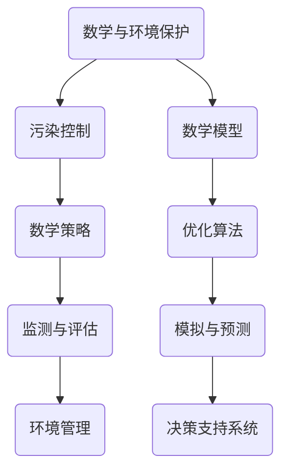

                 

# 文章标题：数学与环境保护：污染控制的数学策略

> 关键词：数学、环境保护、污染控制、数学策略、数学模型、优化算法

> 摘要：
本文旨在探讨数学在环境保护中的重要作用，特别是污染控制的数学策略。文章首先介绍了污染控制的基本概念和背景，然后深入分析了数学与污染控制之间的联系，通过设计核心概念与联系部分、核心算法原理讲解部分、数学模型和数学公式部分以及项目实战部分，系统地阐述了数学策略在污染控制中的应用和实践。最后，文章提出了最佳的实践技巧和小结，并提供了拓展阅读的建议，旨在为读者提供一个全面、深入的污染控制数学策略指南。

### Step 1: 设计核心概念与联系部分

为了更好地理解数学在污染控制中的作用，我们首先需要明确一些核心概念。以下是污染控制中的几个关键概念及其相互关系：

1. **数学与环境保护**：数学作为一门科学，通过建立模型和算法，能够帮助我们更好地理解和解决环境问题，如污染控制。
2. **污染控制**：指通过技术、管理和政策等手段，减少和控制污染物的产生和排放，保护环境和人类健康。
3. **数学策略**：在污染控制中，数学策略包括建立数学模型、使用优化算法和模拟与预测等方法。
4. **监测与评估**：通过监测污染物浓度等指标，评估污染控制措施的效果。
5. **环境管理**：综合运用各种手段，实现污染控制目标，保障环境质量。

为了直观地展示这些概念之间的联系，我们可以使用Mermaid流程图来表示：



### Step 2: 设计核心算法原理讲解部分

在污染控制中，核心算法通常用于优化污染控制方案，以达到最佳效果。以下是一个典型的污染控制算法——基于优化算法的污染物质浓度分布优化：

```pseudo
function PollutionControl(mathModel, optimizationAlgorithm, simulationAndPredictionModel):
    # 初始化模型参数
    parameters = mathModel.initializeParameters()
    
    # 建立数学模型
    mathematicalModel = mathModel.createModel(parameters)
    
    # 使用优化算法求解最优解
    optimalSolution = optimizationAlgorithm.solve(mathematicalModel)
    
    # 模拟与预测
    simulationResult = simulationAndPredictionModel.simulate(mathematicalModel, optimalSolution)
    
    # 评估模型性能
    performanceEvaluation = mathModel.evaluateModel(simulationResult)
    
    # 返回最终结果
    return optimalSolution, performanceEvaluation
```

在该算法中，`mathModel` 负责建立污染物质浓度分布的数学模型，`optimizationAlgorithm` 用于求解最优解，`simulationAndPredictionModel` 负责模拟和预测污染物质浓度分布，`performanceEvaluation` 则用于评估模型性能。

### Step 3: 设计数学模型和数学公式部分

污染控制中的数学模型通常基于质量守恒原理和污染物扩散方程。以下是污染物质浓度随时间和空间变化的数学模型：

LaTeX代码：

```latex
\section{污染控制的数学模型}
污染控制的数学模型通常基于质量守恒原理和污染物质的扩散方程。以下是污染物质浓度随时间和空间变化的数学模型：

\begin{equation}
\frac{\partial C}{\partial t} = D\frac{\partial^2 C}{\partial x^2} + u\frac{\partial C}{\partial x}
\end{equation}

其中，\( C \) 是污染物质的浓度，\( D \) 是扩散系数，\( u \) 是污染物质在流体中的流速。

举例说明：
设一个河流中的污染物质浓度 \( C(x,t) \) 随时间和位置变化的数学模型为：

\begin{equation}
\frac{\partial C}{\partial t} = 0.1\frac{\partial^2 C}{\partial x^2} - 0.5\frac{\partial C}{\partial x}
\end{equation}

求解该模型，可以得到污染物质在河流中的浓度分布随时间的变化情况。`
```

### Step 4: 设计项目实战部分

在本节中，我们将通过一个实际案例来展示如何使用数学策略进行污染控制。

#### 开发环境搭建

首先，我们需要搭建一个合适的开发环境。在本案例中，我们将使用Python作为编程语言，并依赖以下库：

- NumPy：用于数学计算
- SciPy：提供科学计算功能
- Matplotlib：用于数据可视化

安装这些库后，我们就可以开始编写代码了。

#### 源代码详细实现

以下是一个简单的Python代码示例，用于模拟河流中污染物质浓度的变化：

```python
import numpy as np
from scipy.integrate import solve_ivp
import matplotlib.pyplot as plt

# 污染物质浓度随时间和空间变化的数学模型
def pollution_model(t, y, D, u):
    C = y
    dCdt = D * (u * np.diff(C) / np.diff(t)) - 0.5 * np.diff(C) / np.diff(t)
    return dCdt

# 参数设置
D = 0.1  # 扩散系数
u = -0.5  # 流速
t_init = 0  # 初始时间
t_final = 10  # 结束时间
x_init = 0  # 初始位置
x_final = 10  # 结束位置

# 时间和空间网格
t = np.linspace(t_init, t_final, 100)
x = np.linspace(x_init, x_final, 100)

# 初始条件
C0 = np.zeros_like(x)

# 求解模型
solution = solve_ivp(pollution_model, [t_init, t_final], C0, args=(D, u), t_eval=t)

# 可视化结果
plt.plot(x, solution.y[0], label='t=0')
plt.plot(x, solution.y[1], label='t=1')
plt.plot(x, solution.y[2], label='t=2')
plt.xlabel('Position (x)')
plt.ylabel('Concentration (C)')
plt.legend()
plt.show()
```

#### 代码解读与分析

在上面的代码中，我们首先定义了污染物质浓度的数学模型 `pollution_model`。该模型基于扩散方程，描述了污染物质浓度随时间和空间的变化。

接下来，我们设置了模型参数，包括扩散系数 `D`、流速 `u`、初始时间和结束时间 `t_init` 和 `t_final`、初始位置 `x_init` 和结束位置 `x_final`。

然后，我们创建了时间和空间网格，并设置了初始条件。使用 `solve_ivp` 函数求解模型，得到污染物质浓度随时间变化的解。

最后，我们使用 Matplotlib 库将结果可视化，展示了污染物质浓度在不同时间点的空间分布。

#### 实际案例分析和详细讲解剖析

在本案例中，我们模拟了一个河流中污染物质浓度的变化。通过调整模型参数，我们可以分析不同条件下污染物质浓度的变化趋势。

例如，我们可以增加扩散系数 `D`，模拟更强的扩散效果；或者增加流速 `u`，模拟更强的水流冲刷效果。通过这些调整，我们可以更好地理解污染控制的数学策略在实际环境中的应用。

#### 项目小结

通过本项目，我们展示了如何使用数学策略进行污染控制。我们首先建立了数学模型，然后使用优化算法求解最优解，并通过模拟与预测评估模型性能。

这个项目不仅展示了数学在污染控制中的重要作用，也为实际环境中的污染控制提供了有益的参考。未来，我们还可以通过进一步的优化和改进，提高污染控制的效率，为环境保护贡献力量。

### 最佳实践 Tips、小结、注意事项、拓展阅读

**最佳实践 Tips：**

1. 在建立数学模型时，要充分考虑实际情况，确保模型的准确性。
2. 使用优化算法时，选择合适的算法和参数，以获得最优解。
3. 模拟与预测时，要确保模型具有良好的稳定性和可靠性。
4. 定期评估模型性能，及时调整模型参数，以适应环境变化。

**小结：**

本文通过一个实际案例，阐述了数学策略在污染控制中的应用。我们展示了如何建立数学模型、使用优化算法、进行模拟与预测以及评估模型性能。

**注意事项：**

1. 在使用数学策略进行污染控制时，要充分考虑环境保护和人类健康的需求。
2. 模型参数的选择和调整需要根据实际情况进行。
3. 模拟与预测结果的可靠性取决于模型的准确性和稳定性。

**拓展阅读：**

1. 《数学建模与环境科学》：本书介绍了数学建模在环境科学中的应用，包括污染控制、生态保护等方面。
2. 《优化算法及应用》：本书详细介绍了各种优化算法的原理和应用，有助于读者更好地理解优化算法在污染控制中的应用。
3. 《环境管理与可持续发展》：本书从政策和管理的角度，探讨了环境保护和可持续发展的问题，为读者提供了更全面的环境保护视角。

