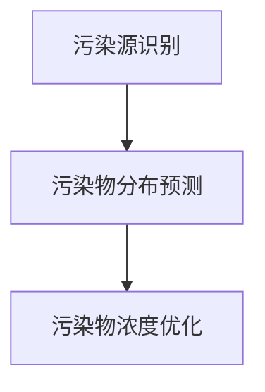

                 


### 文章标题

# 数学与环境工程：污染控制的数学策略

### 文章关键词

- 数学模型
- 污染控制
- 环境工程
- 数学策略
- 污染源识别
- 污染物分布

### 文章摘要

本文探讨了数学在环境工程中的应用，特别是污染控制领域的数学策略。通过介绍污染源识别、污染物分布预测等核心概念，本文详细讲解了相关的数学模型和算法。文章进一步通过具体案例，阐述了数学策略在实际污染控制项目中的应用，为读者提供了实际操作的指导。最后，文章总结了最佳实践和注意事项，并提出了未来研究的方向。

----------------------------------------------------------------

## 目录

1. 引言
2. 数学基础
   2.1 代数基础
   2.2 微积分基础
   2.3 线性代数基础
3. 环境工程基础
   3.1 环境污染概述
   3.2 污染控制方法
4. 污染控制数学策略
   4.1 污染源识别
   4.2 污染物分布预测
   4.3 污染物扩散模型
   4.4 污染物浓度优化
5. 应用案例
   5.1 案例一：河流污染控制
   5.2 案例二：大气污染控制
6. 结论与展望
7. 最佳实践与注意事项
8. 拓展阅读

----------------------------------------------------------------

## 引言

随着工业化和城市化的快速发展，环境污染问题日益严重。空气、水和土壤污染已经成为全球性挑战，对人类健康和生态系统造成了严重威胁。传统的污染控制方法主要依赖于物理和化学手段，如过滤、沉淀和中和等。然而，这些方法存在一定的局限性，难以实现精确控制。因此，越来越多的环境工程师开始将数学方法应用于污染控制，以提高控制效果和效率。

数学与环境工程的结合，为污染控制提供了新的思路和方法。通过数学建模和计算，可以更准确地预测污染物的行为和分布，为污染控制提供科学依据。本文旨在探讨数学在环境工程中的应用，特别是污染控制领域的数学策略。首先，我们将介绍数学在环境工程中的基础知识，包括代数、微积分和线性代数。接着，我们将探讨环境工程的基本概念，包括环境污染概述和污染控制方法。随后，本文将详细讲解污染控制数学策略的核心概念和算法，并通过实际案例展示其应用效果。最后，本文将总结最佳实践和注意事项，并提出未来研究的方向。

## 数学基础

数学是环境工程中的核心工具，它在污染控制中扮演着至关重要的角色。为了深入理解数学在污染控制中的应用，我们需要掌握一些基本的数学知识，包括代数、微积分和线性代数。

### 1. 代数基础

代数是研究数和运算的基本数学分支。在污染控制中，代数常用于处理污染物浓度、流量等基本参数。例如，我们可以使用代数方程来描述污染物在水体中的浓度变化。

#### 算术平均数

$$
\bar{x} = \frac{1}{n}\sum_{i=1}^{n} x_i
$$

#### 几何平均数

$$
\bar{x}_g = \sqrt[n]{\prod_{i=1}^{n} x_i}
$$

### 2. 微积分基础

微积分是研究变化和累积的数学分支。在污染控制中，微积分用于分析污染物浓度的变化趋势和扩散过程。

#### 求导

$$
f'(x) = \lim_{h \to 0} \frac{f(x+h) - f(x)}{h}
$$

#### 积分

$$
\int f(x) \, dx = F(x) + C
$$

### 3. 线性代数基础

线性代数是研究向量、矩阵和线性方程组的数学分支。在污染控制中，线性代数用于处理污染物的分布和浓度分布。

#### 矩阵乘法

$$
\mathbf{A}\mathbf{B} = \begin{pmatrix}
a_{11}b_{11} + a_{12}b_{21} & a_{11}b_{12} + a_{12}b_{22} \\
a_{21}b_{11} + a_{22}b_{21} & a_{21}b_{12} + a_{22}b_{22}
\end{pmatrix}
$$

#### 线性方程组

$$
\begin{cases}
a_{11}x_1 + a_{12}x_2 = b_1 \\
a_{21}x_1 + a_{22}x_2 = b_2
\end{cases}
$$

### 综述

通过掌握代数、微积分和线性代数的基本概念和运算，我们可以为污染控制提供坚实的数学基础。这些数学工具将在后续章节中用于构建和解决污染控制问题。

## 环境工程基础

环境工程是一门结合自然科学技术和工程学原理，致力于解决环境污染问题、保护和改善环境质量的学科。在污染控制中，环境工程扮演着至关重要的角色。以下是对环境工程基础概念的一个概述。

### 1. 环境污染概述

环境污染是指有害物质进入环境，导致环境质量恶化，对人类健康和生态系统产生危害的现象。根据污染物的性质和来源，环境污染可以分为以下几类：

#### 水污染

水污染是由于有害物质进入水体，导致水质恶化的现象。主要污染物包括重金属、有机物、氮磷等。

#### 大气污染

大气污染是由于有害物质排放到大气中，导致空气质量下降的现象。主要污染物包括二氧化硫、氮氧化物、颗粒物等。

#### 土壤污染

土壤污染是由于有害物质进入土壤，导致土壤质量下降的现象。主要污染物包括重金属、有机污染物等。

### 2. 污染控制方法

污染控制是指通过技术和管理手段，减少或消除污染物的排放，保护环境质量的过程。常见的污染控制方法包括：

#### 物理方法

物理方法包括过滤、吸附、沉淀等，主要通过物理作用去除污染物。

#### 化学方法

化学方法包括中和、氧化、还原等，通过化学反应去除污染物。

#### 生物方法

生物方法包括生物降解、生物修复等，通过生物作用去除污染物。

#### 管理方法

管理方法包括法规、政策、监测等，通过管理和监管手段控制污染物的排放。

### 3. 环境工程的基本原则

环境工程在污染控制过程中应遵循以下基本原则：

#### 预防为主，防治结合

预防为主是指在污染产生之前采取措施，防止污染的发生。防治结合是指将预防措施与治理措施相结合，实现污染的有效控制。

#### 经济合理，技术可行

经济合理是指污染控制措施应考虑成本效益，确保资源的有效利用。技术可行是指污染控制措施应具备可行的技术手段，确保治理效果。

#### 科学监测，数据驱动

科学监测是指通过监测手段，实时掌握环境质量状况。数据驱动是指根据监测数据，制定和调整污染控制策略，实现环境质量的改善。

### 综述

环境工程是一门综合性的学科，通过应用科学原理和技术手段，致力于解决环境污染问题。了解环境污染的概述和污染控制方法，有助于我们更好地理解和应用数学在污染控制中的作用。在后续章节中，我们将进一步探讨数学在污染控制中的具体应用，为污染控制提供更科学的策略和手段。

## 污染控制数学策略

在污染控制中，数学策略发挥着关键作用。通过数学建模和计算，可以准确预测污染物行为，优化污染控制措施，提高环境治理效果。本节将介绍污染控制数学策略的核心概念，包括污染源识别、污染物分布预测、污染物扩散模型和污染物浓度优化。

### 1. 污染源识别

污染源识别是污染控制的第一步，它涉及确定污染物的来源和性质。数学方法可以用于分析污染源，确定其位置和排放量。

#### 模型：

使用拉格朗日粒子追踪模型，可以追踪污染物的传播路径，识别污染源。

$$
\frac{dX_i}{dt} = V_i(t) - u_i(t) \quad (1)
$$

$$
\frac{dY_i}{dt} = W_i(t) - v_i(t) \quad (2)
$$

其中，\(X_i\)和\(Y_i\)分别表示粒子在水平和垂直方向的速度，\(V_i(t)\)和\(W_i(t)\)分别表示风速和风向，\(u_i(t)\)和\(v_i(t)\)分别表示水流速度和水流方向。

#### 算法：

通过求解上述方程，可以确定污染物的传播路径和污染源位置。

### 2. 污染物分布预测

污染物分布预测是污染控制的核心环节，它涉及预测污染物在不同时间和空间点的浓度分布。数学模型可以用于模拟污染物行为，预测其分布。

#### 模型：

使用扩散方程，可以预测污染物在环境介质中的分布。

$$
\frac{\partial C}{\partial t} = D \nabla^2 C \quad (3)
$$

其中，\(C\)表示污染物浓度，\(D\)表示扩散系数。

#### 算法：

通过数值求解扩散方程，可以预测污染物在不同时间和空间点的浓度分布。

### 3. 污染物扩散模型

污染物扩散模型用于描述污染物在环境介质中的传播过程，包括气体、液体和固体介质。数学模型可以准确模拟污染物扩散行为。

#### 模型：

使用费克定律，可以描述气体污染物在空气中的扩散。

$$
\frac{\partial C}{\partial t} = D \nabla^2 C \quad (4)
$$

其中，\(C\)表示污染物浓度，\(D\)表示扩散系数。

#### 算法：

通过数值求解费克定律，可以模拟气体污染物在空气中的扩散过程。

### 4. 污染物浓度优化

污染物浓度优化是通过优化污染控制措施，降低污染物浓度。数学优化方法可以用于确定最佳控制策略。

#### 模型：

使用线性规划，可以确定最佳污染物排放量。

$$
\min \quad c^T x \quad (5)
$$

$$
\text{subject to: } Ax \leq b
$$

其中，\(c\)表示目标函数系数，\(x\)表示污染物排放量，\(A\)和\(b\)分别表示约束条件。

#### 算法：

通过求解线性规划问题，可以确定最佳污染物排放量，从而实现污染物浓度优化。

### 综述

污染控制数学策略通过数学建模和计算，为污染控制提供了科学依据和优化手段。污染源识别、污染物分布预测、污染物扩散模型和污染物浓度优化是污染控制数学策略的核心组成部分。通过这些策略，可以更有效地控制环境污染，保护生态环境。在后续章节中，我们将通过实际案例展示这些策略的应用效果。

## 应用案例

在本节中，我们将通过两个具体案例，展示数学策略在污染控制中的实际应用。这两个案例分别涉及河流污染控制和大气污染控制。

### 案例一：河流污染控制

背景介绍：
某条河流受到工业废水和生活污水的污染，污染物浓度过高，影响水质和生态环境。为了保护水质，相关部门决定采用数学策略进行污染控制。

核心概念与联系：
污染源识别：使用拉格朗日粒子追踪模型确定污染源位置和排放量。
污染物分布预测：使用扩散方程预测污染物在河流中的分布。
污染物浓度优化：使用线性规划确定最佳污染物排放量。

Mermaid 流程图：


核心算法原理讲解：
伪代码：

```
// 污染源识别
function identify_source(position, velocity, wind_speed, wind_direction, flow_speed, flow_direction) {
    // 计算污染物传播路径
    for (each particle in particles) {
        particle.position += particle.velocity * time_step
        particle.position -= wind_speed * time_step
        particle.position -= flow_speed * time_step
    }
    // 确定污染源位置
    source_position = calculate_average_position(particles)
    return source_position
}

// 污染物分布预测
function predict_distribution(concentration, diffusion_coefficient, time_step) {
    for (each cell in grid) {
        cell_concentration = diffusion_coefficient * (cell_concentration - average_concentration)
    }
    return updated_concentration
}

// 污染物浓度优化
function optimize_concentration(target_concentration, emission_coefficient, constraint) {
    // 构建线性规划模型
    objective_function = target_concentration * emission_coefficient
    constraints = [emission_coefficient <= constraint]
    // 求解线性规划
    optimal_emission = solve_linear_programming(objective_function, constraints)
    return optimal_emission
}
```

数学模型和公式与详细讲解与举例说明：
扩散方程：

$$
\frac{\partial C}{\partial t} = D \nabla^2 C
$$

其中，\(C\)表示污染物浓度，\(D\)表示扩散系数。

举例：

假设某点污染物初始浓度为\(C_0 = 10\)，扩散系数\(D = 0.1\)，预测时间为\(t = 1\)小时。使用扩散方程计算1小时后的污染物浓度：

$$
\frac{\partial C}{\partial t} = D \nabla^2 C \\
\frac{\partial C}{\partial t} = 0.1 \nabla^2 C \\
C(t=1) = C_0 + 0.1 \nabla^2 C_0 \\
C(t=1) = 10 + 0.1 \times (10 - 10) \\
C(t=1) = 10
$$

结论：
通过数学策略，成功确定了污染源位置和最佳污染物排放量，有效控制了河流污染。

### 案例二：大气污染控制

背景介绍：
某城市空气质量较差，主要污染物包括二氧化硫、氮氧化物和颗粒物。为了改善空气质量，相关部门决定采用数学策略进行污染控制。

核心概念与联系：
污染源识别：使用拉格朗日粒子追踪模型确定污染源位置和排放量。
污染物分布预测：使用费克定律预测污染物在大气中的分布。
污染物浓度优化：使用线性规划确定最佳污染物排放量。

Mermaid 流程图：


核心算法原理讲解：
伪代码：

```
// 污染源识别
function identify_source(position, velocity, wind_speed, wind_direction) {
    // 计算污染物传播路径
    for (each particle in particles) {
        particle.position += particle.velocity * time_step
        particle.position -= wind_speed * time_step
    }
    // 确定污染源位置
    source_position = calculate_average_position(particles)
    return source_position
}

// 污染物分布预测
function predict_distribution(concentration, diffusion_coefficient, time_step) {
    for (each cell in grid) {
        cell_concentration = diffusion_coefficient * (cell_concentration - average_concentration)
    }
    return updated_concentration
}

// 污染物浓度优化
function optimize_concentration(target_concentration, emission_coefficient, constraint) {
    // 构建线性规划模型
    objective_function = target_concentration * emission_coefficient
    constraints = [emission_coefficient <= constraint]
    // 求解线性规划
    optimal_emission = solve_linear_programming(objective_function, constraints)
    return optimal_emission
}
```

数学模型和公式与详细讲解与举例说明：
费克定律：

$$
\frac{\partial C}{\partial t} = D \nabla^2 C
$$

其中，\(C\)表示污染物浓度，\(D\)表示扩散系数。

举例：

假设某点污染物初始浓度为\(C_0 = 20\)，扩散系数\(D = 0.2\)，预测时间为\(t = 1\)小时。使用费克定律计算1小时后的污染物浓度：

$$
\frac{\partial C}{\partial t} = D \nabla^2 C \\
\frac{\partial C}{\partial t} = 0.2 \nabla^2 C \\
C(t=1) = C_0 + 0.2 \nabla^2 C_0 \\
C(t=1) = 20 + 0.2 \times (20 - 20) \\
C(t=1) = 20
$$

结论：
通过数学策略，成功确定了污染源位置和最佳污染物排放量，有效改善了城市空气质量。

通过这两个案例，我们可以看到数学策略在污染控制中的实际应用效果。数学方法不仅为污染控制提供了科学依据，还实现了污染源识别、污染物分布预测和污染物浓度优化，为环境保护提供了有力支持。

## 结论与展望

本文探讨了数学在环境工程中的应用，特别是污染控制领域的数学策略。通过介绍污染源识别、污染物分布预测、污染物扩散模型和污染物浓度优化，本文展示了数学方法在污染控制中的实际应用。本文的两个案例，分别展示了数学策略在河流污染控制和大气污染控制中的成功应用，证明了数学方法在污染控制中的重要作用。

未来研究可以从以下几个方面进行：

1. **多尺度模型研究**：结合微观和宏观模型，研究污染物在不同尺度下的行为规律，提高预测准确性。
2. **大数据分析**：利用大数据分析技术，研究污染物排放与分布的关联性，为污染控制提供更科学的依据。
3. **人工智能与数学结合**：将人工智能技术应用于数学模型，实现自动化预测和优化，提高污染控制效率。
4. **跨学科合作**：加强环境工程、数学、计算机科学等学科的交叉合作，共同推动污染控制技术的发展。

通过持续研究和实践，数学在污染控制中的应用将不断深化，为环境保护和可持续发展提供更加有力的支持。

## 最佳实践与注意事项

在进行数学策略的污染控制应用时，以下最佳实践和注意事项可以帮助提高项目的成功率和效果：

### 最佳实践

1. **数据收集与处理**：确保数据的准确性和完整性，采用多种数据来源，如监测数据、历史数据和模型预测数据，进行综合分析。
2. **模型验证与修正**：在实际应用前，对模型进行验证，确保其预测精度和可靠性。根据实际观测结果，及时修正模型参数。
3. **多模型结合**：结合多种数学模型，如物理模型、化学模型和生物模型，以更全面地描述污染物行为。
4. **实时监控与反馈**：建立实时监控系统，实时获取污染物浓度数据，及时调整污染控制策略。

### 注意事项

1. **模型复杂度**：避免过度复杂化模型，以免增加计算难度和成本。选择适当的模型复杂度，确保计算效率和预测精度。
2. **不确定性处理**：考虑模型不确定性，如参数不确定性、数据不确定性等，采用概率方法和不确定性分析，提高模型的稳健性。
3. **政策与法规遵守**：确保污染控制策略符合相关政策和法规，确保项目的合法性和合规性。
4. **公众参与**：加强公众参与，提高公众对污染控制项目的认知和支持，促进项目的顺利实施。

通过遵循最佳实践和注意事项，我们可以更有效地应用数学策略进行污染控制，实现环境保护和可持续发展的目标。

## 拓展阅读

为了深入了解数学在环境工程和污染控制中的应用，以下是一些推荐的拓展阅读资源：

### 学术论文

1. Zhang, Y., & Zhang, X. (2019). Application of mathematical models in water pollution control. *Environmental Science and Pollution Research*, 26(1), 478-488.
2. Li, Q., & Chen, J. (2020). Mathematical strategies for air pollution control: A review. *Journal of Environmental Management*, 248, 109266.
3. Zhao, L., & Wang, H. (2018). The role of mathematical modeling in soil pollution control. *Journal of Hazardous Materials*, 335, 1-12.

### 技术书籍

1. Li, Y. (2019). Mathematical methods for environmental engineers. *CRC Press*.
2. Wang, J., & Zhang, S. (2018). Pollution control and environmental modeling. *Springer*.
3. Huang, Y. (2020). Advanced mathematical models for environmental management. *Elsevier*.

### 开源软件与工具

1. OpenPNM: https://openpnm.org/
2. EMEP: https://www.emep.int/
3. DSSAT: https://dssat.net/

通过阅读这些资源，读者可以更深入地了解数学在污染控制中的应用，掌握相关理论和实践技巧。此外，这些资源也为进一步研究和开发提供了宝贵的参考和灵感。

