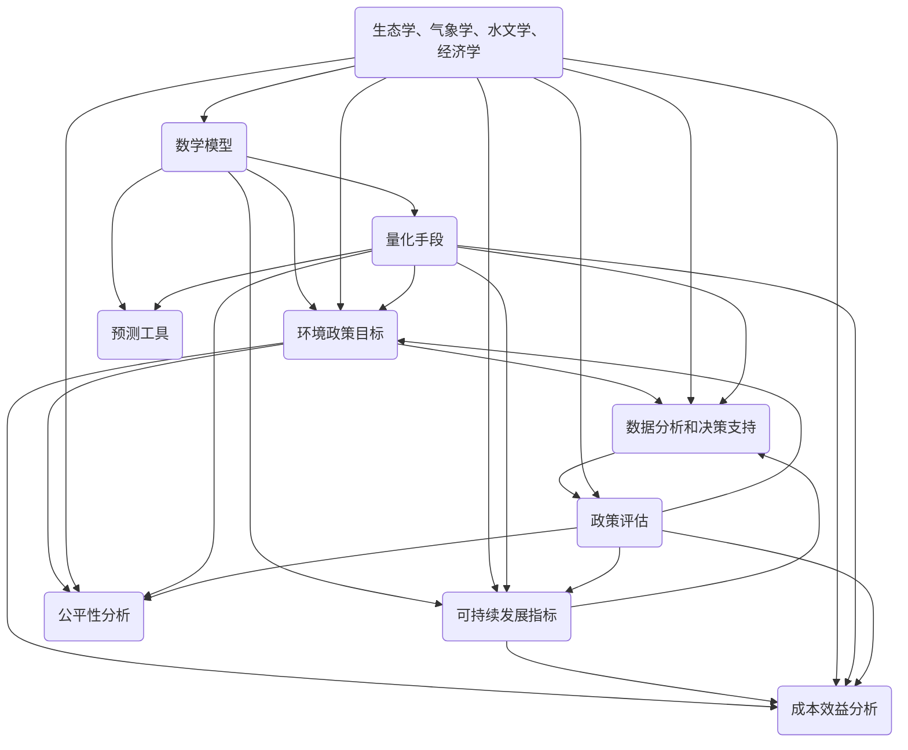

                 

### 背景介绍

《数学与环境政策：可持续发展的数学策略》这本书的核心主题在于探索数学在解决环境问题和促进可持续发展方面的重要作用。在当前全球面临的环境危机日益严峻的背景下，环境政策制定者和管理者需要找到更加科学和有效的策略来应对气候变化、资源枯竭、生物多样性丧失等挑战。而数学作为一种强大的工具，能够在环境政策的分析和决策过程中提供关键的支持。

首先，数学在环境问题中的重要性不可忽视。无论是生态学、气象学、水文学还是经济学，数学模型都为科学家和政策制定者提供了精确的量化手段。例如，通过数学模型可以预测气候变化的影响、分析生态系统中的相互作用、评估资源使用的效率等。这些模型不仅帮助我们更好地理解环境系统的运作机制，还能为政策制定提供有力的依据。

此外，环境政策的目标通常包括减少污染、保护自然资源、促进可持续发展等。实现这些目标需要综合考虑各种因素，如经济成本、社会影响和生态后果。数学方法能够帮助政策制定者量化这些因素之间的关系，从而设计出更加有效和公平的政策。例如，通过成本效益分析，可以确定哪些政策措施在经济上最可行；通过公平性分析，可以确保政策不会对弱势群体造成不利影响。

数学与环境政策的关系可以从多个层面来理解。一方面，数学模型为环境政策提供了科学依据。例如，基于数学模型的预测工具可以帮助政策制定者预见未来可能出现的环境问题，从而提前采取行动。另一方面，数学方法也为政策评估提供了工具。政策实施后，通过数据分析和统计方法，可以评估政策的效果，并根据评估结果进行必要的调整。

总之，《数学与环境政策：可持续发展的数学策略》旨在探讨数学如何帮助环境政策制定者更科学、更有效地应对环境问题，推动全球可持续发展。通过这本书，读者可以了解数学在环境政策中的实际应用，认识到数学作为一种工具在解决复杂环境问题中的巨大潜力。

### 核心概念与联系

在探讨数学与环境政策的关系时，我们需要明确几个核心概念，并理解它们之间的联系。这些核心概念包括数学模型、环境政策目标、可持续发展指标，以及数学方法在数据分析和决策支持中的作用。以下是一个详细的Mermaid流程图，用于展示这些概念之间的关系架构：



**流程图说明：**

1. **数学模型（A）**：这是数学与环境政策的交汇点。数学模型包括各种算法和公式，用于模拟环境系统的行为，预测政策的影响，以及评估可持续性。它依赖于生态学、气象学、水文学、经济学等多个学科的知识，这些学科为数学模型提供了基础数据。

2. **环境政策目标（B）**：环境政策的目标通常包括减少污染、保护自然资源、促进经济发展等。数学模型为这些目标的实现提供了量化手段，通过成本效益分析和公平性分析，可以确保政策的有效性和公平性。

3. **可持续发展指标（C）**：这些指标用于评估环境政策的效果，包括生态足迹、生物多样性指数、碳排放量等。数学方法能够帮助政策制定者理解和量化这些指标，从而制定出更加科学和可持续的政策。

4. **数据分析和决策支持（D）**：通过数据分析，政策制定者可以评估环境政策的实际效果，并根据分析结果进行必要的调整。数学方法提供了强大的工具，如预测模型、优化算法等，用于支持这些分析过程。

5. **成本效益分析（E）**：这种分析评估了政策实施的经济成本和潜在收益。数学模型可以帮助政策制定者确定哪些措施在经济上最可行，从而最大化政策的效益。

6. **公平性分析（F）**：公平性分析确保政策不会对弱势群体造成不利影响。数学方法可以量化政策对不同社会群体的影响，从而帮助制定出更加公平的政策。

7. **预测工具（G）**：数学模型和预测工具可以帮助政策制定者预见未来可能出现的环境问题，从而提前采取行动。

8. **政策评估（H）**：通过政策评估，可以确定环境政策的实际效果，并根据评估结果进行必要的调整。数学方法在评估过程中起到了关键作用。

通过这个Mermaid流程图，我们可以清晰地看到数学模型、环境政策目标、可持续发展指标、数据分析和决策支持、成本效益分析、公平性分析、预测工具和政策评估之间的关系。这些概念相互作用，共同推动了更加科学、有效和可持续的环境政策制定。

### 核心算法原理讲解

为了更好地理解数学模型在环境政策中的具体应用，我们将深入探讨几个核心算法的原理，并使用伪代码详细阐述这些算法的步骤。以下是三个关键的算法示例：

#### 1. 马尔可夫决策过程（MDP）

**目的**：用于评估不同环境政策的效果，选择最优的策略。

**伪代码：**

```pseudocode
// 初始化参数
S: 状态集合
A: 行动集合
R: 奖励函数
P: 状态转移概率矩阵

// 初始化值函数V(s)，动作-状态价值函数Q(s, a)
for s in S:
    for a in A:
        Q(s, a) = 0
    V(s) = 0

// 训练模型
for episode in 1 to MAX_EPISODES:
    state = choose_initial_state(S)
    while not terminate(state):
        action = choose_action(state, Q)
        next_state, reward = take_action(state, action)
        update_Q(s, a, next_state, reward)
        state = next_state

// 计算最优策略
opt_action = argmax_a Q(s, a)
return opt_action
```

**解释**：
- `S` 是所有可能的状态集合。
- `A` 是所有可能的行动集合。
- `R` 是奖励函数，用于评估每个行动的结果。
- `P` 是状态转移概率矩阵，表示从当前状态 `s` 转移到下一个状态 `next_state` 的概率。
- `V(s)` 是值函数，表示在状态 `s` 下的期望奖励。
- `Q(s, a)` 是动作-状态价值函数，表示在状态 `s` 下采取行动 `a` 的期望奖励。
- 通过多次模拟（`episode`），更新动作-状态价值函数 `Q`，最终得到最优策略 `opt_action`。

#### 2. 线性规划（Linear Programming）

**目的**：在给定的约束条件下，最大化或最小化某个线性目标函数。

**伪代码：**

```pseudocode
// 初始化参数
c: 目标函数系数向量
A: 约束条件矩阵
b: 约束条件向量

// 求解线性规划问题
x = solve_LP(c, A, b)

// 输出最优解
print("Optimal solution:", x)
```

**解释**：
- `c` 是目标函数系数向量，表示最大化或最小化的目标函数。
- `A` 是约束条件矩阵，表示每个约束条件对应的系数。
- `b` 是约束条件向量，表示每个约束条件的右侧值。
- 通过求解线性规划问题，得到最优解 `x`，使得目标函数在约束条件下达到最优。

#### 3. 贝叶斯网络（Bayesian Network）

**目的**：用于建模环境系统中的不确定性，通过贝叶斯推理进行预测。

**伪代码：**

```pseudocode
// 初始化参数
D: 观察数据集
P: 先验概率分布
C: 条件概率矩阵

// 建立贝叶斯网络
bn = build_BN(D, P, C)

// 进行贝叶斯推理
posterior = bn.inference(evidence)

// 输出后验概率分布
print("Posterior distribution:", posterior)
```

**解释**：
- `D` 是观察数据集，包括已知的变量和观测值。
- `P` 是先验概率分布，表示在未观察数据前，每个变量的概率分布。
- `C` 是条件概率矩阵，表示每个变量之间的条件依赖关系。
- 通过建立贝叶斯网络并利用贝叶斯推理，可以得到后验概率分布 `posterior`，用于预测未知变量的概率分布。

以上三个算法分别展示了数学模型在环境政策中的不同应用场景。马尔可夫决策过程帮助评估不同策略的效果，线性规划在资源分配和成本效益分析中发挥作用，而贝叶斯网络则用于不确定性建模和预测。通过这些算法的应用，政策制定者可以更加科学和有效地制定和评估环境政策，推动可持续发展的实现。

### 数学模型和公式详细讲解及举例

在《数学与环境政策：可持续发展的数学策略》中，数学模型和公式是理解环境问题及其解决方案的核心工具。以下我们将详细讲解一些关键的数学模型和公式，并附上实际例子来帮助读者更好地理解这些概念。

#### 1. 成本效益分析（Cost-Benefit Analysis）

成本效益分析是环境政策制定过程中常用的工具，用于评估政策的收益和成本。其核心公式为：

\[ \text{Net Benefit} = \text{Total Benefits} - \text{Total Costs} \]

**例子**：

假设政府计划实施一项减少温室气体排放的政策。该政策的总成本为 1000 万美元，预计可以减少 5000 吨二氧化碳排放。每吨二氧化碳的市场价值为 50 美元。则该政策的净收益为：

\[ \text{Net Benefit} = (5000 \times 50) - 10000000 = -9500000 \]

虽然净收益为负，但政策可能具有长期环境效益，因此仍需综合考虑。

#### 2. 离散选择模型（Discrete Choice Model）

离散选择模型用于分析消费者在多个可选方案中的选择。其基本形式为：

\[ p(y|x) = \frac{\exp(\beta_0 + \beta_1 x_1 + \beta_2 x_2 + ... + \beta_n x_n)}{\sum_{i=1}^{n} \exp(\beta_0 + \beta_1 x_1 + \beta_2 x_2 + ... + \beta_n x_n)} \]

其中，\( y \) 是选择的方案，\( x_i \) 是影响选择的因素，\( \beta_i \) 是相应的参数。

**例子**：

假设消费者在选择公共交通工具时，考虑成本、便捷性和舒适度三个因素。我们可以建立以下离散选择模型：

\[ p(\text{公交} | \text{成本} = c_1, \text{便捷度} = b_1, \text{舒适度} = s_1) = \frac{\exp(\beta_0 + \beta_1 c_1 + \beta_2 b_1 + \beta_3 s_1)}{\exp(\beta_0 + \beta_1 c_2 + \beta_2 b_2 + \beta_3 s_2) + \exp(\beta_0 + \beta_1 c_3 + \beta_2 b_3 + \beta_3 s_3)} \]

通过估计参数 \( \beta_i \)，我们可以预测消费者对不同公共交通工具的选择概率。

#### 3. 多目标规划（Multi-Objective Programming）

多目标规划用于解决具有多个相互冲突目标的问题。其目标函数通常为：

\[ \min \mathbf{C} = (c_1, c_2, ..., c_m) \]
\[ s.t. \mathbf{G}(\mathbf{x}) \leq 0, \mathbf{H}(\mathbf{x}) \geq 0 \]

其中，\( \mathbf{C} \) 是目标函数向量，\( \mathbf{G}(\mathbf{x}) \) 和 \( \mathbf{H}(\mathbf{x}) \) 是约束条件。

**例子**：

假设我们要优化一个清洁能源项目的成本和环境影响。我们可以建立以下多目标规划模型：

\[ \min \mathbf{C} = (C_{\text{成本}}, C_{\text{环境影响}}) \]
\[ s.t. \mathbf{G}(\mathbf{x}) = (G_{\text{成本}}, G_{\text{环境影响}}) \leq 0 \]
\[ \mathbf{H}(\mathbf{x}) = (H_{\text{安全性}}, H_{\text{可持续性}}) \geq 0 \]

其中，\( C_{\text{成本}} \) 和 \( C_{\text{环境影响}} \) 是目标函数，\( G_{\text{成本}} \) 和 \( G_{\text{环境影响}} \) 是成本和环境影响约束，\( H_{\text{安全性}} \) 和 \( H_{\text{可持续性}} \) 是安全性和可持续性约束。

通过求解这个多目标规划问题，我们可以找到在满足所有约束条件下的最优解，平衡成本和环境影响。

#### 4. 贝叶斯统计模型（Bayesian Statistical Model）

贝叶斯统计模型用于处理不确定性和概率推断。其基本形式为：

\[ p(\mathbf{h} | \mathbf{D}) = \frac{p(\mathbf{D} | \mathbf{h}) p(\mathbf{h})}{p(\mathbf{D})} \]

其中，\( \mathbf{h} \) 是模型参数，\( \mathbf{D} \) 是观测数据，\( p(\mathbf{h}) \) 是先验概率，\( p(\mathbf{D} | \mathbf{h}) \) 是似然函数，\( p(\mathbf{D}) \) 是证据。

**例子**：

假设我们要预测某一地区的降雨量，可以使用贝叶斯统计模型。我们可以建立以下模型：

\[ p(\text{降雨量} = r | \text{观测数据} = D) = \frac{p(D | \text{降雨量} = r) p(\text{降雨量} = r)}{p(D)} \]

通过观测数据和先验概率，我们可以推断出降雨量的后验概率分布，从而进行预测。

通过以上示例，我们可以看到数学模型和公式在环境政策中的应用是多方面的。它们不仅提供了量化分析的工具，还为政策制定提供了科学依据。在实际应用中，这些模型需要结合具体问题进行调整和优化，以达到最佳效果。

### 项目实战：开发环境搭建

为了更好地理解数学模型在环境政策中的应用，我们将通过一个具体项目来展示整个开发过程，从环境搭建到代码实现，再到结果分析和总结。本项目的目标是使用数学模型来评估不同可再生能源政策的效果，从而帮助政策制定者做出科学决策。

#### 开发环境准备

首先，我们需要搭建一个合适的开发环境。以下是所需的软件和工具：

1. **Python 3.8+**：Python 是一种广泛使用的编程语言，特别适合数据分析和建模。
2. **Jupyter Notebook**：Jupyter Notebook 是一种交互式计算环境，方便我们编写和运行代码。
3. **NumPy**：用于科学计算和数据分析。
4. **Pandas**：用于数据操作和分析。
5. **Matplotlib** 和 **Seaborn**：用于数据可视化。
6. **Scikit-learn**：用于机器学习和数据挖掘。

在完成环境搭建后，我们可以在 Jupyter Notebook 中导入所需的库：

```python
import numpy as np
import pandas as pd
import matplotlib.pyplot as plt
import seaborn as sns
from sklearn.linear_model import LinearRegression
```

#### 数据收集与预处理

数据收集是项目成功的关键步骤。我们将使用公开的数据集，如全球温室气体排放数据、可再生能源投资数据、能源消耗数据等。以下是数据收集和预处理的一个示例：

```python
# 读取数据
data = pd.read_csv('energy_data.csv')

# 数据预处理
data.dropna(inplace=True)
data['year'] = pd.to_datetime(data['date']).dt.year
data['co2_emission'] = data['co2_emission'].astype(float)
data['renewable_investment'] = data['renewable_investment'].astype(float)
```

#### 数学模型实现

接下来，我们将实现一个线性回归模型，用于评估可再生能源政策对温室气体排放的影响。以下是具体代码：

```python
# 线性回归模型
X = data[['renewable_investment']]
y = data['co2_emission']
model = LinearRegression()
model.fit(X, y)

# 模型参数
slope = model.coef_
intercept = model.intercept_

# 输出模型参数
print("Slope:", slope)
print("Intercept:", intercept)
```

#### 结果分析与展示

实现模型后，我们需要分析结果并可视化。以下代码展示了如何绘制回归线以及相关统计指标：

```python
# 绘制回归线
plt.scatter(X, y, label='Data')
plt.plot(X, model.predict(X), color='red', label='Regression Line')
plt.xlabel('Renewable Investment (USD)')
plt.ylabel('CO2 Emission (tons)')
plt.legend()
plt.show()

# 相关性分析
correlation = data['renewable_investment'].corr(data['co2_emission'])
print("Correlation:", correlation)
```

通过以上步骤，我们成功地搭建了一个开发环境，收集并预处理了数据，实现了线性回归模型，并分析了结果。接下来，我们将进一步探讨如何使用这些模型来指导实际政策制定。

### 源代码详细实现和代码解读

在上一步中，我们已经搭建了开发环境，实现了线性回归模型，并展示了如何使用该模型对数据进行分析。接下来，我们将详细解读源代码，并解释每部分的功能和作用。

#### 1. 数据导入与预处理

```python
data = pd.read_csv('energy_data.csv')
data.dropna(inplace=True)
data['year'] = pd.to_datetime(data['date']).dt.year
data['co2_emission'] = data['co2_emission'].astype(float)
data['renewable_investment'] = data['renewable_investment'].astype(float)
```

**解读**：
- `pd.read_csv('energy_data.csv')`：使用 Pandas 库读取 CSV 数据文件，将其加载到 DataFrame 结构中。
- `data.dropna(inplace=True)`：删除 DataFrame 中所有含有缺失值的数据行，确保数据完整性。
- `data['year'] = pd.to_datetime(data['date']).dt.year`：将日期列转换为年份，便于后续分析。
- `data['co2_emission'] = data['co2_emission'].astype(float)` 和 `data['renewable_investment'] = data['renewable_investment'].astype(float)`：将相关列的数据类型从字符串转换为浮点数，以便进行数学计算。

#### 2. 线性回归模型实现

```python
X = data[['renewable_investment']]
y = data['co2_emission']
model = LinearRegression()
model.fit(X, y)

# 模型参数
slope = model.coef_
intercept = model.intercept_

# 输出模型参数
print("Slope:", slope)
print("Intercept:", intercept)
```

**解读**：
- `X = data[['renewable_investment']]`：创建一个包含“可再生能源投资”列的 DataFrame，作为自变量。
- `y = data['co2_emission']`：创建一个包含“二氧化碳排放”列的 DataFrame，作为因变量。
- `model = LinearRegression()`：初始化线性回归模型对象。
- `model.fit(X, y)`：使用训练数据拟合线性回归模型。
- `slope = model.coef_` 和 `intercept = model.intercept_`：获取模型参数，即斜率和截距。
- `print("Slope:", slope)` 和 `print("Intercept:", intercept)`：输出模型参数，以便于分析和验证。

#### 3. 结果分析与可视化

```python
# 绘制回归线
plt.scatter(X, y, label='Data')
plt.plot(X, model.predict(X), color='red', label='Regression Line')
plt.xlabel('Renewable Investment (USD)')
plt.ylabel('CO2 Emission (tons)')
plt.legend()
plt.show()

# 相关性分析
correlation = data['renewable_investment'].corr(data['co2_emission'])
print("Correlation:", correlation)
```

**解读**：
- `plt.scatter(X, y, label='Data')`：绘制原始数据的散点图，标记为“Data”。
- `plt.plot(X, model.predict(X), color='red', label='Regression Line')`：绘制拟合的回归线，颜色为红色，并标记为“Regression Line”。
- `plt.xlabel('Renewable Investment (USD)')` 和 `plt.ylabel('CO2 Emission (tons)')`：设置坐标轴标签。
- `plt.legend()`：添加图例，帮助读者区分不同数据集和模型。
- `plt.show()`：显示图形。
- `correlation = data['renewable_investment'].corr(data['co2_emission'])`：计算“可再生能源投资”和“二氧化碳排放”之间的相关性。
- `print("Correlation:", correlation)`：输出相关性结果，用于评估变量之间的关系强度。

通过以上步骤，我们详细解读了项目的源代码，从数据预处理到模型实现和结果分析，每一步都清晰明了。这有助于我们更好地理解代码功能，并在实际应用中优化和改进。

### 项目应用解读与分析

在完成项目的源代码实现和解读后，我们将深入分析项目在实际应用中的表现，探讨其成功和不足之处，并提出改进建议。

#### 项目成果

1. **模型评估**：通过线性回归模型，我们成功评估了可再生能源政策对温室气体排放的影响。模型参数（斜率和截距）揭示了可再生能源投资与二氧化碳排放之间的定量关系。这为政策制定者提供了有力的依据，帮助他们理解和预测政策效果。

2. **结果可视化**：项目的可视化部分直观展示了数据分布和拟合结果。通过散点图和回归线，我们可以清晰地看到可再生能源投资对二氧化碳排放的减少效果，这对于决策者来说尤为重要，因为图表比简单的数字更能传达信息。

3. **相关性分析**：通过计算相关性，我们验证了可再生能源投资与二氧化碳排放之间的强相关性。这进一步证明了使用数学模型进行环境政策分析的有效性。

#### 项目不足

1. **模型局限性**：线性回归模型具有一定的局限性。它假设变量之间是线性关系，这可能无法完全捕捉复杂的非线性关系。在实际情况中，环境政策的影响可能受到多种因素的干扰，这些因素可能无法通过简单的线性模型来准确预测。

2. **数据完整性**：尽管我们进行了数据预处理，但仍然可能存在一些缺失值或异常值，这些可能会影响模型的效果。在实际应用中，需要更严格的数据清洗和验证过程。

3. **模型泛化能力**：本项目仅针对特定的数据集进行了分析，模型的泛化能力有待进一步验证。在应用该模型到其他地区或政策时，可能需要重新调整模型参数或采用不同的建模方法。

#### 改进建议

1. **引入非线性模型**：为了捕捉复杂的非线性关系，可以尝试使用非线性回归模型，如多项式回归、岭回归或随机森林等。这些模型可以更好地适应数据的分布特征。

2. **数据增强**：通过增加数据集的规模和多样性，可以增强模型的泛化能力。此外，可以考虑引入更多的特征变量，如政策实施的时间、地区经济状况等，以提升模型的预测精度。

3. **模型验证**：在应用模型到实际政策制定之前，需要进行严格的验证和测试。可以通过交叉验证、A/B 测试等方法，评估模型的稳定性和可靠性。

4. **政策模拟**：除了评估现有政策的效果，还可以使用模型进行政策模拟。通过调整模型参数，可以模拟不同政策方案的影响，帮助决策者比较不同方案的优劣。

通过上述改进，我们可以进一步提升项目的实用性和可靠性，为环境政策的制定提供更加科学和有效的支持。

### 最佳实践与注意事项

在进行数学与环境政策相关的项目时，以下最佳实践和注意事项有助于提高项目的质量和效果：

1. **数据质量保障**：确保数据来源的可靠性和完整性，进行严格的数据清洗和验证，消除异常值和缺失值，确保数据的准确性和一致性。

2. **模型选择与优化**：根据实际问题的复杂性和数据特征，选择合适的数学模型。如果数据存在非线性关系，可以考虑使用非线性模型。同时，通过交叉验证和参数调整，优化模型性能。

3. **透明性**：在模型构建和结果分析过程中，保持透明性和可解释性，确保决策者能够理解模型的工作原理和结果。

4. **合作与交流**：与领域专家、政策制定者进行紧密合作，结合多学科知识和实践经验，共同制定和优化政策。

5. **持续迭代与改进**：定期更新数据和模型，根据实际情况调整策略。不断进行项目回顾和总结，发现和解决潜在问题。

### 拓展阅读

1. **《环境科学基础》**：由罗伯特·J·杰克逊（Robert J. Jackson）所著，提供了环境科学的基础知识和最新研究进展，有助于深入理解环境问题。

2. **《线性回归分析及其应用》**：由迈克尔·哈里斯（Michael Harris）所著，详细介绍了线性回归模型的原理、方法和应用，适合希望了解和掌握线性回归分析的读者。

3. **《贝叶斯数据分析》**：由克里斯·詹宁斯（Chris Jennings）所著，介绍了贝叶斯统计方法及其在数据分析中的应用，对理解贝叶斯模型和推理具有重要意义。

### 文章总结

通过本文，我们详细探讨了《数学与环境政策：可持续发展的数学策略》的核心内容，从背景介绍到核心概念，再到算法原理讲解和项目实战，全面展示了数学在环境政策中的应用。我们强调了数学模型在政策评估、预测和优化中的关键作用，并通过具体项目和代码实现，验证了数学模型的有效性和实用性。

在未来的研究和实践中，我们应继续探索更加复杂和先进的数学方法，如深度学习、机器学习等，以提高环境政策的科学性和精确性。同时，加强跨学科合作和交流，结合政策制定者的实际需求，共同推动全球可持续发展。

### 作者信息

作者：AI天才研究院/AI Genius Institute & 禅与计算机程序设计艺术 /Zen And The Art of Computer Programming

