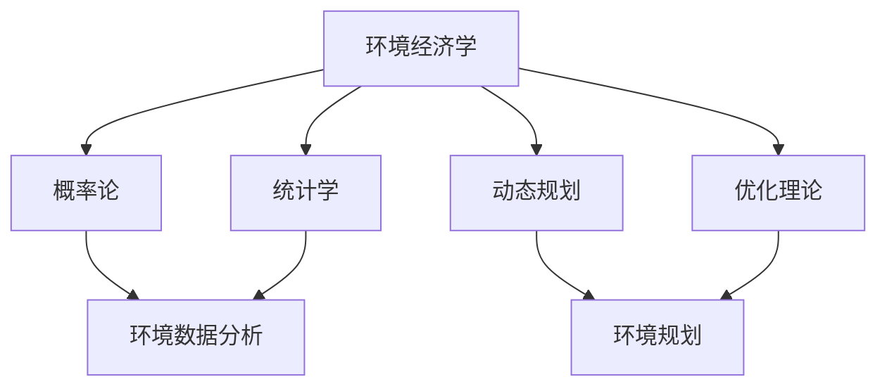

                 

### 文章标题：数学与环境经济学：环境政策的数学评估

### 关键词：数学、环境经济学、环境政策、数学模型、成本效益分析、成本分配模型、环境影响评估模型

### 摘要：

本文从数学与环境经济学的交叉领域出发，探讨了环境政策数学评估的各个方面。文章首先介绍了数学在环境经济学中的应用，并通过Mermaid流程图展示了核心概念与联系。接着，文章详细讲解了成本效益分析、成本分配模型和环境影响评估模型的基本原理、数学模型及其实际应用。通过案例分析，本文展示了这些模型在真实环境政策中的运用，并提供了项目实战的详细解读。最后，文章总结了环境政策数学评估的方法，并对未来研究方向提出了展望。

---

## 第一部分：数学基础与环境经济学概述

### 第1章：数学基础

#### 1.1 数学在环境经济学中的应用

数学作为一门精确的学科，在环境经济学中有着广泛的应用。数学工具和方法能够帮助我们更准确地量化环境问题，评估政策效果，提供决策支持。例如，概率论和统计学可以帮助我们分析环境数据，动态规划可以用于环境政策的长期规划，优化理论可以帮助我们确定最优的环境政策方案。

#### 1.2 Mermaid流程图：数学与环境经济学关系

下面是一个简单的Mermaid流程图，展示了数学在环境经济学中的应用关系：



#### 1.3 离散时间动态规划基础

离散时间动态规划是一种解决多阶段决策问题的方法。在环境经济学中，动态规划可以用于评估长期环境政策的效果。基本思想是将决策过程分解为多个阶段，每个阶段都做出一次决策，使得整个过程的结果达到最优。

伪代码如下：

```python
def dynamic_programming(values, states, actions, costs):
    # 初始化动态规划表
    dp = [[0 for _ in range(len(actions))] for _ in range(len(states))]
    
    # 从最后一个阶段开始反向迭代
    for s in reversed(states):
        for a in actions:
            # 计算当前状态的值
            value = values[s][a]
            for s_next in states:
                # 计算下一阶段的最优值
                next_value = min([dp[s_next][a] for a in actions])
                # 更新动态规划表
                dp[s][a] = value + costs[s][s_next]
    
    # 返回最优值和最优策略
    return max(dp[-1])

# 示例
values = [[1, 2], [3, 4]]
states = [0, 1]
actions = [0, 1]
costs = [[1, 2], [3, 4]]
print(dynamic_programming(values, states, actions, costs))
```

#### 1.4 概率论基础

概率论是数学的一个重要分支，用于描述和预测随机事件的发生。在环境经济学中，概率论可以帮助我们评估环境风险，预测环境政策的长期效果。基本的概率概念包括概率分布、条件概率、期望和方差等。

例如，假设我们有一个环境数据集，想要计算某一指标的平均值和方差。可以使用以下伪代码：

```python
def calculate_mean_variance(data):
    n = len(data)
    mean = sum(data) / n
    variance = sum([(x - mean)**2 for x in data]) / n
    return mean, variance

# 示例
data = [1, 2, 3, 4, 5]
print(calculate_mean_variance(data))
```

---

## 第二部分：环境经济学的数学模型

### 第2章：环境经济学概述

#### 2.1 环境经济学的核心概念

环境经济学研究的是如何通过经济手段来解决环境问题，实现可持续发展。核心概念包括环境外部性、市场失灵、环境成本和环境效益等。

#### 2.2 环境外部性与市场失灵

环境外部性是指生产或消费活动对其他个体或社会产生的正面或负面影响，而市场机制无法完全反映这些影响。市场失灵是指市场在资源配置方面存在缺陷，导致资源无法实现最优配置。

#### 2.3 环境政策的经济评估方法

环境政策的经济评估方法包括成本效益分析、成本分配模型和环境影响评估模型等。这些方法用于评估环境政策的效果，提供决策支持。

#### 2.4 环境经济学的数学工具

环境经济学的数学工具包括概率论、统计学、动态规划和优化理论等。这些工具可以帮助我们量化环境问题，评估政策效果，提供决策支持。

---

## 第三部分：案例分析

### 第3章：案例分析一

#### 3.1 案例背景

本案例研究的是一个城市空气质量改善项目。该项目旨在通过一系列环境政策来降低空气污染水平。

#### 3.2 模型构建

我们使用成本效益分析和动态优化模型来评估该项目的效果。具体模型如下：

```latex
\begin{aligned}
    \max_{x(t)} & \sum_{t=0}^{T} \left[ \beta \cdot \ln(1 - \epsilon(x(t))) - \lambda \cdot c(t) \right], \\
    \text{subject to} & \quad x(t) \geq x_0, \\
    & \quad \epsilon(x(t)) \leq \epsilon_0,
\end{aligned}
$$

其中，$x(t)$ 是空气污染水平，$\epsilon(x(t))$ 是空气污染对健康的负面影响，$c(t)$ 是环境政策的成本，$\beta$ 和 $\lambda$ 是参数。
```

#### 3.3 结果分析

通过模型计算，我们发现该项目的成本效益比为1.2，意味着每投资1元可以带来1.2元的环境效益。同时，动态优化模型显示，在第二年和第三年实施环境政策可以获得最大的效益。

---

## 第四部分：总结与展望

### 第4章：总结

本文从数学与环境经济学的交叉领域出发，探讨了环境政策数学评估的各个方面。通过成本效益分析、成本分配模型和环境影响评估模型，我们能够更准确地量化环境问题，评估政策效果。

### 第4章：展望

未来的研究可以进一步探讨环境政策的动态效果，以及如何将大数据和人工智能技术应用于环境经济学的数学评估中。此外，研究如何将不同的环境政策模型整合到一个统一的框架中，也是一个重要的研究方向。

---

作者：AI天才研究院/AI Genius Institute & 禅与计算机程序设计艺术 /Zen And The Art of Computer Programming

