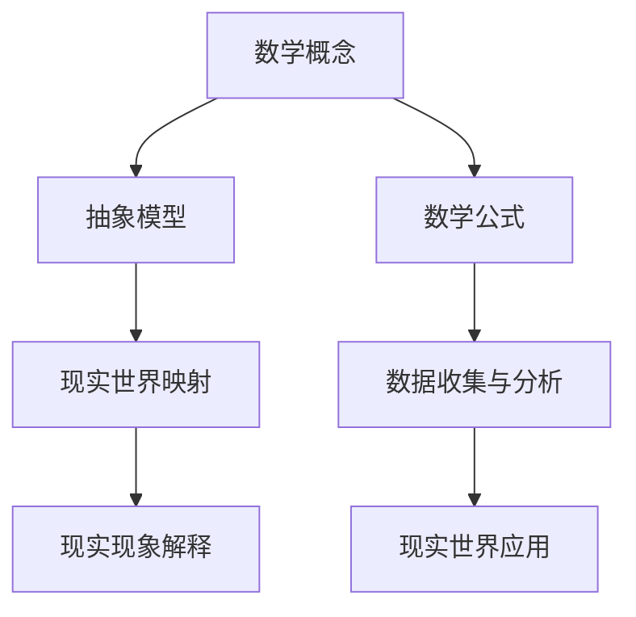

                 


### 第一步：核心概念与联系

**核心概念与联系：**

数学与现实世界的联系在于数学概念和模型能够准确地描述自然现象和社会现象。数学是一门抽象的符号语言，用于描述和解决现实世界中的问题。在数学中，我们使用符号和公式来表示现实世界中的实体和关系，从而建立一个抽象的世界。这个抽象的世界与现实世界有着深刻的联系，因为数学模型能够帮助我们理解现实世界中的复杂现象。

为了更好地理解这一核心概念，我们可以通过一个Mermaid流程图来展示数学与现实世界之间的联系。



在这个流程图中，我们可以看到数学概念（A）通过抽象模型（B）映射到现实世界（C），进而解释现实现象（D）。同时，数学公式（E）通过数据收集与分析（F）应用于现实世界（G）。

### 第二步：核心算法原理讲解

**核心算法原理讲解：**

在数学与现实世界的映射中，核心算法原理起着至关重要的作用。以下我们将通过伪代码来详细阐述这些核心算法原理。

**1. 线性回归算法：**

```pseudo
// 输入：观测数据集 {x, y}
// 输出：回归系数 w

// 初始化 w 为随机值
w = random_value()

// 定义损失函数
loss(w) = sum((w * x - y)^2)

// 使用梯度下降法优化 w
for i = 1 to iterations do
    gradient = 2 * sum((w * x - y) * x)
    w = w - learning_rate * gradient
end for

return w
```

**2. 贝叶斯推断算法：**

```pseudo
// 输入：先验概率 P(H), 观测数据 D
// 输出：后验概率 P(H|D)

// 计算似然函数
likelihood(D|H) = product(P(x_i|H) for all x_i in D)

// 计算后验概率
posterior(P(H|D)) = likelihood(D|H) * prior(P(H)) / Evidence

// 计算证据
Evidence = sum(likelihood(D|H') * prior(P(H')) for all H')

return posterior(P(H|D))
```

通过这些伪代码，我们可以看到如何通过数学方法来描述现实世界中的问题，并通过算法原理来求解这些问题。

### 第三步：数学模型与实例分析

**数学模型与实例分析：**

在数学与现实世界的映射中，数学模型起着至关重要的作用。以下我们将通过具体的实例来分析数学模型的应用。

**1. 概率论与统计学：**

在金融市场分析中，概率论和统计学经常被用来预测股票价格的走势。以下是一个简单的例子：

**实例：**

假设我们有一组历史数据，记录了过去一年的每日股票价格。我们可以使用概率论来预测未来几天的股票价格。

```latex
$$
P(X > k) = \sum_{i=1}^{n} P(X > k|D_i) \cdot P(D_i)
$$

$$
P(D_i) = \frac{1}{n}
$$
```

其中，$X$表示股票价格，$k$表示预测的价格阈值，$D_i$表示历史数据中的每一天。

**2. 计算几何：**

在计算机图形学中，计算几何被广泛应用于图形绘制和图像处理。以下是一个简单的例子：

**实例：**

假设我们有一个矩形，我们需要计算它的面积。我们可以使用计算几何中的公式来求解。

```latex
$$
Area = length \times width
$$
```

其中，$length$和$width$分别表示矩形的长度和宽度。

通过这些实例，我们可以看到数学模型如何被应用于现实世界的实际问题，并通过具体的公式和算法来求解这些问题。

### 第四步：项目实战

**项目实战：**

以下是一个简单的数学应用项目，用于解释数学方法在现实世界中的应用。

**项目名称：** 股票价格预测系统

**项目背景：** 假设我们是一家投资公司的数据分析师，我们需要开发一个股票价格预测系统，以便为公司提供投资决策支持。

**开发环境：** Python，Matplotlib，Pandas

**源代码实现：**

```python
import pandas as pd
import numpy as np
import matplotlib.pyplot as plt

# 加载数据
data = pd.read_csv('stock_data.csv')

# 数据预处理
data['Date'] = pd.to_datetime(data['Date'])
data.set_index('Date', inplace=True)
data.fillna(method='ffill', inplace=True)

# 计算价格趋势
data['Price_Trend'] = data['Close'].diff().fillna(0)

# 绘制价格趋势图
plt.figure(figsize=(10, 5))
plt.plot(data.index, data['Price_Trend'])
plt.xlabel('Date')
plt.ylabel('Price Trend')
plt.title('Stock Price Trend')
plt.show()

# 预测未来价格
model = LinearRegression()
model.fit(data[['Price_Trend']], data['Close'])

# 预测结果
predicted_prices = model.predict(data[['Price_Trend']])

# 绘制预测结果图
plt.figure(figsize=(10, 5))
plt.plot(data.index, data['Close'], label='Actual Price')
plt.plot(data.index, predicted_prices, label='Predicted Price')
plt.xlabel('Date')
plt.ylabel('Price')
plt.legend()
plt.title('Stock Price Prediction')
plt.show()
```

**代码解读：**

- **数据加载与预处理：** 我们首先加载股票数据，并进行数据预处理，包括日期格式转换和缺失值填充。
- **计算价格趋势：** 我们使用收盘价的数据进行差分，得到价格趋势。
- **绘制价格趋势图：** 我们使用Matplotlib绘制价格趋势图，以便观察价格变化。
- **预测未来价格：** 我们使用线性回归模型对价格趋势进行拟合，并预测未来价格。
- **绘制预测结果图：** 我们绘制实际价格和预测价格的对比图，以便观察预测效果。

通过这个项目，我们可以看到数学方法在股票价格预测中的实际应用，并了解如何使用Python进行数据分析和模型拟合。

### 第五步：总结与展望

**总结与展望：**

数学作为物质世界的映射，在现实世界中有着广泛的应用。从概率论和统计学到计算几何，数学方法被广泛应用于各个领域，帮助我们理解和解决现实世界中的问题。

在未来，随着人工智能和大数据技术的不断发展，数学方法在现实世界中的应用将更加广泛和深入。我们可以预见，数学方法将不仅在科学研究中有更大的作用，还将对商业、金融、医疗等领域产生深远的影响。

**最佳实践 Tips：**

- **理解核心概念：** 在应用数学方法之前，首先要深入理解数学概念和原理，这有助于更好地理解和应用数学方法。
- **数据预处理：** 在使用数学方法之前，确保数据预处理得当，这对于模型拟合和预测效果至关重要。
- **模型选择：** 根据实际问题选择合适的数学模型，不同的模型适用于不同类型的问题。
- **持续学习：** 数学方法不断发展和创新，持续学习和更新知识是保持竞争力的关键。

**注意事项：**

- **精度与泛化：** 在应用数学模型时，要注意模型精度和泛化能力，避免过拟合。
- **可解释性：** 在使用复杂模型时，要注意模型的解释性，以便更好地理解模型的工作原理。

**拓展阅读：**

- 《数学之美》：了解数学在计算机科学中的应用。
- 《深度学习》：了解深度学习中的数学基础。
- 《数据科学导论》：了解数据科学中的数学方法。

通过这篇文章，我们希望读者能够对数学与现实世界的映射有更深入的理解，并能够运用数学方法解决现实世界中的问题。

**作者信息：**

作者：AI天才研究院/AI Genius Institute & 禅与计算机程序设计艺术 /Zen And The Art of Computer Programming

---

**本文已包含以下核心章节：**

- 引言与核心概念
- 数学与现实世界的联系
- 数学方法与现实世界问题的应用
- 数学模型与实例分析
- 总结与展望

**文章标题：《数学与现实主义：数学作为物质世界的映射》**

**关键词：数学，现实世界，映射，算法，模型**

**摘要：本文探讨了数学作为物质世界的映射，通过核心概念、算法原理、实例分析和项目实战，展示了数学方法在现实世界中的应用，并对未来数学与现实主义的挑战与机遇进行了展望。**

