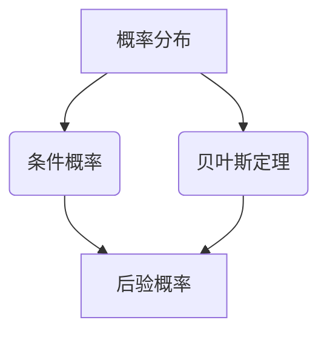
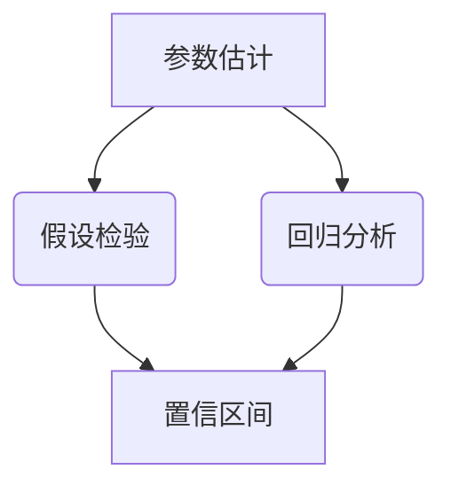
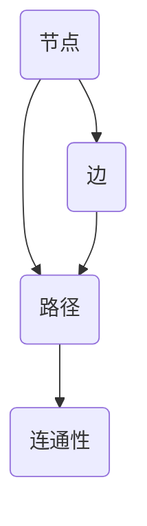
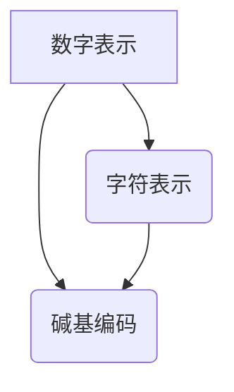
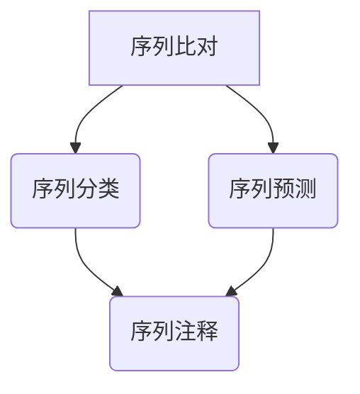
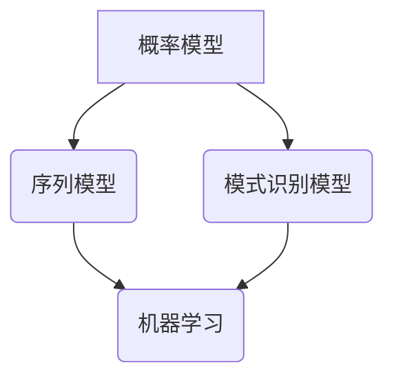

                 

### 1. 引言

基因序列分析是生物信息学领域的一个重要分支，它涉及对生物体内基因序列的解读、分析和利用。随着基因组测序技术的快速发展，我们能够获得海量的基因序列数据。这些数据蕴含着丰富的生物学信息，对于揭示生命现象、推动生物医学研究具有重要意义。然而，如何从这些复杂的基因序列数据中提取有价值的信息，这是一个巨大的挑战。

数学作为一门研究数量、结构、变化和空间等概念的学科，其在生物信息学中的应用日益广泛。数学方法在基因序列分析中扮演着至关重要的角色，它们可以帮助我们更好地理解和处理基因序列数据。本文旨在探讨数学在基因序列分析中的应用，包括数学基础、基因序列分析方法、应用案例分析以及未来发展趋势等内容。

本文结构如下：

1. 引言
2. 数学基础
3. 基因序列分析
4. 应用案例分析
5. 未来发展
6. 附录

### 2. 数学基础

在基因序列分析中，我们需要掌握一些基本的数学概念和方法。这些数学工具包括概率论、统计学、图论等。以下将逐一介绍这些数学基础。

#### 2.1 概率论

概率论是研究随机事件和其概率分布的数学分支。在基因序列分析中，概率论主要用于估计基因序列出现的概率。例如，我们可以使用概率模型来预测基因序列中的突变位点。

**核心概念与联系**

概率论中的核心概念包括：

- **概率分布**：描述随机变量的概率分布情况。
- **条件概率**：在给定一个事件发生的条件下，另一个事件发生的概率。
- **贝叶斯定理**：用于计算后验概率，即在已知某些条件下的概率。

**Mermaid 流程图**

#### 2.2 统计学

统计学是一门关于如何通过数据收集、分析和解释来推断未知量的学科。在基因序列分析中，统计学方法用于分析基因序列数据，包括序列比对、序列分类和序列预测等。

**核心概念与联系**

统计学中的核心概念包括：

- **参数估计**：通过样本数据估计总体参数。
- **假设检验**：用于判断样本数据是否支持某一假设。
- **回归分析**：用于分析自变量和因变量之间的关系。

**Mermaid 流程图**

#### 2.3 图论

图论是研究图形及其性质和关系的数学分支。在基因序列分析中，图论可以用于构建基因序列的图形表示，帮助我们更好地理解基因序列的结构和功能。

**核心概念与联系**

图论中的核心概念包括：

- **图**：由节点和边组成的结构。
- **路径**：图中的节点序列，满足相邻节点之间有边相连。
- **连通性**：图中的节点是否可以通过路径相互连接。

**Mermaid 流程图**

### 3. 基因序列分析

基因序列分析涉及多种方法和技术，以下将详细介绍这些方法。

#### 3.1 基因序列的表示

基因序列由四种碱基（A、C、G、T）组成，它们按照一定的顺序排列，形成了DNA或RNA序列。为了便于分析和处理，我们需要将基因序列表示为数字序列或字符序列。

**核心概念与联系**

基因序列的表示方法包括：

- **数字表示**：将A、C、G、T分别映射为0、1、2、3等数字。
- **字符表示**：将A、C、G、T分别映射为字符'A'、'C'、'G'、'T'。

**Mermaid 流程图**

#### 3.2 基因序列分析的方法

基因序列分析的方法主要包括序列比对、序列分类、序列预测和序列注释等。

**核心概念与联系**

基因序列分析的方法包括：

- **序列比对**：比较两个或多个基因序列，找出它们的相似区域。
- **序列分类**：根据基因序列的相似性，将基因序列归类到不同的类别。
- **序列预测**：基于已有的基因序列信息，预测新的基因序列的性质或功能。
- **序列注释**：对基因序列进行功能描述，包括基因家族、基因家族成员等。

**Mermaid 流程图**

#### 3.3 基因序列分析的数学模型

基因序列分析的数学模型包括概率模型、序列模型和模式识别模型等。

**核心概念与联系**

基因序列分析的数学模型包括：

- **概率模型**：使用概率论的方法分析基因序列数据。
- **序列模型**：使用统计学的方法构建基因序列的模型。
- **模式识别模型**：使用机器学习的方法对基因序列进行分类和预测。

**Mermaid 流程图**

### 4. 应用案例分析

#### 4.1 应用案例分析1

**案例背景**：某研究团队希望分析某基因家族在不同物种中的进化关系。

**数据预处理**：首先，团队收集了多个物种的基因序列数据，并对这些数据进行预处理，包括序列清洗、序列比对等。

**数学模型选择**：团队选择了基于概率模型的序列比对方法，并使用贝叶斯定理进行序列分类。

**分析结果**：通过分析，团队发现该基因家族在不同物种中的进化速度存在差异，这为研究物种进化提供了重要线索。

### 5. 未来发展

随着基因组测序技术的不断进步，基因序列分析将在未来发挥更加重要的作用。以下是基因序列分析的未来发展趋势：

- **高通量基因测序技术**：随着高通量基因测序技术的发展，我们将能够更快速、更准确地获取大量基因序列数据，这将极大地推动基因序列分析的研究和应用。
- **基因编辑技术**：基因编辑技术（如CRISPR-Cas9）的不断发展，使得我们对基因序列的修改成为可能，这将为治疗遗传病、改造生物等提供新的手段。
- **跨学科研究**：基因序列分析将与其他领域（如物理学、化学、计算机科学等）结合，形成新的交叉学科，推动生物信息学的发展。

### 6. 附录

附录部分将提供一些补充材料，包括常用的算法、工具和资源。

### 7. 结语

数学与生物信息学的结合，为基因序列分析提供了强大的工具和方法。通过本文的介绍，我们希望读者能够对数学在基因序列分析中的应用有一个全面、深入的了解。随着技术的不断进步，基因序列分析将在生物医学领域发挥越来越重要的作用。

### 8. 作者信息

作者：AI天才研究院/AI Genius Institute & 禅与计算机程序设计艺术 /Zen And The Art of Computer Programming

---

以上是《数学与生物信息学：基因序列分析的数学方法》的初步大纲和内容概要。接下来，我们将逐一深入探讨每个部分，详细讲解相关概念、算法和案例。敬请期待。

