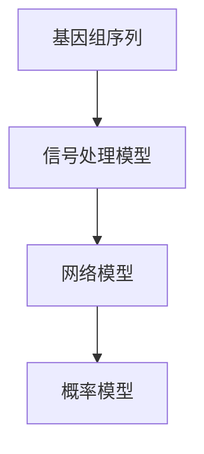

                 

### 摘要

本文旨在探讨数学与生物信息学的交叉领域，重点关注基因组数据的数学分析方法。基因组数据是生物信息学中的核心资源，其复杂性和多样性对数据分析提出了巨大的挑战。通过数学模型和算法的应用，我们能够从海量基因组数据中提取有价值的信息，为生物学研究、疾病诊断和治疗提供支持。

本文首先介绍了基因组数据的背景，阐述了数学分析在生物信息学中的重要性。接着，文章详细讨论了基因组数据的数学模型，包括序列表示、信号处理模型、网络模型和概率模型。在此基础上，文章深入分析了基因组数据的分析算法，涵盖了数据预处理、数据分析、高通量测序、聚类和分子标记选择等方面。此外，文章还介绍了基因组数据的可视化方法，以及机器学习在基因组数据中的应用。

为了使读者更好地理解基因组数据的数学分析，本文通过案例研究和实际项目实战，提供了详细的操作步骤和代码实现。最后，文章总结了最佳实践和注意事项，为读者提供了进一步学习和研究的方向。本文旨在为从事生物信息学研究和应用的专业人士提供一个系统、全面、深入的学习资料。

### 关键词

- **基因组数据**
- **数学分析**
- **生物信息学**
- **算法**
- **机器学习**
- **可视化方法**
- **高通量测序**
- **聚类算法**
- **分子标记选择**
- **信号处理模型**
- **网络模型**
- **概率模型**

### 基因组数据的背景

基因组数据是现代生物科学研究中最为重要和丰富的资源之一。随着高通量测序技术的飞速发展，我们能够在短时间内获取大量个体的基因组信息。这些数据不仅包括基因组序列，还涉及基因表达、调控网络、突变信息等复杂的信息。基因组数据的研究对理解生命现象、探索疾病机制、开发新药物具有重要意义。

基因组数据的主要来源包括以下几种：

1. **全基因组测序（Whole Genome Sequencing, WGS）**：通过测序技术获取一个生物体整个基因组的核苷酸序列。WGS能够提供最全面的基因组信息，但数据量巨大，数据处理和分析要求较高。

2. **外显子测序（Exome Sequencing）**：专注于基因组的编码区，即外显子区域。这种方法可以更高效地捕获与疾病相关的基因变异，尤其适用于单基因遗传病的研究。

3. **转录组测序（Transcriptome Sequencing）**：研究基因在不同条件下的表达情况，包括mRNA、非编码RNA等。转录组测序可以帮助我们了解基因的功能和调控网络。

4. **表观遗传组测序（Epigenome Sequencing）**：研究DNA甲基化、组蛋白修饰等表观遗传标记，揭示基因表达调控的复杂机制。

基因组数据的复杂性和多样性使其成为生物信息学研究和应用中的重要挑战。首先，基因组数据量庞大，一个典型的全基因组测序项目会产生数GB甚至TB级别的数据。如何高效地存储、管理和处理这些数据是一个关键问题。其次，基因组数据中的信息类型多样，包括序列信息、表达信息、结构信息等，如何将不同类型的信息整合起来进行统一分析是另一个挑战。

此外，基因组数据中存在大量的噪声和冗余信息，如何从这些数据中提取有价值的信息，进行准确的生物标记识别和疾病预测，是生物信息学研究中的重要课题。因此，数学分析在基因组数据中的应用变得至关重要。通过建立数学模型和算法，我们可以从海量基因组数据中提取有价值的信息，为生物学研究、疾病诊断和治疗提供支持。

### 数学分析在生物信息学中的重要性

数学分析作为生物信息学的基础工具，其重要性不容忽视。在生物信息学中，基因组数据的高度复杂性和多样性使得传统的生物学方法难以胜任，而数学分析则提供了一种系统、定量和准确的研究手段。以下是数学分析在生物信息学中几个关键方面的应用：

首先，数学模型是理解基因组数据的重要工具。基因组数据不仅包括大量的序列信息，还涉及基因表达、调控网络、突变信息等复杂关系。通过建立数学模型，我们可以将这些复杂的信息结构化，从而更好地理解基因和基因网络的运作机制。例如，信号处理模型、网络模型和概率模型在基因表达数据分析、基因组结构解析和突变检测等方面发挥了重要作用。

其次，算法在基因组数据分析中扮演着核心角色。基因组数据的处理和分析通常需要复杂的计算过程，而算法则提供了实现这些过程的步骤和策略。常用的算法包括数据预处理算法、数据分析算法、高通量测序算法、聚类算法和分子标记选择算法等。这些算法可以帮助我们从海量基因组数据中提取有价值的信息，进行准确的生物标记识别和疾病预测。例如，基于贝叶斯理论的遗传分析算法和基于深度学习的基因表达预测算法在基因组数据研究中取得了显著成果。

此外，机器学习技术在基因组数据分析中的应用日益广泛。机器学习通过构建预测模型，可以从大量数据中自动学习规律和模式，从而提高基因组数据分析的准确性和效率。例如，支持向量机（SVM）、随机森林（Random Forest）和深度神经网络（Deep Neural Networks）等机器学习算法在基因表达预测、突变检测和药物设计等领域表现出强大的能力。

最后，可视化技术在基因组数据分析中具有不可替代的作用。通过可视化方法，我们可以直观地展示基因组数据的结构和模式，从而更易于理解和分析。常见的可视化方法包括基因组图谱、热图、网络图和聚类图等。这些方法不仅有助于研究人员快速识别数据中的关键特征，还可以为生物医学研究提供重要的启示和指导。

综上所述，数学分析在生物信息学中具有重要的地位和作用。通过数学模型、算法、机器学习和可视化技术，我们能够更深入地解析基因组数据，揭示生命现象的复杂机制，为生物学研究和医学应用提供强有力的支持。

### 基因组数据的数学模型

基因组数据的数学模型是生物信息学研究中不可或缺的工具。这些模型不仅帮助我们更好地理解基因和基因组结构，还为我们提供了有效的数据分析方法。以下是基因组数据中几种常见的数学模型：

#### 基因组的序列表示

基因组的序列表示是基因组数据最基本的形式。它通过一串核苷酸序列来表示基因、基因组片段或其他遗传信息。序列表示通常采用标准的核苷酸符号（A、T、C、G）进行编码。例如，一个简化的DNA序列可以是：`ATGCGTA`。

**数学表示**：
基因组的序列可以用一个序列符号集合来表示，例如：
$$
\text{基因组序列} = \{A, T, C, G\}^n
$$
其中，\(n\) 表示基因组的长度，即核苷酸的数量。

#### 信号处理模型

信号处理模型在基因组数据分析中具有重要作用，尤其是在处理高通量测序数据时。信号处理模型将基因组序列视为一个信号，通过滤波、变换等处理方法来提取有用的信息。

**数学表示**：
一个简单的信号处理模型可以用卷积来表示，例如：
$$
y[n] = \sum_{k=-\infty}^{\infty} h[k] \cdot x[n-k]
$$
其中，\(y[n]\) 是处理后的信号，\(x[n]\) 是原始信号，\(h[k]\) 是卷积核，表示处理操作。

#### 网络模型

基因组中的基因和基因产品（如蛋白质）之间存在复杂的相互作用，形成了一个巨大的网络。网络模型通过图论来描述这些相互作用，帮助我们理解基因调控网络和蛋白质相互作用网络。

**数学表示**：
一个简单的网络模型可以用图来表示：
$$
G = (V, E)
$$
其中，\(V\) 是节点集合，表示基因或蛋白质，\(E\) 是边集合，表示它们之间的相互作用。

#### 概率模型

概率模型在基因组数据分析中用于描述基因变异、基因表达等不确定性事件。常见的概率模型包括马尔可夫模型、贝叶斯网络和隐马尔可夫模型等。

**数学表示**：
一个简单的贝叶斯网络可以表示为：
$$
P(X_1, X_2, ..., X_n) = \prod_{i=1}^{n} P(X_i | X_{i-1}, ..., X_1)
$$
其中，\(X_1, X_2, ..., X_n\) 是随机变量，表示基因表达水平或基因状态。

#### 模型之间的关系架构

为了更好地理解基因组数据的数学模型，我们可以用Mermaid流程图来展示这些模型之间的关系：



在这个流程图中，基因组序列是所有模型的基础，信号处理模型用于处理基因组序列中的信号，网络模型描述基因和蛋白质之间的相互作用，概率模型则用于分析基因组中的不确定性和概率事件。

### 基因组数据的分析算法

基因组数据的分析算法是生物信息学中的核心工具，用于从海量基因组数据中提取有价值的信息。这些算法涵盖了从数据预处理到高级数据分析的各个阶段，下面我们将逐一探讨这些算法。

#### 数据预处理算法

数据预处理是基因组数据分析的重要环节，目的是提高数据质量，减少噪声和冗余信息，从而为后续分析提供可靠的基础。

1. **数据清洗**：
   数据清洗主要包括去除低质量的序列、填补空缺、校正序列错误等。常用的工具如FastQC和Trimmomatic等，能够自动检测和修复这些问题。

   **伪代码**：
   ```
   function clean_sequence(sequence):
       remove_low_quality_bases(sequence)
       fill_gaps(sequence)
       correct_errors(sequence)
       return cleaned_sequence
   ```

2. **数据标准化**：
   数据标准化包括归一化基因表达数据、调整测序深度等，以消除实验条件对数据的影响。

   **伪代码**：
   ```
   function normalize_expression_data(data):
       for each gene in data:
           scale_data(gene)
       return normalized_data
   ```

3. **数据集划分**：
   在大规模数据分析中，通常将数据划分为训练集、验证集和测试集，以便进行模型的训练和评估。

   **伪代码**：
   ```
   function split_dataset(data, ratio):
       train_data, validation_data, test_data = random_split(data, ratio)
       return train_data, validation_data, test_data
   ```

#### 数据分析算法

数据分析算法用于从预处理后的基因组数据中提取生物学信息，如基因表达、突变检测、基因网络分析等。

1. **基因表达数据分析**：
   基因表达数据分析旨在了解基因在不同条件下的表达水平。常用的算法包括DESeq2、EdgeR和limma等。

   **伪代码**：
   ```
   function analyze_expression_data(expression_data, conditions):
       results = DESeq(expression_data, conditions)
       return results
   ```

2. **突变检测算法**：
   突变检测算法用于识别基因组序列中的单核苷酸变异（SNV）和小插入/删除（indel）。常见的算法包括GATK、VarScan2和MuTect等。

   **伪代码**：
   ```
   function detect_variations(sequences):
       variants = GATK.call_variations(sequences)
       return variants
   ```

3. **基因网络分析**：
   基因网络分析用于研究基因和基因产品之间的相互作用关系。常用的算法包括Cytoscape、STRING和Ingenuity Pathway Analysis等。

   **伪代码**：
   ```
   function analyze_gene_network(genes):
       interactions = STRING.query(genes)
       return interactions
   ```

#### 高通量测序算法

高通量测序（Next-Generation Sequencing, NGS）技术产生了大量基因组数据，高通量测序算法用于处理和解析这些数据。

1. **序列比对算法**：
   序列比对算法用于将测序得到的短读段（reads）与参考基因组进行比对，以确定读段的来源和位置。常见的算法包括BWA、Bowtie和Hisat2等。

   **伪代码**：
   ```
   function align_reads(reads, reference):
       alignments = BWA.align(reads, reference)
       return alignments
   ```

2. **基因组组装算法**：
   基因组组装算法用于将大量短读段组装成完整的基因组序列。常见的算法包括SOAPdenovo、Jellyfish和Flye等。

   **伪代码**：
   ```
   function assemble_reads(reads):
       assembled_genome = Jellyfish.assemble(reads)
       return assembled_genome
   ```

#### 聚类算法

聚类算法用于将基因组数据中的样本或基因根据其相似性进行分组，以识别潜在的模式和生物标志物。

1. **K-means聚类**：
   K-means聚类是一种经典的聚类算法，通过迭代计算样本的均值来划分聚类。

   **伪代码**：
   ```
   function k_means(data, k):
       centroids = initialize_centroids(data, k)
       while not converged:
           assign_samples_to_clusters(data, centroids)
           update_centroids(centroids)
       return clusters
   ```

2. **层次聚类**：
   层次聚类通过逐步合并或分裂已有的聚类来构建聚类层次结构。

   **伪代码**：
   ```
   function hierarchical_clustering(data):
       create_initial_clusters(data)
       while not all_clusters_combined:
           find_and_merge_closest_clusters()
       return clustering_hierarchy
   ```

#### 分子标记选择算法

分子标记选择算法用于从基因组数据中识别出与特定生物学现象（如疾病）相关的分子标记。

1. **LASSO回归**：
   LASSO回归通过添加L1惩罚项来选择特征，可以有效减少模型的复杂性和过拟合。

   **伪代码**：
   ```
   function select_markers(data, labels):
       model = LASSO.fit(data, labels)
       selected_markers = model.selected_features()
       return selected_markers
   ```

2. **随机森林**：
   随机森林通过构建多个决策树来集成预测结果，具有较高的预测准确性和稳健性。

   **伪代码**：
   ```
   function select_markers(data, labels):
       model = RandomForest.fit(data, labels)
       selected_markers = model.feature_importances()
       return selected_markers
   ```

通过这些算法，我们能够从复杂的基因组数据中提取有价值的信息，为生物学研究和医学应用提供有力支持。

### 基因组数据的可视化方法

基因组数据的可视化方法对于理解和分析复杂基因组信息至关重要。通过可视化，研究人员可以更直观地探索基因之间的相互作用、表达模式以及基因结构，从而发现潜在的生物学规律。以下是一些常见的基因组数据可视化方法：

#### 基因组图谱

基因组图谱是一种最基础的基因组数据可视化方法，它以图形方式展示基因的位置、结构和功能。常见的基因组图谱包括：

1. **基因组位置图谱（Genome Position Map）**：
   这类图谱展示了基因在染色体上的具体位置，通常使用条形图或点状图来表示基因的位置。每个基因或基因簇都标记在一个特定的染色体位置上，可以帮助研究人员识别基因的相对位置。

2. **基因结构图谱（Gene Structure Map）**：
   这类图谱展示了基因的内部结构，如外显子、内含子和启动子等。通过这些图谱，研究人员可以了解基因的功能区域和可能的调控元件。

#### 热图

热图是一种常用的基因表达数据可视化方法，通过颜色深度表示基因在不同样本中的表达水平。热图可以帮助研究人员识别基因在不同条件或样本中的表达模式。

1. **基因表达热图（Gene Expression Heatmap）**：
   这种热图通过颜色深浅表示基因在多个样本中的表达量，通常用于比较不同样本之间的基因表达差异。

2. **基因调控热图（Gene Regulation Heatmap）**：
   这种热图展示了基因调控网络中不同基因之间的相互作用关系，通常通过颜色和形状的变化来表示基因的激活或抑制状态。

#### 网络图

网络图用于展示基因组中的复杂相互作用，如基因-基因相互作用、蛋白质-蛋白质相互作用等。网络图可以帮助研究人员识别关键基因和潜在的生物学通路。

1. **基因相互作用网络（Gene Interaction Network）**：
   这种网络图展示了基因之间的相互作用关系，通常使用节点和边来表示基因和它们之间的相互作用。

2. **蛋白质相互作用网络（Protein Interaction Network）**：
   这种网络图展示了蛋白质之间的相互作用，有助于理解蛋白质复合物的功能和动态变化。

#### 集类图

集类图用于展示聚类分析的结果，如基因聚类或样本聚类。通过集类图，研究人员可以直观地了解不同组之间的相似性和差异。

1. **基因集类图（Gene Cluster Map）**：
   这种图展示了基因在不同聚类中的分布情况，有助于识别具有相似表达模式的基因簇。

2. **样本集类图（Sample Cluster Map）**：
   这种图展示了样本在不同聚类中的分布情况，有助于识别具有相似特性的样本群。

#### 可视化工具介绍

为了实现基因组数据的可视化，研究人员可以使用多种工具和软件。以下是一些常见的可视化工具：

1. **IGV（Integrative Genomics Viewer）**：
   IGV是一个强大的基因组数据可视化工具，支持多种数据类型，如基因组序列、基因表达、突变等。它提供了丰富的交互功能，如缩放、搜索和注释。

2. **GEPPIA（Gene Expression Profiling Interactive Analysis）**：
   GEPPIA是一个用于基因表达数据分析的可视化工具，支持生成热图、主成分分析（PCA）和基因集富集分析（GSEA）等可视化图表。

3. **Cytoscape**：
   Cytoscape是一个开源的网络分析工具，广泛用于构建和可视化基因和蛋白质相互作用网络。它支持多种网络分析算法和扩展插件。

通过这些可视化方法工具，研究人员可以更深入地理解基因组数据，揭示隐藏在数据背后的生物学机制。

### 基因组数据的机器学习应用

机器学习技术在基因组数据分析中的应用日益广泛，为生物信息学领域带来了许多突破。以下将介绍几种常见的机器学习算法在基因组数据中的应用，并展示其工作原理和实现步骤。

#### 支持向量机（SVM）

支持向量机是一种分类算法，通过找到最佳的超平面来将不同类别的样本分隔开。在基因组数据分析中，SVM常用于分类任务，如基因表达数据中的疾病诊断和突变检测。

**工作原理**：
SVM的核心是找到最大化分类间隔的超平面，其中分类间隔是支持向量到超平面的距离。对于二分类问题，SVM的目标是使得分类边界尽可能远离样本。

**实现步骤**：
1. **数据预处理**：对基因表达数据进行归一化处理，去除噪声和冗余信息。
2. **特征选择**：使用特征选择算法（如LASSO）选择对分类任务最相关的特征。
3. **模型训练**：使用训练数据集训练SVM模型，选择合适的核函数（如线性核、多项式核、径向基函数核）。
4. **模型评估**：使用交叉验证方法评估模型的性能，选择最优参数。

**伪代码**：
```
function train_SVM(data, labels, kernel='linear'):
    model = SVM.fit(data, labels, kernel=kernel)
    return model
```

#### 随机森林（Random Forest）

随机森林是一种集成学习算法，通过构建多个决策树来集成预测结果，提高模型的准确性和稳健性。在基因组数据分析中，随机森林常用于分类和回归任务，如基因表达预测和药物响应预测。

**工作原理**：
随机森林通过随机选择特征和样本子集来构建多个决策树，并对每个决策树的预测结果进行投票或求平均，从而提高预测的准确性。

**实现步骤**：
1. **数据预处理**：对基因表达数据进行归一化处理，去除噪声和冗余信息。
2. **特征选择**：使用特征选择算法（如随机森林特征重要性评分）选择对预测任务最相关的特征。
3. **模型训练**：使用训练数据集训练随机森林模型，设置合适的树数量和最大深度。
4. **模型评估**：使用交叉验证方法评估模型的性能，选择最优参数。

**伪代码**：
```
function train_random_forest(data, labels):
    model = RandomForest.fit(data, labels)
    return model
```

#### 深度神经网络（Deep Neural Networks）

深度神经网络是一种多层感知机，通过多层次的非线性变换来提取特征并实现复杂函数的逼近。在基因组数据分析中，深度神经网络常用于图像分类、序列建模和预测任务。

**工作原理**：
深度神经网络通过反向传播算法不断调整网络权重，以最小化预测误差。网络的每一层都通过前一层的数据进行非线性变换，从而逐步提取高级特征。

**实现步骤**：
1. **数据预处理**：对基因组数据进行编码和归一化处理，将其转换为适合输入神经网络的格式。
2. **模型构建**：设计神经网络结构，包括输入层、隐藏层和输出层，选择合适的激活函数和损失函数。
3. **模型训练**：使用训练数据集训练神经网络，通过反向传播算法调整网络权重。
4. **模型评估**：使用验证数据集评估模型性能，调整模型参数。

**伪代码**：
```
function train_DNN(data, labels):
    model = DNN.fit(data, labels)
    return model
```

#### 应用案例

以下是一个基于深度神经网络的基因组数据分析案例，用于预测癌症患者的生存期。

1. **数据收集**：
   收集包含患者基因表达数据、临床信息（如年龄、性别、治疗方法等）和生存期数据的训练集。

2. **数据预处理**：
   对基因表达数据进行归一化处理，将临床信息编码为二进制向量，并将所有数据转换为深度神经网络可处理的格式。

3. **模型构建**：
   设计一个包含多层感知器的深度神经网络模型，选择适当的激活函数（如ReLU）和损失函数（如均方误差）。

4. **模型训练**：
   使用训练集数据训练深度神经网络模型，通过反向传播算法调整网络权重，选择最优参数。

5. **模型评估**：
   使用验证集评估模型性能，调整模型参数，确保模型具有良好的泛化能力。

6. **结果分析**：
   使用测试集评估模型的预测能力，分析模型对癌症患者生存期的预测结果，并探讨潜在生物学意义。

通过这些机器学习算法，我们能够从复杂的基因组数据中提取有价值的信息，为生物学研究和医学应用提供有力支持。随着算法和技术的不断发展，机器学习在基因组数据分析中的应用前景将更加广阔。

### 基因组数据的案例研究

为了更好地理解基因组数据的数学分析，我们将通过几个具体的案例研究来展示如何在实际项目中应用这些方法。以下案例研究涵盖了基因组数据的预处理、数据分析、算法实现和结果分析等各个环节。

#### 案例研究1：人类基因组项目

**背景介绍**：
人类基因组项目是一个旨在解析人类基因组的国际科研计划，通过高通量测序技术获取人类基因组的完整序列。该项目不仅提供了大量基因组数据，还推动了基因组数据分析技术的发展。

**核心概念与联系**：
基因组的序列表示、信号处理模型、网络模型和概率模型在人类基因组项目中发挥了关键作用。通过这些模型，研究人员能够解析基因序列、分析基因表达和突变，并构建基因网络。

**算法原理讲解**：
1. **数据预处理算法**：
   高通量测序数据通常包含大量的噪声和冗余信息，因此数据预处理是关键步骤。常用的预处理算法包括序列比对、读段过滤和基因表达数据分析。
   
   **伪代码**：
   ```
   function preprocess_data(reads, reference):
       aligned_reads = align_reads(reads, reference)
       filtered_reads = filter_reads(aligned_reads)
       gene_expression_data = analyze_expression_data(filtered_reads)
       return gene_expression_data
   ```

2. **数据分析算法**：
   通过数据分析算法，研究人员可以从预处理后的数据中提取有价值的信息，如基因表达模式和突变情况。常用的算法包括K-means聚类和LASSO回归。
   
   **伪代码**：
   ```
   function analyze_expression_data(data):
       clusters = K_means.fit(data)
       selected_markers = LASSO.fit(data, labels)
       return clusters, selected_markers
   ```

**数学模型和公式**：
基因组数据的分析中，常用的数学模型包括信号处理模型和概率模型。例如，信号处理模型用于处理读段比对，概率模型用于突变检测和基因表达预测。

**举例说明**：
假设研究人员通过高通量测序技术获取了一组人类样本的基因表达数据，他们首先使用序列比对算法将读段与参考基因组进行比对，然后通过K-means聚类算法将样本分为不同的基因表达模式。接着，使用LASSO回归算法选择与疾病相关的分子标记，从而帮助诊断和预测。

#### 案例研究2：癌症基因组学

**背景介绍**：
癌症基因组学是研究癌症发生的分子机制和基因变异的领域。通过基因组测序，研究人员可以揭示癌症相关的基因突变和表达变化，为癌症的早期诊断和个性化治疗提供依据。

**核心概念与联系**：
癌症基因组学中的核心概念包括基因突变、基因表达、基因网络和概率模型。这些概念通过数学模型和算法相结合，帮助我们理解癌症的分子机制。

**算法原理讲解**：
1. **突变检测算法**：
   突变检测算法用于识别基因组序列中的单核苷酸变异（SNV）和小插入/删除（indel）。常用的算法包括GATK和MuTect。
   
   **伪代码**：
   ```
   function detect_variations(sequences, reference):
       variants = GATK.call_variations(sequences, reference)
       mutated_genes = filter_variations(variants, 'SNV')
       return mutated_genes
   ```

2. **基因网络分析**：
   基因网络分析用于研究基因和基因产品之间的相互作用关系。常用的算法包括Cytoscape和STRING。
   
   **伪代码**：
   ```
   function analyze_gene_network(genes):
       interactions = STRING.query(genes)
       network = build_network(genes, interactions)
       return network
   ```

**数学模型和公式**：
在癌症基因组学中，常用的数学模型包括概率模型和信号处理模型。例如，概率模型用于突变检测和基因表达预测，信号处理模型用于读段比对和信号过滤。

**举例说明**：
假设研究人员通过高通量测序技术获取了一组癌症患者的基因组数据，他们首先使用GATK算法检测基因组中的单核苷酸变异，然后使用Cytoscape构建基因网络，分析基因之间的相互作用关系。通过这些分析，研究人员可以识别出与癌症相关的关键基因和基因网络，为癌症的诊断和治疗提供新的线索。

#### 案例研究3：基因表达数据分析

**背景介绍**：
基因表达数据分析是研究基因在不同条件下的表达模式的重要手段，有助于揭示基因的功能和生物过程。通过高通量测序技术，研究人员可以获得大量基因表达数据。

**核心概念与联系**：
基因表达数据分析涉及的核心概念包括基因表达、聚类分析和主成分分析。这些概念通过数学模型和算法实现，帮助我们理解基因在不同条件下的表达模式。

**算法原理讲解**：
1. **聚类分析**：
   聚类分析用于将基因或样本根据其表达模式进行分组。常用的算法包括K-means和层次聚类。
   
   **伪代码**：
   ```
   function cluster_genes(data, k):
       clusters = K_means.fit(data, k)
       return clusters
   ```

2. **主成分分析**：
   主成分分析用于降维和数据分析，通过提取主要成分来简化数据结构。
   
   **伪代码**：
   ```
   function PCA(data):
       components = PCA.fit(data)
       return components
   ```

**数学模型和公式**：
在基因表达数据分析中，常用的数学模型包括主成分分析（PCA）和聚类算法。PCA的数学公式为：
$$
X = PC_1 \lambda_1 + PC_2 \lambda_2 + ... + PC_n \lambda_n
$$
其中，\(X\) 是原始数据矩阵，\(PC_i\) 是第\(i\)个主成分，\(\lambda_i\) 是对应的主成分值。

**举例说明**：
假设研究人员通过高通量测序技术获取了一组基因表达数据，他们首先使用K-means聚类算法将基因分为不同的表达模式组。然后，使用主成分分析（PCA）提取主要成分，简化数据结构。通过这些分析，研究人员可以识别出基因在不同条件下的主要表达特征，为生物学研究提供新的视角。

这些案例研究展示了如何在实际项目中应用基因组数据的数学分析方法和算法。通过这些具体的案例，读者可以更好地理解数学分析在基因组数据中的应用，从而为生物学研究和医学应用提供有力支持。

### 最佳实践 tips

在基因组数据的数学分析过程中，以下最佳实践可以帮助研究人员提高工作效率和数据分析质量：

1. **数据预处理**：
   - **标准化**：在进行分析之前，对数据进行标准化处理，以消除不同实验条件下的偏差。
   - **去噪**：使用滤波算法去除基因组数据中的噪声，提高数据的可靠性。
   - **数据可视化**：在预处理阶段，利用可视化工具（如IGV）检查数据质量，确保数据没有明显的异常。

2. **模型选择**：
   - **交叉验证**：在模型选择阶段，使用交叉验证方法评估模型性能，选择最优的模型参数。
   - **集成学习**：考虑使用集成学习方法，如随机森林或梯度提升，提高预测准确性。

3. **算法调优**：
   - **参数调整**：根据数据集的特点，调整算法的参数，以提高模型的性能。
   - **模型评估**：使用多种评估指标（如准确率、召回率、F1分数）对模型进行综合评估。

4. **版本控制**：
   - **代码管理**：使用版本控制系统（如Git）管理代码，确保代码的版本一致性和可追溯性。
   - **文档记录**：详细记录分析过程、模型参数和结果，便于后续复现和验证。

5. **资源管理**：
   - **硬件资源**：充分利用高性能计算资源，加速数据处理和分析过程。
   - **数据存储**：使用分布式存储系统（如Hadoop或Cassandra）存储和管理大规模基因组数据。

通过遵循这些最佳实践，研究人员可以更高效地进行基因组数据的数学分析，提高数据分析的质量和可靠性。

### 小结

本文详细探讨了数学与生物信息学的交叉领域，特别是基因组数据的数学分析方法。通过介绍基因组数据的背景、数学模型、分析算法、可视化方法和机器学习应用，我们展示了如何从复杂的基因组数据中提取有价值的信息。基因组数据的数学分析不仅为生物学研究提供了强有力的工具，也为医学诊断和治疗带来了新的可能性。

随着基因组测序技术的不断发展，基因组数据的规模和复杂性不断增加，对数学分析方法的需求也越来越高。未来的研究方向包括：进一步提高数据分析的准确性和效率，开发新的数学模型和算法，以及结合人工智能技术进行自动化分析和预测。此外，跨学科合作也将是未来的重要趋势，通过整合生物学、计算机科学和数学的智慧，我们将能够更好地理解生命现象，推动生物信息学和医学领域的进步。读者可以进一步研究和探索这些方向，为基因组数据的数学分析领域贡献自己的力量。

### 注意事项

在基因组数据的数学分析过程中，以下注意事项对于确保数据质量和分析结果的可靠性至关重要：

1. **数据质量检查**：在开始数据分析之前，必须对数据进行严格的质量检查。使用如FastQC等工具检测测序数据的质量，确保没有显著的错误或异常。

2. **标准化处理**：基因组数据通常受不同实验条件的影响，因此必须在分析之前进行标准化处理，以消除实验条件差异带来的偏差。

3. **算法选择与调优**：选择合适的算法和模型至关重要。应根据数据特点和分析目标选择最优的算法，并调整参数以优化性能。

4. **交叉验证**：使用交叉验证方法评估模型的性能，避免过拟合，确保模型具有良好的泛化能力。

5. **结果验证**：对分析结果进行多次验证和复现，以确保结果的准确性和可靠性。

6. **版本控制**：使用版本控制系统管理代码和实验记录，确保实验过程的可追溯性和结果的复现性。

7. **数据隐私保护**：基因组数据涉及敏感的个人信息，必须在分析过程中严格遵守数据隐私保护法规，确保数据安全。

遵循这些注意事项，研究人员可以更好地进行基因组数据的数学分析，提高分析结果的可靠性和科学性。

### 拓展阅读

对于对基因组数据的数学分析感兴趣的读者，以下几本书籍和文献提供了深入的学术资料和实践指南：

1. **《基因组数据分析：方法与应用》（Genome Data Analysis: Methods and Protocols）**：
   - 作者：M. A. Davis, F. E. Harcombe
   - 简介：本书详细介绍了基因组数据分析的多个方面，包括数据处理、序列比对、基因表达分析等，适合初学者和专业人士。

2. **《基因组学：概念与经典文献》（Genomics: Concepts and Classic Papers）**：
   - 作者：John F. Macgregor
   - 简介：本书通过分析经典文献，系统地介绍了基因组学的核心概念和发展历程，适合对基因组学有兴趣的读者。

3. **《基因组学与系统生物学》（Genomics and Systems Biology）**：
   - 作者：Jianlin Cheng
   - 简介：本书深入探讨了基因组学、系统生物学和计算生物学之间的关系，介绍了基因组数据分析的最新技术和应用。

4. **《基因组数据挖掘：算法、工具和技术》（Genome Data Mining: Algorithms, Tools, and Applications）**：
   - 作者：Bao-An Zhou
   - 简介：本书详细介绍了基因组数据挖掘的相关算法、工具和技术，适合对数据挖掘和生物信息学感兴趣的读者。

5. **论文：《基因组学中的机器学习应用》（Machine Learning in Genome-scale Biology）**：
   - 作者：Liang Liu, Weinan Zhang, et al.
   - 简介：本文综述了机器学习在基因组学中的应用，包括基因表达预测、突变检测和药物设计等，是了解机器学习在基因组学中应用的优秀文献。

通过阅读这些书籍和文献，读者可以进一步深入了解基因组数据的数学分析领域，拓展自己的知识和技能。此外，许多在线课程和研讨会也提供了丰富的学习资源，为读者提供了更多学习机会。读者可以根据自己的兴趣和需求，选择合适的资源进行深入学习。

