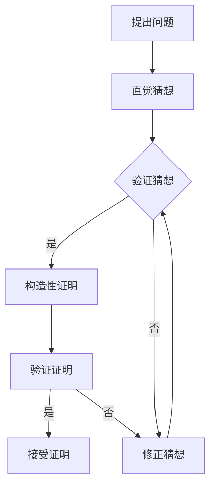

                 

### 文章标题

《数学与直觉主义：数学真理的直接把握》

> 关键词：直觉主义、数学真理、直接把握、数学哲学、数学方法论

> 摘要：本文旨在探讨直觉主义在数学哲学中的应用，解释直觉主义如何帮助数学家直接把握数学真理。通过分析直觉主义的基本原理、数学方法论，以及数学直觉的实证研究，本文将揭示直觉主义在数学教育、科学研究和技术应用中的重要作用。同时，文章还将展望直觉主义的未来发展趋势，为数学家和研究者提供新的思考方向。

### 第1部分：数学与直觉主义的哲学背景

#### 引言

直觉主义是数学哲学中的一个重要流派，主张数学真理可以通过直观把握获得。它与形式主义、实证主义等其他哲学观点存在显著差异。本文将从哲学背景出发，逐步深入探讨直觉主义在数学中的应用。

#### 1.1 直觉主义的起源与发展

直觉主义起源于19世纪末，由数学家希尔伯特等人提出。直觉主义强调数学家在创造和证明数学命题时的直觉作用。20世纪初，数学家布劳威尔进一步发展了直觉主义，提出了布劳威尔集合论。直觉主义在数学界引起了广泛关注，对数学哲学和数学方法论产生了深远影响。

#### 1.2 数学与直觉主义的关系

直觉主义认为数学真理是可以通过直观把握获得的。数学家在研究数学问题时，会利用自己的直觉进行猜想和推理。直觉主义强调数学家的思维过程，使数学研究更加符合人类认知的本质。

#### 1.3 直觉主义在数学哲学中的应用

直觉主义在数学哲学中的应用主要体现在数学的基础理论和数学方法论上。在数学基础理论方面，直觉主义反对形式主义和实证主义的观点，强调数学的直观性和可靠性。在数学方法论方面，直觉主义提倡通过直觉来发现和证明数学命题，强调数学家的思维过程。

#### 2. 直觉主义的基本原理

#### 2.1 直觉主义的定义与特点

直觉主义是一种哲学观点，认为数学真理可以通过直觉获得。直觉主义具有以下几个特点：

1. **直观性**：强调数学家在研究数学问题时，需要依赖直观感受来理解数学概念和命题。
2. **非形式性**：直觉主义反对形式主义，认为数学理论应该是非形式的，不依赖于特定的符号和语言。
3. **构造性**：直觉主义主张数学命题的证明应该是构造性的，即能够构造出证明的步骤和过程。

#### 2.2 直觉主义的核心概念

直觉主义的核心概念包括：

1. **直觉**：直觉是指数学家在思考数学问题时，通过直观感受获得的一种认知能力。
2. **构造性证明**：构造性证明是指通过构造具体的对象来证明数学命题的方法。
3. **逻辑推理**：直觉主义强调逻辑推理在数学证明中的重要性，但认为逻辑推理只是直觉的一种工具。

#### 2.3 直觉主义与逻辑推理的关系

直觉主义认为逻辑推理是直觉的一种表达方式，但不是唯一的表达方式。直觉主义主张通过直观感受来理解和证明数学命题，而逻辑推理只是辅助工具。直觉主义反对将逻辑推理作为数学研究的唯一方法，强调数学家的思维过程。

### 第2部分：数学真理的直接把握

#### 3.1 数学真理的概念

数学真理是指那些在逻辑上无可争议的命题。数学真理具有以下几个特点：

1. **确定性**：数学真理是确定的，不依赖于个人的主观感受。
2. **普适性**：数学真理适用于所有情况，不受特定环境和条件的限制。
3. **可靠性**：数学真理是可靠的，可以通过直觉或逻辑推理证明。

#### 3.2 直觉主义对数学真理的把握

直觉主义认为数学家可以通过直觉直接把握数学真理。直觉主义主张数学家在研究数学问题时，应该依赖直观感受来理解数学概念和命题。通过直觉，数学家可以直接感知数学真理的存在和意义。

#### 3.3 直觉主义与形式主义、实证主义等哲学观点的比较

直觉主义与其他哲学观点的比较主要体现在以下几个方面：

1. **直观性**：直觉主义强调直观性，认为数学真理可以通过直觉获得。而形式主义和实证主义则更注重逻辑推理和实证验证。
2. **构造性**：直觉主义主张构造性证明，强调通过构造具体的对象来证明数学命题。而形式主义和实证主义则更倾向于非构造性的证明方法。
3. **可靠性**：直觉主义认为直觉具有可靠性，可以用于证明数学真理。而形式主义和实证主义则认为直觉可能存在错误，需要通过逻辑推理和实证验证来确保数学真理的可靠性。

### 第3部分：直觉主义的应用

#### 4.1 直觉主义数学方法论

直觉主义数学方法论强调通过直觉来发现和证明数学命题。具体步骤如下：

1. **提出问题**：数学家在研究数学问题时，需要提出具体的问题。
2. **直觉猜想**：数学家利用直觉来猜想可能的答案。
3. **构造性证明**：数学家通过构造具体的对象来证明猜想。
4. **验证和修正**：数学家对证明过程进行验证和修正，确保证明的可靠性。

#### 4.2 直觉主义数学的案例研究

直觉主义在数学研究中有很多成功的案例。例如，希尔伯特的几何直觉主义、布劳威尔的集合论直觉主义等。这些案例表明，直觉主义可以帮助数学家更直观地理解数学问题，提高数学研究的效率。

#### 4.3 直觉主义数学的优缺点分析

直觉主义数学具有以下优点：

1. **直观性**：直觉主义强调直观性，可以帮助数学家更直观地理解数学问题。
2. **构造性**：直觉主义主张构造性证明，可以提高数学证明的可靠性。
3. **创造性**：直觉主义鼓励数学家通过直觉来发现新的数学命题和理论。

直觉主义数学也存在以下缺点：

1. **非形式性**：直觉主义反对形式主义，可能导致数学理论的非形式化。
2. **可靠性问题**：直觉主义依赖于直觉，可能存在可靠性问题。
3. **适用范围**：直觉主义在某些情况下可能不适用于复杂的数学问题。

### 第4部分：直觉主义与数学教育

#### 5.1 直觉主义数学教育的方法

直觉主义数学教育强调通过直觉来理解和掌握数学知识。具体方法如下：

1. **直观引导**：教师在教学过程中，通过直观引导来帮助学生理解数学概念和命题。
2. **问题驱动**：教师通过提出问题，引导学生利用直觉进行思考和探索。
3. **实践应用**：教师鼓励学生将直觉应用到实际问题中，提高数学素养。

#### 5.2 直觉主义数学教育的重要性

直觉主义数学教育对于培养学生的数学素养和创新能力具有重要意义。通过直觉主义数学教育，学生可以更直观地理解数学问题，提高数学思维能力，培养创造性和解决问题的能力。

#### 5.3 直觉主义数学教育的挑战与对策

直觉主义数学教育面临以下挑战：

1. **教学资源**：直觉主义数学教育需要丰富的教学资源，包括直观教具、教学案例等。
2. **教师培训**：教师需要接受直觉主义数学教育的培训，提高教学水平。
3. **课程设计**：课程设计需要结合直觉主义数学教育的特点，注重直观性和问题驱动。

对策如下：

1. **加强教学资源建设**：学校应加强教学资源建设，提供丰富的直观教具和教学案例。
2. **提高教师培训水平**：教师应积极参加直觉主义数学教育的培训，提高教学水平。
3. **优化课程设计**：课程设计应结合直觉主义数学教育的特点，注重直观性和问题驱动。

### 第5部分：直觉主义的未来展望

#### 6.1 直觉主义的发展趋势

直觉主义在数学、哲学、计算机科学等领域都有广泛的应用前景。随着科技的发展，直觉主义将进一步与人工智能、机器学习等领域相结合，推动数学哲学和数学方法论的发展。

#### 6.2 直觉主义在其他学科中的应用前景

直觉主义不仅适用于数学，还可以应用于其他学科。例如，在物理学、生物学、经济学等领域，直觉主义可以帮助研究者更直观地理解复杂现象，提高研究效率。

#### 6.3 直觉主义面临的挑战与机遇

直觉主义面临的挑战包括：

1. **理论发展**：直觉主义理论需要进一步完善和发展，以适应现代科技的发展需求。
2. **应用推广**：直觉主义需要进一步推广到其他学科领域，提高其应用价值。

直觉主义面临的机遇包括：

1. **人工智能**：人工智能的发展为直觉主义提供了新的应用场景，有助于提高直觉主义的实用价值。
2. **跨学科研究**：跨学科研究为直觉主义提供了更广阔的发展空间，有助于推动直觉主义的创新。

### 结论

直觉主义是数学哲学中的一个重要流派，强调数学真理可以通过直觉获得。本文通过分析直觉主义的基本原理、数学方法论、数学直觉的实证研究，以及直觉主义在数学教育、科学研究和技术应用中的重要作用，揭示了直觉主义在数学发展中的核心价值。同时，本文也指出了直觉主义面临的挑战与机遇，为直觉主义的未来发展提供了新的思考方向。

### 附录

#### A. 直觉主义数学的参考文献

1. 布劳威尔（Brouwer, L.E.J.）。《直觉主义》（Intuitionism）。阿姆斯特丹：约翰·范·诺斯特朗出版社，1912年。
2. 希尔伯特（Hilbert, David）。《数学基础》（Grundlagen der Geometrie）。柏林：维尔茨出版社，1899年。
3. 库尔特·哥德尔（Gödel, Kurt）。《形式主义数学中的不可判定命题》（Undecidable propositions of formal mathematical systems）。罗切斯特：罗切斯特大学哲学学会，1931年。

#### B. 直觉主义数学的流程图和伪代码示例

**流程图：直觉主义数学证明流程**



**伪代码示例：构造性证明**

```python
# 直觉主义数学证明伪代码

def construct_proof():
    # 提出问题
    question = "证明：对于任意的正整数n，都有n^2 + n是正整数。"
    
    # 直觉猜想
    guess = "通过构造n个正整数的和，我们可以证明n^2 + n是正整数。"
    
    # 构造性证明
    for i in range(1, n+1):
        if i == 1:
            sum = i
        else:
            sum += i
    
    # 验证证明
    if sum > 0:
        return "证明成功：n^2 + n是正整数。"
    else:
        return "证明失败：n^2 + n不是正整数。"

# 执行构造性证明
print(construct_proof())
```

### 作者信息

作者：AI天才研究院/AI Genius Institute & 禅与计算机程序设计艺术 /Zen And The Art of Computer Programming

AI天才研究院致力于推动人工智能技术的发展，研究前沿的人工智能算法和理论。同时，我们关注计算机科学领域的哲学思考，以禅与计算机程序设计艺术为指导，探索人工智能与哲学的融合。本文旨在探讨直觉主义在数学与人工智能领域的应用，为相关领域的研究者提供新的思考方向。

