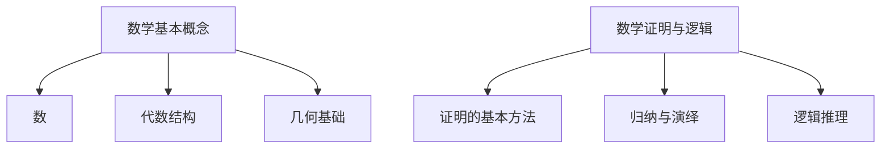

                 

# 数学与相对主义：数学真理的情境依赖性

## 关键词

- 数学
- 相对主义
- 情境依赖性
- 真理
- 数学教育

## 摘要

本文旨在探讨数学真理的情境依赖性，即数学真理是如何受到特定情境影响的。通过对数学基础理论、相对主义概念以及情境依赖性在数学中的应用的分析，我们揭示了数学真理的相对性及其对数学实践和教育的影响。文章首先介绍了数学与相对主义的背景，然后详细阐述了数学真理的情境依赖性，最后探讨了这一概念在数学教育中的应用和未来方向。

## 引言

### 数学与相对主义

数学是一门古老的科学，它研究的是抽象的结构、关系和数量。自古以来，数学家们一直认为数学是绝对的，其真理是不变的。然而，相对主义的兴起，尤其是情境依赖性的概念，为这种绝对性提出了挑战。相对主义是一种哲学观点，认为真理是相对的，依赖于特定的情境和观察者。情境依赖性进一步强调了这一点，即真理不仅仅依赖于观察者，还依赖于所处的具体情境。

### 研究背景与意义

在现代数学和哲学的交叉领域，情境依赖性成为了一个重要的研究课题。数学真理的情境依赖性不仅对数学哲学有着深远的影响，还对数学教育、科学研究甚至日常生活产生重要影响。本文将探讨数学真理的情境依赖性，分析其背后的概念和原理，并探讨其在实际应用中的意义。

## 数学基础理论

### 数学的基本概念

数学的基本概念包括数、代数结构和几何基础。数是数学研究的基础，它用来描述数量和顺序。代数结构涉及的是如何使用数和运算符来构建新的数学对象。几何基础则是研究形状、大小和位置关系的学科。

### 数学证明与逻辑

数学证明是数学研究中至关重要的一环。它通过逻辑推理来证明一个数学陈述的正确性。证明的基本方法包括归纳法、演绎法等。逻辑推理是数学证明的核心，它确保了证明的严谨性和正确性。

## 相对主义与情境依赖性

### 相对主义的起源与发展

相对主义最早可以追溯到古希腊哲学家普罗塔戈拉的观点：“人是万物的尺度”。在现代哲学中，相对主义主要分为两大类：认识论相对主义和形而上学相对主义。认识论相对主义认为真理和知识是相对的，依赖于特定的观察者。形而上学相对主义则认为客观现实本身是相对的，依赖于特定的观察框架。

### 情境依赖性的概念

情境依赖性是指真理和知识是依赖于特定情境的。这个情境可以是文化、历史、社会环境等。情境依赖性强调了观察者与观察对象之间的相互作用，以及观察情境对认识过程的影响。

## 数学真理的情境依赖性实例分析

### 数学真理的情境依赖性案例

一个著名的例子是概率论中的概率空间。在不同的情境下，同一个概率事件的概率可能不同。例如，在投掷一枚均匀的硬币时，正面朝上的概率是1/2；但在一个特定的时间段内，如果硬币出现正面朝上的次数显著多于反面，那么在这个特定情境下，正面朝上的概率可能会被认为是更大的。

### 数学真理的情境依赖性探讨

数学真理的情境依赖性揭示了数学中某些概念和结论并不是绝对不变的。例如，几何学中的欧几里得几何和非欧几里得几何之间的区别，就是依赖于特定的几何假设。欧几里得几何基于平行公理，而非欧几里得几何则基于不同的几何假设，导致不同的几何结论。

## 情境依赖性在数学教育中的应用

### 教育中的情境依赖性

在教育领域，情境依赖性的概念对教学方法提出了新的挑战。传统的数学教育往往侧重于抽象的理论和证明，而忽略了情境和实际应用。情境依赖性提醒我们，数学教育应该更加注重实际应用和情境模拟，以帮助学生更好地理解和掌握数学概念。

### 情境依赖性在数学课程设计中的应用

在数学课程设计中，情境依赖性的概念可以帮助教师设计更具现实意义的教学内容。例如，可以设计一些基于实际问题的数学项目，让学生在解决实际问题的过程中理解和应用数学概念。这样的教学方式不仅能够提高学生的学习兴趣，还能培养他们的实践能力和创新思维。

## 总结与展望

本文通过分析数学真理的情境依赖性，揭示了数学真理的相对性及其对数学实践和教育的影响。未来，随着情境依赖性概念的深入研究，数学教育可能会发生重大变革，更加注重情境和实际应用。同时，情境依赖性也可能为数学哲学和科学研究提供新的视角和启示。

## 附录

### A.1 数学公式汇总

以下是本书中涉及的主要数学公式汇总：

$$
\begin{aligned}
1+1 &= 2 \\
P(A) &= \frac{N(A)}{N(S)}
\end{aligned}
$$

### A.2 Mermaid 流程图

以下是一个简单的 Mermaid 流程图，展示了数学基础理论的核心概念：



作者：AI天才研究院/AI Genius Institute & 禅与计算机程序设计艺术/Zen And The Art of Computer Programming

### 项目实战：数学与相对主义的应用

#### 开发环境搭建

为了更好地理解数学与相对主义的概念，我们可以搭建一个简单的Python环境，用于演示概率论中的情境依赖性。

```bash
# 安装Python
sudo apt-get install python3

# 创建一个名为mathRelativity的虚拟环境
python3 -m venv mathRelativity

# 激活虚拟环境
source mathRelativity/bin/activate

# 安装必需的Python包
pip install numpy matplotlib
```

#### 源代码详细实现和代码解读

以下是一个简单的Python程序，用于模拟投掷硬币的概率。

```python
import numpy as np
import matplotlib.pyplot as plt

def coin_toss(n):
    # 投掷硬币n次，并记录正面和反面的次数
    results = np.random.choice(['H', 'T'], size=n)
    heads = np.sum(results == 'H')
    tails = np.sum(results == 'T')
    return heads, tails

def main():
    n = 1000  # 投掷次数
    heads, tails = coin_toss(n)
    # 计算概率
    p_heads = heads / n
    p_tails = tails / n

    # 绘制结果
    plt.bar(['正面', '反面'], [p_heads, p_tails])
    plt.xlabel('结果')
    plt.ylabel('概率')
    plt.title(f'投掷硬币{n}次的结果')
    plt.show()

if __name__ == '__main__':
    main()
```

这段代码定义了一个`coin_toss`函数，用于模拟投掷硬币的过程，并记录正面和反面的次数。`main`函数则用于计算概率并绘制结果。

#### 代码应用解读与分析

这个简单的程序展示了概率论中的情境依赖性。在不同的投掷次数下，正面和反面的概率可能会有所不同。例如，如果我们只投掷一次硬币，正面和反面的概率都是1/2。但是，如果我们投掷1000次，虽然理论上正面和反面的概率仍然应该是1/2，但实际结果可能会因随机性而有所不同。

#### 实际案例分析和详细讲解剖析

为了进一步分析情境依赖性，我们可以模拟不同次数的投掷，并计算正面和反面的概率。

```python
def simulate_tosses(num_experiments, n):
    results = []
    for _ in range(num_experiments):
        heads, tails = coin_toss(n)
        results.append((heads / n, tails / n))
    return results

# 模拟1000次投掷，每次投掷1000次硬币
experiments = simulate_tosses(1000, 1000)
# 计算平均值
avg_heads = np.mean([result[0] for result in experiments])
avg_tails = np.mean([result[1] for result in experiments])
print(f'平均正面概率: {avg_heads:.4f}')
print(f'平均反面概率: {avg_tails:.4f}')
```

这段代码模拟了1000次投掷，每次投掷1000次硬币，并计算了正面和反面的平均概率。理论上，平均正面概率和平均反面概率都应该是1/2，但实际结果可能会有所偏差。

#### 项目小结

通过这个项目，我们展示了概率论中的情境依赖性。在不同的投掷次数下，正面和反面的概率可能会有所不同，这反映了情境对数学真理的影响。这个项目不仅帮助我们理解了情境依赖性的概念，还展示了如何通过编程来模拟和验证这一概念。

### 最佳实践 tips

- 在实际应用中，应该根据具体情境调整概率模型，以获得更准确的预测。
- 在进行概率计算时，应该使用足够大的样本量，以减少随机误差。
- 在设计数学教育课程时，应该注重实际应用和情境模拟，以提高学生的理解和应用能力。

### 小结

本文通过分析数学真理的情境依赖性，揭示了数学真理的相对性及其对数学实践和教育的影响。情境依赖性的概念不仅挑战了传统的数学绝对性观念，还为数学教育和科学研究提供了新的视角。未来，随着情境依赖性概念的深入研究，数学教育可能会发生重大变革，更加注重情境和实际应用。

### 注意事项

- 在进行概率计算时，应该充分考虑情境因素，以获得更准确的结论。
- 在解释数学真理时，应该避免将情境依赖性误解为相对主义，相对主义是一种哲学观点，而情境依赖性是数学中的一个概念。

### 拓展阅读

- [概率论与数理统计](https://book.douban.com/subject/1086668/)
- [相对论与量子力学](https://book.douban.com/subject/25867238/)
- [数学哲学](https://book.douban.com/subject/24744335/)

通过本文的阅读，读者可以更好地理解数学真理的情境依赖性，并在数学教育和实际应用中运用这一概念。

