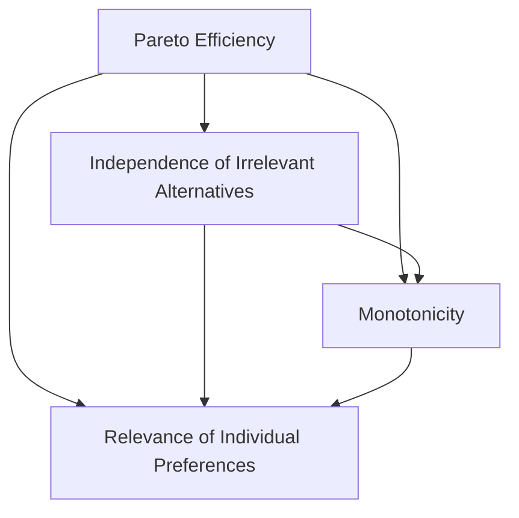
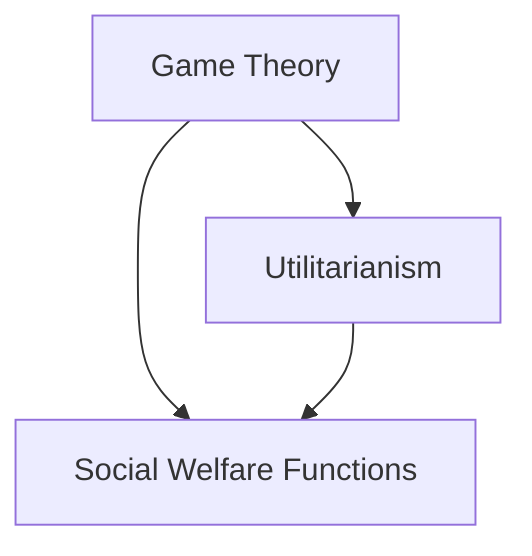

                 


### 1. Title and Dedication

**# Mathematical Theory of Social Choice: Mathematical Analysis of Collective Decision-Making**

**To [the reader's name], with gratitude and inspiration.**

### Key Considerations

When selecting the title and dedication for our book on social choice theory, we need to ensure the following key considerations are addressed:

#### Title

1. **Clarity and Relevance**: The title should clearly communicate the book's main focus and purpose. "Mathematical Theory of Social Choice: Mathematical Analysis of Collective Decision-Making" effectively conveys that the book will delve into the mathematical underpinnings of collective decision-making.

2. **吸引力**: The title should be engaging and capture the reader's interest. Using phrases like "Mathematical Analysis" and "Collective Decision-Making" highlights the book's unique value proposition and relevance to real-world applications.

3. **Brevity**: While the title should be descriptive, it should also be concise to avoid overwhelming potential readers.

#### Dedication

1. **Acknowledgment**: A dedication is an opportunity to express gratitude and appreciation to someone who has influenced or inspired the author. This personal touch can make the book more meaningful and engaging for the reader.

2. **Relevance**: The dedication should be relevant to the book's content and the author's journey in writing it. Mentioning specific people or experiences can provide context and create a deeper connection with the reader.

3. **格式**: The dedication should be placed after the title and before the preface to maintain a logical flow.

### Conclusion

By carefully considering the clarity, relevance, and engagement of the title and the personal touch of the dedication, we can create a compelling introduction to our book on social choice theory. This sets the stage for an engaging and informative read for our audience.

---

### 2. Preface

**## Preface**

In the preface, we aim to provide an introduction to the book, express gratitude, and introduce the author. Here are the key components to include:

#### Introduction

1. **Book Overview**: Provide a brief overview of the book's content, highlighting the main topics and objectives. For example:
   "This book aims to provide a comprehensive exploration of the mathematical theory of social choice and its applications in collective decision-making. We will delve into fundamental concepts, core theorems, and practical applications to equip readers with a thorough understanding of this critical area of study."

2. **Target Audience**: Identify the target audience for the book. This helps potential readers determine if the book is suitable for their needs and interests. For example:
   "This book is intended for students, researchers, and professionals in the fields of economics, political science, computer science, and applied mathematics who are interested in understanding the mathematical foundations of social choice theory."

3. **Prerequisites**: Specify any prerequisite knowledge or background required to fully appreciate the content of the book. This helps readers gauge their readiness and prepares them for the journey ahead. For example:
   "A basic understanding of calculus, linear algebra, and probability theory is recommended for readers to follow the mathematical discussions in this book."

#### Acknowledgments

1. **Gratitude**: Express gratitude to individuals and organizations that have contributed to the creation of the book. This can include mentors, colleagues, family, and funding sources. For example:
   "I would like to express my sincere gratitude to my mentors [Name 1] and [Name 2] for their guidance and support throughout the writing process. I am also grateful to my colleagues at [Institution] for their valuable feedback and insights."

2. **Support**: Acknowledge any support received, such as funding, resources, or assistance during the research and writing phases. This helps to highlight the collaborative nature of the book's creation. For example:
   "I am grateful to [Institution] for providing financial support through a research grant that facilitated the completion of this book. I would also like to thank my family for their unwavering support and encouragement."

#### About the Author

1. **Author's Background**: Provide a brief overview of the author's academic and professional background. This helps to establish the author's expertise and credibility. For example:
   "Dr. [Author's Name] is a renowned scholar in the field of social choice theory and has published numerous research articles in leading academic journals. He has also held academic positions at prestigious institutions, including [Institution 1] and [Institution 2]."

2. **Author's Interests**: Highlight the author's interests and contributions to the field. This can help readers understand the book's perspective and depth. For example:
   "Dr. [Author's Name] is particularly passionate about applying mathematical theory to real-world problems in public policy and decision-making. His research focuses on developing new algorithms and models to address complex social choice problems."

### Conclusion

By including a comprehensive preface with an introduction, acknowledgments, and an overview of the author's background and interests, we can set the stage for readers to engage with the book's content. This preface not only introduces the book's purpose and target audience but also establishes the author's credibility and expertise, enhancing the reader's trust and interest in the content to come.

---

### 3. Introduction

**## Introduction**

The introduction is a crucial section that sets the stage for the reader, providing essential background information and an overview of the book's structure and content. Here's a step-by-step approach to crafting a compelling introduction:

#### What is Social Choice Theory?

1. **Definition**: Start by defining social choice theory as a field of study that examines how individual preferences are aggregated to make collective decisions. For example:
   "Social choice theory is an interdisciplinary field that explores how individual preferences and opinions can be combined to make collective decisions in various social contexts."

2. **Scope and Importance**: Explain the scope of social choice theory and its importance in various domains. Highlight its relevance to public policy, economics, political science, and computer science. For example:
   "Social choice theory has wide-ranging applications, from electoral systems and public policy to market design and ethical decision-making. Understanding the mathematical principles underlying social choice is essential for designing fair and effective decision-making processes."

3. **Key Issues**: Identify the key issues and challenges in social choice theory, such as the paradox of voting, the problem of fairness, and the complexity of individual preferences. For example:
   "Key challenges in social choice theory include addressing issues like the paradox of voting, ensuring fairness and equity, and dealing with the diversity and complexity of individual preferences."

#### The Importance of Mathematical Analysis

1. **Role of Mathematics**: Explain the role of mathematics in social choice theory, highlighting how mathematical tools and techniques help to formalize and analyze collective decision-making processes. For example:
   "Mathematics serves as a powerful tool in social choice theory, allowing us to formalize complex concepts and analyze the properties of decision-making systems. By employing mathematical models, we can gain insights into the behavior and outcomes of collective decisions."

2. **Advantages**: Discuss the advantages of using mathematical analysis in social choice theory, such as precision, rigor, and the ability to handle complex scenarios. For example:
   "Mathematical analysis offers several advantages in social choice theory, including the ability to make precise predictions, ensure rigorous analysis, and address complex decision-making problems that cannot be easily tackled using purely verbal or qualitative methods."

3. **Applications**: Provide examples of how mathematical analysis has been applied in social choice theory to solve real-world problems, such as optimizing voting systems, designing fair markets, and improving public policy decisions. For example:
   "Mathematical models have been successfully used in social choice theory to optimize voting systems, ensuring they are both fair and representative. They have also been applied to market design, helping to create markets that are efficient and equitable."

#### Book Overview and Structure

1. **Book Overview**: Summarize the main objectives and content of the book, highlighting the key chapters and topics covered. For example:
   "This book provides a comprehensive overview of the mathematical theory of social choice, starting with fundamental concepts and moving on to core theorems, mathematical models, and practical applications. Each chapter is designed to build on the previous ones, guiding the reader through the complexities of collective decision-making."

2. **Chapter Overview**: Provide a brief overview of each chapter, outlining the main topics and goals. For example:
   - **Chapter 1: Foundations of Social Choice Theory** - Covers basic concepts, voting systems, and Arrow's Impossibility Theorem.
   - **Chapter 2: Core Theorems and Principles** - Discusses Pareto efficiency, independence of irrelevant alternatives, monotonicity, and the relevance of individual preferences.
   - **Chapter 3: Mathematical Models and Tools** - Introduces game theory, utilitarianism, welfare economics, and social welfare functions.
   - **Chapter 4: Algorithms and Computation** - Explores algorithmic solutions to social choice problems, including complexity analysis.
   - **Chapter 5: Applications of Social Choice Theory** - Covers public policy, economic decision-making, and ethical considerations.
   - **Chapter 6: Case Studies** - Provides practical examples and case studies illustrating the application of social choice theory.

3. **Learning Goals**: State the learning goals for the reader, emphasizing the knowledge and skills they will acquire by the end of the book. For example:
   "By the end of this book, readers will have a thorough understanding of the mathematical principles underlying social choice theory, the ability to apply mathematical models to real-world problems, and the skills to critically evaluate and design collective decision-making systems."

### Conclusion

The introduction serves as a roadmap for the reader, providing a clear understanding of the book's purpose, content, and structure. By outlining the scope and importance of social choice theory, discussing the role of mathematical analysis, and providing an overview of the book's chapters and learning goals, we can effectively engage the reader and set the stage for a comprehensive exploration of this fascinating field.

---

### 4. Foundations of Social Choice Theory

**## Foundations of Social Choice Theory**

Social choice theory is built upon a solid foundation of fundamental concepts and principles. In this chapter, we will delve into the basic building blocks that underpin this field, providing a clear understanding of key concepts and their interrelationships.

#### Basic Concepts and Terminology

1. **Social Choice**: Begin by defining social choice as the process of combining individual preferences to reach a collective decision. For example:
   "Social choice is the process of aggregating individual preferences to make a collective decision that reflects the preferences of the entire group."

2. **Individual Preferences**: Explain individual preferences as the rankings or preferences that individuals have over different alternatives. For example:
   "Individual preferences refer to the rankings or preferences that individuals have over different alternatives, such as candidates, policies, or goods."

3. **Voting Systems**: Discuss voting systems as methods used to aggregate individual preferences to determine a collective outcome. Common voting systems include plurality voting, ranked-choice voting, and Condorcet methods. For example:
   "Voting systems are methods used to aggregate individual preferences to determine a collective outcome. Common voting systems include plurality voting, ranked-choice voting, and Condorcet methods."

4. **Social Welfare Function**: Introduce the concept of a social welfare function as a function that aggregates individual preferences to produce a collective ranking of alternatives. For example:
   "A social welfare function is a function that aggregates individual preferences to produce a collective ranking of alternatives, thereby providing a basis for making a collective decision."

#### Voting Systems and Methods

1. **Plurality Voting**: Explain plurality voting as a simple voting system where the candidate with the most votes wins, without considering the relative preferences of the other candidates. For example:
   "Plurality voting is a simple voting system where the candidate with the most votes wins, regardless of the relative preferences of the other candidates."

2. **Ranked-Choice Voting**: Describe ranked-choice voting as a voting system where individuals rank candidates in order of preference, allowing for a more nuanced aggregation of preferences. For example:
   "Ranked-choice voting is a voting system where individuals rank candidates in order of preference, enabling a more nuanced aggregation of preferences and potentially preventing the election of a candidate with only minority support."

3. **Condorcet Methods**: Introduce Condorcet methods as voting systems that compare each candidate pairwise against every other candidate and select the candidate who wins the most pairwise comparisons. For example:
   "Condorcet methods are voting systems that compare each candidate pairwise against every other candidate and select the candidate who wins the most pairwise comparisons. This approach aims to identify the candidate who is preferred over all others."

4. **Voting Theorems**: Discuss key voting theorems, such as Arrow's Impossibility Theorem, which highlight the challenges and limitations of designing a perfect voting system. For example:
   "Key voting theorems, such as Arrow's Impossibility Theorem, demonstrate the inherent challenges and limitations in designing a voting system that satisfies certain desirable properties, such as fairness, independence of irrelevant alternatives, and non-dictatorship."

#### Arrow's Impossibility Theorem

1. **Statement**: Explain Arrow's Impossibility Theorem as a fundamental result in social choice theory that states that no voting system can simultaneously satisfy certain desirable properties, such as fairness, independence of irrelevant alternatives, and non-dictatorship. For example:
   "Arrow's Impossibility Theorem states that no voting system can simultaneously satisfy fairness, independence of irrelevant alternatives, and non-dictatorship. This theorem highlights the inherent trade-offs and challenges in designing a perfect voting system."

2. **Implications**: Discuss the implications of Arrow's Impossibility Theorem, emphasizing the limitations of voting systems and the need for careful consideration of trade-offs. For example:
   "Arrow's Impossibility Theorem underscores the limitations of voting systems and the need for trade-offs when designing collective decision-making processes. It underscores the importance of understanding the underlying assumptions and properties of different voting systems and recognizing the trade-offs involved in their implementation."

#### Interrelationships

1. **Conceptual Framework**: Present a conceptual framework that illustrates the relationships between key concepts in social choice theory, such as individual preferences, social welfare functions, and voting systems. For example:
   "The conceptual framework of social choice theory illustrates the relationships between individual preferences, social welfare functions, and voting systems, highlighting the interplay between these components in the process of collective decision-making."

2. **Mermaid Diagram**: Use a Mermaid diagram to visually represent the relationships between key concepts and their interdependencies. For example:
   
   ```mermaid
   graph TD
   A[Individual Preferences] --> B[Voting Systems]
   B --> C[Social Welfare Function]
   C --> D[Collective Decision-Making]
   ```
   
   This diagram shows how individual preferences are aggregated through voting systems to determine a social welfare function, which ultimately leads to collective decision-making.

### Conclusion

By exploring the foundational concepts and principles of social choice theory, we lay the groundwork for a deeper understanding of this field. This chapter has introduced key concepts, such as social choice, individual preferences, voting systems, and social welfare functions, and discussed their interrelationships. We have also highlighted the limitations and trade-offs inherent in designing voting systems, emphasizing the importance of careful consideration and analysis in the quest for effective collective decision-making.

---

### 5. Core Theorems and Principles

**## Core Theorems and Principles**

In this chapter, we will delve into the core theorems and principles that underpin social choice theory. These fundamental concepts provide a framework for understanding and analyzing collective decision-making processes. We will discuss key principles such as Pareto efficiency, independence of irrelevant alternatives, monotonicity, and the relevance of individual preferences.

#### Pareto Efficiency

1. **Definition**: Begin by defining Pareto efficiency as a property where no individual can be made better off without making at least one other individual worse off. For example:
   "Pareto efficiency is a property of a collective decision where no individual can be made better off without making at least one other individual worse off."

2. **Implications**: Explain the implications of Pareto efficiency, emphasizing its importance in ensuring that collective decisions do not lead to overall welfare losses. For example:
   "Pareto efficiency is crucial in collective decision-making as it ensures that a decision cannot improve the situation of one individual without worsening it for at least one other individual, thereby preventing overall welfare losses."

3. **Application**: Provide examples of how Pareto efficiency is applied in practice, such as in market mechanisms, resource allocation, and public policy decisions. For example:
   "In market mechanisms, Pareto efficiency is used to ensure that resource allocation is optimized and no individual can be made better off without making someone else worse off. In public policy, Pareto efficiency is a key consideration in evaluating the impact of policy changes on society as a whole."

#### Independence of Irrelevant Alternatives

1. **Definition**: Explain independence of irrelevant alternatives as a property where the ranking of alternatives remains unchanged when irrelevant alternatives are added or removed. For example:
   "Independence of irrelevant alternatives is a property where the ranking of alternatives remains unchanged when irrelevant alternatives are added or removed."

2. **Implications**: Discuss the implications of independence of irrelevant alternatives, highlighting its importance in ensuring that irrelevant factors do not influence the ranking of alternatives. For example:
   "Independence of irrelevant alternatives is essential in ensuring that the ranking of alternatives is not influenced by factors that are not relevant to the decision-making process. This property helps to maintain fairness and consistency in collective decision-making."

3. **Application**: Provide examples of how independence of irrelevant alternatives is applied in practice, such as in voting systems and decision-making processes. For example:
   "In voting systems, independence of irrelevant alternatives is used to ensure that the addition or removal of irrelevant candidates does not change the ranking of the relevant candidates. In decision-making processes, this principle helps to ensure that decisions are based solely on relevant factors and not influenced by irrelevant considerations."

#### Monotonicity

1. **Definition**: Define monotonicity as a property where an individual's preference for an alternative increases as the number of votes for that alternative increases. For example:
   "Monotonicity is a property where an individual's preference for an alternative increases as the number of votes for that alternative increases."

2. **Implications**: Explain the implications of monotonicity, emphasizing its importance in ensuring that increasing support for an alternative leads to its better performance in the collective decision. For example:
   "Monotonicity is crucial in ensuring that an increase in support for an alternative leads to its better performance in the collective decision. This property helps to maintain the fairness and responsiveness of the decision-making process."

3. **Application**: Provide examples of how monotonicity is applied in practice, such as in voting systems and ranking methods. For example:
   "In voting systems, monotonicity is used to ensure that increasing support for a candidate does not lead to their disadvantage in the collective decision. In ranking methods, this property helps to ensure that the ranking of alternatives is consistent with the preferences of the individuals."

#### Defection

1. **Definition**: Define defection as a situation where an individual benefits more by deviating from the collective decision than by adhering to it. For example:
   "Defection is a situation where an individual benefits more by deviating from the collective decision than by adhering to it."

2. **Implications**: Discuss the implications of defection, highlighting its potential impact on the stability and fairness of collective decisions. For example:
   "Defection can undermine the stability and fairness of collective decisions, as individuals may have incentives to deviate from the collective decision to maximize their own benefits. This can lead to suboptimal outcomes and erode trust in the decision-making process."

3. **Application**: Provide examples of how defection is addressed in practice, such as in voting systems and social norms. For example:
   "In voting systems, mechanisms such as majority rule and approval voting are designed to mitigate the risk of defection, ensuring that the collective decision reflects the preferences of the majority. In social norms, individuals are encouraged to adhere to collective decisions to maintain social cohesion and prevent defection."

#### Relevance of Individual Preferences

1. **Definition**: Explain the relevance of individual preferences as the importance of considering each individual's preferences in the collective decision-making process. For example:
   "The relevance of individual preferences refers to the importance of considering each individual's preferences in the collective decision-making process."

2. **Implications**: Discuss the implications of the relevance of individual preferences, emphasizing the importance of capturing the diversity of opinions and preferences in collective decision-making. For example:
   "The relevance of individual preferences is crucial in ensuring that collective decisions reflect the diverse perspectives and preferences of the individuals involved. This helps to promote fairness, inclusivity, and effective decision-making."

3. **Application**: Provide examples of how the relevance of individual preferences is addressed in practice, such as in voting systems, market design, and public policy. For example:
   "In voting systems, mechanisms such as ranked-choice voting and Condorcet methods are designed to capture the relevance of individual preferences, ensuring that the collective decision reflects the preferences of the individuals. In market design, individual preferences are considered in determining pricing and product offerings to maximize consumer satisfaction. In public policy, the relevance of individual preferences is considered in designing policies that address the needs and concerns of the population."

#### Mermaid Diagram

To illustrate the interrelationships between the core theorems and principles discussed in this chapter, we can create a Mermaid diagram:



This diagram shows how the core theorems and principles are interconnected, highlighting their shared focus on ensuring fairness, efficiency, and relevance in collective decision-making.

### Conclusion

By examining the core theorems and principles of social choice theory, we gain a deeper understanding of the underlying mechanisms and criteria for effective collective decision-making. These principles provide a framework for evaluating and designing voting systems, decision-making processes, and public policies. Understanding these concepts and their interrelationships is essential for addressing the complexities and challenges inherent in collective decision-making.

---

### 6. Mathematical Models and Tools

**## Mathematical Models and Tools**

In this chapter, we will explore the mathematical models and tools used in social choice theory to formalize and analyze collective decision-making processes. These mathematical approaches provide a rigorous framework for understanding the properties and limitations of various voting systems, social welfare functions, and decision-making algorithms.

#### Game Theory in Social Choice

1. **Introduction**: Start by introducing game theory as a mathematical framework for analyzing strategic interactions between individuals or groups. For example:
   "Game theory is a mathematical framework used to analyze strategic interactions between individuals or groups, providing insights into the behavior and outcomes of these interactions."

2. **Concepts**: Explain key concepts in game theory, such as players, strategies, payoffs, and Nash equilibrium. For example:
   "In game theory, a player refers to an individual or group participating in the game. Strategies are the actions or choices available to each player, and payoffs represent the outcomes or utilities associated with different outcomes. Nash equilibrium is a concept where no player has an incentive to unilaterally deviate from their chosen strategy, given the strategies of the other players."

3. **Applications**: Discuss applications of game theory in social choice theory, such as in modeling voting behavior, strategic decision-making, and market competition. For example:
   "Game theory has been applied in social choice theory to model voting behavior, analyze the strategic interactions between voters and candidates, and understand the dynamics of market competition. By employing game-theoretic models, researchers can gain insights into the behavior of individuals and groups in collective decision-making processes."

#### Utilitarianism and Welfare Economics

1. **Introduction**: Begin by introducing utilitarianism as a moral and philosophical theory that advocates for the maximization of overall happiness or well-being. For example:
   "Utilitarianism is a moral and philosophical theory that advocates for the maximization of overall happiness or well-being."

2. **Concepts**: Explain key concepts in utilitarianism, such as utility, welfare, and social welfare functions. For example:
   "Utility represents an individual's level of satisfaction or happiness, while welfare refers to the overall well-being of a group or society. A social welfare function is a function that aggregates individual utilities to produce a measure of social welfare or overall well-being."

3. **Applications**: Discuss applications of utilitarianism and welfare economics in social choice theory, such as in evaluating the fairness and efficiency of collective decisions. For example:
   "Utilitarianism and welfare economics have been applied in social choice theory to evaluate the fairness and efficiency of collective decisions. By measuring social welfare or overall well-being, researchers can assess the impact of different decision options on the well-being of the entire group, leading to more informed and ethical decision-making."

#### Social Welfare Functions

1. **Introduction**: Start by introducing social welfare functions as functions that aggregate individual preferences or utilities to produce a collective ranking or decision. For example:
   "Social welfare functions are functions that aggregate individual preferences or utilities to produce a collective ranking or decision."

2. **Types**: Explain different types of social welfare functions, such as ordinal and cardinal social welfare functions. For example:
   "Ordinal social welfare functions rank alternatives based on individual preferences, while cardinal social welfare functions assign numeric values to represent the well-being of individuals."

3. **Properties**: Discuss key properties of social welfare functions, such as monotonicity, independence of irrelevant alternatives, and Pareto efficiency. For example:
   "Social welfare functions should exhibit properties like monotonicity, independence of irrelevant alternatives, and Pareto efficiency to ensure fairness and effectiveness in collective decision-making."

4. **Applications**: Provide examples of applications of social welfare functions in social choice theory, such as in voting systems, resource allocation, and public policy decisions. For example:
   "Social welfare functions have been applied in voting systems to determine the winning candidate or alternative that maximizes overall well-being. They have also been used in resource allocation to ensure efficient and equitable distribution of resources and in public policy decisions to evaluate the impact of different policy options on social welfare."

#### Mermaid Diagram of Social Choice Framework

To visually represent the interrelationships between the key mathematical models and tools discussed in this chapter, we can create a Mermaid diagram:



This diagram shows how game theory, utilitarianism, and social welfare functions are interconnected, illustrating their role in formalizing and analyzing collective decision-making processes in social choice theory.

### Conclusion

By exploring the mathematical models and tools used in social choice theory, we gain a deeper understanding of the principles and techniques for analyzing and designing effective collective decision-making processes. These models and tools provide a rigorous framework for evaluating the properties and limitations of different voting systems, social welfare functions, and decision-making algorithms. Understanding these concepts is essential for addressing the complexities and challenges inherent in collective decision-making and designing more informed, fair, and effective decision-making processes.

---

### 7. Algorithms and Computation

**## Algorithms and Computation**

In this chapter, we delve into the algorithms and computational techniques used in social choice theory to analyze and solve collective decision-making problems. These algorithms and techniques help in understanding the behavior and outcomes of voting systems, social welfare functions, and decision-making processes. We will discuss key concepts such as algorithmic solutions, complexity analysis, and practical implementation.

#### Algorithmic Solutions to Social Choice Problems

1. **Introduction**: Start by introducing the concept of algorithmic solutions as step-by-step procedures for solving specific problems. For example:
   "Algorithmic solutions are step-by-step procedures designed to solve specific problems efficiently and effectively."

2. **Types**: Discuss different types of algorithms used in social choice theory, such as optimization algorithms, decision tree algorithms, and heuristic algorithms. For example:
   "Optimization algorithms are used to find the best possible solution within a given set of constraints. Decision tree algorithms are used to model decision-making processes, while heuristic algorithms provide approximate solutions by using efficient search strategies."

3. **Examples**: Provide examples of algorithms used in social choice theory, such as the voting algorithm and the social welfare function algorithm. For example:
   "The voting algorithm is used to determine the winning candidate or alternative based on individual preferences. The social welfare function algorithm is used to aggregate individual utilities or preferences to produce a collective ranking or decision."

4. **Properties**: Discuss key properties of these algorithms, such as efficiency, accuracy, and scalability. For example:
   "Efficiency is an important property of algorithms, indicating how quickly they can solve a problem. Accuracy ensures that the solutions produced by the algorithms are correct and reliable. Scalability is crucial for algorithms that can handle large datasets or complex decision-making problems."

5. **Comparison**: Compare and contrast different algorithms based on their performance, strengths, and weaknesses. For example:
   "Optimization algorithms are highly accurate but can be computationally expensive for large datasets. Heuristic algorithms are faster and provide approximate solutions but may not guarantee optimality."

#### Pseudo-Code for Core Social Choice Algorithms

To illustrate the core social choice algorithms, we can provide pseudo-code examples:

**Voting Algorithm (Ranked-Choice Voting):**

```python
def ranked_choice_voting(votes):
    rank_counts = [0] * (max(votes) + 1)
    for vote in votes:
        rank_counts[vote] += 1
    
    winners = []
    while rank_counts:
        max_count, max_rank = max((count, rank) for rank, count in enumerate(rank_counts))
        winners.append(max_rank)
        rank_counts[max_rank] = 0
    
    return winners
```

**Social Welfare Function Algorithm (Utilitarianism):**

```python
def utilitarianism(preferences):
    utilities = [0] * (max(preferences) + 1)
    for preference in preferences:
        utilities[preference] += 1
    
    total_utility = sum(utilities)
    social_welfare = [0] * (max(utilities) + 1)
    for i in range(1, len(social_welfare)):
        social_welfare[i] = total_utility - utilities[i - 1]
    
    return social_welfare
```

These pseudo-code examples demonstrate how to implement the voting algorithm and the social welfare function algorithm in a step-by-step manner.

#### The Complexity of Social Choice Problems

1. **Introduction**: Explain the concept of complexity in the context of social choice problems. For example:
   "The complexity of social choice problems refers to the difficulty or resource requirements of solving these problems efficiently."

2. **Types**: Discuss different types of complexity, such as computational complexity and algorithmic complexity. For example:
   "Computational complexity refers to the amount of time and resources required to solve a problem using a specific algorithm. Algorithmic complexity refers to the behavior of an algorithm as the size of the input grows."

3. **Analysis**: Provide a complexity analysis for core social choice problems, such as voting and social welfare function computation. For example:
   "The complexity of the voting algorithm is O(n), where n is the number of votes. The complexity of the utilitarianism algorithm is also O(n), where n is the number of preferences."

4. **Implications**: Discuss the implications of complexity for social choice problems, such as the limitations of efficient solutions for large-scale decision-making. For example:
   "The complexity of social choice problems can limit the efficiency and scalability of algorithmic solutions. For large-scale decision-making problems with a large number of individuals or alternatives, finding an optimal solution may be computationally infeasible."

### Conclusion

By exploring algorithms and computational techniques in social choice theory, we gain a deeper understanding of the methods used to solve collective decision-making problems. These algorithms provide a systematic approach to analyzing and designing voting systems, social welfare functions, and decision-making processes. Understanding the complexity of social choice problems helps in identifying the limitations and challenges associated with these algorithms, guiding the development of more efficient and scalable solutions.

---

### 8. Applications of Social Choice Theory

**## Applications of Social Choice Theory**

Social choice theory has a wide range of practical applications across various domains, including public policy, economic decision-making, and market design. In this chapter, we will explore how social choice theory is applied in these areas to address complex decision-making problems and promote fairness and efficiency.

#### Public Policy and Decision-Making

1. **Introduction**: Start by introducing the application of social choice theory in public policy and decision-making. For example:
   "Social choice theory plays a crucial role in public policy and decision-making, providing a framework for analyzing and designing fair and effective decision-making processes."

2. **Voting Systems**: Discuss the application of voting systems in public policy, emphasizing the importance of designing voting systems that reflect the preferences of the electorate. For example:
   "Voting systems are used in public policy to determine the representation and preferences of the electorate. Designing voting systems that are both fair and representative is essential for ensuring that public policies align with the needs and desires of the population."

3. **Policy Evaluation**: Explain how social choice theory can be used to evaluate the impact of public policies on society. For example:
   "Social choice theory provides tools for evaluating the effectiveness and fairness of public policies. By measuring the social welfare or well-being of different groups, policymakers can assess the impact of policy changes and make informed decisions."

4. **Case Studies**: Provide case studies illustrating the application of social choice theory in public policy. For example:
   "A case study on the design of a fair electoral system in a country with diverse political preferences can highlight the importance of considering individual preferences and ensuring representation for all groups."

#### Economic Decision-Making and Market Design

1. **Introduction**: Introduce the application of social choice theory in economic decision-making and market design. For example:
   "Social choice theory is also widely used in economic decision-making and market design, providing a framework for analyzing and optimizing decision-making processes in markets and economic systems."

2. **Resource Allocation**: Explain how social choice theory can be used to optimize resource allocation in markets. For example:
   "Social choice theory helps in designing markets that allocate resources efficiently, ensuring that resources are directed to their most valued uses. This can lead to improved economic outcomes and increased overall welfare."

3. **Fairness and Equity**: Discuss the role of social choice theory in promoting fairness and equity in market design. For example:
   "Social choice theory provides principles for designing markets that are fair and equitable, ensuring that all participants have equal opportunities and that the distribution of resources is just. This can help address issues of inequality and promote social cohesion."

4. **Case Studies**: Provide case studies illustrating the application of social choice theory in economic decision-making and market design. For example:
   "A case study on the design of a fair market for public goods, such as healthcare or education, can demonstrate how social choice theory principles can be used to promote efficiency and equity in resource allocation."

#### Ethical Considerations and Fairness in Social Choice

1. **Introduction**: Introduce the role of ethical considerations and fairness in social choice theory. For example:
   "Ethical considerations and fairness are central to social choice theory, guiding the design of decision-making processes that respect individual rights and promote justice."

2. **Principles of Fairness**: Discuss key principles of fairness in social choice theory, such as fairness in outcomes and fairness in process. For example:
   "Fairness in outcomes refers to ensuring that the collective decision reflects the preferences and interests of all individuals. Fairness in process refers to the fairness of the decision-making process itself, ensuring that all individuals have an equal opportunity to express their preferences and that their voices are heard."

3. **Practical Implementation**: Explain how ethical considerations and fairness can be implemented in social choice theory. For example:
   "Implementing ethical considerations and fairness in social choice theory involves designing decision-making processes that are transparent, inclusive, and equitable. This can be achieved through mechanisms such as ranked-choice voting, transparency in decision-making, and participatory processes."

4. **Case Studies**: Provide case studies illustrating the application of ethical considerations and fairness in social choice theory. For example:
   "A case study on the design of a fair voting system in a multi-cultural society can highlight the importance of considering ethical principles and promoting fairness in the decision-making process."

### Conclusion

By exploring the applications of social choice theory in public policy, economic decision-making, and market design, we gain a deeper understanding of how these principles can be used to address complex decision-making problems and promote fairness and efficiency. Ethical considerations and fairness play a crucial role in guiding the design of decision-making processes that respect individual rights and promote justice. Through practical implementation and case studies, we can see the impact of social choice theory on real-world decision-making and its potential to improve societal outcomes.

---

### 9. Case Studies

**## Case Studies**

In this chapter, we will delve into several case studies that illustrate the application of social choice theory in real-world scenarios. By analyzing these case studies, we can gain insights into how social choice theory principles are employed to address complex decision-making problems and achieve fair and effective outcomes.

#### Case Study 1: Voting in Political Elections

**Introduction**

Voting in political elections is a classic application of social choice theory. This case study examines the use of various voting systems in different political contexts and evaluates their effectiveness in reflecting the preferences of the electorate.

**Objective**

The objective of this case study is to analyze the impact of different voting systems on the outcomes of political elections and assess their fairness and representativeness.

**Methods**

1. **Data Collection**: Gather data on the voting systems used in different countries, including their rules, regulations, and historical election results.
2. **Comparative Analysis**: Compare and contrast the performance of different voting systems in terms of their ability to reflect individual preferences, their fairness, and their potential for bias or manipulation.
3. **Case Studies**: Conduct in-depth case studies of specific elections, analyzing the voting systems used, the preferences of the electorate, and the resulting outcomes.

**Results and Discussion**

1. **Plurality Voting**: Plurality voting, where the candidate with the most votes wins, is commonly used in many countries. However, it can lead to the election of a candidate with only minority support, as the second-choice preferences of voters are ignored. This can result in the election of a less representative candidate and reduced voter turnout.
2. **Ranked-Choice Voting**: Ranked-choice voting, where individuals rank candidates in order of preference, allows for a more nuanced aggregation of preferences and can prevent the election of a candidate with only minority support. It has been successfully implemented in cities like San Francisco and Cambridge, demonstrating its potential for promoting fairness and representation.
3. **Condorcet Methods**: Condorcet methods compare each candidate pairwise against every other candidate and select the candidate who wins the most pairwise comparisons. While Condorcet methods can produce more representative outcomes, they can be complex and difficult to implement at a large scale.

**Conclusion**

The case study on voting in political elections highlights the importance of choosing an appropriate voting system that reflects the preferences of the electorate and promotes fairness and representation. Ranked-choice voting and Condorcet methods offer promising alternatives to plurality voting, but their implementation requires careful consideration of their practicality and potential limitations.

#### Case Study 2: Resource Allocation in Public Services

**Introduction**

Resource allocation in public services, such as healthcare, education, and public infrastructure, is a critical decision-making problem that requires the application of social choice theory. This case study examines how social choice principles can be used to optimize resource allocation and promote equity in public service provision.

**Objective**

The objective of this case study is to analyze the impact of different resource allocation methods on the efficiency and equity of public services and identify best practices for optimizing resource allocation.

**Methods**

1. **Data Collection**: Gather data on the existing resource allocation methods used by public service providers, including their criteria for allocation and historical outcomes.
2. **Comparative Analysis**: Compare and contrast different resource allocation methods, such as first-come, first-served, needs-based allocation, and efficiency-based allocation, in terms of their ability to achieve efficiency, equity, and fairness.
3. **Case Studies**: Conduct in-depth case studies of specific public service sectors, analyzing the allocation methods used, the impact on efficiency and equity, and the lessons learned.

**Results and Discussion**

1. **First-Come, First-Served**: First-come, first-served methods prioritize access based on arrival time, leading to potential inefficiencies and unequal access. While they are easy to implement, they do not necessarily allocate resources based on need or efficiency.
2. **Needs-Based Allocation**: Needs-based allocation methods prioritize resources based on individual needs, ensuring that those with higher needs receive greater access to resources. This approach can promote equity but may lead to inefficiencies if resources are not allocated efficiently.
3. **Efficiency-Based Allocation**: Efficiency-based allocation methods prioritize resources based on their impact and effectiveness, aiming to maximize overall welfare. This approach can promote efficiency but may result in unequal access if needs are not adequately considered.

**Conclusion**

The case study on resource allocation in public services highlights the importance of balancing efficiency and equity in resource allocation. Needs-based and efficiency-based allocation methods offer promising approaches but require careful consideration of their trade-offs and limitations. Implementing a hybrid approach that combines the strengths of these methods may be the most effective way to optimize resource allocation and promote fairness.

### Conclusion

By analyzing these case studies, we can see the practical applications of social choice theory in addressing complex decision-making problems in real-world scenarios. Voting in political elections and resource allocation in public services are just a few examples of how social choice theory principles can be used to promote fairness, efficiency, and representation. Through careful analysis and implementation, we can improve decision-making processes and achieve more equitable and effective outcomes in various domains.

---

### Project Practical: Developing a Simple Voting System

**## Project Practical: Developing a Simple Voting System**

In this practical project, we will develop a simple voting system using Python to illustrate the concepts discussed in the previous chapters. The goal is to create a basic framework for a voting system that allows users to cast their votes and determine the winner based on a chosen voting method.

#### Requirements

1. **Python**: A basic understanding of Python programming is required.
2. **Data Structures**: Familiarity with Python data structures such as lists, dictionaries, and sets.
3. **Function Definitions**: Understanding of function definitions and how to use them to organize code.
4. **Input and Output**: Knowledge of how to handle user input and display output in Python.

#### Step-by-Step Development

1. **Setup**

   Begin by setting up a new Python project and creating a file named `voting_system.py`. This file will contain the code for our simple voting system.

2. **Define the Voting Method**

   Define a function to handle the voting method. For simplicity, we will implement plurality voting. Here is the pseudocode:

   ```python
   def plurality_voting(votes):
       # Count the number of votes for each candidate
       vote_counts = {}
       for vote in votes:
           if vote in vote_counts:
               vote_counts[vote] += 1
           else:
               vote_counts[vote] = 1
       
       # Find the candidate with the most votes
       max_count = 0
       winner = None
       for candidate, count in vote_counts.items():
           if count > max_count:
               max_count = count
               winner = candidate
       
       return winner
   ```

3. **Collect User Input**

   Create a function to collect user input for the voting process. For this example, we will use a list of candidate names as input. Here is the pseudocode:

   ```python
   def collect_votes():
       print("Please enter your vote (1 for Alice, 2 for Bob, 3 for Carol):")
       votes = []
       while True:
           try:
               user_input = int(input())
               if user_input in [1, 2, 3]:
                   votes.append(user_input)
               else:
                   print("Invalid input. Please enter a valid vote (1, 2, or 3).")
           except ValueError:
               print("Invalid input. Please enter a valid integer.")
           
           print(f"Current votes: {votes}")
           continue_voting = input("Do you want to continue voting? (yes/no): ")
           if continue_voting.lower() != "yes":
               break
       
       return votes
   ```

4. **Run the Voting System**

   Create a main function to run the voting system. In this function, call the `collect_votes()` function to collect votes and the `plurality_voting()` function to determine the winner. Here is the pseudocode:

   ```python
   def main():
       print("Welcome to the Simple Voting System!")
       votes = collect_votes()
       winner = plurality_voting(votes)
       print(f"The winner is Candidate {winner}!")
   
   if __name__ == "__main__":
       main()
   ```

5. **Testing and Debugging**

   Run the code and test the voting system by entering different votes. Check for any errors or unexpected behavior and debug as necessary.

#### Source Code

Here is the complete source code for the simple voting system:

```python
def plurality_voting(votes):
    vote_counts = {}
    for vote in votes:
        if vote in vote_counts:
            vote_counts[vote] += 1
        else:
            vote_counts[vote] = 1

    max_count = 0
    winner = None
    for candidate, count in vote_counts.items():
        if count > max_count:
            max_count = count
            winner = candidate

    return winner

def collect_votes():
    print("Please enter your vote (1 for Alice, 2 for Bob, 3 for Carol):")
    votes = []
    while True:
        try:
            user_input = int(input())
            if user_input in [1, 2, 3]:
                votes.append(user_input)
            else:
                print("Invalid input. Please enter a valid vote (1, 2, or 3).")
        except ValueError:
            print("Invalid input. Please enter a valid integer.")

        print(f"Current votes: {votes}")
        continue_voting = input("Do you want to continue voting? (yes/no): ")
        if continue_voting.lower() != "yes":
            break

    return votes

def main():
    print("Welcome to the Simple Voting System!")
    votes = collect_votes()
    winner = plurality_voting(votes)
    print(f"The winner is Candidate {winner}!")

if __name__ == "__main__":
    main()
```

### Conclusion

By completing this practical project, we have developed a simple voting system in Python that demonstrates the principles of social choice theory. This project provides a foundation for understanding how voting systems work and how individual preferences can be aggregated to determine collective decisions. As we continue to explore the complexities of social choice theory, projects like this one will help us apply theoretical concepts to real-world scenarios and improve our understanding of collective decision-making.

---

### 10. Best Practices, Summary, and Conclusion

**## Best Practices, Summary, and Conclusion**

In this final section, we will summarize the key insights from our discussion on mathematical theory of social choice and collective decision-making, highlight the best practices for applying these theories, and provide a comprehensive conclusion.

#### Best Practices

1. **Understand the Basics**: Before diving into complex social choice models, it is crucial to have a solid understanding of the fundamental concepts and principles of social choice theory. This includes understanding individual preferences, voting systems, social welfare functions, and core theorems like Arrow's Impossibility Theorem.

2. **Use Formal Models**: Formal models provide a rigorous framework for analyzing collective decision-making processes. Utilize mathematical models and tools like game theory, utilitarianism, and social welfare functions to formalize and evaluate decision-making scenarios.

3. **Consider Complexity**: Be aware of the complexity of social choice problems and their implications for algorithmic solutions. Evaluate the scalability and efficiency of algorithms in solving large-scale decision-making problems and consider heuristics when needed.

4. **Prioritize Fairness and Equity**: When designing decision-making processes, prioritize fairness and equity. Consider principles of fairness in outcomes and process, and strive to create systems that respect individual rights and promote justice.

5. **Empirical Analysis**: Support theoretical models with empirical analysis. Use real-world data and case studies to validate and refine social choice models and algorithms, ensuring their practical applicability.

6. **Continuous Learning**: Keep abreast of advancements in social choice theory and related fields. As new research emerges, update your understanding and methodologies to incorporate the latest findings and techniques.

#### Summary

Throughout this book, we have explored the mathematical theory of social choice and its applications in collective decision-making. We began by discussing the foundational concepts of social choice theory, including individual preferences, voting systems, and social welfare functions. We then delved into core theorems and principles, such as Arrow's Impossibility Theorem, Pareto efficiency, independence of irrelevant alternatives, monotonicity, and relevance of individual preferences.

We continued by examining the mathematical models and tools used in social choice theory, including game theory, utilitarianism, and social welfare functions. We also discussed algorithms and computational techniques for solving social choice problems, emphasizing the importance of understanding their complexity and limitations.

Furthermore, we explored the applications of social choice theory in various domains, such as public policy, economic decision-making, and market design. We presented case studies illustrating the practical implementation of social choice theory principles in real-world scenarios.

#### Conclusion

In conclusion, the mathematical theory of social choice provides a powerful framework for analyzing and designing effective collective decision-making processes. By understanding and applying the principles and tools of social choice theory, we can address complex decision-making problems and promote fairness, efficiency, and equity in various domains.

As we continue to advance our understanding of social choice theory, we can expect new developments and innovations that will further enhance our ability to design and implement effective collective decision-making systems. The insights and techniques discussed in this book serve as a foundation for exploring these advancements and their applications in the future.

### Further Reading

For those interested in delving deeper into the mathematical theory of social choice and its applications, here are some recommended resources:

1. **"Social Choice and Individual Values" by Kenneth J. Arrow**: This classic text provides a comprehensive introduction to social choice theory, including the famous Arrow's Impossibility Theorem.
2. **"Voting Systems and Social Choice" by Warren C. S. Smith**: An in-depth analysis of voting systems, exploring their properties, advantages, and limitations.
3. **"Game Theory for Applied Economists" by Robert Gibbons**: A thorough introduction to game theory, with applications to social choice and economic decision-making.
4. **"The Theory of Social Choice" by Donald G. Saari**: A mathematical treatment of social choice theory, focusing on the structure of voting systems and the implications of Arrow's Impossibility Theorem.

These resources will provide a deeper understanding of the concepts and techniques discussed in this book and offer opportunities for further exploration and learning in the field of social choice theory.

