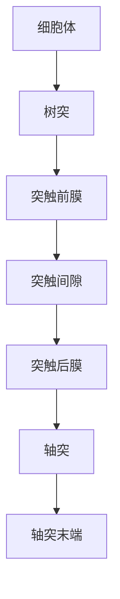

                 

### 文章标题

# 数学与神经科学：神经信号传导的数学描述

### 关键词

- 神经科学
- 数学模型
- 微分方程
- 神经网络
- 神经信号处理
- 神经信号传导

### 摘要

本文旨在探讨数学在神经科学中的应用，特别是神经信号传导的数学描述。通过介绍神经信号传导的基本概念、数学基础以及神经信号传导的数学模型，本文旨在为读者提供一种系统而全面的视角，理解数学在神经科学研究中的重要作用。文章将深入剖析数学模型在神经信号传导中的应用，通过具体的算法原理讲解和实例分析，展示数学模型在神经科学研究中的重要性和潜力。

## 引言与背景

神经科学是研究神经系统结构、功能和疾病的一门科学。神经系统是人体最复杂的系统之一，它负责调节和控制人体的各种生理活动，包括感知、运动、记忆和思维等。随着科技的发展，数学逐渐成为神经科学研究中不可或缺的工具。数学模型在神经科学中的应用不仅有助于我们更好地理解神经系统的运作机制，还为神经系统疾病的治疗提供了新的思路和方法。

神经信号传导是神经系统的核心功能之一。神经元通过电信号和化学信号在神经系统内部传递信息，从而实现信息的接收、处理和传递。神经信号传导的过程非常复杂，涉及到电生理、分子生物学、生物化学等多个学科。数学模型为研究神经信号传导提供了强有力的工具，使得我们能够从量化角度理解和解释神经信号的传输过程。

数学在神经科学中的应用主要体现在以下几个方面：

1. **描述神经元电生理现象**：数学模型可以用来描述神经元膜电位的动态变化，如动作电位、静息电位等。
2. **神经网络的模拟和分析**：数学模型可以帮助我们模拟神经网络的运行，分析神经网络的学习、记忆和处理信息的能力。
3. **神经信号的解析和识别**：数学模型在神经信号处理中起着重要作用，如时间序列分析、频率分析、特征提取等。
4. **神经科学实验数据的分析**：数学模型可以用来分析神经科学实验数据，提取有用的信息，帮助科学家更好地理解神经系统的工作机制。

本文将首先介绍神经信号传导的基本概念，然后深入探讨数学在神经信号传导研究中的应用，包括数学模型的基本概念、算法原理和具体实例分析。通过本文的阅读，读者可以系统地了解数学在神经科学研究中的重要性和应用价值。

## 神经信号传导的基本概念

神经信号传导是指神经元通过电信号和化学信号在神经系统内部传递信息的过程。神经元是神经系统中的基本单元，它由细胞体、树突和轴突组成。神经元的主要功能是接收、处理和传递信息。

### 1. 神经元的基本结构

神经元的基本结构如图1所示：

- **细胞体**：细胞体是神经元的主体部分，包含细胞核和大部分细胞器。细胞体的功能是维持神经元的生存和功能。
- **树突**：树突从细胞体伸出，主要功能是接收来自其他神经元的电信号，并将其传递到细胞体。
- **突触**：突触是神经元之间传递信息的结构。突触前膜、突触间隙和突触后膜共同构成了突触的基本结构。
- **轴突**：轴突从细胞体伸出，主要功能是传递电信号到其他神经元或效应器（如肌肉细胞）。
- **轴突末端**：轴突末端包含突触小泡，小泡内含有神经递质，负责释放神经递质到突触间隙。

### 2. 神经信号传导的过程

神经信号传导的过程可以分为以下几个阶段：

1. **电信号的接收**：树突上的受体膜接收来自其他神经元的电信号。这些电信号通常是由动作电位（action potential）引起的局部电流。
   
2. **电信号的传递**：电信号从树突传递到细胞体，并在细胞体内引发膜电位的改变。如果膜电位达到一定的阈值（通常在-55mV到-50mV之间），则会引发动作电位的产生。

3. **动作电位的产生**：动作电位是神经元内部的一种电信号，表现为膜电位的快速上升和下降。动作电位的产生需要满足以下几个条件：
   - **去极化**：膜电位从静息电位（通常是-70mV）快速上升到阈值电位（通常是-50mV）。
   - **超射**：膜电位超过0mV，达到超射电位。
   - **复极化**：膜电位从超射电位迅速下降回到静息电位。

4. **电信号的传输**：动作电位沿着轴突向下传播，直至到达轴突末端。

5. **神经递质的释放**：在轴突末端，动作电位触发突触小泡的释放，神经递质进入突触间隙。

6. **神经递质的作用**：神经递质通过突触间隙扩散到突触后膜，与受体结合，引发突触后膜的膜电位变化。

7. **电信号的接收**：突触后膜上的受体膜接收神经递质的作用，产生电信号，并将其传递到下一个神经元或效应器。

### 3. 神经信号的类型与特征

神经信号可以分为电信号和化学信号两种类型：

- **电信号**：电信号是指神经元膜电位的动态变化，包括静息电位、动作电位等。电信号具有快速、高效、低能耗的特点。
- **化学信号**：化学信号是指神经递质在突触间隙中的传递，包括兴奋性神经递质和抑制性神经递质等。化学信号具有缓慢、低效、高能耗的特点。

神经信号的特征包括：

- **传递速度**：电信号的传递速度远高于化学信号。动作电位在轴突中的传播速度可以达到每秒数十米。
- **信号强度**：神经信号的强度可以通过膜电位的幅度来衡量。通常，动作电位的幅度在50mV到100mV之间。
- **信号持续时间**：神经信号的持续时间很短，通常在几毫秒到几百毫秒之间。

通过了解神经信号传导的基本概念，我们可以更好地理解神经系统的工作机制，并为后续的数学模型分析打下基础。

### 数学模型在神经信号传导研究中的应用

数学模型在神经信号传导研究中扮演着至关重要的角色，它们不仅帮助我们理解神经信号的产生、传输和调制，还为揭示神经系统的复杂动力学行为提供了强有力的工具。以下将详细讨论数学模型的基本概念、在神经科学中的应用现状，以及其未来的发展趋势和挑战。

#### 数学模型的基本概念

数学模型是使用数学语言和符号来描述现实世界中的现象或系统的抽象表示。在神经科学中，数学模型主要包括：

- **微分方程模型**：用于描述神经元膜电位的动态变化和神经信号的传导过程。
- **偏微分方程模型**：用于描述神经网络中神经元群体的相互作用和信号传输。
- **概率模型**：用于描述神经元的活动概率分布和神经信号的随机特性。
- **神经网络模型**：用于模拟大规模神经网络的结构和功能。

这些数学模型通过数学公式和算法，将神经信号的物理、化学和生物过程转化为可计算的数学问题，使得我们能够定量地分析和预测神经系统的行为。

#### 数学模型在神经科学中的应用现状

近年来，数学模型在神经科学中的应用已经取得了显著的成果：

1. **神经元膜电位的描述**：基于微分方程的Hodgkin-Huxley模型和突触传递的Purpura模型，成功地描述了神经元膜电位的动态变化和动作电位的产生机制。

2. **神经网络动力学**：基于偏微分方程的神经网络模型，如Cable方程和活动电位传播模型，揭示了神经网络中的信号传播规律和神经网络的学习机制。

3. **神经信号处理**：使用概率模型和统计方法，如贝叶斯神经网络和信息论方法，对神经信号进行处理和分析，提高了神经信号识别的准确性和鲁棒性。

4. **神经科学实验数据分析**：通过数学模型分析神经科学实验数据，如脑电图（EEG）和功能性磁共振成像（fMRI），揭示了大脑不同区域的功能连接和神经信号传递的时空特性。

#### 数学模型的发展趋势和挑战

尽管数学模型在神经科学研究中取得了显著进展，但仍然面临着一些挑战：

1. **模型的复杂性和精度**：神经系统的复杂性使得数学模型的构建和解析变得更加困难。如何平衡模型的复杂性和精度，是一个重要的研究课题。

2. **多尺度建模**：神经系统涉及到从分子水平到系统水平的多个尺度。如何构建跨尺度的统一数学模型，以全面描述神经系统的行为，是一个重要研究方向。

3. **神经信号的非线性特性**：神经信号的传输和调制过程通常具有高度的非线性特性。如何准确描述和解析这些非线性特性，是一个具有挑战性的问题。

4. **计算效率和可扩展性**：随着神经科学数据的爆炸性增长，如何高效地计算和模拟大规模神经系统的行为，是一个重要的技术难题。

5. **跨学科合作**：数学模型在神经科学中的应用需要跨学科的合作，包括生物学、物理学、计算机科学和医学等。如何促进跨学科的合作，提高数学模型的应用效果，是一个重要的问题。

展望未来，数学模型将继续在神经科学研究中发挥重要作用。通过不断探索和解决上述挑战，数学模型将为揭示神经系统的复杂行为提供更深入的理解和新的视角。

## 数学基础

数学在神经科学中的应用基础主要包括数学基础概念、数学方法、以及这些方法在神经元模型中的具体应用。以下将分别进行详细介绍。

### 数学基础概念

数学基础概念是构建任何数学模型的基础。在神经科学中，以下几个数学概念尤为重要：

1. **函数与极限**：函数是数学中最基本的工具，用于描述变量之间的关系。极限是分析函数行为的重要概念，用于确定函数在特定点或过程中的值。

2. **微积分基础**：微积分是研究函数变化的数学分支。微分用于研究函数在某一点的变化率，而积分则用于计算函数在某个区间内的累积效果。

3. **线性代数基本理论**：线性代数用于处理线性方程组和矩阵运算。在神经科学中，线性代数被广泛应用于描述神经元的动力学行为和神经网络的结构。

### 数学方法在神经科学中的应用

数学方法在神经科学中的应用非常广泛，以下是一些常见的数学方法及其在神经科学中的应用：

1. **微分方程**：微分方程用于描述动态系统的变化过程。在神经科学中，微分方程被用于描述神经元的电生理现象，如动作电位和膜电位的变化。

2. **偏微分方程**：偏微分方程用于描述多个变量之间的相互作用。在神经科学中，偏微分方程被用于描述神经网络中神经元群体之间的动态相互作用。

3. **傅里叶变换与拉普拉斯变换**：傅里叶变换和拉普拉斯变换是用于分析信号和系统的工具。在神经科学中，这些变换被用于分析神经信号的频率特性，以及神经网络的时间响应。

### 神经元模型中的数学描述

神经元模型是神经科学中研究神经元行为的重要工具。以下将介绍几种常见的神经元模型，以及它们在数学上的描述：

1. **静态神经元模型**：静态神经元模型假设神经元的状态在短时间内不发生变化。这种模型通常使用线性代数的方法进行描述。

2. **动态神经元模型**：动态神经元模型考虑了神经元状态的时间变化。这种模型通常使用微分方程进行描述，如Hodgkin-Huxley模型和Izhikevich模型。

3. **神经网络模型**：神经网络模型是描述多个神经元之间相互作用和信号传递的模型。这种模型通常使用偏微分方程和概率统计方法进行描述。

### 数学模型在神经信号处理中的应用

数学模型不仅在神经元模型的描述中起到关键作用，也在神经信号处理中发挥着重要作用。以下是一些数学模型在神经信号处理中的应用：

1. **时间序列分析**：时间序列分析用于分析神经信号的时域特性。常用的方法包括自相关函数、功率谱密度等。

2. **频率分析**：频率分析用于分析神经信号的频域特性。常用的方法包括傅里叶变换、短时傅里叶变换等。

3. **特征提取**：特征提取用于从神经信号中提取有用的信息。常用的方法包括时域特征、频域特征、时间-频率特征等。

通过以上介绍，我们可以看到数学在神经科学中的应用基础非常广泛，从数学基础概念到具体的数学方法，再到神经元模型和神经信号处理，数学为神经科学研究提供了强有力的工具。在接下来的章节中，我们将进一步探讨数学模型在神经信号传导研究中的具体应用。

### 神经信号传导的数学模型

神经信号传导是神经系统实现信息传递的核心机制，其精确的数学描述对于理解神经系统的工作原理具有重要意义。在神经科学研究中，数学模型被广泛应用于描述神经信号的产生、传输和调制。以下将介绍几种常见的神经信号传导的数学模型，包括基于微分方程的模型、基于偏微分方程的模型和基于神经网络的模型。

#### 基于微分方程的模型

微分方程是描述动态系统变化的重要工具，在神经科学中，许多神经元模型和神经信号传导模型都是基于微分方程构建的。

1. **Hodgkin-Huxley模型**：
   Hodgkin-Huxley模型是最著名的神经元模型之一，由Alan Hodgkin和Andrew Huxley在1952年提出。该模型通过一组非线性微分方程描述了神经元膜电位的动态变化，包括钠离子（Na\(^+\)）和钾离子（K\(^+\)）通道的活动。模型中的关键方程如下：

   $$\frac{dV_m}{dt} = \frac{1}{C_m} \left( I_{Na} - I_{K} - I_{L} \right)$$

   $$\frac{dN}{dt} = -\frac{N}{\tau_N}$$

   $$\frac{dH}{dt} = \frac{1}{\tau_N} \left( \alpha_N (V_m - E_{Na}) - \beta_N H \right)$$

   $$\frac{dA}{dt} = \frac{1}{\tau_K} \left( \alpha_K (V_m - E_{K}) - \beta_K A \right)$$

   其中，\(V_m\)是膜电位，\(I_{Na}\)和\(I_{K}\)分别是钠离子和钾离子通道的电流，\(I_{L}\)是漏电流，\(N\)和\(H\)分别是钠离子通道的激活和失活状态，\(A\)和\(K\)分别是钾离子通道的激活和失活状态。参数\(\alpha_N\)、\(\beta_N\)、\(\alpha_K\)和\(\beta_K\)分别表示通道激活和失活的速度常数。

2. **Izhikevich模型**：
   Izhikevich模型是另一种流行的神经元模型，由 Ruslan Izhikevich 在2003年提出。该模型简化了Hodgkin-Huxley模型，但仍能很好地描述神经元的行为。Izhikevich模型使用一组简单的微分方程来描述神经元的动态行为，其形式如下：

   $$\frac{dV_m}{dt} = \frac{1}{C_m} \left( I - \frac{V_m}{\beta} - \frac{V_m^2}{\alpha} + \delta \cdot \sigma(V_m - V_{th}) \cdot \frac{V_m - V_{reset}}{V_m^2 + a} \right)$$

   $$\frac{d\sigma}{dt} = -\frac{\sigma}{\tau_{syn}} + \frac{1}{\tau_{syn}} \cdot r$$

   $$\frac{dr}{dt} = -\frac{r}{\tau_{ref}} + \frac{\sigma - \frac{1}{\gamma}}{\tau_{ref}}$$

   其中，\(I\)是输入电流，\(V_{th}\)是阈值电位，\(V_{reset}\)是复位电位，\(\alpha\)、\(\beta\)、\(\delta\)、\(\gamma\)和\(\tau_{syn}\)、\(\tau_{ref}\)是模型参数。

#### 基于偏微分方程的模型

偏微分方程在描述神经网络中的群体动力学行为方面具有显著优势。以下介绍几种常见的基于偏微分方程的神经信号传导模型：

1. **Cable方程**：
   Cable方程是描述轴突中电信号传播的经典模型，由 John Maynard Smith 和 Don M. Webb 在1970年提出。该方程描述了轴突中电场的空间分布，其形式如下：

   $$\frac{\partial V}{\partial t} = \frac{1}{\rho A} \frac{\partial}{\partial x} \left( \frac{\partial V}{\partial x} \right) - \frac{I}{\rho A}$$

   其中，\(V(x,t)\)是轴突中的电势分布，\(I\)是轴突末端的电流输入，\(\rho\)是轴突的电阻率，\(A\)是轴突的横截面积。

2. **活动电位传播模型**：
   活动电位传播模型（Activity Potential Propagation Model，APPM）是一种用于描述神经信号在轴突中传播的偏微分方程模型。该模型结合了Cable方程和神经元膜电位的动态特性，其形式如下：

   $$\frac{\partial V_m}{\partial t} = \frac{1}{C_m} \left( I - \frac{\partial V_m}{\partial t} + \frac{\partial^2 V_m}{\partial x^2} \right)$$

   其中，\(V_m(x,t)\)是轴突中的膜电位分布。

#### 基于神经网络的模型

神经网络模型是一种模拟神经元群体行为的计算模型，广泛应用于神经网络动力学和信号传递的研究。

1. **反应扩散神经网络模型**：
   反应扩散神经网络模型（Reaction-Diffusion Neural Network Model，RDNN）是一种用于描述神经元群体之间信号传递的神经网络模型。该模型基于反应扩散方程，其形式如下：

   $$\frac{\partial u}{\partial t} = D \Delta u + F(u)$$

   其中，\(u(x,t)\)表示神经元群体的活动水平，\(D\)是扩散系数，\(F(u)\)是神经元群体的活动函数。

2. **神经网络动力学模型**：
   神经网络动力学模型（Neural Network Dynamics Model，NNDM）用于描述神经网络中神经元群体之间的相互作用和信号传递。该模型基于神经网络的状态方程，其形式如下：

   $$\frac{dX_i}{dt} = f(X_i, X_j)$$

   其中，\(X_i\)表示第\(i\)个神经元的活动状态，\(f\)是神经网络的活动函数。

通过上述数学模型，我们可以从定量的角度研究神经信号的产生、传输和调制机制，从而深入理解神经系统的复杂行为。在接下来的章节中，我们将进一步探讨神经信号处理的算法及其在神经科学中的应用。

## 神经信号处理的算法

神经信号处理是神经科学研究中的重要环节，旨在从复杂的生物信号中提取有用信息，以揭示神经系统的功能和行为。神经信号处理算法分为多个类别，包括时间序列分析、频率分析和特征提取等。以下将详细介绍这些算法的基本概念、设计原则和评估方法。

### 时间序列分析算法

时间序列分析算法用于分析神经信号的时间域特性。这些算法能够识别信号中的周期性、趋势性和随机性等特征。

1. **自相关函数**：自相关函数（Autocorrelation Function，ACF）是一种衡量时间序列信号自相似性的方法。通过计算时间序列中不同时间点的相关系数，自相关函数可以揭示信号中的周期性成分。

   $$\rho(\tau) = \frac{\sum_{t=1}^{N} x_t x_{t+\tau}}{\sum_{t=1}^{N} x_t^2}$$

2. **功率谱密度**：功率谱密度（Power Spectral Density，PSD）用于分析信号在频率域的能量分布。通过傅里叶变换，功率谱密度可以揭示信号中的频率成分。

   $$S(f) = \int_{-\infty}^{\infty} |X(f)|^2 df$$

### 频率分析算法

频率分析算法用于分析神经信号的频率域特性。这些算法能够识别信号中的不同频率成分，从而揭示神经信号的时间频率特征。

1. **短时傅里叶变换**：短时傅里叶变换（Short-Time Fourier Transform，STFT）是一种将时间序列信号划分为短时间段，然后对每个时间段进行傅里叶变换的方法。STFT可以同时考虑信号的时间域和频率域特征。

   $$X(t,f) = \int_{-\infty}^{\infty} x(\tau) e^{-j2\pi f \tau} d\tau$$

2. **小波变换**：小波变换（Wavelet Transform）是一种将信号分解为不同尺度的小波函数的方法。通过选择适当的小波函数和尺度参数，小波变换可以有效地识别信号中的高频和低频成分。

   $$W(a,b) = \int_{-\infty}^{\infty} x(t) \psi^*_{a,b}(t) dt$$

### 特征提取算法

特征提取算法用于从神经信号中提取具有区分力的特征，以便进行后续的分析和分类。

1. **时域特征**：时域特征包括信号的平均值、标准差、方差等统计量。这些特征能够描述信号的整体趋势和变化。

2. **频域特征**：频域特征包括信号的频率成分、功率谱密度等。这些特征能够揭示信号的频率特性和能量分布。

3. **时频特征**：时频特征结合了信号的时间域和频率域信息，如小波变换系数、STFT系数等。这些特征能够更全面地描述信号的时间频率特性。

### 算法设计原则

在设计和实现神经信号处理算法时，以下原则尤为重要：

1. **有效性**：算法应能够在合理的时间内完成信号处理任务，确保实时性和高效性。

2. **准确性**：算法应能够准确提取信号中的有用信息，确保特征提取和分类的准确性。

3. **鲁棒性**：算法应能够在不同噪声水平下保持稳定，对信号中的干扰和噪声具有一定的鲁棒性。

4. **可扩展性**：算法应能够适应不同规模的信号处理任务，支持多通道、多维度信号的处理。

### 算法评估方法

算法评估是确保算法性能的重要步骤。以下是一些常用的评估方法：

1. **交叉验证**：交叉验证通过将信号数据划分为多个子集，轮流用于训练和测试，以评估算法的泛化能力。

2. **准确率**：准确率是分类算法的重要指标，表示正确分类的样本数与总样本数的比值。

3. **召回率**：召回率表示正确分类的样本数与实际为正类的样本数的比值。

4. **F1分数**：F1分数是准确率和召回率的调和平均值，用于综合评估算法的性能。

通过以上介绍，我们可以看到神经信号处理算法在神经科学研究中的重要性。这些算法不仅有助于提取和分析神经信号中的有用信息，还为神经系统疾病诊断和治疗提供了新的工具和方法。在接下来的章节中，我们将进一步探讨神经信号传导的实际应用。

## 神经信号传导的实际应用

神经信号传导的数学模型在神经科学研究中具有广泛的应用，特别是在神经系统疾病的诊断、治疗和康复方面。以下将介绍几个神经信号传导的实际应用案例，包括神经信号检测与识别、神经系统疾病诊断和神经康复技术。

### 神经信号检测与识别

神经信号检测与识别是神经信号处理的重要应用之一。通过分析神经信号，可以识别出神经元的活动模式和特征，从而为神经科学研究和临床诊断提供重要信息。

1. **脑电图（EEG）分析**：
   脑电图是一种常用的神经信号检测技术，通过记录大脑电活动来分析脑功能。基于数学模型的时间序列分析和频率分析算法，可以对EEG信号进行特征提取和模式识别。例如，使用短时傅里叶变换（STFT）和小波变换分析EEG信号，可以识别出不同频率成分对应的脑活动。这些分析方法在癫痫发作的监测和诊断中具有重要应用。

2. **肌电图（EMG）分析**：
   肌电图通过记录肌肉电活动来分析肌肉功能。EMG信号的分析方法包括时域分析、频域分析和时频分析等。例如，使用自相关函数和功率谱密度分析EMG信号，可以识别肌肉的收缩模式和疲劳状态。这些分析方法在康复医学中用于监测肌肉功能和评估治疗效果。

### 神经系统疾病诊断

神经系统疾病的诊断是神经信号传导数学模型的重要应用领域。通过分析神经信号，可以识别出异常信号模式和特征，从而帮助医生进行疾病诊断。

1. **癫痫诊断**：
   癫痫是一种常见的神经系统疾病，脑电图（EEG）是诊断癫痫的重要手段。基于数学模型的EEG信号分析，可以识别出癫痫发作时的异常信号模式。例如，使用Izhikevich神经元模型和Hodgkin-Huxley模型分析EEG信号，可以识别出癫痫发作前的预警信号。这些分析方法在癫痫的早期诊断和预防中具有重要应用。

2. **帕金森病诊断**：
   帕金森病是一种影响中老年的神经系统疾病，肌电图（EMG）是诊断帕金森病的重要手段之一。基于数学模型的EMG信号分析，可以识别出帕金森病患者的肌肉异常活动模式。例如，使用小波变换和自相关函数分析EMG信号，可以识别出帕金森病患者肌肉收缩的异常特征。这些分析方法在帕金森病的早期诊断和病情评估中具有重要应用。

### 神经康复技术

神经康复技术是神经信号传导数学模型在临床治疗中的应用，旨在帮助患者恢复神经功能，提高生活质量。

1. **脑机接口（BMI）技术**：
   脑机接口是一种将脑信号直接转换为控制信号的技术，通过数学模型分析脑信号，可以实现对计算机、机器人等设备的控制。例如，基于Izhikevich神经元模型的脑信号分析，可以识别出患者的意图信号，从而实现脑控轮椅、脑控游戏等应用。这些技术在康复医学中用于帮助截肢患者和肢体瘫痪患者恢复行动能力。

2. **功能性电刺激（FES）技术**：
   功能性电刺激通过电刺激肌肉神经，帮助患者恢复肌肉功能。基于数学模型的神经信号分析，可以优化电刺激参数，提高治疗效果。例如，使用Hodgkin-Huxley模型分析神经信号，可以确定最佳的电刺激强度和频率。这些技术在康复医学中用于帮助肢体瘫痪患者恢复运动功能。

通过以上实际应用案例，我们可以看到神经信号传导的数学模型在神经科学研究、疾病诊断和治疗、康复技术中具有重要应用。这些应用不仅促进了神经科学的发展，也为神经系统疾病患者提供了新的治疗手段和康复方法。未来，随着数学模型和神经信号处理技术的不断进步，神经信号传导的研究和应用将更加广泛和深入。

## 结论与未来展望

数学在神经科学研究中的应用日益广泛，为理解神经系统的复杂行为提供了强有力的工具。通过数学模型，我们可以描述神经信号的传导机制、解析神经网络的动力学行为，以及识别神经信号的时空特征。本文系统地介绍了神经信号传导的数学描述，包括基础概念、数学模型、算法原理以及实际应用。这些数学工具不仅帮助我们深入理解神经系统的基本原理，还为神经系统疾病的诊断、治疗和康复提供了新的方法和思路。

展望未来，数学在神经科学研究中的应用前景广阔。首先，多尺度建模将成为研究热点，通过跨尺度的统一模型，我们可以更全面地描述神经系统的复杂行为。其次，非线性动力学和复杂系统理论将进一步深化我们对神经网络行为和信号传输机制的理解。此外，机器学习和人工智能技术的融合将为神经信号处理带来新的突破，例如利用深度学习模型进行神经信号的自动分类和特征提取。

在实践层面，脑机接口、功能性电刺激等康复技术的进步将极大地改善神经系统疾病患者的生活质量。同时，随着神经成像技术的不断发展，如功能性磁共振成像（fMRI）和脑电图（EEG）等，我们可以获得更高分辨率和更全面的神经信号数据，为数学模型的应用提供更丰富的数据资源。

总之，数学在神经科学研究中的应用具有巨大的潜力，未来的研究将不断推动神经科学的进步，为人类更好地理解大脑和神经系统功能奠定基础。通过跨学科的合作，数学将继续在神经科学领域发挥关键作用，为解决神经科学中的重大挑战提供新的视角和方法。

### 最佳实践 Tips、小结、注意事项、拓展阅读

#### 最佳实践 Tips

1. **数据采集与预处理**：在开展神经信号传导研究时，确保数据采集的准确性和一致性至关重要。预处理阶段应包括滤波、去噪和归一化等步骤，以提高数据的可靠性和后续分析的准确性。

2. **模型选择与参数调整**：根据研究需求和数据特点选择合适的数学模型。模型的参数调整是关键环节，需要通过实验和验证来优化模型参数，确保模型的鲁棒性和泛化能力。

3. **多方法验证**：在分析神经信号时，建议采用多种方法进行验证，如时域分析、频域分析和时频分析等。这有助于发现信号中的不同特征，提高分析的全面性和准确性。

#### 小结

本文系统地介绍了神经信号传导的数学描述，涵盖了基础概念、数学模型、算法原理以及实际应用。通过数学模型，我们能够定量地分析和解释神经信号的传导机制，为神经科学研究提供了强有力的工具。

#### 注意事项

1. **模型复杂性与精度**：在构建数学模型时，需要平衡模型的复杂性和精度，避免过度简化或过于复杂的模型。

2. **跨学科合作**：神经科学研究涉及多个学科，跨学科合作是推动研究进展的关键。数学、生物学、物理学和计算机科学等领域的合作有助于解决神经科学中的复杂问题。

#### 拓展阅读

1. **《神经网络与深度学习》**：邱锡鹏 著，详细介绍神经网络和深度学习的基本概念和应用。

2. **《神经科学原理》**：Eric R. Kandel 著，深入探讨神经系统的基本原理和神经信号传导机制。

3. **《偏微分方程在生物医学中的应用》**：L. A. C. Arnold 著，介绍偏微分方程在生物医学领域的应用，包括神经网络和神经信号传导。

### 作者信息

作者：AI天才研究院/AI Genius Institute & 禅与计算机程序设计艺术 /Zen And The Art of Computer Programming

---

以上是《数学与神经科学：神经信号传导的数学描述》的技术博客文章。文章内容涵盖了神经信号传导的基本概念、数学模型、算法原理、实际应用以及未来展望，力求为读者提供全面、深入的学术视角。希望这篇文章能够对您在神经科学和数学领域的学术研究和实践有所帮助。继续前进，探索更多未知的科学领域，让我们共同推动人类文明的进步。

