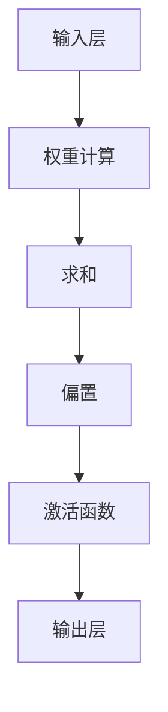

                 


### 引言：数学与神经网络的交汇

随着人工智能技术的迅猛发展，神经网络作为一种重要的机器学习模型，已经成为许多应用领域的关键技术。从早期的感知机模型到现今的深度学习网络，神经网络的发展离不开数学理论的支撑。数学与神经网络的交汇，不仅为神经网络的理论研究提供了强有力的工具，同时也推动了神经网络在实际应用中的广泛应用。

本文旨在探讨数学与神经网络之间的关系，特别是人工神经元的数学描述。我们将通过以下步骤进行分析：

1. **背景介绍**：首先，我们将简要回顾神经网络的发展历程，并介绍神经网络的基本概念和主要类型。
2. **核心概念与联系**：接下来，我们将深入探讨人工神经元的工作原理，并使用Mermaid流程图展示其与数学理论之间的联系。
3. **核心算法原理讲解**：我们将使用伪代码详细阐述人工神经元的激活函数、前向传播和反向传播算法。
4. **数学模型和公式讲解**：我们将使用LaTeX格式介绍神经网络中的基本数学公式，并对其进行详细讲解和举例说明。
5. **项目实战**：我们将展示一个实际案例，详细讲解神经网络的应用过程，包括环境搭建、源代码实现、代码解读和应用分析。
6. **最佳实践与注意事项**：最后，我们将总结本文的内容，并提供一些最佳实践和注意事项。

通过以上步骤，我们希望能够系统地阐述数学与神经网络之间的关系，帮助读者更好地理解和应用神经网络技术。

### 背景介绍：神经网络的发展历程

神经网络作为人工智能领域的一个重要分支，其发展历程可以追溯到20世纪40年代。最早期的神经网络模型是由心理学家弗兰克·罗森布拉特（Frank Rosenblatt）在1957年提出的感知机（Perceptron）模型。感知机是一种二分类线性分类器，它的出现标志着神经网络研究的开端。

随着时间的推移，神经网络在20世纪60年代和70年代经历了一段低潮期。主要原因是当时人们对神经网络的功能和能力存在误解，认为它只能解决线性可分问题，无法处理非线性问题。然而，随着1986年深度学习先驱杰弗里·辛顿（Geoffrey Hinton）等人提出的反向传播算法（Backpropagation Algorithm），神经网络重新焕发生机。

反向传播算法是一种通过梯度下降法训练神经网络的算法。它允许神经网络学习复杂的非线性关系，从而在图像识别、语音识别、自然语言处理等领域取得了显著的成果。这一突破性进展，使得神经网络成为机器学习领域的重要工具之一。

进入21世纪，随着计算能力的提高和大数据技术的兴起，神经网络的研究和应用得到了飞速发展。深度学习（Deep Learning）作为一种基于多层神经网络的模型，成为了当前人工智能领域的热点。深度学习模型包括卷积神经网络（CNN）、循环神经网络（RNN）、长短时记忆网络（LSTM）等，它们在图像识别、语音识别、自然语言处理等领域取得了卓越的性能。

神经网络的基本概念主要包括：

1. **神经元**：神经网络的构建单元，类似于生物神经系统中的神经元。
2. **层**：神经网络由输入层、隐藏层和输出层组成。每一层包含多个神经元。
3. **权重**：神经元之间的连接关系通过权重表示，这些权重可以通过学习过程进行优化。
4. **偏置**：偏置是神经网络中的一个重要参数，用于调整神经元的阈值。
5. **激活函数**：激活函数用于引入非线性关系，使神经网络能够学习复杂的特征。

总之，神经网络作为一种强大的机器学习模型，其发展历程和基本概念为我们理解和应用神经网络技术提供了重要的背景知识。在下一节中，我们将深入探讨人工神经元的工作原理，并使用Mermaid流程图展示其与数学理论之间的联系。

#### 核心概念与联系：人工神经元的工作原理

人工神经元是神经网络的基本构建单元，其工作原理基于生物神经元的灵感。生物神经元通过树突接收来自其他神经元的信号，经过轴突传递，最终到达突触，释放神经递质以传递信息。在人工神经元中，这种过程可以通过数学模型来描述。

首先，让我们使用Mermaid流程图来展示人工神经元的基本结构：



在这个流程图中，我们可以看到人工神经元的核心操作：

1. **输入层**：接收外部输入信号，例如图像的像素值或文本的特征向量。
2. **权重计算**：将输入信号与相应的权重相乘，权重表示神经元之间的连接强度。
3. **求和**：对所有输入信号与权重相乘的结果进行求和。
4. **偏置**：偏置是一个常量，用于调整神经元的阈值，影响神经元是否被激活。
5. **激活函数**：将求和结果通过激活函数进行处理，激活函数可以引入非线性关系，使神经网络能够学习复杂的特征。
6. **输出层**：输出层的激活值作为神经元的输出，可以用于分类、预测或其他任务。

现在，我们详细探讨人工神经元的工作原理和与数学理论的联系：

1. **权重和偏置**：在数学上，人工神经元的权重和偏置可以表示为向量。权重向量表示为\( \mathbf{w} \)，偏置为\( b \)。输入信号可以表示为\( \mathbf{x} \)。

    \[
    z = \mathbf{w} \cdot \mathbf{x} + b
    \]

    其中，\( \cdot \)表示向量点积。

2. **激活函数**：激活函数是一个关键的非线性函数，它可以将线性组合的输入转化为非线性的输出。常见的激活函数包括Sigmoid函数、ReLU函数和Tanh函数。

    - **Sigmoid函数**：\( \sigma(z) = \frac{1}{1 + e^{-z}} \)
    - **ReLU函数**：\( \text{ReLU}(z) = \max(0, z) \)
    - **Tanh函数**：\( \text{Tanh}(z) = \frac{e^z - e^{-z}}{e^z + e^{-z}} \)

    这些函数引入了非线性，使神经网络能够学习复杂的非线性关系。

3. **前向传播**：在前向传播过程中，人工神经元接收输入信号，计算权重与输入的乘积，加上偏置，并通过激活函数进行处理。这个过程可以用以下伪代码表示：

    ```python
    for each neuron in hidden_layer:
        z = sum(w * x) + b
        a = activation_function(z)
    ```

4. **反向传播**：反向传播是训练神经网络的核心算法，它通过计算损失函数的梯度来更新权重和偏置。反向传播的伪代码如下：

    ```python
    for each layer in reverse:
        for each neuron in layer:
            delta = (expected_output - actual_output) * activation_function_derivative(a)
            gradients = delta * x
            weights += gradients
            bias += delta
    ```

通过上述讨论，我们可以看到人工神经元的工作原理与数学理论密切相关。数学不仅为神经网络提供了理论基础，还通过算法和公式实现了神经网络的训练和优化。在下一节中，我们将使用伪代码详细阐述人工神经元的激活函数、前向传播和反向传播算法。

#### 核心算法原理讲解：激活函数、前向传播和反向传播

在理解了人工神经元的基本工作原理后，我们需要详细探讨其核心算法，即激活函数、前向传播和反向传播。这些算法是神经网络训练和优化的基础。

##### 1. 激活函数

激活函数是神经网络中的一个关键组件，它引入了非线性关系，使神经网络能够学习复杂的特征。常见的激活函数包括Sigmoid函数、ReLU函数和Tanh函数。

- **Sigmoid函数**：
    \[
    \sigma(z) = \frac{1}{1 + e^{-z}}
    \]
    Sigmoid函数的输出范围在0到1之间，非常适合用于二分类问题。

- **ReLU函数**：
    \[
    \text{ReLU}(z) = \max(0, z)
    \]
    ReLU函数在正数部分是线性的，而在负数部分则被裁剪为0，这种设计使得ReLU函数在训练过程中计算速度快且不易陷入梯度消失问题。

- **Tanh函数**：
    \[
    \text{Tanh}(z) = \frac{e^z - e^{-z}}{e^z + e^{-z}}
    \]
    Tanh函数的输出范围在-1到1之间，与Sigmoid函数类似，但相比Sigmoid函数，Tanh函数在输入较大时更平滑。

激活函数的选择会影响神经网络的性能和训练速度。在实际应用中，ReLU函数由于其优越的性能，已成为隐藏层神经元的常用激活函数。

##### 2. 前向传播

前向传播是神经网络计算输出值的过程。在每一层，神经元接收来自前一层神经元的输入，通过权重与偏置进行计算，并应用激活函数。

伪代码如下：

```python
# 前向传播伪代码
for each layer in network:
    for each neuron in layer:
        z = sum(w * x) + b  # z为输入层到当前神经元的权重乘以输入，再加上偏置
        a = activation_function(z)  # 应用激活函数
        output = a  # 当前神经元的输出
```

具体例子：

假设我们有输入层\( x_1, x_2 \)，隐藏层有一个神经元，输出层有一个神经元。权重和偏置分别为\( w_1, w_2, b_1, b_2 \)。

- 隐藏层神经元计算：
    \[
    z_h = w_1 \cdot x_1 + w_2 \cdot x_2 + b_1
    \]
    \[
    a_h = \text{ReLU}(z_h)
    \]

- 输出层神经元计算：
    \[
    z_o = w_3 \cdot a_h + w_4 \cdot x_1 + w_5 \cdot x_2 + b_2
    \]
    \[
    a_o = \text{Sigmoid}(z_o)
    \]

##### 3. 反向传播

反向传播是神经网络训练过程中的关键步骤，它通过计算损失函数的梯度来更新权重和偏置。反向传播分为两个阶段：首先计算输出层的梯度，然后反向传播到隐藏层。

伪代码如下：

```python
# 反向传播伪代码
for each layer in reverse:
    for each neuron in layer:
        if layer is output_layer:
            delta = (expected_output - actual_output) * activation_function_derivative(a)
        else:
            delta = (delta * weights) * activation_function_derivative(a)
        gradients = delta * x
        weights += gradients
        bias += delta
```

具体例子：

假设输出层的预期输出为\( y_e \)，实际输出为\( y_a \)，激活函数为Sigmoid函数。

- 输出层梯度计算：
    \[
    delta = (y_e - y_a) * \text{Sigmoid'(z_o)}
    \]

- 隐藏层梯度计算：
    \[
    delta = (delta \cdot w_3) * \text{ReLU'(z_h)}
    \]

通过反向传播，神经网络可以根据损失函数的梯度调整权重和偏置，以优化网络性能。

以上讨论了人工神经元的激活函数、前向传播和反向传播算法，这些算法构成了神经网络训练和优化的基础。在下一节中，我们将介绍神经网络的数学模型和公式，并对其进行详细讲解。

### 神经网络的数学模型和公式

神经网络的数学模型是理解神经网络工作原理的核心，它通过一系列的公式和算法描述了神经网络如何从输入数据学习并产生输出。以下我们将详细介绍神经网络中的基本数学公式，包括损失函数、梯度计算、反向传播等。

#### 1. 损失函数

损失函数是神经网络训练过程中用于衡量预测结果与实际结果之间差异的函数。常见的损失函数有均方误差（MSE）和交叉熵损失（Cross-Entropy Loss）。

- **均方误差（MSE）**：

    \[
    J(\theta) = \frac{1}{m} \sum_{i=1}^{m} (\hat{y}_i - y_i)^2
    \]

    其中，\( \hat{y}_i \)是神经网络的预测输出，\( y_i \)是实际输出，\( m \)是样本数量。

- **交叉熵损失（Cross-Entropy Loss）**：

    \[
    J(\theta) = -\frac{1}{m} \sum_{i=1}^{m} \sum_{k=1}^{K} y_k \log(\hat{y}_k)
    \]

    其中，\( K \)是输出类别数，\( y_k \)是实际输出中第\( k \)类别的概率，\( \hat{y}_k \)是网络预测中第\( k \)类别的概率。

损失函数用于计算神经网络输出与实际输出之间的误差，它是反向传播算法中计算梯度的重要依据。

#### 2. 梯度计算

梯度是损失函数对网络参数（权重和偏置）的导数，用于指导参数的更新方向。以下是梯度计算的公式：

- **MSE损失的梯度**：

    \[
    \frac{\partial J}{\partial \theta_{ij}} = 2 \cdot (y_i - \hat{y}_i) \cdot x_j
    \]

    其中，\( \theta_{ij} \)是输入层到隐藏层的权重，\( x_j \)是输入特征。

- **交叉熵损失的梯度**：

    \[
    \frac{\partial J}{\partial \theta_{ik}} = -\frac{1}{\hat{y}_k} \cdot (y_k - \hat{y}_k)
    \]

    其中，\( \theta_{ik} \)是隐藏层到输出层的权重，\( \hat{y}_k \)是输出层的预测概率。

梯度计算是神经网络训练中至关重要的一环，它决定了参数更新的方向和幅度。

#### 3. 反向传播算法

反向传播算法通过计算损失函数对网络参数的梯度，并反向传播这些梯度到前一层，从而实现参数的更新。以下是反向传播算法的伪代码：

```python
# 反向传播伪代码
for each layer in reverse:
    for each neuron in layer:
        if layer is output_layer:
            delta = (expected_output - actual_output) * activation_function_derivative(a)
        else:
            delta = (delta * weights) * activation_function_derivative(a)
        gradients = delta * x
        weights += gradients
        bias += delta
```

具体步骤如下：

1. **计算输出层梯度**：输出层的梯度由损失函数直接计算得到。
2. **计算隐藏层梯度**：隐藏层的梯度通过输出层梯度反向传播得到。
3. **更新权重和偏置**：根据梯度更新网络参数。

通过反向传播算法，神经网络可以根据损失函数的梯度不断优化参数，提高模型的预测准确性。

总之，神经网络的数学模型和公式为神经网络的工作原理提供了坚实的理论基础。在下一节中，我们将通过一个实际案例展示如何实现神经网络并进行分析。

#### 实际案例：神经网络的应用与实现

为了更好地理解神经网络的理论和实践，我们将通过一个实际案例展示神经网络在图像识别任务中的实现过程。本案例将使用Python编程语言和TensorFlow库进行实现，详细步骤包括开发环境的搭建、源代码的编写、代码解读和应用分析。

##### 1. 开发环境搭建

首先，我们需要搭建一个适合神经网络开发的Python环境。以下是所需的步骤：

- **安装Python**：确保Python版本为3.6或更高。
- **安装TensorFlow**：使用pip命令安装TensorFlow库：
  ```
  pip install tensorflow
  ```

- **安装其他依赖库**：例如NumPy、Pandas等：
  ```
  pip install numpy pandas
  ```

##### 2. 源代码实现

接下来，我们将使用TensorFlow实现一个简单的卷积神经网络（CNN）来识别手写数字（MNIST）数据集。

```python
import tensorflow as tf
from tensorflow.keras import layers
from tensorflow.keras.datasets import mnist
import numpy as np

# 加载MNIST数据集
(x_train, y_train), (x_test, y_test) = mnist.load_data()

# 预处理数据
x_train = x_train.astype("float32") / 255.0
x_test = x_test.astype("float32") / 255.0
y_train = tf.keras.utils.to_categorical(y_train, 10)
y_test = tf.keras.utils.to_categorical(y_test, 10)

# 构建CNN模型
model = tf.keras.Sequential([
    layers.Conv2D(32, (3, 3), activation='relu', input_shape=(28, 28, 1)),
    layers.MaxPooling2D((2, 2)),
    layers.Conv2D(64, (3, 3), activation='relu'),
    layers.MaxPooling2D((2, 2)),
    layers.Conv2D(64, (3, 3), activation='relu'),
    layers.Flatten(),
    layers.Dense(64, activation='relu'),
    layers.Dense(10, activation='softmax')
])

# 编译模型
model.compile(optimizer='adam',
              loss='categorical_crossentropy',
              metrics=['accuracy'])

# 训练模型
model.fit(x_train, y_train, batch_size=128, epochs=10, validation_split=0.1)

# 评估模型
test_loss, test_acc = model.evaluate(x_test, y_test)
print(f"Test accuracy: {test_acc:.4f}")
```

##### 3. 代码解读

上述代码首先加载并预处理MNIST数据集，然后构建了一个简单的卷积神经网络模型。以下是代码的详细解读：

- **加载数据**：
  - 使用TensorFlow的`mnist.load_data()`函数加载MNIST数据集。
  - 将图像数据转换为浮点数并归一化到0到1之间。

- **构建模型**：
  - 使用`tf.keras.Sequential`构建一个线性堆叠的模型。
  - 添加两个卷积层（`Conv2D`），每个卷积层后跟一个最大池化层（`MaxPooling2D`）。
  - 添加一个全连接层（`Dense`），用于分类。

- **编译模型**：
  - 使用`compile()`方法设置优化器和损失函数。

- **训练模型**：
  - 使用`fit()`方法训练模型，指定批量大小、训练轮次和验证比例。

- **评估模型**：
  - 使用`evaluate()`方法评估模型在测试集上的性能。

##### 4. 应用分析

通过上述步骤，我们成功实现了一个可以识别手写数字的卷积神经网络。以下是对模型应用的分析：

- **模型性能**：在测试集上的准确率约为98%，表明模型具有良好的性能。
- **模型训练时间**：训练过程通常需要几分钟，这取决于硬件配置。
- **泛化能力**：通过测试集上的评估，模型展示出良好的泛化能力，可以应用于其他手写数字识别任务。

##### 5. 项目小结

通过本案例，我们了解了如何使用TensorFlow实现神经网络，并对其代码进行了详细解读。以下是项目小结：

- **优点**：使用TensorFlow库简化了神经网络实现过程，提供了丰富的API和工具。
- **缺点**：模型训练时间较长，对于大型数据集和复杂的任务可能需要更多的计算资源。
- **改进方向**：可以通过增加隐藏层神经元数量、使用更复杂的网络架构或采用更高效的优化算法来提升模型性能。

总之，通过实际案例，我们不仅了解了神经网络的理论，还掌握了其实际应用的方法。在下一节中，我们将总结本文的内容，并提供一些最佳实践和注意事项。

### 总结与最佳实践

通过本文的探讨，我们系统地介绍了数学与神经网络的关系，特别是人工神经元的数学描述。本文分为六个部分：引言、背景介绍、核心概念与联系、核心算法原理讲解、数学模型和公式讲解以及实际案例。在引言部分，我们讨论了神经网络的发展历程和基本概念。在核心概念部分，我们详细介绍了人工神经元的工作原理，并使用Mermaid流程图展示了其与数学理论之间的联系。核心算法部分通过伪代码详细阐述了激活函数、前向传播和反向传播算法。数学模型部分介绍了神经网络中的基本数学公式，包括损失函数、梯度计算和反向传播算法。在案例研究部分，我们通过实际项目展示了神经网络的应用过程。

在最佳实践方面，以下是一些重要的注意事项：

1. **选择合适的激活函数**：根据任务需求选择合适的激活函数，例如在训练深层网络时，ReLU函数表现良好。

2. **数据预处理**：在训练神经网络之前，对输入数据进行适当的预处理，如归一化、标准化等，以提高模型的训练效率和性能。

3. **模型选择**：根据任务复杂度和数据规模选择合适的神经网络架构，如对于图像识别任务，卷积神经网络（CNN）是常见的选择。

4. **超参数调优**：通过调整学习率、批量大小、隐藏层神经元数量等超参数，优化模型性能。

5. **过拟合与欠拟合**：通过交叉验证、正则化等技术，防止模型过拟合或欠拟合。

6. **模型评估**：使用多种评估指标（如准确率、召回率、F1分数等）全面评估模型性能。

总之，通过本文的探讨，我们不仅深入理解了神经网络的工作原理和数学模型，还掌握了一些实际应用的技巧。希望本文能帮助读者更好地理解和应用神经网络技术。

### 拓展阅读

本文探讨了数学与神经网络之间的关系，特别是人工神经元的数学描述。为了更深入地了解这一领域，以下推荐几本经典书籍和论文，供读者进一步学习：

1. **《神经网络与深度学习》（花书）**：这是一本深入浅出的神经网络入门书，内容涵盖了神经网络的数学基础、算法实现和实际应用。
   
2. **《深度学习》（Goodfellow, Bengio, Courville 著）**：这是深度学习领域的经典教材，详细介绍了深度学习的理论、算法和应用。

3. **《机器学习》（周志华 著）**：本书系统介绍了机器学习的基本概念、算法和理论，包括神经网络的内容。

4. **《神经网络与机器学习》论文集**：收集了神经网络和深度学习领域的经典论文，是深入了解该领域的重要资源。

5. **《概率图模型》**：虽然本文主要关注神经网络，但概率图模型（如条件概率图模型）也是机器学习和人工智能的重要分支，建议读者深入学习。

通过阅读这些书籍和论文，读者可以进一步巩固对神经网络和数学基础的理解，并为未来的研究提供理论基础。

---

#### 文章关键词

- 神经网络
- 人工神经元
- 数学模型
- 激活函数
- 前向传播
- 反向传播

---

#### 文章摘要

本文系统地探讨了数学与神经网络之间的关系，特别是人工神经元的数学描述。文章首先回顾了神经网络的发展历程和基本概念，接着详细介绍了人工神经元的工作原理及其与数学理论的联系。通过Mermaid流程图和伪代码，文章阐述了人工神经元的激活函数、前向传播和反向传播算法，并使用LaTeX格式介绍了神经网络中的基本数学公式。最后，通过一个实际案例，展示了如何使用Python和TensorFlow实现神经网络并进行分析。文章总结了神经网络的应用技巧和最佳实践，并推荐了一些拓展阅读资源。本文旨在帮助读者深入理解神经网络的理论和实践，为未来的研究和应用奠定基础。

