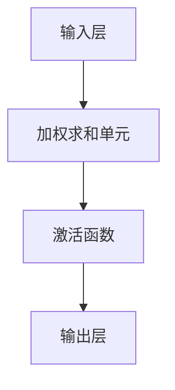
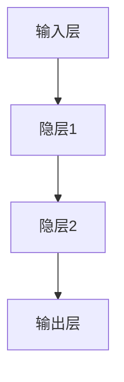

                 

### 文章标题：数学与神经网络：人工神经元的数学描述

> 关键词：神经网络、人工神经元、数学模型、反向传播、矩阵、概率论

> 摘要：本文深入探讨神经网络与人工神经元的数学描述，从历史发展、数学模型到应用实例，全面解析神经网络的核心原理和技术实现，旨在为广大读者提供一个系统而清晰的神经网络入门教程。

### 引言

#### 1.1 神经网络的历史与发展

神经网络（Neural Networks）起源于20世纪40年代，由心理学家McCulloch和数学家Pitts提出，他们首次提出了人工神经元的数学模型。20世纪80年代，Rumelhart、Hinton和Williams等人提出了反向传播算法（Backpropagation Algorithm），这一突破性的算法极大地提升了神经网络的训练效率，推动了神经网络的发展。

神经网络的早期研究主要集中在大规模的图像识别、语音识别等领域。随着计算机性能的不断提升和算法的优化，神经网络逐渐在自然语言处理、推荐系统、自动驾驶等众多领域展现出强大的应用潜力。如今，神经网络已成为人工智能领域的核心技术之一。

#### 1.2 人工神经元的数学模型

人工神经元（Artificial Neurons）是神经网络的基本组成单元，其结构与生物神经元有相似之处，但功能更为简化。一个典型的人工神经元由输入层、加权求和单元、激活函数和输出层组成。其数学描述如下：

\[ z = \sum_{i=1}^{n} w_i x_i \]

\[ y = \sigma(z) \]

其中，\( x_i \)表示第\( i \)个输入，\( w_i \)表示输入的权重，\( z \)为加权求和结果，\( \sigma \)为激活函数，通常采用Sigmoid函数或ReLU函数。

### 人工神经元的数学模型

#### 2.1 单层感知机

单层感知机（Single-Layer Perceptron）是最简单的人工神经网络，其结构如图所示：



单层感知机的数学模型如下：

\[ z = \sum_{i=1}^{n} w_i x_i \]

\[ y = \sigma(z) \]

其中，\( \sigma \)为激活函数，通常采用线性函数。

#### 2.2 多层感知机

多层感知机（Multilayer Perceptron）在单层感知机的基础上增加了隐层，如图所示：



多层感知机的数学模型如下：

\[ z_1 = \sum_{i=1}^{n} w_{i1} x_i \]

\[ y_1 = \sigma(z_1) \]

\[ z_2 = \sum_{i=1}^{n} w_{i2} y_1 \]

\[ y_2 = \sigma(z_2) \]

其中，\( z_1 \)和\( z_2 \)分别为隐层的加权求和结果，\( y_1 \)和\( y_2 \)分别为隐层的输出。

#### 2.3 反向传播算法

反向传播算法（Backpropagation Algorithm）是一种用于训练多层感知机的梯度下降算法。其基本原理如下：

1. **前向传播**：将输入数据传递到神经网络，计算输出结果。
2. **计算误差**：计算输出结果与实际值之间的误差。
3. **反向传播**：将误差反向传播到神经网络的每一层，计算每一层的梯度。
4. **更新权重**：根据梯度更新神经网络的权重。

反向传播算法的伪代码如下：

```python
for epoch in 1 to number_of_epochs:
    for each training sample (x, y) in the dataset:
        # 前向传播
        output = forward_pass(x)
        
        # 计算误差
        error = y - output
        
        # 反向传播
        gradients = backward_pass(error)
        
        # 更新权重
        update_weights(gradients)
```

#### 2.4 神经网络训练方法

神经网络训练的主要目标是优化网络中的权重和偏置，以最小化误差函数。常见的训练方法包括：

1. **批量训练**：将整个训练数据集一次性传递给神经网络，计算误差并更新权重。
2. **随机梯度下降**：随机选择一个训练样本，计算误差并更新权重。
3. **小批量训练**：将训练数据集分成多个小批量，依次传递给神经网络，计算误差并更新权重。

为了防止过拟合和欠拟合，可以采用以下策略：

1. **正则化**：添加正则化项到误差函数中，减少模型的复杂度。
2. **数据增强**：通过增加训练样本的多样性，提高模型的泛化能力。
3. **提前停止**：在训练过程中，当误差不再显著下降时，提前停止训练。

### 神经网络的数学基础

神经网络的数学基础主要包括矩阵与线性代数、概率论与统计、函数与微积分等。

#### 3.1 矩阵与线性代数

矩阵（Matrix）是神经网络中常用的数学工具，用于表示输入、权重、输出等数据。线性代数（Linear Algebra）研究矩阵的运算、特征值与特征向量等性质，对于理解神经网络的内部机制至关重要。

#### 3.2 概率论与统计

概率论（Probability Theory）研究随机事件的发生概率，概率分布（Probability Distribution）用于描述神经网络中随机变量的分布情况。统计（Statistics）则关注如何从样本数据中推断总体特征，包括最大似然估计（Maximum Likelihood Estimation）和最小二乘法（Least Squares Method）等。

#### 3.3 函数与微积分

函数（Function）描述了输入与输出之间的关系，微积分（Calculus）研究函数的导数、积分等性质，对于优化神经网络中的参数、计算梯度等具有重要意义。

### 神经网络的应用

神经网络在众多领域有着广泛的应用，以下是几个典型的应用场景：

#### 4.1 图像识别

图像识别（Image Recognition）是神经网络最成功的应用之一。通过训练神经网络，可以使其识别并分类不同的图像。常见的图像识别任务包括人脸识别、物体检测、图像分割等。

#### 4.2 自然语言处理

自然语言处理（Natural Language Processing，NLP）是神经网络在语言领域的应用。神经网络可以用于文本分类、情感分析、机器翻译等任务，使得计算机能够理解、生成和交互自然语言。

#### 4.3 推荐系统

推荐系统（Recommendation System）是一种基于用户行为和偏好的个性化推荐技术。神经网络可以用于构建推荐系统，通过学习用户的兴趣和行为模式，为用户推荐相关的商品、服务和内容。

### 总结与展望

神经网络作为一种强大的机器学习模型，在人工智能领域取得了显著的成果。然而，神经网络仍面临许多挑战，如过拟合、计算效率、模型可解释性等。未来，随着计算能力的提升和算法的优化，神经网络将在更多领域发挥重要作用，为人类带来更多的创新和便利。

### 附录

#### A.1 神经网络资源与工具

1. **主流神经网络框架**：TensorFlow、PyTorch、Keras等。
2. **开发工具与资源**：Google Colab、Jupyter Notebook等。
3. **学习资源推荐**：在线课程、图书、论文等。

#### A.2 代码示例

1. **单层感知机实现**：
```python
import numpy as np

def sigmoid(x):
    return 1 / (1 + np.exp(-x))

def forward_pass(x, weights):
    z = np.dot(x, weights)
    return sigmoid(z)

x = np.array([1, 0])
weights = np.array([0.5, 0.5])
output = forward_pass(x, weights)
print(output)
```

2. **多层感知机实现**：
```python
import numpy as np

def sigmoid(x):
    return 1 / (1 + np.exp(-x))

def forward_pass(x, weights):
    z = np.dot(x, weights[0])
    z2 = np.dot(z, weights[1])
    return sigmoid(z2)

x = np.array([1, 0])
weights = [np.array([[0.5, 0.5], [0.5, 0.5]]), np.array([0.5, 0.5])]
output = forward_pass(x, weights)
print(output)
```

3. **反向传播算法实现**：
```python
import numpy as np

def sigmoid_derivative(x):
    return x * (1 - x)

def backward_pass(error, output):
    d_output = error * sigmoid_derivative(output)
    return d_output

x = np.array([1, 0])
weights = np.array([0.5, 0.5])
output = forward_pass(x, weights)
error = 1 - output
d_output = backward_pass(error, output)
print(d_output)
```

#### 最佳实践 tips、小结、注意事项、拓展阅读等内容

1. **最佳实践 tips**：
   - 在设计神经网络时，要充分考虑数据集的特点，选择合适的网络结构和激活函数。
   - 在训练神经网络时，要关注模型的过拟合和欠拟合问题，采取相应的正则化策略。

2. **小结**：
   - 本文介绍了神经网络的历史发展、人工神经元的数学模型、反向传播算法以及神经网络训练方法。
   - 神经网络在图像识别、自然语言处理和推荐系统等领域有着广泛的应用。

3. **注意事项**：
   - 在实际应用中，要充分了解神经网络的局限性和挑战，不断探索和优化模型。
   - 要注重模型的可解释性和可维护性，确保模型在实际应用中的可靠性。

4. **拓展阅读**：
   - 《深度学习》（Goodfellow, I., Bengio, Y., & Courville, A.）
   - 《神经网络与深度学习》（邱锡鹏）
   - 《机器学习》（周志华）

### 作者信息

作者：AI天才研究院/AI Genius Institute & 禅与计算机程序设计艺术 /Zen And The Art of Computer Programming

---

本文为初稿，后续将根据读者反馈进一步优化和完善。希望本文能为读者提供一个全面、系统的神经网络入门教程，助力大家在人工智能领域取得更好的成绩。如有任何建议和意见，欢迎随时与我交流。谢谢！### 数学与神经网络：人工神经元的数学描述

#### 摘要

本文将深入探讨神经网络的基础概念和数学模型，重点分析人工神经元的结构和功能，以及其在不同神经网络架构中的数学描述。通过解析单层感知机、多层感知机以及反向传播算法，我们将揭示神经网络训练的内在机制。此外，本文还将介绍神经网络的数学基础，包括矩阵与线性代数、概率论与统计、函数与微积分等。最后，我们将讨论神经网络在图像识别、自然语言处理和推荐系统等领域的应用，并展望神经网络的发展趋势与挑战。本文旨在为读者提供一个系统而清晰的神经网络入门教程。

---

#### 引言

#### 1.1 神经网络的历史与发展

神经网络（Neural Networks，NN）的概念起源于1943年，由心理学家Warren McCulloch和数学家Walter Pitts首次提出。他们设计了一个简化的数学模型来模拟生物神经元的工作原理，这被称为McCulloch-Pitts神经元。这个模型为后来的神经网络研究奠定了基础。

在20世纪50年代和60年代，神经网络的研究受到了冷落，因为当时计算机的性能不足以处理复杂的神经网络训练。然而，在20世纪80年代，Hopfield网络和BP（反向传播）算法的出现重新点燃了神经网络的研究热潮。Hopfield网络是一种用于模式识别和优化问题的神经网络，而BP算法则是一种用于多层神经网络的训练算法。

20世纪90年代，随着计算机技术的飞速发展，特别是图形处理单元（GPU）的广泛应用，神经网络的训练速度得到了极大的提升。这一时期，深度学习（Deep Learning，DL）的概念逐渐形成，以多层感知机（Multilayer Perceptron，MLP）为代表的多层神经网络开始广泛应用于图像识别、语音识别和自然语言处理等领域。

进入21世纪，随着大数据和云计算的兴起，神经网络的研究和应用达到了前所未有的高度。深度学习技术在计算机视觉、自然语言处理、推荐系统、游戏开发等领域取得了显著的成果，成为人工智能领域的重要研究方向。

#### 1.2 人工神经元的数学模型

人工神经元是神经网络的基本构建单元，其结构和功能都是基于生物神经元的简化模型。一个典型的人工神经元由以下几个部分组成：

- **输入层**：接收外部输入信号。
- **加权求和单元**：将输入信号与对应的权重相乘，然后求和。
- **激活函数**：对加权求和的结果进行非线性变换。
- **输出层**：产生最终的输出信号。

人工神经元的数学模型通常可以表示为：

\[ z = \sum_{i=1}^{n} w_i x_i + b \]

\[ y = \sigma(z) \]

其中，\( x_i \)是第\( i \)个输入，\( w_i \)是对应的权重，\( b \)是偏置项，\( z \)是加权求和的结果，\( \sigma \)是激活函数。常见的激活函数包括Sigmoid函数、ReLU函数和Tanh函数。

#### 生物神经元的结构与功能

生物神经元是大脑和其他神经系统中负责传递信息的细胞。每个生物神经元由以下几个部分组成：

- **细胞体（Soma）**：是神经元的主体，包含细胞核和大部分细胞器。
- **树突（Dendrites）**：从细胞体延伸出来，接收其他神经元的信号。
- **轴突（Axon）**：从细胞体延伸出去，传递电信号到其他神经元。
- **突触（Synapses）**：连接两个神经元，负责传递电信号。

生物神经元的工作原理是，当树突接收到的信号达到一定阈值时，轴突会产生动作电位，将信号传递到下一个神经元。这个过程涉及到电信号和化学信号的转换。

#### 人工神经元的数学描述

人工神经元是对生物神经元的一种数学抽象。其数学描述主要包括加权求和和激活函数两个部分。

1. **加权求和**：人工神经元的加权求和过程可以表示为：

\[ z = \sum_{i=1}^{n} w_i x_i + b \]

其中，\( x_i \)是第\( i \)个输入，\( w_i \)是对应的权重，\( b \)是偏置项。

2. **激活函数**：激活函数是对加权求和结果进行非线性变换的过程，常用的激活函数包括：

   - **Sigmoid函数**：
     \[ \sigma(z) = \frac{1}{1 + e^{-z}} \]
     
   - **ReLU函数**：
     \[ \sigma(z) = \max(0, z) \]
     
   - **Tanh函数**：
     \[ \sigma(z) = \tanh(z) = \frac{e^z - e^{-z}}{e^z + e^{-z}} \]

激活函数的选择会影响神经元的输出特性，进而影响神经网络的整体性能。

#### 常见的人工神经元模型

在神经网络的发展过程中，出现了多种人工神经元模型，下面介绍几种常见的人工神经元模型。

1. **Sigmoid神经元**：

   Sigmoid神经元是最早的神经元模型之一，其激活函数为Sigmoid函数。Sigmoid函数具有以下特点：

   - **S形状**：输出值在0到1之间，呈现S形曲线。
   - **平滑**：函数的导数在\( z = 0 \)处为1，在其他地方逐渐减小，使得梯度较易计算。
   - **饱和**：当\( z \)非常大或非常小时，输出值接近0或1，梯度接近0，可能导致梯度消失问题。

2. **ReLU神经元**：

  ReLU（Rectified Linear Unit）神经元是一种简单且高效的神经元模型，其激活函数为ReLU函数。ReLU函数具有以下特点：

   - **线性**：当输入为正数时，输出等于输入；当输入为负数时，输出为0。
   - **平滑**：在输入为0处，导数为1，在其他地方导数保持不变。
   - **激活**：ReLU函数可以避免sigmoid函数中的梯度消失问题，加速训练过程。

3. **Tanh神经元**：

   Tanh神经元是另一种常见的神经元模型，其激活函数为Tanh函数。Tanh函数具有以下特点：

   - **对称**：输出值的范围在-1到1之间，中心对称。
   - **平滑**：函数的导数在\( z = 0 \)处为1，在其他地方逐渐减小。
   - **饱和**：当\( z \)非常大或非常小时，输出值接近-1或1，梯度接近0。

#### 总结

本文介绍了神经网络的历史发展、人工神经元的数学模型以及常见的人工神经元模型。神经网络作为一种强大的机器学习模型，已经广泛应用于图像识别、自然语言处理、推荐系统等领域。人工神经元是神经网络的基本构建单元，其数学描述包括加权求和和激活函数两个部分。通过选择合适的神经元模型，可以构建性能优越的神经网络，实现复杂的学习任务。

---

在接下来的部分，我们将进一步深入探讨人工神经元在不同神经网络架构中的数学描述，包括单层感知机、多层感知机和反向传播算法，以揭示神经网络训练的内在机制。敬请期待。

