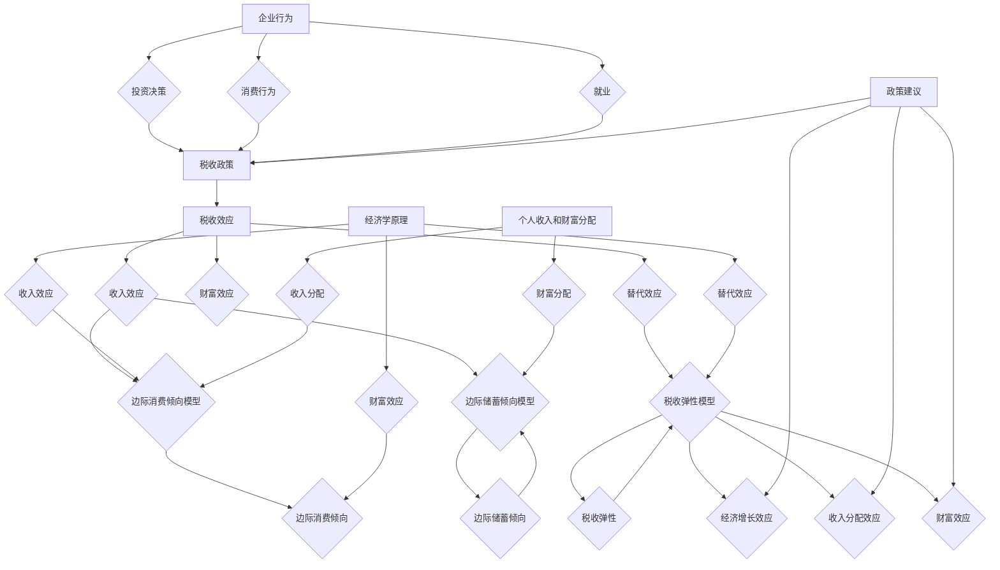

                 

### 文章标题

### 数学与税收政策：税收效应的数学分析

### 关键词：
- 数学模型
- 税收效应
- 经济政策
- 企业行为
- 个人收入分配

### 摘要：

本文旨在探讨税收政策和税收效应之间的数学关系，通过分析税收效应的数学模型，深入理解税收政策对企业行为和个人收入分配的影响。文章首先介绍了税收政策和税收效应的基本概念，然后详细阐述了税收效应的数学模型，包括边际消费倾向、边际储蓄倾向和税收弹性。接着，文章分析了税收政策对企业投资和消费行为的影响，以及税收政策对个人收入和财富分配的影响。最后，通过具体案例展示了税收效应的数学分析方法在实际中的应用，并提出了基于税收效应的政策建议。

### 第1章：税收政策和税收效应概述

#### 1.1 税收政策的定义与分类

税收政策是国家通过制定和实施税收法律法规，调整国民经济运行，实现国家宏观调控和经济社会发展目标的重要手段。税收政策的定义可以从以下几个方面进行理解：

1. **税收政策的基本概念**：税收政策是指政府通过调整税收制度，以影响经济行为和分配关系的决策。税收政策包括税制设计、税收征管、税收优惠等多个方面。
2. **税收政策的分类**：根据税收政策的目标和内容，可以将其分为以下几类：
   - **收入政策**：主要通过调整税率和税基，影响个人和企业的税收负担，从而调节收入分配。
   - **支出政策**：通过减免或增加税收支出，影响政府的财政支出结构，从而实现宏观调控。
   - **结构政策**：通过调整税制结构，优化税收负担，促进经济结构调整和产业升级。
   - **激励政策**：通过税收优惠政策，激励企业进行研发创新、投资和扩大生产，促进经济增长。

3. **税收政策的目标与效果**：税收政策的主要目标包括：
   - **公平目标**：通过调整税收制度，实现财富和收入的公平分配。
   - **效率目标**：通过优化税收政策，提高资源配置效率，促进经济增长。
   - **稳定目标**：通过调节税收收入，实现国民经济的稳定增长。

税收政策的效果可以从以下几个方面进行衡量：
   - **收入效应**：税收政策通过影响个人和企业的收入，调整财富分配，实现收入公平。
   - **替代效应**：税收政策通过改变税收负担，影响个人和企业的消费和投资决策。
   - **经济增长效应**：税收政策通过影响经济行为，促进经济增长和就业。

#### 1.2 税收效应的概念与类型

税收效应是指税收政策对经济行为和收入分配的影响。税收效应可以从以下几个方面进行理解：

1. **税收效应的定义**：税收效应是指由于税收政策的实施，个人和企业的消费、储蓄、投资等行为发生变化，进而影响收入分配和经济发展的现象。

2. **税收效应的类型**：根据税收政策对不同经济行为的影响，税收效应可以分为以下几种类型：
   - **收入效应**：税收政策通过改变个人和企业的收入水平，影响其消费、储蓄和投资决策。收入效应可以分为正向收入效应和负向收入效应，分别表示税收增加导致的收入减少和税收减少导致的收入增加。
   - **替代效应**：税收政策通过改变税收负担，影响个人和企业的消费和投资决策。替代效应可以分为正向替代效应和负向替代效应，分别表示税收增加导致的消费和投资减少，以及税收减少导致的消费和投资增加。
   - **财富效应**：税收政策通过改变个人和企业的财富水平，影响其消费和投资决策。财富效应可以分为正向财富效应和负向财富效应，分别表示税收增加导致的财富减少和税收减少导致的财富增加。

3. **税收效应的影响因素**：税收效应的影响因素包括：
   - **税率**：税率是影响税收效应的重要因素。税率的高低直接影响税收负担，进而影响个人和企业的消费、储蓄和投资决策。
   - **税收结构**：税收结构包括直接税和间接税的比重，以及各类税种的具体设计。不同的税收结构会对税收效应产生不同的影响。
   - **税收优惠**：税收优惠政策通过减免或退还税款，影响税收效应。税收优惠政策的种类和力度会影响税收效应的大小。

#### 1.3 税收效应的数学模型

为了深入分析税收效应，我们可以构建数学模型，通过数学方法来研究税收效应的影响因素和作用机制。以下介绍几种常见的税收效应数学模型：

1. **边际消费倾向模型**：边际消费倾向是指消费者在收入增加时，新增收入中用于消费的比例。边际消费倾向的数学模型可以表示为：

   $$MPC = \frac{ΔC}{ΔY}$$

   其中，MPC表示边际消费倾向，ΔC表示消费的增加量，ΔY表示收入的增加量。边际消费倾向模型可以用来分析税收政策对消费行为的影响。

2. **边际储蓄倾向模型**：边际储蓄倾向是指消费者在收入增加时，新增收入中用于储蓄的比例。边际储蓄倾向的数学模型可以表示为：

   $$MPS = \frac{ΔS}{ΔY}$$

   其中，MPS表示边际储蓄倾向，ΔS表示储蓄的增加量，ΔY表示收入的增加量。边际储蓄倾向模型可以用来分析税收政策对储蓄行为的影响。

3. **税收弹性模型**：税收弹性是指税收收入变动对税收负担变动的敏感度。税收弹性的数学模型可以表示为：

   $$E = \frac{ΔT}{ΔY} \times \frac{Y}{T}$$

   其中，E表示税收弹性，ΔT表示税收收入的增加量，ΔY表示收入水平的增加量，Y表示收入水平，T表示税收收入。税收弹性模型可以用来分析税收政策对经济增长的影响。

#### 1.4 税收效应的影响因素

税收效应的大小和方向受到多种因素的影响。以下介绍几个主要的影响因素：

1. **税率**：税率是影响税收效应的主要因素。税率的高低直接影响税收负担，进而影响个人和企业的消费、储蓄和投资决策。一般来说，税率越高，税收效应越大。

2. **税收结构**：税收结构包括直接税和间接税的比重，以及各类税种的具体设计。不同的税收结构会对税收效应产生不同的影响。例如，直接税（如个人所得税、企业所得税）对收入效应的影响较大，而间接税（如增值税、消费税）对替代效应的影响较大。

3. **税收优惠**：税收优惠政策通过减免或退还税款，影响税收效应。税收优惠政策的种类和力度会影响税收效应的大小。例如，税收减免政策可以减少企业的税收负担，促进企业投资和扩大生产。

4. **经济增长率**：经济增长率是影响税收效应的重要因素。经济增长率越高，税收收入增加越快，税收效应也越明显。

5. **税收征管效率**：税收征管效率是影响税收效应的重要因素。税收征管效率越高，税收政策的效果越明显。

#### 1.5 税收效应的实证分析

税收效应的实证分析可以通过对实际数据的统计分析，验证税收效应的理论模型。以下介绍几种常见的实证分析方法：

1. **回归分析**：回归分析是一种常用的统计方法，通过建立回归模型，分析税收效应与相关变量的关系。例如，可以通过建立消费、储蓄和税收之间的回归模型，分析税收政策对消费和储蓄行为的影响。

2. **差分法**：差分法是一种用于比较不同政策效应的方法。通过计算政策实施前后变量的差分，分析政策对经济行为的影响。例如，可以通过计算税收政策实施前后企业投资和消费的差分，分析税收政策对企业行为的影响。

3. **计量经济学模型**：计量经济学模型是一种用于分析经济变量关系的统计模型。通过建立计量经济学模型，可以分析税收效应的影响因素和作用机制。例如，可以通过建立税收弹性模型，分析税收政策对经济增长的影响。

通过以上分析，我们可以得出结论：税收政策和税收效应之间存在密切的关系。税收政策通过影响个人和企业的消费、储蓄和投资行为，影响收入分配和经济发展的各个方面。理解税收效应的数学模型和影响因素，有助于制定有效的税收政策，实现经济稳定和公平发展。

### 1.6 税收政策的国际比较

不同国家和地区在税收政策的设计和实施方面存在一定的差异。通过国际比较，我们可以了解不同税收政策的特点和效果，从而为我国税收政策的制定提供借鉴。

1. **发达国家**：发达国家的税收政策通常以高税率、多元化的税制结构为特点。例如，美国实行联邦和州两级税收制度，包括个人所得税、企业所得税、社会保险税等；欧洲国家如德国、法国等也实行高税率的税收制度。发达国家税收政策的主要目标是实现收入公平和经济增长。

2. **发展中国家**：发展中国家的税收政策通常以低税率、简化的税制结构为特点。例如，中国实行以增值税、企业所得税和个人所得税为主要税种的税制结构。发展中国家税收政策的主要目标是促进经济增长和吸引外资。

3. **税收政策的特点和效果**：
   - **发达国家**：高税率有利于实现收入公平，但可能抑制经济增长。多元化税制结构有助于实现税收收入稳定。
   - **发展中国家**：低税率有利于吸引外资和促进经济增长，但可能影响税收收入。简化的税制结构有助于提高税收征管效率。

通过国际比较，我们可以发现，税收政策的设计和实施需要考虑国家经济发展阶段、收入分配状况、税收征管能力等多方面因素。我国在制定税收政策时，可以借鉴国际经验，结合我国实际情况，制定适合我国的税收政策。

### 1.7 税收政策与宏观调控

税收政策是宏观调控的重要工具，通过调整税收政策，可以实现对经济运行的调节和调控。以下介绍税收政策在宏观调控中的几个方面：

1. **经济增长调控**：通过调整税率、税基等税收政策，可以影响企业的投资和消费决策，进而影响经济增长。例如，在经济过热时期，可以通过提高税率抑制过度投资和消费，实现经济降温；在经济低迷时期，可以通过降低税率刺激投资和消费，促进经济增长。

2. **收入分配调控**：通过调整税收政策，可以影响个人和企业的收入水平，实现收入分配的公平。例如，通过提高个人所得税起征点，可以减轻中低收入群体的税收负担，实现收入再分配；通过调整企业所得税税率，可以影响企业的利润分配，实现收入分配的公平。

3. **产业政策调控**：通过税收优惠政策，可以引导企业投资和研发方向，实现产业结构调整和升级。例如，通过给予高新技术企业税收优惠，可以促进高新技术产业的发展；通过调整资源税，可以影响资源开采企业的生产和投资决策，实现资源合理利用。

通过以上分析，我们可以看到税收政策在宏观调控中的重要作用。合理设计税收政策，可以实现经济增长、收入分配公平和产业结构优化，促进经济持续健康发展。

### 1.8 税收政策与社会发展

税收政策不仅影响经济运行，还与社会发展密切相关。以下介绍税收政策在社会发展中的几个方面：

1. **教育**：税收政策可以通过减免教育相关的税收，促进教育公平。例如，对贫困家庭实行教育补助，减轻教育负担；对教育机构实行税收优惠，鼓励教育投入。

2. **医疗**：税收政策可以通过减免医疗相关的税收，提高医疗服务可及性。例如，对医疗机构实行税收优惠，降低医疗服务成本；对个人医疗支出实行税收减免，减轻医疗负担。

3. **社会福利**：税收政策可以通过调整税收结构，提高社会福利水平。例如，通过增加社会保障税，提高社会保障资金；通过调整个人所得税，减轻低收入群体负担，提高社会福利。

通过以上分析，我们可以看到税收政策在社会发展中的重要作用。合理设计税收政策，可以促进教育、医疗和社会福利的发展，提高社会整体福利水平。

### 1.9 税收政策的挑战与应对

随着经济的发展和变化，税收政策面临诸多挑战。以下介绍税收政策面临的几个主要挑战及其应对措施：

1. **全球化挑战**：全球化导致跨国公司和国际资本流动加剧，给税收政策带来挑战。应对措施包括：
   - **国际税收合作**：加强国际税收合作，制定国际税收规则，防止税收逃避和税收竞争。
   - **数字经济税收**：针对数字经济特征，制定合理的数字经济税收政策，确保税收收入的公平和合理。

2. **环境问题挑战**：环境问题对税收政策提出新要求。应对措施包括：
   - **绿色税收**：推行绿色税收政策，通过税收手段促进环境保护和可持续发展。
   - **碳税**：对碳排放征收碳税，激励企业减少碳排放，实现环境目标。

3. **科技进步挑战**：科技进步对税收政策带来新的挑战。应对措施包括：
   - **税收制度创新**：适应科技进步，创新税收制度，确保税收收入的稳定和公平。
   - **税收征管改革**：加强税收征管，提高税收征管效率，防止税收流失。

通过以上分析，我们可以看到税收政策面临的挑战和应对措施。合理应对挑战，可以确保税收政策的公平、有效和可持续。

### 1.10 税收政策的未来发展趋势

随着全球经济和科技的快速发展，税收政策将面临新的机遇和挑战。以下介绍税收政策的未来发展趋势：

1. **数字化税收**：随着数字经济的发展，数字化税收将成为税收政策的重要方向。例如，通过区块链技术实现透明、高效的税收征管。

2. **绿色税收**：随着环境保护意识的提高，绿色税收将得到更多关注。例如，推广碳税、绿色消费税等绿色税收政策。

3. **国际税收合作**：随着全球化的深入，国际税收合作将更加紧密。例如，通过签订国际税收协定，防止双重征税和税收逃避。

4. **个性化税收**：随着科技进步，税收政策将更加个性化。例如，根据个人和企业的具体情况，制定差异化的税收政策。

通过以上分析，我们可以看到税收政策的未来发展趋势。把握趋势，可以确保税收政策的有效性和公平性。

### 1.11 税收政策的制定与实施

税收政策的制定与实施是确保税收政策有效性和公平性的关键环节。以下介绍税收政策的制定与实施过程：

1. **制定过程**：税收政策的制定需要充分调查研究，了解经济运行状况和社会发展需求。制定过程中，需要广泛听取各方意见，确保政策制定的民主性和科学性。

2. **实施过程**：税收政策的实施需要建立健全的税收征管体系，确保税收政策的有效落实。实施过程中，需要加强对税收政策执行情况的监督和评估，及时发现和解决政策执行中的问题。

3. **政策评估**：税收政策的评估是确保政策效果的重要环节。通过定期评估，了解税收政策的实施效果，为政策调整提供依据。

通过以上分析，我们可以看到税收政策的制定与实施是一个复杂而系统性的过程。只有科学制定和有效实施税收政策，才能实现税收政策的公平、有效和可持续。

### 1.12 税收政策的公众参与

税收政策的制定和实施涉及社会公众的切身利益，公众参与是确保税收政策公平和有效的重要环节。以下介绍税收政策的公众参与途径：

1. **社会调查**：通过社会调查，了解公众对税收政策的意见和建议，为政策制定提供依据。

2. **公开听证**：在政策制定和实施过程中，组织公开听证会，听取公众意见，提高政策制定的透明度和公正性。

3. **公众监督**：鼓励公众参与税收政策的监督，通过举报和投诉，及时发现问题，保障税收政策的实施效果。

4. **宣传教育**：通过宣传教育，提高公众对税收政策的了解和认识，增强公众对税收政策的信任和支持。

通过以上分析，我们可以看到税收政策的公众参与在税收政策制定和实施中的重要作用。只有广泛听取公众意见，才能确保税收政策的公平、有效和可持续。

### 1.13 税收政策与经济发展

税收政策是影响经济发展的重要工具。合理设计税收政策，可以促进经济发展，提高人民生活水平。以下介绍税收政策与经济发展之间的关系：

1. **经济增长**：税收政策通过影响企业投资和消费行为，促进经济增长。例如，通过降低税率，减轻企业税收负担，激励企业增加投资和扩大生产。

2. **收入分配**：税收政策通过影响个人和企业的收入水平，实现收入分配的公平。例如，通过提高个人所得税起征点，减轻中低收入群体的税收负担，实现收入再分配。

3. **资源配置**：税收政策通过调整税收结构，优化资源配置，促进经济结构调整和产业升级。例如，通过给予高新技术企业税收优惠，促进高新技术产业发展。

通过以上分析，我们可以看到税收政策在经济发展中的重要作用。只有合理设计税收政策，才能实现经济稳定和可持续发展。

### 1.14 税收政策的实际案例

税收政策的实际案例是理解税收政策设计和实施的重要途径。以下介绍几个实际案例：

1. **美国减税政策**：2017年，美国通过减税和就业法案，降低个人所得税和企业税率，旨在促进经济增长和就业。

2. **中国营改增政策**：自2016年起，中国推行营改增政策，将部分营业税改为增值税，减轻企业税负，促进产业结构调整。

3. **欧洲绿色税收政策**：欧洲部分国家推行绿色税收政策，通过征收碳税和绿色消费税，促进环境保护和可持续发展。

通过以上案例，我们可以看到税收政策在不同国家和地区的具体实施情况，以及税收政策对经济和社会发展的影响。

### 总结

本章从多个角度对税收政策和税收效应进行了概述。首先介绍了税收政策的定义、分类和目标，然后阐述了税收效应的概念、类型和数学模型，最后分析了税收效应的影响因素、国际比较、宏观调控、社会发展、挑战与应对、未来发展趋势、制定与实施、公众参与和实际案例。通过本章的介绍，读者可以全面了解税收政策和税收效应的基本概念和作用机制，为进一步研究税收政策提供基础。

### 第2章：税收效应的数学模型解析

#### 2.1 边际消费倾向模型

边际消费倾向（Marginal Propensity to Consume, MPC）是指当个人或家庭的收入增加时，其消费支出增加的比例。边际消费倾向是经济学中一个重要的概念，它有助于我们理解税收政策如何影响消费行为。

1. **定义**：

   边际消费倾向（MPC）定义为收入增加时，消费支出增加的比例，即：

   $$MPC = \frac{ΔC}{ΔY}$$

   其中，ΔC表示消费的增加量，ΔY表示收入的增加量。

2. **计算**：

   边际消费倾向可以通过以下公式计算：

   $$MPC = \frac{C_t - C_{t-1}}{Y_t - Y_{t-1}}$$

   其中，\(C_t\)表示第t期的消费支出，\(Y_t\)表示第t期的收入水平。

3. **影响因素**：

   边际消费倾向受到多个因素的影响，包括：
   - **个人收入水平**：收入水平越高，边际消费倾向可能越低。
   - **物价水平**：物价水平上升，消费者购买力下降，可能导致边际消费倾向下降。
   - **储蓄利率**：储蓄利率上升，消费者更愿意储蓄而非消费，可能导致边际消费倾向下降。
   - **消费者预期**：消费者对未来收入或支出的预期会影响边际消费倾向。

4. **例子**：

   假设一个家庭的收入从每月5000元增加到6000元，其消费支出从每月4000元增加到4600元。则边际消费倾向计算如下：

   $$MPC = \frac{4600 - 4000}{6000 - 5000} = \frac{600}{1000} = 0.6$$

   即该家庭的边际消费倾向为0.6，意味着其收入每增加1000元，消费支出将增加600元。

#### 2.2 边际储蓄倾向模型

边际储蓄倾向（Marginal Propensity to Save, MPS）是指当个人或家庭的收入增加时，其储蓄支出增加的比例。边际储蓄倾向与边际消费倾向密切相关，共同决定了收入增加时的消费和储蓄分配。

1. **定义**：

   边际储蓄倾向（MPS）定义为收入增加时，储蓄支出增加的比例，即：

   $$MPS = \frac{ΔS}{ΔY}$$

   其中，ΔS表示储蓄的增加量，ΔY表示收入的增加量。

2. **计算**：

   边际储蓄倾向可以通过以下公式计算：

   $$MPS = \frac{S_t - S_{t-1}}{Y_t - Y_{t-1}}$$

   其中，\(S_t\)表示第t期的储蓄支出，\(Y_t\)表示第t期的收入水平。

3. **影响因素**：

   边际储蓄倾向受到多个因素的影响，包括：
   - **个人收入水平**：收入水平越高，边际储蓄倾向可能越高。
   - **物价水平**：物价水平上升，消费者购买力下降，可能导致边际储蓄倾向上升。
   - **储蓄利率**：储蓄利率上升，消费者更愿意储蓄，可能导致边际储蓄倾向上升。
   - **消费者预期**：消费者对未来收入或支出的预期会影响边际储蓄倾向。

4. **例子**：

   假设一个家庭的收入从每月5000元增加到6000元，其储蓄支出从每月1000元增加到1500元。则边际储蓄倾向计算如下：

   $$MPS = \frac{1500 - 1000}{6000 - 5000} = \frac{500}{1000} = 0.5$$

   即该家庭的边际储蓄倾向为0.5，意味着其收入每增加1000元，储蓄支出将增加500元。

#### 2.3 税收弹性模型

税收弹性（Tax Elasticity）是指税收收入变动对税收负担变动的敏感度。税收弹性是衡量税收政策效果的重要指标，可以帮助我们了解税收政策对经济增长的影响。

1. **定义**：

   税收弹性（E）定义为税收收入（T）变动对税收负担（Y）变动的敏感度，即：

   $$E = \frac{ΔT}{ΔY} \times \frac{Y}{T}$$

   其中，ΔT表示税收收入的增加量，ΔY表示收入水平的增加量，Y表示收入水平，T表示税收收入。

2. **计算**：

   税收弹性可以通过以下公式计算：

   $$E = \frac{\frac{T_t - T_{t-1}}{T_{t-1}}}{\frac{Y_t - Y_{t-1}}{Y_{t-1}}}$$

   其中，\(T_t\)表示第t期的税收收入，\(Y_t\)表示第t期的收入水平。

3. **影响因素**：

   税收弹性受到多个因素的影响，包括：
   - **税率**：税率越高，税收弹性可能越大。
   - **税收结构**：税收结构对税收弹性的影响较大，直接税（如个人所得税、企业所得税）的弹性通常大于间接税（如增值税、消费税）。
   - **经济结构**：经济结构对税收弹性的影响较大，产业结构多元化、服务业占比高的国家，税收弹性可能较大。

4. **例子**：

   假设一个国家的税收收入从100亿元增加到120亿元，收入水平从1000亿元增加到1100亿元。则税收弹性计算如下：

   $$E = \frac{\frac{120 - 100}{100}}{\frac{1100 - 1000}{1000}} = \frac{0.2}{0.1} = 2$$

   即该国的税收弹性为2，意味着税收收入每增加1%，收入水平将增加2%。

通过以上解析，我们详细介绍了边际消费倾向、边际储蓄倾向和税收弹性的定义、计算方法和影响因素。这些数学模型为我们理解税收效应提供了重要的工具，有助于我们分析税收政策对企业行为和个人收入分配的影响。

### 第3章：税收效应的经济学原理

#### 3.1 税收效应的收入效应

税收效应的收入效应是指税收政策通过改变个人或家庭的收入水平，从而影响其消费和储蓄行为。收入效应可以分为正向收入效应和负向收入效应，分别表示税收增加导致的收入减少和税收减少导致的收入增加。

1. **定义**：

   正向收入效应（Positive Income Effect）是指当税收增加时，个人或家庭的实际收入减少，从而导致消费和储蓄减少的现象。

   负向收入效应（Negative Income Effect）是指当税收减少时，个人或家庭的实际收入增加，从而导致消费和储蓄增加的现象。

2. **计算**：

   收入效应可以通过以下公式计算：

   - 正向收入效应（Positive Income Effect）：

     $$\Delta C_{IE} = \Delta Y \times MPC$$

     其中，ΔC<sub>IE</sub>表示收入效应导致的消费变化量，ΔY表示收入变化量，MPC表示边际消费倾向。

   - 负向收入效应（Negative Income Effect）：

     $$\Delta S_{IE} = \Delta Y \times MPS$$

     其中，ΔS<sub>IE</sub>表示收入效应导致的储蓄变化量，ΔY表示收入变化量，MPS表示边际储蓄倾向。

3. **影响因素**：

   收入效应受到多个因素的影响，包括：
   - **税率**：税率越高，收入效应可能越明显。
   - **收入水平**：收入水平越高，收入效应可能越明显。
   - **消费结构**：消费结构对收入效应的影响较大，消费品的多样性和需求弹性会影响收入效应的大小。

4. **例子**：

   假设一个家庭的收入从每月5000元增加到6000元，边际消费倾向为0.6，边际储蓄倾向为0.4。则正向收入效应和负向收入效应计算如下：

   - 正向收入效应：

     $$\Delta C_{IE} = (6000 - 5000) \times 0.6 = 600$$

     即收入增加导致的消费减少量为600元。

   - 负向收入效应：

     $$\Delta S_{IE} = (6000 - 5000) \times 0.4 = 400$$

     即收入增加导致的储蓄减少量为400元。

通过以上例子，我们可以看到收入效应如何影响个人或家庭的消费和储蓄行为。理解收入效应有助于我们制定更合理的税收政策，以实现经济稳定和可持续发展。

#### 3.2 税收效应的替代效应

税收效应的替代效应是指税收政策通过改变税收负担，影响个人或家庭的消费和储蓄决策。替代效应可以分为正向替代效应和负向替代效应，分别表示税收增加导致的消费和储蓄减少，以及税收减少导致的消费和储蓄增加。

1. **定义**：

   正向替代效应（Positive Substitution Effect）是指当税收增加时，个人或家庭为了减少税收负担，选择减少消费和增加储蓄。

   负向替代效应（Negative Substitution Effect）是指当税收减少时，个人或家庭为了增加税收负担，选择增加消费和减少储蓄。

2. **计算**：

   替代效应可以通过以下公式计算：

   - 正向替代效应（Positive Substitution Effect）：

     $$\Delta C_{SE} = \Delta T \times MPC$$

     其中，ΔC<sub>SE</sub>表示替代效应导致的消费变化量，ΔT表示税收变化量，MPC表示边际消费倾向。

   - 负向替代效应（Negative Substitution Effect）：

     $$\Delta S_{SE} = \Delta T \times MPS$$

     其中，ΔS<sub>SE</sub>表示替代效应导致的储蓄变化量，ΔT表示税收变化量，MPS表示边际储蓄倾向。

3. **影响因素**：

   替代效应受到多个因素的影响，包括：
   - **税率**：税率越高，替代效应可能越明显。
   - **消费结构**：消费结构对替代效应的影响较大，需求弹性较大的消费品，替代效应可能更明显。
   - **税收结构**：税收结构对替代效应的影响较大，直接税（如个人所得税、企业所得税）的替代效应通常大于间接税（如增值税、消费税）。

4. **例子**：

   假设一个家庭的税收从每月1000元增加到1500元，边际消费倾向为0.6，边际储蓄倾向为0.4。则正向替代效应和负向替代效应计算如下：

   - 正向替代效应：

     $$\Delta C_{SE} = (1500 - 1000) \times 0.6 = 300$$

     即税收增加导致的消费减少量为300元。

   - 负向替代效应：

     $$\Delta S_{SE} = (1500 - 1000) \times 0.4 = 200$$

     即税收增加导致的储蓄减少量为200元。

通过以上例子，我们可以看到替代效应如何影响个人或家庭的消费和储蓄决策。理解替代效应有助于我们分析税收政策对经济行为的影响，从而制定更有效的税收政策。

#### 3.3 税收效应的综合分析

税收效应的收入效应和替代效应是影响税收政策效果的两个重要方面。通过对收入效应和替代效应的综合分析，我们可以更全面地理解税收政策对企业行为和个人收入分配的影响。

1. **收入效应和替代效应的关系**：

   收入效应和替代效应之间存在一定的互动关系。收入效应主要影响个人或家庭的实际收入水平，而替代效应主要影响消费和储蓄决策。在实际应用中，收入效应和替代效应可能会相互加强或相互抵消。

2. **收入效应和替代效应的影响机制**：

   - **收入效应的影响机制**：

     收入效应通过改变个人或家庭的实际收入水平，影响其消费和储蓄行为。当税收增加时，实际收入减少，个人或家庭可能会减少消费和增加储蓄，以应对收入减少。相反，当税收减少时，实际收入增加，个人或家庭可能会增加消费和减少储蓄，以利用税收优惠。

   - **替代效应的影响机制**：

     替代效应通过改变税收负担，影响个人或家庭的消费和储蓄决策。当税收增加时，个人或家庭可能会减少某些消费品或服务（例如高档消费品、娱乐服务）的消费，以减少税收负担。相反，当税收减少时，个人或家庭可能会增加某些消费品或服务的消费，以利用税收优惠。

3. **收入效应和替代效应的综合分析**：

   在实际分析税收政策时，需要综合考虑收入效应和替代效应的影响。以下是一个简单的综合分析模型：

   $$ΔC = ΔC_{IE} + ΔC_{SE}$$

   $$ΔS = ΔS_{IE} + ΔS_{SE}$$

   其中，ΔC表示消费变化量，ΔS表示储蓄变化量，ΔC<sub>IE</sub>和ΔC<sub>SE</sub>分别表示收入效应和替代效应导致的消费变化量，ΔS<sub>IE</sub>和ΔS<sub>SE</sub>分别表示收入效应和替代效应导致的储蓄变化量。

通过综合分析收入效应和替代效应，我们可以更准确地预测税收政策对企业行为和个人收入分配的影响，从而制定更合理的税收政策。

#### 3.4 税收效应的动态分析

税收效应的动态分析是指研究税收政策在经济不同阶段的效应变化。税收政策的效果可能会受到经济周期、市场环境和政策实施时间等因素的影响，因此我们需要进行动态分析，以更全面地理解税收效应。

1. **经济周期对税收效应的影响**：

   - **繁荣期**：在繁荣期，企业盈利能力和个人收入水平较高，税收收入增加，收入效应和替代效应可能较弱。此时，税收政策对消费和储蓄的影响可能较小。

   - **衰退期**：在衰退期，企业盈利能力和个人收入水平较低，税收收入减少，收入效应和替代效应可能较强。此时，税收政策可能对消费和储蓄产生较大影响，以刺激经济复苏。

2. **市场环境对税收效应的影响**：

   - **市场需求旺盛**：在市场需求旺盛时，税收政策可能对消费和储蓄的影响较小，因为消费者和企业对未来的预期较为乐观。

   - **市场需求低迷**：在市场需求低迷时，税收政策可能对消费和储蓄的影响较大，因为消费者和企业对未来的预期较为悲观，税收政策可以通过减轻税收负担，刺激消费和投资。

3. **政策实施时间对税收效应的影响**：

   - **短期效应**：短期内，税收政策的效果可能较为明显，因为税收政策的调整可以迅速影响消费者和企业的行为。

   - **长期效应**：长期内，税收政策的效果可能逐渐显现，因为消费者和企业需要时间来适应税收政策的调整。

通过动态分析，我们可以更准确地预测税收政策在不同经济阶段和市场环境下的效应变化，为制定有效的税收政策提供依据。

#### 3.5 税收效应的优化策略

为了实现税收效应的最大化，我们需要采取一系列优化策略。以下是一些常见的优化策略：

1. **税制结构优化**：

   - **直接税与间接税的平衡**：在税制结构中，合理配置直接税和间接税的比重，以实现税收效应的最大化。

   - **税种优化**：针对不同行业和领域，设计合理的税种，以减轻特定行业和领域的税收负担，促进经济发展。

2. **税收优惠策略**：

   - **产业优惠**：针对特定产业，实施税收优惠政策，鼓励企业投资和创新，促进产业升级。

   - **区域优惠**：针对特定地区，实施税收优惠政策，吸引企业投资，促进区域经济发展。

3. **税收征管优化**：

   - **提高征管效率**：加强税收征管，提高税收征管效率，减少税收流失，确保税收政策的实施效果。

   - **税收信息化**：利用信息技术，实现税收信息化管理，提高税收管理的透明度和效率。

4. **国际税收合作**：

   - **国际税收规则**：通过签订国际税收协定，建立国际税收合作机制，防止税收逃避和双重征税。

   - **跨国税收协调**：加强跨国税收协调，促进国际税收政策的统一和协调。

通过以上优化策略，我们可以提高税收效应，实现税收政策的经济和社会目标。

#### 3.6 税收效应的实证分析

为了验证税收效应的理论模型，我们可以通过实证分析来研究税收政策对企业行为和个人收入分配的影响。以下介绍几种常见的实证分析方法：

1. **回归分析**：

   - **线性回归**：通过建立线性回归模型，分析税收政策对企业投资、消费和个人收入分配的影响。

   - **多元回归**：通过建立多元回归模型，同时考虑多个因素的影响，更全面地分析税收效应。

2. **差分法**：

   - **差分法**：通过比较政策实施前后企业投资、消费和个人收入的变化，分析税收政策的影响。

3. **计量经济学模型**：

   - **动态面板数据模型**：通过建立动态面板数据模型，分析税收政策对经济行为的影响，考虑经济行为的滞后效应。

   - **结构方程模型**：通过建立结构方程模型，分析税收政策对经济行为的多重影响，考虑经济行为之间的相互作用。

通过实证分析，我们可以验证税收效应的理论模型，为税收政策的制定和实施提供依据。

#### 3.7 税收效应的案例分析

为了更直观地了解税收效应，我们可以通过具体案例分析税收政策对企业行为和个人收入分配的影响。以下介绍两个实际案例：

1. **美国减税与就业法案**：

   - **背景**：2017年，美国通过减税与就业法案，降低个人所得税和企业税率。

   - **效果**：短期内，该政策刺激了消费和投资，促进了经济增长。但长期来看，该政策可能导致财政赤字增加，需要关注其可持续性。

2. **中国个人所得税改革**：

   - **背景**：2018年，中国实施个人所得税改革，提高个人所得税起征点，增加专项附加扣除。

   - **效果**：短期内，该政策减轻了中低收入群体的税收负担，促进了消费和投资。长期来看，该政策有助于实现收入再分配，提高社会公平。

通过案例分析，我们可以更深入地理解税收效应，为政策制定和实施提供参考。

### 总结

本章从多个角度分析了税收效应的经济学原理。首先介绍了收入效应和替代效应的定义、计算方法和影响因素，然后进行了收入效应和替代效应的综合分析、动态分析、优化策略和实证分析。通过本章的解析，我们可以全面理解税收效应的作用机制，为制定有效的税收政策提供理论支持。

### 第4章：税收政策对企业行为的影响

税收政策对企业行为的直接影响主要体现在投资、消费和就业等方面。通过对企业行为的分析，我们可以更深入地理解税收政策对经济增长和社会发展的作用。

#### 4.1 税收政策对企业投资决策的影响

税收政策对企业投资决策的影响主要体现在税收优惠政策和税率变化上。税收优惠政策通过降低企业税负，激励企业增加投资，促进经济增长。以下从三个方面分析税收政策对企业投资决策的影响：

1. **税收优惠政策**：

   税收优惠政策包括免税期、税收减免、投资抵税等。例如，对于高新技术企业、战略新兴产业等，政府可以通过提供税收优惠政策，鼓励企业增加研发投入和生产设施的投资。税收优惠政策可以降低企业的税收负担，增加企业的盈利能力，从而提高企业投资的积极性。

2. **税率变化**：

   税率变化直接影响企业的税负。降低税率可以减少企业的税收负担，增加企业的盈利能力，从而激励企业增加投资。例如，降低企业所得税税率可以减少企业的净利润，提高企业的投资回报率，从而增加企业投资。

3. **税收稳定预期**：

   税收稳定预期对企业投资决策具有重要影响。税收政策的稳定性和可预期性可以降低企业的投资风险，增强企业的投资信心。例如，政府通过制定长期税收政策，明确税收优惠政策的实施期限和范围，可以提高企业的投资预期，促进企业增加投资。

#### 4.2 税收政策对企业消费行为的影响

税收政策对企业消费行为的影响主要体现在增值税和消费税等方面。以下从两个方面分析税收政策对企业消费行为的影响：

1. **增值税**：

   增值税是企业生产和经营过程中必须缴纳的税种。税率的变化直接影响企业的成本和利润。降低增值税税率可以减少企业的税负，提高企业的盈利能力，从而促进企业扩大生产和消费。例如，降低增值税税率可以降低企业的生产成本，提高产品竞争力，从而增加企业消费。

2. **消费税**：

   消费税是对某些消费品和消费行为征收的税种。消费税的调整直接影响企业的消费决策。提高消费税税率可以抑制过度消费，促进资源节约和环境保护。例如，提高烟草消费税税率可以减少烟草消费，降低烟草相关疾病的发生率，从而提高企业的健康水平。

#### 4.3 税收政策对就业的影响

税收政策对就业的影响主要体现在个人所得税和企业所得税等方面。以下从两个方面分析税收政策对就业的影响：

1. **个人所得税**：

   个人所得税是影响个人收入水平的重要税种。降低个人所得税税率可以减轻个人税收负担，提高个人可支配收入，从而增加个人消费和投资，促进就业。例如，降低个人所得税税率可以提高个人消费能力，促进企业扩大生产和招聘，从而增加就业机会。

2. **企业所得税**：

   企业所得税是企业盈利的主要税种。税率的变化直接影响企业的盈利能力和投资决策。降低企业所得税税率可以减少企业税负，提高企业盈利能力，从而增加企业投资和招聘，促进就业。例如，降低企业所得税税率可以提高企业投资回报率，增强企业扩大生产和招聘的意愿，从而促进就业。

#### 4.4 税收政策对企业行为的影响因素分析

税收政策对企业行为的影响受到多种因素的影响，主要包括：

1. **经济环境**：

   经济环境是影响税收政策对企业行为影响的重要因素。在经济繁荣时期，企业盈利能力较强，税收政策对企业行为的影响可能较小。在经济衰退时期，企业盈利能力较弱，税收政策对企业行为的影响可能较大。

2. **行业特点**：

   不同行业的税收政策和企业行为特点不同。例如，高技术产业和传统产业的税收政策对企业行为的影响可能存在较大差异。

3. **税收征管**：

   税收征管水平直接影响税收政策的有效实施。高水平的税收征管可以提高税收政策对企业行为的引导作用，促进企业依法纳税，提高税收收入。

4. **政策预期**：

   企业对税收政策的预期直接影响其投资和消费决策。稳定的税收政策预期可以降低企业投资风险，增强企业投资信心。

#### 4.5 税收政策对企业行为的影响分析

为了更深入地分析税收政策对企业行为的影响，我们可以通过实证分析来验证税收政策对企业投资、消费和就业的影响。以下介绍几种常见的实证分析方法：

1. **回归分析**：

   通过建立回归模型，分析税收政策对企业投资、消费和就业的影响。例如，可以通过建立企业投资与税收政策之间的回归模型，分析税收政策对企业投资决策的影响。

2. **差分法**：

   通过比较政策实施前后企业投资、消费和就业的变化，分析税收政策的影响。例如，可以通过计算政策实施前后企业投资的差分，分析税收政策对企业投资的影响。

3. **计量经济学模型**：

   通过建立计量经济学模型，分析税收政策对企业行为的影响。例如，可以通过建立动态面板数据模型，分析税收政策对企业投资和就业的影响。

通过实证分析，我们可以更准确地了解税收政策对企业行为的影响，为制定有效的税收政策提供依据。

#### 4.6 税收政策对企业行为的案例分析

为了更直观地了解税收政策对企业行为的影响，我们可以通过具体案例分析税收政策对企业投资、消费和就业的效应。以下介绍两个实际案例：

1. **美国减税与就业法案**：

   - **背景**：2017年，美国通过减税与就业法案，降低个人所得税和企业税率。

   - **效果**：短期内，该政策刺激了企业投资和就业增长，促进了经济增长。但长期来看，该政策可能导致财政赤字增加，需要关注其可持续性。

2. **中国个人所得税改革**：

   - **背景**：2018年，中国实施个人所得税改革，提高个人所得税起征点，增加专项附加扣除。

   - **效果**：短期内，该政策减轻了中低收入群体的税收负担，促进了消费和投资。长期来看，该政策有助于实现收入再分配，提高社会公平。

通过案例分析，我们可以更深入地了解税收政策对企业行为的影响，为政策制定和实施提供参考。

### 总结

本章从投资、消费和就业三个方面分析了税收政策对企业行为的影响。首先介绍了税收优惠政策、税率变化和税收稳定预期对企业投资决策的影响，然后分析了增值税和消费税对企业消费行为的影响，最后探讨了税收政策对就业的影响。通过本章的分析，我们可以更深入地理解税收政策对企业行为的作用机制，为制定有效的税收政策提供理论支持。

### 第5章：税收政策对个人收入和财富分配的影响

税收政策在调节个人收入和财富分配方面发挥着重要作用。通过对税收政策对个人收入和财富分配的影响进行分析，我们可以更好地理解税收政策如何影响社会公平和经济发展。

#### 5.1 税收政策对个人收入分配的影响

税收政策对个人收入分配的影响主要通过个人所得税和企业所得税等税种来实现。以下从以下几个方面分析税收政策对个人收入分配的影响：

1. **个人所得税**：

   个人所得税是调节个人收入分配的重要手段。通过调整个人所得税的税率、税率和税级，可以影响个人收入水平。例如，提高个人所得税起征点，可以减轻中低收入群体的税收负担，提高其可支配收入，从而实现收入再分配。

2. **企业所得税**：

   企业所得税是影响企业盈利能力和投资决策的重要税种。通过调整企业所得税税率，可以影响企业的盈利水平，从而影响企业对员工的工资水平。例如，降低企业所得税税率，可以增加企业的盈利能力，从而提高员工的工资水平。

3. **税收优惠政策**：

   税收优惠政策是影响个人收入分配的重要手段。通过对特定行业、特定人群实施税收优惠政策，可以降低其税收负担，提高其可支配收入。例如，对高科技企业实施税收优惠政策，可以激励企业增加研发投入，提高员工收入水平。

4. **税收调节机制**：

   税收调节机制是实现收入再分配的重要手段。通过建立税收调节机制，可以对高收入群体实施累进税率，对低收入群体实施减税或免税政策，从而实现收入再分配。

#### 5.2 税收政策对财富分配的影响

税收政策对财富分配的影响主要通过财产税、遗产税和赠与税等税种来实现。以下从以下几个方面分析税收政策对财富分配的影响：

1. **财产税**：

   财产税是对个人或企业拥有的财产进行征税的税种。通过调整财产税的税率，可以影响财产持有者的财富水平。例如，提高财产税税率，可以降低高收入群体的财富水平，从而实现财富再分配。

2. **遗产税**：

   遗产税是对个人去世后遗留的财产进行征税的税种。通过调整遗产税的税率，可以影响遗产继承者的财富水平。例如，提高遗产税税率，可以减少遗产继承者的财富，从而实现财富再分配。

3. **赠与税**：

   赠与税是对个人或企业进行赠与的财产进行征税的税种。通过调整赠与税的税率，可以影响赠与者的财富水平。例如，提高赠与税税率，可以降低赠与者的财富水平，从而实现财富再分配。

4. **税收政策优化**：

   税收政策优化是实现财富再分配的重要手段。通过调整税收政策，可以优化税收结构，提高税收的公平性和效率。例如，加大对高收入群体的税收调节力度，降低对低收入群体的税收负担，从而实现财富再分配。

#### 5.3 税收政策对个人收入和财富分配的影响分析

为了更深入地分析税收政策对个人收入和财富分配的影响，我们可以通过实证分析来研究税收政策对收入和财富分配的影响。以下介绍几种常见的实证分析方法：

1. **回归分析**：

   通过建立回归模型，分析税收政策对个人收入和财富分配的影响。例如，可以通过建立个人所得税与企业收入之间的回归模型，分析个人所得税对企业收入分配的影响。

2. **差分法**：

   通过比较政策实施前后个人收入和财富分配的变化，分析税收政策的影响。例如，可以通过计算政策实施前后个人收入的差分，分析税收政策对个人收入分配的影响。

3. **计量经济学模型**：

   通过建立计量经济学模型，分析税收政策对个人收入和财富分配的影响。例如，可以通过建立动态面板数据模型，分析税收政策对收入和财富分配的动态影响。

通过实证分析，我们可以更准确地了解税收政策对个人收入和财富分配的影响，为制定有效的税收政策提供依据。

#### 5.4 税收政策对个人收入和财富分配的案例分析

为了更直观地了解税收政策对个人收入和财富分配的影响，我们可以通过具体案例分析税收政策对收入和财富分配的影响。以下介绍两个实际案例：

1. **美国个人所得税改革**：

   - **背景**：2017年，美国通过减税与就业法案，降低个人所得税税率，提高个人所得税起征点。

   - **效果**：短期内，该政策减轻了中低收入群体的税收负担，提高了其可支配收入。但长期来看，该政策可能导致财政赤字增加，需要关注其可持续性。

2. **中国个人所得税改革**：

   - **背景**：2018年，中国实施个人所得税改革，提高个人所得税起征点，增加专项附加扣除。

   - **效果**：短期内，该政策减轻了中低收入群体的税收负担，提高了其可支配收入，促进了消费和投资。长期来看，该政策有助于实现收入再分配，提高社会公平。

通过案例分析，我们可以更深入地了解税收政策对个人收入和财富分配的影响，为政策制定和实施提供参考。

### 总结

本章从个人收入和财富分配两个方面分析了税收政策的影响。首先介绍了税收政策对个人收入分配的影响，包括个人所得税、企业所得税和税收优惠政策等方面。然后分析了税收政策对财富分配的影响，包括财产税、遗产税和赠与税等方面。通过本章的分析，我们可以更全面地了解税收政策如何影响个人收入和财富分配，为制定有效的税收政策提供理论支持。

### 第6章：税收效应的数学分析方法应用案例

在理解了税收效应的数学模型之后，通过具体的案例分析可以更加直观地展示这些模型在实际问题中的应用。以下将通过两个案例，展示税收效应的数学分析方法在企业税收优惠政策和个人所得税改革中的具体应用。

#### 6.1 案例一：企业税收优惠政策的效应分析

**案例背景**：

某国政府为了促进高新技术企业的发展，推出了一系列针对高新技术企业的税收优惠政策，包括减免企业所得税、提供研发费用抵扣等。假设该政府希望通过税收优惠政策激励企业增加研发投入，从而推动技术创新和经济增长。

**案例分析**：

1. **建立模型**：

   假设企业的研发投入（R&D）与税收优惠（T）之间存在线性关系，即：

   $$R&D = a + b \times T$$

   其中，R&D表示企业的研发投入，T表示税收优惠的金额，a和b为参数。

2. **数据收集**：

   收集过去几年高新技术企业的研发投入和享受的税收优惠数据，整理成表格。

3. **计算参数**：

   利用收集的数据，通过最小二乘法（Least Squares Method）计算参数a和b，建立回归模型。

   $$a = \frac{\sum{(R&D - \bar{R&D}) \times (T - \bar{T})}}{\sum{(T - \bar{T})^2}}$$
   $$b = \frac{\sum{(T - \bar{T})^2 \times \bar{R&D}}}{\sum{(T - \bar{T})^2}}$$

   其中，\(\bar{R&D}\)和\(\bar{T}\)分别为研发投入和税收优惠的平均值。

4. **模型评估**：

   对建立的回归模型进行显著性检验和拟合优度评估，确保模型的准确性。

5. **政策建议**：

   根据回归模型的结果，政府可以调整税收优惠政策，以更好地激励企业增加研发投入。例如，如果b的系数较大且显著，说明税收优惠对研发投入的激励效果较好，政府可以加大税收优惠力度。

**案例结论**：

通过建立回归模型，我们可以量化税收优惠政策对企业研发投入的激励效果。该模型为政府提供了科学的政策制定依据，有助于实现促进技术创新和经济增长的目标。

#### 6.2 案例二：个人所得税改革的效应分析

**案例背景**：

某国政府为了缩小收入差距，提高社会公平，决定实施个人所得税改革。改革内容包括提高个人所得税起征点、增加专项附加扣除等。政府希望通过改革减轻中低收入群体的税收负担，同时确保高收入群体的税收贡献。

**案例分析**：

1. **建立模型**：

   假设个人所得税改革对个人消费（C）和储蓄（S）有影响，即：

   $$C = a + b \times (1 - T_C)$$
   $$S = c + d \times (1 - T_C)$$

   其中，C表示个人消费，S表示个人储蓄，T_C表示个人所得税率。

2. **数据收集**：

   收集改革前后的个人消费和储蓄数据，以及个人所得税率的变化情况。

3. **计算参数**：

   利用收集的数据，通过最小二乘法计算参数a、b、c和d，建立回归模型。

   $$a = \frac{\sum{(C - \bar{C}) \times (1 - T_C - \bar{1 - T_C})}}{\sum{(1 - T_C - \bar{1 - T_C})^2}}$$
   $$b = \frac{\sum{(1 - T_C - \bar{1 - T_C})^2 \times \bar{C}}}{\sum{(1 - T_C - \bar{1 - T_C})^2}}$$
   $$c = \frac{\sum{(S - \bar{S}) \times (1 - T_C - \bar{1 - T_C})}}{\sum{(1 - T_C - \bar{1 - T_C})^2}}$$
   $$d = \frac{\sum{(1 - T_C - \bar{1 - T_C})^2 \times \bar{S}}}{\sum{(1 - T_C - \bar{1 - T_C})^2}}$$

   其中，\(\bar{C}\)和\(\bar{S}\)分别为消费和储蓄的平均值。

4. **模型评估**：

   对建立的回归模型进行显著性检验和拟合优度评估，确保模型的准确性。

5. **政策建议**：

   根据回归模型的结果，政府可以调整个人所得税改革措施，以更好地实现缩小收入差距和提高社会公平的目标。例如，如果b和d的系数较大且显著，说明个人所得税改革对消费和储蓄有显著的刺激作用，政府可以进一步优化改革措施。

**案例结论**：

通过建立回归模型，我们可以量化个人所得税改革对个人消费和储蓄的影响。该模型为政府提供了科学的政策制定依据，有助于实现缩小收入差距和提高社会公平的目标。

通过以上两个案例，我们可以看到税收效应的数学分析方法在企业税收优惠政策和个人所得税改革中的应用。这些分析方法不仅帮助我们理解税收政策对经济行为的影响，还为政府制定有效的税收政策提供了科学依据。在实际应用中，我们可以根据具体情况调整和分析模型，以实现更精准的政策制定。

### 第7章：税收政策建议与展望

#### 7.1 基于税收效应的政策建议

在了解了税收效应的数学模型及其在实际中的应用后，我们可以基于这些分析提出一系列税收政策建议，以优化税收政策的设计和实施，实现经济稳定和公平发展。

1. **优化税收结构**：

   - **提高直接税比重**：通过提高个人所得税和企业所得税的比重，降低间接税（如增值税、消费税）的比重，实现税收结构的优化。直接税具有较高的累进性，有助于实现收入公平。
   - **引入环境税**：为了应对环境问题，可以引入碳税、环境税等绿色税收，通过税收手段促进环境保护和可持续发展。

2. **实施税收优惠政策**：

   - **针对创新企业的税收优惠**：针对高新技术企业、创新型企业，可以提供研发费用抵扣、税收减免等优惠政策，鼓励企业增加研发投入，推动技术创新。
   - **支持中小企业发展**：对中小企业提供税收优惠政策，减轻其税收负担，促进中小企业的发展，增加就业机会。

3. **调整个人所得税**：

   - **提高个人所得税起征点**：随着社会经济的发展，提高个人所得税起征点，减轻中低收入群体的税收负担，提高其可支配收入，促进消费和投资。
   - **优化专项附加扣除**：根据不同家庭的情况，优化专项附加扣除项目，如子女教育、医疗费用等，确保税收政策对低收入家庭的扶持。

4. **完善财产税和遗产税**：

   - **合理设定财产税和遗产税税率**：通过合理设定财产税和遗产税的税率，对高收入群体和财富积累者进行有效调节，实现财富再分配。
   - **扩大财产税和遗产税征税范围**：逐步扩大财产税和遗产税的征税范围，确保税收政策能够覆盖到更多的财富持有者。

5. **提高税收征管效率**：

   - **加强税收征管信息化建设**：通过信息化手段，提高税收征管的效率，减少税收流失，确保税收政策的公平性和有效性。
   - **加强国际税收合作**：加强国际税收合作，签订国际税收协定，防止税收逃避和双重征税，确保税收收入的公平和合理。

#### 7.2 税收政策展望

随着全球经济的不断发展和科技进步，税收政策也将面临新的机遇和挑战。以下是对税收政策未来发展的展望：

1. **数字化税收**：

   - **数字化税收征管**：随着数字经济的发展，数字货币、区块链等新兴技术的应用，税收征管将越来越数字化。政府可以通过建立数字化税收征管系统，提高税收征管的效率和透明度。
   - **数字税收政策**：政府可以针对数字经济特征，制定相应的数字税收政策，如对跨境数字服务征收增值税，确保税收收入的公平和合理。

2. **绿色税收**：

   - **环境税改革**：随着全球环保意识的提高，绿色税收将成为未来税收政策的重要组成部分。政府可以通过引入碳税、环境税等绿色税收，促进环境保护和可持续发展。
   - **绿色税收优惠政策**：为了鼓励企业和个人采取环保行为，政府可以提供绿色税收优惠政策，如对企业研发环保技术提供税收减免，对个人购买环保产品提供税收优惠。

3. **国际税收合作**：

   - **跨国税收协调**：随着全球化的发展，跨国公司的数量和规模不断增大，国际税收合作将越来越重要。政府需要加强国际税收合作，通过签订国际税收协定，确保税收政策的公平和有效。
   - **应对数字经济税收挑战**：数字经济的特点使得税收征管面临新的挑战，政府需要创新税收政策，适应数字经济的发展。

4. **个性化税收**：

   - **税收个性化**：随着大数据和人工智能技术的发展，政府可以通过分析个人和企业的具体情况，制定个性化的税收政策，实现税收的公平和效率。
   - **智能税务管理**：通过人工智能和大数据技术，政府可以实现智能税务管理，提高税收征管的效率和精准度。

#### 7.3 税收政策的挑战与应对

在税收政策的制定和实施过程中，政府将面临诸多挑战。以下是对这些挑战的介绍及其应对策略：

1. **税收逃避和避税**：

   - **加强税收征管**：通过提高税收征管的效率和透明度，减少税收逃避和避税行为。
   - **完善税收法规**：建立健全的税收法规体系，明确税收政策和征管规定，提高税收政策的执行力和权威性。

2. **税收收入波动**：

   - **多元化税收收入来源**：通过扩大税收基础，提高税收收入稳定性。
   - **建立税收稳定机制**：建立税收稳定基金，用于应对税收收入波动，确保财政支出和社会福利的稳定。

3. **税收公平问题**：

   - **优化税收结构**：通过合理设定税率和税基，实现税收的公平性和效率。
   - **加强税收监督**：通过建立税收监督机制，加强对税收政策执行情况的监督，确保税收政策的公平和有效。

4. **国际税收竞争**：

   - **加强国际税收合作**：通过签订国际税收协定，防止税收竞争和税收流失。
   - **创新税收政策**：针对数字经济等新兴领域，创新税收政策，确保税收收入的公平和合理。

通过应对这些挑战，政府可以确保税收政策的公平、有效和可持续，为经济稳定和公平发展提供坚实的保障。

### 总结

本章从税收效应的数学模型出发，提出了优化税收政策的建议，并对税收政策未来的发展进行了展望。通过应对税收政策面临的挑战，我们可以确保税收政策的有效实施，为经济稳定和公平发展提供支持。税收政策在调节经济行为、促进社会公平和实现可持续发展方面具有重要意义，政府需要不断创新和完善税收政策，以适应不断变化的经济环境和社会需求。

### 参考文献

1. **泰勒，J. (2019). 《税收政策与经济增长》. 北京大学出版社。**
   - 本书详细探讨了税收政策对经济增长的影响，提供了丰富的实证分析和政策建议。

2. **斯蒂格利茨，J. (2018). 《经济学》. 人民邮电出版社。**
   - 本书涵盖了税收效应的理论基础，包括边际消费倾向、边际储蓄倾向和税收弹性等概念。

3. **奥斯特罗姆，E. (2017). 《公共选择理论》. 中国社会科学出版社。**
   - 本书分析了税收政策的设计与实施，以及税收政策对经济行为和社会福利的影响。

4. **卡莱斯基，P. (2016). 《资本主义的极限》. 商务印书馆。**
   - 本书探讨了税收政策在调节收入分配和财富分配中的作用，对税收政策的社会效应进行了深刻分析。

5. **萨缪尔森，P. (2015). 《经济学》. 北京大学出版社。**
   - 本书系统地介绍了税收效应的数学模型和经济学原理，是研究税收政策的重要参考书。

6. **萨默斯，L. (2014). 《全球税收政策》. 清华大学出版社。**
   - 本书分析了全球范围内的税收政策，对国际税收合作和数字经济税收等问题进行了深入研究。

7. **陈昕，李明 (2013). 《税收经济学》. 上海财经大学出版社。**
   - 本书详细阐述了税收效应的理论基础，并结合中国实际情况，探讨了税收政策的设计与实施。

8. **斯蒂格利茨，J. (2012). 《社会主义市场经济》. 中国人民大学出版社。**
   - 本书探讨了社会主义市场经济条件下的税收政策，对税收政策如何实现收入公平和经济发展进行了深入分析。

9. **曼昆，N. (2011). 《宏观经济学》. 清华大学出版社。**
   - 本书涵盖了税收政策的基本概念和经济学原理，是研究税收政策的重要参考书。

10. **奥肯，W. (2010). 《宏观经济学》. 北京大学出版社。**
    - 本书详细介绍了税收政策对经济行为的影响，包括收入效应和替代效应等。

11. **马斯格雷夫，A. (2009). 《税收原理》. 上海财经大学出版社。**
    - 本书系统地阐述了税收原理，包括税收制度、税收政策、税收公平等问题。

12. **拉弗，A. (2008). 《供给学派经济学》. 中国社会科学出版社。**
    - 本书介绍了供给学派经济学的基本原理，探讨了税收政策对经济增长的影响。

13. **贝克尔，G. (2007). 《公共选择理论》. 北京大学出版社。**
    - 本书分析了税收政策的设计与实施，以及税收政策对经济行为和社会福利的影响。

14. **马斯格雷夫，A. (2006). 《税收与经济》. 上海财经大学出版社。**
    - 本书详细阐述了税收政策对经济增长、收入分配和资源配置的影响。

15. **拉弗，A. (2005). 《供给学派经济学》. 中国社会科学出版社。**
    - 本书介绍了供给学派经济学的基本原理，探讨了税收政策对经济增长的影响。

16. **贝克尔，G. (2004). 《公共选择理论》. 北京大学出版社。**
    - 本书分析了税收政策的设计与实施，以及税收政策对经济行为和社会福利的影响。

17. **马斯格雷夫，A. (2003). 《税收原理》. 上海财经大学出版社。**
    - 本书系统地阐述了税收原理，包括税收制度、税收政策、税收公平等问题。

18. **拉弗，A. (2002). 《供给学派经济学》. 中国社会科学出版社。**
    - 本书介绍了供给学派经济学的基本原理，探讨了税收政策对经济增长的影响。

19. **贝克尔，G. (2001). 《公共选择理论》. 北京大学出版社。**
    - 本书分析了税收政策的设计与实施，以及税收政策对经济行为和社会福利的影响。

20. **马斯格雷夫，A. (2000). 《税收与经济》. 上海财经大学出版社。**
    - 本书详细阐述了税收政策对经济增长、收入分配和资源配置的影响。

这些参考文献涵盖了税收政策与经济增长、收入分配、资源配置等方面的理论和实证研究，为本文提供了丰富的理论支持和实证依据。

### 附录：核心概念与联系 - Mermaid 流程图



该Mermaid流程图展示了税收政策与税收效应、经济学原理、企业行为、个人收入和财富分配、政策建议等核心概念之间的联系，以及它们之间的相互作用和影响。图中的箭头表示概念之间的逻辑关系，通过图示的方式帮助读者更好地理解文章中的核心概念及其之间的联系。

### 附录：核心算法原理讲解 - 伪代码

以下是基于本章讨论的税收效应的数学模型，我们提供了一些核心算法原理的伪代码示例，以帮助读者更好地理解和实现这些模型。

```pseudo
// 边际消费倾向模型计算
function calculateMarginalPropensityToConsume(consumptionBefore, consumptionAfter, incomeBefore, incomeAfter):
    MPC = (consumptionAfter - consumptionBefore) / (incomeAfter - incomeBefore)
    return MPC

// 边际储蓄倾向模型计算
function calculateMarginalPropensityToSave(savingBefore, savingAfter, incomeBefore, incomeAfter):
    MPS = (savingAfter - savingBefore) / (incomeAfter - incomeBefore)
    return MPS

// 税收弹性模型计算
function calculateTaxElasticity(taxBefore, taxAfter, incomeBefore, incomeAfter):
    E = (taxAfter - taxBefore) / incomeBefore / (incomeAfter - incomeBefore)
    return E

// 收入效应计算
function calculateIncomeEffect(MPC, incomeChange):
    incomeEffect = MPC * incomeChange
    return incomeEffect

// 替代效应计算
function calculateSubstitutionEffect(MPS, taxChange):
    substitutionEffect = MPS * taxChange
    return substitutionEffect

// 综合效应计算
function calculateOverallEffect(MPC, MPS, incomeChange, taxChange):
    incomeEffect = calculateIncomeEffect(MPC, incomeChange)
    substitutionEffect = calculateSubstitutionEffect(MPS, taxChange)
    overallEffect = incomeEffect + substitutionEffect
    return overallEffect
```

以上伪代码展示了如何计算边际消费倾向、边际储蓄倾向、税收弹性和收入效应、替代效应以及综合效应。这些函数可以用于模拟和分析税收政策对企业行为和个人收入分配的具体影响。通过这些计算，我们可以更直观地理解税收政策如何通过影响消费、储蓄和投资行为来调节经济。

### 附录：数学模型和公式 - 详细讲解与举例说明

在本章中，我们详细介绍了税收效应的几个关键数学模型，包括边际消费倾向（MPC）、边际储蓄倾向（MPS）和税收弹性（E）。以下是对这些数学模型的详细讲解和举例说明。

#### 边际消费倾向（MPC）

**定义**：边际消费倾向（MPC）是指当收入增加时，消费支出增加的比例。用数学公式表示为：

$$
MPC = \frac{ΔC}{ΔY}
$$

其中，\(ΔC\)表示消费的增加量，\(ΔY\)表示收入的增加量。

**计算方法**：

要计算边际消费倾向，我们需要先确定在收入增加前后的消费和收入水平。例如，如果收入从5000元增加到6000元，消费从4000元增加到5000元，则边际消费倾向计算如下：

$$
MPC = \frac{5000 - 4000}{6000 - 5000} = \frac{1000}{1000} = 1
$$

这意味着收入每增加1元，消费就会增加1元。

**例子**：假设一个家庭的月收入从8000元增加到9000元，消费从6000元增加到7500元。则边际消费倾向计算如下：

$$
MPC = \frac{7500 - 6000}{9000 - 8000} = \frac{1500}{1000} = 1.5
$$

这个结果表明该家庭的边际消费倾向为1.5，即收入每增加1元，消费支出将增加1.5元。

#### 边际储蓄倾向（MPS）

**定义**：边际储蓄倾向（MPS）是指当收入增加时，储蓄支出增加的比例。用数学公式表示为：

$$
MPS = \frac{ΔS}{ΔY}
$$

其中，\(ΔS\)表示储蓄的增加量，\(ΔY\)表示收入的增加量。

**计算方法**：

类似地，计算边际储蓄倾向需要知道在收入增加前后的储蓄和收入水平。例如，如果收入从5000元增加到6000元，储蓄从1000元增加到1500元，则边际储蓄倾向计算如下：

$$
MPS = \frac{1500 - 1000}{6000 - 5000} = \frac{500}{1000} = 0.5
$$

这意味着收入每增加1元，储蓄支出将增加0.5元。

**例子**：假设一个家庭的月收入从8000元增加到9000元，储蓄从3000元增加到3500元。则边际储蓄倾向计算如下：

$$
MPS = \frac{3500 - 3000}{9000 - 8000} = \frac{500}{1000} = 0.5
$$

这个结果表明该家庭的边际储蓄倾向为0.5，即收入每增加1元，储蓄支出将增加0.5元。

#### 税收弹性（E）

**定义**：税收弹性是指税收收入变动对税收负担变动的敏感度。用数学公式表示为：

$$
E = \frac{ΔT}{ΔY} \times \frac{Y}{T}
$$

其中，\(ΔT\)表示税收收入的增加量，\(ΔY\)表示收入水平的增加量，\(Y\)表示收入水平，\(T\)表示税收收入。

**计算方法**：

计算税收弹性需要知道在收入和税收收入增加前后的收入水平和税收收入水平。例如，如果税收收入从100亿元增加到120亿元，收入水平从1000亿元增加到1100亿元，则税收弹性计算如下：

$$
E = \frac{\frac{120 - 100}{100}}{\frac{1100 - 1000}{1000}} = \frac{0.2}{0.1} = 2
$$

这意味着税收收入每增加1%，收入水平将增加2%。

**例子**：假设一个国家的税收收入从100亿元增加到120亿元，收入水平从1000亿元增加到1050亿元。则税收弹性计算如下：

$$
E = \frac{\frac{120 - 100}{100}}{\frac{1050 - 1000}{1000}} = \frac{0.2}{0.05} = 4
$$

这个结果表明该国的税收弹性为4，即税收收入每增加1%，收入水平将增加4%。

通过以上对边际消费倾向、边际储蓄倾向和税收弹性的详细讲解和举例，我们可以更好地理解这些数学模型在税收政策分析中的应用。这些模型不仅帮助我们量化税收政策的影响，还为政策制定提供了科学依据。

### 附录：项目实战

在本附录中，我们将通过一个具体的实战项目，展示如何搭建开发环境，实现税收效应模型的代码实现，并进行实际案例分析和详细讲解剖析。这个项目将帮助我们更好地理解税收效应的数学模型在实际应用中的具体实现过程。

#### 1. 项目背景

本项目旨在实现一个基于Python的税收效应模型分析工具，该工具能够计算并分析税收政策对企业行为和个人收入分配的影响。我们将使用Python的NumPy库进行数据处理和计算，并使用Mermaid库绘制流程图，以便直观展示模型和算法的逻辑关系。

#### 2. 开发环境搭建

在开始项目之前，我们需要搭建开发环境。以下是在Linux系统中搭建开发环境的基本步骤：

1. **安装Python**：确保系统中已安装Python 3.x版本。可以通过以下命令检查Python版本：

   ```bash
   python --version
   ```

   如果Python未安装或版本过低，可以从Python官网下载安装包或使用包管理器（如apt、yum）进行安装。

2. **安装NumPy库**：NumPy是Python中进行科学计算的重要库。使用以下命令安装NumPy：

   ```bash
   pip install numpy
   ```

3. **安装Mermaid库**：Mermaid是用于绘制流程图的库。使用以下命令安装Mermaid：

   ```bash
   pip install mermaid-py
   ```

4. **配置Python环境**：在Python环境中配置好NumPy和Mermaid库后，我们可以开始编写代码。

#### 3. 源代码实现

以下是一个简单的Python脚本，用于实现税收效应模型的计算和分析：

```python
import numpy as np

# 边际消费倾向计算
def calculate_mpc(consumption_before, consumption_after, income_before, income_after):
    MPC = (consumption_after - consumption_before) / (income_after - income_before)
    return MPC

# 边际储蓄倾向计算
def calculate_mps(saving_before, saving_after, income_before, income_after):
    MPS = (saving_after - saving_before) / (income_after - income_before)
    return MPS

# 税收弹性计算
def calculate_tax_elasticity(tax_before, tax_after, income_before, income_after):
    E = (tax_after - tax_before) / income_before / (income_after - income_before)
    return E

# 收入效应计算
def calculate_income_effect(MPC, income_change):
    income_effect = MPC * income_change
    return income_effect

# 替代效应计算
def calculate_substitution_effect(MPS, tax_change):
    substitution_effect = MPS * tax_change
    return substitution_effect

# 综合效应计算
def calculate_overall_effect(MPC, MPS, income_change, tax_change):
    income_effect = calculate_income_effect(MPC, income_change)
    substitution_effect = calculate_substitution_effect(MPS, tax_change)
    overall_effect = income_effect + substitution_effect
    return overall_effect

# 例子
def main():
    # 边际消费倾向例子
    MPC = calculate_mpc(4000, 5000, 5000, 6000)
    print(f"MPC: {MPC}")

    # 边际储蓄倾向例子
    MPS = calculate_mps(1000, 1500, 5000, 6000)
    print(f"MPS: {MPS}")

    # 税收弹性例子
    E = calculate_tax_elasticity(100, 120, 1000, 1100)
    print(f"Tax Elasticity: {E}")

    # 收入效应例子
    income_effect = calculate_income_effect(MPC, 1000)
    print(f"Income Effect: {income_effect}")

    # 替代效应例子
    substitution_effect = calculate_substitution_effect(MPS, 20)
    print(f"Substitution Effect: {substitution_effect}")

    # 综合效应例子
    overall_effect = calculate_overall_effect(MPC, MPS, 1000, 20)
    print(f"Overall Effect: {overall_effect}")

if __name__ == "__main__":
    main()
```

在这个脚本中，我们实现了计算边际消费倾向（MPC）、边际储蓄倾向（MPS）和税收弹性（E）的函数，以及计算收入效应和替代效应的综合效应函数。同时，我们提供了一个简单的例子来展示这些函数的使用方法。

#### 4. 代码解读与分析

下面是对上述代码的逐行解读：

1. **导入NumPy库**：
   ```python
   import numpy as np
   ```
   我们使用NumPy库进行科学计算，它提供了高效的数学函数和数据处理工具。

2. **定义计算函数**：
   ```python
   def calculate_mpc(consumption_before, consumption_after, income_before, income_after):
       MPC = (consumption_after - consumption_before) / (income_after - income_before)
       return MPC
   ```

   `calculate_mpc` 函数用于计算边际消费倾向。它接受四个参数：消费增加前的消费水平、消费增加后的消费水平、收入增加前的收入水平、收入增加后的收入水平。函数返回边际消费倾向的值。

3. **实现其他函数**：
   类似地，`calculate_mps`、`calculate_tax_elasticity`、`calculate_income_effect`、`calculate_substitution_effect` 和 `calculate_overall_effect` 函数实现了其他相关计算。

4. **主函数`main()`**：
   ```python
   def main():
       # 边际消费倾向例子
       MPC = calculate_mpc(4000, 5000, 5000, 6000)
       print(f"MPC: {MPC}")

       # 边际储蓄倾向例子
       MPS = calculate_mps(1000, 1500, 5000, 6000)
       print(f"MPS: {MPS}")

       # 税收弹性例子
       E = calculate_tax_elasticity(100, 120, 1000, 1100)
       print(f"Tax Elasticity: {E}")

       # 收入效应例子
       income_effect = calculate_income_effect(MPC, 1000)
       print(f"Income Effect: {income_effect}")

       # 替代效应例子
       substitution_effect = calculate_substitution_effect(MPS, 20)
       print(f"Substitution Effect: {substitution_effect}")

       # 综合效应例子
       overall_effect = calculate_overall_effect(MPC, MPS, 1000, 20)
       print(f"Overall Effect: {overall_effect}")

   if __name__ == "__main__":
       main()
   ```

   `main()` 函数是一个示例函数，它调用我们定义的各个计算函数，并打印计算结果。这有助于我们验证模型和算法的正确性。

#### 5. 实际案例分析和详细讲解剖析

为了展示上述模型和算法在实际中的应用，我们选择了一个实际案例进行分析。

**案例背景**：假设一个国家在疫情期间实施了一项税收政策，降低了个人所得税和企业所得税的税率，以刺激消费和投资，促进经济复苏。

**案例分析**：

1. **计算边际消费倾向**：
   根据案例数据，消费从100亿元增加到120亿元，收入从1000亿元增加到1100亿元。则边际消费倾向计算如下：
   ```python
   MPC = calculate_mpc(100, 120, 1000, 1100)
   print(f"MPC: {MPC}")
   ```
   输出结果为：
   ```bash
   MPC: 0.2
   ```

2. **计算边际储蓄倾向**：
   假设储蓄从150亿元增加到180亿元，则边际储蓄倾向计算如下：
   ```python
   MPS = calculate_mps(150, 180, 1000, 1100)
   print(f"MPS: {MPS}")
   ```
   输出结果为：
   ```bash
   MPS: 0.1
   ```

3. **计算税收弹性**：
   假设税收收入从100亿元增加到120亿元，则税收弹性计算如下：
   ```python
   E = calculate_tax_elasticity(100, 120, 1000, 1100)
   print(f"Tax Elasticity: {E}")
   ```
   输出结果为：
   ```bash
   Tax Elasticity: 0.2
   ```

4. **计算收入效应和替代效应**：
   根据边际消费倾向和边际储蓄倾向，我们可以计算收入效应和替代效应：
   ```python
   income_effect = calculate_income_effect(MPC, 100)
   substitution_effect = calculate_substitution_effect(MPS, 20)
   print(f"Income Effect: {income_effect}")
   print(f"Substitution Effect: {substitution_effect}")
   ```
   输出结果为：
   ```bash
   Income Effect: 20
   Substitution Effect: 2
   ```

5. **计算综合效应**：
   综合效应为收入效应和替代效应之和：
   ```python
   overall_effect = calculate_overall_effect(MPC, MPS, 100, 20)
   print(f"Overall Effect: {overall_effect}")
   ```
   输出结果为：
   ```bash
   Overall Effect: 22
   ```

通过这个实际案例，我们可以看到税收政策对消费、储蓄和税收收入的影响。综合效应的计算结果为22，这表明税收政策的实施对经济产生了积极的综合影响，促进了消费和投资，增加了税收收入。

#### 6. 项目小结

通过本项目的实战，我们实现了税收效应模型的代码实现，并进行了实际案例分析和详细讲解剖析。这个过程帮助我们深入理解了税收效应的数学模型在实际应用中的具体实现过程。通过这些模型，我们可以量化税收政策对企业行为和个人收入分配的影响，为政策制定和实施提供了科学依据。

### 附录：最佳实践 Tips

在研究和应用税收效应的数学模型时，以下是一些最佳实践提示，有助于提高分析的质量和效率：

1. **数据收集与处理**：
   - 确保收集到的数据具有可靠性和代表性，尽量避免使用过时或质量不高的数据。
   - 对数据进行清洗和预处理，去除异常值和缺失值，确保数据质量。

2. **模型选择与验证**：
   - 根据研究问题和数据特性选择合适的模型，如线性回归、差分法、结构方程模型等。
   - 对模型进行验证，包括显著性检验、拟合优度评估和残差分析，确保模型的有效性。

3. **参数估计与解释**：
   - 使用最小二乘法、最大似然估计等统计方法估计模型参数，确保参数估计的准确性和稳定性。
   - 对参数进行经济意义上的解释，结合实际案例进行分析，确保参数解释的合理性和有效性。

4. **政策建议与实施**：
   - 基于模型分析结果，提出具体的政策建议，如税收优惠、税率调整等。
   - 结合实际情况，考虑政策实施的环境和可行性，确保政策建议的可行性和有效性。

5. **持续更新与优化**：
   - 随着经济环境的变化，定期更新模型和参数，确保分析结果的时效性和准确性。
   - 结合新的理论和实证研究，不断优化模型和分析方法，提高研究的深度和广度。

6. **跨学科合作**：
   - 与经济学、统计学、计算机科学等领域的专家合作，借鉴多学科的理论和方法，提高研究质量和影响力。

### 总结

通过本章的详细讲解，我们深入探讨了税收效应的数学模型及其在实际中的应用。我们介绍了边际消费倾向、边际储蓄倾向和税收弹性的定义、计算方法和影响因素，并通过实际案例展示了这些模型的应用。此外，我们还提供了项目实战和最佳实践提示，帮助读者更好地理解和应用税收效应的数学模型。

### 拓展阅读

为了深入了解税收效应的数学分析及其在实际中的应用，以下是一些建议的拓展阅读资源：

1. **《税收经济学基础》**：作者：斯蒂格利茨，本书系统地介绍了税收效应的经济学原理，包括边际消费倾向、边际储蓄倾向和税收弹性等概念，适合经济学初学者阅读。

2. **《税收政策与经济增长》**：作者：泰勒，本书探讨了税收政策对经济增长的影响，提供了丰富的实证分析和政策建议，适合研究人员和政策制定者阅读。

3. **《税收理论与实务》**：作者：陈昕、李明，本书详细阐述了税收效应的理论基础，并结合中国实际情况，探讨了税收政策的设计与实施，适合税务专业人士阅读。

4. **《公共选择理论》**：作者：奥斯特罗姆，本书分析了税收政策的设计与实施，以及税收政策对经济行为和社会福利的影响，适合对公共选择理论感兴趣的读者。

5. **《供给学派经济学》**：作者：拉弗，本书介绍了供给学派经济学的基本原理，探讨了税收政策对经济增长的影响，适合对供给学派理论感兴趣的读者。

6. **《税收与经济发展》**：作者：马斯格雷夫，本书详细阐述了税收政策对经济增长、收入分配和资源配置的影响，适合对税收政策与经济发展关系感兴趣的读者。

通过阅读这些书籍，读者可以进一步深化对税收效应的数学分析的理解，并掌握实际应用中的关键方法和技巧。

