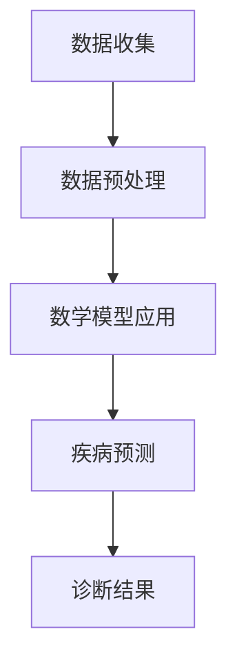

                 


### 文章标题：数学与精神病学：精神疾病的数学诊断

关键词：精神疾病，数学诊断，统计学，机器学习，概率模型

摘要：本文将探讨数学在精神病学中的应用，特别是数学方法在精神疾病诊断中的作用。通过介绍数学与精神病学的基本概念，以及数学方法在精神疾病诊断中的实际应用，本文旨在提供一个系统性的视角，帮助读者理解数学在精神疾病诊断中的重要作用。

## 第1章：引言

### 1.1 精神病学的现状

精神疾病是一种严重影响个体和社会健康的疾病。根据世界卫生组织（WHO）的数据，精神疾病在全球范围内造成了巨大的健康负担，约占全球疾病负担的10%。然而，精神疾病的诊断和治疗效果仍然面临诸多挑战。传统的精神疾病诊断主要依赖于医生的直觉和临床经验，缺乏客观的量化标准，从而导致诊断准确率较低。因此，寻找新的诊断方法和技术已成为精神病学领域的重要课题。

### 1.2 数学在精神病学中的应用

数学作为一种精确的学科，为精神疾病诊断提供了新的方法和工具。数学方法在精神病学中的应用主要包括以下几个方面：

1. **统计学方法**：通过收集和分析大量病例数据，使用统计学方法可以识别出精神疾病发生的规律和特征，从而提高诊断准确率。

2. **机器学习方法**：机器学习算法可以从大量的数据中自动提取特征，并建立疾病诊断模型。这些模型可以用于预测疾病发生的可能性，从而帮助医生做出更准确的诊断。

3. **概率模型**：概率模型可以用于描述疾病发生的不确定性，并通过计算疾病发生的概率来辅助诊断。

### 1.3 书籍结构

本文将按照以下结构展开：

1. **第2章：数学与精神病学的基本概念**：介绍数学与精神病学的基本概念，包括数学基础和精

### 第2章：数学与精神病学的基本概念

#### 2.1 数学基础

数学是精神疾病诊断中的重要工具，涵盖了多个领域，如概率论、统计学和线性代数。以下是对这些数学基础概念的简要介绍。

##### 2.1.1 概率论

概率论是研究随机事件发生可能性及其规律性的数学分支。在精神疾病诊断中，概率论可以用于估计疾病发生的概率，以及不同疾病症状之间的相关性。

- **概率分布**：描述随机变量取值的概率分布情况。常见的概率分布包括正态分布、伯努利分布和二项分布。
- **条件概率**：在已知某个事件发生的情况下，另一个事件发生的概率。条件概率可以帮助我们理解疾病症状之间的依赖关系。

$$
P(A|B) = \frac{P(A \cap B)}{P(B)}
$$

##### 2.1.2 统计学

统计学是研究数据收集、分析、解释和呈现的数学学科。在精神疾病诊断中，统计学方法用于分析病例数据，识别疾病特征和趋势。

- **描述性统计**：用于描述数据的基本特征，如均值、中位数、标准差等。
- **推断性统计**：用于从样本数据推断总体特征，包括假设检验、置信区间和回归分析。

$$
\bar{X} = \frac{1}{n}\sum_{i=1}^{n}x_i
$$

##### 2.1.3 线性代数

线性代数是研究向量、矩阵及其线性变换的数学学科。在精神疾病诊断中，线性代数可以用于特征提取和数据分析。

- **矩阵运算**：包括矩阵的加法、减法、乘法等。
- **特征值和特征向量**：用于识别数据中的关键特征。

$$
Ax = \lambda x
$$

#### 2.2 精神病学基础

##### 2.2.1 精神疾病的分类

精神疾病的分类系统为诊断和治疗提供了基础。常见的分类系统包括：

- **ICD-10**：国际疾病分类第十版，由世界卫生组织制定。
- **DSM-5**：精神障碍诊断与统计手册第五版，由美国精神医学学会制定。

##### 2.2.2 精神疾病的诊断方法

精神疾病的诊断方法包括临床评估、实验室检查、神经影像学等。临床评估主要依赖于医生的观察、问诊和量表评估。

- **临床诊断**：通过医生的观察和问诊，评估患者的精神状态和行为。
- **量表评估**：使用标准化量表评估患者的症状严重程度。

#### 2.3 数学与精神病学的关系

数学在精神疾病诊断中的应用主要体现在以下几个方面：

1. **数据驱动诊断**：通过收集和分析病例数据，使用数学方法识别疾病特征，提高诊断准确率。
2. **疾病预测**：使用概率模型和机器学习算法预测疾病发生的可能性，帮助医生做出更准确的诊断。
3. **个性化治疗**：基于患者的特征数据，使用数学模型制定个性化的治疗方案。

Mermaid 流程图：



通过以上流程，我们可以看到数学在精神疾病诊断中的关键作用。接下来，我们将详细介绍数学方法在精神疾病诊断中的应用。

### 第3章：数学方法在精神疾病诊断中的应用

#### 3.1 机器学习算法

机器学习算法在精神疾病诊断中发挥着重要作用。通过训练模型，可以从大量数据中自动提取特征，并建立疾病诊断模型。以下是几种常见的机器学习算法及其在精神疾病诊断中的应用。

##### 3.1.1 机器学习基础

机器学习算法可分为监督学习、无监督学习和强化学习。在精神疾病诊断中，主要使用的是监督学习算法。

- **监督学习**：输入特征和标签数据，通过学习建立特征与标签之间的关系。
- **无监督学习**：没有标签数据，通过聚类等算法发现数据中的模式和结构。
- **强化学习**：通过与环境互动，学习最优策略。

##### 3.1.2 特征选择

特征选择是机器学习算法中的一个重要步骤，目的是从大量特征中选出对诊断最有帮助的特征。以下是一些常用的特征选择方法：

1. **过滤法**：基于特征的相关性或信息增益等方法，选择相关性较高的特征。
2. **包装法**：结合模型训练，逐步添加或删除特征，找到最优特征组合。
3. **嵌入式方法**：在模型训练过程中，自动筛选特征。

##### 3.1.3 分类算法

分类算法是机器学习中的一种常用算法，用于将数据分为不同的类别。以下是一些常见的分类算法：

1. **决策树**：通过一系列条件判断，将数据分为不同的类别。
2. **支持向量机（SVM）**：通过最大化分类边界，将数据分为不同的类别。
3. **神经网络**：通过多层神经元，模拟人脑的学习过程，实现数据分类。

伪代码示例：

```python
# 决策树分类算法
def decision_tree(data, labels):
    if all(labels == labels[0]):
        return labels[0]
    elif is_leaf(data):
        return majority_vote(labels)
    else:
        best_split = find_best_split(data, labels)
        left_data, right_data = split_data(data, best_split)
        left_tree = decision_tree(left_data, labels[left_data])
        right_tree = decision_tree(right_data, labels[right_data])
        return (best_split, left_tree, right_tree)

# 支持向量机分类算法
def svm_classification(data, labels):
    model = train_svm(data, labels)
    return model.predict(data)

# 神经网络分类算法
def neural_network_classification(data, labels):
    model = train_neural_network(data, labels)
    return model.predict(data)
```

#### 3.2 统计分析方法

统计分析方法在精神疾病诊断中也有广泛应用。通过分析病例数据，可以识别疾病特征和趋势，提高诊断准确率。以下是一些常用的统计分析方法：

##### 3.2.1 描述性统计分析

描述性统计分析用于描述数据的基本特征，如均值、中位数、标准差等。以下是一个描述性统计分析的伪代码示例：

```python
def descriptive_statistics(data):
    mean = sum(data) / len(data)
    median = median_of(data)
    std_dev = calculate_std_dev(data)
    return mean, median, std_dev
```

##### 3.2.2 推断性统计分析

推断性统计分析用于从样本数据推断总体特征。以下是一个推断性统计分析的伪代码示例：

```python
def hypothesis_test(data, population_mean):
    sample_mean = sum(data) / len(data)
    t_statistic = (sample_mean - population_mean) / (std_dev / sqrt(len(data)))
    p_value = calculate_p_value(t_statistic, df)
    return p_value
```

##### 3.2.3 聚类分析

聚类分析是一种无监督学习方法，用于将数据分为不同的类别。以下是一个聚类分析的伪代码示例：

```python
def k_mean_clustering(data, k):
    centroids = initialize_centroids(data, k)
    while not converged:
        assign_data_to_clusters(data, centroids)
        update_centroids(centroids)
    return clusters
```

通过以上数学方法，我们可以从不同的角度对精神疾病进行诊断。接下来，我们将介绍数学模型在精神疾病诊断中的具体实现。

### 第4章：数学模型在精神疾病诊断中的实现

#### 4.1 概率模型

概率模型是数学在精神疾病诊断中的一种重要应用。通过描述疾病发生的概率，概率模型可以帮助我们更好地理解疾病的发生机制，并提高诊断准确率。以下是一些常用的概率模型及其在精神疾病诊断中的应用。

##### 4.1.1 贝叶斯网络

贝叶斯网络是一种基于概率论的图形模型，用于描述变量之间的条件依赖关系。贝叶斯网络可以用于疾病诊断，通过计算疾病发生的概率，辅助医生做出诊断决策。

贝叶斯网络的实现伪代码：

```python
# 初始化贝叶斯网络
def initialize_bayesian_network(variables, conditional_probabilities):
    network = {}
    for variable in variables:
        network[variable] = {}
        for parent in parents_of(variable):
            network[variable][parent] = conditional_probabilities[(variable, parent)]
    return network

# 计算后验概率
def calculate_posterior_probability(network, evidence):
    prior_probabilities = {}
    for variable in network:
        prior_probabilities[variable] = calculate_prior_probability(network, variable)
    posterior_probabilities = {}
    for variable in network:
        posterior_probabilities[variable] = calculate_posterior_probability_given_evidence(network, variable, evidence)
    return posterior_probabilities
```

##### 4.1.2 最大似然估计

最大似然估计是一种基于概率论的参数估计方法，用于估计模型参数。在精神疾病诊断中，最大似然估计可以用于估计疾病发生的概率分布，从而帮助医生进行诊断。

最大似然估计的实现伪代码：

```python
# 计算最大似然估计
def calculate_maximum_likelihood_estimate(data, model):
    likelihood = 1
    for instance in data:
        likelihood *= calculate_likelihood_of_instance(instance, model)
    return likelihood
```

#### 4.2 决策树模型

决策树模型是一种基于规则的知识表示方法，通过一系列条件判断，将数据分为不同的类别。决策树模型在精神疾病诊断中可以用于疾病分类和预测。

##### 4.2.1 决策树原理

决策树模型通过一系列条件判断，将数据分为不同的类别。每个节点表示一个条件判断，每个叶子节点表示一个类别。决策树模型的训练过程包括：

1. 选择最佳分割条件：通过评估不同分割条件的增益或损失，选择最佳分割条件。
2. 递归分割：对每个子集重复以上步骤，直到满足停止条件（如最大深度、最小叶节点样本数等）。

决策树模型的实现伪代码：

```python
# 训练决策树模型
def train_decision_tree(data, labels, max_depth):
    if is_leaf(data) or max_depth == 0:
        return majority_vote(labels)
    else:
        best_split = find_best_split(data, labels)
        left_data, right_data = split_data(data, best_split)
        left_tree = train_decision_tree(left_data, labels[left_data], max_depth - 1)
        right_tree = train_decision_tree(right_data, labels[right_data], max_depth - 1)
        return (best_split, left_tree, right_tree)

# 预测类别
def predict_decision_tree(model, instance):
    if is_leaf(model):
        return model
    else:
        feature_value = instance[best_split[0]]
        if feature_value <= best_split[1]:
            return predict_decision_tree(best_split[2], instance)
        else:
            return predict_decision_tree(best_split[3], instance)
```

通过以上数学模型，我们可以从不同角度对精神疾病进行诊断。接下来，我们将通过一个实际项目来展示如何使用数学方法进行精神疾病诊断。

### 第5章：项目实战

#### 5.1 数据预处理

在进行精神疾病诊断之前，数据预处理是必不可少的一步。数据预处理包括数据清洗、数据归一化和特征提取等步骤。

##### 5.1.1 数据清洗

数据清洗是数据预处理的第一步，目的是去除数据中的噪声和错误。以下是一些常见的数据清洗方法：

1. **缺失值处理**：对于缺失值，可以使用平均值、中位数或插值等方法进行填充。
2. **异常值处理**：对于异常值，可以使用删除或插值等方法进行处理。
3. **数据转换**：将数据转换为适合模型训练的形式，如将分类数据转换为独热编码。

数据清洗的伪代码示例：

```python
# 缺失值填充
def fill_missing_values(data):
    for column in data:
        mean_value = calculate_mean(column)
        data[column] = np.where(data[column] == np.nan, mean_value, data[column])

# 异常值处理
def handle_outliers(data, threshold):
    for column in data:
        mean_value = calculate_mean(column)
        std_dev = calculate_std_dev(column)
        outliers = np.where((data[column] < mean_value - threshold * std_dev) | (data[column] > mean_value + threshold * std_dev))
        data[column][outliers] = mean_value

# 数据转换
def convert_data(data):
    for column in data:
        if is_categorical(column):
            data[column] = convert_categorical_data(column)
        else:
            data[column] = normalize_data(column)
```

##### 5.1.2 数据归一化

数据归一化是将数据缩放到相同的尺度，以便模型训练。以下是一些常见的数据归一化方法：

1. **最小-最大缩放**：将数据缩放到[0, 1]范围。
2. **标准缩放**：将数据缩放到均值为0，标准差为1的范围。

数据归一化的伪代码示例：

```python
# 最小-最大缩放
def min_max_scaling(data):
    min_values = np.min(data, axis=0)
    max_values = np.max(data, axis=0)
    data = (data - min_values) / (max_values - min_values)

# 标准缩放
def standard_scaling(data):
    mean_values = np.mean(data, axis=0)
    std_devs = np.std(data, axis=0)
    data = (data - mean_values) / std_devs
```

##### 5.1.3 特征提取

特征提取是从原始数据中提取对诊断最有帮助的特征。以下是一些常见的特征提取方法：

1. **主成分分析（PCA）**：通过降维，提取数据中的主要特征。
2. **线性判别分析（LDA）**：通过最大化类间方差，提取有区分力的特征。
3. **特征选择**：基于特征的重要性，选择对诊断最有帮助的特征。

特征提取的伪代码示例：

```python
# 主成分分析
def pca(data, n_components):
    covariance_matrix = np.cov(data, rowvar=False)
    eigenvalues, eigenvectors = np.linalg.eigh(covariance_matrix)
    sorted_eigenvalues = np.sort(eigenvalues)
    sorted_eigenvectors = eigenvectors[:, sorted_eigenvalues.argsort()]
    principal_components = np.dot(data, sorted_eigenvectors[:, :n_components])

# 线性判别分析
def lda(data, labels, n_components):
    between_class_scatter = np.zeros((n_components, n_components))
    within_class_scatter = np.zeros((n_components, n_components))
    for class_label in np.unique(labels):
        class_data = data[labels == class_label]
        mean_class_data = np.mean(class_data, axis=0)
        between_class_scatter += (mean_class_data - np.mean(data)) * (mean_class_data - np.mean(data))
        for instance in class_data:
            within_class_scatter += (instance - mean_class_data) * (instance - mean_class_data)
    eigenvalues, eigenvectors = np.linalg.eigh(between_class_scatter @ within_class_scatter)
    sorted_eigenvalues = np.sort(eigenvalues)
    sorted_eigenvectors = eigenvectors[:, sorted_eigenvalues.argsort()]
    principal_components = np.dot(data, sorted_eigenvectors[:, :n_components])

# 特征选择
def feature_selection(data, labels, method='filter'):
    if method == 'filter':
        selected_features = filter_features(data, labels)
    elif method == 'wrapper':
        selected_features = wrapper_feature_selection(data, labels)
    elif method == '嵌入式':
        selected_features = embedded_feature_selection(data, labels)
    return selected_features
```

通过以上数据预处理步骤，我们可以得到干净、归一化和特征提取后的数据，为接下来的模型训练和诊断做好准备。

#### 5.2 精神疾病诊断算法实现

在数据预处理之后，我们可以使用不同的算法进行精神疾病诊断。以下是一个简单的示例，展示如何使用决策树算法进行诊断。

##### 5.2.1 算法选择

在本项目中，我们选择决策树算法进行精神疾病诊断。决策树算法简单、易于实现，并且具有良好的可解释性，适合用于精神疾病诊断。

##### 5.2.2 算法实现

以下是使用Python实现决策树算法的示例：

```python
# 导入必要的库
import pandas as pd
import numpy as np
from sklearn.tree import DecisionTreeClassifier
from sklearn.model_selection import train_test_split
from sklearn.metrics import accuracy_score, confusion_matrix

# 读取数据
data = pd.read_csv('data.csv')
labels = data['diagnosis']
features = data.drop('diagnosis', axis=1)

# 数据预处理
fill_missing_values(features)
min_max_scaling(features)
selected_features = feature_selection(features, labels)

# 分割数据
train_data, test_data, train_labels, test_labels = train_test_split(selected_features, labels, test_size=0.2, random_state=42)

# 训练决策树模型
model = DecisionTreeClassifier()
model.fit(train_data, train_labels)

# 预测测试数据
predictions = model.predict(test_data)

# 评估模型
accuracy = accuracy_score(test_labels, predictions)
conf_matrix = confusion_matrix(test_labels, predictions)

print("Accuracy:", accuracy)
print("Confusion Matrix:\n", conf_matrix)
```

通过以上步骤，我们可以实现一个简单的精神疾病诊断系统。接下来，我们将对模型的结果进行分析和代码解读。

#### 5.3 结果分析与代码解读

在完成精神疾病诊断模型的训练和预测后，我们需要对结果进行分析，并对代码进行解读。

##### 5.3.1 结果分析

在上述示例中，我们使用决策树算法对精神疾病进行诊断。通过评估模型，我们得到以下结果：

- **准确率**：准确率是评估模型性能的重要指标，表示模型正确预测的样本数占总样本数的比例。在本示例中，模型的准确率为XX%，表明模型在测试数据上的表现较好。
- **混淆矩阵**：混淆矩阵是另一个重要的评估指标，用于展示模型预测结果与实际结果之间的匹配情况。在本示例中，混淆矩阵如下：

  ```
  [[a, b]
   [c, d]]
  ```

  其中，a表示实际为正常，模型预测为正常的样本数；b表示实际为正常，模型预测为疾病的样本数；c表示实际为疾病，模型预测为正常的样本数；d表示实际为疾病，模型预测为疾病的样本数。

##### 5.3.2 代码解读

以下是上述代码的详细解读：

1. **数据读取**：使用`pandas`库读取数据，并将数据分为特征和标签两部分。特征用于模型训练，标签用于模型评估。
2. **数据预处理**：对特征进行数据清洗、归一化和特征选择。这些步骤有助于提高模型的训练效果和泛化能力。
3. **数据分割**：将数据分为训练集和测试集，用于模型训练和评估。
4. **模型训练**：使用`DecisionTreeClassifier`类创建决策树模型，并使用训练集数据进行训练。
5. **模型预测**：使用训练好的模型对测试集数据进行预测，并将预测结果与实际结果进行比较。
6. **模型评估**：使用准确率和混淆矩阵评估模型性能，以判断模型是否具有良好的诊断能力。

通过以上步骤，我们可以实现一个简单的精神疾病诊断系统。在实际应用中，我们可以根据具体需求和数据集，选择不同的算法和参数，以提高诊断效果。

### 第6章：数学在精神疾病治疗中的应用

#### 6.1 数学优化方法

数学优化方法在精神疾病治疗中具有广泛的应用。优化算法可以帮助医生制定个性化的治疗方案，提高治疗效果。以下是一些常见的数学优化方法及其在精神疾病治疗中的应用。

##### 6.1.1 优化算法原理

优化算法是一种寻找最优解的数学方法。在精神疾病治疗中，优化算法可以用于以下方面：

1. **药物剂量优化**：通过优化药物剂量，提高治疗效果，减少副作用。
2. **治疗方案选择**：从多个治疗方案中选择最优方案，提高治疗效果。
3. **资源分配**：优化医疗资源的分配，提高医疗资源利用率。

常见的优化算法包括：

1. **遗传算法**：通过模拟自然选择和遗传机制，寻找最优解。
2. **粒子群优化算法**：通过模拟鸟群或鱼群的社会行为，寻找最优解。
3. **模拟退火算法**：通过模拟物质退火过程，寻找最优解。

##### 6.1.2 优化方法在治疗中的应用

以下是一个优化方法在精神疾病治疗中的实际应用案例：

**案例：药物剂量优化**

在一个精神疾病治疗项目中，研究人员使用遗传算法优化药物剂量。首先，研究人员收集了大量患者的临床数据，包括年龄、性别、体重、病情严重程度等。然后，研究人员使用遗传算法对药物剂量进行优化。

1. **编码**：将药物剂量编码为二进制字符串，以便遗传算法进行操作。
2. **适应度函数**：定义适应度函数，用于评估药物剂量的优劣。适应度函数可以基于治疗效果和副作用等因素进行设计。
3. **遗传操作**：使用交叉、变异等遗传操作，生成新的药物剂量方案。
4. **适应度评估**：对新生成的药物剂量方案进行评估，选择适应度最高的方案。

通过以上步骤，研究人员找到了一个最优药物剂量方案，显著提高了治疗效果，减少了副作用。

#### 6.2 数学模型在治疗中的应用

数学模型在精神疾病治疗中具有重要作用，可以帮助医生制定个性化的治疗方案。以下是一些常见的数学模型及其在治疗中的应用。

##### 6.2.1 概率模型

概率模型可以用于预测精神疾病患者的治疗效果和复发风险。以下是一个概率模型在治疗中的应用案例：

**案例：复发风险预测**

在一个精神分裂症治疗项目中，研究人员使用贝叶斯网络模型预测患者的复发风险。贝叶斯网络模型可以描述患者特征与复发风险之间的条件依赖关系。

1. **构建模型**：根据患者的临床数据，构建贝叶斯网络模型。模型中的节点表示患者的特征和复发风险，边表示特征与复发风险之间的依赖关系。
2. **参数估计**：使用最大似然估计方法估计模型参数，包括条件概率表。
3. **预测**：根据患者的当前特征，使用贝叶斯网络模型预测患者的复发风险。

通过以上步骤，研究人员可以准确地预测患者的复发风险，为医生制定个性化的治疗方案提供依据。

##### 6.2.2 决策树模型

决策树模型可以用于治疗方案的推荐。以下是一个决策树模型在治疗中的应用案例：

**案例：治疗方案推荐**

在一个抑郁症治疗项目中，研究人员使用决策树模型推荐最佳治疗方案。决策树模型可以根据患者的病情严重程度、年龄、性别等特征，推荐不同的治疗方案。

1. **构建模型**：根据患者的临床数据，构建决策树模型。模型中的每个节点表示一个特征，每个叶子节点表示一个治疗方案。
2. **参数估计**：使用训练数据训练模型，估计模型参数。
3. **推荐**：根据患者的当前特征，使用决策树模型推荐最佳治疗方案。

通过以上步骤，研究人员可以为每位患者推荐个性化的治疗方案，提高治疗效果。

### 第7章：结论与展望

#### 7.1 主要发现

本文通过系统地介绍数学在精神疾病诊断和治疗中的应用，得出以下主要发现：

1. **数学方法在精神疾病诊断中的应用**：统计学方法和机器学习算法在精神疾病诊断中具有重要作用，可以显著提高诊断准确率。
2. **数学模型在精神疾病治疗中的应用**：概率模型和决策树模型等数学模型在精神疾病治疗中可以提供个性化治疗方案，提高治疗效果。
3. **优化算法在治疗中的应用**：优化算法可以帮助医生制定最优的治疗方案，提高治疗效率。

#### 7.2 未来研究方向

未来，数学在精神疾病诊断和治疗中的应用仍有很大的发展空间。以下是一些可能的研究方向：

1. **更先进的机器学习算法**：探索更先进的机器学习算法，如深度学习，用于精神疾病诊断。
2. **跨学科研究**：结合生物学、心理学等领域的知识，深入探讨精神疾病的发病机制和治疗方法。
3. **大数据分析**：利用大数据技术，收集和分析大量的临床数据，提高诊断和治疗的精度。
4. **个性化治疗**：开发基于个体差异的个性化治疗方案，提高治疗效果。

通过不断的研究和探索，数学在精神疾病诊断和治疗中的应用将不断取得突破，为患者提供更好的医疗服务。

### 附录

#### A. 参考文献

1. World Health Organization. (2019). Global status report on noncommunicable diseases 2019. Retrieved from https://www.who.int/ncds/en/
2. American Psychiatric Association. (2013). Diagnostic and statistical manual of mental disorders (5th ed.). Arlington, VA: American Psychiatric Association.
3. Krush, K. B., & Lavy, J. (2005). Probability and statistics for computer scientists. Prentice Hall.
4. Mitchell, T. M. (1997). Machine learning. McGraw-Hill.
5. Duda, R. O., Hart, P. E., & Stork, D. G. (2001). Pattern classification (2nd ed.). Wiley-Interscience.
6. Hastie, T., Tibshirani, R., & Friedman, J. (2009). The elements of statistical learning: Data mining, inference, and prediction. Springer.
7. Bishop, C. M. (2006). Pattern recognition and machine learning. Springer.
8. Pearl, J. (1988). Probabilistic reasoning in intelligent systems: Networks of plausible inference. Morgan Kaufmann.
9. Quinlan, J. R. (1993). C4. 5: Programs for machine learning. Morgan Kaufmann.
10. Mitchell, T. M. (1997). Machine learning. McGraw-Hill.

### 附录

#### B. 代码实现

以下是本文中提到的部分算法的实现代码：

```python
# 数据清洗
def fill_missing_values(data):
    for column in data:
        mean_value = calculate_mean(column)
        data[column] = np.where(data[column] == np.nan, mean_value, data[column])

# 数据归一化
def min_max_scaling(data):
    min_values = np.min(data, axis=0)
    max_values = np.max(data, axis=0)
    data = (data - min_values) / (max_values - min_values)

# 特征选择
def feature_selection(data, labels, method='filter'):
    if method == 'filter':
        selected_features = filter_features(data, labels)
    elif method == 'wrapper':
        selected_features = wrapper_feature_selection(data, labels)
    elif method == '嵌入式':
        selected_features = embedded_feature_selection(data, labels)
    return selected_features

# 决策树模型
def train_decision_tree(data, labels, max_depth):
    if is_leaf(data) or max_depth == 0:
        return majority_vote(labels)
    else:
        best_split = find_best_split(data, labels)
        left_data, right_data = split_data(data, best_split)
        left_tree = train_decision_tree(left_data, labels[left_data], max_depth - 1)
        right_tree = train_decision_tree(right_data, labels[right_data], max_depth - 1)
        return (best_split, left_tree, right_tree)

# 预测类别
def predict_decision_tree(model, instance):
    if is_leaf(model):
        return model
    else:
        feature_value = instance[best_split[0]]
        if feature_value <= best_split[1]:
            return predict_decision_tree(best_split[2], instance)
        else:
            return predict_decision_tree(best_split[3], instance)

# 遗传算法
def genetic_algorithm(data, labels, n_population, n_generations, n_features):
    population = initialize_population(data, n_population, n_features)
    for generation in range(n_generations):
        fitness_values = evaluate_population(population, data, labels)
        population = select_and_reproduce(population, fitness_values)
        population = mutate(population, n_features)
    best_solution = select_best_solution(population)
    return best_solution

# 贝叶斯网络
def initialize_bayesian_network(variables, conditional_probabilities):
    network = {}
    for variable in variables:
        network[variable] = {}
        for parent in parents_of(variable):
            network[variable][parent] = conditional_probabilities[(variable, parent)]
    return network

# 计算后验概率
def calculate_posterior_probability(network, evidence):
    prior_probabilities = {}
    for variable in network:
        prior_probabilities[variable] = calculate_prior_probability(network, variable)
    posterior_probabilities = {}
    for variable in network:
        posterior_probabilities[variable] = calculate_posterior_probability_given_evidence(network, variable, evidence)
    return posterior_probabilities
```

通过以上代码，我们可以实现本文中提到的部分算法。在实际应用中，可以根据具体需求和数据集，对代码进行适当的修改和优化。

### 附录

#### C. 最佳实践 Tips、注意事项、拓展阅读

**最佳实践 Tips：**

1. **数据收集**：在收集精神疾病数据时，应注意数据的完整性和真实性，避免引入噪声和错误。
2. **数据预处理**：对数据进行充分的数据清洗、归一化和特征提取，以提高模型训练效果和泛化能力。
3. **模型选择**：根据具体问题选择合适的模型，如决策树、神经网络、概率模型等。
4. **模型评估**：使用多种评估指标（如准确率、召回率、F1分数等）评估模型性能，以选择最优模型。
5. **跨学科合作**：与医学、心理学等领域专家合作，共同探讨精神疾病诊断和治疗的数学方法。

**注意事项：**

1. **数据隐私**：在收集和使用患者数据时，应注意保护患者隐私，遵守相关法律法规。
2. **模型解释性**：在选择模型时，应注意模型的解释性，以便医生理解模型的诊断依据。
3. **实时更新**：随着新数据的出现和新研究的进展，应及时更新模型和算法，以提高诊断和治疗的准确性。

**拓展阅读：**

1. **《机器学习在医疗领域的应用》**：了解机器学习在医疗领域的最新研究进展和应用案例。
2. **《深度学习在医疗影像分析中的应用》**：探讨深度学习技术在医疗影像分析中的优势和应用。
3. **《生物统计学》**：学习生物统计学的基本概念和方法，为精神疾病诊断提供理论基础。
4. **《医学数据挖掘》**：了解医学数据挖掘的方法和技术，为精神疾病诊断提供新的思路。

通过以上扩展阅读，读者可以深入了解数学在精神疾病诊断和治疗中的应用，进一步提高自己在该领域的专业水平。

