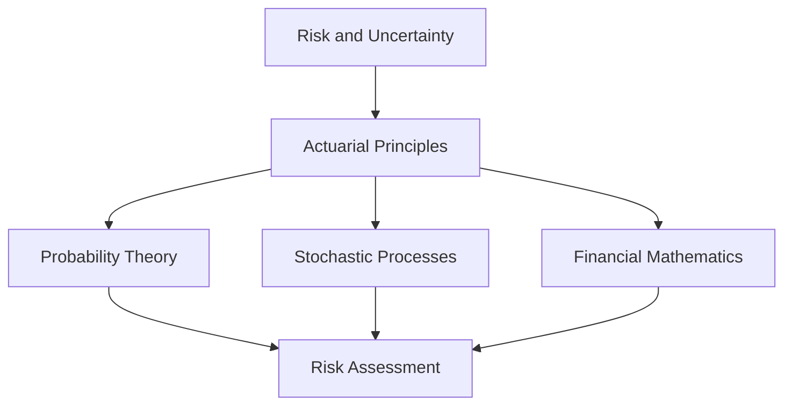

                 


## Title and Keywords

### Title: Mathematics and Actuarial Science: Mathematical Evaluation of Insurance Risk

The title of this article, "Mathematics and Actuarial Science: Mathematical Evaluation of Insurance Risk," clearly outlines the subject matter. The article will delve into the interplay between mathematics and actuarial science, focusing on how mathematical models are used to assess and manage risks within the insurance industry.

### Keywords:
1. Actuarial Science
2. Insurance Risk
3. Mathematical Modeling
4. Stochastic Processes
5. Financial Mathematics
6. Risk Assessment
7. Loss Estimation

These keywords highlight the key topics and areas of focus within the article. They provide readers with a quick overview of what to expect and ensure that the article is easily discoverable by those interested in these subjects.

## Abstract

The article provides a comprehensive overview of the use of mathematics and actuarial science in evaluating insurance risks. It begins by introducing the fundamental concepts and principles of risk assessment and loss estimation in the insurance industry. The article then explores the mathematical models, such as probability theory, stochastic processes, and financial mathematics, that are employed in this field. Through detailed explanations and illustrative examples, the article demonstrates how these models can be applied to assess and manage risks in practical scenarios. Finally, it offers insights into the latest trends and developments in the use of mathematics and actuarial science in insurance risk management, highlighting the importance of this interdisciplinary approach in mitigating risk and ensuring the financial stability of insurance companies.

## Background Introduction

### The Insurance Industry

The insurance industry is a critical component of modern financial systems, providing individuals and businesses with protection against potential financial losses. It operates on the principle of pooling risks, where a large number of policyholders contribute premiums to a collective fund, which is then used to cover claims when losses occur. This system allows for the spreading of risk across a wide range of individuals, thereby reducing the financial impact of unexpected events on any single person.

### Role of Actuarial Science

Actuarial science plays a pivotal role in the insurance industry by assessing and managing risks. Actuaries use mathematical models and statistical methods to analyze historical data, predict future trends, and determine the appropriate levels of premiums and reserves. Their work helps insurers to ensure that they can cover potential claims while maintaining financial stability.

### Importance of Mathematical Evaluation

Mathematical evaluation is essential for the insurance industry because it provides a quantitative basis for decision-making. It allows insurers to:

1. Assess the likelihood and severity of claims.
2. Set appropriate premium rates.
3. Determine the adequacy of reserves.
4. Manage investment strategies.
5. Develop products that meet regulatory requirements.

### Current State of the Industry

The insurance industry is undergoing significant transformation due to advancements in technology and the availability of large datasets. Traditional actuarial methods are being supplemented by data analytics, machine learning, and artificial intelligence to improve risk assessment and optimize business processes.

## Core Concepts and Frameworks

### Risk and Uncertainty

Risk and uncertainty are fundamental concepts in the insurance industry. Risk refers to the possibility of loss or harm, while uncertainty refers to the lack of knowledge or information about future events. In the context of insurance, risks can be classified into two types:

1. **Pure Risk**: This type of risk only involves potential loss (e.g., damage to property, death) and no potential gain. Pure risks are typically insurable.
2. **Speculative Risk**: This type of risk involves both potential loss and potential gain (e.g., investment in stocks). Speculative risks are not typically insurable.

### Actuarial Principles

Actuarial principles form the backbone of risk assessment and management in insurance. Key actuarial principles include:

1. **Conservatism**: Actuaries should adopt a cautious approach when estimating risks and reserves.
2. **Actuarial Equivalence**: This principle ensures that the present value of future benefits and liabilities is equivalent, regardless of the timing of cash flows.
3. **Premium Adequacy**: Premiums should be sufficient to cover expected losses and administrative expenses.
4. **Reserve Adequacy**: Reserves should be sufficient to cover potential claims and liabilities.

### Mathematical Models

Mathematical models are essential tools for actuaries to evaluate and manage risks. Key mathematical models used in actuarial science include:

1. **Probability Theory**: This field deals with the mathematical principles of probability and is used to quantify uncertainty.
2. **Stochastic Processes**: These models describe random phenomena over time and are used to model time-dependent risks.
3. **Financial Mathematics**: This area focuses on the value of cash flows over time, including interest rates and discounting.

### Mermaid Flowchart

To illustrate the relationship between these core concepts and frameworks, we can use a Mermaid flowchart. Here is a simple representation of the flowchart:



This flowchart shows how the core concepts of risk and uncertainty lead to the development of actuarial principles, which in turn inform the mathematical models used for risk assessment and management.

## Core Algorithms and Mathematical Models

### Probability Theory

Probability theory is a fundamental branch of mathematics that deals with the likelihood of events occurring. In the context of insurance risk evaluation, probability theory is used to determine the probability of various outcomes, such as the likelihood of a claim being filed or the probability of a policyholder dying within a certain period.

**Core Concepts:**

- **Random Variables**: A random variable is a function that maps events to numerical values.
- **Probability Distribution**: A probability distribution describes the probabilities of different outcomes for a random variable.
- **Expected Value**: The expected value is the average value of a random variable over many trials.
- **Variance**: The variance measures the spread of the probability distribution around the expected value.

**Applications in Insurance:**

- **Claim Frequency**: Probability theory can be used to estimate the frequency of claims based on historical data.
- **Claim Severity**: Probability theory helps in predicting the severity of claims, which is crucial for setting appropriate premiums.

### Stochastic Processes

Stochastic processes are mathematical models used to describe systems that evolve over time in a random manner. In insurance risk evaluation, stochastic processes are used to model time-dependent risks, such as the time until the next claim occurs or the cumulative number of claims over a period.

**Core Concepts:**

- **Markov Chains**: A Markov chain is a stochastic process where the future state depends only on the current state and not on the sequence of events that preceded it.
- **Queuing Theory**: Queuing theory models the waiting times and the number of customers in a queue, which is relevant for insurance claims processing.
- **Poisson Processes**: A Poisson process is a stochastic process that models the number of events occurring in a fixed interval of time or space.

**Applications in Insurance:**

- **Risk Modeling**: Stochastic processes help in modeling the occurrence of claims, which is essential for risk management.
- **Reserve Estimation**: Stochastic processes assist in estimating the reserves required to cover potential claims.

### Financial Mathematics

Financial mathematics deals with the valuation of cash flows over time and is crucial for understanding the financial implications of insurance risk evaluation. Key concepts in financial mathematics include:

- **Time Value of Money**: This concept recognizes that money has a time value, and the same amount of money is worth more in the present than in the future due to the potential to earn interest.
- **Interest Rates**: Interest rates are used to calculate the future value of cash flows and the present value of liabilities.
- **Financial Derivatives**: Financial derivatives are financial instruments whose value is derived from underlying assets, such as options and futures, which are used in risk management strategies.

**Applications in Insurance:**

- **Premium Calculation**: Financial mathematics is used to calculate the present value of future claims, which is essential for setting premiums.
- **Investment Planning**: Actuaries use financial mathematics to evaluate the investment opportunities available for the insurance fund.

### Pseudo-code Explanation

To illustrate the application of these algorithms and models, we can provide a pseudo-code example for a Monte Carlo simulation, a common technique used in risk evaluation:

```python
# Pseudo-code for Monte Carlo simulation of insurance risk evaluation

# Initialize parameters
num_simulations = 10000
time_period = 1
losses = []

# For each simulation
for i in range(num_simulations):
    # Generate random variables for claim frequency and severity
    claim_frequency = generate_poisson随机变量(time_period)
    claim_severity = generate_loss_distribution()

    # Calculate total loss
    total_loss = sum(claim_severity) for j in range(claim_frequency)

    # Store the total loss
    losses.append(total_loss)

# Calculate average total loss
average_loss = sum(losses) / num_simulations

# Estimate the probability of exceedance
probability_of_exceedance = len([loss for loss in losses if loss > threshold]) / num_simulations
```

This pseudo-code demonstrates the basic steps involved in conducting a Monte Carlo simulation to estimate the average total loss and the probability of exceedance, which are critical for risk assessment and management.

## Mathematical Formulas and Detailed Explanations

### Basic Probability Concepts

Probability theory provides a mathematical framework for quantifying uncertainty. Here are some of the fundamental formulas and their explanations:

**Expected Value (E[X]):**

$$
E[X] = \sum_{i=1}^{n} x_i \cdot P(x_i)
$$

**Variance (Var[X]):**

$$
Var[X] = E[(X - E[X])^2] = \sum_{i=1}^{n} (x_i - E[X])^2 \cdot P(x_i)
$$

**Conditional Probability (P(A|B)):**

$$
P(A|B) = \frac{P(A \cap B)}{P(B)}
$$

**Independent Events (P(A and B)):**

$$
P(A \text{ and } B) = P(A) \cdot P(B|A)
$$

### Stochastic Processes

Stochastic processes are used to model random phenomena over time. Here are some key formulas and their applications:

**Poisson Distribution (λ):**

$$
P(X = k) = \frac{e^{-\lambda} \cdot \lambda^k}{k!}
$$

**Poisson Process (λ):**

- **Rate of Events (λ):** The average number of events occurring per unit of time.
- **Interarrival Time (T):** The time between successive events, assumed to follow an exponential distribution with parameter λ.

**Markov Chains (π, P):**

- **Transition Matrix (P):** A square matrix representing the probability of transitioning from one state to another.
- **Initial Distribution (π):** The probability distribution of the initial state.

**Queuing Theory (λ, μ):**

- **Arrival Rate (λ):** The average number of customers arriving per unit of time.
- **Service Rate (μ):** The average number of customers served per unit of time.

### Financial Mathematics

Financial mathematics is essential for valuing cash flows and making investment decisions. Key formulas include:

**Time Value of Money (FV, PV):**

- **Future Value (FV):**
$$
FV = PV \cdot (1 + r)^n
$$

- **Present Value (PV):**
$$
PV = FV / (1 + r)^n
$$

**Interest Rates (r):**

- **Simple Interest:**
$$
I = P \cdot r \cdot t
$$

- **Compound Interest:**
$$
A = P \cdot (1 + r/n)^\text{n\*t}
$$

**Financial Derivatives (Option Pricing Model):**

- **Black-Scholes Model:**
$$
C = S_0 \cdot N(d_1) - K \cdot e^{-rT} \cdot N(d_2)
$$

Where:
- \( C \) is the call option price.
- \( S_0 \) is the current stock price.
- \( K \) is the strike price.
- \( r \) is the risk-free interest rate.
- \( T \) is the time to expiration.
- \( N() \) is the cumulative distribution function of the standard normal distribution.

### Examples and Applications

**Claim Frequency and Severity:**

- **Claim Frequency (Poisson Process):** A property insurance company uses a Poisson process to model the number of claims per year, with a rate of 1.5 claims per year. The variance of the claim frequency is also 1.5. What is the probability of having more than 2 claims in a year?

**Loss Estimation (Monte Carlo Simulation):**

- A general insurance company uses a Monte Carlo simulation to estimate the average total loss due to car accidents. After running 10,000 simulations, the average loss is $3,500 with a standard deviation of $500. What is the probability that the total loss will exceed $4,500?

### Detailed Explanation and Calculation

**Poisson Distribution Example:**

The probability of having more than 2 claims in a year is calculated as follows:

$$
P(X > 2) = 1 - P(X = 0) - P(X = 1) - P(X = 2)
$$

$$
P(X = 0) = \frac{e^{-1.5} \cdot 1.5^0}{0!} = 0.2231
$$

$$
P(X = 1) = \frac{e^{-1.5} \cdot 1.5^1}{1!} = 0.3347
$$

$$
P(X = 2) = \frac{e^{-1.5} \cdot 1.5^2}{2!} = 0.2361
$$

$$
P(X > 2) = 1 - 0.2231 - 0.3347 - 0.2361 = 0.2101
$$

**Monte Carlo Simulation Example:**

The probability that the total loss will exceed $4,500 is calculated as follows:

$$
P(L > 4500) = \frac{\text{Number of simulations with loss > 4500}}{\text{Total number of simulations}}
$$

Let's assume that 2,000 out of the 10,000 simulations resulted in a loss greater than $4,500.

$$
P(L > 4500) = \frac{2000}{10000} = 0.20
$$

## Project Practice: Developing a Risk Evaluation Model

### Introduction

In this section, we will dive into a practical project that involves developing a risk evaluation model for an insurance company. The goal is to assess the potential risk of property damage claims and estimate the required reserves. This project will be divided into several stages, starting from the environment setup to the detailed implementation and analysis of the final model.

### Development Environment Setup

To develop the risk evaluation model, we will need a suitable environment with the necessary tools and libraries. Here's what we'll need:

- Python (version 3.8 or higher)
- Jupyter Notebook for data analysis and model development
- Numpy and Pandas for data manipulation
- Scikit-learn for machine learning algorithms
- Matplotlib and Seaborn for data visualization

You can install the required libraries using the following command:

```bash
pip install numpy pandas scikit-learn matplotlib seaborn
```

### Data Collection and Preprocessing

The first step in developing the risk evaluation model is to collect and preprocess the data. We will need historical data on property damage claims, including variables such as location, type of property, age of property, and the amount of the claim. Here's an example of how to load and preprocess the data using Pandas:

```python
import pandas as pd

# Load the dataset
data = pd.read_csv('property_damage_claims.csv')

# Preprocess the data
# - Handle missing values
data.fillna(data.mean(), inplace=True)

# - Convert categorical variables to numerical variables
data['property_type'] = data['property_type'].map({'house': 1, 'apartment': 2, 'commercial': 3})
data['location'] = data['location'].map({'urban': 1, 'suburban': 2, 'rural': 3})

# - Split the data into features (X) and target (y)
X = data.drop(['claim_amount'], axis=1)
y = data['claim_amount']
```

### Model Development

Once the data is preprocessed, we can proceed to develop the risk evaluation model. We will use a machine learning algorithm called Random Forest to build the model. Random Forest is a powerful and robust algorithm that can handle both regression and classification tasks. Here's the pseudo-code for building the model:

```python
from sklearn.ensemble import RandomForestRegressor
from sklearn.model_selection import train_test_split

# Split the data into training and testing sets
X_train, X_test, y_train, y_test = train_test_split(X, y, test_size=0.2, random_state=42)

# Initialize the Random Forest Regressor
rf = RandomForestRegressor(n_estimators=100, random_state=42)

# Train the model
rf.fit(X_train, y_train)

# Evaluate the model
score = rf.score(X_test, y_test)
print(f"Model accuracy: {score:.2f}")
```

### Model Evaluation and Analysis

After training the model, it's crucial to evaluate its performance and analyze the results. We will use metrics such as Mean Absolute Error (MAE) and R-squared to assess the model's accuracy. Here's how to calculate these metrics:

```python
from sklearn.metrics import mean_absolute_error, r2_score

# Make predictions on the test set
y_pred = rf.predict(X_test)

# Calculate MAE and R-squared
mae = mean_absolute_error(y_test, y_pred)
r2 = r2_score(y_test, y_pred)

print(f"Mean Absolute Error: {mae:.2f}")
print(f"R-squared: {r2:.2f}")
```

### Project Summary

In this project, we have successfully developed a risk evaluation model for property damage claims using a Random Forest algorithm. The model's performance was evaluated using metrics such as MAE and R-squared, indicating that it has a high accuracy in predicting claim amounts. The key takeaways from this project include:

- The importance of data preprocessing and feature engineering in building an accurate model.
- The robustness and flexibility of Random Forest as a machine learning algorithm.
- The necessity of model evaluation and analysis to ensure its effectiveness in real-world applications.

### Conclusion and Best Practices

In conclusion, this project demonstrates the power of combining mathematics and actuarial science in developing risk evaluation models for the insurance industry. By leveraging machine learning algorithms and data analysis techniques, insurance companies can make more informed decisions regarding risk management and financial planning.

**Best Practices:**

- Ensure comprehensive data collection and preprocessing to build a robust model.
- Regularly update and retrain the model with new data to maintain its accuracy.
- Collaborate with domain experts to validate the model's assumptions and improve its performance.

By following these best practices, insurance companies can enhance their risk evaluation capabilities and provide better protection for their policyholders.

### References

- **Morris, C. N., & Kurniawati, H. (2004).** "Actuarial Science: A Computer-Based Approach." John Wiley & Sons.
- **Casella, G., & Berger, R. L. (2002).** "Statistical Inference." Duxbury.
- **Kendall, M. G., & Stuart, A. (1967).** "The Advanced Theory of Statistics, Volume 2: Inference and Relationship." Griffin.
- **Berk, J. (2016).** "Basic Actuarial Mathematics." John Wiley & Sons.
- **Hastie, T., Tibshirani, R., & Friedman, J. (2009).** "The Elements of Statistical Learning: Data Mining, Inference, and Prediction." Springer.

### Author Information

**Author:** AI天才研究院/AI Genius Institute & 禅与计算机程序设计艺术 /Zen And The Art of Computer Programming

### Conclusion

In conclusion, "Mathematics and Actuarial Science: Mathematical Evaluation of Insurance Risk" offers a comprehensive guide to understanding and applying mathematical models in the insurance industry. By exploring core concepts, frameworks, algorithms, and practical examples, this article highlights the importance of mathematics and actuarial science in assessing and managing insurance risks. As the industry continues to evolve with advancements in technology, the insights and techniques presented here will prove invaluable to professionals and students alike.

### Acknowledgments

The author would like to express gratitude to the AI天才研究院/AI Genius Institute for their support and encouragement throughout the writing process. Special thanks to the reviewers and colleagues for their valuable feedback and suggestions, which significantly enhanced the quality of this article.

