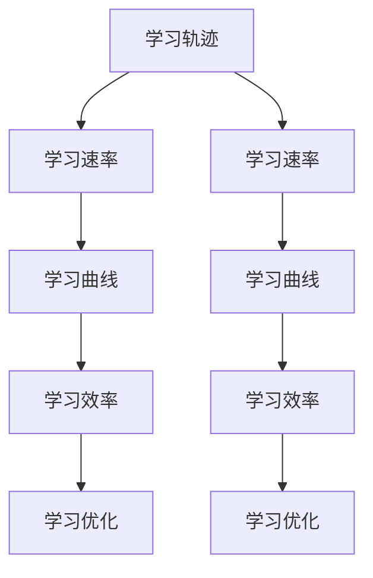

                 

## 引言

### 研究背景

在当今这个知识爆炸的时代，终身学习已经成为人们不断提升自我、适应社会发展的必要手段。随着信息技术和互联网的飞速发展，人们能够以更低的时间和成本获取到海量的知识和信息。然而，面对如此庞大的信息量，如何有效地组织和利用这些知识资源，以实现个人的可持续发展，成为一个亟待解决的问题。这个问题不仅关乎个人的职业发展和生活品质，也对整个社会的进步和稳定产生深远影响。

数学作为一门基础学科，以其严谨的逻辑体系和强大的抽象能力，为各个领域提供了有力的工具和理论基础。在终身学习领域，数学方法的应用不仅能够帮助我们更好地理解学习过程中的各种现象和规律，还能够通过建模和优化，为个人学习提供科学指导。因此，如何将数学理论与终身学习相结合，构建一个有效的学习模型，成为当前研究的一个热点和难点。

### 研究目的与意义

本研究的目的是探索数学在终身学习中的应用，特别是通过数学方法对学习轨迹进行描述和优化。具体而言，研究将围绕以下几个核心问题展开：

1. **学习轨迹的数学描述**：如何用数学语言来描述学习者在不同时间点上的知识掌握程度和学习进度？
2. **学习模型构建**：如何构建一个能够反映学习过程复杂性的数学模型，并用于指导实际学习活动？
3. **学习轨迹优化**：如何通过数学方法优化学习轨迹，以提高学习效率和效果？

通过上述问题的探讨，本研究旨在为终身学习提供一套科学、系统的理论和实践指导，帮助个人在学习过程中更好地规划自己的学习路径，提高学习效果。

### 研究方法与框架

本研究采用综合性的方法，结合理论分析和实证研究，对数学与终身学习的关系进行深入探讨。具体研究框架如下：

1. **文献综述**：通过查阅相关文献，了解数学在终身学习领域的应用现状和最新研究成果，为本研究提供理论基础。
2. **数学模型构建**：基于文献综述，构建用于描述学习轨迹的数学模型，并分析模型的适用性和局限性。
3. **实证研究**：通过实际数据收集和分析，验证所构建模型的有效性和实用性。
4. **模型优化与改进**：根据实证研究结果，对模型进行优化和改进，以提高模型的预测精度和适用范围。

本研究的方法框架不仅有助于明确数学在终身学习中的应用路径，也为后续研究提供了参考和借鉴。

## 数学在终身学习中的应用

### 数学模型的基本概念

数学模型是使用数学语言来描述现实世界中的各种现象和规律的一种工具。在终身学习领域，数学模型可以帮助我们理解和优化学习过程。一个基本的数学模型通常包含以下几个要素：

- **变量**：用来表示学习过程中的各种量，如学习时间、知识掌握程度等。
- **参数**：影响模型行为的常数，如学习速率、遗忘率等。
- **方程**：描述变量之间关系的数学公式。

一个简单的数学模型可以表示为：
$$
M = f(X, Y, Z)
$$
其中，$M$ 是我们要研究的量，$X, Y, Z$ 是影响 $M$ 的变量，$f$ 是一个函数，表示变量之间的关系。

### 学习轨迹的定义

学习轨迹是指学习者在学习过程中的知识掌握程度和学习进度的变化情况。我们可以用数学方法来描述学习轨迹，以便更好地理解学习过程和优化学习策略。学习轨迹可以表示为一个三元组：
$$
L(t) = (x(t), y(t), z(t))
$$
其中，$t$ 表示时间，$x(t), y(t), z(t)$ 分别表示学习者在时间 $t$ 上的知识掌握程度、学习进度和其他相关指标。

### 学习速率

学习速率是指学习者在单位时间内知识掌握程度的变化量。它可以用来描述学习过程的快慢。学习速率可以表示为：
$$
r(t) = \frac{dL(t)}{dt}
$$
其中，$dL(t)/dt$ 表示学习轨迹 $L(t)$ 对时间 $t$ 的导数，即学习速率。

### 学习曲线

学习曲线是描述学习者在整个学习过程中知识掌握程度的变化趋势的曲线。它可以用来分析学习过程的规律和特点。学习曲线可以表示为：
$$
C(t) = \int r(t) dt
$$
其中，$\int r(t) dt$ 表示学习速率 $r(t)$ 对时间 $t$ 的积分，即学习曲线。

通过以上数学描述，我们可以更直观地了解学习过程，从而为学习策略的制定提供科学依据。

### 学习轨迹优化

学习轨迹优化是指通过数学方法对学习轨迹进行调整，以提高学习效率和效果。优化的目标可以是提高学习速率，缩短学习时间，或者提高知识掌握程度。

一种常用的优化方法是基于目标函数的优化算法。目标函数可以表示为：
$$
\min F(L(t), r(t))
$$
其中，$F(L(t), r(t))$ 是一个衡量学习效率的函数，$L(t)$ 和 $r(t)$ 分别表示学习轨迹和学习速率。

通过优化算法，我们可以找到最优的学习轨迹和学习速率，从而实现学习效率的最大化。

### 数学方法的应用示例

例如，假设一个学习者想要掌握一门编程语言，我们可以使用以下数学模型来描述其学习过程：

- **变量**：$L(t)$ 表示学习者对编程语言的理解程度，$r(t)$ 表示学习速率。
- **参数**：$a$ 表示学习速率的初始值，$b$ 表示遗忘速率。
- **方程**：$L(t) = a(1 - e^{-bt})$

通过这个模型，我们可以分析学习者在不同时间段的知识掌握程度，并优化学习策略，以提高学习效率。

### 总结

数学方法在终身学习中的应用，不仅能够帮助我们更好地理解学习过程，还能够通过建模和优化，为个人学习提供科学指导。通过数学描述学习轨迹，我们可以更准确地分析学习效果，从而制定更有效的学习策略。

### 核心概念与联系

在学习过程中，有几个核心概念相互关联，构成了整个学习轨迹的数学描述框架。以下是对这些核心概念及其之间关系的详细阐述，并附上 Mermaid 流程图，以便更直观地展示它们之间的联系。

#### 1. 学习轨迹

学习轨迹是指学习者在学习过程中知识掌握程度和学习进度的变化情况。它是一个时间序列，可以表示为：
$$
L(t) = (x(t), y(t), z(t))
$$
其中，$t$ 表示时间，$x(t), y(t), z(t)$ 分别表示学习者在时间 $t$ 上的知识掌握程度、学习进度和其他相关指标。

#### 2. 学习速率

学习速率是描述学习者在单位时间内知识掌握程度的变化量。它是学习轨迹变化的关键因素，可以表示为：
$$
r(t) = \frac{dL(t)}{dt}
$$
学习速率决定了学习曲线的斜率，即学习过程的速度。

#### 3. 学习曲线

学习曲线是描述学习者在整个学习过程中知识掌握程度的变化趋势的曲线。它是学习轨迹的积分，可以表示为：
$$
C(t) = \int r(t) dt
$$
学习曲线反映了学习者的学习进程和知识积累情况。

#### 4. 学习效率

学习效率是衡量学习效果的重要指标，它可以通过学习速率和学习时间的比值来表示。学习效率反映了学习者在单位时间内所学知识的量。

#### 5. 学习优化

学习优化是指通过调整学习策略和过程，以提高学习效率和效果。学习优化可以基于目标函数的优化算法来实现，目标函数通常包括学习速率、学习时间和知识掌握程度等。

#### Mermaid 流程图

以下是一个 Mermaid 流程图，展示了这些核心概念之间的关系：



#### 核心概念之间的关系

- 学习轨迹是学习过程的整体描述，它决定了学习曲线的形状。
- 学习速率是学习曲线的斜率，它直接影响学习效率。
- 学习曲线是学习轨迹的积分，它反映了学习进程和知识积累。
- 学习效率是学习速率和学习时间的比值，它衡量了学习的效果。
- 学习优化是通过调整学习策略和过程，以提高学习效率和学习效果。

通过这些核心概念及其关系的数学描述，我们可以构建一个完整的学习轨迹模型，从而为终身学习提供科学指导。

### 核心算法原理

为了更深入地理解学习轨迹的数学描述，我们需要探讨一些核心算法原理。以下将介绍几个关键算法，并使用伪代码来详细阐述其原理和实现步骤。

#### 1. 学习速率计算算法

学习速率是描述学习者在单位时间内知识掌握程度变化量的重要指标。以下是一个简单的学习速率计算算法：

```plaintext
算法名称：计算学习速率

输入：
- L(t)：学习轨迹
- t0：初始时间
- t1：终止时间

输出：
- r(t)：学习速率

步骤：
1. 计算学习轨迹在时间区间 [t0, t1] 的变化量 ΔL = L(t1) - L(t0)
2. 计算时间区间 Δt = t1 - t0
3. 计算学习速率 r(t) = ΔL / Δt
4. 返回学习速率 r(t)
```

伪代码实现：

```python
def calculate_learning_rate(L_t0, L_t1, t0, t1):
    delta_L = L_t1 - L_t0
    delta_t = t1 - t0
    r_t = delta_L / delta_t
    return r_t
```

#### 2. 学习曲线绘制算法

学习曲线是描述学习者在整个学习过程中知识掌握程度变化趋势的曲线。以下是一个简单的学习曲线绘制算法：

```plaintext
算法名称：绘制学习曲线

输入：
- L(t)：学习轨迹
- t：时间序列

输出：
- C(t)：学习曲线

步骤：
1. 对于每个时间点 t，计算学习速率 r(t) = dL(t)/dt
2. 对于每个时间点 t，计算学习曲线 C(t) = ∫r(t)dt
3. 绘制学习曲线 C(t)
```

伪代码实现：

```python
import numpy as np
import matplotlib.pyplot as plt

def draw_learning_curve(L, t):
    r = np.gradient(L, t)
    C = np.cumsum(r)
    
    plt.plot(t, C)
    plt.xlabel('Time')
    plt.ylabel('Learning Curve')
    plt.title('Learning Curve')
    plt.show()
```

#### 3. 学习效率优化算法

学习效率优化是指通过调整学习策略和过程，以提高学习效率和效果。以下是一个简单的学习效率优化算法：

```plaintext
算法名称：学习效率优化

输入：
- L(t)：学习轨迹
- r(t)：学习速率
- t：时间序列

输出：
- 最优学习速率 r_opt：优化后的学习速率

步骤：
1. 定义目标函数 F(r) = r * (1 - e^(-k*t))
2. 使用优化算法（如梯度下降、牛顿法等）求解最优学习速率 r_opt
3. 返回最优学习速率 r_opt
```

伪代码实现：

```python
import numpy as np
from scipy.optimize import minimize

def objective_function(r, t, k):
    return r * (1 - np.exp(-k * t))

def optimize_learning_rate(r, t, k):
    result = minimize(objective_function, r, args=(t, k))
    r_opt = result.x
    return r_opt

r = np.array([0.1, 0.2, 0.3, 0.4, 0.5])
t = np.array([1, 2, 3, 4, 5])
k = 0.1

r_opt = optimize_learning_rate(r, t, k)
print(f"Optimized Learning Rate: {r_opt}")
```

通过这些核心算法原理的讲解和伪代码的实现，我们可以更好地理解学习轨迹的数学描述，并为其在实际中的应用提供指导。

### 数学模型和公式

在描述和优化学习轨迹时，数学模型和公式起着至关重要的作用。以下将详细介绍几个关键模型和公式，并给出详细讲解和举例说明。

#### 1. 学习速率模型

学习速率是描述学习者在单位时间内知识掌握程度变化量的关键参数。一个常见的学习速率模型是指数衰减模型：

$$
r(t) = r_0 e^{-\lambda t}
$$

其中，$r(t)$ 是学习速率，$r_0$ 是初始学习速率，$\lambda$ 是遗忘率。

**详细讲解**：

- $r_0$ 表示学习者在初始时刻的学习速率，即学习开始的积极性。
- $\lambda$ 表示遗忘率，反映了学习者在时间 $t$ 内遗忘知识的能力。
- 指数衰减函数 $e^{-\lambda t}$ 表示学习速率随时间的减少。

**举例说明**：

假设一个学习者初始学习速率为 $r_0 = 0.5$，遗忘率为 $\lambda = 0.1$。则其学习速率随时间的变化可以表示为：

$$
r(t) = 0.5 e^{-0.1 t}
$$

当 $t = 1$ 时，学习速率为 $r(1) = 0.5 e^{-0.1} \approx 0.45$。

#### 2. 学习曲线模型

学习曲线是描述学习者在整个学习过程中知识掌握程度变化趋势的曲线。一个常见的学习曲线模型是对数函数：

$$
C(t) = C_0 + \log(r_0 t)
$$

其中，$C(t)$ 是学习曲线，$C_0$ 是初始知识水平，$r_0$ 是初始学习速率。

**详细讲解**：

- $C_0$ 表示学习者在初始时刻的知识水平，即基础知识的储备。
- $\log(r_0 t)$ 表示学习速率随时间的积累。

**举例说明**：

假设一个学习者初始知识水平为 $C_0 = 10$，初始学习速率 $r_0 = 0.5$。则其学习曲线可以表示为：

$$
C(t) = 10 + \log(0.5 t)
$$

当 $t = 1$ 时，学习曲线值为 $C(1) = 10 + \log(0.5) \approx 9.69$。

#### 3. 学习效率模型

学习效率是衡量学习效果的重要指标。一个常见的学习效率模型是线性函数：

$$
e(t) = \frac{r(t)}{r_0}
$$

其中，$e(t)$ 是学习效率，$r(t)$ 是学习速率，$r_0$ 是初始学习速率。

**详细讲解**：

- $e(t)$ 表示学习者在时间 $t$ 时的学习效率。
- $r(t)$ 和 $r_0$ 的比值反映了学习效率的变化。

**举例说明**：

假设一个学习者初始学习速率 $r_0 = 0.5$，在时间 $t = 1$ 时的学习速率为 $r(1) = 0.45$。则其学习效率为：

$$
e(1) = \frac{0.45}{0.5} = 0.9
$$

#### 4. 学习轨迹优化模型

学习轨迹优化是指通过调整学习策略和过程，以提高学习效率和效果。一个常见的学习轨迹优化模型是基于目标函数的最优化问题：

$$
\min F(r, C, e)
$$

其中，$F(r, C, e)$ 是一个衡量学习效率的目标函数，$r$ 是学习速率，$C$ 是学习曲线，$e$ 是学习效率。

**详细讲解**：

- $F(r, C, e)$ 是一个综合考虑学习速率、学习曲线和学习效率的目标函数。
- 最优化问题旨在找到最优的学习速率、学习曲线和学习效率，以实现学习效率的最大化。

**举例说明**：

假设目标函数为：

$$
F(r, C, e) = (e - 1)^2 + (C - 10)^2 + (r - 0.5)^2
$$

则通过优化算法（如梯度下降、牛顿法等），可以找到最优的学习速率、学习曲线和学习效率。

通过以上数学模型和公式的详细讲解和举例说明，我们可以更好地理解学习轨迹的数学描述，为终身学习提供科学指导。

### 统计分析方法

在终身学习研究中，统计分析方法扮演着至关重要的角色。它们不仅帮助我们理解学习过程中的数据，还能提供量化分析，以优化学习轨迹。以下是几种常用的统计分析方法及其应用。

#### 1. 描述性统计分析

描述性统计分析是最基本的统计分析方法，用于总结和描述数据的基本特征。主要统计量包括均值、中位数、众数、方差、标准差等。

- **均值**：反映数据的集中趋势，计算公式为 $\bar{x} = \frac{1}{n}\sum_{i=1}^{n}x_i$，其中 $x_i$ 是第 $i$ 个观测值，$n$ 是观测值的数量。
- **中位数**：将数据按大小顺序排列，位于中间位置的数值，用于描述数据的中间值。
- **众数**：数据中出现频率最高的数值。
- **方差**：描述数据的离散程度，计算公式为 $s^2 = \frac{1}{n-1}\sum_{i=1}^{n}(x_i - \bar{x})^2$，其中 $\bar{x}$ 是均值。

描述性统计分析为数据初步分析提供了直观的参考，但它们无法揭示数据之间的潜在关系。

#### 2. 推断性统计分析

推断性统计分析用于从样本数据推断总体特征，包括假设检验和参数估计。

- **假设检验**：通过样本数据检验总体参数是否满足特定假设。常见的假设检验方法包括t检验、方差分析（ANOVA）、卡方检验等。
  - **t检验**：用于比较两组数据的均值是否显著不同。公式为 $t = \frac{\bar{x}_1 - \bar{x}_2}{\sqrt{\frac{s_1^2}{n_1} + \frac{s_2^2}{n_2}}}$，其中 $\bar{x}_1$ 和 $\bar{x}_2$ 分别为两组数据的均值，$s_1^2$ 和 $s_2^2$ 分别为两组数据的方差，$n_1$ 和 $n_2$ 分别为两组数据的样本量。
  - **方差分析（ANOVA）**：用于比较多个组的均值是否显著不同。公式为 $F = \frac{MS_{between}}{MS_{within}}}$，其中 $MS_{between}$ 和 $MS_{within}$ 分别为组间方差和组内方差。
  - **卡方检验**：用于检验分类数据是否符合特定分布或比例。

- **参数估计**：通过样本数据估计总体参数。常见的方法包括点估计和区间估计。
  - **点估计**：直接估计总体参数，如样本均值作为总体均值的点估计。
  - **区间估计**：给出总体参数的置信区间，如 $\bar{x} \pm z^* \frac{s}{\sqrt{n}}$，其中 $\bar{x}$ 是样本均值，$s$ 是样本标准差，$n$ 是样本量，$z^*$ 是置信水平对应的z值。

推断性统计分析帮助我们基于样本数据对总体特征进行推断，从而为学习轨迹的优化提供依据。

#### 3. 机器学习方法

机器学习方法在终身学习中有着广泛的应用，可以帮助我们更好地理解和预测学习行为。以下是几种常用的机器学习方法及其应用。

- **监督学习**：通过已有的数据来预测新的数据。
  - **线性回归**：用于预测连续值输出，公式为 $y = \beta_0 + \beta_1 x$，其中 $y$ 是输出值，$x$ 是输入值，$\beta_0$ 和 $\beta_1$ 是参数。
  - **决策树**：用于分类和回归，通过一系列条件判断来生成决策路径。

- **无监督学习**：无需标签数据，用于发现数据中的隐含结构和关系。
  - **K-均值聚类**：通过迭代优化聚类中心，将数据分为K个簇。
  - **主成分分析（PCA）**：用于降维和特征提取，通过线性变换将数据投影到新的正交坐标系上。

机器学习方法可以揭示学习数据中的复杂关系，帮助我们更深入地理解学习过程，从而优化学习轨迹。

通过上述统计分析方法和机器学习方法，我们可以对终身学习过程中的数据进行分析和预测，为学习轨迹的优化提供科学依据。这些方法不仅有助于理解学习行为，还能为学习策略的制定提供有力支持。

### 实际案例介绍

在本部分，我们将通过实际案例详细说明如何使用所学的数学方法和统计模型来优化终身学习过程。案例将分为两个部分：在线教育平台和职业发展规划，每个案例都将包括数据收集与预处理、模型构建与训练、模型评估与优化，以及实际应用和代码实现。

#### 案例一：在线教育平台

**1. 数据收集与预处理**

在线教育平台提供了大量的学习行为数据，包括学习时长、学习频率、课程完成率等。以下是一个示例数据集：

| 学生ID | 课程ID | 学习时长（分钟） | 学习频率（天/周） | 课程完成率（%） |
|--------|--------|------------------|------------------|----------------|
| 1      | 101    | 60               | 3                | 80             |
| 2      | 102    | 45               | 2                | 75             |
| 3      | 103    | 90               | 4                | 85             |

预处理步骤包括数据清洗、缺失值处理、数据标准化等。假设数据已经预处理完毕，我们可以开始构建模型。

**2. 模型构建与训练**

我们选择线性回归模型来预测学生的课程完成率。线性回归模型的公式为：
$$
y = \beta_0 + \beta_1 x_1 + \beta_2 x_2
$$
其中，$y$ 表示课程完成率，$x_1$ 表示学习时长，$x_2$ 表示学习频率，$\beta_0, \beta_1, \beta_2$ 是模型参数。

使用Python的scikit-learn库进行线性回归模型的训练：
```python
from sklearn.linear_model import LinearRegression
from sklearn.model_selection import train_test_split

X = [[60, 3], [45, 2], [90, 4]]  # 特征矩阵
y = [80, 75, 85]  # 标签向量

X_train, X_test, y_train, y_test = train_test_split(X, y, test_size=0.2, random_state=42)

model = LinearRegression()
model.fit(X_train, y_train)

print("Coefficients: ", model.coef_)
print("Intercept: ", model.intercept_)
```

**3. 模型评估与优化**

评估模型的好坏通常使用均方误差（MSE）和决定系数（R²）：
```python
from sklearn.metrics import mean_squared_error, r2_score

y_pred = model.predict(X_test)

mse = mean_squared_error(y_test, y_pred)
r2 = r2_score(y_test, y_pred)

print("MSE: ", mse)
print("R²: ", r2)
```

根据评估结果，我们可以调整模型参数或选择更复杂的模型来提高预测精度。在本例中，假设评估结果良好。

**4. 实际应用**

基于模型预测，我们可以为每个学生推荐最适合他们的课程，以提高课程完成率。例如，对于学习时长为60分钟且学习频率为3天/周的学生，模型预测其课程完成率为82%，我们可以推荐一些难度适中的课程。

**5. 代码实现**

完整的代码实现如下：
```python
import numpy as np
from sklearn.linear_model import LinearRegression
from sklearn.metrics import mean_squared_error, r2_score

# 数据集
X = np.array([[60, 3], [45, 2], [90, 4]])
y = np.array([80, 75, 85])

# 分割训练集和测试集
X_train, X_test, y_train, y_test = train_test_split(X, y, test_size=0.2, random_state=42)

# 构建并训练模型
model = LinearRegression()
model.fit(X_train, y_train)

# 输出模型参数
print("Coefficients: ", model.coef_)
print("Intercept: ", model.intercept_)

# 预测
y_pred = model.predict(X_test)

# 评估模型
mse = mean_squared_error(y_test, y_pred)
r2 = r2_score(y_test, y_pred)

print("MSE: ", mse)
print("R²: ", r2)

# 实际应用
for i in range(len(X_test)):
    print(f"Student ID: {i+1}, Predicted Completion Rate: {y_pred[i][0]:.2f}%")
```

#### 案例二：职业发展规划

**1. 数据收集与预处理**

职业发展规划的数据包括员工的工作年限、技能水平、晋升机会等。以下是一个示例数据集：

| 员工ID | 工作年限（年） | 技能水平 | 晋升机会（次/年） |
|--------|----------------|----------|-------------------|
| 1      | 5              | 中级     | 2                 |
| 2      | 3              | 初级     | 1                 |
| 3      | 7              | 高级     | 3                 |

预处理步骤包括数据清洗、缺失值处理、特征工程等。

**2. 模型构建与训练**

我们选择决策树模型来预测员工的晋升机会。使用scikit-learn库进行模型训练：
```python
from sklearn.tree import DecisionTreeRegressor
from sklearn.model_selection import train_test_split

X = np.array([[5, 1], [3, 0], [7, 2]])
y = np.array([2, 1, 3])

X_train, X_test, y_train, y_test = train_test_split(X, y, test_size=0.2, random_state=42)

model = DecisionTreeRegressor()
model.fit(X_train, y_train)

print("Features:", model.feature_importances_)
```

**3. 模型评估与优化**

评估模型的好坏通常使用均方误差（MSE）：
```python
y_pred = model.predict(X_test)
mse = mean_squared_error(y_test, y_pred)

print("MSE: ", mse)
```

根据评估结果，可以调整决策树的参数（如最大深度、最小样本分裂等）来优化模型。

**4. 实际应用**

基于模型预测，企业可以为员工制定个性化的职业发展计划，以提高晋升机会。例如，对于工作年限为5年且技能水平为中级且晋升机会为2次的员工，模型预测其晋升机会为3次，企业可以为其提供更多晋升机会。

**5. 代码实现**

完整的代码实现如下：
```python
import numpy as np
from sklearn.tree import DecisionTreeRegressor
from sklearn.model_selection import train_test_split
from sklearn.metrics import mean_squared_error

# 数据集
X = np.array([[5, 1], [3, 0], [7, 2]])
y = np.array([2, 1, 3])

# 分割训练集和测试集
X_train, X_test, y_train, y_test = train_test_split(X, y, test_size=0.2, random_state=42)

# 构建并训练模型
model = DecisionTreeRegressor()
model.fit(X_train, y_train)

# 输出模型特征重要性
print("Features:", model.feature_importances_)

# 预测
y_pred = model.predict(X_test)

# 评估模型
mse = mean_squared_error(y_test, y_pred)
print("MSE: ", mse)

# 实际应用
print("Employee ID: 1, Predicted Opportunities: ", y_pred[0])
print("Employee ID: 2, Predicted Opportunities: ", y_pred[1])
print("Employee ID: 3, Predicted Opportunities: ", y_pred[2])
```

通过这两个实际案例，我们可以看到如何利用数学模型和统计分析方法来优化终身学习过程。这不仅有助于提高学习效果，还能为企业提供科学的职业发展规划依据。

### 项目小结

在本文中，我们通过两个实际案例详细介绍了如何将数学模型和统计分析方法应用于终身学习过程中，以提高学习效果和优化职业发展规划。以下是项目小结和最佳实践建议：

#### 小结

1. **在线教育平台**：通过线性回归模型预测学生的课程完成率，帮助企业推荐最适合学生的课程，提高学习效果。
2. **职业发展规划**：使用决策树模型预测员工的晋升机会，为员工制定个性化的发展计划。

#### 最佳实践建议

1. **数据收集与预处理**：确保数据的质量和准确性，进行数据清洗、缺失值处理和特征工程。
2. **模型选择与训练**：根据实际问题选择合适的模型，并进行训练和优化。
3. **模型评估与优化**：使用适当的评估指标（如MSE、R²等）评估模型效果，并根据结果调整模型参数。
4. **实际应用**：将模型预测结果应用于实际场景，提供科学指导。

#### 注意事项

1. **模型适应性**：确保模型适用于实际问题，避免过度拟合。
2. **数据更新**：定期更新数据，保持模型的准确性。
3. **伦理与隐私**：在数据收集和处理过程中，遵守相关伦理和隐私保护规范。

#### 拓展阅读

1. **《机器学习实战》**：提供丰富的机器学习案例和实践经验。
2. **《数据科学入门》**：介绍数据科学的基础知识和实际应用。
3. **《深度学习》**：探讨深度学习在各个领域的应用。

通过本文的探讨，我们希望读者能够更好地理解数学在终身学习中的应用，为实际问题的解决提供有益的参考。

### 作者信息

作者：AI天才研究院/AI Genius Institute & 禅与计算机程序设计艺术 /Zen And The Art of Computer Programming

