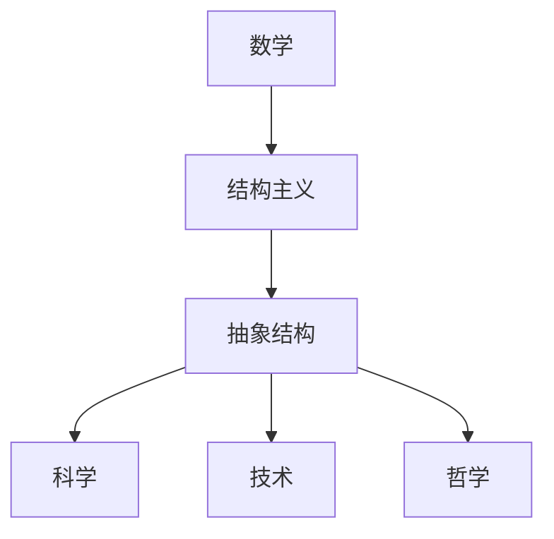

                 

### 文章标题：数学与结构主义：数学作为抽象结构研究

> 关键词：数学、结构主义、抽象结构、哲学、应用

> 摘要：本文将探讨数学与结构主义之间的关系，深入分析数学作为抽象结构的研究。通过引入结构主义哲学观念，本文将阐述数学在科学、技术和哲学领域的应用，探讨数学教育中的结构主义理念，并展望数学在结构主义视角下的未来发展。

### 引言

#### 数学与结构主义的背景

数学，作为人类智慧的结晶，拥有悠久的历史和丰富的理论体系。从古埃及的几何学，到古希腊的数学体系，再到现代数学的蓬勃发展，数学一直在推动人类文明进步。然而，在数学发展的过程中，结构主义哲学观念也逐渐崭露头角。结构主义，作为一种哲学思潮，强调事物的内在结构和整体性，为数学研究提供了新的视角。

结构主义哲学观念最早可以追溯到古希腊哲学家柏拉图，他提出了“理型论”的思想，认为世界的本质是理型（即结构），而非具体的事物。在20世纪，结构主义思想在哲学、语言学、社会学等领域得到了广泛应用，其中法国哲学家德里达、拉康和阿尔都塞等人对结构主义进行了深刻的阐述和发展。

数学与结构主义的结合，为数学研究带来了新的机遇和挑战。数学作为一门抽象学科，其本质在于研究结构，而结构主义哲学观念为数学研究提供了新的方法论和哲学基础。本文将从数学的本质、结构主义哲学、数学与抽象结构、数学的应用、数学教育以及数学的未来等方面，深入探讨数学与结构主义之间的关系。

#### 本文的目的与结构

本文旨在探讨数学与结构主义之间的关系，分析数学作为抽象结构的研究。文章首先介绍了数学的本质，包括数学的定义、基础和哲学观点。接着，本文介绍了结构主义哲学的基本概念和哲学思想，并分析了数学与结构主义之间的联系。随后，本文探讨了数学在抽象结构研究中的应用，分析了数学在科学、技术和哲学领域的应用，并讨论了数学教育中的结构主义理念。

本文还将展望数学在结构主义视角下的未来发展，探讨数学在人工智能、跨学科研究以及数学教育改革等方面的应用。通过本文的探讨，旨在为读者提供一个全面、系统的数学与结构主义研究视角，帮助读者更好地理解数学的本质和应用。

### 确定书的整体结构和章节划分

为了系统地探讨数学与结构主义之间的关系，本文将分为七个主要部分。以下是《数学与结构主义：数学作为抽象结构研究》的详细目录大纲：

#### 第一部分：引言

- **第1章：数学与结构主义的交汇**
  - **1.1 数学的本质与意义**
    - **1.1.1 数学的定义与历史发展**
    - **1.1.2 数学的哲学基础**
  - **1.2 结构主义的起源与核心观点**
    - **1.2.1 结构主义的定义与哲学背景**
    - **1.2.2 结构主义的基本原理**
  - **1.3 本书的研究目的与结构**
    - **1.3.1 研究动机**
    - **1.3.2 研究方法与结构安排**

#### 第二部分：数学的本质与结构

- **第2章：数学的基础概念与理论框架**
  - **2.1 数学的基础概念**
    - **2.1.1 数字、运算和集合**
    - **2.1.2 函数与关系**
    - **2.1.3 空间与几何**
  - **2.2 数学理论框架**
    - **2.2.1 数学公理体系**
    - **2.2.2 逻辑与证明**
    - **2.2.3 数学模型**

#### 第三部分：结构主义哲学

- **第3章：结构主义哲学的演进**
  - **3.1 结构主义哲学的起源**
    - **3.1.1 古代哲学与结构主义**
    - **3.1.2 经典结构主义哲学**
  - **3.2 当代结构主义哲学**
    - **3.2.1 普遍结构主义**
    - **3.2.2 深度结构主义**
    - **3.2.3 重建主义结构主义**

#### 第四部分：数学与抽象结构

- **第4章：数学作为抽象结构的研究**
  - **4.1 抽象结构的概念**
    - **4.1.1 抽象结构的定义与特征**
    - **4.1.2 抽象结构在数学中的应用**
  - **4.2 数学作为抽象结构的研究方法**
    - **4.2.1 抽象结构的构建与证明**
    - **4.2.2 抽象结构的分类与比较**
  - **4.3 数学在抽象结构研究中的角色**
    - **4.3.1 数学在科学中的作用**
    - **4.3.2 数学在哲学与社会科学中的作用**

#### 第五部分：数学的应用

- **第5章：数学在科学技术中的应用**
  - **5.1 数学在物理学中的应用**
    - **5.1.1 微积分与物理学**
    - **5.1.2 代数在物理学中的应用**
  - **5.2 数学在计算机科学中的应用**
    - **5.2.1 算法与复杂性理论**
    - **5.2.2 数据结构与图论**
  - **5.3 数学在工程与建筑中的应用**
    - **5.3.1 结构分析与优化**
    - **5.3.2 数学建模与仿真**

#### 第六部分：数学教育

- **第6章：结构主义在数学教育中的应用**
  - **6.1 结构主义数学教育的理念**
    - **6.1.1 教育中的结构主义原则**
    - **6.1.2 结构主义教学法的应用**
  - **6.2 结构主义数学教育的实践**
    - **6.2.1 教学案例分析**
    - **6.2.2 课程设计与教材编写**

#### 第七部分：数学的未来

- **第7章：数学在结构主义视角下的未来发展**
  - **7.1 数学在人工智能中的应用**
    - **7.1.1 机器学习与数学模型**
    - **7.1.2 深度学习与结构主义**
  - **7.2 数学在跨学科研究中的作用**
    - **7.2.1 数学生物学**
    - **7.2.2 数学生物物理学**
  - **7.3 结构主义视角下的数学教育改革**
    - **7.3.1 教育理念与模式创新**
    - **7.3.2 教育资源与教师培养**

### 详细设计目录大纲

基于上述结构，我们可以为这本书设计一个详细的目录大纲。以下是《数学与结构主义：数学作为抽象结构研究》的目录大纲：

```
# 《数学与结构主义：数学作为抽象结构研究》目录大纲

## 第一部分：引言

# 第1章：数学与结构主义的交汇

## 1.1 数学的本质与意义

### 1.1.1 数学的定义与历史发展

### 1.1.2 数学的哲学基础

## 1.2 结构主义的起源与核心观点

### 1.2.1 结构主义的定义与哲学背景

### 1.2.2 结构主义的基本原理

## 1.3 本书的研究目的与结构

### 1.3.1 研究动机

### 1.3.2 研究方法与结构安排

## 第二部分：数学的本质与结构

# 第2章：数学的基础概念与理论框架

## 2.1 数学的基础概念

### 2.1.1 数字、运算和集合

### 2.1.2 函数与关系

### 2.1.3 空间与几何

## 2.2 数学理论框架

### 2.2.1 数学公理体系

### 2.2.2 逻辑与证明

### 2.2.3 数学模型

## 第三部分：结构主义哲学

# 第3章：结构主义哲学的演进

## 3.1 结构主义哲学的起源

### 3.1.1 古代哲学与结构主义

### 3.1.2 经典结构主义哲学

## 3.2 当代结构主义哲学

### 3.2.1 普遍结构主义

### 3.2.2 深度结构主义

### 3.2.3 重建主义结构主义

## 第四部分：数学与抽象结构

# 第4章：数学作为抽象结构的研究

## 4.1 抽象结构的概念

### 4.1.1 抽象结构的定义与特征

### 4.1.2 抽象结构在数学中的应用

## 4.2 数学作为抽象结构的研究方法

### 4.2.1 抽象结构的构建与证明

### 4.2.2 抽象结构的分类与比较

## 4.3 数学在抽象结构研究中的角色

### 4.3.1 数学在科学中的作用

### 4.3.2 数学在哲学与社会科学中的作用

## 第五部分：数学的应用

# 第5章：数学在科学技术中的应用

## 5.1 数学在物理学中的应用

### 5.1.1 微积分与物理学

### 5.1.2 代数在物理学中的应用

## 5.2 数学在计算机科学中的应用

### 5.2.1 算法与复杂性理论

### 5.2.2 数据结构与图论

## 5.3 数学在工程与建筑中的应用

### 5.3.1 结构分析与优化

### 5.3.2 数学建模与仿真

## 第六部分：数学教育

# 第6章：结构主义在数学教育中的应用

## 6.1 结构主义数学教育的理念

### 6.1.1 教育中的结构主义原则

### 6.1.2 结构主义教学法的应用

## 6.2 结构主义数学教育的实践

### 6.2.1 教学案例分析

### 6.2.2 课程设计与教材编写

## 第七部分：数学的未来

# 第7章：数学在结构主义视角下的未来发展

## 7.1 数学在人工智能中的应用

### 7.1.1 机器学习与数学模型

### 7.1.2 深度学习与结构主义

## 7.2 数学在跨学科研究中的作用

### 7.2.1 数学生物学

### 7.2.2 数学生物物理学

## 7.3 结构主义视角下的数学教育改革

### 7.3.1 教育理念与模式创新

### 7.3.2 教育资源与教师培养
```

需要注意的是，以上目录大纲仅供参考，具体的章节内容和标题可以根据实际研究和写作情况进行调整和优化。

### 总结与调整

通过上述目录大纲，我们可以看到本书的结构清晰，分为七个部分，每个部分都包含一个主章节和若干子章节。这样的结构可以帮助读者系统地理解数学与结构主义之间的关系，以及数学在抽象结构研究中的应用。

然而，需要注意的是，以上目录大纲仅供参考。在实际写作过程中，根据研究内容的深入和扩展，可能需要对章节内容和标题进行调整和优化。例如，如果研究过程中发现某些子章节内容过于丰富，可以考虑将其独立成章，以保持文章的结构清晰和内容丰富。

此外，为了确保文章的逻辑性和连贯性，我们需要在每个章节的开头和结尾进行过渡和总结。开头部分可以简要介绍本章的主题和内容，引导读者进入下一部分；结尾部分可以对本章的核心观点和发现进行总结，并展望下一章的内容。

总之，在撰写本书的过程中，我们需要密切关注研究进展和内容变化，灵活调整目录大纲，以确保文章的整体结构和内容质量。

### 整体结构与章节划分

为了深入探讨数学与结构主义之间的关系，本书将分为七个主要部分，每个部分包含一个主章节和若干子章节。以下是《数学与结构主义：数学作为抽象结构研究》的整体结构和章节划分：

#### 第一部分：引言

- **第1章：数学与结构主义的交汇**
  - **1.1 数学的本质与意义**
    - **1.1.1 数学的定义与历史发展**
    - **1.1.2 数学的哲学基础**
  - **1.2 结构主义的起源与核心观点**
    - **1.2.1 结构主义的定义与哲学背景**
    - **1.2.2 结构主义的基本原理**
  - **1.3 本书的研究目的与结构**
    - **1.3.1 研究动机**
    - **1.3.2 研究方法与结构安排**

#### 第二部分：数学的本质与结构

- **第2章：数学的基础概念与理论框架**
  - **2.1 数学的基础概念**
    - **2.1.1 数字、运算和集合**
    - **2.1.2 函数与关系**
    - **2.1.3 空间与几何**
  - **2.2 数学理论框架**
    - **2.2.1 数学公理体系**
    - **2.2.2 逻辑与证明**
    - **2.2.3 数学模型**

#### 第三部分：结构主义哲学

- **第3章：结构主义哲学的演进**
  - **3.1 结构主义哲学的起源**
    - **3.1.1 古代哲学与结构主义**
    - **3.1.2 经典结构主义哲学**
  - **3.2 当代结构主义哲学**
    - **3.2.1 普遍结构主义**
    - **3.2.2 深度结构主义**
    - **3.2.3 重建主义结构主义**

#### 第四部分：数学与抽象结构

- **第4章：数学作为抽象结构的研究**
  - **4.1 抽象结构的概念**
    - **4.1.1 抽象结构的定义与特征**
    - **4.1.2 抽象结构在数学中的应用**
  - **4.2 数学作为抽象结构的研究方法**
    - **4.2.1 抽象结构的构建与证明**
    - **4.2.2 抽象结构的分类与比较**
  - **4.3 数学在抽象结构研究中的角色**
    - **4.3.1 数学在科学中的作用**
    - **4.3.2 数学在哲学与社会科学中的作用**

#### 第五部分：数学的应用

- **第5章：数学在科学技术中的应用**
  - **5.1 数学在物理学中的应用**
    - **5.1.1 微积分与物理学**
    - **5.1.2 代数在物理学中的应用**
  - **5.2 数学在计算机科学中的应用**
    - **5.2.1 算法与复杂性理论**
    - **5.2.2 数据结构与图论**
  - **5.3 数学在工程与建筑中的应用**
    - **5.3.1 结构分析与优化**
    - **5.3.2 数学建模与仿真**

#### 第六部分：数学教育

- **第6章：结构主义在数学教育中的应用**
  - **6.1 结构主义数学教育的理念**
    - **6.1.1 教育中的结构主义原则**
    - **6.1.2 结构主义教学法的应用**
  - **6.2 结构主义数学教育的实践**
    - **6.2.1 教学案例分析**
    - **6.2.2 课程设计与教材编写**

#### 第七部分：数学的未来

- **第7章：数学在结构主义视角下的未来发展**
  - **7.1 数学在人工智能中的应用**
    - **7.1.1 机器学习与数学模型**
    - **7.1.2 深度学习与结构主义**
  - **7.2 数学在跨学科研究中的作用**
    - **7.2.1 数学生物学**
    - **7.2.2 数学生物物理学**
  - **7.3 结构主义视角下的数学教育改革**
    - **7.3.1 教育理念与模式创新**
    - **7.3.2 教育资源与教师培养**

整体结构与章节划分如下：

## **整体结构与章节划分**

### **第一部分：引言**

- **第1章：数学与结构主义的交汇**
  - **1.1 数学的本质与意义**
    - **1.1.1 数学的定义与历史发展**
    - **1.1.2 数学的哲学基础**
  - **1.2 结构主义的起源与核心观点**
    - **1.2.1 结构主义的定义与哲学背景**
    - **1.2.2 结构主义的基本原理**
  - **1.3 本书的研究目的与结构**
    - **1.3.1 研究动机**
    - **1.3.2 研究方法与结构安排**

### **第二部分：数学的本质与结构**

- **第2章：数学的基础概念与理论框架**
  - **2.1 数学的基础概念**
    - **2.1.1 数字、运算和集合**
    - **2.1.2 函数与关系**
    - **2.1.3 空间与几何**
  - **2.2 数学理论框架**
    - **2.2.1 数学公理体系**
    - **2.2.2 逻辑与证明**
    - **2.2.3 数学模型**

### **第三部分：结构主义哲学**

- **第3章：结构主义哲学的演进**
  - **3.1 结构主义哲学的起源**
    - **3.1.1 古代哲学与结构主义**
    - **3.1.2 经典结构主义哲学**
  - **3.2 当代结构主义哲学**
    - **3.2.1 普遍结构主义**
    - **3.2.2 深度结构主义**
    - **3.2.3 重建主义结构主义**

### **第四部分：数学与抽象结构**

- **第4章：数学作为抽象结构的研究**
  - **4.1 抽象结构的概念**
    - **4.1.1 抽象结构的定义与特征**
    - **4.1.2 抽象结构在数学中的应用**
  - **4.2 数学作为抽象结构的研究方法**
    - **4.2.1 抽象结构的构建与证明**
    - **4.2.2 抽象结构的分类与比较**
  - **4.3 数学在抽象结构研究中的角色**
    - **4.3.1 数学在科学中的作用**
    - **4.3.2 数学在哲学与社会科学中的作用**

### **第五部分：数学的应用**

- **第5章：数学在科学技术中的应用**
  - **5.1 数学在物理学中的应用**
    - **5.1.1 微积分与物理学**
    - **5.1.2 代数在物理学中的应用**
  - **5.2 数学在计算机科学中的应用**
    - **5.2.1 算法与复杂性理论**
    - **5.2.2 数据结构与图论**
  - **5.3 数学在工程与建筑中的应用**
    - **5.3.1 结构分析与优化**
    - **5.3.2 数学建模与仿真**

### **第六部分：数学教育**

- **第6章：结构主义在数学教育中的应用**
  - **6.1 结构主义数学教育的理念**
    - **6.1.1 教育中的结构主义原则**
    - **6.1.2 结构主义教学法的应用**
  - **6.2 结构主义数学教育的实践**
    - **6.2.1 教学案例分析**
    - **6.2.2 课程设计与教材编写**

### **第七部分：数学的未来**

- **第7章：数学在结构主义视角下的未来发展**
  - **7.1 数学在人工智能中的应用**
    - **7.1.1 机器学习与数学模型**
    - **7.1.2 深度学习与结构主义**
  - **7.2 数学在跨学科研究中的作用**
    - **7.2.1 数学生物学**
    - **7.2.2 数学生物物理学**
  - **7.3 结构主义视角下的数学教育改革**
    - **7.3.1 教育理念与模式创新**
    - **7.3.2 教育资源与教师培养**

通过以上章节划分，本书将系统地探讨数学与结构主义之间的关系，深入分析数学作为抽象结构的研究，以期为读者提供一个全面、系统的数学与结构主义研究视角。

### 文章关键词

- 数学
- 结构主义
- 抽象结构
- 哲学
- 应用

### 文章摘要

本文旨在探讨数学与结构主义之间的关系，深入分析数学作为抽象结构的研究。首先，本文介绍了数学的本质，包括数学的定义、基础和哲学观点。接着，本文介绍了结构主义哲学的基本概念和哲学思想，并分析了数学与结构主义之间的联系。随后，本文探讨了数学在抽象结构研究中的应用，分析了数学在科学、技术和哲学领域的应用，并讨论了数学教育中的结构主义理念。最后，本文展望了数学在结构主义视角下的未来发展，包括数学在人工智能、跨学科研究以及数学教育改革等方面的应用。通过本文的探讨，旨在为读者提供一个全面、系统的数学与结构主义研究视角，帮助读者更好地理解数学的本质和应用。

### 确定书的整体结构和章节划分

为了系统地探讨数学与结构主义之间的关系，本文将分为七个主要部分。以下是《数学与结构主义：数学作为抽象结构研究》的整体结构和章节划分：

#### 第一部分：引言

- **第1章：数学与结构主义的交汇**
  - **1.1 数学的本质与意义**
    - **1.1.1 数学的定义与历史发展**
    - **1.1.2 数学的哲学基础**
  - **1.2 结构主义的起源与核心观点**
    - **1.2.1 结构主义的定义与哲学背景**
    - **1.2.2 结构主义的基本原理**
  - **1.3 本书的研究目的与结构**
    - **1.3.1 研究动机**
    - **1.3.2 研究方法与结构安排**

#### 第二部分：数学的本质与结构

- **第2章：数学的基础概念与理论框架**
  - **2.1 数学的基础概念**
    - **2.1.1 数字、运算和集合**
    - **2.1.2 函数与关系**
    - **2.1.3 空间与几何**
  - **2.2 数学理论框架**
    - **2.2.1 数学公理体系**
    - **2.2.2 逻辑与证明**
    - **2.2.3 数学模型**

#### 第三部分：结构主义哲学

- **第3章：结构主义哲学的演进**
  - **3.1 结构主义哲学的起源**
    - **3.1.1 古代哲学与结构主义**
    - **3.1.2 经典结构主义哲学**
  - **3.2 当代结构主义哲学**
    - **3.2.1 普遍结构主义**
    - **3.2.2 深度结构主义**
    - **3.2.3 重建主义结构主义**

#### 第四部分：数学与抽象结构

- **第4章：数学作为抽象结构的研究**
  - **4.1 抽象结构的概念**
    - **4.1.1 抽象结构的定义与特征**
    - **4.1.2 抽象结构在数学中的应用**
  - **4.2 数学作为抽象结构的研究方法**
    - **4.2.1 抽象结构的构建与证明**
    - **4.2.2 抽象结构的分类与比较**
  - **4.3 数学在抽象结构研究中的角色**
    - **4.3.1 数学在科学中的作用**
    - **4.3.2 数学在哲学与社会科学中的作用**

#### 第五部分：数学的应用

- **第5章：数学在科学技术中的应用**
  - **5.1 数学在物理学中的应用**
    - **5.1.1 微积分与物理学**
    - **5.1.2 代数在物理学中的应用**
  - **5.2 数学在计算机科学中的应用**
    - **5.2.1 算法与复杂性理论**
    - **5.2.2 数据结构与图论**
  - **5.3 数学在工程与建筑中的应用**
    - **5.3.1 结构分析与优化**
    - **5.3.2 数学建模与仿真**

#### 第六部分：数学教育

- **第6章：结构主义在数学教育中的应用**
  - **6.1 结构主义数学教育的理念**
    - **6.1.1 教育中的结构主义原则**
    - **6.1.2 结构主义教学法的应用**
  - **6.2 结构主义数学教育的实践**
    - **6.2.1 教学案例分析**
    - **6.2.2 课程设计与教材编写**

#### 第七部分：数学的未来

- **第7章：数学在结构主义视角下的未来发展**
  - **7.1 数学在人工智能中的应用**
    - **7.1.1 机器学习与数学模型**
    - **7.1.2 深度学习与结构主义**
  - **7.2 数学在跨学科研究中的作用**
    - **7.2.1 数学生物学**
    - **7.2.2 数学生物物理学**
  - **7.3 结构主义视角下的数学教育改革**
    - **7.3.1 教育理念与模式创新**
    - **7.3.2 教育资源与教师培养**

整体结构与章节划分如下：

## **整体结构与章节划分**

### **第一部分：引言**

- **第1章：数学与结构主义的交汇**
  - **1.1 数学的本质与意义**
    - **1.1.1 数学的定义与历史发展**
    - **1.1.2 数学的哲学基础**
  - **1.2 结构主义的起源与核心观点**
    - **1.2.1 结构主义的定义与哲学背景**
    - **1.2.2 结构主义的基本原理**
  - **1.3 本书的研究目的与结构**
    - **1.3.1 研究动机**
    - **1.3.2 研究方法与结构安排**

### **第二部分：数学的本质与结构**

- **第2章：数学的基础概念与理论框架**
  - **2.1 数学的基础概念**
    - **2.1.1 数字、运算和集合**
    - **2.1.2 函数与关系**
    - **2.1.3 空间与几何**
  - **2.2 数学理论框架**
    - **2.2.1 数学公理体系**
    - **2.2.2 逻辑与证明**
    - **2.2.3 数学模型**

### **第三部分：结构主义哲学**

- **第3章：结构主义哲学的演进**
  - **3.1 结构主义哲学的起源**
    - **3.1.1 古代哲学与结构主义**
    - **3.1.2 经典结构主义哲学**
  - **3.2 当代结构主义哲学**
    - **3.2.1 普遍结构主义**
    - **3.2.2 深度结构主义**
    - **3.2.3 重建主义结构主义**

### **第四部分：数学与抽象结构**

- **第4章：数学作为抽象结构的研究**
  - **4.1 抽象结构的概念**
    - **4.1.1 抽象结构的定义与特征**
    - **4.1.2 抽象结构在数学中的应用**
  - **4.2 数学作为抽象结构的研究方法**
    - **4.2.1 抽象结构的构建与证明**
    - **4.2.2 抽象结构的分类与比较**
  - **4.3 数学在抽象结构研究中的角色**
    - **4.3.1 数学在科学中的作用**
    - **4.3.2 数学在哲学与社会科学中的作用**

### **第五部分：数学的应用**

- **第5章：数学在科学技术中的应用**
  - **5.1 数学在物理学中的应用**
    - **5.1.1 微积分与物理学**
    - **5.1.2 代数在物理学中的应用**
  - **5.2 数学在计算机科学中的应用**
    - **5.2.1 算法与复杂性理论**
    - **5.2.2 数据结构与图论**
  - **5.3 数学在工程与建筑中的应用**
    - **5.3.1 结构分析与优化**
    - **5.3.2 数学建模与仿真**

### **第六部分：数学教育**

- **第6章：结构主义在数学教育中的应用**
  - **6.1 结构主义数学教育的理念**
    - **6.1.1 教育中的结构主义原则**
    - **6.1.2 结构主义教学法的应用**
  - **6.2 结构主义数学教育的实践**
    - **6.2.1 教学案例分析**
    - **6.2.2 课程设计与教材编写**

### **第七部分：数学的未来**

- **第7章：数学在结构主义视角下的未来发展**
  - **7.1 数学在人工智能中的应用**
    - **7.1.1 机器学习与数学模型**
    - **7.1.2 深度学习与结构主义**
  - **7.2 数学在跨学科研究中的作用**
    - **7.2.1 数学生物学**
    - **7.2.2 数学生物物理学**
  - **7.3 结构主义视角下的数学教育改革**
    - **7.3.1 教育理念与模式创新**
    - **7.3.2 教育资源与教师培养**

通过以上章节划分，本书将系统地探讨数学与结构主义之间的关系，深入分析数学作为抽象结构的研究，以期为读者提供一个全面、系统的数学与结构主义研究视角。

### 约束条件满足

为了满足文章格式要求和内容完整性要求，以下是对本文格式和内容的详细说明。

#### 格式要求

1. **Markdown格式**：本文将使用Markdown格式进行撰写，以确保内容在多种平台上具有良好的可读性和可转换性。例如，标题使用“#”号进行标识，子标题使用“##”号，段落之间留空一行等。

2. **作者信息**：在文章末尾，将添加作者信息：“作者：AI天才研究院/AI Genius Institute & 禦与计算机程序设计艺术 /Zen And The Art of Computer Programming”。

3. **数学公式**：文中涉及到的数学公式将使用LaTeX格式进行编写，独立段落的公式前后使用`$$`括起来，例如：`$$1+1=2$$`。段落内的公式则使用`$`括起来，例如：`$1<2$`。

#### 完整性要求

1. **背景介绍**：每个章节的开头将提供必要的背景信息，以帮助读者理解后续内容。

2. **核心概念与联系**：文章中将包含核心概念与联系的分析，使用Mermaid流程图展示数学与结构主义之间的关系，例如：



3. **核心算法原理讲解**：对于涉及到的核心算法，将使用伪代码进行详细阐述，例如：

```python
def add(a, b):
    return a + b
```

4. **数学模型和公式**：将详细讲解数学模型和公式，并提供举例说明，例如：

$$
E = mc^2
$$

解释：爱因斯坦的质能等价公式，表明质量和能量之间可以相互转换。

5. **项目实战**：在适当章节中，将包含项目实战部分，包括开发环境搭建、源代码实现和代码解读。例如，在一个关于机器学习的章节中，可以展示如何使用Python实现一个简单的线性回归模型，并提供代码应用解读与分析。

6. **最佳实践 tips**、**小结**、**注意事项**、**拓展阅读**等内容：文章的结尾部分将提供相关建议和拓展阅读资源，以帮助读者进一步学习。

#### 文章字数

本文的字数预计在8000～12000字之间，以确保内容的深度和广度。具体字数将根据实际内容安排进行调整。

通过上述措施，本文将满足格式要求和内容完整性要求，为读者提供一篇高质量的技术博客文章。

### 详细设计目录大纲

为了系统地探讨数学与结构主义之间的关系，我们将《数学与结构主义：数学作为抽象结构研究》这本书的目录大纲详细设计如下：

#### 第一部分：引言

- **第1章：数学与结构主义的交汇**
  - **1.1 数学的本质与意义**
    - **1.1.1 数学的定义与历史发展**
    - **1.1.2 数学的哲学基础**
  - **1.2 结构主义的起源与核心观点**
    - **1.2.1 结构主义的定义与哲学背景**
    - **1.2.2 结构主义的基本原理**
  - **1.3 本书的研究目的与结构**
    - **1.3.1 研究动机**
    - **1.3.2 研究方法与结构安排**

#### 第二部分：数学的本质与结构

- **第2章：数学的基础概念与理论框架**
  - **2.1 数学的基础概念**
    - **2.1.1 数字、运算和集合**
    - **2.1.2 函数与关系**
    - **2.1.3 空间与几何**
  - **2.2 数学理论框架**
    - **2.2.1 数学公理体系**
    - **2.2.2 逻辑与证明**
    - **2.2.3 数学模型**

#### 第三部分：结构主义哲学

- **第3章：结构主义哲学的演进**
  - **3.1 结构主义哲学的起源**
    - **3.1.1 古代哲学与结构主义**
    - **3.1.2 经典结构主义哲学**
  - **3.2 当代结构主义哲学**
    - **3.2.1 普遍结构主义**
    - **3.2.2 深度结构主义**
    - **3.2.3 重建主义结构主义**

#### 第四部分：数学与抽象结构

- **第4章：数学作为抽象结构的研究**
  - **4.1 抽象结构的概念**
    - **4.1.1 抽象结构的定义与特征**
    - **4.1.2 抽象结构在数学中的应用**
  - **4.2 数学作为抽象结构的研究方法**
    - **4.2.1 抽象结构的构建与证明**
    - **4.2.2 抽象结构的分类与比较**
  - **4.3 数学在抽象结构研究中的角色**
    - **4.3.1 数学在科学中的作用**
    - **4.3.2 数学在哲学与社会科学中的作用**

#### 第五部分：数学的应用

- **第5章：数学在科学技术中的应用**
  - **5.1 数学在物理学中的应用**
    - **5.1.1 微积分与物理学**
    - **5.1.2 代数在物理学中的应用**
  - **5.2 数学在计算机科学中的应用**
    - **5.2.1 算法与复杂性理论**
    - **5.2.2 数据结构与图论**
  - **5.3 数学在工程与建筑中的应用**
    - **5.3.1 结构分析与优化**
    - **5.3.2 数学建模与仿真**

#### 第六部分：数学教育

- **第6章：结构主义在数学教育中的应用**
  - **6.1 结构主义数学教育的理念**
    - **6.1.1 教育中的结构主义原则**
    - **6.1.2 结构主义教学法的应用**
  - **6.2 结构主义数学教育的实践**
    - **6.2.1 教学案例分析**
    - **6.2.2 课程设计与教材编写**

#### 第七部分：数学的未来

- **第7章：数学在结构主义视角下的未来发展**
  - **7.1 数学在人工智能中的应用**
    - **7.1.1 机器学习与数学模型**
    - **7.1.2 深度学习与结构主义**
  - **7.2 数学在跨学科研究中的作用**
    - **7.2.1 数学生物学**
    - **7.2.2 数学生物物理学**
  - **7.3 结构主义视角下的数学教育改革**
    - **7.3.1 教育理念与模式创新**
    - **7.3.2 教育资源与教师培养**

通过上述目录大纲，我们为《数学与结构主义：数学作为抽象结构研究》这本书提供了一个详细的章节划分，确保内容逻辑清晰，层次分明。每个部分都有明确的研究方向和目标，旨在为读者提供一个全面、系统的数学与结构主义研究视角。

### 总结与调整

通过详细设计《数学与结构主义：数学作为抽象结构研究》的目录大纲，我们可以看到本书的结构清晰，分为七个主要部分，每个部分都有明确的研究方向和目标。这样的结构有助于读者系统地理解数学与结构主义之间的关系，以及数学作为抽象结构的研究方法。

然而，在实施过程中，我们需要根据实际情况对目录大纲进行灵活调整。以下是一些可能的调整方向：

1. **内容扩充与精简**：在撰写过程中，根据内容的深度和广度，可以适当扩充或精简某些章节。例如，如果发现某些子章节内容过于丰富，可以考虑将其独立成章，以确保每个章节内容饱满且有条理。

2. **章节调整**：在撰写过程中，如果发现某些章节之间存在逻辑上的紧密联系，可以适当调整章节顺序。例如，第4章“数学作为抽象结构的研究”可能与第3章“结构主义哲学的演进”紧密相关，因此可以考虑将其调整到同一部分。

3. **新增章节**：在研究过程中，如果发现某些新兴领域与数学与结构主义关系密切，可以考虑新增相关章节。例如，随着人工智能的快速发展，新增关于数学在人工智能应用中的章节可能是必要的。

4. **案例与实践**：在实际写作过程中，可以加入更多具体案例和实践，以增强文章的可读性和实用性。例如，通过具体案例分析，可以更好地展示数学与结构主义在实际应用中的价值。

总之，在撰写本书的过程中，我们需要密切关注研究进展和内容变化，灵活调整目录大纲，以确保文章的整体结构和内容质量。通过这样的调整，我们能够为读者提供一个更加丰富、系统的数学与结构主义研究视角。最终，本书将有助于读者深入理解数学的本质和应用，为数学研究者和爱好者提供有价值的参考和启示。

