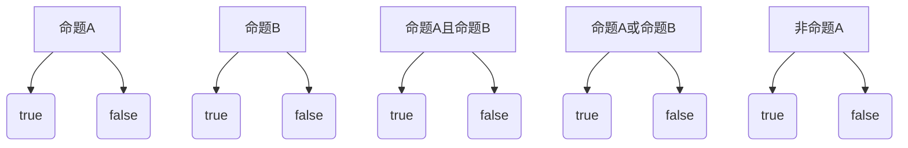
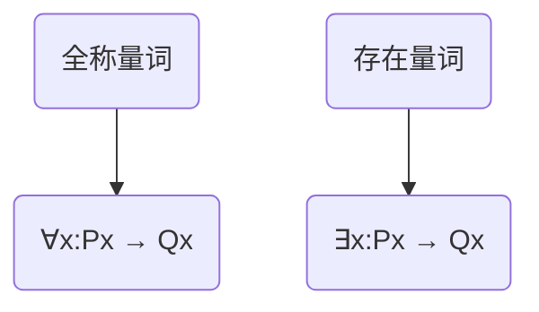
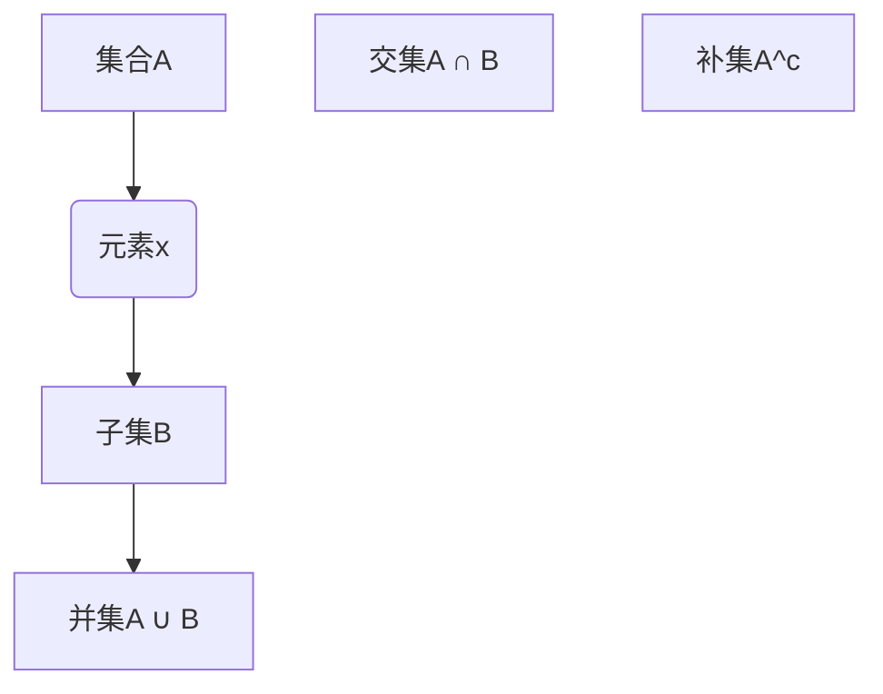
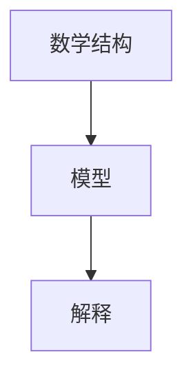
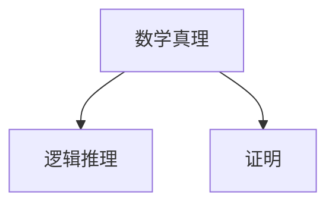

                 

### 文章标题：数学与绝对主义：数学真理的客观性

#### 关键词：数学真理，绝对主义，客观性，逻辑，哲学

> 摘要：本文探讨了数学真理的客观性及其与绝对主义哲学观点的关系。通过对数学基础概念和真理的定义进行分析，本文揭示了数学真理在逻辑、集合和数字系统中的独特性质，并探讨了绝对主义哲学的基本观点及其与数学真理的相互影响。同时，本文还讨论了数学真理客观性的证据及其哲学意义，提出了数学真理在未来可能面临的挑战和机遇。

## 第一部分：数学的基础概念和真理

### 第1章：数学的基本概念

#### 1.1 数学与逻辑

##### 1.1.1 逻辑的基本原理

逻辑是数学的基础，它为数学提供了推理和证明的工具。逻辑的基本原理包括命题逻辑、谓词逻辑和形式逻辑。

**命题逻辑**：命题逻辑是逻辑的基础，它研究命题之间的关系。一个命题要么为真，要么为假。命题逻辑的基本运算包括“与”、“或”和“非”。

**谓词逻辑**：谓词逻辑扩展了命题逻辑，它引入了变量和量词，使得逻辑表达更具有一般性。谓词逻辑的基本运算包括全称量词和存在量词。

**形式逻辑**：形式逻辑是逻辑的抽象表示，它使用符号和公式来表示逻辑推理。形式逻辑的基本原理包括推理规则和证明方法。

##### 1.1.2 数学中的逻辑应用

逻辑在数学中的应用非常广泛，包括证明论、集合论和模型论。

**证明论**：证明论是数学的一个分支，它研究证明的性质和证明的方法。证明论的核心问题是证明的构造和证明的有效性。

**集合论**：集合论是数学的基础，它研究集合的概念和性质。集合论的基本原理包括集合的元素、子集和集合的运算。

**模型论**：模型论是数学的一个分支，它研究数学结构及其解释。模型论的基本原理包括模型的构造和解释的关系。

#### 1.2 数字与集合

##### 1.2.1 数字系统的演变

数字系统的演变是一个逐步扩展的过程，从自然数到复数。

自然数是最基本的数字系统，它包括0和正整数。整数是自然数的扩展，它包括负整数和正整数。分数是整数的扩展，它包括分数和小数。实数是分数的扩展，它包括有理数和无理数。复数是实数的扩展，它包括虚数和纯虚数。

##### 1.2.2 集合的概念和性质

集合是数学的基本概念，它是一个包含确定元素的无序集。集合的基本概念包括集合的元素、子集和集合的运算。

集合的元素是构成集合的基本单位，子集是集合的一部分，集合的运算是集合之间操作的结果。

集合的运算包括并集、交集和补集。并集是两个集合中所有元素的集合，交集是两个集合中共有的元素的集合，补集是集合中所有不属于另一个集合的元素的集合。

## 第二部分：绝对主义哲学与数学真理

### 第3章：绝对主义哲学概述

#### 3.1 绝对主义的定义

绝对主义是一种哲学观点，认为某些真理是绝对存在的，不依赖于个人的信念或文化背景。绝对主义的基本观点包括：

- 绝对真理的存在：认为世界上存在一些绝对的真理，这些真理不受主观意识的影响。
- 绝对价值的存在：认为世界上存在一些绝对的价值，这些价值是普遍适用的。
- 绝对美的存在：认为世界上存在一些绝对的美，这些美是普遍公认的。

#### 3.2 绝对主义的起源和发展

绝对主义的起源可以追溯到古希腊哲学，如柏拉图和亚里士多德的思想。在柏拉图的理念论中，存在着一种超越物质世界的绝对真理。亚里士多德则强调理性思维的重要性，认为通过理性思维可以揭示世界的本质。

在近现代，绝对主义得到了进一步的发展。例如，康德认为，理性思维是认识世界的唯一途径，他提出了先验综合判断的概念，认为通过先验综合判断可以获得绝对真理。

#### 3.3 绝对主义的基本观点

绝对主义的基本观点包括：

- 真理的绝对性：认为真理是客观存在的，不依赖于主观意识。
- 价值的绝对性：认为价值是普遍适用的，不受文化背景的影响。
- 美的绝对性：认为美是普遍公认的，不受个人喜好影响。

这些观点在数学真理的探讨中具有重要的意义。

## 第三部分：数学真理的客观性

### 第4章：绝对主义与数学真理

#### 4.1 绝对主义与数学真理的关系

绝对主义与数学真理之间存在密切的关系。绝对主义认为，数学真理是客观存在的，不受主观意识的影响。这与数学真理的客观性特征相吻合。

绝对主义对数学真理的影响体现在两个方面：

- 强调数学真理的普遍性：绝对主义认为，数学真理是普遍适用的，不受地域、文化和历史背景的影响。
- 强调数学真理的确定性：绝对主义认为，数学真理是确定无疑的，不受主观意识的影响。

#### 4.2 数学真理对绝对主义的回应

数学真理对绝对主义提出了回应，认为数学真理的客观性可以通过逻辑推理和证明得到验证。

数学真理的客观性可以通过以下方式得到验证：

- 逻辑推理：通过逻辑推理，可以揭示数学真理的基本原理和规律。
- 证明：通过证明，可以验证数学真理的正确性和可靠性。

### 第5章：数学真理的客观性

#### 5.1 客观性的概念

客观性是指一个事实或真理不受主观意识的影响，是独立于个人信念的。在哲学中，客观性是一个重要概念，它涉及到知识的客观性和价值的客观性。

在数学中，客观性是指数学真理不受主观意识的影响，是独立于个人信念的。这意味着，无论谁去验证数学真理，结果都是相同的。

#### 5.2 数学真理的客观性特征

数学真理的客观性具有以下特征：

- 无矛盾性：数学真理不会产生矛盾，即一个数学真理不可能同时为真和假。
- 一致性：数学真理在不同的情况下是一致的，即在不同的证明方法和证明过程中，数学真理的结果是相同的。
- 普遍性：数学真理是普遍适用的，不受地域、文化和历史背景的影响。

这些特征使得数学真理在哲学上具有重要的地位。

#### 5.3 对数学真理客观性的讨论

对数学真理客观性的讨论涉及到不同的哲学流派。以下是几种主要的观点：

- 经验主义：经验主义者认为，数学真理是通过经验获得的，是主观意识的产物。他们认为，数学真理的客观性是不存在的。
- 唯物主义：唯物主义者认为，数学真理是客观存在的，是物质世界的反映。他们认为，数学真理的客观性是存在的。
- 构造主义：构造主义者认为，数学真理是通过逻辑构造得到的，是独立于物质世界的。他们认为，数学真理的客观性是存在的，但不是绝对的。
- 形式主义：形式主义者认为，数学真理是逻辑形式的结果，是独立于物质世界的。他们认为，数学真理的客观性是存在的，但不是绝对的。

这些观点对数学真理客观性的讨论提供了不同的视角。

## 第三部分：数学真理的哲学探讨

### 第6章：数学真理的哲学意义

#### 6.1 数学真理与知识论

数学真理在知识论中具有重要的地位。知识论研究知识的本质和获取知识的方法。数学真理作为一种知识，它具有以下特征：

- 确定性：数学真理是确定无疑的，不受主观意识的影响。
- 普遍性：数学真理是普遍适用的，不受地域、文化和历史背景的影响。
- 可证明性：数学真理可以通过逻辑推理和证明得到验证。

这些特征使得数学真理在知识论中具有特殊的地位。

#### 6.2 数学真理与存在论

数学真理与存在论也有密切的关系。存在论研究存在的本质和存在的形式。数学真理作为一种存在，它具有以下特征：

- 客观性：数学真理是客观存在的，不依赖于个人的信念。
- 必然性：数学真理是必然存在的，不受偶然因素的影响。
- 独立性：数学真理是独立存在的，不依赖于物质世界。

这些特征使得数学真理在存在论中具有重要的意义。

### 第7章：数学真理的未来

#### 7.1 数学真理的发展趋势

随着科技的发展，数学真理在未来将继续发展。以下是数学真理可能的发展趋势：

- 新数学理论的发现：随着数学家对数学真理的深入研究，可能会有新的数学理论被发现，这将为数学真理的客观性提供新的证据。
- 计算机技术的应用：计算机技术的进步将使得数学证明变得更加高效和精确，这将有助于验证数学真理的客观性。
- 数学与其他学科的交叉：数学与其他学科的交叉将促进数学真理的应用，使得数学真理在更广泛的领域中得到验证。

#### 7.2 数学真理的挑战与机遇

数学真理在未来将面临一系列挑战和机遇：

- 挑战：
  - 数学难题的解决：数学家需要解决一系列未解决的数学难题，如庞加莱猜想、P vs NP问题等。
  - 数学模型的构建：数学家需要构建更复杂的数学模型，以解决现实世界中的问题。
- 机遇：
  - 数学教育的普及：数学教育的普及将提高人们对数学真理的认识，促进数学真理的传播。
  - 数学应用的扩展：数学真理将在更多领域得到应用，如人工智能、生物信息学等。

## 附录

### 附录A：参考文献

- 柏拉图，《理想国》
- 亚里士多德，《形而上学》
- 康德，《纯粹理性批判》
- 库尔特·哥德尔，《论逻辑命题》
- 基思·德夫林，《数学哲学》
- 莱昂纳多·皮萨罗，《数学与存在》

### 附录B：数学公式和符号表

- 命题逻辑公式：\( A \land B, A \lor B, \neg A \)
- 谓词逻辑公式：\( ∀x:Px → Qx, ∃x:Px → Qx \)
- 集合论公式：\( A \cup B, A \cap B, A^c \)
- 数学真理公式：\( P \leftrightarrow Q \)

### 附录C：术语解释和拓展阅读

- 绝对主义：绝对主义是一种哲学观点，认为某些真理是绝对存在的，不依赖于个人的信念或文化背景。
- 逻辑：逻辑是数学的基础，它为数学提供了推理和证明的工具。
- 集合：集合是数学的基本概念，它是一个包含确定元素的无序集。
- 数学真理：数学真理是数学中已知为真的命题。

## 结语

数学与绝对主义的关系是一个复杂而深刻的问题。本文通过对数学基础概念和真理的定义进行分析，探讨了数学真理的客观性及其与绝对主义哲学观点的关系。本文揭示了数学真理在逻辑、集合和数字系统中的独特性质，并讨论了绝对主义哲学的基本观点及其与数学真理的相互影响。同时，本文还讨论了数学真理客观性的证据及其哲学意义，提出了数学真理在未来可能面临的挑战和机遇。

作者：AI天才研究院/AI Genius Institute & 禅与计算机程序设计艺术 /Zen And The Art of Computer Programming

