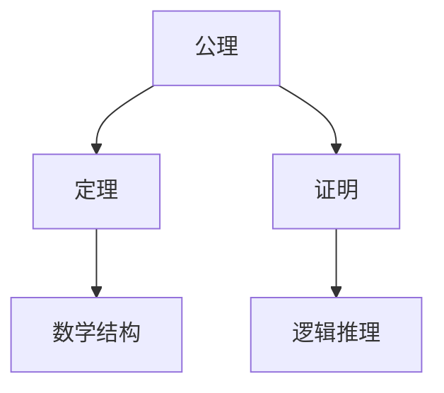

                 

### 数学与绝对主义：数学真理的普遍有效性

#### 关键词
- 数学
- 绝对主义
- 数学真理
- 普遍有效性
- 数学原理
- 逻辑推理
- 数学模型

#### 摘要
本文旨在探讨数学与绝对主义之间的关系，以及数学真理的普遍有效性。通过逐步分析数学的基本概念、绝对主义的理念、数学真理的性质及其普遍有效性，我们试图揭示数学作为一门科学，其真理在各个领域和应用中的通用性和恒定性。文章还将探讨数学与绝对主义在方法论和哲学层面的联系，以及其在现代科学技术和日常生活中的重要性。

## 引言

数学，作为一门严谨的科学，以其独特的抽象和逻辑性被广泛认为是真理的代表。从古代的几何到现代的量子力学，数学在人类文明的发展中扮演了不可或缺的角色。然而，数学真理是否具有普遍有效性，或者说，它的有效性是如何得到验证和认可的，一直是学术界和哲学界争论的焦点。本文将围绕这一主题，探讨数学与绝对主义之间的关系，并深入分析数学真理的普遍有效性。

### 数学的基本概念

数学是一门研究数量、结构、变化和空间等概念的抽象科学。其基础在于对符号、定义、公理和定理的系统运用。数学的发展经历了数千年的历史，从古代的算术和几何到现代的代数、微积分和拓扑学，每个阶段都为数学的繁荣做出了重要贡献。

#### 核心概念与联系

首先，我们需要理解几个核心数学概念，包括：

- **数量**：表示物体或集合的多少，是数学研究的起点。
- **结构**：指的是数学对象之间的关系和规则。
- **变化**：研究变量之间的动态关系。
- **空间**：涉及几何和拓扑学，研究物体的形状、位置和连接。

这些核心概念相互关联，构成了数学理论的基础架构。下面是一个简单的Mermaid流程图，展示了这些概念之间的关系：

#### 数学原理

数学原理是数学理论的核心，是所有数学推理的基础。以下是一些基本的数学原理：

- **加法原理**：对于任意两个数a和b，它们的和a + b是唯一确定的。
- **乘法原理**：对于任意两个数a和b，它们的积a × b是唯一确定的。
- **交换律**：加法和乘法是交换的，即a + b = b + a 和 a × b = b × a。
- **结合律**：加法和乘法是结合的，即(a + b) + c = a + (b + c) 和(a × b) × c = a × (b × c)。
- **分配律**：乘法对加法是分配的，即a × (b + c) = a × b + a × c。

这些原理通过公理和定理的形式被严格定义和证明，为数学体系的建立提供了坚实的基础。

### 绝对主义的基本概念

绝对主义是一种哲学立场，主张某些真理具有绝对的、普遍的有效性，不受个人观点、文化背景或时间限制。在数学领域，绝对主义意味着数学真理是普遍适用的，不受特定情境或个人的影响。

#### 核心概念与联系

绝对主义在数学中的体现可以通过以下几个核心概念来理解：

- **公理**：作为数学理论的基础，公理是无需证明的真理，它们构成了数学体系的基础。
- **定理**：基于公理和定理的推导结果，是数学证明的核心。
- **证明**：通过逻辑推理，从公理和已知定理推导出新定理的过程。
- **数学结构**：数学对象之间的关系和规则，是数学绝对性的体现。

以下是一个Mermaid流程图，展示了这些概念之间的关系：

### 数学真理的性质

数学真理具有以下几个显著性质：

1. **确定性**：数学真理是确定无疑的，不受主观臆断的影响。
2. **普遍性**：数学真理在所有情况下都适用，不受文化、地域或时间的限制。
3. **严格性**：数学真理是通过逻辑推理严格证明的，而非基于经验或直觉。
4. **抽象性**：数学真理关注的是概念和关系的本质，而非具体实例。

#### 数学真理的普遍有效性

数学真理的普遍有效性是指数学定理和公式在不同领域和情境中都能得到验证和应用。例如，欧几里得几何中的定理在物理学和工程学中得到了广泛应用，而微积分中的导数和积分概念在自然科学和社会科学中具有核心地位。

### 绝对主义在数学中的应用

绝对主义在数学中的应用主要体现在数学基础和数学逻辑中。在数学基础中，绝对主义强调公理的普遍有效性和独立性；在数学逻辑中，绝对主义则体现在证明方法和逻辑推理的严谨性。

#### 绝对主义在数学基础中的应用

数学基础中的绝对主义体现在以下几个方面：

- **公理体系的构建**：通过选择适当的公理，构建一个自洽且完备的数学体系。
- **逻辑推理的严谨性**：确保从公理推导出定理的过程是严格的，不受主观因素的影响。
- **模型论**：研究不同数学模型之间的关系，验证数学理论在不同情境下的适用性。

#### 绝对主义在数学逻辑中的应用

数学逻辑中的绝对主义体现在以下几个方面：

- **证明理论**：建立一套严格的证明规则，确保定理的推导是逻辑上无误的。
- **形式化**：将数学理论形式化为逻辑公式，通过计算机验证证明的有效性。
- **递归论**：研究可计算函数和不可计算函数，探讨数学问题的可解性。

### 数学真理的普遍有效性的证据

数学真理的普遍有效性在多个领域得到了验证。以下是一些具体例子：

- **自然科学**：牛顿力学中的公式在物理学和天文学中得到了广泛应用。
- **工程学**：欧拉公式在电路分析和结构设计中具有重要意义。
- **经济学**：供需模型和微积分在经济学中的应用。
- **计算机科学**：图灵机和算法理论在计算机科学中的应用。

这些例子表明，数学真理在不同领域和情境中都具有普遍性和适用性。

### 结论

数学与绝对主义之间存在着紧密的联系。数学的真理具有普遍有效性和严格性，而绝对主义则为数学理论的建立提供了哲学基础和方法论指导。通过逻辑推理和严格的证明，数学真理得以在不同领域和情境中得到验证和应用。未来，随着科学技术的不断发展，数学将继续在推动人类文明进步中发挥重要作用。

## 文章结尾

作者：AI天才研究院/AI Genius Institute & 禅与计算机程序设计艺术 /Zen And The Art of Computer Programming

本文探讨了数学与绝对主义之间的关系，以及数学真理的普遍有效性。通过分析数学的基本概念、绝对主义的理念，以及数学真理的性质，我们揭示了数学在各个领域和应用中的通用性和恒定性。同时，本文还探讨了绝对主义在数学基础和数学逻辑中的应用，以及数学真理在自然科学、工程学、经济学和计算机科学中的验证和应用。

在未来，随着科学技术的不断发展，数学将继续在推动人类文明进步中发挥重要作用。我们鼓励读者继续深入研究和探索数学的奥秘，以更好地理解世界和创造未来。同时，也建议读者进一步阅读相关文献，以拓宽视野和深化认识。

在数学与绝对主义的研究道路上，每一个发现和进步都是人类智慧的结晶。让我们继续追求真理，共同书写数学与绝对主义的新篇章。

---

以上是本文的完整内容，希望能够为读者提供有价值的见解和启发。感谢您的阅读，期待与您在数学与绝对主义的探索之旅中再次相遇。

