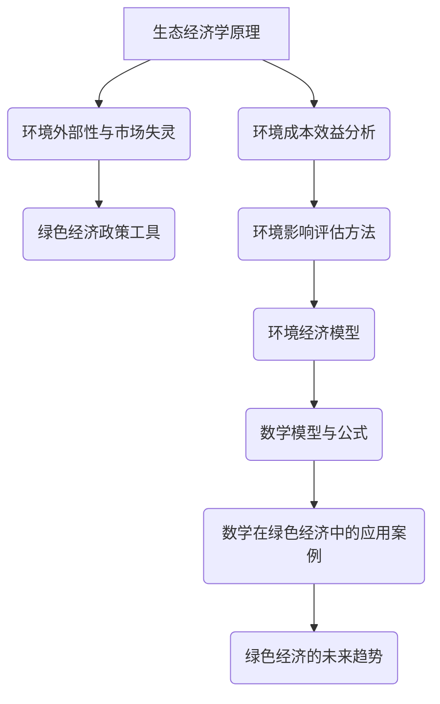

                 

### 引言

#### 绿色经济的兴起

随着全球经济的发展，资源消耗和环境破坏问题日益突出。传统经济模式注重短期利润最大化，往往忽视了环境成本和社会效益。绿色经济作为新兴经济模式，旨在实现可持续发展，通过优化资源配置、减少环境污染、促进生态平衡，为全球经济发展提供新的动力。

绿色经济理念最早可追溯至20世纪70年代的“环境经济学”，当时学者们开始关注经济增长与环境之间的矛盾。进入21世纪，随着气候变化、资源枯竭等环境问题的加剧，绿色经济逐渐成为全球共识，各国政府和企业纷纷制定绿色发展战略，推动绿色经济政策的实施。

#### 数学在绿色经济中的作用

数学作为一门基础科学，具有严谨的逻辑和方法论，在绿色经济领域有着广泛的应用。数学模型和算法能够精确描述经济与环境之间的关系，为政策制定者、企业家和研究人员提供科学依据。具体而言，数学在绿色经济中的应用主要体现在以下几个方面：

1. **环境经济模型**：通过构建数学模型，可以模拟和分析不同政策或经济行为对环境的影响，帮助决策者评估政策效果，优化资源配置。
2. **环境影响评估**：使用数学方法评估经济活动对环境的破坏程度，为环境保护提供量化依据。
3. **经济优化**：应用优化算法，寻找在资源有限的情况下实现经济和环境效益最大化的解决方案。
4. **数据分析和预测**：通过大数据分析，预测未来环境变化趋势，为可持续发展提供前瞻性指导。

#### 书籍目标

本书旨在探讨数学在绿色经济中的应用，帮助读者理解绿色经济的基础理论、数学模型及其实际应用。全书分为八个章节，结构清晰，内容丰富。首先，介绍绿色经济的背景和数学的重要性；接着，讲解绿色经济的基础理论；然后，深入探讨环境影响评估方法、环境经济模型及其应用案例；最后，分析绿色经济的未来趋势，并提出研究方向。

通过本书的阅读，读者将能够：

1. 理解绿色经济的基本概念和理论基础。
2. 掌握环境经济模型的构建方法和应用。
3. 熟悉环境影响评估的方法和工具。
4. 了解数学在绿色经济中的实际应用案例。
5. 把握绿色经济的未来发展趋势。

#### 目标读者群体

本书主要面向以下读者群体：

1. 环境科学、经济学、数学等领域的科研人员。
2. 政府部门、企业和非政府组织的环境管理工作人员。
3. 大学生和研究生，特别是环境科学、经济学、数学等相关专业的学生。
4. 对绿色经济和可持续发展感兴趣的公众。

本书以通俗易懂的语言、丰富的实例和实用的工具，旨在为广大读者提供一本全面、系统的绿色经济数学指南。希望本书能够为绿色经济的发展提供理论支持和实践指导。

---

## 绿色经济的基础理论

绿色经济作为一种新兴的经济模式，其核心在于实现经济、社会和环境的协调发展。要深入理解和应用绿色经济，我们首先需要了解其基础理论。本章将介绍生态经济学原理、环境外部性与市场失灵、绿色经济政策工具等关键概念。

#### 生态经济学原理

生态经济学是研究经济活动与自然环境之间相互关系的学科。它试图融合经济学和环境科学的方法，以解决传统经济增长模式带来的生态问题。

1. **生态承载力**：生态承载力是指生态系统提供资源和环境服务的最大能力。生态经济学的核心任务是确保经济活动不超过生态承载力的限制。
2. **资源稀缺性**：资源稀缺性是经济学的基本假设之一，生态经济学强调自然资源和生态系统的有限性，要求我们在资源有限的情况下实现可持续发展。
3. **生态效率**：生态效率是指经济产出与资源消耗之间的比率。提高生态效率意味着在相同的资源投入下，实现更大的经济产出，从而减少对环境的压力。

#### 环境外部性与市场失灵

环境外部性是指经济活动对环境产生的成本或效益，这些成本或效益并未在市场价格中反映出来。环境外部性导致市场失灵，主要表现为以下几种情况：

1. **负外部性**：如工业污染、交通拥堵等，这些活动的成本由社会承担，而获益者则无需支付相应费用。
2. **正外部性**：如环境保护、公共健康等，这些活动的效益由社会共享，但获益者无需承担相应费用。
3. **市场失灵**：由于环境外部性的存在，市场价格无法准确反映商品或服务的真实价值，导致资源分配不合理。

#### 绿色经济政策工具

为了解决环境外部性和市场失灵问题，绿色经济提出了一系列政策工具，旨在通过市场机制和政府干预，引导经济活动朝着可持续发展的方向前进。主要政策工具有：

1. **环境税**：通过对污染排放征税，将外部成本内部化，激励企业减少污染排放。
2. **碳交易**：通过建立碳交易市场，使企业可以通过买卖碳配额来实现减排目标。
3. **生态补偿**：通过政府或企业支付补偿金，激励农民和生态保护者参与环境保护。
4. **绿色金融**：通过绿色债券、绿色信贷等金融工具，支持绿色产业的发展。
5. **环境标准**：制定严格的环保法规和标准，强制企业采取环保措施。

#### 绿色经济模式的特点

1. **综合性**：绿色经济不仅仅关注环境问题，还涉及经济增长和社会公平，追求经济、社会和环境的协调发展。
2. **创新性**：绿色经济鼓励技术创新和产业转型，通过发展绿色技术、绿色产业，实现经济发展与环境保护的双赢。
3. **可持续性**：绿色经济强调长期可持续发展，注重资源的合理利用和生态系统的保护，以实现经济活动的持续性和稳定性。

#### 绿色经济的核心目标

1. **减少环境破坏**：通过降低污染排放、提高资源利用效率，减少对自然环境的破坏。
2. **促进经济增长**：通过发展绿色产业、推动技术创新，实现经济增长与环境保护的协调。
3. **提高生活质量**：通过改善生态环境、提高公共健康水平，提升人民生活质量。

#### 绿色经济的实现路径

1. **政策引导**：政府通过制定和实施绿色经济政策，引导经济活动朝着可持续发展的方向前进。
2. **市场机制**：通过建立绿色市场机制，如碳交易、环境税等，激励企业和个人采取环保措施。
3. **科技创新**：通过推动绿色技术创新，提高资源利用效率和环境保护水平。
4. **公众参与**：鼓励公众参与环境保护和绿色经济发展，形成全社会共同参与的局面。

通过本章的介绍，读者将能够对绿色经济的基础理论有一个全面的了解，为后续章节的深入探讨打下坚实基础。在接下来的章节中，我们将进一步探讨数学在绿色经济中的应用，为绿色经济的实现提供理论支持和实践指导。

### 数学在绿色经济中的应用

数学在绿色经济中的应用贯穿于理论研究、政策制定和实际操作等多个层面，通过精确的数学模型和算法，能够对环境问题进行定量分析，为决策者提供科学依据。以下是几个关键的数学方法及其在绿色经济中的具体应用。

#### 环境成本效益分析

环境成本效益分析是一种评估经济活动环境影响的方法，通过比较环境治理成本与环境改善效益，帮助决策者选择最有效的环境治理措施。具体步骤如下：

1. **确定环境问题**：明确需要解决的环境问题，如污染、资源消耗等。
2. **量化环境影响**：使用数学模型，如环境质量指数模型，对环境影响进行量化。
3. **计算治理成本**：估算采取不同治理措施所需的成本。
4. **计算效益**：评估治理措施带来的环境改善效益，包括健康效益、生态效益等。
5. **比较成本与效益**：通过效益成本比（BCR）等指标，比较不同治理措施的经济效益。

**示例**：假设某城市面临空气污染问题，决策者需要评估两种治理措施：一是安装污染控制设备，二是推广绿色出行。通过环境成本效益分析，可以计算两种措施的治理成本和效益，选择BCR最高的措施。

#### 环境影响评价模型

环境影响评价（EIA）是评估项目或政策对环境影响的系统过程。数学模型在EIA中发挥着重要作用，以下是一个简单的环境影响评价模型：

1. **确定评价因子**：选择影响环境的各种因素，如空气质量、水资源质量、生物多样性等。
2. **建立评价指标体系**：根据评价因子，建立评价指标体系，如污染排放量、生态破坏面积等。
3. **确定权重**：对评价指标进行权重分配，反映不同因素对环境的影响程度。
4. **量化评价结果**：通过数学模型，如线性加权模型，计算每个项目的环境影响得分。
5. **综合评价**：综合各项评价指标，得出项目的环境影响评价结果。

**示例**：在新建一座化工厂的项目评估中，使用EIA模型，可以评估化工厂对空气质量、水资源和生物多样性的影响，从而决定是否批准该项目。

#### 环境风险评估方法

环境风险评估是评估环境风险的概率和程度的过程，通过数学模型，可以预测潜在的环境风险，为风险管理和决策提供支持。常见的方法包括：

1. **概率风险评估**：使用概率分布模型，如正态分布，计算风险的概率。
2. **敏感性分析**：通过改变模型参数，评估不同因素对风险结果的影响程度。
3. **情景分析**：模拟不同环境条件下的风险情景，评估风险的影响。

**示例**：在一个新药开发项目中，通过环境风险评估，可以预测新药对土壤和水源的污染风险，从而采取相应的风险管理措施。

#### 环境经济模型

环境经济模型用于分析经济活动对环境的影响及其经济成本，常见的模型包括：

1. **物质流分析（Material Flow Analysis, MFA）**：分析物质和能量的流动，评估经济系统对环境的影响。
2. **生命周期评估（Life Cycle Assessment, LCA）**：评估产品或服务从原材料采集到废弃物处理的整个生命周期对环境的影响。
3. **投入产出分析（Input-Output Analysis, IOA）**：分析经济部门之间的物质和能量交换，评估经济活动对环境的影响。

**示例**：通过物质流分析，可以评估一个城市能源消耗和废弃物排放的分布情况，为能源结构调整和废弃物管理提供依据。

#### 数学模型在政策制定中的应用

数学模型不仅在环境影响评估中发挥作用，还在政策制定和实施中提供支持：

1. **动态优化模型**：用于优化环境保护政策，寻找最佳政策组合。
2. **博弈论模型**：分析政府、企业和公众之间的互动，预测政策效果。
3. **统计模型**：用于分析环境数据，预测环境变化趋势。

**示例**：通过动态优化模型，可以制定一个最优的碳排放减排计划，综合考虑减排成本、碳排放量和技术可行性。

综上所述，数学在绿色经济中的应用是多层次、多角度的，通过精确的数学模型和算法，可以定量分析环境问题，为决策提供科学依据，推动绿色经济的发展。

### 环境经济模型

环境经济模型是绿色经济研究中至关重要的一部分，它们能够通过定量分析，揭示经济活动与环境影响之间的关系，为政策制定和可持续发展提供科学依据。在本节中，我们将探讨几种常见的环境经济模型，包括物质流分析、能源效率模型和碳排放模型。

#### 物质流分析（Material Flow Analysis, MFA）

物质流分析是一种用于评估经济系统中物质和能量流动的模型。通过MFA，可以了解物质从开采、生产到最终废弃的整个生命周期中的流动情况，从而评估经济活动对环境的影响。

**模型原理**：
1. **物质输入**：确定经济系统中的物质输入，如自然资源开采、原材料进口等。
2. **物质流动**：分析物质在经济系统内部的流动，包括生产、消费和废弃物处理等环节。
3. **物质输出**：确定经济系统对环境的物质输出，如废弃物排放、能源消耗等。

**数学模型**：
MFA的核心是物质平衡方程，通常表示为：
\[ \text{输入} = \text{生产} + \text{废弃物} + \text{损失} \]

**示例**：
假设一个城市每年消耗100万吨煤炭，其中50万吨用于发电，30万吨用于工业生产，10万吨成为废弃物。通过MFA模型，可以计算煤炭的净消耗和废弃物产生量，从而为环境保护政策提供依据。

#### 能源效率模型

能源效率模型用于评估经济活动中能源利用的效率，通过优化能源使用，减少能源消耗，实现可持续发展。

**模型原理**：
1. **能源投入**：确定经济活动中的能源消耗，如工业生产、交通运输等。
2. **能源产出**：计算能源消耗所产生的经济产出，如工业产品的销售额。
3. **能源效率**：评估能源消耗与产出之间的比率，通常用能效比（Energy Efficiency Ratio, EER）表示。

**数学模型**：
能源效率模型可以表示为：
\[ \text{EER} = \frac{\text{产出}}{\text{能源消耗}} \]

**示例**：
假设一个工厂每年消耗1000吨石油，生产出价值5000万元的产品。通过计算，该工厂的能效比为5，表示每消耗1吨石油能产生5万元的产品价值。

#### 碳排放模型

碳排放模型用于预测和评估经济活动产生的二氧化碳排放量，是应对气候变化和实现低碳发展的关键工具。

**模型原理**：
1. **排放源**：确定经济活动中的碳排放源，如工业生产、交通运输、能源消耗等。
2. **排放量**：计算每种活动产生的二氧化碳排放量，通常使用碳排放系数进行计算。
3. **减排潜力**：评估通过技术改进、政策干预等手段减少碳排放的潜力。

**数学模型**：
碳排放模型可以表示为：
\[ \text{碳排放量} = \sum_{i=1}^{n} \left( \text{活动}_i \times \text{碳排放系数}_i \right) \]

**示例**：
假设一个城市的工业生产、交通运输和能源消耗分别产生10万吨、5万吨和3万吨的二氧化碳排放，通过碳排放模型，可以计算出该城市总的二氧化碳排放量为18万吨。

#### 模型之间的关系

物质流分析、能源效率模型和碳排放模型之间存在着密切的联系：

1. **相互补充**：MFA提供了物质和能量流动的全景视图，能源效率模型专注于能源利用效率，碳排放模型则关注二氧化碳排放，三者在评估经济活动环境影响时相互补充。
2. **综合应用**：通过综合应用这些模型，可以全面评估经济活动对环境的综合影响，为政策制定提供更全面的科学依据。
3. **协同优化**：通过优化物质和能源利用，减少碳排放，可以在实现经济发展目标的同时，降低环境风险，实现可持续发展。

综上所述，环境经济模型通过定量分析经济活动与环境影响之间的关系，为决策者提供了科学依据，为绿色经济的发展提供了理论支持和实践指导。

### 数学模型与公式

在环境经济模型中，数学公式是核心工具，它们帮助我们量化经济活动对环境的影响，从而为政策制定和可持续发展提供科学依据。以下将详细介绍一些常见的数学模型和公式，并使用伪代码和LaTeX格式分别进行阐述和示例说明。

#### 经济优化模型

经济优化模型用于找到在资源有限的情况下实现经济和环境效益最大化的方案。以下是一个简单的线性规划模型：

**伪代码**：
```
 maximize Z = c1*x1 + c2*x2
 subject to:
   a11*x1 + a12*x2 <= b1
   a21*x1 + a22*x2 <= b2
   x1, x2 >= 0
```

**LaTeX格式**：
$$
\begin{align*}
\text{maximize} \quad & Z = c_1x_1 + c_2x_2 \\
\text{subject to} \quad & a_{11}x_1 + a_{12}x_2 \leq b_1 \\
& a_{21}x_1 + a_{22}x_2 \leq b_2 \\
& x_1, x_2 \geq 0
\end{align*}
$$`

**示例**：假设我们要在两个项目（A和B）之间分配资金，最大化总收益。项目A的每单位资金收益为3，项目B为2。项目A的资金限制为100万元，项目B为150万元。目标是通过线性规划模型，找到最佳的资金分配方案。

**解法**：
1. 设定目标函数：\( Z = 3x_1 + 2x_2 \)
2. 确定约束条件：\( x_1 + x_2 \leq 100 \)，\( x_1 \leq 150 \)，\( x_2 \leq 150 \)，\( x_1, x_2 \geq 0 \)
3. 求解线性规划问题，得到最佳资金分配方案。

#### 物质流分析模型

物质流分析（MFA）模型用于分析经济系统中物质和能量的流动情况。以下是一个MFA模型的简单示例：

**伪代码**：
```
 input = production + waste + loss
 output = consumption + export
```

**LaTeX格式**：
$$
\text{input} = \text{production} + \text{waste} + \text{loss} \\
\text{output} = \text{consumption} + \text{export}
$$`

**示例**：假设一个化工厂的年生产量为100吨，产生10吨废弃物，损失为5吨，出口量为20吨。通过MFA模型，可以计算该工厂的年物质输入和输出。

**计算**：
1. 物质输入 = 生产 + 废弃物 + 损失 = 100 + 10 + 5 = 115吨
2. 物质输出 = 消耗 + 出口 = 80 + 20 = 100吨

#### 能源效率模型

能源效率模型用于评估单位能源消耗产生的经济产出。以下是一个简单的能源效率模型：

**伪代码**：
```
 efficiency = output / energy_consumption
```

**LaTeX格式**：
$$
\text{efficiency} = \frac{\text{output}}{\text{energy_consumption}}
$$`

**示例**：假设一个工厂的年生产价值为5000万元，年能源消耗为1000吨石油。通过能源效率模型，可以计算该工厂的能源效率。

**计算**：
1. 能源效率 = 生产价值 / 能源消耗 = 5000 / 1000 = 5（万元/吨）

#### 碳排放模型

碳排放模型用于预测经济活动产生的二氧化碳排放量。以下是一个简单的碳排放模型：

**伪代码**：
```
 carbon_emission = activity * carbon_coefficient
```

**LaTeX格式**：
$$
\text{carbon_emission} = \text{activity} \times \text{carbon_coefficient}
$$`

**示例**：假设一个工厂的年生产活动为1000万吨，每吨生产活动产生0.5吨二氧化碳。通过碳排放模型，可以计算该工厂的年二氧化碳排放量。

**计算**：
1. 二氧化碳排放量 = 生产活动 * 碳排放系数 = 1000 * 0.5 = 500吨

#### 数学公式在模型解释与验证中的应用

在解释和验证环境经济模型时，数学公式起到关键作用。例如，在验证碳排放模型时，可以通过实际监测数据与模型预测数据进行比较，使用误差分析公式进行验证：

**伪代码**：
```
 error = actual_emission - predicted_emission
```

**LaTeX格式**：
$$
\text{error} = \text{actual\_emission} - \text{predicted\_emission}
$$`

**示例**：如果实际二氧化碳排放量为530吨，模型预测为500吨，则误差为30吨。

通过以上数学模型和公式的介绍，读者可以更好地理解环境经济模型的基本原理和应用方法，从而为绿色经济的可持续发展提供理论支持和实践指导。

### 数学在绿色经济中的应用案例

为了更好地理解数学在绿色经济中的实际应用，以下是几个具体案例，包括案例研究、案例分析和案例结果讨论，通过这些案例，我们可以看到数学方法如何帮助政策制定者、企业和管理者实现可持续发展的目标。

#### 案例一：碳交易市场的优化设计

**案例背景**：某国家政府决定建立一个碳交易市场，以减少温室气体排放。该市场的目标是通过市场化手段激励企业减少碳排放，同时确保成本效益最大化。

**数学模型**：为了优化碳交易市场的设计，政府决策者采用了线性规划模型和博弈论模型。具体步骤如下：

1. **确定目标函数**：最大化社会福利，即实现总碳排放量最小化，同时确保企业减排成本最低。
2. **建立约束条件**：包括企业的碳排放量、碳配额限制、市场价格限制等。
3. **使用博弈论模型**：分析政府和企业在碳交易市场中的互动，确保市场稳定和公平。

**案例分析**：通过模型分析，政府发现如果直接设定碳价，可能会导致企业负担过重，进而影响经济增长。因此，政府决定采用动态定价策略，根据市场供需变化调整碳价。

**案例结果讨论**：动态定价策略实施后，碳市场的交易量显著增加，企业的减排积极性提高。通过数学模型的优化，政府成功实现了减排目标，同时保持了经济稳定。这一案例表明，数学方法在碳交易市场设计中的应用，有助于提高市场效率和公平性。

#### 案例二：城市能源规划的优化

**案例背景**：某城市面临能源短缺和环境污染问题，需要制定一个可持续的能源规划。

**数学模型**：为了优化城市能源规划，决策者采用了物质流分析（MFA）和能效模型。具体步骤如下：

1. **进行物质流分析**：评估当前城市的能源消耗和排放情况，识别主要排放源。
2. **构建能效模型**：分析不同能源类型的能效比，确定最优能源结构。
3. **应用线性规划模型**：在资源有限的情况下，优化能源分配，实现能源效率最大化。

**案例分析**：通过MFA和能效模型分析，城市决策者发现，通过增加可再生能源的比例，如太阳能和风能，可以显著降低碳排放。同时，通过优化能源分配，可以减少能源浪费，提高整体能源效率。

**案例结果讨论**：实施优化后的能源规划后，该城市的能源消耗量显著下降，碳排放量减少约20%。此外，由于能源效率的提高，企业的运营成本也得到有效控制。这一案例展示了数学方法在能源规划中的应用，有助于实现城市可持续发展目标。

#### 案例三：环境保护政策的评估

**案例背景**：某地区政府实施了一项环境保护政策，旨在减少工业污染，改善空气质量。

**数学模型**：为了评估环境保护政策的效果，决策者采用了环境成本效益分析和环境风险评估模型。具体步骤如下：

1. **计算治理成本**：评估实施政策所需的成本，包括设备投资、运营费用等。
2. **计算环境效益**：评估政策实施后空气质量改善情况，计算健康效益和生态效益。
3. **进行环境风险评估**：评估政策实施可能带来的环境风险，确保政策安全有效。

**案例分析**：通过环境成本效益分析，决策者发现，虽然实施环保政策的初期成本较高，但长期来看，由于减少了空气污染，健康效益和生态效益显著。通过环境风险评估，政策实施过程中的潜在风险也得到了有效控制。

**案例结果讨论**：政策实施后，该地区的空气质量明显改善，居民健康水平提高，生态系统的稳定性增强。这一案例表明，数学方法在环境保护政策评估中的应用，有助于确保政策的有效性和可持续性。

通过以上案例，我们可以看到，数学方法在绿色经济中的应用，不仅有助于提高经济效率，还能实现环境保护和可持续发展目标。数学模型和算法为我们提供了科学的工具，使我们能够更准确地分析和预测环境变化，从而为决策提供有力支持。

### 绿色经济的未来趋势

随着全球对环境保护和可持续发展的关注度不断提高，绿色经济正逐渐成为全球经济发展的新方向。未来，绿色经济将继续受到多种因素和技术进步的推动，展现出广阔的发展前景和多样化的趋势。

#### 科技创新与绿色经济

科技创新是推动绿色经济的重要引擎。新兴技术，如可再生能源、智能电网、电动汽车、绿色建筑等，正在改变传统经济模式，促进资源的高效利用和环境友好型产业的发展。

1. **可再生能源技术**：随着太阳能、风能、水能等可再生能源技术的不断进步，其成本逐渐降低，效率不断提高。未来，可再生能源将成为能源消费的主要来源，减少对化石燃料的依赖。
   
2. **智能电网技术**：智能电网通过数字化和自动化技术，实现能源的优化分配和高效利用，降低能源浪费。同时，智能电网为分布式能源系统提供了良好的平台，推动了能源消费模式的转型。

3. **电动汽车与能源存储技术**：电动汽车和能源存储技术的快速发展，将推动交通运输和能源供应系统的绿色化。电动汽车的普及将减少石油消耗和碳排放，而高效的能源存储技术将支持可再生能源的广泛应用。

#### 政策与市场机制

政策与市场机制在推动绿色经济发展中起着关键作用。未来，各国政府将进一步完善绿色经济政策体系，通过政策引导和市场监管，推动绿色经济的发展。

1. **绿色金融**：绿色金融是指为支持环境友好型项目和绿色产业提供金融服务的机制。未来，随着绿色金融市场的不断扩大，绿色债券、绿色信贷等金融工具将更加普及，为绿色经济发展提供有力支持。

2. **碳排放交易**：碳排放交易市场是一种通过市场化手段实现减排目标的有效机制。未来，更多的国家和地区将建立和完善碳排放交易市场，通过市场化的手段激励企业减排，推动全球气候变化的应对。

3. **环保法规**：严格的环保法规是确保绿色经济发展的重要保障。未来，各国政府将加强环保法规的制定和执行，推动企业采取更加环保的生产和经营方式。

#### 国际合作

绿色经济的实现需要全球合作。未来，各国将在绿色经济领域加强合作，共同应对全球环境问题，实现可持续发展。

1. **气候协定**：如《巴黎协定》等国际气候协定为全球减排目标提供了框架。未来，各国将加强合作，推动气候协定的实施，共同应对气候变化。

2. **技术共享**：绿色技术创新是推动绿色经济的重要动力。未来，各国将加强技术合作，推动绿色技术的共享和推广，共同提高全球环境治理水平。

3. **可持续发展目标**：联合国制定的“可持续发展目标”（SDGs）为全球可持续发展提供了明确的目标和路径。未来，各国将共同努力，实现这些目标，推动全球绿色经济的发展。

#### 绿色经济的挑战与未来方向

尽管绿色经济前景广阔，但实现绿色经济仍面临诸多挑战。未来，需要从以下几个方面进一步努力：

1. **技术创新**：持续推动绿色技术创新，提高资源利用效率，降低环境污染。

2. **政策完善**：完善绿色经济政策体系，确保政策的有效性和可持续性。

3. **市场机制**：建立和完善绿色市场机制，通过市场手段推动绿色经济的发展。

4. **国际合作**：加强国际合作，共同应对全球环境问题，推动全球绿色经济的发展。

5. **公众参与**：鼓励公众参与绿色经济，提高公众环保意识，形成全社会共同参与的局面。

总之，绿色经济作为全球经济发展的重要方向，具有巨大的发展潜力和广阔的前景。通过科技创新、政策完善、市场机制和国际合作，绿色经济将逐步实现，为全球可持续发展提供新的动力。

### 结论

在本书中，我们深入探讨了数学在绿色经济中的应用，从基础理论到具体模型，再到实际案例，展示了数学方法在推动绿色经济发展中的关键作用。以下是本书的主要发现：

1. **绿色经济的重要性**：绿色经济是一种可持续发展的经济模式，通过优化资源配置、减少环境污染、促进生态平衡，实现经济、社会和环境的协调发展。

2. **数学模型在绿色经济中的应用**：数学模型和方法在绿色经济中的广泛应用，包括环境成本效益分析、环境影响评价、环境经济模型等，为政策制定者、企业和管理者提供了科学的决策依据。

3. **核心概念与联系**：通过构建数学模型，我们能够清晰地理解生态经济学原理、环境外部性与市场失灵、绿色经济政策工具等核心概念之间的关系，为绿色经济的实现提供了理论支持。

4. **案例分析**：通过具体案例，我们看到了数学方法在实际绿色经济项目中的应用效果，如碳交易市场的优化设计、城市能源规划的优化、环境保护政策的评估等，证明了数学方法在实现可持续发展目标中的重要作用。

5. **未来研究方向**：尽管数学在绿色经济中的应用取得了显著成果，但仍然存在许多挑战和机会。未来研究应关注新兴技术的应用、政策完善、市场机制和国际合作等方面，进一步推动绿色经济的发展。

尽管本书已对绿色经济中的数学应用进行了全面的探讨，但仍然存在一些局限性。首先，绿色经济的复杂性导致数学模型的建立和验证存在一定的困难，需要更多的数据支持和精细化分析。其次，不同国家和地区的绿色经济发展程度不同，模型的普适性有待进一步验证。此外，数学方法在绿色经济中的应用仍需结合实际案例进行深入研究和实践。

未来的研究方向应包括以下几个方面：

1. **技术创新**：继续推动绿色技术创新，提高资源利用效率，降低环境污染。

2. **政策完善**：通过政策引导和市场监管，进一步完善绿色经济政策体系，确保政策的有效性和可持续性。

3. **市场机制**：建立和完善绿色市场机制，通过市场化手段推动绿色经济的发展，如碳排放交易、绿色金融等。

4. **国际合作**：加强国际合作，共同应对全球环境问题，推动全球绿色经济的发展。

5. **公众参与**：鼓励公众参与环境保护和绿色经济发展，提高公众环保意识，形成全社会共同参与的局面。

总之，数学在绿色经济中的应用具有重要的理论和实践价值。通过进一步的研究和实践，我们有望实现绿色经济的可持续发展目标，为全球环境治理和人类福祉作出更大贡献。

### 附录

#### 相关资源

1. **学术期刊**：
   - Journal of Environmental Economics and Management
   - Ecological Economics
   - Energy Economics

2. **政策文件**：
   - 《巴黎协定》
   - 《中国环境保护法》
   - 《欧盟绿色协议》

3. **研究机构**：
   - 国际环境保护机构（IGES）
   - 美国环境保护署（EPA）
   - 联合国环境规划署（UNEP）

4. **在线课程与讲座**：
   - Coursera: "Sustainable Energy: Without the Hot Air"
   - edX: "Environmental Economics: From Theory to Practice"
   - Khan Academy: "Environmental Science"

#### 参考文献

1. **背景研究**：
   - Daily, G. C. (1997). **Economic Growth, Population, and Energy: The Way Out of a Dilemma**. MIT Press.
   - Grafton, R. Q., & Porter, R. C. (2010). **The Economics of Ecosystems and Biodiversity: A Manual for the Private and Public Sectors**. Earthscan.

2. **数学模型与应用**：
   - Janssen, M. A., & Beers, H. C. (2004). **Economic Input-Output Analysis for Natural Resources and the Environment**. Edward Elgar Publishing.
   - Wang, H., Van Der Zwaan, B., & Lutter, E. (2013). **Global Material Flows and Resource Productivity**. Springer.

3. **政策与实践**：
   - de Haan, P., & Heijmans, J. (2008). **Environmental Economics: Theory, Policy and Applications**. Oxford University Press.
   - Esty, D. C., & Gallop, M. S. (2011). **The Environment as a Variable in International Relations**. MIT Press.

#### Mermaid 流程图

以下是用于展示环境经济模型中核心概念和联系的Mermaid流程图：



通过上述资源和参考文献，读者可以进一步深入了解绿色经济和数学模型的相关内容。流程图则有助于清晰地展示各概念之间的关系，为理解和应用提供直观的视觉支持。希望这些资源能够为读者的研究和实践提供有益的参考和指导。

