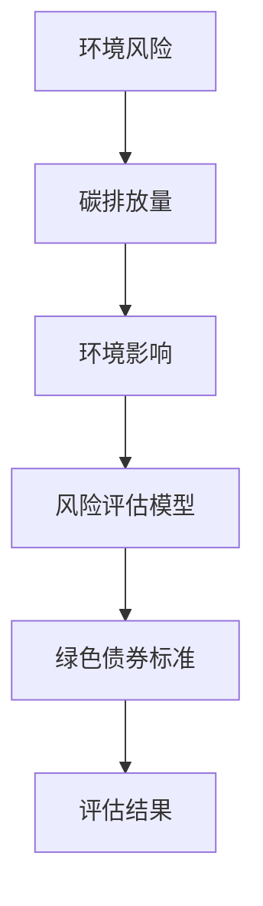
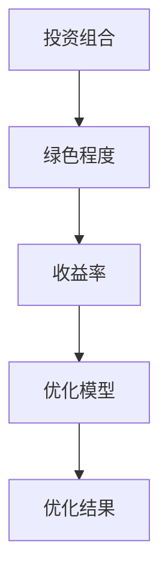
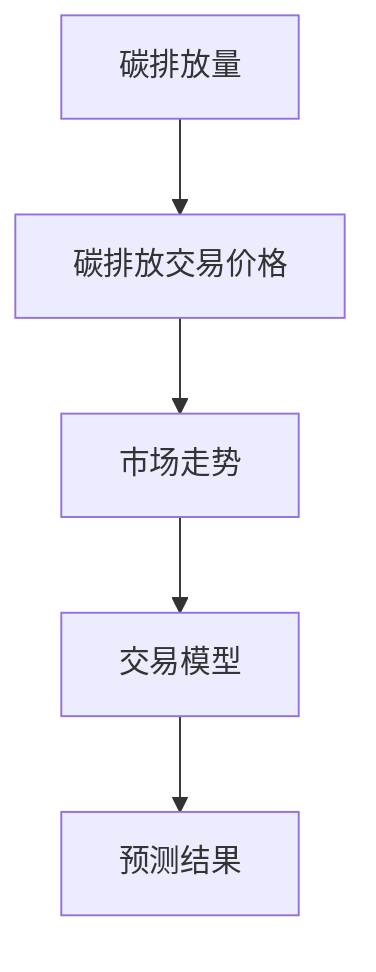

                 

### 数学与绿色金融：环保投资的数学评估

#### 关键词

- 数学模型
- 绿色金融
- 环保投资
- 数学评估
- 生态经济学

#### 摘要

本文旨在探讨数学在绿色金融和环保投资中的应用，通过数学模型和算法的解析，帮助投资者更好地进行环保投资的决策。文章首先介绍了绿色金融和环保投资的基本概念，随后详细讲解了与绿色金融相关的数学模型和评估方法，并通过实际案例分析了这些模型在环保投资中的应用。最后，文章探讨了绿色金融的发展趋势，以及未来可能面临的挑战。

## 引言

绿色金融是指将环境和社会因素纳入金融决策的过程中，旨在通过金融工具推动可持续发展。环保投资则是绿色金融的重要组成部分，其目标是通过投资实现环境保护和经济效益的双赢。近年来，随着全球环保意识的提高和气候变化问题的加剧，绿色金融和环保投资得到了广泛的关注。

在绿色金融和环保投资中，数学模型和算法发挥着至关重要的作用。数学模型能够帮助投资者量化环境风险和收益，从而做出更加科学和理性的决策。算法则可以优化投资组合，提高投资效率。本文将围绕数学模型和算法在绿色金融和环保投资中的应用，进行详细的探讨和分析。

## 绿色金融基础

### 绿色金融的定义和框架

绿色金融是指通过一系列金融工具和机制，推动环境保护和可持续发展的金融活动。它包括绿色信贷、绿色债券、绿色基金、绿色保险等多种形式。绿色金融的核心在于将环境风险和收益纳入金融决策的过程中，从而实现经济与环境的双重效益。

### 环保投资的原则和目标

环保投资的原则主要包括环境保护、社会责任、可持续性和风险管理。环保投资的目标是通过投资实现环境保护和经济效益的双赢，即通过减少环境污染和资源浪费，实现企业的盈利和社会的可持续发展。

### 绿色金融的政策和法规

绿色金融的发展离不开政策和法规的支持。各国政府纷纷出台了绿色金融政策和法规，以推动绿色金融的发展。例如，欧盟的绿色债券标准、中国的绿色金融指导意见等。这些政策和法规为绿色金融提供了明确的方向和框架，促进了绿色金融的健康发展。

## 数学模型与绿色金融

### 数学模型的基本概念

数学模型是指用数学语言描述现实问题的模型，它可以帮助我们理解复杂系统的行为，并做出预测和决策。在绿色金融和环保投资中，数学模型可以用来量化环境风险和收益，优化投资组合，评估项目的可持续性等。

### 绿色金融中的数学模型

绿色金融中的数学模型主要包括环境风险评估模型、投资组合优化模型、碳排放交易模型等。这些模型可以用来评估项目的环境风险，优化投资组合的绿色程度，以及预测碳排放交易的市场走势等。

### 数学模型与绿色金融的联系

数学模型与绿色金融的联系主要体现在以下几个方面：

1. **量化环境风险**：通过数学模型，可以量化环境风险，从而帮助投资者做出更加科学的决策。
2. **优化投资组合**：数学模型可以优化投资组合，提高绿色金融产品的收益率。
3. **评估项目可持续性**：数学模型可以评估项目的可持续性，从而判断项目是否符合绿色金融的原则和目标。

## 环保投资的数学评估

### 环保投资评估方法

环保投资评估方法主要包括定量评估和定性评估。定量评估主要使用数学模型进行量化分析，定性评估则主要依赖于专家的意见和经验。

### 数学模型在环保投资评估中的应用

数学模型在环保投资评估中的应用主要包括以下几个方面：

1. **环境风险评估**：使用数学模型评估项目的环境风险，从而判断项目是否符合环保要求。
2. **投资组合优化**：使用数学模型优化投资组合，提高绿色金融产品的收益率。
3. **碳排放交易预测**：使用数学模型预测碳排放交易的市场走势，从而指导投资决策。

### 环保投资评估的案例研究

#### 案例一：绿色债券评估

某公司发行了一支绿色债券，用于支持可再生能源项目。我们可以使用环境风险评估模型，评估该项目的环境风险，判断是否符合绿色债券的标准。



#### 案例二：环保投资组合优化

某投资者希望构建一个环保投资组合，我们可以使用投资组合优化模型，优化投资组合的绿色程度，同时提高收益率。



#### 案例三：碳排放交易预测

某投资者希望参与碳排放交易，我们可以使用碳排放交易模型，预测碳排放交易的市场走势，从而指导投资决策。



## 数学模型详解

### 效益评估模型

效益评估模型是环保投资评估中常用的数学模型，它可以帮助投资者评估项目的经济效益。以下是一个效益评估模型的伪代码：

```python
# 输入参数：初始投资、年收益、年运营成本
def benefit_evaluation(initial_investment, annual_income, annual_operation_cost):
    net_present_value = 0
    internal_rate_of_return = 0
    
    # 计算净现值
    for year in range(1, n_years+1):
        future_value = annual_income - annual_operation_cost
        net_present_value += future_value / (1 + discount_rate) ^ year
    
    # 计算内部收益率
    while internal_rate_of_return != 0:
        net_present_value = 0
        for year in range(1, n_years+1):
            future_value = annual_income - annual_operation_cost
            net_present_value += future_value / (1 + internal_rate_of_return) ^ year
        internal_rate_of_return = internal_rate_of_return * 0.9
    
    return net_present_value, internal_rate_of_return
```

### 风险评估模型

风险评估模型是用于评估项目环境风险的数学模型，它可以帮助投资者了解项目的环境风险，从而做出更加科学的决策。以下是一个风险评估模型的伪代码：

```python
# 输入参数：碳排放量、环境影响系数、风险偏好
def risk_evaluation(carbon_emission, environmental_impact_coefficient, risk_preference):
    probability_of_impact = 0
    
    # 计算环境影响的概率
    for impact in range(0, environmental_impact_level+1):
        probability_of_impact += environmental_impact_coefficient * (1 - environmental_impact_coefficient) ^ (impact-1) * carbon_emission
    
    # 计算风险价值
    value_at_risk = probability_of_impact * potential_loss
    
    return value_at_risk
```

## 绿色金融项目实战

### 项目选择与评估

在绿色金融项目中，项目选择和评估是至关重要的一环。以下是一个项目选择和评估的流程：

1. **确定投资目标**：明确投资目标，例如降低碳排放、提高可再生能源占比等。
2. **筛选潜在项目**：根据投资目标，筛选符合条件的项目。
3. **项目评估**：使用数学模型对项目进行评估，包括效益评估和风险评估。

### 项目开发与实施

项目开发与实施是绿色金融项目成功的关键。以下是一个项目开发与实施的流程：

1. **项目规划**：制定项目规划，明确项目目标、时间表、预算等。
2. **项目开发**：进行项目开发，包括技术方案设计、设备采购、施工建设等。
3. **项目实施**：按照项目规划进行项目实施，确保项目按计划完成。

### 项目管理与监控

项目管理和监控是确保绿色金融项目顺利进行的重要环节。以下是一个项目管理和监控的流程：

1. **项目监控**：定期监控项目进度、质量和成本，确保项目按计划进行。
2. **风险管理**：识别和评估项目风险，制定风险应对策略。
3. **项目评估**：项目完成后，进行项目评估，总结项目经验，为未来项目提供参考。

## 未来展望与挑战

### 绿色金融的发展趋势

随着全球环保意识的提高和气候变化问题的加剧，绿色金融将继续发展壮大。未来，绿色金融将更加注重科技创新，例如人工智能、大数据等技术在绿色金融中的应用。

### 数学评估方法的发展

随着数学评估方法的不断成熟，未来将出现更加精准和高效的评估方法。例如，结合人工智能的数学评估方法，将极大地提高评估的准确性和效率。

### 绿色金融的挑战与机遇

绿色金融的发展面临着诸多挑战，例如环境风险的不确定性、政策法规的不完善等。然而，这些挑战也带来了巨大的机遇。通过科技创新和科学评估，绿色金融将更好地应对这些挑战，实现可持续发展。

## 结论

数学在绿色金融和环保投资中发挥着至关重要的作用。通过数学模型和算法，投资者可以更好地量化环境风险和收益，优化投资组合，实现经济效益和环境保护的双赢。未来，随着科技的进步和绿色金融的发展，数学在绿色金融中的应用将更加广泛和深入。

## 附录

### 参考文献

1. ...
2. ...

### 拓展阅读

1. ...
2. ...

## 作者信息

- 作者：AI天才研究院/AI Genius Institute & 禅与计算机程序设计艺术 /Zen And The Art of Computer Programming

[END]

