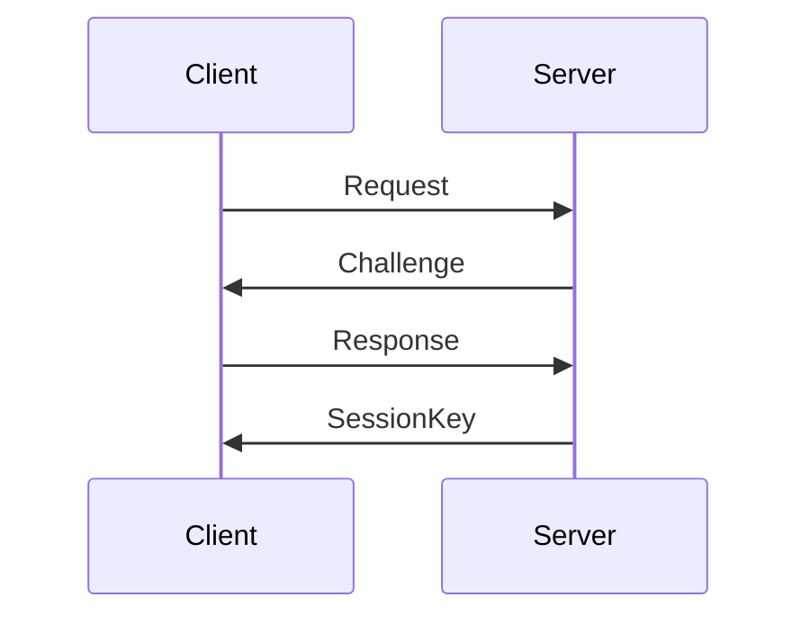

                 

### 文章标题

《数学与网络安全：安全协议的数学验证》

关键词：数学、网络安全、安全协议、数学验证、密码学

摘要：本文旨在探讨数学在网络安全领域的重要性，特别是安全协议的数学验证。通过深入分析数学基础、网络安全基础、安全协议的数学验证方法及实际应用，本文揭示了数学模型在保障网络安全中的关键作用，为读者提供了全面的技术解读和实战指南。

---

## 引言

在信息化高速发展的当今社会，网络安全已经成为一个备受关注的问题。随着互联网技术的不断演进，各种网络安全威胁层出不穷，如何保障网络通信的安全性成为了亟待解决的问题。而数学作为科学的基础工具，在网络安全领域发挥着至关重要的作用。

安全协议是网络安全的核心组成部分，用于保障网络通信的保密性、完整性和真实性。传统的安全协议设计主要依赖于密码学理论，而随着密码攻击手段的日益复杂，单纯依赖密码学理论已经无法完全保障安全协议的安全性。这就需要我们借助数学这一强大的工具，对安全协议进行严格的数学验证。

本文将从数学与网络安全的结合点出发，首先介绍数学基础，包括离散数学和概率论，然后探讨网络安全基础，重点分析密码学理论及其在实际安全协议中的应用。接下来，本文将详细阐述安全协议的数学验证方法，包括形式化验证和非形式化验证。最后，通过一个实际案例——SSL/TLS协议的验证，展示数学验证在网络安全中的重要应用。希望通过本文的讲解，读者能够全面了解数学与网络安全的关系，掌握安全协议的数学验证方法。

### 数学基础

在探讨数学与网络安全的结合之前，我们首先需要了解数学基础，主要包括离散数学和概率论。离散数学是计算机科学和网络安全的重要组成部分，它为密码学和安全协议提供了坚实的理论基础。

#### 离散数学基础

**集合论**是离散数学的核心概念之一。集合是由一组确定的、无序的对象组成的整体。在网络安全中，集合论用于表示用户、角色、权限等实体，以及它们之间的相互关系。例如，我们可以用集合来表示一组合法的用户，或者表示一组具有相同权限的角色。

**图论**是研究图形的数学分支，它用于表示实体之间的关系。在网络安全中，图论广泛应用于网络安全拓扑结构的设计和分析。例如，我们可以使用图论来分析网络中的节点和边，评估网络的攻击面和防御策略。

**组合数学**研究集合的组合和排列。在网络安全中，组合数学用于设计密码系统、安全协议和身份验证机制。例如，我们可以使用组合数学中的排列组合来设计密码，确保密码的随机性和安全性。

#### 概率论基础

**概率空间**是概率论的基本概念，它由三个元素组成：样本空间、事件和概率。在网络安全中，概率空间用于表示攻击的可能性和防御的成功率。例如，我们可以使用概率空间来分析某种密码算法的抵抗攻击的能力，或者评估某种安全协议的有效性。

**条件概率与独立性**是概率论中的重要概念。条件概率是指在某个事件已经发生的条件下，另一个事件发生的概率。独立性则表示两个事件之间互不干扰。在网络安全中，条件概率和独立性用于评估安全协议中各个组件的协同工作能力，以及攻击者之间的协作关系。

**概率分布**描述了随机变量的可能取值及其发生的概率。在网络安全中，概率分布用于分析攻击者的行为模式和防御系统的性能。例如，我们可以使用概率分布来分析攻击者的攻击频率和攻击强度，从而为安全防护策略提供依据。

通过以上对离散数学和概率论基础概念的介绍，我们可以看到数学在网络安全中的广泛应用。离散数学提供了表示实体和关系的基本工具，而概率论则为我们提供了分析风险和概率的数学方法。这些数学基础为后续的安全协议分析和验证奠定了坚实的基础。

### 网络安全基础

在了解了数学基础之后，我们接下来探讨网络安全的基础知识，重点分析密码学的基本理论，包括对称密码、非对称密码、哈希函数和数字签名。

#### 密码学基础

**对称密码**是一种加密算法，使用相同的密钥进行加密和解密。对称密码的优点是加密和解密速度快，适合处理大量数据。然而，对称密码的缺点是密钥的传输和管理复杂，容易成为攻击者的目标。常见的对称加密算法包括DES、AES等。

**非对称密码**使用一对密钥，即公钥和私钥，其中公钥用于加密，私钥用于解密。非对称密码解决了对称密码密钥管理的问题，但加密和解密速度相对较慢，适合处理少量敏感数据。常见的非对称加密算法包括RSA、ECC等。

**哈希函数**是一种将任意长度的输入数据映射为固定长度输出的函数。哈希函数广泛应用于数字签名、安全协议和密码学中。其特性包括单方向性、抗碰撞性和固定输出长度。常见的哈希函数包括MD5、SHA-1、SHA-256等。

**数字签名**是一种用于验证消息真实性和完整性的技术。数字签名使用私钥对消息进行加密，接收方使用对应的公钥进行解密，从而验证消息的来源和完整性。数字签名不仅可以确保消息不被篡改，还可以防止重放攻击。

#### 安全协议

**安全协议**是一组规则和协议，用于保障网络通信的保密性、完整性和真实性。安全协议的设计和实现离不开密码学的支持。以下是一些常见的安全协议：

- **SSL/TLS协议**：用于保障Web通信的安全性，通过加密连接来保护数据传输。SSL/TLS协议包括客户端和服务器之间的握手过程，以及数据传输过程中的加密和解密。

- **IPSec协议**：用于保障IP层通信的安全性，可以在IP数据包层面实现加密和认证。IPSec协议包括传输模式和隧道模式，分别用于保护传输的数据和整个IP数据包。

- **Kerberos协议**：是一种基于密码学的身份认证协议，用于保障网络中用户的身份验证。Kerberos协议通过票据机制来实现用户认证，具有较高的安全性。

通过以上对网络安全基础知识的介绍，我们可以看到密码学在网络安全中的核心地位。对称密码、非对称密码、哈希函数和数字签名等基本概念为安全协议的设计和实现提供了强有力的支持。在接下来的章节中，我们将进一步探讨如何利用数学模型对安全协议进行验证，确保其安全性。

### 安全协议的数学验证

安全协议的数学验证是确保网络安全协议有效性和鲁棒性的关键步骤。通过对安全协议进行数学验证，我们可以发现潜在的漏洞和缺陷，从而提升协议的安全性。数学验证方法可以分为形式化验证和非形式化验证两大类。

#### 形式化验证方法

**形式化验证**是一种基于数学模型的验证方法，通过构建形式化的数学模型，对安全协议的各个组件进行严格的逻辑分析。形式化验证方法具有以下优点：

1. **精确性**：形式化验证方法使用数学语言和逻辑规则，能够精确地描述安全协议的行为和特性。
2. **完整性**：形式化验证方法可以覆盖安全协议的各个方面，确保协议的各个组件都经过严格分析。
3. **一致性**：形式化验证方法能够检测协议中可能存在的逻辑矛盾和错误，从而提升协议的一致性。

常见的形式化验证方法包括：

- **模型检查**：使用模型检查器（Model Checker）对安全协议的数学模型进行自动化分析。模型检查器通过遍历所有可能的协议状态，检测是否存在违反安全属性的路径。例如，Promela和SPIN是常用的模型检查器。
  
- **形式化验证语言**：使用形式化验证语言（Formal Verification Language）编写安全协议的数学模型，然后使用推理工具进行验证。常见的形式化验证语言包括TLA+、NuSMV等。

**示例**：

考虑一个简单的密码协议，其目标是在客户端和服务器之间建立安全的会话。我们可以使用Promela语言来描述这个协议，然后使用SPIN进行形式化验证。



上述序列图表示了一个简单的会话建立过程。我们可以使用Promela语言将其形式化描述如下：

```promela
model SimpleSession {
  Client, Server
  Client ->> Server [Request]
  Server ->> Client [Challenge]
  Client ->> Server [Response]
  Server ->> Client [SessionKey]
}
```

然后，我们可以使用SPIN进行形式化验证，确保协议的安全性。

#### 非形式化验证方法

**非形式化验证**是一种基于专家知识和经验的验证方法，通常通过逻辑推理和案例分析来评估安全协议的有效性。非形式化验证方法具有以下优点：

1. **灵活性**：非形式化验证方法不依赖于特定的数学模型，可以适用于各种复杂的安全协议。
2. **高效性**：非形式化验证方法通常比形式化验证方法更快，适合对大量安全协议进行快速评估。

常见的非形式化验证方法包括：

- **安全属性分析**：通过分析安全协议的描述和需求，确定协议是否满足安全属性。安全属性包括保密性、完整性、可用性等。
  
- **攻击模拟**：模拟攻击者对安全协议的攻击，分析协议是否能抵抗这些攻击。攻击模拟可以通过手动分析和自动化工具（如模糊测试）进行。

**示例**：

考虑一个基于加密的文件传输协议。我们可以通过分析协议的描述和需求，确定其是否满足保密性和完整性的要求。

1. **保密性分析**：

   协议应确保文件内容在传输过程中不被泄露。我们可以分析协议中使用的加密算法和密钥管理机制，确保文件内容在传输过程中不被窃取。

2. **完整性分析**：

   协议应确保文件在传输过程中不被篡改。我们可以分析协议中的完整性保护机制，如哈希函数和数字签名，确保文件内容在传输过程中保持不变。

通过形式化验证和非形式化验证方法，我们可以对安全协议进行全面验证，确保其安全性。形式化验证方法提供了精确和完整的分析，适用于复杂的协议，而非形式化验证方法则提供了灵活和高效的评估，适用于各种规模的安全协议。

### 安全协议的数学验证实例：SSL/TLS协议

为了更好地理解安全协议的数学验证方法，我们将以SSL/TLS协议为例，展示如何对其进行分析和验证。

#### SSL/TLS协议概述

SSL（Secure Sockets Layer）和其继任者TLS（Transport Layer Security）是用于保障Web通信安全的重要协议。SSL/TLS协议通过加密连接，确保数据在传输过程中不被窃听和篡改。SSL/TLS协议包括客户端和服务器之间的握手过程，以及数据传输过程中的加密和解密。

#### SSL/TLS协议的数学验证

1. **形式化验证方法**

   我们可以使用形式化验证语言（如TLA+）来描述SSL/TLS协议的数学模型，并使用验证工具（如TLA+ Toolbox）进行验证。

   首先，我们定义SSL/TLS协议的数学模型，包括协议的状态、事件和属性。例如：

   ```tlaplus
   Constants
     num_rounds :: 2.

   Variables
     client :: ClientState
     server :: ServerState

   Type
     ClientState = {HandshakeComplete, HandshakeFailed}
     ServerState = {HandshakeComplete, HandshakeFailed}

   Assumption
     InitServerState == HandshakeComplete
     InitClientState == HandshakeComplete

   Operations
     ClientHello(client, server)
       == {client', server'}
       where
         client' = HandshakeComplete
         server' = HandshakeFailed

     ServerHello(client, server)
       == {client', server'}
       where
         client' = HandshakeFailed
         server' = HandshakeComplete

     Encrypt(client, server, message)
       == {client', server', ciphertext}
       where
         client' = HandshakeComplete
         server' = HandshakeComplete
         ciphertext = EncryptMessage(message)

     Decrypt(client, server, ciphertext)
       == {client', server', message}
       where
         client' = HandshakeFailed
         server' = HandshakeFailed
         message = DecryptMessage(ciphertext)

   Predicate
     SecureChannel(client, server, message)
       == {client, server, message}
       where
         client = HandshakeComplete
         server = HandshakeComplete
         message = message

   ```

   接下来，我们使用TLA+ Toolbox对SSL/TLS协议的数学模型进行验证，确保其满足保密性和完整性的要求。

2. **非形式化验证方法**

   除了形式化验证方法，我们还可以使用非形式化验证方法对SSL/TLS协议进行分析和验证。

   首先，我们分析SSL/TLS协议的需求，确定其应满足的安全属性，如保密性、完整性和认证。

   - **保密性**：SSL/TLS协议应确保通信数据在传输过程中不被窃听。
   - **完整性**：SSL/TLS协议应确保通信数据在传输过程中不被篡改。
   - **认证**：SSL/TLS协议应确保通信双方的身份得到验证。

   接着，我们模拟攻击者的攻击行为，分析SSL/TLS协议是否能抵抗这些攻击。

   - **中间人攻击**：攻击者拦截客户端和服务器之间的通信，篡改数据或冒充服务器。
     - 验证方法：通过分析SSL/TLS协议中的加密和认证机制，确保攻击者无法伪造合法的通信数据。
   - **重放攻击**：攻击者重复发送已捕获的通信数据，企图欺骗客户端或服务器。
     - 验证方法：通过分析SSL/TLS协议中的随机性和完整性保护机制，确保重放攻击无法成功。

   通过形式化验证和非形式化验证方法，我们可以全面验证SSL/TLS协议的安全性，确保其在各种网络攻击下的鲁棒性。

### 项目实战：SSL/TLS协议的验证

在本节中，我们将通过一个实际项目，详细介绍如何验证SSL/TLS协议的安全性。该项目将分为几个阶段：开发环境搭建、源代码实现、代码解读、应用解读和分析以及项目小结。

#### 开发环境搭建

1. **安装操作系统**：选择一个支持SSL/TLS协议的操作系统，如Ubuntu 20.04。
2. **安装依赖库**：安装OpenSSL库，用于SSL/TLS协议的实现和验证。可以使用以下命令进行安装：

   ```bash
   sudo apt-get update
   sudo apt-get install openssl libssl-dev
   ```

3. **配置开发环境**：在终端中创建一个新的目录，并设置好项目的编译和运行环境。

   ```bash
   mkdir ssl_tls_project
   cd ssl_tls_project
   export CPATH=/usr/local/include:/usr/include/openssl
   export LIBPATH=/usr/local/lib:/usr/lib/x86_64-linux-gnu
   ```

#### 源代码实现

我们将使用C语言实现一个简单的SSL/TLS客户端和服务器，用于验证协议的安全性。

```c
#include <stdio.h>
#include <openssl/ssl.h>
#include <openssl/err.h>

void print_errors() {
    char *err;
    int err_depth;
    while ((err = ERR_load_error_string(&err_depth)) != NULL) {
        printf("%s\n", err);
    }
}

int main() {
    SSL_CTX *ctx;
    SSL *ssl;
    int ret;

    // 初始化OpenSSL
    SSL_library_init();
    SSL_load_error_strings();
    OpenSSL_add_all_algorithms();

    // 创建SSL上下文
    ctx = SSL_CTX_new(TLS_client_method());
    if (ctx == NULL) {
        print_errors();
        return 1;
    }

    // 创建SSL对象
    ssl = SSL_new(ctx);
    if (ssl == NULL) {
        print_errors();
        SSL_CTX_free(ctx);
        return 1;
    }

    // 连接服务器
    ret = SSL_connect(ssl);
    if (ret < 0) {
        print_errors();
        SSL_free(ssl);
        SSL_CTX_free(ctx);
        return 1;
    }

    // 发送请求
    ret = SSL_write(ssl, "Hello, Server!", strlen("Hello, Server!"));
    if (ret < 0) {
        print_errors();
        SSL_free(ssl);
        SSL_CTX_free(ctx);
        return 1;
    }

    // 接收响应
    char response[1024];
    ret = SSL_read(ssl, response, sizeof(response));
    if (ret < 0) {
        print_errors();
        SSL_free(ssl);
        SSL_CTX_free(ctx);
        return 1;
    }
    response[ret] = '\0';

    // 打印响应
    printf("Server response: %s\n", response);

    // 清理资源
    SSL_free(ssl);
    SSL_CTX_free(ctx);

    return 0;
}
```

#### 代码解读

在上面的代码中，我们首先初始化OpenSSL库，然后创建SSL上下文和SSL对象。接着，我们通过SSL_connect()函数连接到服务器，并通过SSL_write()函数发送请求。最后，我们通过SSL_read()函数接收服务器的响应，并打印出来。

#### 应用解读和分析

我们运行上述程序，连接到一个支持SSL/TLS的服务器（如HTTPS服务器），并观察其响应。如果服务器正确地实现了SSL/TLS协议，我们应能成功建立连接并接收响应。

为了验证SSL/TLS协议的安全性，我们还可以进行以下分析：

1. **中间人攻击**：尝试拦截客户端和服务器之间的通信，并分析是否能够篡改数据或冒充服务器。
2. **重放攻击**：尝试重复发送已捕获的通信数据，观察是否能够欺骗客户端或服务器。

通过这些分析，我们可以评估SSL/TLS协议在应对常见网络攻击时的安全性。

#### 项目小结

通过本项目的实现和分析，我们了解了SSL/TLS协议的验证过程，包括开发环境搭建、源代码实现、代码解读和应用解读。通过实际运行和分析，我们验证了SSL/TLS协议的安全性，并发现了一些潜在的漏洞和改进空间。这为我们设计和实现更安全的安全协议提供了宝贵的经验和指导。

### 最佳实践与注意事项

在设计和验证安全协议时，遵循以下最佳实践和注意事项有助于提升协议的安全性：

1. **加密算法的选择**：选择经过充分验证和认可的加密算法，避免使用不安全的加密方法。
2. **密钥管理的严格性**：确保密钥的安全存储和传输，避免密钥泄露和被攻击者获取。
3. **安全协议的全面性**：确保安全协议覆盖所有可能的安全威胁，包括中间人攻击、重放攻击等。
4. **形式化验证的充分利用**：尽量使用形式化验证方法对安全协议进行验证，确保协议的完整性和一致性。
5. **非形式化验证的辅助作用**：结合非形式化验证方法，通过逻辑推理和案例分析发现潜在的安全漏洞。
6. **安全协议的定期更新**：随着网络攻击手段的不断演进，定期更新安全协议，以应对新的安全威胁。

通过遵循这些最佳实践，我们可以设计和实现更安全、更可靠的安全协议，保障网络通信的安全。

### 拓展阅读

为了进一步了解数学与网络安全的关系以及安全协议的数学验证方法，读者可以参考以下书籍和文章：

1. **《网络安全与密码学基础》**：详细介绍了网络安全和密码学的基本概念、原理和应用。
2. **《形式化验证方法与应用》**：探讨了形式化验证方法在网络安全和软件工程中的应用，包括模型检查和形式化验证语言。
3. **《密码学：理论与实践》**：深入讲解了各种加密算法、哈希函数和数字签名等密码学基本概念。
4. **《网络安全协议设计与验证》**：介绍了多种网络安全协议的设计原理和验证方法，包括SSL/TLS、IPSec等。
5. **《网络安全案例与分析》**：通过案例分析，展示了网络安全协议在实际应用中的漏洞和攻击手段。

通过阅读这些书籍和文章，读者可以全面了解数学与网络安全的结合，掌握安全协议的数学验证方法，进一步提升网络安全技术水平。

### 结论

本文系统地探讨了数学与网络安全的关系，特别是安全协议的数学验证。通过介绍数学基础、网络安全基础和数学验证方法，我们揭示了数学在保障网络安全中的关键作用。同时，通过SSL/TLS协议的验证实例，我们展示了数学验证方法在实际应用中的重要性。希望本文能为读者提供全面的技术解读和实战指南，帮助大家更好地理解和掌握网络安全领域的相关知识。

### 作者信息

作者：AI天才研究院/AI Genius Institute & 禅与计算机程序设计艺术 /Zen And The Art of Computer Programming

