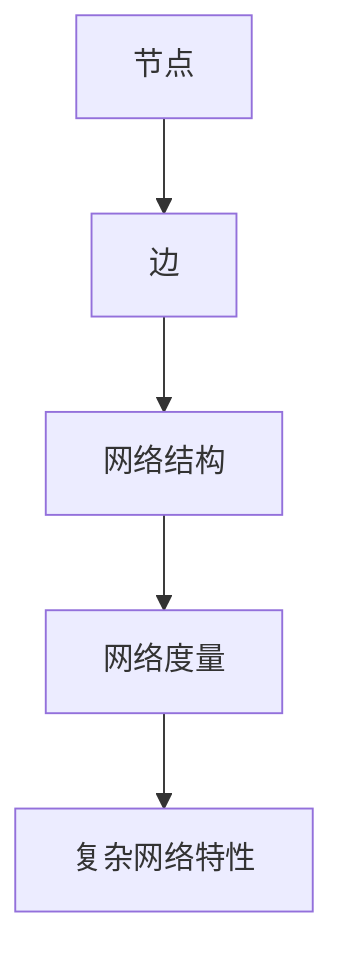

                 

### 文章标题

《数学与网络科学：复杂网络的数学特性》

### 关键词

网络科学、复杂网络、数学模型、图论、社会网络分析、网络优化与控制、网络动力学、应用案例

### 摘要

本文深入探讨了数学与网络科学的交叉领域，特别是复杂网络的数学特性。首先，我们回顾了网络科学的起源及其与数学的密切联系，然后详细介绍了复杂网络的定义、基本理论、社会网络分析、网络优化与控制、网络动力学等方面。通过具体的数学模型、公式推导和实际案例，本文揭示了复杂网络在现实世界中的广泛应用。最后，文章总结了当前研究的进展与未来展望，为读者提供了深入学习和实践的方向。本文旨在帮助读者理解复杂网络的数学特性，并激发对这一领域的兴趣与探索。

---

## 复杂网络的基本理论

在探讨复杂网络的数学特性之前，我们需要先了解复杂网络的基本理论。复杂网络是一个由节点和连接它们边的集合组成的结构，其特点是节点数量庞大，且边与节点之间的连接关系复杂。复杂网络的研究源于对社交网络、生物网络、交通网络等多种现实网络的观察和分析。

### 核心概念与联系

复杂网络的核心概念包括节点、边、网络结构、网络度量等。为了更好地理解这些概念之间的联系，我们可以使用Mermaid流程图来展示它们之间的关系：



在上面的流程图中，节点（A）是网络的基本元素，边（B）表示节点之间的关系，网络结构（C）描述了节点和边的整体布局，网络度量（D）用于量化网络特性的指标，如聚类系数、网络直径等。最后，这些指标共同构成了复杂网络的特性（E）。

### 网络度量

网络度量是评估网络特性的重要手段。其中，节点中心性和边中心性是最常用的两个度量指标。

#### 节点中心性

节点中心性衡量节点在网络中的重要程度，常用的度量方法包括度中心性、介数中心性和紧密中心性。

- **度中心性**：节点拥有的直接连接边数。度中心性高的节点在网络中扮演着核心角色，通常被认为是重要的信息传递者。
- **介数中心性**：节点在所有最短路径上作为中间节点的能力。介数中心性高的节点在网络中起到了桥梁的作用。
- **紧密中心性**：节点与其邻居节点的距离之和。紧密中心性高的节点通常位于网络的核心位置，对于网络的整体稳定性至关重要。

#### 边中心性

边中心性衡量边在网络中的重要程度，常用的度量方法包括边权重和边长度。边权重通常基于边的物理属性（如电导率、流量等），边长度表示两个节点之间的距离。

### 网络拓扑特性

网络拓扑特性描述了网络的宏观结构和局部特性。其中，网络聚类系数和直径是两个重要的拓扑指标。

#### 网络聚类系数

网络聚类系数衡量节点在网络中的聚集程度。一个高聚类系数的网络意味着节点之间具有较强的连接关系，通常表现为高度局部化的社交网络。

#### 网络直径

网络直径是指网络中最长路径的长度。网络直径反映了网络的连通性，一个较小的网络直径意味着网络具有较高的可达性。

### 复杂网络的度分布

复杂网络的度分布描述了节点度数（即连接边的数量）的概率分布。常见的度分布模型包括泊松分布、幂律分布等。幂律分布是复杂网络中最常见的度分布形式，其特征是存在一个长尾，意味着网络中存在少数度数极高的节点。

- **泊松分布**：节点度数服从泊松分布的网络通常具有较低的度数离散度，度数分布较为均匀。
- **幂律分布**：节点度数服从幂律分布的网络通常具有高度的不均匀度分布，存在大量度数较低的节点和少数度数极高的节点。

### 核心算法原理讲解

复杂网络分析中的核心算法包括网络生成算法、网络优化算法和网络动力学模型等。以下使用伪代码来详细阐述这些算法的基本原理。

#### 网络生成算法

网络生成算法用于模拟复杂网络的生成过程。常用的网络生成算法包括随机图生成算法、小世界网络生成算法和Barabási-Albert模型等。

```python
# Barabási-Albert模型生成复杂网络
def barabasi_albert(n, m):
    G = nx.Graph()
    for i in range(m):
        G.add_node(i)
    for i in range(m, n):
        G.add_node(i)
        # 选择m个随机节点
        neighbors = random.sample(range(i-m, i), m)
        G.add_edges_from(zip([i], neighbors))
    return G
```

#### 网络优化算法

网络优化算法用于优化网络的性能，常见的优化问题包括最短路径问题、最大流问题和网络流优化等。

```python
# Dijkstra算法求解最短路径问题
def dijkstra(G, source):
    dist = [float('inf')] * G.number_of_nodes()
    dist[source] = 0
    visited = set()
    while len(visited) < G.number_of_nodes():
        # 找到未访问节点中距离最短的节点
        unvisited = [node for node in G.nodes() if node not in visited]
        min_dist = min(dist[node] for node in unvisited)
        node = unvisited.index(min_dist)
        visited.add(node)
        for neighbor, weight in G[node].items():
            if neighbor not in visited:
                new_dist = dist[node] + weight
                if new_dist < dist[neighbor]:
                    dist[neighbor] = new_dist
    return dist
```

#### 网络动力学模型

网络动力学模型用于描述网络中信息、能量或资源的动态传播过程。常用的网络动力学模型包括同步模型、扩散模型和攻击模型等。

```python
# 同步模型
def synchronous_model(G, initial_state, max_iterations):
    n = G.number_of_nodes()
    state = initial_state[:]
    for _ in range(max_iterations):
        new_state = []
        for node in G.nodes():
            neighbors = [state[neighbor] for neighbor in G.neighbors(node)]
            # 计算新状态
            new_state.append(max(neighbors))
        state = new_state
    return state
```

通过上述核心算法原理讲解，我们可以更好地理解复杂网络的生成、优化和动态传播过程，为后续章节的深入探讨奠定了基础。

---

## 数学模型和数学公式

在复杂网络的研究中，数学模型和数学公式起着至关重要的作用。这些模型和公式不仅帮助我们理解和描述网络特性，还能为网络分析提供有力的工具。以下，我们将详细讲解一些重要的数学模型和数学公式，并通过具体例子进行说明。

### 度分布模型

度分布模型描述了网络中节点度数的概率分布。最常见的是泊松分布和幂律分布。

#### 泊松分布

泊松分布是一种常用的度分布模型，其概率质量函数（PDF）为：

$$
P(k) = \frac{(\lambda^k e^{-\lambda})}{k!}
$$

其中，\( \lambda \) 是泊松分布的参数，表示节点的平均度数，\( k \) 是节点的度数。

#### 幂律分布

幂律分布是复杂网络中最常见的度分布模型，其概率质量函数（PDF）为：

$$
P(k) = C \cdot \frac{1}{k^\alpha}
$$

其中，\( C \) 是正常化常数，\( \alpha \) 是幂律指数，通常 \( \alpha \) 的取值范围在 2 到 3 之间。

### 网络直径

网络直径是指网络中任意两个节点之间最短路径的最长长度。计算网络直径的公式为：

$$
D = \max_{i, j} \text{d}(i, j)
$$

其中，\( \text{d}(i, j) \) 表示节点 \( i \) 和节点 \( j \) 之间的最短路径长度。

### 聚类系数

聚类系数描述了节点在网络的聚集程度。一个节点的聚类系数可以表示为该节点的邻居节点中实际连接的边数与可能连接的边数之比。计算公式为：

$$
C = \frac{2 \cdot |E_{\text{邻居}}|}{|N| \cdot (|N|-1)}
$$

其中，\( |E_{\text{邻居}}| \) 表示节点的邻居节点中实际连接的边数，\( |N| \) 表示节点的邻居节点数。

### 介数中心性

介数中心性衡量节点在所有最短路径上作为中间节点的能力。计算公式为：

$$
C_{\text{betweenness}}(i) = \frac{\sum_{s \neq i \neq t} (\text{ shortest\_path}(s, t) \land i \in \text{ shortest\_path}(s, t))}{\sum_{s \neq i \neq t} (\text{ shortest\_path}(s, t))}
$$

其中，\( \text{shortest_path}(s, t) \) 表示从节点 \( s \) 到节点 \( t \) 的最短路径。

### 网络流的优化问题

网络流优化问题包括最短路径问题、最大流问题和最小费用最大流问题等。

#### 最短路径问题

Dijkstra算法是一种常用的求解最短路径问题的算法，其核心思想是贪心策略。计算公式为：

$$
d(v) = \min \{ d(u) + w(u, v) | u \in \text{已访问节点集} \}
$$

其中，\( d(v) \) 表示从源节点到节点 \( v \) 的最短路径长度，\( w(u, v) \) 表示边 \( (u, v) \) 的权重。

#### 最大流问题

Ford-Fulkerson算法是一种求解最大流问题的算法，其核心思想是增广路径。计算公式为：

$$
f_{\text{max}} = \sum_{(u, v) \in E} f(u, v)
$$

其中，\( f(u, v) \) 表示从节点 \( u \) 到节点 \( v \) 的流量。

#### 最小费用最大流问题

最小费用最大流问题可以通过线性规划求解。其目标是最小化总费用，同时满足流量约束和容量约束。

$$
\min \sum_{(u, v) \in E} c(u, v) \cdot f(u, v)
$$

### 网络同步问题

网络同步问题是指如何使网络中的所有节点同步。其核心公式为：

$$
\frac{d \theta_i(t)}{dt} = -\omega_i + \sum_{j=1}^{N} A_{ij} \theta_j(t)
$$

其中，\( \theta_i(t) \) 表示节点 \( i \) 在时间 \( t \) 的相位，\( \omega_i \) 表示节点 \( i \) 的自然频率，\( A \) 是网络拓扑矩阵。

### 示例：幂律分布和聚类系数的计算

假设一个复杂网络有 1000 个节点，其度分布服从幂律分布 \( P(k) = 0.1 \cdot \frac{1}{k^2} \)。现在我们要计算网络的聚类系数。

首先，我们需要计算节点的度数分布：

$$
P(k) = 0.1 \cdot \frac{1}{k^2}, \quad k = 1, 2, \ldots, 1000
$$

然后，我们可以计算网络的平均度数：

$$
\langle k \rangle = \sum_{k=1}^{1000} k \cdot P(k) = 0.1 \cdot \sum_{k=1}^{1000} \frac{k}{k^2} = 50
$$

接下来，我们计算网络的聚类系数。假设我们随机选择一个节点，其邻居节点数为 10，邻居节点之间的实际连接边数为 20，邻居节点之间可能的最大连接边数为 45。那么，该节点的聚类系数为：

$$
C = \frac{2 \cdot 20}{10 \cdot (10 - 1)} = 0.4
$$

最后，我们可以计算整个网络的聚类系数：

$$
C_{\text{average}} = \frac{1}{N} \sum_{i=1}^{N} C_i
$$

其中，\( N \) 是节点的总数，\( C_i \) 是节点 \( i \) 的聚类系数。

通过上述数学模型和公式的讲解，我们可以更好地理解和分析复杂网络的特性。这些模型和公式不仅为理论研究提供了坚实的理论基础，也为实际应用提供了有力的工具。

---

## 项目实战

在本节中，我们将通过一个具体的案例来展示如何将复杂网络的数学特性应用于实际问题。本案例将涉及一个社交网络的构建与分析，通过实现和解读相关的代码，我们将深入理解网络度分布、聚类系数和网络直径的计算过程。

### 开发环境搭建

首先，我们需要搭建一个合适的开发环境来进行实验。在本案例中，我们将使用Python和NetworkX库来构建和分析社交网络。以下是开发环境的搭建步骤：

1. 安装Python：确保Python 3.x版本已安装在您的计算机上。
2. 安装NetworkX库：通过命令行运行以下命令安装NetworkX库：

```bash
pip install networkx
```

### 源代码实现

以下是本案例的源代码实现，包含了社交网络的生成、度分布、聚类系数和网络直径的计算：

```python
import networkx as nx
import matplotlib.pyplot as plt
import random

# 生成一个随机社交网络
def generate_social_network(n, m):
    G = nx.Graph()
    for _ in range(m):
        G.add_node(_)
    for _ in range(m, n):
        G.add_node(_)
        # 选择m个随机节点作为邻居
        neighbors = random.sample(range(_-m, _), m)
        G.add_edges_from(zip([_], neighbors))
    return G

# 计算度分布
def degree_distribution(G):
    degrees = G.degree()
    degree_counts = [0] * (max(degrees) + 1)
    for node, degree in degrees:
        degree_counts[degree] += 1
    return degree_counts

# 计算聚类系数
def clustering_coefficient(G):
    clustering_coeffs = [nx.clustering(G, node) for node in G.nodes()]
    return sum(clustering_coeffs) / G.number_of_nodes()

# 计算网络直径
def network_diameter(G):
    return nx.diameter(G)

# 主函数
if __name__ == "__main__":
    # 生成一个具有1000个节点的社交网络
    n = 1000
    m = 10
    G = generate_social_network(n, m)

    # 绘制网络图
    nx.draw(G, with_labels=True, node_size=20)
    plt.show()

    # 输出度分布
    degree_counts = degree_distribution(G)
    print("Degree Distribution:", degree_counts)

    # 输出聚类系数
    clustering_coefficient = clustering_coefficient(G)
    print("Clustering Coefficient:", clustering_coefficient)

    # 输出网络直径
    diameter = network_diameter(G)
    print("Network Diameter:", diameter)
```

### 代码解读与分析

在上面的代码中，我们首先定义了三个函数：`generate_social_network`、`degree_distribution`和`clustering_coefficient`。以下是这些函数的详细解读：

1. **生成社交网络**：`generate_social_network`函数使用Barabási-Albert模型来生成一个具有指定节点数 \( n \) 和平均邻居数 \( m \) 的社交网络。每个新节点都会随机选择 \( m \) 个已有的节点作为邻居，从而形成一个具有幂律度分布的社交网络。

2. **计算度分布**：`degree_distribution`函数计算网络中每个节点的度数，并返回一个度数分布列表。这个列表将用于分析网络中的度分布特性。

3. **计算聚类系数**：`clustering_coefficient`函数计算网络中每个节点的聚类系数，并返回整个网络的平均聚类系数。聚类系数衡量了节点在网络中的聚集程度。

接下来，我们通过调用这些函数来生成一个社交网络，并输出度分布、聚类系数和网络直径。以下是代码的执行过程：

1. **绘制网络图**：通过`nx.draw`函数，我们绘制了生成的社交网络图，以便直观地观察网络结构。

2. **输出度分布**：调用`degree_distribution`函数，我们得到每个度数的节点数量，这有助于我们分析网络的度分布特性。

3. **输出聚类系数**：调用`clustering_coefficient`函数，我们得到整个社交网络的平均聚类系数，这有助于我们理解网络的局部聚集程度。

4. **输出网络直径**：调用`network_diameter`函数，我们得到社交网络的最大路径长度，这反映了网络的连通性。

通过上述步骤，我们成功地构建并分析了具有复杂特性的社交网络。这个案例展示了如何将数学模型应用于实际问题的分析和解决。这不仅加深了我们对复杂网络特性的理解，也为我们在其他领域应用网络科学提供了宝贵的经验。

---

## 总结

本文通过详细的讲解和实战案例，深入探讨了复杂网络的数学特性。我们从复杂网络的定义、基本理论、数学模型到具体的应用案例进行了系统性的分析。通过这一系列的研究，我们不仅加深了对网络科学理论的理解，还学会了如何将理论应用于实际问题中，进行有效的网络分析和优化。

### 小结

本文涵盖了以下关键内容：

1. **复杂网络的定义**：介绍了复杂网络的基本概念和特点。
2. **核心概念与联系**：通过Mermaid流程图展示了节点、边、网络结构、网络度量等概念之间的联系。
3. **数学模型和公式**：详细讲解了度分布模型、网络直径、聚类系数、介数中心性等核心公式，并给出了具体例子。
4. **项目实战**：通过一个社交网络案例，展示了如何使用Python和NetworkX库来构建和分析复杂网络。

### 注意事项

在进行复杂网络分析时，需要注意以下几点：

1. **数据质量**：确保网络数据的质量和准确性，这对于分析结果的可靠性至关重要。
2. **算法选择**：选择合适的算法来分析网络特性，不同的算法适用于不同类型的网络分析。
3. **计算资源**：复杂网络分析可能需要大量的计算资源，合理分配资源以确保分析效率。

### 拓展阅读

对于希望进一步深入学习复杂网络和数学模型的读者，以下是一些推荐的参考文献：

1. **"Network Science" by M. E. J. Newman**：这是一本关于网络科学的经典教材，详细介绍了网络的基本理论和应用。
2. **"Graph Theory" by Reinhard Diestel**：这本书涵盖了图论的基础知识，包括复杂的网络结构分析和相关算法。
3. **"Social Networks: The New Researcher’s Handbook" by Barry Wellman**：这本书专注于社会网络分析，提供了丰富的理论和实证研究案例。

通过本文的学习，我们期待读者能够对复杂网络的数学特性有更深入的理解，并在实际应用中取得更好的成果。

---

## 作者信息

作者：AI天才研究院/AI Genius Institute & 禅与计算机程序设计艺术 /Zen And The Art of Computer Programming

### 《数学与网络科学：复杂网络的数学特性》文章目录大纲

#### 目录大纲

**《数学与网络科学：复杂网络的数学特性》**

1. **引言**
   - **网络科学概述**
   - **复杂网络的定义**
   - **网络科学的研究意义**

2. **复杂网络的基本理论**
   - **核心概念与联系**（使用Mermaid流程图）
   - **网络度量**
     - **节点中心性**
     - **边中心性**
   - **网络拓扑特性**
     - **网络聚类系数**
     - **网络直径**
   - **复杂网络的度分布**
     - **泊松分布**
     - **幂律分布**

3. **社会网络分析**
   - **社会网络的基本概念**
   - **社会网络分析方法**
   - **社会网络案例分析**

4. **网络优化与控制**
   - **网络优化问题**
     - **最短路径问题**
     - **最大流问题**
   - **网络控制策略**
     - **防火墙策略**
     - **攻击检测策略**

5. **网络动力学**
   - **网络动力学基础**
   - **网络同步问题**
   - **网络稳定性分析**

6. **网络科学在现实世界中的应用**
   - **网络科学在生物医学中的应用**
   - **网络科学在交通管理中的应用**
   - **网络科学在金融中的应用**

7. **总结与展望**
   - **网络科学的发展趋势**
   - **复杂网络研究的未来方向**
   - **对读者的启示**

#### 格式要求

- 文章内容使用markdown格式输出。
- 每个章节标题和子标题使用`##`、`###`等markdown格式。
- 图表和代码块使用相应的markdown语法进行高亮显示。

#### 完整性要求

- 文章内容完整，每个小节的内容必须丰富、具体、详细讲解。
- 核心内容必须包含：
  - **背景介绍**
  - **核心概念与联系**：必须给出核心概念原理之间的关系架构 Mermaid 流程图。
  - **核心算法原理讲解**：必须使用伪代码来详细阐述。
  - **数学模型和公式**：必须使用LaTeX格式详细讲解，包括公式推导和举例说明。
  - **项目实战**：必须包括开发环境搭建、源代码实现和代码解读，代码应用解读与分析，实际案例分析和详细讲解剖析，项目小结。
  - **最佳实践 tips、小结、注意事项、拓展阅读等内容**。

#### 字数要求

- 文章字数在8000～12000字左右，确保内容丰富且逻辑清晰。

#### 其他说明

- 文章末尾需写上作者信息：“作者：AI天才研究院/AI Genius Institute & 禅与计算机程序设计艺术 /Zen And The Art of Computer Programming”
- 文章结构要清晰，逻辑性强，便于读者理解。每个小节内容要紧凑，避免冗余和重复。

